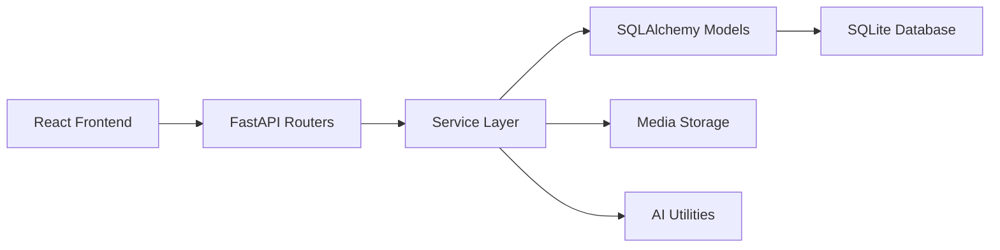
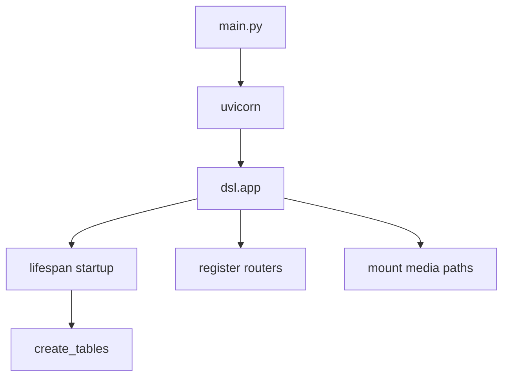

# 系统设计

## 总览

Koda 目前的主线是 DSL 应用：React 前端负责交互与渲染，FastAPI 后端负责 API、文件服务和任务编排，SQLAlchemy 负责将运行账户、任务和日志写入 SQLite。

`ai_agent/` 中的模型配置加载器属于旁路能力，目前更适合作为工具库被复用，而不是 DSL 请求链路上的强耦合组件。

## 高层架构

## 组件职责

### 前端

- 位于 `frontend/src`
- 负责时间流、侧边栏、输入框和编年史视图
- 通过 HTTP 调用后端 API

### API 层

- 位于 `dsl/api`
- 负责参数校验、HTTP 状态码和异常映射
- 目前按资源拆成 `run_accounts`、`tasks`、`logs`、`media`、`chronicle`

### 服务层

- 位于 `dsl/services`
- 封装任务、日志、媒体与导出的业务逻辑
- 这一层是新增能力时最适合放置纯业务规则的地方

### 数据层

- ORM 模型位于 `dsl/models`
- 数据库连接与会话管理位于 `utils/database.py`
- 当前默认数据库是根目录下的 `data/dsl.db`

### 通用底座

- `utils/settings.py` 统一管理配置
- `utils/logger.py` 统一管理控制台和文件日志

## 请求链路

典型的任务或日志请求会经历以下步骤：

1. 前端把表单数据发到 `dsl/api/*`
2. 路由层获取当前运行账户并做基础校验
3. 服务层执行业务逻辑
4. SQLAlchemy 模型写入 SQLite 或读取已有记录
5. 如涉及媒体，文件额外写入 `data/media/`
6. 后端返回结构化响应给前端

## 启动链路

这个设计让本地开发环境足够轻量，但也意味着当前项目更偏向单机开发与快速迭代，而不是复杂的多环境部署架构。
