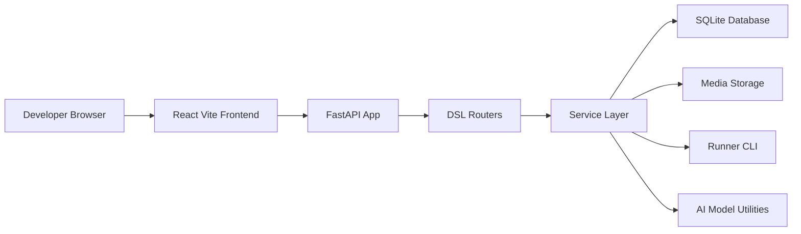
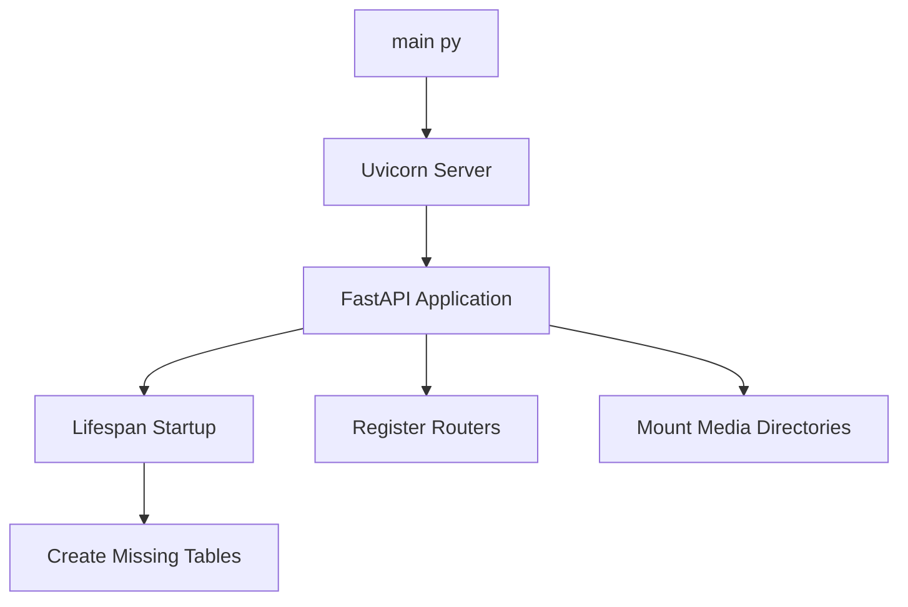
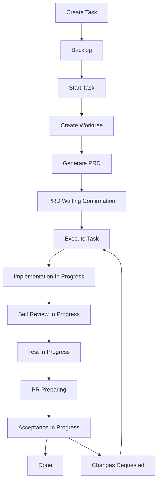

# 系统设计

## 总览

Koda 的当前架构可以概括为：**一个需求卡片工作台 + 一个记录型后端 + 一条可切换执行器的自动化执行链路**。

它不是传统意义上的“通用日志系统”，也不是完整的多代理平台，而是介于两者之间的工程化中台：

- 前端负责把任务、PRD、日志和反馈组织成工作台
- 后端负责保存状态、管理 worktree、按配置调起执行器、回写执行日志，并提供独立 sidecar Q&A
- 数据库存放结构化上下文，文件系统存放媒体和实时日志

## 高层架构

## 入口点

| 位置 | 角色 | 说明 |
| --- | --- | --- |
| `main.py` | 后端启动入口 | 启动 Uvicorn，开发模式监听 `8000` |
| `backend/dsl/app.py` | 应用工厂 | 注册路由、生命周期、媒体挂载与健康检查 |
| `frontend/src/main.tsx` | 前端入口 | 挂载 React 应用 |
| `justfile` | 命令编排入口 | 提供 `run`、`dsl-dev`、`docs-serve`、`docs-build` 等命令 |

## 模块职责

### 后端架构规则

后端代码统一放在 `backend/` 下，当前 DSL 应用的 Python 包路径是 `backend.dsl`。后续新增后端能力时，默认采用领域分层架构：先按业务域划分边界，再在域内保持路由层、应用/服务层、领域规则、数据模型/Schema、基础设施适配器的明确分工。

模块内部采用简洁架构约束依赖方向：API/路由层只负责 HTTP 合同、参数校验、依赖注入和异常映射；服务层负责用例编排与业务规则；模型和 Schema 不触发副作用；CLI runner、WebDAV、邮件、文件系统、隧道等外部能力通过服务层或小型适配器调用。新的业务规则不要写进路由函数，也不要让领域逻辑依赖 FastAPI 请求对象或前端展示细节。

### 前端层

- 主工作台位于 `frontend/src/App.tsx`
- `frontend/src/api/client.ts` 统一封装 HTTP 请求
- `frontend/src/types/index.ts` 提供与后端一致的数据结构
- 界面当前围绕三类视图组织：进行中任务（包含需求已修改但仍在推进中的任务）、已完成/已销毁任务、已删除或已放弃的归档任务
- 任务详情底部 composer 现在明确区分“反馈给执行链路”和“问 AI”两条通道

### 路由层

- `backend/dsl/api/tasks.py`：任务创建、阶段更新、执行触发、PRD 读取、打开目录与日志窗口
- `backend/dsl/api/task_qa.py`：任务内独立问答查询、提问与“整理成反馈草稿”
- `backend/dsl/api/logs.py`：日志创建、命令解析、AI 校正队列
- `backend/dsl/api/media.py`：图片与附件上传
- `backend/dsl/api/chronicle.py`：时间线与 Markdown 导出
- `backend/dsl/api/projects.py` 与 `backend/dsl/api/run_accounts.py`：项目与运行环境上下文管理

### 服务层

- `TaskService`：任务创建、阶段推进、worktree 创建与环境准备
- `TaskQaService`：sidecar Q&A 消息持久化、任务上下文组装、模型调用与失败回写
- `LogService`：命令解析与日志持久化
- `MediaService`：文件落盘与缩略图
- `ChronicleService`：时间线格式化与 Markdown 导出
- `automation_runner`：API 层使用的执行器无关入口（PRD / 执行 / Resume / Completion）
- `codex_runner`：执行器无关主编排（重试、阶段推进、日志落库、lint / review 闭环）
- `runners/registry.py`：Runner 注册中心与配置解析
- `runners/codex_cli_runner.py`、`runners/claude_cli_runner.py`：CLI 适配器

当前 task worktree 的默认根目录是目标仓库父目录下的 `task/`。例如仓库路径是 `/Users/zata/code/my-app` 时，`TaskService.start_task()` 创建的新 worktree 默认路径会是 `/Users/zata/code/task/my-app-wt-12345678`。`worktree_path` 写入任务前，系统还会补齐基础环境准备，包括复制仓库内 `.env*` 文件、按现有策略处理前端依赖，以及在存在 `pyproject.toml` 时执行 `uv sync --all-extras`。
对应任务分支默认采用 `task/<task_id[:8]>-<semantic-slug>`：优先尝试 AI 语义命名，失败时回退为标题规则化 slug，若仍为空再回退为 `task/<task_id[:8]>`，并在日志中记录命名来源。

### 数据层

- `Project`：本地 Git 仓库目录
- `RunAccount`：开发环境与当前活跃身份
- `Task`：需求卡片与工作流阶段
- `DevLog`：时间线中的最小记录单元，也是自动化 transcript 的事实源
- `TaskQaMessage`：任务内独立问答消息，独立于 `DevLog`

自动化 runner 的连续输出不会改写成单条大日志，而是继续按 flush 批次 append 到 `DevLog`。为了解决用户侧“内容不连贯”的阅读问题，新生成的自动化 chunk 会额外携带 `automation_session_id`、`automation_sequence_index`、`automation_phase_label`、`automation_runner_kind`；任务详情时间线和 task 维度 Markdown 导出再基于这些显式元数据，把“相邻且 session 相同”的 chunk 合并成一个连续 transcript block。全局 raw timeline 仍保持逐条 `DevLog` 视图，不做历史回填。

数据库通过 `utils/database.py` 管理，默认落在 `data/dsl.db`。对于文件型 SQLite，连接创建时会统一启用 WAL 和 30 秒 busy timeout，以降低 UI 读接口与后台 DevLog 写入并发时的锁冲突。

## 启动链路

这个启动流程非常轻量，适合单机快速迭代，但也意味着：

- 没有独立迁移器
- 没有异步队列系统
- 没有生产级多进程部署编排

## 需求执行主链路

### 当前真实落地点

上图描述的是**完整目标状态机**，而当前代码里真正自动推进到位的部分是：

- `backlog -> prd_generating -> prd_waiting_confirmation`
- `prd_waiting_confirmation -> implementation_in_progress -> self_review_in_progress -> test_in_progress`

其中 `self_review_in_progress` 不再只是状态切换：`run_codex_task`（内部走统一 runner 编排）在实现完成后会立即触发一次独立的 AI review，review 输出继续写回 `DevLog`。如果 review 发现阻塞问题，系统会继续在同一个 task worktree 中执行有上限的 `review -> 自动回改 -> review` 闭环；只有当自动回改次数耗尽、review 输出持续无效，或 review / 回改阶段本身执行失败时，任务才会回退到 `changes_requested`。

当 self-review 闭环通过后，任务会进一步进入 `test_in_progress`，并执行基于 `.pre-commit-config.yaml` 的 `uv run pre-commit run --all-files`。如果 pre-commit 首次执行返回非零，系统会自动重跑一次；若仍失败，则继续在同一个 task worktree 中执行有上限的 `lint -> AI lint 定向修复 -> lint` 闭环。只有当 lint-fix 次数耗尽、lint-fix 阶段本身执行失败，或相关输出无法继续闭环时，任务才会回退到 `changes_requested`。

`changes_requested` 的当前真实含义也随之收窄为“AI 无法自行完成 review / lint 自动闭环，需要人工介入后重新执行”，不再表示“第一次 review 发现 blocker”。PRD 生成后的确认仍然必须由用户触发，review 与 lint 闭环通过后也不会自动进入 `pr_preparing`；最终 `Complete` 仍由用户明确点击。若任务还停留在 `self_review_in_progress` 且最近一轮 review 尚未出现通过标记，只要后台自动化已经空闲，用户仍可显式触发 `Complete`，后端会先写一条 `DevLog` 记录这次人工接管。

`pr_preparing` 现在也有真实落地：用户点击前端的 `Complete` 后，后端会先把任务推进到 `pr_preparing`，再在该任务的 worktree 中执行确定性的 Git 收尾链路：`git add .`、优先基于最近一轮通过的 AI summary 生成 `git commit -m ...`，若缺失则回退到 `requirement_brief`，再缺失时回退到 `task_title`，随后执行 `git rebase main`；若 `git commit` 被 commit hook 自动改写文件并退出非零，Koda 会自动重新 `git add .` 并重试一次 commit；若 rebase / merge 冲突则自动调用当前 runner（如 Codex）修复，然后复用当前持有 `main` 分支的工作区完成 merge 与清理。合并成功后任务自动进入 `done`；若在合并前失败则回退到 `changes_requested`。后台 watchdog 现在也会覆盖卡住的 `pr_preparing` 任务：如果阶段停留时间超过阈值，且当前进程内只残留一个“运行中”标记、但连 completion start `DevLog`（`🚀 已收到完成请求...`）都没写出来，watchdog 会先清理这类陈旧运行态，再自动走一次 `resume` 补救，而不是让 UI 永久停在“交付收尾中”。

对新任务来说，这个 worktree 路径默认位于 `<repo-parent>/task/` 下；旧任务已经存储的 `worktree_path` 会继续按历史绝对路径工作，不会被自动搬迁。对于 path-aware script 和 raw `git worktree add` fallback，Koda 会在创建后统一执行环境 bootstrap，避免返回“目录存在但不能直接编码”的半成品 worktree。

`test_in_progress` 现在已有第一种真实落地语义：承载 post-review pre-commit lint 与 lint-fix 闭环；更重的容器级集成测试仍属于后续自动化扩展。`acceptance_in_progress` 目前仍主要是为后续自动化预留的阶段定义。

当任务真实阶段停在 `self_review_in_progress` 或 `test_in_progress`，且最近一轮 review / post-review lint 已通过、后台自动化也已经空闲时，前端会通过 `GET /api/tasks/card-metadata` 把 badge 展示覆盖为“等待用户”。这只是展示层状态，真实 `workflow_stage` 不会变成新的 `waiting_user`。

对于关联 Git 项目的未关闭任务，后端现在还会返回一个只读 `branch_health` 投影：它会先按 `task/{task_id[:8]}` 前缀探测本地任务分支，兼容 `task/{task_id[:8]}-<semantic-slug>` 这类真实 worktree 分支名，并把解析结果附加到 `TaskResponse` 与 `TaskCardMetadata`。只有任务已经创建过 `worktree_path`、也就是确实进入过 worktree-backed Git 流程时，`branch_health.manual_completion_candidate=true` 才会把卡片与详情头部统一展示为“缺失分支待确认”。

这个状态并不会自动关闭任务。前端会先要求用户打开完成检查单，确认时间线、项目代码和 worktree 现状后，才允许调用 `POST /api/tasks/{id}/manual-complete`。该接口会写入一条“检测到分支缺失后由用户人工确认完成”的审计 `DevLog`，然后直接把任务收敛到 `workflow_stage=done` 与 `lifecycle_status=CLOSED`，而不会再次执行普通 `git add / commit / rebase / merge / cleanup` 收尾链路。

## 任务与时间线的数据回路

一个典型的任务执行会经过下面的链路：

1. 前端创建 `Task`
2. 用户补充 `DevLog` 或上传附件
3. 后端根据任务上下文构造 Prompt
4. Runner CLI（`codex` 或 `claude`）在项目根目录或 worktree 中执行
5. 标准输出被批量写回 `DevLog`
6. 每次自动化输出落 `DevLog` 时，后端会同步刷新 `Task.last_ai_activity_at`
7. 前端在执行阶段做轻量任务状态轮询，并对当前任务通过 `/api/logs?created_after=...` 增量拉取新增日志，而不是重复重拉大批量时间线
8. 左侧需求卡片与详情头部每 60 秒单独轮询 `/api/tasks/card-metadata`，统一消费 badge 展示态、`last_ai_activity_at` 以及最近一次需求变更快照，这样卡片分组/摘要不再受全局日志分页窗口影响
9. 项目列表只在初始加载和打开项目面板时刷新，避免在每次任务状态轮询时都重新执行项目一致性检查
10. PRD 就绪来源支持三种：默认 AI 生成、从 `tasks/pending/*.md` 选择并移动、手动上传 / 粘贴 Markdown 并导入。非 AI 来源由 `backend/dsl/prd_sources/` 领域切片处理，最终都落到任务专属文件 `tasks/prd-{task_id[:8]}-<requirement-slug>.md`
11. PRD 就绪后，前端通过 `/api/tasks/{id}/prd-file` 读取任务专属文件内容；后端会按该任务前缀做兼容查找，并在需要时自动修正旧固定文件名或随机后缀文件名
12. 当 PRD Markdown 中存在 `## 0. 待确认问题（结构化）` JSON 块时，前端会先解析该块渲染下拉确认卡片，再渲染清洗后的 PRD 正文；如果结构化块 malformed，则前端显示修复提示并阻断“确认 PRD / 开始执行”

其中第 5 步的自动化输出仍然保持 append-only：同一次 runner attempt 的多个 flush chunk 会共享同一个 `automation_session_id`，并在读取侧仅按“相邻且 session 相同”聚合。若中间穿插人工反馈、系统事件或其他普通 `DevLog`，前后 transcript 必须断开，避免跨越真实时序强行拼接。

## Sidecar Q&A 边界

任务内独立问答是主执行链路旁边的一条只读 sidecar：

- 它通过 `/api/tasks/{task_id}/qa/messages` 持久化到独立的 `task_qa_messages` 表
- 它会读取任务标题、需求摘要、当前阶段、最近 `DevLog` 摘要和 PRD 文件内容来回答
- 它默认不会写入 `DevLog`，也不会进入 PRD 生成或编码执行的 Prompt 上下文
- 它的消息状态只影响对应的 Q&A 消息，不影响 `workflow_stage` 和 `is_codex_task_running`
- 主执行链路完成后，已归档任务仍保留 sidecar Q&A 历史与“整理成反馈草稿”入口，但后端会拒绝新的 sidecar 提问与正式反馈写入
- 任务自身进入 `DONE/CLOSED/DELETED` 时，后端仍会补写内部留痕 `DevLog`，避免归档动作丢失时间线审计记录
- 若某条 assistant 回复在恢复窗口内未完成，它会自动从 `pending` 释放为 `failed`；同时数据库/事务层会兜底保证同一任务最多只有 1 条 pending 回复
- 当用户希望把问答结论正式纳入执行链路时，需要显式调用“整理成反馈草稿”，再由用户确认发送正式反馈

为了避免这条链路在 SQLite 上放大锁竞争，任务列表使用聚合查询计算 `log_count`，日志列表在同一条查询中联表带回 `task_title`，而不是在响应阶段触发额外的关系懒加载。

## 外部依赖边界

当前架构依赖三类本地能力：

- Runner CLI：`codex`（默认）或 `claude`（配置切换）用于 PRD 生成与编码执行
- `git worktree`：为任务隔离实现环境
- 可配置的编辑器命令模板与终端启动器：本地开发机体验增强，仅在具备对应命令时可用

因此这套系统的默认运行场景是“开发者自己的本机”，而不是完全无状态的云端服务。
