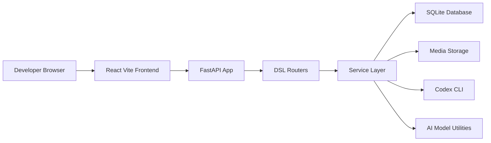
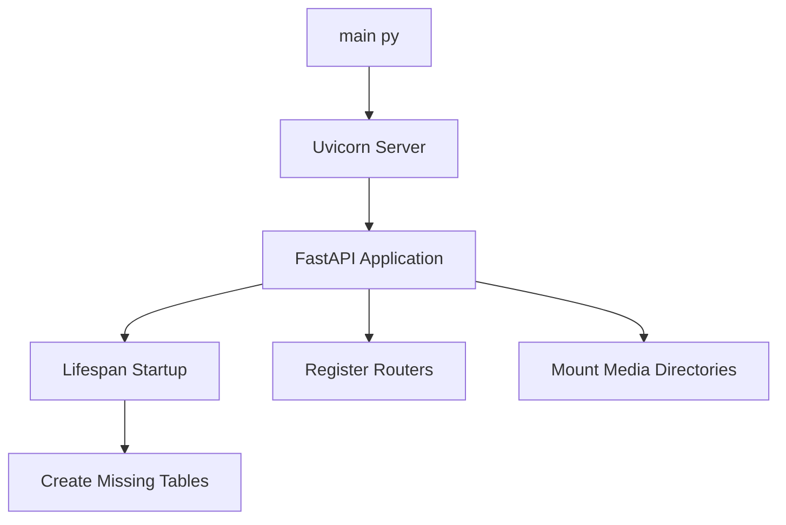
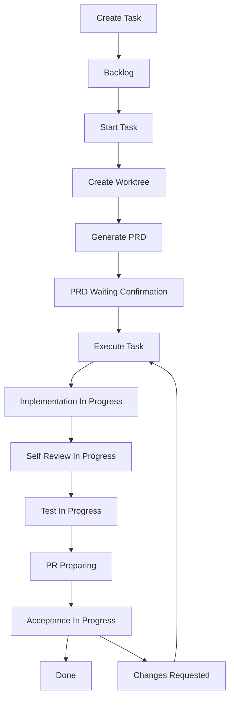

# 系统设计

## 总览

Koda 的当前架构可以概括为：**一个需求卡片工作台 + 一个记录型后端 + 一条接入 Codex 的自动化执行链路**。

它不是传统意义上的“通用日志系统”，也不是完整的多代理平台，而是介于两者之间的工程化中台：

- 前端负责把任务、PRD、日志和反馈组织成工作台
- 后端负责保存状态、管理 worktree、调起 Codex、回写执行日志
- 数据库存放结构化上下文，文件系统存放媒体和实时日志

## 高层架构

## 入口点

| 位置 | 角色 | 说明 |
| --- | --- | --- |
| `main.py` | 后端启动入口 | 启动 Uvicorn，开发模式监听 `8000` |
| `dsl/app.py` | 应用工厂 | 注册路由、生命周期、媒体挂载与健康检查 |
| `frontend/src/main.tsx` | 前端入口 | 挂载 React 应用 |
| `justfile` | 命令编排入口 | 提供 `run`、`dsl-dev`、`docs-serve`、`docs-build` 等命令 |

## 模块职责

### 前端层

- 主工作台位于 `frontend/src/App.tsx`
- `frontend/src/api/client.ts` 统一封装 HTTP 请求
- `frontend/src/types/index.ts` 提供与后端一致的数据结构
- 界面当前围绕三类视图组织：进行中任务、已完成任务、发生变更的任务

### 路由层

- `dsl/api/tasks.py`：任务创建、阶段更新、执行触发、PRD 读取、打开目录与日志窗口
- `dsl/api/logs.py`：日志创建、命令解析、AI 校正队列
- `dsl/api/media.py`：图片与附件上传
- `dsl/api/chronicle.py`：时间线与 Markdown 导出
- `dsl/api/projects.py` 与 `dsl/api/run_accounts.py`：项目与运行环境上下文管理

### 服务层

- `TaskService`：任务创建、阶段推进、worktree 创建
- `LogService`：命令解析与日志持久化
- `MediaService`：文件落盘与缩略图
- `ChronicleService`：时间线格式化与 Markdown 导出
- `codex_runner`：Prompt 构造、`codex exec` 调用、日志回写与阶段推进

### 数据层

- `Project`：本地 Git 仓库目录
- `RunAccount`：开发环境与当前活跃身份
- `Task`：需求卡片与工作流阶段
- `DevLog`：时间线中的最小记录单元

数据库通过 `utils/database.py` 管理，默认落在 `data/dsl.db`。

## 启动链路

这个启动流程非常轻量，适合单机快速迭代，但也意味着：

- 没有独立迁移器
- 没有异步队列系统
- 没有生产级多进程部署编排

## 需求执行主链路

### 当前真实落地点

上图描述的是**完整目标状态机**，而当前代码里真正自动推进到位的部分是：

- `backlog -> prd_generating -> prd_waiting_confirmation`
- `prd_waiting_confirmation -> implementation_in_progress -> self_review_in_progress`

`test_in_progress`、`pr_preparing`、`acceptance_in_progress` 目前主要是为后续自动化预留的阶段定义。

## 任务与时间线的数据回路

一个典型的任务执行会经过下面的链路：

1. 前端创建 `Task`
2. 用户补充 `DevLog` 或上传附件
3. 后端根据任务上下文构造 Prompt
4. `codex exec` 在项目根目录或 worktree 中执行
5. 标准输出被批量写回 `DevLog`
6. 前端在执行阶段每秒轮询一次，实时刷新时间线
7. 如果生成了 PRD，前端通过 `/api/tasks/{id}/prd-file` 读取最新文件内容

## 外部依赖边界

当前架构依赖三类本地能力：

- `codex` CLI：PRD 生成与编码执行
- `git worktree`：为任务隔离实现环境
- `trae-cn` 与 `osascript`：本地开发机体验增强，仅在具备对应命令时可用

因此这套系统的默认运行场景是“开发者自己的本机”，而不是完全无状态的云端服务。
