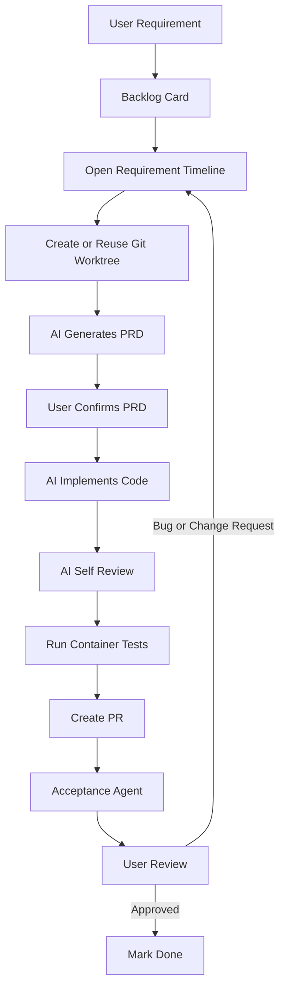

# 技术路线 20260317

## 定位

这一页记录的是 **目标产品理念与技术路线**，不是当前仓库已经全部落地的现状说明。

核心目标是把 Koda 演化成一个面向需求卡片的自动化研发系统：

- 用户输入需求
- 系统把需求沉淀为卡片和历史记录
- AI 在受控流程中完成 PRD、编码、评审、测试和 PR
- 用户与验收员只在必要节点介入
- 问题反馈继续回流到同一需求的历史记录里，形成闭环

## 核心原则

- **所有需求先收口**：用户可以自由输入需求，但系统默认先把它放入待办池，而不是立即开始执行。
- **需求全程有历史**：每次 AI 修改、人工 Review、测试结果和验收反馈都挂在同一需求卡片下。
- **执行前必须确认 PRD**：真正进入编码前，先让 AI 产出 PRD，并由用户确认。
- **执行过程尽量无打扰**：需求确认后，默认进入自动执行阶段，只在必须交互时打断用户。
- **反馈闭环**：验收不通过时，问题重新回到原需求时间线，而不是散落到别处。

## 建议的需求状态机

为了支撑你的理念，建议把需求状态拆成比“待办 / 完成”更细的阶段：

1. `backlog`：用户刚提交，进入待办池
2. `prd_generating`：AI 正在生成 PRD
3. `prd_waiting_confirmation`：PRD 已生成，等待用户确认
4. `implementation_in_progress`：AI 正在编码
5. `self_review_in_progress`：AI 正在做自检与代码评审
6. `test_in_progress`：容器测试或自动化验收执行中
7. `pr_preparing`：准备提交 PR
8. `acceptance_in_progress`：验收员与用户验收中
9. `changes_requested`：AI 无法自行完成闭环，或用户 / 验收员提出修改，需要人工介入
10. `done`：需求验收完成

这套状态机的价值在于：

- 界面上可以明确显示当前卡片卡在哪个阶段
- 自动化任务调度器可以基于状态推进流程
- 历史记录和通知策略可以按阶段挂钩

## 目标流程

### 1. 用户提交需求

用户可以自由输入需求内容。建议默认策略是：

- 每条需求先进入 `todolist` 或 `backlog`
- 不要求用户一开始就写出完整 PRD
- 系统负责后续结构化整理

也就是说，对你在原始描述里的“用户随便写需求，每个需求都放到 todolist 上吗”，文档建议答案是：**是，先统一进入待办池，再由系统决定何时进入执行态。**

### 2. 需求以卡片形式展示

界面上每个需求都是一张卡片。点击卡片后，需要能看到该需求的完整时间线，包括：

- AI 写了什么
- AI 每次修改做了什么
- 人工 Review 提了什么建议和问题
- 测试、验收和回归修复的记录

这里的时间线应当是该需求的唯一事实来源。

### 3. 开始任务时创建 Git Worktree

当用户点击“开始任务”后，系统基于主分支创建对应的 Git worktree。

建议策略：

- worktree 命名与需求 ID 绑定
- 若已存在对应 worktree，则直接复用，不重复创建
- 所有 AI 编码动作都限制在该 worktree 内，避免污染主工作区

### 4. AI 基于需求生成 PRD

系统使用 `codex`、`claude code` 或类似 CLI 工具，在 worktree 中围绕该需求生成 PRD 文档。

PRD 至少应包含：

- 背景与目标
- 功能范围
- 非目标
- 实现约束
- 验收标准
- 测试案例

PRD 生成后，主界面需要向用户展示一份简明确认摘要。

### 5. 用户确认 PRD

在这个节点之前，系统不应该进入真正的编码阶段。用户确认后，需求状态从 `prd_waiting_confirmation` 进入 `implementation_in_progress`。

### 6. AI 无打扰编码

PRD 被确认后，AI 进入默认无打扰模式，自主完成代码修改、文档更新和必要的实现工作。

### 7. AI 自己做 Code Review

编码完成后，AI 需要先做一次自检，重点包括：

- 功能是否覆盖 PRD
- 是否引入明显回归
- 文档是否同步
- 是否存在未处理的错误路径

如果第一次 self-review 发现 blocker，系统不应该立刻把任务抛回人工，而应该先在同一个 worktree 内执行有上限的 `review -> 自动回改 -> review` 闭环。只有当闭环仍然失败，才进入 `changes_requested`。

### 8. 拉起容器做测试

自检通过后，系统应拉起容器化环境执行测试。这里的目标不是只跑单测，而是尽量接近真实运行环境。

建议覆盖：

- 单元测试
- 集成测试
- 关键验收流程

### 9. AI 测试通过后自动创建 PR

测试完成后，系统自动整理变更摘要并发起 PR。

PR 中至少应附带：

- 需求卡片链接
- PRD 链接
- 测试结果摘要
- 自检结论

### 10. 用户交互节点要可预判

某些流程无法完全静默执行，需要提前设计交互点：

- 若流程依赖 API Key，要在需求启动前提醒用户提供
- 若中途可能需要用户决策，要提前收集联系方式，例如邮箱
- 若缺失必要外部资源，要把阻塞原因写入该需求时间线

### 11. 引入验收员

在代码和 PR 生成后，引入一个“验收员”角色，基于第 4 步 PRD 中定义的案例做自动化验收。

这个角色可以是：

- 单独的 AI 验收代理
- 一组自动化测试任务
- 或两者结合

### 12. 用户验收与反馈回环

用户查看最终成品后：

- 如果认可，需求进入完成态
- 如果发现 Bug 或提出修改建议，问题继续写入当前需求的历史记录

一旦进入“提出问题”分支，系统重新回到需求卡片流程中继续推进，而不是创建一条完全孤立的新记录。

### 13. 标记完成

只有当用户认可，且验收链路也通过时，需求才进入 `done`。

## 闭环流程图

## 对现有 DSL 的启发

即使当前仓库还没有完整实现上述流程，这条路线已经明确指出了 DSL 下一步应该补的能力：

- 需求卡片状态机
- 面向单需求的完整时间线
- worktree 生命周期管理
- PRD 生成与确认界面
- AI 执行代理编排
- 容器化测试执行器
- 自动 PR 生成器
- 验收员角色与验收记录

## 当前文档结论

这份路线把系统从“开发日志记录工具”推进到“围绕需求卡片运转的自动化研发平台”。

后续如果开始实施，建议下一步把这份路线拆成更细的功能设计：

1. 卡片与状态机
2. worktree 调度
3. PRD 代理
4. 编码与自检代理
5. 测试与验收代理
6. PR 自动化
