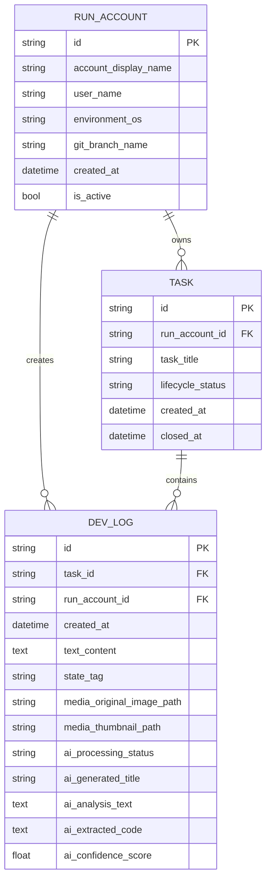

# 数据模型

## 总览

DSL 的数据主链路围绕三个实体展开：

- `RunAccount`：标识当前运行环境与开发者上下文
- `Task`：聚合同一工作主题下的日志
- `DevLog`：记录文本、媒体路径与 AI 解析结果

## 实体关系图

## 实体说明

### RunAccount

`RunAccount` 是 DSL 的上下文锚点。它记录当前是谁、在哪个系统环境里工作，以及当前 Git 分支是什么。绝大多数任务和日志查询都会先定位当前活跃账户。

关键字段：

- `id`：UUID 主键
- `account_display_name`：用于界面展示
- `is_active`：标记当前是否为活跃账户

### Task

`Task` 表示一个工作单元，负责把一组相关日志串起来，并维护生命周期状态。

关键字段：

- `run_account_id`：归属账户
- `task_title`：任务标题
- `lifecycle_status`：如 `OPEN` 或 `CLOSED`
- `closed_at`：关闭时间

### DevLog

`DevLog` 是最细粒度的记录对象，既能存纯文本，也能挂载图片和 AI 结果。

关键字段：

- `task_id`：归属任务
- `text_content`：Markdown 文本
- `state_tag`：日志状态标记
- `media_original_image_path` 与 `media_thumbnail_path`：媒体路径
- `ai_*` 字段：Phase 2 的 AI 处理结果

## 设计备注

- 关系上采用 `RunAccount -> Task -> DevLog` 的主链路，同时 `DevLog` 也直接关联 `RunAccount`，便于跨任务聚合查询。
- 当前通过 `create_tables(Base)` 在启动时自动建表，适合开发期快速迭代。
- 如果后续需要长期演进数据库结构，建议引入正式迁移工具，再补一页迁移规范文档。
