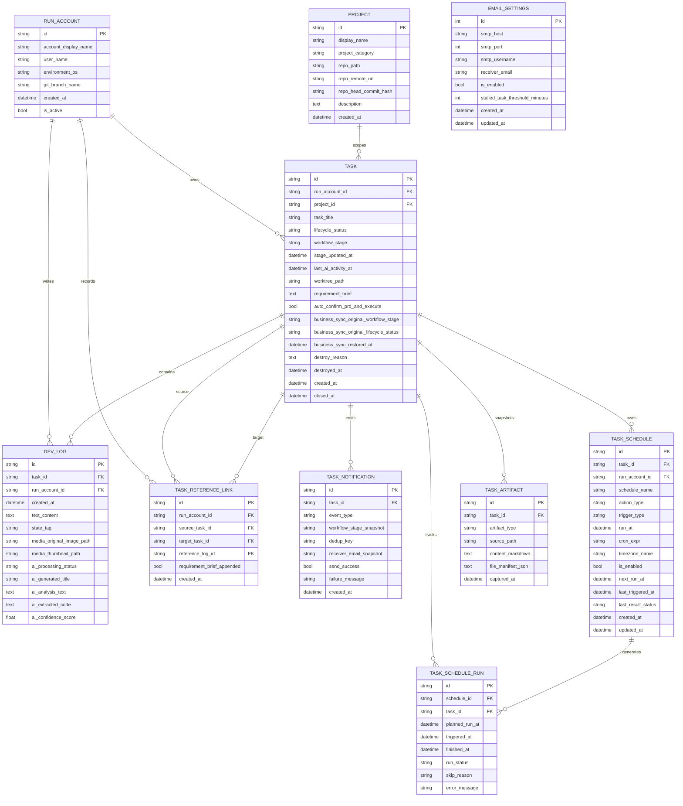

# 数据模型

## 总览

当前数据库围绕十个核心实体组织：

- `RunAccount`：谁在当前机器上运行 DSL
- `Project`：可被任务绑定的本地 Git 仓库
- `Task`：需求卡片与工作流阶段
- `DevLog`：任务时间线中的文本、附件与 AI 结果
- `EmailSettings`：SMTP 与提醒阈值的单例配置
- `TaskNotification`：任务通知的审计记录与去重窗口
- `TaskSchedule`：任务级自动触发规则（once/cron）
- `TaskScheduleRun`：每次调度分发执行记录
- `TaskArtifact`：任务工件快照（PRD 与 planning with files）
- `TaskReferenceLink`：历史需求引用关系（source task -> target task）的审计与去重锚点

## WebDAV 恢复语义

WebDAV 现在有两条并行能力，语义不同：

- 原始数据库备份/恢复：直接上传或恢复整个 SQLite 文件，适合灾备与整机迁移。数据库中的设置、历史记录以及机器相关路径都会原样回来，因此跨设备恢复后仍需要重新检查 `repo_path`、worktree 和本地 Git 状态。
- 业务快照同步：只同步业务事实，包括项目、需求卡片、日志、`TaskArtifact`（PRD / planning 快照）、媒体文件、任务侧边问答和任务引用关系。它不会同步 `repo_path`、`worktree_path`、本地分支是否存在、后台进程是否仍在运行等机器事实。

业务快照恢复的额外约束：

- 导入任务会重绑到“当前活跃 `RunAccount`”，否则卡片会因为账户过滤而在当前机器上不可见。
- 新导入项目不会写入远端机器的 `repo_path`；若当前机器上已存在同 ID 项目，则保留本地 `repo_path`，仅刷新 remote / HEAD 指纹与描述。
- 业务快照恢复的任务会清空 `worktree_path`，并把远端原始阶段/生命周期写入 `business_sync_original_*` 字段。
- 若远端阶段依赖本机代码执行上下文，系统会做安全降级，例如把 `implementation_in_progress` 恢复为 `changes_requested`，把带 PRD 快照的 `prd_generating` 恢复为 `prd_waiting_confirmation`。

## 时间语义契约

- 数据库存储层继续使用 UTC 语义的 naive datetime，不对历史记录做批量 `+8h` 回填。
- API、前端 UI、编年史导出和业务日志统一按 `APP_TIMEZONE`（默认 `Asia/Shanghai`）展示，并输出显式偏移（例如 `+08:00`）。
- 如果新增“用户手填时间”功能，输入时间应先按应用时区解释，再转换回 UTC naive 后持久化。

## 实体关系图

## 实体说明

### RunAccount

`RunAccount` 是整条时间线的运行环境锚点。系统会根据“当前活跃账户”过滤任务和日志。

关键字段：

| 字段 | 说明 |
| --- | --- |
| `id` | UUID 主键 |
| `account_display_name` | 用于前端展示的名称 |
| `user_name` | 本机用户名 |
| `environment_os` | 操作系统 |
| `git_branch_name` | 当前分支信息 |
| `is_active` | 是否为当前活跃账户 |

### Project

`Project` 表示一个可被任务绑定的本地代码仓库。它的核心价值是给任务提供 `repo_path`，便于创建 worktree 和调用 `codex exec`。除了路径本身，项目还会记录仓库的 `origin` remote 与 `HEAD` commit 指纹，用于跨机器恢复时校验你绑定的是不是同一个仓库、是不是同一个同步基线。

需要区分两种 WebDAV 恢复模式：

- 原始数据库恢复：项目记录和其中的 `repo_path` 会原样恢复；如果数据库来自另一台机器，这个路径大概率已经失效，需要在项目面板重新绑定。
- 业务快照恢复：项目的 remote / HEAD 指纹、分类、描述会恢复，但新导入项目的 `repo_path` 会留空；若当前机器已经存在同 ID 项目，则沿用本地 `repo_path`，避免覆盖用户已经重绑好的仓库路径。

关键字段：

| 字段 | 说明 |
| --- | --- |
| `display_name` | 项目显示名称 |
| `project_category` | 项目类别，可供项目时间线按类别聚合 |
| `repo_path` | 本地 Git 仓库绝对路径 |
| `repo_remote_url` | 最近一次保存/同步时记录的归一化 origin remote |
| `repo_head_commit_hash` | 最近一次保存/同步时记录的 HEAD commit hash |
| `description` | 项目描述 |
| `is_repo_path_valid` | API 响应中的派生字段，表示当前机器上该路径是否仍可用 |
| `is_repo_remote_consistent` | API 响应中的派生字段，表示当前 repo 是否仍然指向同一个 remote |
| `is_repo_head_consistent` | API 响应中的派生字段，表示当前 repo HEAD 是否仍与同步基线一致 |

补充说明：

- `project_category` 是持久化字段，由项目面板维护；项目时间线页可以基于它跨多个项目聚合同类日志。
- 若旧数据库是在该字段加入前创建，启动时的增量 schema patch 会自动补列，历史项目默认保持 `NULL`，前端展示为“未分类”。

### Task

`Task` 是需求卡片的核心实体，也是工作流状态的唯一事实来源。

补充说明：WebDAV 原始数据库恢复会把整个任务表原样带回；而业务快照恢复只带回卡片、日志、工件、媒体和侧边问答等业务事实。后者不会把关联 Git 仓库、worktree、本地未提交修改，或真实代码完成进度一起带回来，因此更适合跨设备同步“需求进度视图”，不能等同于“代码侧执行状态已完整同步”。

关键字段：

| 字段 | 说明 |
| --- | --- |
| `run_account_id` | 所属运行账户 |
| `project_id` | 关联项目，可为空 |
| `task_title` | 需求标题 |
| `lifecycle_status` | 生命周期状态 |
| `workflow_stage` | 当前工作流阶段 |
| `stage_updated_at` | 最近一次进入当前阶段的 UTC 时间 |
| `last_ai_activity_at` | 最近一次 Codex 自动化输出写入时间 |
| `worktree_path` | 任务 worktree 绝对路径 |
| `requirement_brief` | 当前持久化的需求摘要 |
| `business_sync_original_workflow_stage` | 业务快照恢复前记录的原始远端阶段 |
| `business_sync_original_lifecycle_status` | 业务快照恢复前记录的原始远端生命周期 |
| `business_sync_restored_at` | 最近一次业务快照恢复到当前机器的时间 |
| `destroy_reason` | 已启动任务销毁原因；普通 backlog 删除通常为空 |
| `destroyed_at` | 任务进入 deleted history 的时间 |
| `closed_at` | 完成或关闭时间 |

需要特别关注的字段：

- `workflow_stage`：任务当前所处的业务阶段；若前端需要判断后台自动化是否仍在执行，还要结合 `TaskResponse.is_codex_task_running`
- `stage_updated_at`：停滞提醒的计算基准。系统只会在任务真正进入新阶段时刷新该值，因此它也是“同一阶段停留窗口”去重的锚点
- `last_ai_activity_at`：只记录最近一次 Codex 自动化输出落库时间，供需求卡片和详情头部展示“最近 AI 活动”使用；它不是通过扫描 worktree 文件时间推导出来的
- `worktree_path`：决定 Codex 实际工作目录
- `project_id`：默认仅允许在 `backlog` 且尚未生成 `worktree_path` 时改绑；若任务是从 WebDAV 业务快照恢复且本机还没有 worktree，也允许先重绑项目再继续本地执行。前端需求卡片列表也会基于它提供按项目/未关联项目的筛选入口
- `business_sync_original_*` / `business_sync_restored_at`：只在 WebDAV 业务快照恢复后出现，用来告诉前端“远端同步时的阶段是什么”以及“当前机器上的安全降级结果是什么”
- `destroy_reason` / `destroyed_at`：用于 started-task destroy 审计。普通 backlog 轻量删除也可能写入 `destroyed_at`，但通常不会有 `destroy_reason`

需要额外说明的是：前端可能把 `self_review_in_progress` 或 `test_in_progress` 这类真实阶段覆盖显示为“等待用户”，但这只是 `GET /api/tasks/card-metadata` 返回的展示态，不会写回 `Task.workflow_stage`，也不会新增持久化 `waiting_user` 阶段。

`lifecycle_status` 目前支持 `OPEN`、`PENDING`、`CLOSED`、`DELETED`、`ABANDONED`；其中 `ABANDONED` 用于表达“明确废弃但保留审计历史”，语义上与 `DELETED` 分离。

新的任务型 worktree 默认会写成仓库同级 `task/` 目录下的绝对路径。例如项目仓库是 `/Users/zata/code/my-app` 时，新任务通常会保存为 `/Users/zata/code/task/my-app-wt-12345678`。已经落库的历史 `worktree_path` 不会被系统自动改写。

### EmailSettings

`EmailSettings` 仍然保持单例（`id=1`）设计，是所有任务邮件通知的配置来源。

关键字段：

| 字段 | 说明 |
| --- | --- |
| `smtp_host` / `smtp_port` / `smtp_username` / `smtp_password` | SMTP 连接参数 |
| `receiver_email` | 当前通知收件人 |
| `is_enabled` | 邮件通知总开关 |
| `stalled_task_threshold_minutes` | `prd_waiting_confirmation` / `changes_requested` 的停滞提醒阈值，默认 20 分钟 |

### TaskReferenceLink

`TaskReferenceLink` 用来持久化“历史需求引用到当前卡片”的 `source -> target` 关系。它的职责不是替代 `DevLog`，而是为引用动作提供稳定的审计锚点和幂等判断，避免同一个来源任务被重复加入同一个目标任务时再次污染时间线和 `requirement_brief`。

关键字段：

| 字段 | 说明 |
| --- | --- |
| `run_account_id` | 执行该引用动作的运行账户 |
| `source_task_id` | 被引用的来源任务 |
| `target_task_id` | 接收引用的目标任务 |
| `reference_log_id` | 首次引用时生成或回填复用的结构化引用日志 |
| `requirement_brief_appended` | 目标任务 `requirement_brief` 是否已包含该来源摘要 |
| `created_at` | 引用关系建立时间 |

补充说明：

- `source_task_id + target_task_id` 组合保持唯一，用于“加入当前需求卡片”的去重。
- 首次创建关系时系统会写入结构化 `TRANSFERRED` DevLog；重复调用会复用已有关系和日志，只在尚未追加摘要时补一次 `requirement_brief`。
- 若完整引用附录会超过 `tasks.requirement_brief` 的 5000 字符上限，系统会退化为紧凑版引用附录；若连紧凑版也无法容纳，则接口直接返回 `422`，避免数据库层溢出为 `500`。

### TaskNotification

`TaskNotification` 记录任务通知的发送审计结果。默认通知类型会保留成功或失败结果；`stalled_reminder` 若当前不可投递或临时投递失败，则不会占用该阶段窗口，方便管理员修复配置后重试。它同时承担“同一阶段窗口只提醒一次”的去重职责。

关键字段：

| 字段 | 说明 |
| --- | --- |
| `task_id` | 所属任务 |
| `event_type` | 通知事件类型，如 `prd_ready`、`manual_interruption`、`stalled_reminder` |
| `workflow_stage_snapshot` | 发送时任务所处的阶段 |
| `dedup_key` | 幂等键；同一任务、同一事件、同一阶段窗口复用同一个键 |
| `receiver_email_snapshot` | 发送时生效的收件人地址 |
| `send_success` | 实际投递是否成功 |
| `failure_message` | SMTP 失败或跳过原因 |

### TaskSchedule

`TaskSchedule` 定义任务的自动触发策略，并记录下次触发时间。调度器只读取启用状态且 `next_run_at <= now` 的规则。

关键字段：

| 字段 | 说明 |
| --- | --- |
| `task_id` | 所属任务 |
| `run_account_id` | 规则创建时的运行账户快照 |
| `schedule_name` | 规则名称 |
| `action_type` | 动作类型：`start_task` / `resume_task` |
| `trigger_type` | 触发类型：`once` / `cron` |
| `run_at` | 一次性触发时间（UTC naive） |
| `cron_expr` | Cron 表达式（5 段） |
| `timezone_name` | 规则解释时区（IANA） |
| `is_enabled` | 规则开关 |
| `next_run_at` | 下次触发时间（UTC naive） |
| `last_triggered_at` | 最近一次触发时间 |
| `last_result_status` | 最近一次执行结果 |

### TaskScheduleRun

`TaskScheduleRun` 是调度器审计表。每次调度分发尝试都会记录一条结果，并通过 `(schedule_id, planned_run_at)` 唯一键确保同一窗口不重复写入。

关键字段：

| 字段 | 说明 |
| --- | --- |
| `schedule_id` | 所属调度规则 |
| `task_id` | 所属任务（冗余快照） |
| `planned_run_at` | 计划触发时间 |
| `triggered_at` | 实际触发时间 |
| `finished_at` | 处理完成时间 |
| `run_status` | `succeeded` / `failed` / `skipped` |
| `skip_reason` | 跳过原因 |
| `error_message` | 失败原因 |

### DevLog

`DevLog` 是最细粒度的时间线记录。无论是用户反馈、附件、系统提示还是 Codex 输出，最终都汇聚到这里。

关键字段：

| 字段 | 说明 |
| --- | --- |
| `task_id` | 所属任务 |
| `run_account_id` | 所属运行账户 |
| `text_content` | Markdown 文本 |
| `state_tag` | 状态标记，如 `BUG`、`FIXED` |
| `media_original_image_path` | 原图或附件路径 |
| `media_thumbnail_path` | 缩略图路径 |
| `ai_*` | AI 解析结果预留字段 |

### TaskArtifact

`TaskArtifact` 用于持久化任务关键工件快照，避免仅依赖 worktree 文件导致历史不可回溯。

关键字段：

| 字段 | 说明 |
| --- | --- |
| `task_id` | 所属任务 |
| `artifact_type` | 工件类型，当前支持 `PRD`、`PLANNING_WITH_FILES` |
| `source_path` | 工件来源（文件路径或日志锚点） |
| `content_markdown` | 工件正文 |
| `file_manifest_json` | 关联文件清单（JSON 数组字符串） |
| `captured_at` | 快照采集时间 |

当前快照来源策略：

- `PRD`：优先从任务 worktree 的 `tasks/prd-{task_id[:8]}.md` 读取，并在 PRD 生成后及任务完成前刷新快照
- `PLANNING_WITH_FILES`：优先从任务 worktree 的 `.claude/planning/current/{task_plan,findings,progress}.md` 读取，兼容旧根目录 planning 文件；若文件不存在，再回退到历史 DevLog 中的 planning 摘要文本

它们也是 WebDAV 业务快照同步的核心组成部分，因此跨设备恢复后依然可以看到最近一次 PRD / planning 状态，即使本机 worktree 还未重建。

## 设计观察

### 目前没有 JSONB 字段

所有 AI 结果和媒体路径都是显式列，而不是放在 JSON 字段里。这让前端读取更直接，但也意味着字段扩展需要修改表结构。

### 当前没有迁移表

仓库里没有 Alembic 或等价迁移工具。表结构通过共享数据库初始化逻辑自动补齐，默认在应用启动时执行，并在首次创建数据库会话时兜底执行一次。它适合快速开发，不适合复杂演进。详见[迁移策略](migrations.md)。

### 媒体路径存的是相对项目根的字符串

这让后端可以直接把路径映射到静态目录，但部署时必须确保 `data/media/` 作为持久目录保留下来。WebDAV 业务快照同步不会只传递这些路径字符串，还会把被日志引用的实际媒体文件一起打包进 ZIP，因此恢复后附件链接仍能落到同名文件上。
