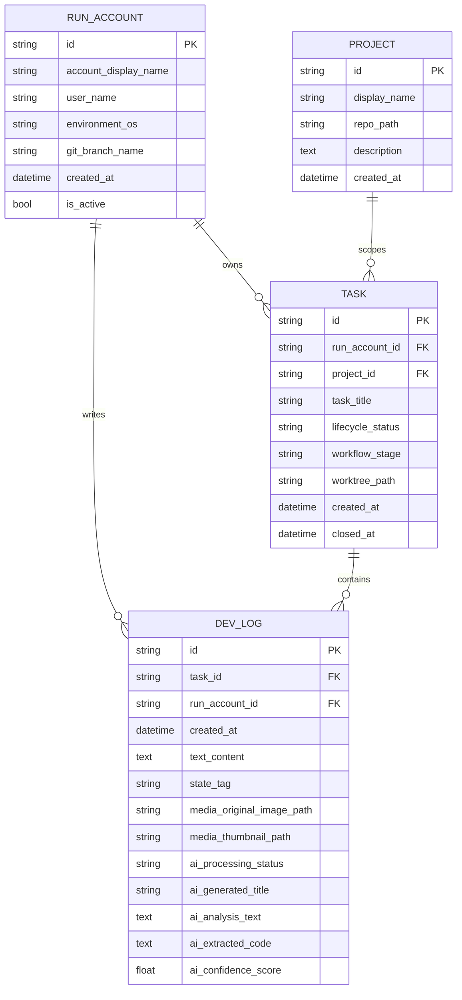

# 数据模型

## 总览

当前数据库围绕四个核心实体组织：

- `RunAccount`：谁在当前机器上运行 DSL
- `Project`：可被任务绑定的本地 Git 仓库
- `Task`：需求卡片与工作流阶段
- `DevLog`：任务时间线中的文本、附件与 AI 结果

## 实体关系图

## 实体说明

### RunAccount

`RunAccount` 是整条时间线的运行环境锚点。系统会根据“当前活跃账户”过滤任务和日志。

关键字段：

| 字段 | 说明 |
| --- | --- |
| `id` | UUID 主键 |
| `account_display_name` | 用于前端展示的名称 |
| `user_name` | 本机用户名 |
| `environment_os` | 操作系统 |
| `git_branch_name` | 当前分支信息 |
| `is_active` | 是否为当前活跃账户 |

### Project

`Project` 表示一个可被任务绑定的本地代码仓库。它的核心价值是给任务提供 `repo_path`，便于创建 worktree 和调用 `codex exec`。除了路径本身，项目还会记录仓库的 `origin` remote 与 `HEAD` commit 指纹，用于跨机器恢复时校验你绑定的是不是同一个仓库、是不是同一个同步基线。

注意：`repo_path` 是机器本地路径。若你通过 WebDAV 恢复了另一台机器上的数据库备份，项目记录会保留，但 `repo_path` 可能失效，需要在项目面板中重新绑定当前机器上的仓库路径。重绑后，系统还会继续检查 remote 与 commit hash 是否和同步时记录的指纹一致。

关键字段：

| 字段 | 说明 |
| --- | --- |
| `display_name` | 项目显示名称 |
| `repo_path` | 本地 Git 仓库绝对路径 |
| `repo_remote_url` | 最近一次保存/同步时记录的归一化 origin remote |
| `repo_head_commit_hash` | 最近一次保存/同步时记录的 HEAD commit hash |
| `description` | 项目描述 |
| `is_repo_path_valid` | API 响应中的派生字段，表示当前机器上该路径是否仍可用 |
| `is_repo_remote_consistent` | API 响应中的派生字段，表示当前 repo 是否仍然指向同一个 remote |
| `is_repo_head_consistent` | API 响应中的派生字段，表示当前 repo HEAD 是否仍与同步基线一致 |

### Task

`Task` 是需求卡片的核心实体，也是工作流状态的唯一事实来源。

关键字段：

| 字段 | 说明 |
| --- | --- |
| `run_account_id` | 所属运行账户 |
| `project_id` | 关联项目，可为空 |
| `task_title` | 需求标题 |
| `lifecycle_status` | 生命周期状态 |
| `workflow_stage` | 当前工作流阶段 |
| `worktree_path` | 任务 worktree 绝对路径 |
| `closed_at` | 完成或关闭时间 |

需要特别关注的字段：

- `workflow_stage`：前端按钮和状态展示的唯一依据
- `worktree_path`：决定 Codex 实际工作目录

新的任务型 worktree 默认会写成仓库同级 `task/` 目录下的绝对路径。例如项目仓库是 `/Users/zata/code/my-app` 时，新任务通常会保存为 `/Users/zata/code/task/my-app-wt-12345678`。已经落库的历史 `worktree_path` 不会被系统自动改写。

### DevLog

`DevLog` 是最细粒度的时间线记录。无论是用户反馈、附件、系统提示还是 Codex 输出，最终都汇聚到这里。

关键字段：

| 字段 | 说明 |
| --- | --- |
| `task_id` | 所属任务 |
| `run_account_id` | 所属运行账户 |
| `text_content` | Markdown 文本 |
| `state_tag` | 状态标记，如 `BUG`、`FIXED` |
| `media_original_image_path` | 原图或附件路径 |
| `media_thumbnail_path` | 缩略图路径 |
| `ai_*` | AI 解析结果预留字段 |

## 设计观察

### 目前没有 JSONB 字段

所有 AI 结果和媒体路径都是显式列，而不是放在 JSON 字段里。这让前端读取更直接，但也意味着字段扩展需要修改表结构。

### 当前没有迁移表

仓库里没有 Alembic 或等价迁移工具。表结构通过共享数据库初始化逻辑自动补齐，默认在应用启动时执行，并在首次创建数据库会话时兜底执行一次。它适合快速开发，不适合复杂演进。详见[迁移策略](migrations.md)。

### 媒体路径存的是相对项目根的字符串

这让后端可以直接把路径映射到静态目录，但部署时必须确保 `data/media/` 作为持久目录保留下来。
