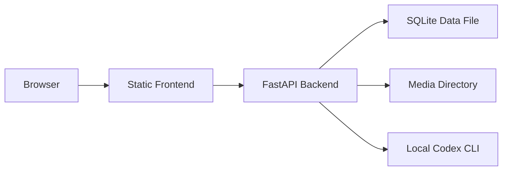

# 部署说明

## 总览

当前仓库的默认形态是**单机开发工作台**，不是已经包装好的生产部署模板。

这意味着：

- 后端默认用 `uvicorn` 开发模式启动
- 数据库默认是本地 SQLite
- 媒体文件落在本机目录
- `codex`、`trae-cn`、`osascript` 等能力都依赖开发机环境

因此本页更准确的定位是“现状说明 + 最小可运行部署建议”，而不是成熟的生产手册。

## 当前可运行拓扑



## 最小部署建议

### 方案一

本地开发机直接运行，适合作者自己使用：

```bash
uv sync
cd frontend && npm install && cd ..
just dsl-dev
```

### 方案二

前后端分离，适合轻量内网环境：

1. 后端机器运行 FastAPI
2. 前端执行 `npm run build`，将 `frontend/dist` 交给静态站点服务
3. 反向代理把 `/api` 与 `/media` 转发到后端
4. 持久化 `data/` 与 `logs/`

## 后端部署注意事项

- 当前 `main.py` 使用了 `reload=True`，只适合开发环境。
- 如果你要长期运行，建议改为显式的生产启动命令，而不是直接依赖开发模式。
- `data/dsl.db`、`data/media/`、`logs/` 都应该映射到持久化目录。
- 如果需要自动生成 PRD 或代码，运行后端的机器上必须安装 `codex` CLI。

## 前端部署注意事项

- 前端本身不内嵌到 FastAPI 中，当前仓库没有后端托管 `frontend/dist` 的逻辑。
- `frontend/vite.config.ts` 中的代理配置只对开发模式生效。
- 生产环境需要自己提供静态站点服务，并配置 API 基础路径。

## 当前限制

### 数据库

- 没有 Alembic
- 没有迁移回滚能力
- 对已有 SQLite 文件的结构变更依赖人工操作

### 安全

- 目前没有鉴权
- 没有多用户隔离
- 运行账户只是本机开发上下文，不是认证体系

### 自动化执行

- `open-in-trae` 依赖本机存在 `trae-cn`
- `open-terminal` 依赖 macOS `osascript`
- `codex exec` 在本机代码仓库中直接执行，适合受控开发环境，不适合无隔离多租户环境

## 如果要走向生产

建议至少补齐以下能力：

1. 引入正式迁移工具
2. 拆分后台任务执行器，避免把长任务完全压在 FastAPI 进程内
3. 为 `codex` 执行增加权限边界和审计
4. 引入鉴权与项目级访问控制
5. 为媒体文件接入对象存储或稳定持久卷

!!! warning "待补充"
    当前仓库没有现成的 `Dockerfile`、生产 `compose` 编排或反向代理配置。本页记录的是现状和建议，不代表仓库已经具备生产级发布方案。
