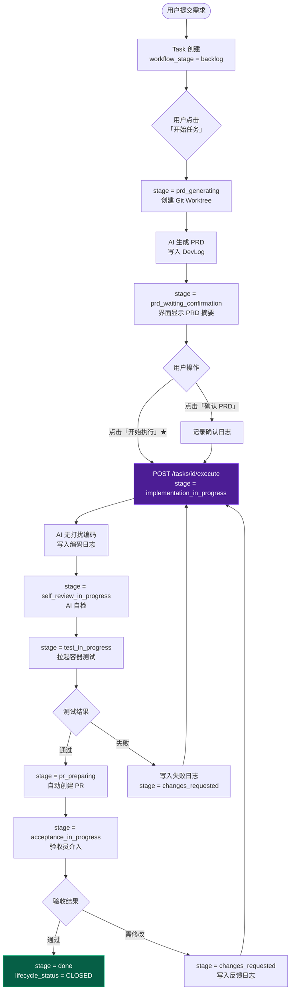
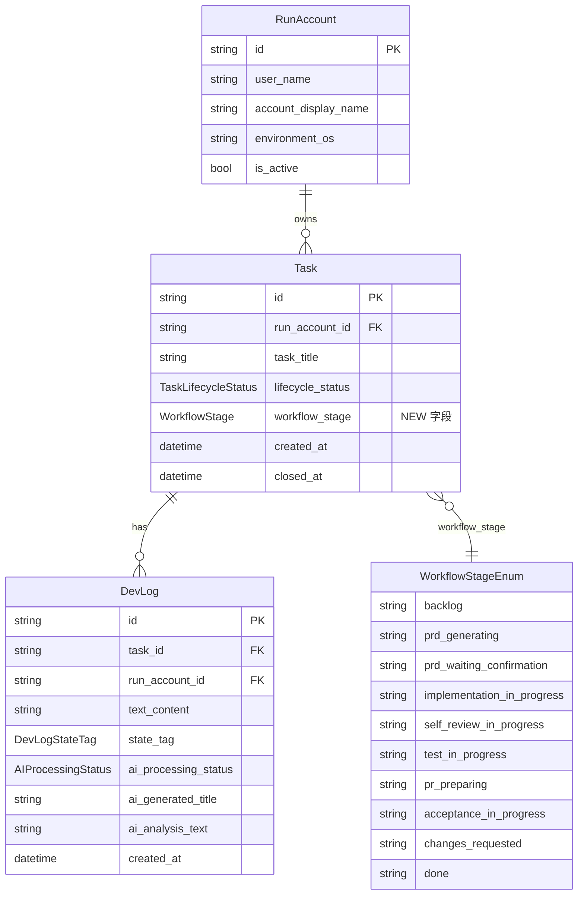

# PRD：需求卡片自动化研发工作流

**文件路径**：`tasks/20260317-174953-prd-requirement-workflow.md`
**创建时间**：2026-03-17 17:49:53
**参考文档**：`docs/architecture/technical-route-20260317.md`

---

## 1. 背景与目标

### 问题描述

Koda 当前是一个开发日志记录工具，具备基础的任务/日志管理能力，但缺少完整的需求驱动自动化研发流程。前端重写后，页面上遗失了「**开始执行**」按钮，且整体工作流停留在"手动记录"阶段，没有状态机支撑的自动化执行链路。

### 目标

- [ ] 补全缺失的「开始执行」（Start Execution）按钮，使用户能在 PRD 确认后触发 AI 编码阶段
- [ ] 将现有 4 状态生命周期（OPEN / CLOSED / PENDING / DELETED）升级为支持完整工作流的 10 阶段状态机
- [ ] 后端新增 `workflow_stage` 字段，前端阶段判断从"基于日志数量的启发式推算"改为"读取实际 DB 字段"
- [ ] 完整实现从需求提交 → PRD → 确认 → 执行 → 自检 → 测试 → PR → 验收 → 完成的闭环界面交互

---

## 2. 实现指南（技术规格）

### 核心数据流

```
用户提交需求
  → Task 创建 (workflow_stage=backlog)
  → [按钮] 开始任务 → AI 生成 PRD (prd_generating → prd_waiting_confirmation)
  → [按钮] 确认 PRD + 开始执行 → AI 编码 (implementation_in_progress)
  → AI 自检 → 测试 → PR → 验收 → done
```

### 2.1 变更矩阵（Change Matrix）

| Change Target | 当前状态 | 目标状态 | 修改方式 | 受影响文件 |
|---|---|---|---|---|
| **Task.workflow_stage** (DB 字段) | 不存在；前端用日志数量启发式推断阶段 | 新增 `workflow_stage` 枚举列，10 个值 | 在 `task.py` 添加字段；`enums.py` 新增枚举；Alembic migration | `dsl/models/task.py`, `dsl/models/enums.py`, `dsl/schemas/task_schema.py` |
| **TaskLifecycleStatus 枚举** | 4 值：OPEN/CLOSED/PENDING/DELETED | 保持不变（向后兼容），但语义绑定 workflow_stage | 不修改枚举值，通过 service 层联动 workflow_stage | `dsl/models/enums.py` |
| **WorkflowStage 枚举**（新增） | 不存在 | 10 阶段：backlog / prd_generating / prd_waiting_confirmation / implementation_in_progress / self_review_in_progress / test_in_progress / pr_preparing / acceptance_in_progress / changes_requested / done | 新增枚举类 | `dsl/models/enums.py`, `dsl/schemas/task_schema.py` |
| **后端 API：更新 workflow_stage** | 不存在 | `PUT /api/tasks/{task_id}/stage` | 新增路由 + service 方法 | `dsl/api/tasks.py`, `dsl/services/task_service.py` |
| **后端 API：开始执行** | 不存在 | `POST /api/tasks/{task_id}/execute` | 新增路由，触发 stage → implementation_in_progress；写入系统日志 | `dsl/api/tasks.py`, `dsl/services/task_service.py` |
| **TaskResponseSchema** | 无 workflow_stage 字段 | 增加 `workflow_stage: WorkflowStage` | 修改 Pydantic schema | `dsl/schemas/task_schema.py` |
| **前端 Task 类型** | 无 workflow_stage | 添加 `workflow_stage: WorkflowStage` | 更新 TypeScript interface | `frontend/src/types/index.ts` |
| **前端 RequirementStage 类型** | 9 值字符串联合，基于日志数量推断 | 与后端 WorkflowStage 对齐（10 值）；`deriveRequirementStage` 改为直接读取 `task.workflow_stage` | 修改类型定义 + `deriveRequirementStage` 函数 | `frontend/src/App.tsx` (line 26-35, line 1372-1421) |
| **「开始执行」按钮** | **缺失** | 在 stage=`prd_waiting_confirmation` 时显示，点击调用 `POST /execute` | 在 `devflow-detail__actions` 区域添加按钮 + `handleStartExecution` handler | `frontend/src/App.tsx` (line 813-874) |
| **前端 API 客户端** | 无 execute / updateStage 方法 | 新增 `taskApi.execute(id)` 和 `taskApi.updateStage(id, stage)` | 在 taskApi 对象中新增方法 | `frontend/src/api/client.ts` |
| **数据库迁移** | tasks 表无 workflow_stage 列 | 新增 `workflow_stage VARCHAR DEFAULT 'backlog'` | Alembic revision 或启动时自动 create_tables（现有模式） | `alembic/versions/` 或 `utils/database.py` |

### 2.2 完整工作流流程图



### 2.3 低保真原型（Action Bar 区域）

```
┌─────────────────────────────────────────────────────────────┐
│  需求标题                                   [stage badge]   │
│  需求描述摘要…                                               │
├─────────────────────────────────────────────────────────────┤
│  工作流阶段                                                   │
│  [backlog]→[prd_gen]→[prd_wait★]→[impl]→[review]→[test]→…  │
│             ↑当前阶段（高亮蓝色）                            │
├─────────────────────────────────────────────────────────────┤
│  操作区域（Action Bar）                                       │
│                                                              │
│  Stage = backlog:                                            │
│    [▶ 开始任务]                                              │
│                                                              │
│  Stage = prd_waiting_confirmation:                           │
│    [✓ 确认 PRD]  [⚡ 开始执行 ← ★ 缺失的按钮]               │
│                                                              │
│  Stage = implementation_in_progress / …:                     │
│    （自动执行中，无手动按钮；可查看实时日志）                  │
│                                                              │
│  Stage = acceptance_in_progress:                             │
│    [✅ 验收通过]  [↩ 请求修改]                               │
├─────────────────────────────────────────────────────────────┤
│  时间线（Timeline）                                           │
│  ● 系统事件 / 🤖 AI 日志 / 👤 人工 Review                   │
└─────────────────────────────────────────────────────────────┘
```

### 2.4 ER 图（数据模型变更）



### 2.8 交互原型变更日志

| 文件路径 | 变更类型 | 变更前 | 变更后 | 原因 |
|---|---|---|---|---|
| `docs/prototypes/requirement-workflow-demo.html` | 新建 | 不存在 | 完整可交互工作流演示，含 10 阶段状态机、「开始执行」按钮、时间线渲染 | 演示完整工作流的按钮状态和阶段推进行为 |

### 2.9 交互原型链接

`docs/prototypes/requirement-workflow-demo.html`

通过 `uv run mkdocs serve` 启动后访问，或直接在浏览器中打开文件预览交互行为。

---

## 3. 完成标准（Global DoD）

- [ ] `mypy` / TypeScript 类型检查通过，无新增类型错误
- [ ] 数据库迁移可无损执行（现有 tasks 记录 workflow_stage 默认为 `backlog`）
- [ ] 「开始执行」按钮在 `prd_waiting_confirmation` 阶段可见且可点击
- [ ] 点击「开始执行」后，stage 正确变更为 `implementation_in_progress`，并写入系统日志
- [ ] `deriveRequirementStage` 不再依赖日志数量启发式，改为直接读取 `task.workflow_stage`
- [ ] 现有功能（创建任务、写日志、媒体上传、编年史导出）无回归
- [ ] 遵循项目代码规范（Google Style Docstring、SSA 命名、`encoding='utf-8'`）

---

## 4. 用户故事

### US-001：「开始执行」按钮

**描述**：作为用户，我希望在确认 PRD 后能点击「开始执行」按钮，触发 AI 进入编码阶段，而不需要手动切换状态。

**验收标准**：
- [ ] 当 `workflow_stage = prd_waiting_confirmation` 时，Detail 区域显示「⚡ 开始执行」按钮（primary/purple 样式）
- [ ] 点击后按钮进入 busy 状态（spinner），调用 `POST /api/tasks/{id}/execute`
- [ ] 后端将 `workflow_stage` 更新为 `implementation_in_progress`
- [ ] 后端写入一条系统日志：`"执行已启动，AI 进入无打扰编码阶段。"`
- [ ] 前端刷新后按钮消失，Stage badge 更新为「实现中」

---

### US-002：完整状态机支持

**描述**：作为用户，我希望需求卡片清晰展示当前处于哪个研发阶段，阶段信息来自数据库而非启发式推算。

**验收标准**：
- [ ] `Task` 对象包含 `workflow_stage` 字段，前端直接读取
- [ ] `deriveRequirementStage` 函数简化为 `return task.workflow_stage`（或直接移除）
- [ ] StatusBadge 和状态机进度条正确反映 10 个阶段
- [ ] 新创建的 Task `workflow_stage` 默认为 `backlog`

---

### US-003：「开始任务」绑定 backlog 阶段

**描述**：「开始任务」按钮的显示条件从基于 `lifecycle_status` 改为基于 `workflow_stage = backlog`，避免条件逻辑混乱。

**验收标准**：
- [ ] 当 `workflow_stage = backlog` 时显示「▶ 开始任务」
- [ ] 点击后 `workflow_stage` 更新为 `prd_generating`，`lifecycle_status` 更新为 `OPEN`
- [ ] 其余阶段不显示「开始任务」

---

### US-004：验收节点人工介入

**描述**：作为用户/验收员，当需求到达 `acceptance_in_progress` 时，我希望能点击「验收通过」或「请求修改」。

**验收标准**：
- [ ] `acceptance_in_progress` 阶段显示「✅ 验收通过」和「↩ 请求修改」两个按钮
- [ ] 「验收通过」→ `workflow_stage = done`，`lifecycle_status = CLOSED`
- [ ] 「请求修改」→ `workflow_stage = changes_requested`，写入反馈日志，后续可重新进入 `implementation_in_progress`

---

## 5. 功能需求

| ID | 需求描述 |
|----|---------|
| FR-1 | 后端 `Task` 模型新增 `workflow_stage` 字段，类型为 `WorkflowStage` 枚举，默认值 `backlog` |
| FR-2 | 新增后端枚举 `WorkflowStage`，包含 10 个值（见变更矩阵） |
| FR-3 | 新增 API `POST /api/tasks/{task_id}/execute`，原子操作：更新 stage + 写入系统日志 |
| FR-4 | 新增 API `PUT /api/tasks/{task_id}/stage`，通用阶段更新接口，供各阶段按钮使用 |
| FR-5 | `TaskResponseSchema` 包含 `workflow_stage` 字段 |
| FR-6 | 前端 `Task` interface 添加 `workflow_stage: WorkflowStage` |
| FR-7 | 前端 `taskApi` 新增 `execute(id)` 和 `updateStage(id, stage)` 方法 |
| FR-8 | 前端 `devflow-detail__actions` 区域在 `prd_waiting_confirmation` 阶段渲染「开始执行」按钮 |
| FR-9 | `deriveRequirementStage` 改为直接返回 `task.workflow_stage`，不再依赖日志数量 |
| FR-10 | 数据库迁移：tasks 表新增 `workflow_stage` 列，已有记录填充默认值 `backlog` |
| FR-11 | Stage badge 颜色映射扩展至 10 个阶段 |
| FR-12 | 状态机进度条组件（可选，参考原型）展示当前阶段在全流程中的位置 |

---

## 6. 非目标（Out of Scope）

- **AI 编码 Agent 实现**：本 PRD 仅实现「触发执行」的界面交互和状态流转，AI 真正执行编码的 agent 逻辑不在本期范围
- **Git Worktree 管理**：worktree 创建/复用/清理属于独立模块，不在本期实现
- **容器化测试执行器**：测试阶段的实际容器调度不在本期范围
- **自动 PR 创建**：PR 自动生成逻辑不在本期范围
- **多用户权限**：当前架构为单 RunAccount，多用户访问控制不在范围
- **Alembic 完整迁移链路**：若项目当前用 `create_tables` 初始化，本期可用 `server_default` + 重建方式处理，不要求引入完整 Alembic
