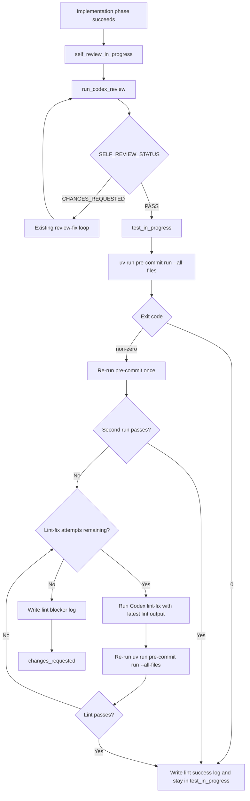

# PRD：AI 自检通过后执行基于 pre-commit 的 lint 校验

**原始需求标题**：`当自检 code review 完成之后，需要进行 lint检查 '/Users/zata/code/koda/.pre-commit-config.yaml'`  
**需求名称（AI 归纳）**：`AI 自检通过后执行 pre-commit lint 校验`  
**需求背景/上下文**：`当前 Koda 在 self-review 闭环通过后尚未自动执行仓库级 lint；本需求要求在 AI 自检完成之后，按 .pre-commit-config.yaml 定义补上一轮自动校验。`  
**文件路径**：`tasks/20260320-163011-prd-post-self-review-pre-commit-lint.md`  
**创建时间**：`2026-03-20 16:30:11 +0800`  
**适用链路**：`dsl/services/codex_runner.py::run_codex_task`、`dsl/services/codex_runner.py::run_codex_review`

---

## 0. 澄清问题（按现有仓库模式给出推荐默认值）

以下问题是 `/prd` workflow 要求必须先澄清、但当前需求文本没有完全写明的部分。本文先按推荐选项起草；如果后续产品决定不同，应先修订 PRD 再开始实现。

### 0.1 self-review 通过后，lint 应挂在哪个 workflow stage？

A. 继续停留在 `self_review_in_progress`，仅通过日志说明 lint 正在执行  
B. 进入 `test_in_progress`，把 lint 视为已落地的第一类自动化验证  
C. self-review 通过后直接进入 `pr_preparing`

> **Recommended: B**  
> `WorkflowStage.TEST_IN_PROGRESS` 已在 `dsl/models/enums.py`、`frontend/src/types/index.ts`、`frontend/src/App.tsx` 和 `dsl/services/task_service.py` 中建模，且前端、轮询与 `Complete` 入口已兼容该阶段。把 post-review lint 作为首个真实落地的自动化验证，最符合现有状态机设计，也比继续挤在 `self_review_in_progress` 更清晰。

### 0.2 lint 命令应采用什么范围？

A. 执行 `uv run pre-commit run --all-files`，完全以 `.pre-commit-config.yaml` 为准  
B. 只执行 `just lint`，即 `ruff check` + `ruff format --check`  
C. 只对本次变更文件执行 pre-commit

> **Recommended: A**  
> 用户明确点名了 `.pre-commit-config.yaml`，而该文件顶部注释也直接给出了 `uv run pre-commit run --all-files` 作为标准执行方式。仓库还配置了 `check-yaml`、`check-toml`、`check_guidelines_consistency` 等非 Ruff 钩子；仅跑 `just lint` 会漏掉这部分约束。

### 0.3 pre-commit 出现“已自动修复文件”时，应如何判定结果？

A. 首次非零退出就视为失败  
B. 允许自动重跑一次；若第二次通过，则视为 lint 通过  
C. 直接进入新的 Codex 修复轮次

> **Recommended: B**  
> 当前 `.pre-commit-config.yaml` 已启用 `trailing-whitespace`、`end-of-file-fixer`、`ruff --fix`、`ruff-format` 等可自动改写文件的 hook。若第一次执行因为这些自动修复而退出非零，直接判失败会制造伪 blocker；先自动重跑一次更符合 pre-commit 的常规使用方式。

### 0.4 lint 在自动重跑后仍失败时，任务应如何处理？

A. 写入明确 lint blocker 日志，并推进到 `changes_requested`  
B. 直接让 Codex 读取 lint 输出并自动继续修复  
C. 允许用户忽略 lint 失败，继续点击 `Complete`

> **Recommended: B**  
> 按当前决策，post-review lint 不会在第二次 pre-commit 失败后立刻结束，而是进入一个有上限的 `lint -> Codex 定向修复 -> lint` 闭环。这个做法也与现有 `dsl/services/codex_runner.py` 中的 `review -> 自动回改 -> review` 设计保持一致：先让 AI 尝试在同一个 worktree 内自愈，只在 lint-fix 额度耗尽后才进入 `changes_requested`。

### 0.5 lint 通过后是否自动进入 Git 收尾？

A. 不自动提交，任务保持在 `test_in_progress`，等待用户显式点击 `Complete`  
B. lint 通过后自动进入 `pr_preparing`  
C. lint 通过后回退到 `self_review_in_progress`

> **Recommended: A**  
> 当前实现 Prompt 与完成链路都明确要求“不要默认执行 `git commit`，必须等待用户确认”。本需求只扩展验证链路，不改变人工控制边界。

以下 PRD 按当前确认选项 **B / A / B / B / A** 起草。


---

## 1. Introduction & Goals

### 背景

当前 Koda 的执行链路已经落地到：

1. `run_codex_task` 完成实现后推进到 `self_review_in_progress`
2. `run_codex_review` 在同一 worktree 中执行 review-only 自检
3. self-review 闭环通过后，任务仍停留在 `self_review_in_progress`

但仓库级验证在这里出现空档：系统没有基于 `.pre-commit-config.yaml` 自动补跑 lint，也没有把其结果写回任务时间线。这导致 AI 自检虽然通过，仍可能在后续手工提交前暴露基础格式、配置、Ruff 或指导文件一致性问题。

本需求的目标是在 self-review 闭环成功之后，自动进入一轮基于 pre-commit 的 lint 校验，并把结果纳入现有工作流、日志和失败语义中。

### 可衡量目标

- [ ] self-review 闭环通过后，任务自动进入 post-review lint 流程
- [ ] lint 执行完全以 `.pre-commit-config.yaml` 为准，而不是只跑 `ruff`
- [ ] 对可自动修复的 pre-commit hook，系统允许自动重跑一次再判定最终结果
- [ ] 当二次 pre-commit 仍失败时，系统会把 lint 输出交给 Codex 做定向修复并继续重跑
- [ ] lint 成功后，不自动 commit / merge，仍保留用户点击 `Complete` 的边界
- [ ] lint 失败时，`DevLog` 与 `/tmp/koda-<task短ID>.log` 能给出明确 blocker 输出
- [ ] 自动化测试与文档同步覆盖新的 `self_review_in_progress -> test_in_progress` 语义

## 2. Implementation Guide

### 核心逻辑

本需求不改变 PRD 生成、人工确认和最终 `Complete` 的契约；变化只发生在 `self_review_in_progress` 成功后的自动化验证链路。

推荐实现路径：

1. 保留 `run_codex_task -> run_codex_review` 的现有实现与 review-fix 闭环。
2. 当 `run_codex_review` 最终返回 `PASS` 时，不再直接结束后台任务，而是：
   - 将任务推进到 `test_in_progress`
   - 写入“开始执行 post-review lint”的日志
   - 触发新的 lint 子流程
3. lint 子流程复用 `dsl/services/codex_runner.py` 现有 `_run_logged_command(...)` 能力，在 task worktree 中执行：
   - `uv run pre-commit run --all-files`
4. 若首次执行返回非零：
   - 先记录完整输出
   - 允许自动再次执行同一命令一次，覆盖“hook 已自动修复文件”的常见场景
5. 第二次执行通过时：
   - 写入“lint 通过，可进入 Complete”的成功日志
   - 任务保持在 `test_in_progress`
   - 后台自动化结束，等待用户显式点击 `Complete`
6. 第二次执行仍失败时：
   - 基于最近一次 pre-commit 的 stdout / stderr 构造单独的 lint-fix Prompt
   - 让 Codex 在同一个 task worktree 中做定向修复，只处理 lint 明确指出的问题
   - 修复完成后重新执行 `uv run pre-commit run --all-files`
7. lint-fix 需要有固定小上限，推荐新增类似 `_MAX_POST_REVIEW_LINT_FIX_ROUNDS = 2` 的常量；只有在额度耗尽后仍未通过时，任务才推进到 `changes_requested`
8. lint-fix Prompt 必须明确禁止 AI 重新发散实现、禁止执行 `git commit`、`git rebase`、`git merge`，并要求优先围绕最新 lint 输出做最小修复
9. 文档与测试同步更新，明确 `test_in_progress` 现在已有第一种真实自动化落地点，即 post-review lint 与 lint-fix 闭环。

### 2.1 Change Matrix

| Change Target | Current State | Target State | How to Modify | Affected Files |
|---|---|---|---|---|
| Post-review orchestration | self-review `PASS` 后直接结束后台执行，任务仍停在 `self_review_in_progress` | self-review `PASS` 后自动进入 `test_in_progress` 并触发 lint / lint-fix 闭环 | 在 `run_codex_task` / `run_codex_review` 之间补一层结构化成功返回值或后置调用，使 review 成功能继续串行执行 lint | `dsl/services/codex_runner.py` |
| Lint executor | 当前没有任何 post-review lint 阶段 | 新增基于 pre-commit 的 lint 执行函数 | 在 `codex_runner` 中新增 `run_post_review_lint(...)` 或等价辅助函数，复用 `_run_logged_command(...)` 和现有任务日志路径 | `dsl/services/codex_runner.py` |
| Command contract | lint 规则散落在 `just lint` 和 `.pre-commit-config.yaml`，自动化链路未明确选边 | 自动化链路以 `.pre-commit-config.yaml` 为主，执行 `uv run pre-commit run --all-files` | 在 PRD、实现和文档里明确 post-review lint 的唯一命令合同，并说明为何不只跑 `ruff` | `.pre-commit-config.yaml`, `dsl/services/codex_runner.py`, `docs/guides/codex-cli-automation.md` |
| Auto-fix rerun behavior | pre-commit 自动修复型 hook 尚未被工作流消费 | 首次失败后允许自动重跑一次，再判定最终结果 | 在 lint 辅助函数中加入最多 1 次自动重跑逻辑，并写清楚每次执行的日志文案 | `dsl/services/codex_runner.py`, `tests/test_codex_runner.py` |
| Lint-fix prompt and scope | 当前没有消费 lint 输出的专用 Prompt | 新增 lint-fix Prompt，要求 AI 只修复最新 pre-commit 输出中的 blocker | 参考现有 review-fix Prompt 模式，新增 `build_codex_lint_fix_prompt(...)` 或等价函数，并附带最新 lint 输出与轮次信息 | `dsl/services/codex_runner.py`, `tests/test_codex_runner.py` |
| Failure semantics | `changes_requested` 主要承接 review 闭环失败或完成阶段失败 | `changes_requested` 额外承接“post-review lint 与 lint-fix 闭环额度耗尽后仍失败” | 统一失败日志模板，让 lint blocker 也符合“AI 无法自行完成闭环”的现有语义 | `dsl/services/codex_runner.py`, `dsl/models/enums.py`, `docs/architecture/system-design.md` |
| API / stage narration | `execute_task` 相关说明只覆盖实现与 self-review | 文档和接口说明覆盖实现、self-review、lint 三段串行流程 | 更新接口 docstring、开发指南和评测步骤 | `dsl/api/tasks.py`, `docs/guides/dsl-development.md`, `docs/dev/evaluation.md` |
| Regression coverage | 现有测试只覆盖实现、自检闭环和完成收尾 | 新增 lint 直接通过、lint-fix 后通过、lint-fix 耗尽失败三类场景 | 扩展 fake subprocess / fake codex 队列，断言阶段推进、日志顺序和失败回退 | `tests/test_codex_runner.py` |

### 2.2 Flow Diagram



### 2.3 Low-Fidelity Prototype

```text
┌──────────────────────────────────────────────────────────────────┐
│ Task Detail                                                     │
│ Stage Badge: Testing                                            │
├──────────────────────────────────────────────────────────────────┤
│ Timeline                                                        │
│                                                                  │
│ ✅ AI 自检闭环完成：第 2 轮评审通过                              │
│ 🧪 进入自动化验证阶段：开始执行 pre-commit lint                  │
│ $ uv run pre-commit run --all-files                              │
│ ... hook output ...                                              │
│ ⚠️ 首次 lint 执行返回非零，检测到可自动修复型改写，开始重跑      │
│ $ uv run pre-commit run --all-files                              │
│ ❌ 第二次仍失败，开始执行 AI lint-fix（Round 1/2）               │
│ 🤖 Codex 根据最新 lint 输出修复格式 / Ruff / hook blocker       │
│ $ uv run pre-commit run --all-files                              │
│ ✅ lint 通过，可由用户点击 Complete                              │
│                                                                  │
│ 失败分支：                                                        │
│ ❌ lint-fix 额度耗尽后仍未通过，任务进入 changes_requested       │
└──────────────────────────────────────────────────────────────────┘
```

### 2.4 ER Diagram

本需求不引入新的数据库表、字段或持久化关系，因此不需要新增 Mermaid `erDiagram`。

需要强调的仅是业务语义变化：

- `Task.workflow_stage` 仍复用现有枚举值，不新增 stage
- `DevLog` 继续作为 lint 输出的唯一时间线载体
- lint 重跑次数首期不做数据库持久化，只保留在当前后台执行上下文与任务日志中

### 2.8 Interactive Prototype Change Log

No interactive prototype file changes in this PRD.

### 2.9 Interactive Prototype Link

Not applicable. This requirement does not introduce or modify an interactive prototype page.

## 3. Global Definition of Done (DoD)

- [ ] Typecheck and Lint passes
- [ ] Follows existing project coding standards
- [ ] No regressions in existing features
- [ ] `run_codex_task` 成功后可自动串行执行 self-review 与 post-review lint
- [ ] self-review `PASS` 后任务会进入 `test_in_progress`
- [ ] post-review lint 使用 `.pre-commit-config.yaml` 定义执行，而不是只跑 `just lint`
- [ ] pre-commit 首次非零退出时，系统会自动重跑一次
- [ ] lint 第二次仍失败时，系统会启动 Codex lint-fix，而不是立刻进入 `changes_requested`
- [ ] lint-fix Prompt 只围绕最新 lint 输出做定向修复，不重新发散实现
- [ ] 只有在 lint-fix 额度耗尽后，任务才进入 `changes_requested`
- [ ] lint 通过后，不会自动执行 `git commit`、`git rebase`、`git merge`
- [ ] `tests/test_codex_runner.py` 覆盖 lint 成功、lint-fix 成功与 lint-fix 耗尽回退三类场景
- [ ] `just docs-build` 通过，且文档已同步说明新的阶段推进语义

## 4. User Stories

### US-001：AI 自检通过后自动执行 lint

**Description:** As a maintainer, I want the system to automatically run repository lint after AI self-review passes so that validation does not rely on a manual terminal step.

**Acceptance Criteria:**
- [ ] self-review 闭环返回 `PASS` 后，系统自动开始执行 pre-commit lint
- [ ] lint 执行目录仍为当前 task worktree
- [ ] lint 输出继续写入 `DevLog` 与 `/tmp/koda-<task短ID>.log`

### US-002：自动修复型 hook 不应制造伪失败

**Description:** As an operator, I want pre-commit auto-fix hooks to be handled gracefully so that trivial formatting fixes do not immediately abort the task.

**Acceptance Criteria:**
- [ ] 首次 pre-commit 非零退出后，系统允许自动重跑一次
- [ ] 第二次通过时，任务不会进入 `changes_requested`
- [ ] 日志能区分“首次执行”与“自动重跑”

### US-003：lint 失败时由 AI 继续定向修复

**Description:** As a developer, I want lint blockers to be fed back into Codex as a targeted fix loop so that automation can self-heal before asking for manual intervention.

**Acceptance Criteria:**
- [ ] 第二次 lint 仍失败时，系统会启动独立的 lint-fix Prompt
- [ ] lint-fix 只能围绕最新 lint 输出修复，不得顺手扩展业务实现
- [ ] 只有在 lint-fix 轮次耗尽后，任务才进入 `changes_requested`

### US-004：保留最终收尾的人工控制

**Description:** As a repository owner, I want lint success to stop before Git finalization so that commit and merge still require explicit user intent.

**Acceptance Criteria:**
- [ ] lint 通过后任务不会自动进入 `pr_preparing`
- [ ] 后台自动化空闲后，用户仍通过 `Complete` 进入 Git 收尾
- [ ] 文档明确说明“新增的是 lint 校验，不是自动提交”

## 5. Functional Requirements

1. **FR-1:** 系统必须在 self-review 闭环最终返回 `PASS` 后自动启动 post-review lint，而不是直接结束后台任务。
2. **FR-2:** 系统必须把任务从 `self_review_in_progress` 推进到 `test_in_progress` 后再执行 lint。
3. **FR-3:** post-review lint 的默认命令必须是 `uv run pre-commit run --all-files`，并以仓库根目录的 `.pre-commit-config.yaml` 为唯一规则来源。
4. **FR-4:** lint 命令必须在当前 task worktree 中执行，不能回落到 Koda 仓库根目录或其他目录。
5. **FR-5:** lint 执行过程必须继续复用现有任务日志机制，把命令、输出和退出码同步写入 `DevLog` 与 `/tmp/koda-<task短ID>.log`。
6. **FR-6:** 当首次 pre-commit 执行返回非零时，系统必须自动再执行一次相同命令，以吸收 auto-fix hook 的常规改写场景。
7. **FR-7:** 第二次 lint 执行通过时，系统必须写入明确成功日志，并保持任务停留在 `test_in_progress`，等待用户显式点击 `Complete`。
8. **FR-8:** 第二次 lint 执行仍失败时，系统必须构造独立的 lint-fix Prompt，把最近一轮 pre-commit 输出交给 Codex 做定向修复。
9. **FR-9:** lint-fix Prompt 必须明确要求 AI 只修复 lint 输出指出的问题，不得重新大范围发散实现，也不得执行 `git commit`、`git rebase`、`git merge`。
10. **FR-10:** 系统必须支持至少一轮、推荐两轮的 `lint -> lint-fix -> lint` 自动闭环；首期可用代码常量定义上限。
11. **FR-11:** 只有在 lint-fix 轮次耗尽后，系统才可将任务推进到 `changes_requested`，并把失败原因记录为需要人工介入的 blocker。
12. **FR-12:** lint-fix 成功后，系统必须重新执行 pre-commit，并仅在 lint 最终通过时保持任务停留在 `test_in_progress`。
13. **FR-13:** 本需求不得改变 `Complete` 阶段既有的 Git 收尾顺序，也不得取消“不要默认执行 git commit”的人工边界。
14. **FR-14:** 自动化测试必须覆盖至少三个新场景：self-review 通过后 lint 直接通过；self-review 通过后 lint-fix 后通过；lint-fix 轮次耗尽后回退到 `changes_requested`。
15. **FR-15:** 文档必须同步更新 `Codex 自动化`、`DSL 开发指南`、`系统设计` 与 `评测与验证` 页面，明确 `test_in_progress` 现已承担 post-review lint 与 lint-fix 闭环的真实落地语义。

## 6. Non-Goals

- 不在本期实现无上限的 lint-fix 自愈；必须使用固定小上限
- 不在本期引入新的数据库字段来持久化 lint 轮次、lint 摘要或 hook 级状态
- 不在本期替换 `.pre-commit-config.yaml` 的规则集合，只消费其现有定义
- 不在本期接入容器级集成测试、验收代理或自动 PR 创建
- 不在本期改变 `Complete` 的人工触发方式与 Git 收尾顺序
