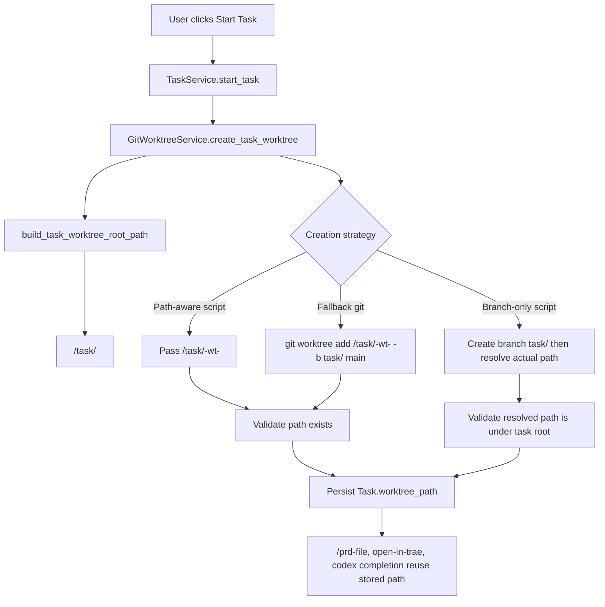

# PRD：将所有 Git Worktree 统一放入 `../task/` 目录

**文件路径**：`tasks/20260319-003316-prd-worktrees-under-task-dir.md`
**创建时间**：`2026-03-19 00:33:16 +0800`
**需求标题**：`put all worktree into ../task folder`
**需求上下文**：`put all worktree put into ../task folder`

---

## 0. 澄清问题（按现有仓库模式给出推荐默认值）

以下问题是 `/prd` workflow 要求的关键澄清项。由于当前任务是直接生成 PRD，本文先按推荐选项起草，后续如有业务决定变化，可据此修订。

### 0.1 新的默认 worktree 子目录命名应是什么？

A. `../task/<repo-name>-wt-<task8>`
B. `../task/<task8>`
C. `../task/task/<task8>`

> **Recommended: A**
> 现有 `dsl/services/git_worktree_service.py` 已经把 basename 固定为 `<repo>-wt-<task8>`，`tests/test_git_worktree_service.py` 也围绕该命名断言。只改变根目录、不改变 basename，改动面最小。

### 0.2 当 `../task/` 目录不存在时应如何处理？

A. 自动创建 `../task/` 及缺失父目录
B. 直接报错，要求人工先创建
C. 仅在开发环境自动创建，生产环境报错

> **Recommended: A**
> 当前 Koda 的 worktree 创建是 `TaskService.start_task()` 的自动链路，人工前置创建目录会破坏“点击开始任务即可执行”的体验，也不符合现有自动化模式。

### 0.3 对已落库的旧 `worktree_path` 应如何处理？

A. 仅影响新创建的 worktree；旧任务保留原绝对路径，不自动迁移
B. 启动时自动移动旧 worktree 到 `../task/`
C. 只改数据库中的路径字符串，不移动磁盘目录

> **Recommended: A**
> `Task.worktree_path` 是后续 `/prd-file`、`open-in-trae`、完成态 merge/cleanup 的真实工作目录。自动搬迁 live worktree 风险过高，而“新任务新规则、旧任务继续可读”最稳妥。

### 0.4 对 repo-local 的 branch-only 脚本（`git_worktree.sh`）应采用什么兼容策略？

A. 继续支持，但创建后必须解析真实路径，并校验最终路径位于 `../task/` 下
B. 停止支持 branch-only 脚本，只保留可显式传 path 的脚本
C. 继续支持，且不限制脚本最终创建到哪里

> **Recommended: A**
> 当前 `dsl/services/git_worktree_service.py` 已支持 `git_worktree.sh`。直接移除兼容性会破坏现有仓库接入，而不做路径约束又违背本需求“put all worktree into ../task folder”的目标。

以下 PRD 按推荐选项 A / A / A / A 起草。

---

## 1. 背景与目标

当前 Koda 在 `TaskService.start_task()` 中调用 `GitWorktreeService.create_task_worktree()` 为项目型任务创建隔离工作区，并把绝对路径写入 `Task.worktree_path`。下游链路如 `GET /api/tasks/{id}/prd-file`、`POST /api/tasks/{id}/open-in-trae` 与完成态 Git 收尾流程都直接依赖这个路径。

现状存在两个问题：

- 默认 fallback 路径由 `build_task_worktree_path()` 生成，格式为仓库同级的 `<repo>-wt-<task8>`
- branch-only 脚本分支的预期路径却隐含为 `../task/<task8>` 风格，说明不同创建策略之间的根目录策略并不一致

本需求的目标是把“所有新建 task worktree 的根目录”统一收敛到目标仓库父目录下的 `task/` 目录，例如：

- 项目仓库：`/Users/zata/code/my-app`
- 新默认 worktree 根目录：`/Users/zata/code/task/`
- 新默认 worktree 路径：`/Users/zata/code/task/my-app-wt-12345678`

### 目标

- [ ] 所有新创建的 task worktree 默认落在目标仓库父目录的 `task/` 子目录下
- [ ] `new-worktree.sh` / `create-worktree.sh` / fallback `git worktree add` 的落盘根目录策略保持一致
- [ ] branch-only `git_worktree.sh` 继续兼容，但其结果必须被校验为位于 `../task/` 下
- [ ] 不修改数据库 schema，继续复用 `Task.worktree_path` 存储最终绝对路径
- [ ] 更新测试与文档，避免代码与 MkDocs 描述再次出现路径语义分叉

---

## 2. 实现指南（技术规格）

### 核心逻辑

当前路径控制点集中在 `dsl/services/git_worktree_service.py`，这是本需求的单一事实源，技术实现应尽量收敛在该服务中，而不是把路径拼接散落到 API、前端或 `codex_runner`。

推荐实现路径：

1. 在 `GitWorktreeService` 中新增 `build_task_worktree_root_path(repo_root_path)`，统一返回 `repo_root_path.parent / "task"`
2. 让 `build_task_worktree_path(repo_root_path, task_id)` 基于该 root 生成默认路径：`<task-root>/<repo-name>-wt-<task8>`
3. 在真正执行创建前确保 `task/` 根目录存在
4. 对可显式传 path 的脚本与 fallback `git worktree add`，直接传入新的默认路径
5. 对 branch-only 脚本，创建完成后通过 `git worktree list --porcelain` 或等价查询解析该 branch 对应的真实目录，并校验其位于 `task/` 根目录内
6. `TaskService.start_task()` 继续只做两件事：调用服务创建 worktree、把返回值写入 `Task.worktree_path`
7. 下游 API 与 `codex_runner` 将继续把 `worktree_path` 当成透明绝对路径使用，无需知道其根目录策略

### 2.1 Change Matrix

| Change Target | Current State | Target State | How to Modify | Affected Files |
|---|---|---|---|---|
| Worktree root strategy | 默认 fallback 使用 `repo_root.parent / "<repo>-wt-<task8>"` | 所有新建 worktree 的默认根目录统一为 `repo_root.parent / "task"` | 在 `GitWorktreeService` 内新增 root helper，并让默认 path builder 基于该 helper 生成路径 | `dsl/services/git_worktree_service.py`, `tests/test_git_worktree_service.py` |
| Path-aware script invocation | `new-worktree.sh` / `create-worktree.sh` 接收旧路径 | 接收 `../task/<repo>-wt-<task8>` | 保持脚本发现逻辑不变，只替换传参路径来源 | `dsl/services/git_worktree_service.py`, `tests/test_git_worktree_service.py` |
| Branch-only script compatibility | 当前预期路径推断脆弱，且未显式校验最终结果是否位于 `../task/` | 创建后解析真实 worktree 路径，并强制要求路径在 `../task/` 根目录内 | 为 branch-only 模式增加“按 branch 反查路径 + root containment validation” | `dsl/services/git_worktree_service.py`, `tests/test_git_worktree_service.py` |
| Task path persistence | `TaskService.start_task()` 保存服务返回的 worktree 绝对路径 | 继续保存绝对路径，但内容变为 `../task/...` 根目录下的新地址 | 维持 schema 不变，只更新日志与测试断言 | `dsl/services/task_service.py`, `tests/test_task_service.py` |
| Completion/open flows | 下游链路读取任意绝对 `worktree_path` | 下游链路继续工作，且示例/测试路径更新为 `../task/...` | 更新高层回归测试中的样例路径，不修改业务流程 | `tests/test_codex_runner.py`, `dsl/api/tasks.py` |
| Documentation | 文档只描述“有 worktree_path”，未统一说明新的目录规范 | 文档明确：新建 worktree 默认位于 sibling `task/` 目录 | 更新架构、数据库、验证清单与概览文档 | `docs/architecture/system-design.md`, `docs/database/schema.md`, `docs/dev/evaluation.md`, `docs/index.md` |

### 2.2 Flow Diagram



### 2.3 Low-Fidelity Prototype

```text
/Users/zata/code/
├── my-app/
│   └── .git/
└── task/
    ├── my-app-wt-12345678/
    │   ├── tasks/
    │   │   └── prd-12345678.md
    │   ├── frontend/
    │   └── ...
    └── my-app-wt-87654321/
        └── ...

Task.worktree_path:
  /Users/zata/code/task/my-app-wt-12345678
```

说明：

- `task/` 是每个目标仓库父目录下的统一 worktree 根目录
- basename 默认继续使用 `<repo>-wt-<task8>`，从而减少已有测试、日志与认知模型的变更成本
- branch-only 脚本若因仓库历史原因产出不同子目录名，只要最终仍位于 `task/` 根目录内即可接受

### 2.4 ER Diagram

本需求**不涉及数据库表结构、字段或实体关系变化**，因此不需要新增 Mermaid `erDiagram`。

需要明确的是：

- `Task.worktree_path` 继续保留为绝对路径字段
- 变化发生在“路径生成规则”，而不是“数据模型结构”

### 2.8 Interactive Prototype Change Log

No interactive prototype file changes in this PRD.

### 2.9 Interactive Prototype Link

Not applicable. This requirement does not introduce or modify an interactive prototype page.

---

## 3. Global Definition of Done（DoD）

- [ ] `GitWorktreeService.build_task_worktree_path()` 的默认返回值已变为 `repo_root.parent / "task" / "<repo>-wt-<task8>"`
- [ ] 当 `../task/` 不存在时，系统会自动创建目录后再执行 worktree 创建
- [ ] path-aware 脚本模式与 fallback `git worktree add` 模式都在 `../task/` 下创建 worktree
- [ ] branch-only 脚本模式在创建后会解析真实路径，并在路径不位于 `../task/` 下时明确失败
- [ ] `TaskService.start_task()` 写入的新 `worktree_path` 可被 `/prd-file`、`open-in-trae`、完成态 merge/cleanup 继续正常消费
- [ ] 旧任务若仍保存历史路径，只要磁盘目录存在，系统继续按旧绝对路径工作，不强制迁移
- [ ] `uv run pytest tests/test_git_worktree_service.py tests/test_task_service.py tests/test_codex_runner.py` 通过
- [ ] `uv run mkdocs build` 无警告通过
- [ ] 实现遵循现有代码规范：Google Style Docstring、明确命名、Windows-safe UTF-8 I/O 约束不被破坏
- [ ] 相关文档页已更新，且手工验证步骤能反映新目录结构

---

## 4. User Stories

### US-001：统一新建 worktree 的根目录

**Description:** As an operator, I want every new task worktree created under a sibling `task/` directory so that repository parents stay predictable and clean.

**Acceptance Criteria:**
- [ ] 默认路径变为 `<repo-parent>/task/<repo>-wt-<task8>`
- [ ] `task/` 根目录缺失时系统自动创建
- [ ] `Task.worktree_path` 中保存的是实际创建成功后的绝对路径

### US-002：兼容不同的 worktree 创建策略

**Description:** As a maintainer, I want path-aware scripts, branch-only scripts, and built-in Git fallback to follow the same root-directory rule so that task execution behavior is deterministic.

**Acceptance Criteria:**
- [ ] `new-worktree.sh` / `create-worktree.sh` 接收到的新路径参数位于 `../task/` 下
- [ ] `git_worktree.sh` 创建完成后，系统能按 branch 解析出真实目录
- [ ] 若解析出的真实目录不位于 `../task/` 下，系统返回清晰错误而不是静默接受

### US-003：保持下游任务链路无回归

**Description:** As a developer, I want PRD 读取、打开目录和完成态 Git 收尾继续依赖 `Task.worktree_path`，so that changing the root folder does not break downstream workflows.

**Acceptance Criteria:**
- [ ] `/api/tasks/{id}/prd-file` 仍能读取 worktree 内的 `tasks/prd-<task8>.md`
- [ ] `/api/tasks/{id}/open-in-trae` 仍能打开真实 worktree 目录
- [ ] 完成态 `git add / commit / rebase / merge / cleanup` 流程继续基于新路径运行

### US-004：补齐测试与文档

**Description:** As a team member, I want tests and MkDocs pages updated together with the path-rule change so that future维护者不会误解 worktree 的目录约定。

**Acceptance Criteria:**
- [ ] 回归测试覆盖新的默认路径、自动创建目录与 branch-only 兼容行为
- [ ] 文档中出现的 worktree 路径示例与实现一致
- [ ] 验证文档明确要求检查新 worktree 是否落在 `../task/` 目录

---

## 5. Functional Requirements

1. **FR-1:** 系统必须将 task worktree 的默认根目录计算为 `repo_root_path.parent / "task"`。
2. **FR-2:** 系统必须将默认 worktree 目录名保留为 `<repo-name>-wt-<task8>`，除非由兼容的 branch-only 脚本生成其他子目录名。
3. **FR-3:** 在执行任何 worktree 创建命令前，系统必须确保 `../task/` 目录已存在。
4. **FR-4:** 当仓库存在 `new-worktree.sh` 或 `create-worktree.sh` 时，系统必须把 `../task/...` 下的新目标路径作为显式参数传入。
5. **FR-5:** 当仓库存在 branch-only `git_worktree.sh` 时，系统必须在脚本执行后解析该 `task/<task8>` 分支对应的真实 worktree 路径。
6. **FR-6:** 对 branch-only 脚本解析出的真实路径，系统必须校验它位于 `repo_root_path.parent / "task"` 下；若不满足，必须报错并阻止任务继续推进。
7. **FR-7:** `TaskService.start_task()` 必须继续把创建成功后的 worktree 绝对路径写入 `Task.worktree_path`，且不引入新的数据库字段。
8. **FR-8:** `/api/tasks/{id}/prd-file`、`/api/tasks/{id}/open-in-trae` 与完成态 Git 收尾流程必须继续把 `Task.worktree_path` 当作唯一目录来源。
9. **FR-9:** 回归测试必须覆盖 fallback、path-aware script、branch-only script 三类创建策略中至少前两类的真实行为，并对第三类提供路径校验用例。
10. **FR-10:** 文档必须给出明确示例：若项目仓库为 `/Users/zata/code/my-app`，则新 worktree 默认位于 `/Users/zata/code/task/my-app-wt-12345678`。
11. **FR-11:** 旧任务已经保存的历史 `worktree_path` 不应被自动重写或搬迁；系统只改变新建 worktree 的路径策略。
12. **FR-12:** 错误信息必须明确指出“实际路径不在 `../task/` 根目录下”或“创建后未找到预期目录”，便于定位 repo-local 脚本问题。

---

## 6. Non-Goals

- 不在本期引入新的数据库表、字段或迁移机制
- 不在本期新增“自定义 worktree 根目录”的 UI、环境变量或 per-project 配置
- 不在本期改变任务分支命名规则 `task/<task8>`
- 不自动迁移、移动或重写已经存在的历史 worktree 目录
- 不修改前端交互或新增原型页面
- 不处理与本需求无关的 Git merge/cleanup 逻辑重构
