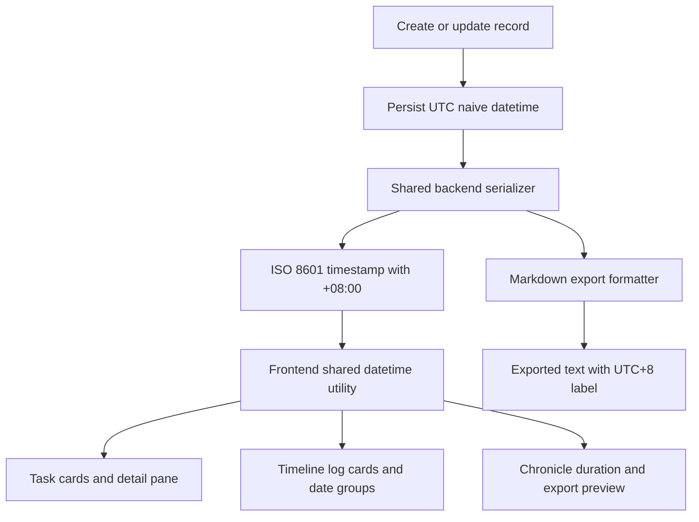
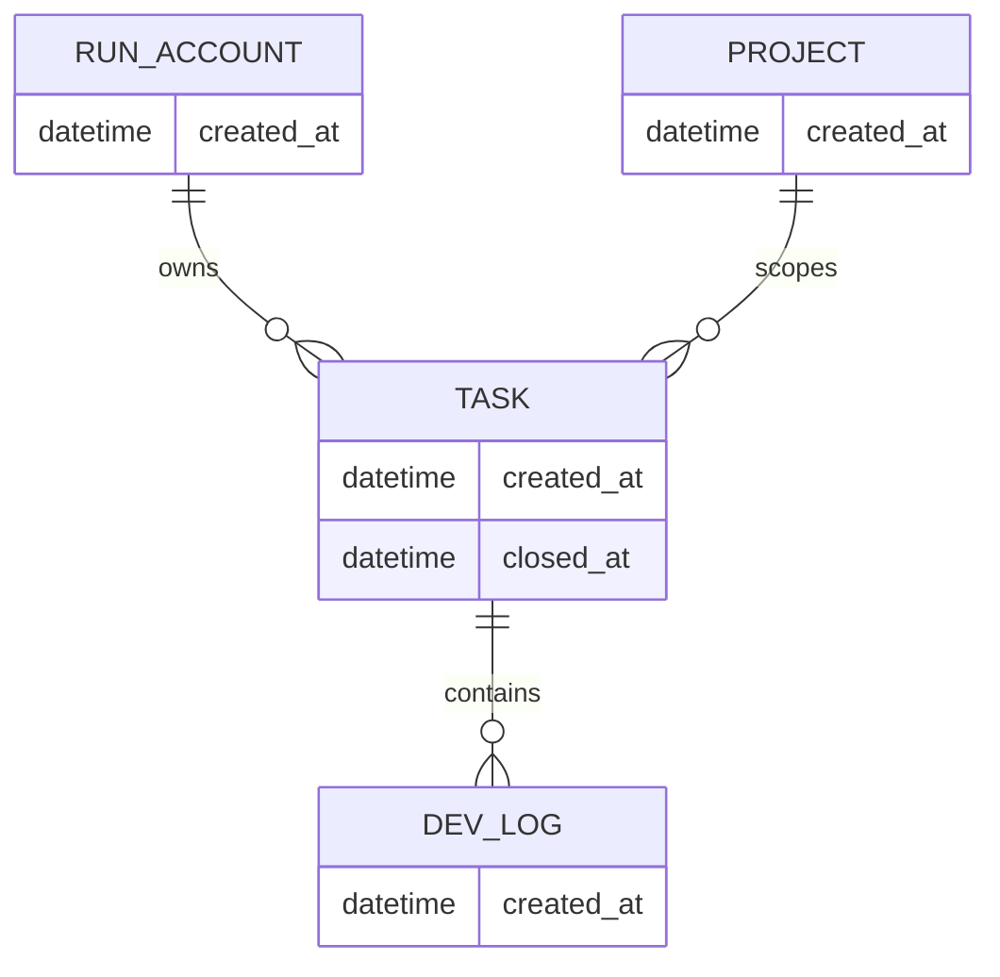

# PRD：应用时区调整为 UTC+8

| 文档属性 | 内容 |
| --- | --- |
| 文件路径 | `tasks/20260319-003623-prd-app-timezone-utc-plus-8.md` |
| 创建时间 | `2026-03-19 00:36:23 +0800` |
| 需求标题 | `i hope modify timezone to UTC+8` |
| 需求背景 | `i hope modify timezone to UTC+8` |
| 技术基线 | FastAPI + SQLAlchemy + Pydantic + React/Vite + MkDocs |

## 0. 关键澄清（按推荐方案默认生效）

以下问题是 `prd` skill 要求必须澄清、但当前需求文本未明确给出的部分。本 PRD 默认按推荐项编写；如果后续确认不一致，应先修订 PRD 再开始实现。

1. 这次要改的是哪一层的时区语义？
A. 只改前端显示
B. API 输出和前端显示统一切到 UTC+8，数据库继续保持 UTC 语义存储
C. 数据库直接改为存 UTC+8 的 naive datetime

> **Recommended: B**。`utils/helpers.py` 里的 `utc_now_naive()` 已明确把数据库 `DateTime` 字段当作 UTC 语义的 naive 值来持久化，直接把库内历史数据改成 UTC+8 会把既有记录整体偏移 8 小时。

2. 这次改造的范围到哪里为止？
A. 仅 DSL 页面中的任务/日志时间
B. 所有对外 API、前端页面、Markdown 导出、日志时间显示统一到 UTC+8
C. 连宿主机操作系统时区一起修改

> **Recommended: B**。现有时间输出分散在 `dsl/services/chronicle_service.py`、多个 Pydantic schema、`frontend/src/App.tsx`、`frontend/src/components/LogCard.tsx`、`frontend/src/components/StreamView.tsx`、`frontend/src/components/ChronicleView.tsx`；只改一处会继续出现混用。

3. 时区值如何配置？
A. 代码中直接硬编码 `Asia/Shanghai`
B. 在 `utils/settings.py` 增加 `APP_TIMEZONE` 配置，默认 `Asia/Shanghai`
C. 做成每个 RunAccount 单独可配置

> **Recommended: B**。项目已有集中配置模式，`utils/settings.py` 已承载数据库、媒体目录、AI 阈值等全局配置；本次应延续同一模式。

4. 历史数据如何处理？
A. 不回填数据库；把现有 naive UTC 记录在序列化时转换到 UTC+8
B. 执行数据库迁移，把所有历史时间字段统一加 8 小时
C. 新数据走 UTC+8，旧数据保持现状

> **Recommended: A**。当前仓库没有 Alembic 式成熟迁移体系，`docs/database/schema.md` 也明确表结构演进能力较弱；对历史数据做批量偏移风险高且难以回滚。

## 1. Introduction & Goals

当前项目的时间处理存在三类不一致：

- 后端持久化层通过 `utils/helpers.py` 中的 `utc_now_naive()` 生成 UTC 语义的 naive datetime。
- API/服务层在 `dsl/services/chronicle_service.py` 等位置直接调用 `isoformat()` 输出不带时区偏移的字符串。
- 前端在 `frontend/src/App.tsx`、`frontend/src/components/LogCard.tsx`、`frontend/src/components/StreamView.tsx`、`frontend/src/components/ChronicleView.tsx` 中分散使用 `new Date()` 与 `Intl.DateTimeFormat()`，最终展示结果依赖浏览器和宿主机本地时区。

因此，“modify timezone to UTC+8” 不能仅理解为改一个常量，而应落成一套统一的时间契约：数据库继续按 UTC 语义保存，应用对外读取、展示、导出时统一转换为 UTC+8。

### 目标

- [ ] 所有面向用户的时间展示统一为 UTC+8，默认时区名为 `Asia/Shanghai`
- [ ] 所有 API 返回的时间字段使用显式偏移的 ISO 8601 字符串，例如 `2026-03-19T08:36:23+08:00`
- [ ] 历史数据库记录无需回填或加 8 小时，避免破坏既有时间语义
- [ ] 时间序列分组、持续时长计算、Markdown 导出统一基于 UTC+8 语义
- [ ] 后端与前端分别引入单一共享的时间工具层，禁止继续散落地直接 `isoformat()` 或 `new Date(rawString)` 做业务判断

## 2. Implementation Guide (Technical Specs)

### 推荐技术方案

1. 保持数据库写入策略不变：所有 `DateTime` 字段仍写入 UTC 语义的 naive datetime。
2. 新增应用级时区配置：默认 `APP_TIMEZONE=Asia/Shanghai`。
3. 后端所有响应输出在 API 边界统一转换为带 `+08:00` 的 aware datetime 字符串。
4. 前端所有显示、分组、持续时长计算统一走共享格式化工具，明确指定时区。
5. 导出文档与日志时间显示必须与 UI 保持同一时区语义。

### 2.1 Change Matrix

| Change Target | Current State | Target State | How to Modify | Affected Files |
| --- | --- | --- | --- | --- |
| 应用级时区配置 | 项目没有统一的应用时区配置 | 新增 `APP_TIMEZONE`，默认 `Asia/Shanghai` | 在集中配置中加入时区常量、校验与文档说明 | `utils/settings.py`, `docs/guides/configuration.md` |
| 后端时间工具层 | 只有 `utc_now_naive()`，且 `dsl/services/codex_runner.py` 仍有 `datetime.now(UTC).replace(tzinfo=None)` 直写 | 增加 UTC naive 与应用时区 aware 之间的双向转换与序列化工具 | 在 `utils/helpers.py` 集中提供 `utc_naive_to_app_aware()`、`serialize_datetime_for_api()`、`app_now_aware()` 等；把散落逻辑收口 | `utils/helpers.py`, `dsl/services/codex_runner.py` |
| API 手工序列化 | `dsl/services/chronicle_service.py` 直接 `isoformat()` 输出无偏移时间字符串 | 编年史接口统一输出 UTC+8 偏移时间字符串 | 用共享 helper 替换直接 `isoformat()`，同时修正 Markdown 导出里的字符串切片逻辑 | `dsl/services/chronicle_service.py` |
| Pydantic 响应时间字段 | `TaskResponseSchema`、`DevLogResponseSchema` 等直接暴露 `datetime`，FastAPI 默认会输出无偏移值 | 所有外部响应时间字段都以 UTC+8 明确偏移输出 | 通过字段序列化器、专用 response DTO 或统一编码层输出 `+08:00` | `dsl/schemas/task_schema.py`, `dsl/schemas/dev_log_schema.py`, `dsl/schemas/project_schema.py`, `dsl/schemas/run_account_schema.py`, `dsl/schemas/email_settings_schema.py`, `dsl/schemas/webdav_settings_schema.py` |
| 前端时间格式化入口 | `App.tsx`、`LogCard.tsx`、`StreamView.tsx`、`ChronicleView.tsx` 各自格式化时间 | 前端只保留一个共享时间工具文件 | 新增 `frontend/src/utils/datetime.ts`，统一封装解析、格式化、分组日期、时长计算 | `frontend/src/App.tsx`, `frontend/src/components/LogCard.tsx`, `frontend/src/components/StreamView.tsx`, `frontend/src/components/ChronicleView.tsx`, `frontend/src/utils/datetime.ts` |
| 时间线按天分组 | `StreamView.tsx` 直接 `split("T")[0]` 取日期，默认依赖字符串原始值 | 按 UTC+8 本地日历日分组 | 先解析为时间对象，再按应用时区生成分组 key，避免跨日误分组 | `frontend/src/components/StreamView.tsx`, `frontend/src/utils/datetime.ts` |
| 持续时长计算 | `ChronicleView.tsx` 用 `new Date(start)` 和 `new Date(end)` 直接做差 | 持续时长基于明确时区语义的时间对象 | 使用共享 helper 统一解析；对空 `closed_at` 场景保持一致 | `frontend/src/components/ChronicleView.tsx`, `frontend/src/utils/datetime.ts` |
| 运行日志时间 | `utils/logger.py` 的文件 handler 使用 `utc=False`，结果依赖宿主机本地时区 | 应用日志时间与业务显示语义一致，或显式标明不是业务时区 | 引入自定义 formatter/converter，或在文档中明确日志时间策略；推荐统一到 UTC+8 | `utils/logger.py`, `docs/guides/dsl-development.md` |
| 文档说明 | 文档目前只说明数据库字段，不区分“存储时区”和“展示时区” | 文档中明确 UTC 存储、UTC+8 展示的双层语义 | 更新数据库、配置、开发说明文档 | `docs/database/schema.md`, `docs/guides/configuration.md`, `docs/guides/dsl-development.md` |
| 测试覆盖 | 没有针对时区转换、跨日边界、历史数据兼容的专门测试 | 补齐后端与前端关键时间用例 | 增加 UTC naive -> UTC+8 转换、午夜边界、排序/分组一致性测试 | `tests/`, `frontend/src/` 对应测试文件 |

### 2.2 Flow Diagram



### 2.3 Low-Fidelity Prototype

```text
┌──────────────────────────────────────────────────────────────┐
│ DSL 页面 / 应用时区：UTC+8 (Asia/Shanghai)                  │
├──────────────────────────────────────────────────────────────┤
│ 任务卡片                                                    │
│ Created: Mar 19, 08:36                                      │
│ Closed : Mar 19, 10:12                                      │
├──────────────────────────────────────────────────────────────┤
│ 时间线日志                                                  │
│ 08:37  用户提交需求                                         │
│ 08:41  AI 生成 PRD                                          │
│ 09:05  执行完成                                             │
│ 日期分组：2026-03-19 (按 UTC+8 计算)                        │
├──────────────────────────────────────────────────────────────┤
│ 编年史导出                                                  │
│ Created: 2026-03-19 08:36 UTC+8                             │
│ Closed : 2026-03-19 10:12 UTC+8                             │
├──────────────────────────────────────────────────────────────┤
│ 配置                                                        │
│ APP_TIMEZONE=Asia/Shanghai                                  │
└──────────────────────────────────────────────────────────────┘
```

### 2.4 ER Diagram

推荐方案不改数据库表结构，但为了明确“结构不变、语义改变”，本次保留现有实体关系并强调时间字段仍旧存储 UTC 语义的 naive datetime。



### 2.5 存储与序列化策略

- 数据库存储：继续使用 UTC 语义的 naive datetime，不做历史数据回填。
- 服务内部计算：在进入 API 响应层或导出层之前，统一转换为应用时区 aware datetime。
- API 契约：所有对外时间字段必须带偏移值，不允许再返回无时区的 `2026-03-19T08:36:23`。
- 前端展示：所有 UI 文本、排序、分组、持续时长统一以 `APP_TIMEZONE` 为准。
- 用户输入扩展：若后续出现“用户手动输入时间”的新功能，应按 UTC+8 解析后再转换回 UTC naive 持久化。

### 2.6 迁移与发布策略

- 本需求不引入数据库 schema migration。
- 发布前需要对现有数据样本做一次回放验证，确认旧记录显示为“原始 UTC 时间 + 8 小时”后的正确业务时间。
- 若生产环境宿主机本身不是 UTC+8，需要显式验证日志、导出、API 三者是否仍然一致。

### 2.8 Interactive Prototype Change Log

No interactive prototype file changes in this PRD.

### 2.9 Interactive Prototype Link

Not applicable for this timezone/configuration-focused change.

## 3. Global Definition of Done (DoD)

- [ ] Python 后端所有对外时间字段都通过统一 helper 或统一序列化层输出 UTC+8 偏移字符串
- [ ] 前端所有时间显示与分组逻辑都改为共享工具实现，不再散落直接调用 `new Date(rawString)` 做业务判断
- [ ] 历史数据库记录无需 SQL 回填，且显示结果与“UTC 存储、UTC+8 展示”的预期一致
- [ ] 跨日边界场景正确，例如 UTC `2026-03-18 23:30:00` 必须显示为 UTC+8 的 `2026-03-19 07:30:00`
- [ ] `uv run pytest` 通过
- [ ] `cd frontend && npm run build` 通过
- [ ] `uv run mkdocs build` 通过且无新增警告
- [ ] 变更符合现有代码规范、文档规范与显式 UTF-8 I/O 约束
- [ ] 现有任务列表、日志时间线、编年史导出、系统日志无明显回归

## 4. User Stories

### US-001：统一看到 UTC+8 的业务时间

**Description:** 作为 DSL 用户，我希望任务卡片、日志卡片和编年史看到的是同一套 UTC+8 时间，这样我不会因为浏览器或机器时区不同而误判事件发生顺序。

**Acceptance Criteria:**
- [ ] 任务创建时间、关闭时间、日志时间在所有页面中都按 UTC+8 展示
- [ ] 同一条记录在任务详情、时间线、编年史中的显示时间一致
- [ ] 按天分组时以 UTC+8 的自然日为准

### US-002：API 返回明确的时区偏移

**Description:** 作为前端或其他 API 消费方，我希望后端返回的时间字段包含明确偏移，这样我不需要猜测字符串到底是 UTC、UTC+8 还是浏览器本地时间。

**Acceptance Criteria:**
- [ ] `created_at`、`closed_at`、`updated_at` 等字段输出为 ISO 8601 且包含 `+08:00`
- [ ] 不再存在业务接口返回无偏移的 naive ISO 时间字符串
- [ ] `ChronicleService` 与 Pydantic 响应模型的时间格式保持一致

### US-003：维护者只需要修改一套时间工具

**Description:** 作为维护者，我希望时间处理逻辑被集中封装，这样以后再调整时区策略时，不需要在十几个文件里重复修修补补。

**Acceptance Criteria:**
- [ ] 后端新增统一时间 helper，替换散落的 `datetime.now(...)` 和 `isoformat()`
- [ ] 前端新增统一时间工具，替换 `App.tsx`、`LogCard.tsx`、`StreamView.tsx`、`ChronicleView.tsx` 中的重复逻辑
- [ ] 新增或修改时间相关功能时，代码评审规则明确要求复用共享工具

### US-004：导出和日志也遵守 UTC+8 语义

**Description:** 作为查看导出文档或日志的用户，我希望离开 UI 后看到的时间仍然和页面一致，避免排障时产生二次混乱。

**Acceptance Criteria:**
- [ ] Markdown 导出中的任务开始/结束时间与 UI 显示一致
- [ ] 若业务日志纳入范围，则日志文件时间明确为 UTC+8，或文档中清晰标注其时区语义
- [ ] 发布说明记录此次时区契约变更

## 5. Functional Requirements

1. `FR-1` 系统必须在 `utils/settings.py` 中引入 `APP_TIMEZONE` 配置项，默认值为 `Asia/Shanghai`。
2. `FR-2` 数据库写入策略必须继续使用 UTC 语义的 naive datetime，不得通过批量加 8 小时修改历史记录。
3. `FR-3` 后端必须提供共享的时间转换/序列化 helper，用于 UTC naive 与 UTC+8 aware 之间的统一转换。
4. `FR-4` 所有 API 响应中的时间字段必须序列化为带显式偏移的 ISO 8601 字符串。
5. `FR-5` `dsl/services/chronicle_service.py` 中的时间输出、日期切片和 Markdown 导出必须改为使用共享 helper，而不是直接字符串切片。
6. `FR-6` 前端必须新增共享时间工具模块，统一处理解析、显示、分组日期和持续时长计算。
7. `FR-7` 任务卡片、日志卡片、时间线分组、编年史视图必须全部复用该前端共享时间工具。
8. `FR-8` 时间线按天分组必须按 UTC+8 自然日计算，不允许继续直接使用原始字符串的 `YYYY-MM-DD` 前缀。
9. `FR-9` 若运行日志也纳入本次改造范围，日志 formatter 必须显式使用 UTC+8 或在文档中声明其非业务时区语义。
10. `FR-10` 相关文档必须说明“数据库存 UTC、应用展示 UTC+8”的双层契约。
11. `FR-11` 测试必须覆盖历史 UTC naive 记录、跨日边界、排序稳定性和导出格式。
12. `FR-12` 若未来引入用户手填时间输入，本次新增 helper 必须支持“UTC+8 输入 -> UTC 存储”的扩展路径。

## 6. Non-Goals

- 不修改宿主机操作系统时区，也不要求 Docker、终端或数据库服务器本身切到 UTC+8。
- 不做每个 RunAccount 或每个用户单独配置时区的能力。
- 不对现有数据库记录执行批量 `+8h` 回填。
- 不在本次需求内处理夏令时复杂场景；`Asia/Shanghai` 当前无 DST 变化。
- 不重构所有历史日志文案中的手写时间文本，只处理结构化时间字段与系统生成内容。
