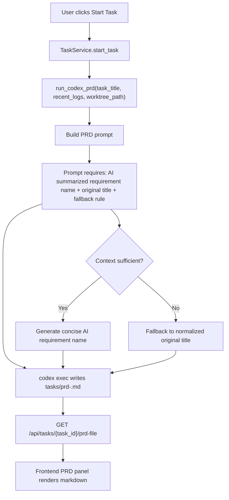

# PRD：PRD 内嵌 AI 归纳需求名称

**AI 归纳需求名称**：PRD 自动生成需求名称
**原始需求标题**：I hope the generated PRD simultaneously includes the name of the requirement (summarized and generated by AI).
**文件路径**：`tasks/20260319-004001-prd-ai-requirement-name-in-prd.md`
**创建时间**：2026-03-19 00:40:01 CST
**适用链路**：`dsl/services/codex_runner.py::run_codex_prd`

---

## 1. Introduction & Goals

### 背景

Koda 当前已经具备完整的 PRD 生成链路：`TaskService.start_task` 触发 `run_codex_prd`，后者基于任务标题、最近日志和可选 worktree 上下文构造 Prompt，要求 Codex 将 PRD 写入 `tasks/prd-<task_id[:8]>.md`，再由 `dsl/api/tasks.py::get_task_prd_file` 读取并交给前端 PRD 面板直接展示。

现有缺口在于，PRD 输出合同尚未强制要求在文档头部给出一个“由 AI 根据输入需求归纳出的需求名称”。这会导致生成结果经常只是机械复用原始标题，或者缺少一个适合评审、引用和后续实现阶段复用的稳定命名。

### 可衡量目标

- [ ] 所有新生成的 PRD 顶部都包含固定字段 `需求名称（AI 归纳）`
- [ ] PRD 同时保留 `原始需求标题`，保证输入可追溯
- [ ] 当上下文不足时，PRD 仍输出非空的需求名称，并回退到原始标题的规范化版本
- [ ] 为 PRD Prompt 增加自动化回归测试，防止后续 Prompt 调整时遗漏该字段
- [ ] 文档站点同步说明该输出合同，且 `uv run mkdocs build` 可以通过

### 1.1 Clarifying Questions

以下问题未在代码中显式回答，本 PRD 默认按推荐选项执行。

1. AI 归纳的需求名称应该落在哪里？
A. 只写入生成的 PRD Markdown
B. 同步持久化到 `Task` 表
C. 作为单独 API 字段返回给前端
> **Recommended: A**（最符合当前架构。现有链路已经通过 `dsl/api/tasks.py::get_task_prd_file` 返回原始 PRD 文本，`frontend/src/App.tsx` 直接渲染文件内容，不需要扩展数据库或接口合同。）

2. AI 归纳的需求名称是否替换原始标题？
A. 完全替换原始标题
B. 与原始标题并存
C. 只保留原始标题，不新增字段
> **Recommended: B**（最利于追踪。`docs/core/prompt-management.md` 已把任务标题定义为稳定输入来源，PRD 中应保留原始输入并新增 AI 归纳值，而不是覆盖。）

3. 这次 Prompt 变更应该如何落地？
A. 继续在 `run_codex_prd` 内联拼接字符串
B. 抽出 `build_codex_prd_prompt(...)` 辅助函数
C. 直接引入独立 Prompt 模板目录
> **Recommended: B**（最符合现有代码风格。`dsl/services/codex_runner.py` 已有 `build_codex_prompt` 和 `build_codex_completion_prompt`，PRD Prompt 也应采用可测试的构造函数，便于 `tests/test_codex_runner.py` 回归覆盖。）

4. 当上下文不足以生成高质量名称时应该怎么处理？
A. 回退到原始任务标题的规范化版本
B. 留空等待人工补充
C. 直接报错并中断 PRD 生成
> **Recommended: A**（最符合当前工作流连续性。`run_codex_prd` 的职责是稳定产出 PRD 文件并推进到 `prd_waiting_confirmation`，不应因命名不确定而中断整条链路。）

## 2. Implementation Guide

### 核心逻辑

本需求不改变任务状态机、数据库模型或前端 PRD 展示方式，只增强 PRD 生成时的输出合同：

1. `TaskService.start_task` 仍然触发 `run_codex_prd`
2. PRD Prompt 在现有“任务标题 + 最近日志 + worktree 路径 + 强制写文件”基础上，新增明确约束：
   - 必须生成 `需求名称（AI 归纳）`
   - 必须保留 `原始需求标题`
   - 当上下文不足时必须回退到非空标题
3. Codex 继续把完整 PRD 写入 `tasks/prd-<task_id[:8]>.md`
4. `dsl/api/tasks.py::get_task_prd_file` 与前端 PRD 面板继续按原样读取和显示，不新增结构化解析逻辑

### 2.1 Change Matrix

| Change Target | Current State | Target State | How to Modify | Affected Files |
|---|---|---|---|---|
| PRD Prompt 输出合同 | 仅要求“生成 PRD 并写入文件”，未显式要求 AI 归纳需求名称 | 明确要求 PRD 顶部包含 `需求名称（AI 归纳）`、`原始需求标题`、回退规则 | 更新 `run_codex_prd` 使用的 Prompt 文案，并将输出结构作为显式合同写死在 Prompt 中 | `dsl/services/codex_runner.py` |
| PRD Prompt 组织方式 | PRD Prompt 目前在 `run_codex_prd` 中内联拼接，测试可读性和复用性较弱 | 引入独立的 `build_codex_prd_prompt(...)` 或等价封装 | 复用现有 `build_codex_prompt` / `build_codex_completion_prompt` 的模式，便于单元测试 | `dsl/services/codex_runner.py` |
| Prompt 回归测试 | `tests/test_codex_runner.py` 已覆盖实现 Prompt 与完成 Prompt，但没有覆盖 PRD Prompt 的结构要求 | 增加针对 PRD Prompt 的回归测试 | 校验 Prompt 中是否要求输出 AI 归纳需求名称、保留原始标题、写入固定路径并提供回退规则 | `tests/test_codex_runner.py` |
| Prompt 文档 | 文档说明了 PRD Prompt 的输入来源和文件写入要求，但没有定义“需求名称（AI 归纳）”这一输出合同 | 文档明确记录 PRD 顶部字段和回退行为 | 在 Prompt 管理与 Codex 自动化文档中补充该合同，避免知识只存在代码里 | `docs/core/prompt-management.md`, `docs/guides/codex-cli-automation.md` |
| 手工评测口径 | 当前人工验证只检查“是否生成 PRD”，没有检查 PRD 头部命名质量 | 增加可执行的验收检查项 | 在评测文档中增加“PRD 是否包含 AI 归纳需求名称、是否与原始标题并存、是否有回退值”检查点 | `docs/dev/evaluation.md` |
| PRD 消费链路 | 后端和前端把 PRD 当作原始 Markdown 文本处理 | 保持不变，仅做回归验证 | 不新增 API 字段，不新增前端解析逻辑，只确认新增头部字段不会破坏显示 | `dsl/api/tasks.py`, `frontend/src/App.tsx` |

### 2.2 Flow Diagram



### 2.3 Low-Fidelity Prototype

```text
┌──────────────────────────────────────────────────────────────┐
│ PRD：PRD 内嵌 AI 归纳需求名称                                 │
│                                                              │
│ 需求名称（AI 归纳）：PRD 自动生成需求名称                     │
│ 原始需求标题：I hope the generated PRD simultaneously ...    │
│ 文件路径：tasks/20260319-004001-prd-ai-requirement-name-in-prd.md │
│ 创建时间：2026-03-19 00:40:01 CST                            │
├──────────────────────────────────────────────────────────────┤
│ 1. Introduction & Goals                                      │
│ 2. Implementation Guide                                      │
│ 3. Global Definition of Done                                 │
│ 4. User Stories                                              │
│ 5. Functional Requirements                                   │
│ 6. Non-Goals                                                 │
└──────────────────────────────────────────────────────────────┘
```

### 2.4 ER Diagram

本需求不涉及数据库表、ORM 模型、枚举字段或持久化状态结构的新增/修改，因此不需要新增 ER 图。`Task`、`DevLog`、`WorkflowStage` 与 PRD 文件读取接口均保持现状。

### 2.8 Interactive Prototype Change Log

No interactive prototype file changes in this PRD.

## 3. Global Definition of Done

- [ ] `uv run pytest tests/test_codex_runner.py` 通过，并包含 PRD Prompt 回归用例
- [ ] `uv run mkdocs build` 通过，无新增文档构建警告
- [ ] 触发一次真实或模拟的 `run_codex_prd` 后，输出文件顶部包含 `需求名称（AI 归纳）`
- [ ] 同一份 PRD 中保留 `原始需求标题`
- [ ] 当上下文为空或模糊时，PRD 仍输出非空名称，不阻塞文件生成
- [ ] PRD 仍写入 `tasks/prd-<task_id[:8]>.md`，不破坏 `dsl/api/tasks.py::get_task_prd_file` 的读取合同
- [ ] 前端 PRD 面板能无额外解析逻辑地正常显示新增头部字段
- [ ] 代码与文档修改符合现有工程约束，包括 Google 风格 docstring 与 UTF-8 文件读写约束

## 4. User Stories

### US-001：PRD 顶部展示 AI 归纳需求名称

**Description:** As a task reviewer, I want each generated PRD to include an AI-summarized requirement name so that I can quickly identify the business intent without reading the entire original prompt.

**Acceptance Criteria:**
- [ ] 每份新生成的 PRD 顶部包含 `需求名称（AI 归纳）`
- [ ] 该字段位于正文主要章节之前，便于快速浏览
- [ ] 需求名称为简洁、可引用的短标题，而不是大段原始上下文复述

### US-002：保留输入追踪并提供回退策略

**Description:** As an engineer, I want the PRD to keep the original task title alongside the AI-generated name so that I can trace what the model summarized and still have a safe fallback when context is weak.

**Acceptance Criteria:**
- [ ] PRD 同时包含 `原始需求标题`
- [ ] 当 AI 难以提炼更优名称时，系统要求回退到原始标题的规范化版本
- [ ] 不允许输出空标题、`TBD` 或“无法判断”之类的占位内容

### US-003：Prompt 变更可测试、可维护

**Description:** As a maintainer, I want the PRD naming requirement to be encoded in tests and docs so that later prompt edits do not silently remove it.

**Acceptance Criteria:**
- [ ] PRD Prompt 要求可通过单元测试断言
- [ ] 文档明确记录输出合同，而不是仅依赖口头约定
- [ ] 手工验证清单包含“AI 归纳需求名称”检查项

## 5. Functional Requirements

1. **FR-1**：PRD 生成 Prompt 必须要求模型根据任务标题和上下文输出 `需求名称（AI 归纳）`。
2. **FR-2**：生成的 PRD 必须同时包含 `原始需求标题`，不得只保留 AI 归纳名称。
3. **FR-3**：`需求名称（AI 归纳）` 必须出现在 PRD 顶部元数据区域，位于主要章节之前。
4. **FR-4**：当上下文不足时，模型必须回退到原始任务标题的规范化版本，且输出值不能为空。
5. **FR-5**：PRD 文件输出路径继续保持 `tasks/prd-{task_id[:8]}.md`，不得引入新命名规则。
6. **FR-6**：PRD Prompt 应改造为可单元测试的构造路径，例如新增 `build_codex_prd_prompt(...)`。
7. **FR-7**：测试必须验证 Prompt 明确要求 AI 归纳需求名称、保留原始标题和写入目标文件。
8. **FR-8**：文档必须更新，反映新的 PRD 输出合同与回退策略。
9. **FR-9**：现有 `get_task_prd_file` 接口与前端 PRD 展示逻辑无需结构化变更，但必须完成兼容性验证。
10. **FR-10**：该功能不应改变 `prd_generating -> prd_waiting_confirmation` 的阶段推进条件。

## 6. Non-Goals

- 不将 AI 归纳需求名称持久化到数据库 `Task` 模型
- 不新增专门返回“需求名称”的 API 字段
- 不修改前端 PRD 面板为结构化表单或卡片视图
- 不回溯修复历史上已经生成完成的旧 PRD 文件
- 不借这次需求同时推进 Prompt 模板系统、版本管理或评测平台重构
