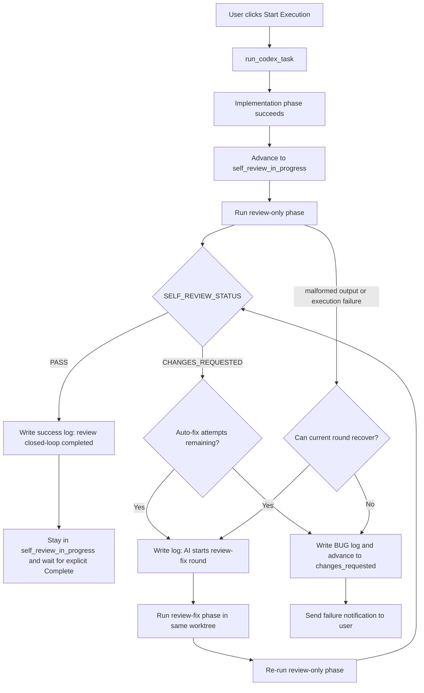

# PRD：AI 自检改为自主完成 Review 闭环，无需人工确认

**原始需求标题**：`Self-censorship changed to review completed by oneself, no longer requiring manual confirmation`
**需求名称（AI 归纳）**：`AI 自检改为自主完成 Review 闭环，无需人工确认`
**需求背景/上下文**：`Self-censorship changed to review completed by oneself, no longer requiring manual confirmation`
**文件路径**：`tasks/20260319-020538-prd-ai-self-review-no-manual-confirmation.md`
**创建时间**：`2026-03-19 02:05:38 +0800`
**适用链路**：`dsl/services/codex_runner.py::run_codex_task`、`dsl/services/codex_runner.py::run_codex_review`

---

## 0. 澄清问题（按现有仓库模式给出推荐默认值）

以下问题是 `/prd` workflow 要求必须先澄清、但当前需求文本没有明说的部分。本文先按推荐选项起草；如果后续业务决定不同，应先修订 PRD 再开始实现。

### 0.1 当 AI 自检发现阻塞问题时，应如何处理？

A. 维持现状，直接回退到 `changes_requested`，等待用户手动点击“重新执行”
B. 在同一后台任务内自动回改代码并重新执行 review，直到通过或达到重试上限
C. 只记录 review 结果，但不回改也不回退阶段

> **Recommended: B**
> 当前自动化主链路已经集中在 [`dsl/services/codex_runner.py`](/Users/zata/code/task/koda-wt-1749fc55/dsl/services/codex_runner.py)；把“回改 + 复审”继续收敛在同一编排器里，最符合现有无打扰执行模式，也最贴近该需求的“no longer requiring manual confirmation”目标。

### 0.2 自动回改应采用什么重试策略？

A. 不设上限，直到 AI 自己修好为止
B. 采用固定小上限，例如 2 轮 review-fix-review 闭环
C. 首期就做成数据库或配置项可调

> **Recommended: B**
> 现有仓库没有“任务自动重试策略”的配置体系；先在 [`dsl/services/codex_runner.py`](/Users/zata/code/task/koda-wt-1749fc55/dsl/services/codex_runner.py) 中用常量实现 2 轮闭环，风险最可控，也更容易在 [`tests/test_codex_runner.py`](/Users/zata/code/task/koda-wt-1749fc55/tests/test_codex_runner.py) 回归。

### 0.3 自检闭环通过后，任务应进入哪个阶段？

A. 继续停留在 `self_review_in_progress`，但日志明确标记“AI 已完成自检闭环，可进入 Complete”
B. 自动推进到 `pr_preparing` 并直接执行 `git add .` / `git commit` / `merge`
C. 自动推进到 `test_in_progress`

> **Recommended: A**
> 当前系统明确约束“不要默认执行 `git commit`，提交动作必须等待用户确认”，该合同已写入 [`dsl/services/codex_runner.py`](/Users/zata/code/task/koda-wt-1749fc55/dsl/services/codex_runner.py) 的实现 Prompt，并由 [`tests/test_codex_runner.py`](/Users/zata/code/task/koda-wt-1749fc55/tests/test_codex_runner.py) 断言。首期只去掉“自检失败后的人工确认”，不扩大到自动提交或自动合并。

### 0.4 自动回改过程应如何对用户可见？

A. 只保留最终结果，不记录中间轮次
B. 每一轮 review / 回改都继续写入 `DevLog` 和本地任务日志；只有最终失败才发“需要人工介入”通知
C. 新增数据库字段记录 retry 次数与最近 review 摘要

> **Recommended: B**
> 现有前端已经把 `DevLog` 当作统一时间线渲染，新增数据库字段收益不高；而继续复用 [`frontend/src/App.tsx`](/Users/zata/code/task/koda-wt-1749fc55/frontend/src/App.tsx) 的日志展示能力，可以让用户看到 AI 正在自行修复 review 问题。

### 0.5 自动回改失败后的“changes_requested”语义是否要改变？

A. 保持原语义：任何 review 阻塞问题都立刻进入 `changes_requested`
B. 调整语义：只有“AI 已用尽自动回改次数”或“发生致命执行失败”时才进入 `changes_requested`
C. 完全废弃 `changes_requested`

> **Recommended: B**
> [`dsl/models/enums.py`](/Users/zata/code/task/koda-wt-1749fc55/dsl/models/enums.py) 和 [`dsl/services/task_service.py`](/Users/zata/code/task/koda-wt-1749fc55/dsl/services/task_service.py) 已经围绕 `changes_requested` 建好重跑入口，不需要废弃该阶段；但它的含义需要从“首次 review 出现 blocker”收敛为“AI 无法自行闭环，才需要人介入”。

以下 PRD 按推荐选项 **B / B / A / B / B** 起草。

---

## 1. Introduction & Goals

### 背景

当前 Koda 的执行链路已经支持：

1. 用户确认 PRD 后进入 `implementation_in_progress`
2. `run_codex_task` 完成实现后自动推进到 `self_review_in_progress`
3. `run_codex_review` 立刻执行一次 review-only 的 AI 自检

但现状仍存在一个明显断点：只要 review 返回 `CHANGES_REQUESTED`，系统就会立刻把任务回退到 `changes_requested`，并通过前端的“重新执行”按钮或邮件通知把问题重新交还给人工处理。这与 [`docs/architecture/technical-route-20260317.md`](/Users/zata/code/task/koda-wt-1749fc55/docs/architecture/technical-route-20260317.md) 中“执行过程尽量无打扰”的设计目标不一致。

本需求的核心是把“AI 实现 -> AI review -> AI 回改 -> AI 再 review”收敛成一个自主闭环。只有在 AI 已经用尽自动回改次数、或执行流程出现真正的致命错误时，任务才应进入 `changes_requested` 等待人工介入。

### 可衡量目标

- [ ] AI 自检第一次发现阻塞问题时，不再立刻回退到 `changes_requested`
- [ ] 系统在同一后台任务内自动完成至少一轮“review -> 回改 -> review”闭环
- [ ] 只有在达到重试上限或发生致命执行失败时，任务才进入 `changes_requested`
- [ ] 自检闭环通过后，仍保留用户对最终 `Complete` / Git 收尾的显式控制
- [ ] `DevLog`、本地日志与文档同步体现新的自主 review 语义
- [ ] 增加自动化测试，覆盖闭环通过与闭环失败两类场景

## 2. Implementation Guide

### 核心逻辑

本需求不改变 PRD 确认阶段，也不改变最终 `Complete` 对应的 Git 收尾边界；变化只发生在 `implementation_in_progress -> self_review_in_progress -> changes_requested` 这段编排链路。

推荐实现路径：

1. 保留 [`dsl/services/codex_runner.py`](/Users/zata/code/task/koda-wt-1749fc55/dsl/services/codex_runner.py) 作为唯一编排入口，继续由 `run_codex_task` 串起实现阶段和 review 阶段
2. 将当前“`run_codex_review` 内部直接写日志并推进阶段”的一锤子逻辑，重构为“先返回结构化 review 结果，再由外层编排器决定是否回改、复审或最终失败”
3. 新增专门的“review 回改 Prompt”构造函数，例如 `build_codex_review_fix_prompt(...)`，输入至少包含：
   - 需求标题
   - 最近任务上下文
   - 本轮 review 摘要
   - 本轮 review 原始输出
   - 当前 worktree 路径
4. 当 review 返回 `CHANGES_REQUESTED` 且仍有剩余次数时：
   - 在 `self_review_in_progress` 阶段内写入一条“AI 开始根据 review 结论自动回改”的日志
   - 运行一轮新的 codex 实现阶段，仅允许围绕 review 发现的阻塞问题做定向修复
   - 回改完成后重新执行 review-only 阶段
5. 当 review 返回 `PASS` 时：
   - 写入“AI 自检闭环完成”的成功日志
   - 任务继续停留在 `self_review_in_progress`
   - 用户仍通过 `Complete` 触发后续 Git 收尾，不自动 commit / merge
6. 只有在以下两种情况下才推进到 `changes_requested`：
   - 自动回改轮次已耗尽后，review 仍返回 `CHANGES_REQUESTED`
   - review 阶段或回改阶段本身执行失败，且无法在当前轮次继续
7. 邮件通知从“首次 review 失败立即通知”改为“闭环耗尽或致命失败才通知”，避免把 AI 还在自行处理的中间状态暴露成需要人工确认的告警

### 2.1 Change Matrix

| Change Target | Current State | Target State | How to Modify | Affected Files |
|---|---|---|---|---|
| Self-review orchestration | `run_codex_review` 一旦得到 `CHANGES_REQUESTED` 就直接写 BUG 日志并回退到 `changes_requested` | review 结果先返回给外层编排器；外层根据剩余次数决定自动回改、再次 review 或最终回退 | 把 review 执行与阶段推进解耦，新增结构化结果对象和闭环调度逻辑 | [`dsl/services/codex_runner.py`](/Users/zata/code/task/koda-wt-1749fc55/dsl/services/codex_runner.py) |
| Review-fix prompt | 当前只有实现 Prompt、PRD Prompt、review Prompt、completion Prompt | 新增专门的 review-fix Prompt，要求 AI 只围绕本轮 review 阻塞问题做定向修改 | 新增 `build_codex_review_fix_prompt(...)` 或等价函数，避免复用初始实现 Prompt 造成范围失控 | [`dsl/services/codex_runner.py`](/Users/zata/code/task/koda-wt-1749fc55/dsl/services/codex_runner.py), [`tests/test_codex_runner.py`](/Users/zata/code/task/koda-wt-1749fc55/tests/test_codex_runner.py) |
| Stage semantics | `changes_requested` 代表“首次 review 出现 blocker” | `changes_requested` 代表“AI 已无法自行闭环，需要人工介入” | 保持枚举值不变，但更新注释、日志文案、文档说明和失败分支条件 | [`dsl/models/enums.py`](/Users/zata/code/task/koda-wt-1749fc55/dsl/models/enums.py), [`dsl/services/codex_runner.py`](/Users/zata/code/task/koda-wt-1749fc55/dsl/services/codex_runner.py), [`docs/architecture/system-design.md`](/Users/zata/code/task/koda-wt-1749fc55/docs/architecture/system-design.md) |
| Logs and notifications | review 首次失败就写“任务已回退至 changes_requested”并触发失败邮件 | 中间轮次记录“AI 正在自动回改”，只有最终失败才写需要人工介入日志并发通知 | 调整日志文案和通知触发时机；必要时补充新的失败原因摘要 | [`dsl/services/codex_runner.py`](/Users/zata/code/task/koda-wt-1749fc55/dsl/services/codex_runner.py), [`dsl/services/email_service.py`](/Users/zata/code/task/koda-wt-1749fc55/dsl/services/email_service.py) |
| Frontend observability | 前端只看到 `self_review_in_progress` 或 `changes_requested` 的结果，没有中间闭环语义说明 | 前端继续复用现有时间线，但能看到“review 发现问题 -> AI 回改 -> review 通过/失败”的连续日志 | 不强制新增按钮；若已有阶段文案映射，可补充更准确的说明文案 | [`frontend/src/App.tsx`](/Users/zata/code/task/koda-wt-1749fc55/frontend/src/App.tsx) |
| Automated tests | 现有测试只覆盖“review 直接 PASS”和“review 首次失败立即回退” | 新增“首次失败后自动回改并复审通过”与“多轮后仍失败才回退”测试 | 扩展 fake codex 进程队列，断言阶段推进、日志与通知时机 | [`tests/test_codex_runner.py`](/Users/zata/code/task/koda-wt-1749fc55/tests/test_codex_runner.py) |
| Documentation | 文档仍描述“review 发现阻塞问题即回退到 changes_requested” | 文档改为描述“AI 先尝试自行修复，只有最终失败才需要人工” | 更新架构、自动化、开发与评测文档 | [`docs/guides/codex-cli-automation.md`](/Users/zata/code/task/koda-wt-1749fc55/docs/guides/codex-cli-automation.md), [`docs/guides/dsl-development.md`](/Users/zata/code/task/koda-wt-1749fc55/docs/guides/dsl-development.md), [`docs/architecture/system-design.md`](/Users/zata/code/task/koda-wt-1749fc55/docs/architecture/system-design.md), [`docs/index.md`](/Users/zata/code/task/koda-wt-1749fc55/docs/index.md), [`docs/dev/evaluation.md`](/Users/zata/code/task/koda-wt-1749fc55/docs/dev/evaluation.md) |

### 2.2 Flow Diagram



### 2.3 Low-Fidelity Prototype

```text
┌──────────────────────────────────────────────────────────────────┐
│ Task: AI 自检改为自主完成 Review 闭环                             │
│ Stage Badge: Self Review                                         │
├──────────────────────────────────────────────────────────────────┤
│ Timeline                                                         │
│                                                                  │
│ 🤖 实现阶段完成，开始执行 AI 自检                                 │
│ 🤖 Review Round 1: 发现阻塞问题 - 缺少错误路径处理                │
│ 🤖 AI 正在根据 review 结论自动回改（Round 1/2）                  │
│ 🤖 回改完成，重新执行 AI 自检                                     │
│ 🤖 Review Round 2: PASS - no blocking issues found               │
│ ✅ AI 自检闭环完成，可由用户点击 Complete 进入 Git 收尾           │
│                                                                  │
│ 若 Round 2 仍失败：                                              │
│ ⚠️ AI 已用尽自动回改次数，任务进入 changes_requested，需要人工介入 │
└──────────────────────────────────────────────────────────────────┘
```

### 2.4 ER Diagram

本需求不引入新的数据库表、字段、关系或持久化状态结构变更，因此不需要新增 Mermaid `erDiagram`。

需要强调的仅是语义变化：

- `WorkflowStage` 枚举值保持不变
- `changes_requested` 的业务含义从“首次 review 阻塞”改为“AI 无法自行闭环后的最终人工介入态”
- 自动回改次数、当前轮次等信息首期不持久化到数据库，只存在于当前后台执行上下文和日志中

### 2.8 Interactive Prototype Change Log

No interactive prototype file changes in this PRD.

### 2.9 Interactive Prototype Link

Not applicable. This requirement does not introduce or modify an interactive prototype page.

## 3. Global Definition of Done (DoD)

- [ ] `run_codex_task` 在实现完成后，能够在同一后台任务内串起 `review -> 回改 -> review` 的闭环
- [ ] 首次 review 返回 `CHANGES_REQUESTED` 时，任务不会立刻回退到 `changes_requested`
- [ ] 自动回改达到上限后，系统才会把任务推进到 `changes_requested`
- [ ] review 闭环通过后，任务继续保留在 `self_review_in_progress`，且日志明确提示可由用户点击 `Complete`
- [ ] 最终 `git commit` / `git rebase` / `git merge` 仍不会在 review 闭环内被自动触发
- [ ] `tests/test_codex_runner.py` 新增并通过“自动回改后通过”和“自动回改耗尽后失败”用例
- [ ] 失败邮件只会在最终需要人工介入时发送，不会在中间回改轮次误报
- [ ] `uv run mkdocs build` 通过，且文档对 `changes_requested` 与 self-review 的描述已同步
- [ ] `DevLog` 与 `/tmp/koda-<task短ID>.log` 能连续反映每轮 review / 回改事件
- [ ] 现有 PRD 确认流程与 Complete 收尾流程无回归

## 4. User Stories

### US-001：AI 自检发现问题后自动回改

**Description:** As a user, I want the AI to fix review findings by itself in the same execution flow so that I do not need to manually restart the task for every self-review issue.

**Acceptance Criteria:**
- [ ] 当 self-review 返回 `CHANGES_REQUESTED` 时，系统优先进入自动回改轮次，而不是立刻回退到 `changes_requested`
- [ ] 自动回改发生在同一个 task worktree 中
- [ ] 回改完成后，系统自动重新执行 review-only 阶段

### US-002：只有最终失败才需要人工介入

**Description:** As an operator, I want `changes_requested` to mean “AI could not finish the loop by itself” so that I only get interrupted when manual intervention is actually necessary.

**Acceptance Criteria:**
- [ ] `changes_requested` 不再代表“首次 review 失败”
- [ ] 达到自动回改上限后，系统才记录最终失败并回退阶段
- [ ] 最终失败日志中包含本次 review 闭环的摘要或失败原因

### US-003：保留最终收尾的人工控制

**Description:** As a maintainer, I want the system to automate self-review remediation without automatically committing or merging so that repository-finalizing actions still remain explicit.

**Acceptance Criteria:**
- [ ] review 闭环通过后，任务不会自动进入 `pr_preparing`
- [ ] 系统不会在 review 回改阶段执行 `git commit` 或 `git merge`
- [ ] 用户仍通过现有 `Complete` 动作触发确定性的 Git 收尾链路

### US-004：可观测、可测试、可文档化

**Description:** As a developer, I want the new self-review loop to be visible in logs, covered by tests, and described in documentation so that future changes do not regress the behavior.

**Acceptance Criteria:**
- [ ] `DevLog` 中可看到每轮 review / 回改的顺序与摘要
- [ ] 自动化测试覆盖成功闭环与失败闭环
- [ ] MkDocs 文档同步描述新的闭环逻辑和最终人工介入边界

## 5. Functional Requirements

1. **FR-1:** 系统必须在 `implementation_in_progress` 成功后自动进入 `self_review_in_progress`，并启动 review-only 的 AI 自检。
2. **FR-2:** 当 self-review 返回 `SELF_REVIEW_STATUS: CHANGES_REQUESTED` 时，系统不得立即把任务回退到 `changes_requested`，而必须先判断是否还有自动回改额度。
3. **FR-3:** 系统必须支持至少一轮、推荐两轮的“review -> 回改 -> review”自动闭环；首期可用代码常量定义上限。
4. **FR-4:** 自动回改必须使用单独的 Prompt 语义，明确要求 AI 只修复本轮 review 提出的阻塞问题，而不是重新大范围发散实现。
5. **FR-5:** 自动回改与重新 review 必须继续在同一个 task worktree 中执行，且沿用现有日志写回机制。
6. **FR-6:** 当 self-review 在重试上限内最终返回 `PASS` 时，系统必须写入“AI 自检闭环完成”的成功日志，并保持任务处于 `self_review_in_progress`。
7. **FR-7:** review 闭环通过后，系统不得自动执行 `git commit`、`git rebase`、`git merge` 或进入 `pr_preparing`。
8. **FR-8:** 只有在自动回改次数耗尽、review 输出持续无效、或阶段执行本身失败且无法恢复时，系统才可将任务推进到 `changes_requested`。
9. **FR-9:** 最终失败进入 `changes_requested` 时，系统必须把失败原因写回 `DevLog`，并触发“需要人工介入”的通知。
10. **FR-10:** 中间回改轮次不得触发最终失败邮件或误导性的“等待人工确认”文案。
11. **FR-11:** 现有 `TaskService.execute_task(...)` 从 `prd_waiting_confirmation` / `changes_requested` 发起执行的入口契约必须保持兼容，以便 AI 最终失败后仍可人工重新执行。
12. **FR-12:** 自动化测试必须断言：首次 review 失败后不会立即推进到 `changes_requested`，且在闭环成功时阶段列表仅包含 `self_review_in_progress`。
13. **FR-13:** 文档必须明确说明：PRD 确认仍需要用户，最终 `Complete` 仍需要用户；被取消的是“self-review 失败后的即时人工确认”。
14. **FR-14:** `changes_requested` 在文档和日志中的定义必须更新为“AI 无法自行完成 review 闭环后的人工介入态”。

## 6. Non-Goals

- 不取消 PRD 生成后的用户确认步骤
- 不在本期自动执行 `Complete`、`git commit`、`git rebase main`、`git merge` 或分支清理
- 不新增数据库字段来持久化自动回改次数、轮次或 review 摘要
- 不在本期重做前端阶段按钮结构；现有“重新执行”和“Complete”入口继续保留
- 不在本期补齐 `test_in_progress` 或 `acceptance_in_progress` 的完整自动化编排
- 不修改与本需求无关的 worktree 创建、PRD Prompt 输出合同或邮件配置机制
