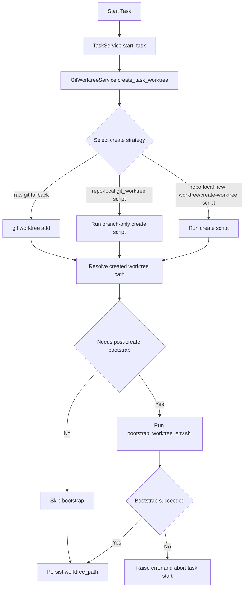

# PRD：Worktree 创建时同步完成环境准备

**文件路径**：`tasks/20260319-105937-prd-worktree-environment-bootstrap.md`
**创建时间**：2026-03-19 10:59:37
**需求摘要**：任务创建 worktree 时，不要求必须走 `just worktree`，但必须参考现有 `scripts/git_worktree.sh` 的行为，把相关环境一并准备好。

---

## 1. Introduction & Goals

当前 `dsl/services/git_worktree_service.py` 会按仓库能力选择不同的 worktree 创建入口：

- repo-local path-aware script：`scripts/new-worktree.sh` / `scripts/create-worktree.sh`
- repo-local branch-only script：`scripts/git_worktree.sh`
- raw Git fallback：`git worktree add ...`

问题在于，只有当前仓库里的 `scripts/git_worktree.sh` 明确承担了“创建 worktree + 复制 `.env*` + 安装前后端依赖”的完整职责。其他入口最多只保证目录创建，不保证新 worktree 进入“ready-to-code”状态。这会导致任务已经拿到 `worktree_path`，但 Codex 或开发者进入目录后仍要手动补环境。

### 目标

- [ ] 所有由 Koda 触发的任务型 worktree，在返回 `worktree_path` 前都完成基础环境准备
- [ ] 继续保留当前 `../task/<repo>-wt-<task_short_id>` 的路径契约，不改数据库字段语义
- [ ] 以现有 `scripts/git_worktree.sh` 为行为基线，避免环境准备逻辑分叉
- [ ] 保持后端调用非交互式，不打开 shell，不附带编辑器命令
- [ ] 对环境准备失败采用 fail-fast 策略，避免把“半成品 worktree”写入任务状态

### 需求澄清后的默认决策

- 不强制要求必须调用 `just worktree`
- 允许继续保留 repo-local script / raw git 的创建策略
- 但无论采用哪条创建路径，最终都必须满足与 `scripts/git_worktree.sh` 一致的环境准备结果

---

## 2. Implementation Guide

### Core Logic

建议把“创建 worktree”和“准备环境”拆成两个明确阶段：

1. `GitWorktreeService` 继续按当前优先级选择 worktree 创建命令
2. 成功后解析真实 `worktree_path`
3. 对“不自带环境准备”的创建路径，统一调用共享 bootstrap 入口
4. bootstrap 入口复用当前 `scripts/git_worktree.sh` 中的环境逻辑：
   - 复制仓库内 `.env*`
   - 处理前端依赖安装或 `node_modules` 复用
   - 发现 `pyproject.toml` 时执行 `uv sync --all-extras`
5. 只有 bootstrap 成功，才把 `worktree_path` 返回给 `TaskService`

### Database/State Changes

无数据库 schema 变更。

- `Task.worktree_path` 继续保存绝对路径
- 路径仍保持在 `<repo-parent>/task/` 根目录下
- 历史任务记录不迁移

### Affected Files

预测至少涉及以下文件：

- `dsl/services/git_worktree_service.py`
- `scripts/git_worktree.sh`
- `scripts/bootstrap_worktree_env.sh`（新增，命名可调整）
- `tests/test_git_worktree_service.py`
- `README.md`
- `docs/architecture/system-design.md`
- `docs/guides/codex-cli-automation.md`
- `docs/database/schema.md`

### 2.1 Change Matrix

| Change Target | Current State | Target State | How to Modify | Affected Files |
|---|---|---|---|---|
| Worktree create / bootstrap contract | 创建与环境准备耦合在 `scripts/git_worktree.sh`，其余入口不保证环境 | 明确拆分为“创建成功”与“环境准备成功”两个阶段 | 为 `GitWorktreeService` 增加 post-create bootstrap 流程；只有 bootstrap 成功才返回 worktree | `dsl/services/git_worktree_service.py` |
| 共享环境准备入口 | 不存在可独立复用的 bootstrap 入口 | 新增可被 shell 脚本和 Python 服务共同复用的 bootstrap 脚本 | 从 `scripts/git_worktree.sh` 抽取 `.env*` 复制、前端依赖安装、Python `uv sync --all-extras` 逻辑到独立脚本 | `scripts/bootstrap_worktree_env.sh`, `scripts/git_worktree.sh` |
| `scripts/git_worktree.sh` 的职责 | 既负责创建目录，也负责完整环境准备 | 继续支持 CLI 直用，但内部改为委托共享 bootstrap 入口 | 保留当前 CLI 参数和行为，创建成功后调用共享 bootstrap 脚本，避免双份逻辑漂移 | `scripts/git_worktree.sh` |
| `GitWorktreeService` 创建策略元数据 | 只记录 create command、expected path 和 branch lookup 信息 | 增加“是否需要 post-create bootstrap”或等价元数据 | 扩展 `WorktreeCreateCommandSpec`，让 path-aware script / raw git fallback 在创建成功后自动进入 bootstrap | `dsl/services/git_worktree_service.py` |
| 错误语义 | `git worktree add` 成功即可返回；环境问题可能未被统一拦截 | bootstrap 失败时直接抛出 `ValueError`，任务不记录 unusable worktree | 捕获 bootstrap stdout/stderr，按 UTF-8 解码拼接到错误信息中 | `dsl/services/git_worktree_service.py` |
| 自动化验证 | 现有测试只覆盖路径、分支、branch-only script 与 raw git 基本创建 | 增加 ready-to-code 维度验证 | 为 raw git fallback、path-aware script、bootstrap failure、`.env*` 复制和依赖策略增加测试 | `tests/test_git_worktree_service.py` |
| 文档契约 | 文档只强调 `../task/...` 路径与 worktree 生命周期 | 文档明确“任务 worktree 创建包含环境准备” | 更新架构、自动化、schema 与 README，说明 worktree 返回时已完成基础环境创建 | `README.md`, `docs/architecture/system-design.md`, `docs/guides/codex-cli-automation.md`, `docs/database/schema.md` |

### 2.2 Flow Diagram



### 2.3 Low-Fidelity Prototype

```text
┌─────────────────────────────────────────────────────────────┐
│ TaskService.start_task()                                    │
├─────────────────────────────────────────────────────────────┤
│ 1. Validate repo_path                                       │
│ 2. Build task branch name                                   │
│ 3. Create worktree                                          │
│    ├─ repo-local create script                              │
│    ├─ repo-local git_worktree.sh                            │
│    └─ raw git fallback                                      │
│ 4. Resolve actual worktree path                             │
│ 5. Bootstrap environment                                    │
│    ├─ copy .env*                                            │
│    ├─ frontend install / node_modules symlink               │
│    └─ uv sync --all-extras                                  │
│ 6. Success: save worktree_path                              │
│ 7. Failure: abort and return bootstrap error                │
└─────────────────────────────────────────────────────────────┘
```

### 2.4 ER Diagram

本需求不涉及持久化 schema 变更，因此不新增 ER 图。

- `Task.worktree_path` 字段保持不变
- `Project.repo_path` 字段保持不变
- 无新增表、字段、关系或枚举

### 2.8 Interactive Prototype Change Log

No interactive prototype file changes in this PRD.

### 2.9 Interactive Prototype Link

Not applicable. This request is backend/tooling only.

---

## 3. Global Definition of Done (DoD)

- [ ] `uv run pytest tests/test_git_worktree_service.py -v` 通过
- [ ] 若改动触达任务启动链路，补充执行 `uv run pytest tests/test_task_service.py -v`
- [ ] 文档更新后执行 `just docs-build` 通过
- [ ] 手动验证：新任务 worktree 创建完成后，`.env*` 已复制到目标目录
- [ ] 手动验证：包含 `frontend/package.json` 的仓库会按现有脚本策略完成前端依赖准备
- [ ] 手动验证：包含 `pyproject.toml` 的仓库会执行 Python 依赖同步
- [ ] 后端调用过程不打开 shell，不调用编辑器，不引入交互阻塞
- [ ] 现有 `../task/...` 路径契约与清理流程无回归
- [ ] 错误日志可明确区分“git worktree 创建失败”与“环境准备失败”

---

## 4. User Stories

### US-001: 创建后直接可编码的任务 worktree

**Description:** 作为开发者，我希望任务型 worktree 在创建完成后就已经具备基础环境，这样 Codex 和人工都可以直接进入实现阶段。

**Acceptance Criteria:**
- [ ] 任务启动成功返回时，目标 worktree 已复制必要的 `.env*`
- [ ] 若仓库包含前端项目，前端依赖已按既有策略准备完成
- [ ] 若仓库包含 `pyproject.toml`，Python 依赖已完成同步

### US-002: 不同创建路径下的一致环境结果

**Description:** 作为系统维护者，我希望 repo-local script、branch-only script 和 raw git fallback 在创建后都能得到一致的基础环境结果，而不是只有某一条路径具备环境准备。

**Acceptance Criteria:**
- [ ] path-aware script 创建后的 worktree 也能触发环境准备
- [ ] raw git fallback 创建后的 worktree 也能触发环境准备
- [ ] branch-only script 仍保持当前可用行为，不引入路径回归

### US-003: 以现有创建脚本为单一行为基线

**Description:** 作为仓库维护者，我希望环境准备逻辑以 `scripts/git_worktree.sh` 为唯一行为基线，避免 shell 和 Python 各维护一份不同规则。

**Acceptance Criteria:**
- [ ] `.env*` 复制逻辑只有一个来源
- [ ] 前端依赖策略只保留一套实现
- [ ] Python `uv sync --all-extras` 逻辑只保留一套实现

### US-004: 环境失败时阻止半成品 worktree 进入任务流

**Description:** 作为任务执行者，我希望环境准备失败时任务直接报错，而不是把不可用的 worktree 写入数据库继续后续流程。

**Acceptance Criteria:**
- [ ] bootstrap 失败时 `create_task_worktree()` 抛出明确错误
- [ ] `Task.worktree_path` 不会被写成不可用目录
- [ ] 错误信息包含失败阶段和原始 stderr/stdout 摘要

---

## 5. Functional Requirements

- FR-1：系统必须继续支持当前三类 worktree 创建入口：path-aware script、branch-only script、raw git fallback。
- FR-2：系统必须把“环境准备完成”视为 worktree 创建成功的组成部分，而不是可选附加步骤。
- FR-3：新增共享 bootstrap 入口，逻辑来源于当前 `scripts/git_worktree.sh` 中的环境准备实现。
- FR-4：共享 bootstrap 入口必须支持复制仓库内 `.env*` 文件，并继续排除 `.git/`、`.venv/`、`.uv-cache/`、`site/` 等目录。
- FR-5：共享 bootstrap 入口必须保留 `WORKTREE_FRONTEND_STRATEGY` 与 `WORKTREE_SKIP_FRONTEND_INSTALL` 的现有语义。
- FR-6：当 worktree 中存在 `pyproject.toml` 时，bootstrap 入口必须尝试执行 `uv sync --all-extras`；若 `uv` 不存在，错误行为应与现有脚本保持一致。
- FR-7：`GitWorktreeService` 必须能区分哪些创建策略已经自带环境准备，哪些需要额外执行 post-create bootstrap。
- FR-8：post-create bootstrap 失败时，`GitWorktreeService.create_task_worktree()` 必须抛出 `ValueError`，并向上游返回可读的失败原因。
- FR-9：此需求不得改变 `Task.worktree_path` 的路径格式与 `<repo-parent>/task/` 根目录约束。
- FR-10：此需求不得引入 shell 进入、编辑器打开或其他交互式副作用。
- FR-11：`just worktree` 若继续作为当前仓库的包装入口，必须自动继承同一套 bootstrap 逻辑，而不是维护独立实现。
- FR-12：实现完成后，README 与文档必须明确说明“任务型 worktree 创建默认包含环境准备”这一契约。

---

## 6. Non-Goals

- 不修改数据库 schema、迁移策略或任务状态机
- 不调整 `Complete` 阶段的 merge / cleanup 流程
- 不改变现有 task worktree 的命名规则和存储路径
- 不为任意第三方自定义脚本定义更复杂的插件协议
- 不新增前端界面、交互原型或浏览器侧配置入口
