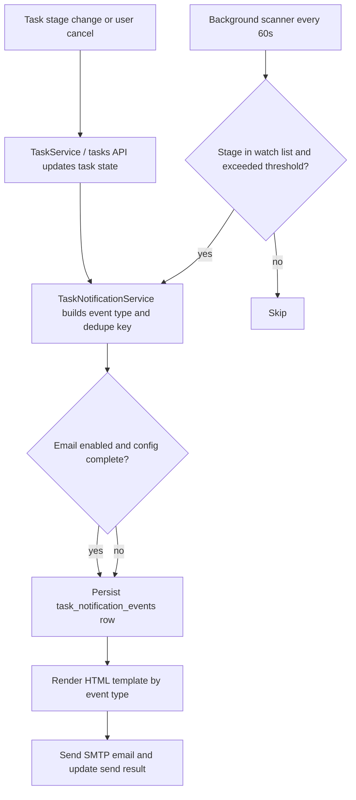
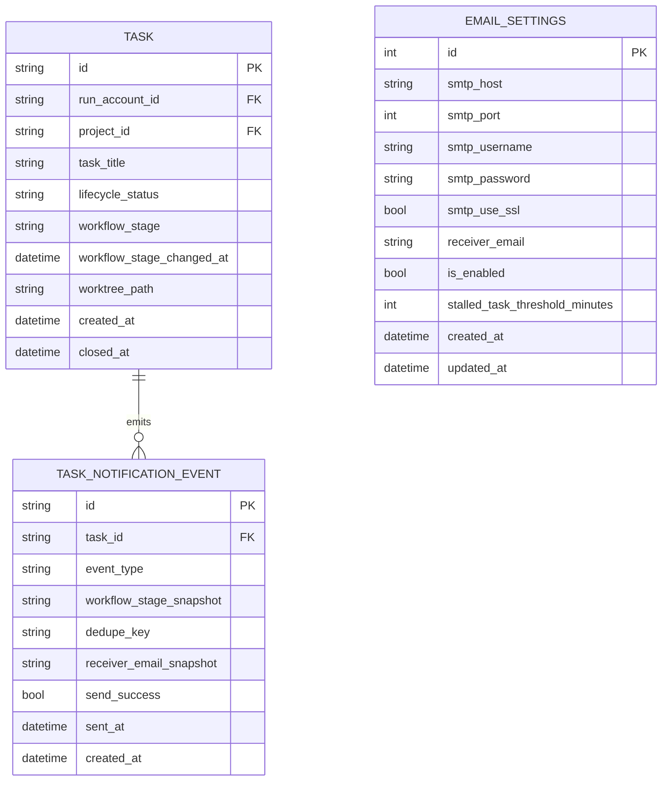

# PRD - 任务中断与停滞邮件通知

| 字段 | 内容 |
| --- | --- |
| 原始需求标题 | 中断发送邮件 |
| 需求名称（AI 归纳） | 任务中断与停滞邮件通知 |
| PRD 编号 | PRD-c3e6850f |
| 文档状态 | Draft |
| 创建日期 | 2026-03-20 |
| 目标系统 | Koda / DevStream Log 工作台 |
| 关联范围 | FastAPI 后端、React 前端、SQLite 模型、MkDocs 文档 |

> 若本轮没有额外产品确认，以下实现方案默认采用本文“推荐”选项。

## 0. 待确认问题（含推荐）

1. “中断状态”要按什么粒度触发邮件？
   A. 只要任务进入 `changes_requested` 就发一封统一邮件
   B. 保持 `workflow_stage` 不变，但按“中断事件类型”区分邮件原因，例如手动中断、PRD 生成失败、自检闭环失败、Lint 闭环失败、Git 收尾失败
   C. 所有非运行态都发邮件
   > **Recommended: B**（当前系统已经区分 `PRD 已生成待确认` 与 `changes_requested` 两类通知，继续按事件类型扩展最符合现有 `dsl/services/email_service.py` 与 `dsl/services/codex_runner.py` 的调用方式）

2. 收件人设置是否需要一次支持多个邮箱？
   A. 先保持单个收件人邮箱，沿用现有 `receiver_email`
   B. 改为多个邮箱，使用逗号或换行分隔
   C. 按 RunAccount 自动推导收件人
   > **Recommended: A**（现有数据库模型、API 和前端设置页都围绕单个 `receiver_email` 设计，先落地单收件人可以最小改动完成需求）

3. “20 分钟没有进行下一步”如何定义？
   A. 任务进入“等待人工下一步”的阶段后，20 分钟内没有阶段推进
   B. 任何阶段 20 分钟没有新增日志
   C. 任务创建后 20 分钟没有任何变化
   > **Recommended: A**（当前 `workflow_stage` 是业务阶段事实来源，且 `is_codex_task_running` 用于区分后台是否仍在工作；按等待人工阶段做提醒最不容易误报）

4. 超时提醒是否重复发送？
   A. 每满 20 分钟重复发送
   B. 每个“等待窗口”只发一次；只要阶段重新推进或重新进入该阶段，再重新计时
   C. 改为每日汇总
   > **Recommended: B**（避免邮件轰炸，同时可以用单独的通知事件表做去重和审计）

5. 本期是否要把 `acceptance_in_progress` 也纳入“20 分钟无下一步提醒”？
   A. 仅纳入 `prd_waiting_confirmation` 与 `changes_requested`
   B. 同时纳入 `acceptance_in_progress`
   C. 所有非运行阶段都纳入
   > **Recommended: A**（本需求的核心是“中断”和“人工介入”，先聚焦当前最明确的阻塞阶段，避免对验收过程产生过多噪音）

## 1. Introduction & Goals

当前系统已经具备 SMTP 配置能力，并在少数节点发送邮件：

- `run_codex_prd` 成功后发送 “PRD 已生成待确认” 邮件
- 自动化无法闭环时，通过 `_move_task_to_changes_requested` 发送 “需要人工介入” 邮件

但仍存在三个明显缺口：

- 用户手动点击中断 `/api/tasks/{task_id}/cancel` 后不会发邮件
- 多种“中断原因”都被压成同一个 `changes_requested` 结果，无法做精确模板与审计
- 系统没有“等待下一步超时”的提醒机制，`prd_waiting_confirmation` / `changes_requested` 长时间停滞时不会告警

本需求目标是补齐“任务阻塞通知链路”，让用户在不盯界面的情况下也能及时知道任务卡住了、需要确认了、或者长时间没有下一步。

可衡量目标：

- 在任务进入中断事件后的 1 分钟内发送邮件通知
- 在任务进入人工等待阶段 20 分钟仍无阶段推进时发送提醒邮件
- 同一个等待窗口内不重复发送超时提醒
- 邮件发送失败不阻塞主任务状态流转，并且可在数据库或日志中追踪发送结果
- 收件人继续通过现有设置界面维护，用户无需改动环境变量

## 2. Implementation Guide (Technical Specs)

### 2.0 技术路径概述

当前技术栈是 FastAPI + SQLAlchemy + React + Vite + SQLite，且仓库没有 Alembic 迁移体系，而是通过 `utils/database.py` 中的增量补丁自举表结构。因此本需求应延续现有演进方式：

- 保持 `Task.workflow_stage` 作为业务阶段事实来源
- 新增“通知事件”持久化表，而不是把中断原因写回 `Task` 的单一字段
- 在 `Task` 上新增阶段更新时间，用于 20 分钟停滞检测
- 在应用 lifespan 中启动一个轻量后台巡检协程，每 60 秒扫描一次人工等待阶段
- 复用现有邮件配置与测试能力，只在设置 UI 上增加提醒阈值和文案说明

### 2.1 Change Matrix

| Change Target | Current State | Target State | How to Modify | Affected Files |
| --- | --- | --- | --- | --- |
| 任务阶段停留时间 | `Task` 只有 `created_at` / `closed_at`，没有阶段更新时间 | `Task` 增加 `workflow_stage_changed_at`，每次阶段变更自动刷新 | 在 ORM、Schema、服务层更新逻辑中补字段；通过 `utils/database.py` 增量补丁兼容旧库 | `dsl/models/task.py`, `dsl/schemas/task_schema.py`, `dsl/services/task_service.py`, `dsl/services/codex_runner.py`, `utils/database.py`, `docs/database/schema.md` |
| 邮件设置模型 | 仅支持 SMTP、单收件人、全局开关 | 增加 `stalled_task_threshold_minutes`（默认 20） | 更新 SQLAlchemy 模型、Pydantic Schema、API 响应和设置页表单 | `dsl/models/email_settings.py`, `dsl/schemas/email_settings_schema.py`, `dsl/api/email_settings.py`, `frontend/src/types/index.ts`, `frontend/src/api/client.ts`, `frontend/src/components/SettingsModal.tsx`, `utils/database.py` |
| 通知审计与去重 | 没有通知事件表，发送后只写应用日志 | 新增 `task_notification_events` 表，记录事件类型、阶段快照、去重键、发送结果 | 新建模型和服务，所有邮件统一先落事件再发送/更新结果 | `dsl/models/task_notification_event.py`, `dsl/models/__init__.py`, `dsl/services/task_notification_service.py`, `utils/database.py`, `docs/database/schema.md` |
| 中断邮件发送入口 | 只有 `run_codex_prd` 成功通知和 `_move_task_to_changes_requested` 通知 | 统一覆盖手动中断、自动进入 `changes_requested`、等待阶段超时提醒 | 将通知逻辑从零散 helper 收拢到统一服务，按事件类型渲染模板 | `dsl/services/email_service.py`, `dsl/services/task_notification_service.py`, `dsl/services/codex_runner.py`, `dsl/api/tasks.py` |
| 手动中断流程 | `/cancel` 只停进程并改阶段，不发邮件 | `/cancel` 成功后立即发送“手动中断”邮件 | 在 `cancel_task` 中调用通知服务，并传入事件类型 `manual_cancelled` | `dsl/api/tasks.py`, `tests/test_tasks_api.py` |
| 20 分钟无下一步提醒 | 系统没有轮询或后台调度能力 | 应用启动后有轻量巡检协程，扫描 `prd_waiting_confirmation` / `changes_requested` | 在 FastAPI lifespan 中创建后台任务，每分钟扫描一次；退出时安全取消 | `dsl/app.py`, `dsl/services/task_notification_service.py`, `utils/settings.py`, `tests/test_codex_runner.py` |
| 前端设置体验 | 设置页只有 SMTP 和收件人输入框 | 设置页展示“提醒阈值（分钟）”和通知覆盖范围说明 | 在 Email Tab 增加数字输入、帮助文案和保存校验 | `frontend/src/components/SettingsModal.tsx`, `frontend/src/types/index.ts`, `frontend/src/api/client.ts` |
| 文档与回归验证 | 数据库与自动化文档未覆盖此能力 | 文档补充数据模型、通知规则、测试清单 | 更新 MkDocs 文档与 API 参考，补充测试用例 | `docs/database/schema.md`, `docs/guides/dsl-development.md`, `docs/api/references.md`, `tests/test_database.py`, `tests/test_tasks_api.py`, `tests/test_codex_runner.py` |

### 2.2 Flow Diagram



### 2.3 Low-Fidelity Prototype

```text
+-----------------------------------------------------------+
| Settings                                                  |
| [Email] [WebDAV]                                          |
|                                                           |
| Enable email notifications           [ ON ]               |
| SMTP Host                           [ smtp.example.com ]  |
| Port                                [ 465 ]               |
| Username                            [ you@example.com ]   |
| Password                            [ ************** ]    |
| Receive notifications at            [ notify@example.com ]|
| Stalled threshold (minutes)         [ 20 ]                |
|                                                           |
| Auto notifications cover:                                 |
| - Manual task cancel                                      |
| - AI moved task into changes_requested                    |
| - Waiting too long in PRD confirmation / changes request  |
|                                                           |
| [Send Test Email]                              [Save]     |
+-----------------------------------------------------------+

+-----------------------------------------------------------+
| Task Detail                                               |
| Stage: Changes Requested                                  |
| [Continue] [Cancel]                                       |
|                                                           |
| User clicks Cancel --------------> send interruption mail |
| Stage idle for >20 minutes ------> send reminder mail     |
+-----------------------------------------------------------+
```

### 2.4 ER Diagram



### 2.5 Core Logic

核心原则：

- `workflow_stage` 仍然只表达任务当前业务阶段，不新增“邮件状态型 stage”
- 邮件发送原因通过 `TaskNotificationEvent.event_type` 区分
- “20 分钟无下一步”以 `workflow_stage_changed_at` 为准，而不是以日志条数为准
- 邮件发送失败只影响通知本身，不回滚任务状态

建议新增的通知事件类型：

- `prd_ready_waiting_confirmation`
- `manual_cancelled`
- `changes_requested_auto_failure`
- `stalled_prd_waiting_confirmation`
- `stalled_changes_requested`

推荐实现细节：

1. `TaskService.update_workflow_stage()`、`start_task()`、`execute_task()`、Complete 相关链路统一刷新 `workflow_stage_changed_at`
2. `TaskNotificationService.record_and_send_notification(...)` 负责：
   - 生成 `dedupe_key`
   - 读取当前 `EmailSettings`
   - 写入 `task_notification_events`
   - 调用 `email_service` 发送 HTML 邮件
   - 回写 `send_success`、`sent_at`
3. `cancel_task()` 在完成取消后，立即发 `manual_cancelled`
4. `_move_task_to_changes_requested()` 保持现有失败入口，但改为发送 `changes_requested_auto_failure`
5. 新增后台巡检协程：
   - 每 60 秒查询 `workflow_stage` 属于观察集合且 `is_codex_task_running` 为假、并且停留时间超过阈值的任务
   - 按 `task_id + workflow_stage + workflow_stage_changed_at` 生成去重键
   - 同一个阶段窗口只提醒一次

### 2.6 Database / State Changes

建议新增或调整以下持久化结构：

- `tasks.workflow_stage_changed_at DATETIME NOT NULL`
  - 新任务创建时默认等于 `created_at`
  - 每次阶段变更都刷新
- `email_settings.stalled_task_threshold_minutes INTEGER NOT NULL DEFAULT 20`
  - 用于前端设置页和后台巡检
- 新表 `task_notification_events`
  - 用于通知审计、去重、失败排查
  - 建议为 `dedupe_key` 建唯一索引

推荐的去重键规则：

- 即时事件：`manual_cancelled:<task_id>:<timestamp_bucket_or_stage_changed_at>`
- 等待提醒：`stalled:<task_id>:<workflow_stage>:<workflow_stage_changed_at>`

为了保持简单，本期不建议引入 JSON 字段或通用规则引擎。

### 2.7 Affected Files

后端：

- `dsl/models/task.py`
- `dsl/models/email_settings.py`
- `dsl/models/task_notification_event.py`
- `dsl/models/__init__.py`
- `dsl/schemas/task_schema.py`
- `dsl/schemas/email_settings_schema.py`
- `dsl/api/tasks.py`
- `dsl/api/email_settings.py`
- `dsl/services/email_service.py`
- `dsl/services/task_notification_service.py`
- `dsl/services/codex_runner.py`
- `dsl/app.py`
- `utils/database.py`

前端：

- `frontend/src/components/SettingsModal.tsx`
- `frontend/src/types/index.ts`
- `frontend/src/api/client.ts`

测试与文档：

- `tests/test_tasks_api.py`
- `tests/test_codex_runner.py`
- `tests/test_database.py`
- `docs/database/schema.md`
- `docs/guides/dsl-development.md`
- `docs/api/references.md`
- `mkdocs.yml`（若新增页面则更新；本需求预计不新增页面）

### 2.8 Interactive Prototype Change Log

No interactive prototype file changes in this PRD.

## 3. Global Definition of Done (DoD)

- [ ] Typecheck and Lint passes
- [ ] Verify visually in browser (if UI related)
- [ ] Follows existing project coding standards
- [ ] No regressions in existing features
- [ ] 新增数据库字段和表可在旧 SQLite 数据库上自动补齐
- [ ] 手动中断、自动进入 `changes_requested`、等待超时三类邮件都有自动化测试覆盖
- [ ] `just docs-build` passes

## 4. User Stories

### US-001: 手动中断时立即收到邮件

**Description:** As a task owner, I want the system to send an email as soon as I manually interrupt a running task so that I do not need to stay on the page to know the task has been stopped.

**Acceptance Criteria:**

- [ ] 当用户调用 `/api/tasks/{task_id}/cancel` 且任务存在时，系统将任务推进到 `changes_requested`
- [ ] 取消成功后发送一封“任务已手动中断”的邮件
- [ ] 邮件正文包含任务标题、任务 ID、触发方式和当前阶段
- [ ] 如果 SMTP 配置缺失，任务取消仍成功，只记录发送失败日志/事件

### US-002: 自动化失败进入人工介入态时收到原因明确的邮件

**Description:** As a task owner, I want failure emails to explain why the task entered `changes_requested` so that I can quickly decide the next manual action.

**Acceptance Criteria:**

- [ ] PRD 生成失败、自检闭环失败、Lint 闭环失败、Git 收尾失败都通过统一通知服务发邮件
- [ ] 邮件主题和正文能体现失败原因摘要
- [ ] 同一个失败事件不会因为重复调用而发送多封重复邮件
- [ ] 通知发送结果会落到可查询的持久化记录中

### US-003: 任务等待下一步过久时收到提醒

**Description:** As a task owner, I want the system to remind me when a task has been waiting too long for my next action so that I do not forget to confirm or resume it.

**Acceptance Criteria:**

- [ ] 当任务在 `prd_waiting_confirmation` 或 `changes_requested` 停留超过阈值分钟数时，系统发送提醒邮件
- [ ] 如果任务在阈值到达前已经推进到下一阶段，则不发提醒
- [ ] 每个阶段停留窗口只发送一次提醒
- [ ] 阈值默认为 20 分钟，并可通过设置页修改

### US-004: 在设置页维护邮件提醒参数

**Description:** As a task owner, I want to manage notification recipient and reminder threshold in the existing settings modal so that I can configure email behavior without editing config files.

**Acceptance Criteria:**

- [ ] 设置页保留现有 SMTP 和收件人配置
- [ ] 设置页新增“停滞提醒阈值（分钟）”字段
- [ ] 保存后 GET / PUT 接口都能正确返回该字段
- [ ] 测试邮件能力保持可用

## 5. Functional Requirements

1. FR-1: 系统必须继续以 `EmailSettings` 单例记录作为邮件配置来源，并遵守 `is_enabled` 开关。
2. FR-2: 系统必须在任务被手动取消后发送“手动中断”邮件，而不是仅修改 `workflow_stage`。
3. FR-3: 系统必须把自动化失败导致的 `changes_requested` 通知统一收敛到一个通知服务入口，并在邮件中带出失败原因摘要。
4. FR-4: 系统必须为每次通知生成可审计的持久化记录，至少保存事件类型、任务 ID、阶段快照、去重键、接收人快照和发送结果。
5. FR-5: 系统必须在 `Task` 中保存阶段更新时间，以支持“等待下一步超时”的计算。
6. FR-6: 系统必须在应用运行期间每 60 秒扫描一次等待人工下一步的任务，并依据 `stalled_task_threshold_minutes` 判断是否超时。
7. FR-7: 系统必须只对 `prd_waiting_confirmation` 与 `changes_requested` 执行超时提醒；本期不把其他阶段纳入默认扫描集合。
8. FR-8: 系统必须确保同一个阶段停留窗口只发送一次提醒邮件；任务重新进入该阶段后才允许再次提醒。
9. FR-9: 系统必须在邮件配置 API 和前端设置页中暴露 `stalled_task_threshold_minutes`，默认值为 20。
10. FR-10: 系统必须保证邮件发送失败不会阻断任务状态更新、取消动作或后台自动化清理动作。
11. FR-11: 系统必须保留现有 `send_prd_ready_notification` 行为，但建议内部改为复用统一通知服务，避免模板与发送逻辑继续分叉。
12. FR-12: 系统必须更新数据库文档、开发流程文档和 API 参考，确保新字段与新表被文档覆盖。

## 6. Non-Goals

- 不在本期支持多个收件人邮箱、通讯录或按项目分发规则
- 不在本期支持 Slack、飞书、Webhook 等非邮件通知渠道
- 不在本期支持可视化模板编辑器或用户自定义邮件正文
- 不在本期为历史任务补发过去遗漏的中断/超时邮件
- 不在本期改造 `workflow_stage` 枚举，只为通知新增事件类型与审计表
