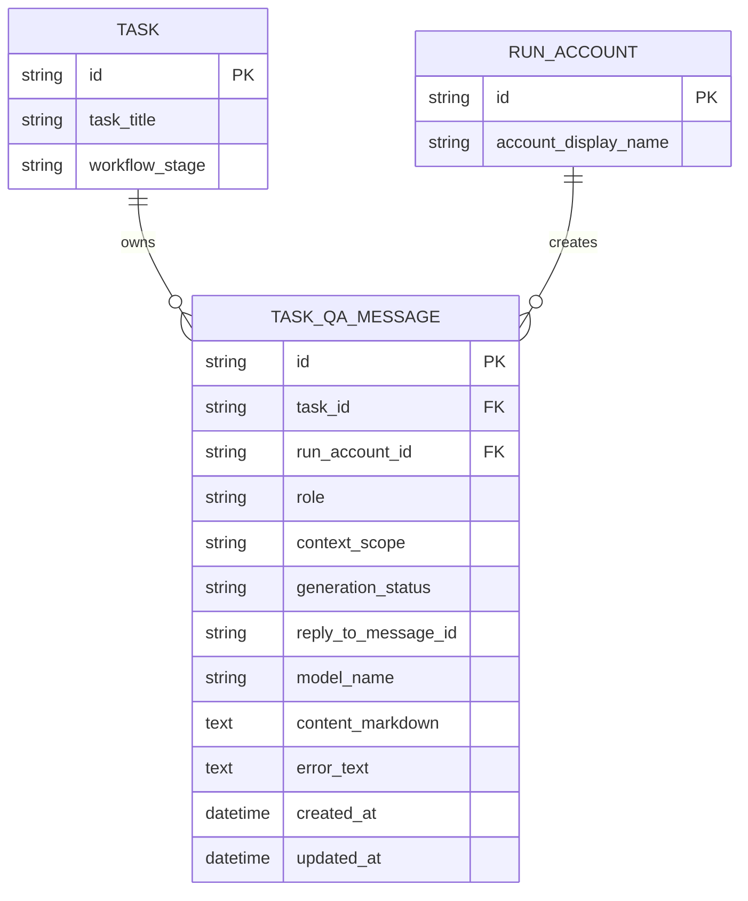

# PRD：任务内独立问答侧通道

**原始需求标题**：有时候我想做一些不影响coding过程的问答,能不能添加这个功能?
**需求名称（AI 归纳）**：任务内独立问答侧通道
**文件路径**：`tasks/20260326-114732-prd-task-sidecar-qa.md`
**创建时间**：2026-03-26 11:47:32 CST
**参考上下文**：`frontend/src/App.tsx`, `frontend/src/api/client.ts`, `frontend/src/types/index.ts`, `dsl/api/tasks.py`, `dsl/api/logs.py`, `dsl/services/codex_runner.py`, `dsl/models/dev_log.py`, `dsl/models/enums.py`, `ai_agent/utils/model_loader.py`, `docs/core/ai-assets.md`

---

## 1. Introduction & Goals

### 背景

当前 Koda 里用户能输入内容的主入口基本只有“反馈 / 时间线”这条线，但这条线并不是中性的问答通道：

- `frontend/src/App.tsx` 的 `handleFeedbackSubmit()` 会把输入落成 `DevLog`。
- 在 `prd_waiting_confirmation` 阶段，反馈还可能直接触发 `taskApi.regeneratePrd(...)`。
- 在运行阶段，输入 `continue / resume / retry / 继续` 这类文本，还会被解释为恢复或重试主自动化。
- `dsl/api/tasks.py` 会把 `DevLog` 序列化成 PRD 生成和编码执行的 Prompt 上下文。

因此，当前实现并不满足“我只是想先问一问，但不想影响 coding 过程”的真实诉求。用户在两个阶段尤其容易遇到这个问题：

1. **PRD 确认期**：对某条方案、边界或验收标准还不完全确定，想先问 AI，再决定是否改 PRD。
2. **Coding 进行中**：主执行已经进入无打扰编码，但用户临时有疑问，希望得到解释或建议，同时不打断现有实现。

本需求的目标不是替换现有反馈链路，而是新增一条**与主执行 AI 解耦的任务内问答侧通道**。这条通道默认只回答问题，不改 `workflow_stage`、不写执行时间线、也不触发 PRD regenerate / resume / execute。

### 可衡量目标

- [ ] 在 `prd_waiting_confirmation` 与 `implementation_in_progress` 阶段，用户都能发起独立问答。
- [ ] 问答默认不写入 `DevLog`，不进入 PRD/实现 Prompt 上下文，不污染主执行历史。
- [ ] 问答请求执行时，任务的 `workflow_stage` 与 `is_codex_task_running` 语义保持不变。
- [ ] 用户能清楚区分“独立问答”和“正式反馈/变更请求”两条动作路径。
- [ ] 独立问答的答案基于当前任务摘要、PRD 内容和最近日志生成，但不会隐式改写它们。
- [ ] 新能力在 UI、API、数据模型、文档和验证清单中都有明确落点。

### 1.1 Clarifying Questions

以下问题无法仅靠现有代码完全确定。本 PRD 默认按推荐选项收敛。

1. 独立问答应该复用哪条数据链路？
A. 继续复用 `DevLog`
B. 新增独立的 Task Q&A 持久化结构
C. 完全不落库，只做前端内存态
> **Recommended: B**（`dsl/api/tasks.py` 会把 `DevLog` 纳入主 Prompt 上下文；若继续复用 `DevLog`，会把“随口问问”的内容误当成执行上下文，违背“不要影响 coding 过程”的原始需求。）

2. 问答模型层应该优先复用什么能力？
A. 继续走 `codex exec`
B. 复用 `ai_agent/utils/model_loader.py` 的聊天模型工具层
C. 直接拼接本地规则，不接 LLM
> **Recommended: B**（`docs/core/ai-assets.md` 已明确把 `ai_agent/utils/model_loader.py` 定位为旁路 AI 工具层；这比再起一条 `codex exec` 主链更符合“独立于执行 AI”的语义。）

3. PRD 确认期的独立问答默认应该如何影响 PRD？
A. 只回答，不自动改 PRD；用户明确确认后再转反馈
B. 每次问答结束都自动 regenerate PRD
C. 直接修改当前 PRD 文件
> **Recommended: A**（当前 `handleFeedbackSubmit()` 已有正式反馈链路，独立问答应保持“先理解、后决定”的低副作用语义。）

4. Coding 期间是否允许并发问答？
A. 允许，且问答与主执行分离
B. 不允许，必须等 coding 完成
C. 允许，但默认先暂停 coding
> **Recommended: A**（原始需求明确强调“不影响 coding 过程”；如果问答不能并发，需求价值会显著下降。）

5. UI 最小落地形态应是什么？
A. 在现有底部 composer 中增加“反馈 / 问 AI”分轨
B. 把问答直接混进时间线
C. 新开一个全屏页面
> **Recommended: A**（`frontend/src/App.tsx` 已有稳定的底部输入区；在此基础上增加分轨/侧栏是最小侵入方案，也更容易让用户理解“问答”和“反馈”是两条不同动作。）

## 2. Implementation Guide

### 核心逻辑

建议把新功能定义为**任务级 sidecar Q&A**：

1. 前端在任务详情里新增“独立问答”视图，与现有反馈通道并列，而不是复用同一提交语义。
2. 用户发起提问后，后端创建一条任务级 Q&A 用户消息和一条待完成的 AI 回复消息。
3. 后端通过独立的 Q&A runner 调用 `ai_agent/utils/model_loader.py` 解析出的聊天模型，组装任务上下文并生成回答。
4. 回答上下文只读取：
   - 任务标题 / `requirement_brief`
   - 当前 PRD 文件内容（若存在）
   - 最近有限条 `DevLog`
   - 当前 `workflow_stage`
5. 回答结果写回 `task_qa_messages`，供前端轮询展示；默认不写入 `DevLog`。
6. 若用户想把问答结论变成正式动作，再显式执行：
   - “转成 PRD 反馈”
   - “转成变更请求草稿”
   - 或继续使用现有 feedback composer
7. 主执行链路 `run_codex_prd` / `run_codex_task` / `run_codex_review` 不需要暂停；Q&A 只是并行旁路。

### 2.1 Change Matrix

| Change Target | Current State | Target State | How to Modify | Affected Files |
|---|---|---|---|---|
| 问答入口语义 | 只有 feedback composer；提交内容可能写入 `DevLog` 并触发 PRD regenerate / resume | 新增独立问答入口，与反馈入口显式分轨 | 在任务详情底部输入区增加“反馈 / 问 AI”切换，独立问答提交走新的 API 客户端和消息列表 | `frontend/src/App.tsx`, `frontend/src/api/client.ts`, `frontend/src/types/index.ts` |
| 问答数据持久化 | 没有独立任务问答表；`DevLog` 同时承担时间线和 Prompt 上下文角色 | 新增任务级 Q&A 消息持久化，不再污染 `DevLog` | 新增 `TaskQaMessage` 模型及枚举，记录角色、状态、作用域、内容、错误信息和关联任务 | `dsl/models/task_qa_message.py`, `dsl/models/enums.py`, `utils/database.py` |
| 问答 API | 无任务问答接口 | 提供任务级问答查询与提问接口 | 新增 `GET /api/tasks/{task_id}/qa/messages` 与 `POST /api/tasks/{task_id}/qa/messages`；必要时再补 `POST /api/tasks/{task_id}/qa/{message_id}/convert-to-feedback` | `dsl/api/task_qa.py`, `dsl/app.py`, `docs/api/references.md` |
| 问答业务服务 | 无独立问答服务 | 新增 Q&A 服务层，处理创建消息、加载上下文、调度生成、错误回写 | 在服务层实现 `TaskQaService` 与 `TaskQaRunner`，明确与 `codex_runner` 解耦 | `dsl/services/task_qa_service.py`, `dsl/services/task_qa_runner.py`, `dsl/services/prd_file_service.py` |
| AI 能力选型 | 主业务链路主要依赖 `codex exec` | 独立问答默认仍优先使用 `codex`，聊天模型工具层作为可选覆盖/后备 | 保留 `codex` 作为默认问答后端；当显式切到 `chat_model` 时，再用 `ai_agent/utils/model_loader.py` 创建问答模型，并新增 `TASK_QA_BACKEND`、`TASK_QA_MODEL_NAME` 等配置 | `ai_agent/utils/model_loader.py`, `utils/settings.py`, `.env.example`, `docs/core/ai-assets.md`, `docs/guides/configuration.md` |
| 运行态隔离 | `is_codex_task_running` 代表主自动化运行态 | Q&A 有自己的消息级 pending/completed/failed 状态，不影响主运行态 | 保持 `TaskResponse.is_codex_task_running` 只表示主执行；问答 spinner 由消息状态驱动 | `dsl/schemas/task_qa_schema.py`, `frontend/src/types/index.ts`, `frontend/src/App.tsx` |
| 文档与评测 | 文档只描述 PRD / coding 主链与 feedback | 补充 sidecar Q&A 语义、边界与验证方法 | 更新系统设计、AI 资产、DSL 开发指南、评测清单和 API 参考 | `docs/architecture/system-design.md`, `docs/core/ai-assets.md`, `docs/guides/dsl-development.md`, `docs/dev/evaluation.md`, `docs/api/references.md` |

### 2.2 Flow Diagram

```mermaid
flowchart TD
    A[User opens task detail] --> B{Current stage}
    B -->|PRD waiting confirmation| C[Independent Q&A composer]
    B -->|Implementation in progress| C

    C --> D[POST "/api/tasks/{task_id}/qa/messages"]
    D --> E[Create user message + pending assistant message]
    E --> F[TaskQaRunner loads task context]
    F --> G["Chat model via ai_agent/utils/model_loader.py"]
    G --> H[Persist assistant answer]
    H --> I[Frontend polls Q&A messages]

    C -. does not change .-> J[workflow_stage]
    C -. does not write .-> K[DevLog prompt history]
    C -. does not interrupt .-> L[run_codex_task / run_codex_review]
```

### 2.3 Low-Fidelity Prototype

```text
┌────────────────────────────── 主执行轨 ──────────────────────────────┐
│ 阶段: [PRD 待确认] / [编码进行中]                                    │
│ 时间线: PRD ready / coding progress / review progress               │
│ 说明: 这里继续展示真正 workflow_stage，不被侧边问答自动改动         │
└──────────────────────────────────────────────────────────────────────┘

┌──────────────────────────── 独立问答轨 ─────────────────────────────┐
│ [反馈] [问 AI]                                                      │
│ scope: PRD Clarification / Implementation Companion                 │
│ ┌──────────────────────────────────────────────────────────────────┐ │
│ │ 用户问题：这个点我不确定，先问你，但不要影响当前 coding。       │ │
│ └──────────────────────────────────────────────────────────────────┘ │
│ [发送独立提问] [转成反馈草稿]                                        │
│                                                                      │
│ Assistant: 解释当前方案 / 风险 / 下一步建议                          │
│ 注：默认不写 DevLog、不触发 regenerate、不暂停主执行                 │
└──────────────────────────────────────────────────────────────────────┘
```

### 2.4 ER Diagram

本需求引入新的结构化持久化状态，因此需要补充 ER 图。



### 2.5 后端实现建议

建议新增独立的消息模型，而不是扩展 `DevLog`：

- `role`：`user` / `assistant`
- `context_scope`：`prd_confirmation` / `implementation` / `general`
- `generation_status`：`pending` / `completed` / `failed`
- `reply_to_message_id`：把 AI 回复和对应问题串起来
- `model_name`：记录实际使用的问答模型
- `error_text`：保留失败原因，供前端展示

Q&A runner 的上下文加载顺序建议如下：

1. `Task.task_title`
2. `Task.requirement_brief`
3. 当前任务 PRD 文件内容（若存在）
4. 最近 N 条 `DevLog` 摘要
5. 当前 `workflow_stage`
6. 最近 M 条 `task_qa_messages`

同时要显式限制回答职责：

- 允许：解释、澄清、比较方案、指出风险、建议下一步
- 不允许：自动推进阶段、自动重生成 PRD、自动发起 execute/resume/cancel

### 2.6 前端实现建议

前端不建议再新增第三种全局工作流状态，而是新增**任务详情局部 UI 状态**：

- `activeComposerMode: "feedback" | "sidecar_qa"`
- `selectedQaScope: "prd_confirmation" | "implementation"`
- `qaMessagesByTaskId`
- `isQaSubmitting`

展示层建议：

- 在现有 `devflow-feedback` 区域中增加分段切换
- “问 AI”模式下显示独立消息列表
- “反馈”模式继续保留现有行为
- 当 `selectedTask.is_codex_task_running === true` 时，“问 AI”仍然可用，但要在 UI 上明确写出“不会打断当前执行”

### 2.7 并发与失败策略

- 每个任务同一时刻最多允许 1 条 pending Q&A 回复，避免用户连续连发造成上下文错乱
- Q&A 失败只把对应消息标记为 `failed`，不得把任务推进到 `changes_requested`
- 主执行链路取消、恢复、完成时，不自动清空历史 Q&A
- 若 PRD 文件暂时不存在，Q&A 应降级为“基于 requirement brief + 最近日志回答”，而不是整体失败

### 2.8 Interactive Prototype Change Log

| File Path | Change Type | Before | After | Why |
|---|---|---|---|---|
| `docs/prototypes/task-sidecar-qa-demo.html` | Add | 仓库里没有用于“独立问答不影响主执行”的专用交互原型 | 新增一个可切换 `PRD 确认中 / 编码进行中` 的原型页，并演示问答发送、状态变化、主执行继续推进 | 该需求核心是交互边界和执行隔离，需要真实演示“问答轨”和“执行轨”分离 |
| `mkdocs.yml` | Modify | 文档导航没有原型入口 | 新增“原型”导航组，并暴露已有需求工作流原型和新的独立问答原型 | 让 PRD 评审、产品确认和后续实现都能直接访问交互示意页 |

### 2.9 Interactive Prototype Link

- `docs/prototypes/task-sidecar-qa-demo.html`

## 3. Global Definition of Done

- [ ] 独立问答在 `prd_waiting_confirmation` 和 `implementation_in_progress` 阶段都可正常发起
- [ ] 发送独立问答后，任务 `workflow_stage` 不发生变化
- [ ] 发送独立问答后，`Task.is_codex_task_running` 仍只反映主执行链路
- [ ] 独立问答消息不会被 `dsl/api/tasks.py` 组装进 PRD regenerate / coding Prompt 上下文
- [ ] 用户能明确区分“问 AI”和“反馈给执行链路”
- [ ] 问答失败只影响该条消息状态，不把任务推进到 `changes_requested`
- [ ] 新数据模型、API、前端类型和文档全部同步
- [ ] `just docs-build` 或等价 `uv run mkdocs build` 通过
- [ ] 代码遵循现有仓库规范：Google Style docstring、类型注解、UTF-8 文件 I/O

## 4. User Stories

### US-001：作为 PRD 确认者，我想先问 AI 再决定是否改 PRD

**Description:** As a PRD reviewer, I want to ask the AI clarifying questions before editing the PRD so that I can reduce uncertainty without accidentally triggering formal PRD changes.

**Acceptance Criteria:**
- [ ] 在 `prd_waiting_confirmation` 阶段可以发起独立问答
- [ ] 问答完成后不会自动触发 `regenerate-prd`
- [ ] 用户可以在看完答案后再手动决定是否转成 PRD 反馈

### US-002：作为 coding 观察者，我想提问但不打断当前执行

**Description:** As a developer watching an implementation run, I want to ask side questions without interrupting the active coding flow so that I can get context while keeping the main execution uninterrupted.

**Acceptance Criteria:**
- [ ] 在 `implementation_in_progress` 阶段问答仍可用
- [ ] 问答期间 `is_codex_task_running` 保持主执行真实状态
- [ ] 问答失败或超时不会把任务转入 `changes_requested`

### US-003：作为系统，我要把问答和执行历史分开存储

**Description:** As the system, I want to keep sidecar Q&A data isolated from DevLog and execution prompts so that the main workflow history stays clean and deterministic.

**Acceptance Criteria:**
- [ ] 问答消息有独立表结构或等价独立持久化
- [ ] `DevLog` 查询和任务 Prompt 构造不自动包含问答消息
- [ ] 问答消息支持 `pending/completed/failed` 状态

### US-004：作为用户，我要能把问答结论转化为正式动作

**Description:** As a user, I want a clear path from “just asking” to “formal feedback” so that useful Q&A conclusions can be operationalized when needed.

**Acceptance Criteria:**
- [ ] UI 中能清楚看到“问 AI”和“反馈”是两条不同通道
- [ ] 至少支持把最近一次问答结论整理成反馈草稿
- [ ] 转换前，问答本身不隐式改变主执行

## 5. Functional Requirements

1. **FR-1**：系统必须新增任务级独立问答能力，入口挂在任务详情内，而不是复用现有 `feedback` 提交语义。
2. **FR-2**：独立问答必须支持至少两个上下文作用域：`prd_confirmation` 与 `implementation`。
3. **FR-3**：独立问答请求必须持久化为独立消息记录，不得直接复用 `DevLog` 作为唯一存储。
4. **FR-4**：独立问答消息必须支持 `pending`、`completed`、`failed` 三种生成状态。
5. **FR-5**：独立问答默认不得改变 `workflow_stage`，也不得触发 `execute`、`resume`、`cancel`、`regenerate-prd`。
6. **FR-6**：独立问答默认不得被纳入 PRD 生成或编码执行的 Prompt 上下文。
7. **FR-7**：后端必须提供任务级问答查询接口和提问接口，路径建议为 `/api/tasks/{task_id}/qa/messages`。
8. **FR-8**：问答执行必须与 `is_codex_task_running` 语义解耦；该字段继续只表示主自动化运行态。
9. **FR-9**：问答模型调用应优先复用 `ai_agent/utils/model_loader.py` 的聊天模型工具层，而不是直接绑到 `codex exec` 主链。
10. **FR-10**：问答上下文必须至少包含任务标题、任务摘要、当前阶段、最近日志摘要，以及当前任务 PRD 文件内容（若存在）。
11. **FR-11**：当当前任务不存在 PRD 文件时，问答必须优雅降级，不能因缺少 PRD 文件整体失败。
12. **FR-12**：同一任务同一时刻最多允许 1 条 pending Q&A 回复，避免并发回复造成前端状态错乱。
13. **FR-13**：前端必须明确区分“问 AI”和“反馈给执行链路”两种用户动作。
14. **FR-14**：独立问答答案至少要支持被整理为反馈草稿，但不得在未确认前自动变成正式反馈。
15. **FR-15**：失败的问答必须只影响对应消息，保留可见错误信息，不得让任务整体进入 `changes_requested`。
16. **FR-16**：文档必须补充 sidecar Q&A 的系统定位、AI 资产边界、API 参考和手工验证方法。

## 6. Non-Goals

- 不把现有 `feedback` 链路整体替换成聊天系统
- 不在本需求里实现多任务共享的全局聊天室
- 不在本需求里引入新的 `workflow_stage`
- 不要求首版就支持 token 级流式输出、SSE 或 WebSocket 聊天
- 不要求首版就支持多轮命名会话、会话归档和搜索
- 不让独立问答自动修改 PRD 文件、自动恢复执行或自动中断 coding

## 7. Delivery Notes

### Delivered

- 已新增独立 `task_qa_messages` 持久化结构，以及 `user/assistant`、`prd_confirmation/implementation`、`pending/completed/failed` 三组枚举。
- 已新增 `GET /api/tasks/{task_id}/qa/messages`、`POST /api/tasks/{task_id}/qa/messages` 和 `POST /api/tasks/{task_id}/qa/messages/{message_id}/feedback-draft`。
- 已实现 `TaskQaService`，它会在后台任务中用 `ai_agent/utils/model_loader.py` 构造聊天模型，读取任务标题、摘要、当前阶段、最近日志摘要和 PRD 内容来回答，并在缺少 PRD 时优雅降级。
- 已把前端任务详情底部 composer 拆成两条显式通道：“反馈给执行链路”与“问 AI”。
- 已支持把最近一次完成的问答结论整理成反馈草稿，但不会在未确认前自动写入 `DevLog` 或触发正式动作。
- 已补齐 review-fix：完成任务后仍可查看历史 sidecar Q&A 并整理最近结论为反馈草稿；同时关闭新提问与正式反馈发送。
- 已补齐 review-fix：`DELETED` 任务不再隐藏底部 sidecar/feedback 面板，归档后的历史问答和“整理最近一次结论为反馈草稿”入口会以只读方式保留。
- 已补齐 review-fix：空白问题会在 schema 和 service 两层被拒绝，过期 `pending` 回复会自动释放为 `failed`，避免任务被永久锁死。
- 已补齐 review-fix：`LogService` 现在会在后端拒绝向 `CLOSED/DELETED` 任务写入正式反馈，附件上传入口也继承这条约束。
- 已补齐 review-fix：验收通过、无 worktree 的完成、删除需求这 3 条归档动作的留痕已收回后端内部日志，不再因为归档后的正式反馈拦截而半成功。
- 已补齐 review-fix：归档任务的图片/附件上传在被后端拒绝时会清理已落盘文件，不再留下孤立媒体。
- 已补齐 review-fix：同一任务最多 1 条 sidecar `pending` 回复的约束已下沉到事务/数据库层，并补了旧 SQLite 数据去重修复，避免并发提交绕过检查。

### Verification Evidence

- `uv run pytest tests/test_task_qa_api.py tests/test_task_qa_config.py tests/test_tasks_api.py tests/test_logs_api.py tests/test_database.py -q` -> PASS (`28 passed`)
- `uv run pytest -q` -> PASS (`113 passed, 1 warning`)
- `uv run pytest tests/test_task_qa_api.py tests/test_tasks_api.py tests/test_logs_api.py tests/test_media_api.py -q` -> PASS (`38 passed`)
- `cd frontend && npm run build` -> PASS
- `just docs-build` -> PASS

### Notable Implementation Decision

- 实现阶段把 `TASK_QA_BACKEND` 收敛为首版仅支持 `chat_model`。这与本 PRD 早先 change matrix 中“默认仍优先使用 codex”的建议不同，但更符合 FR-9 对 `ai_agent/utils/model_loader.py` 的优先级要求，也更清晰地维持了 sidecar Q&A 与主 Codex 执行链路的边界。
