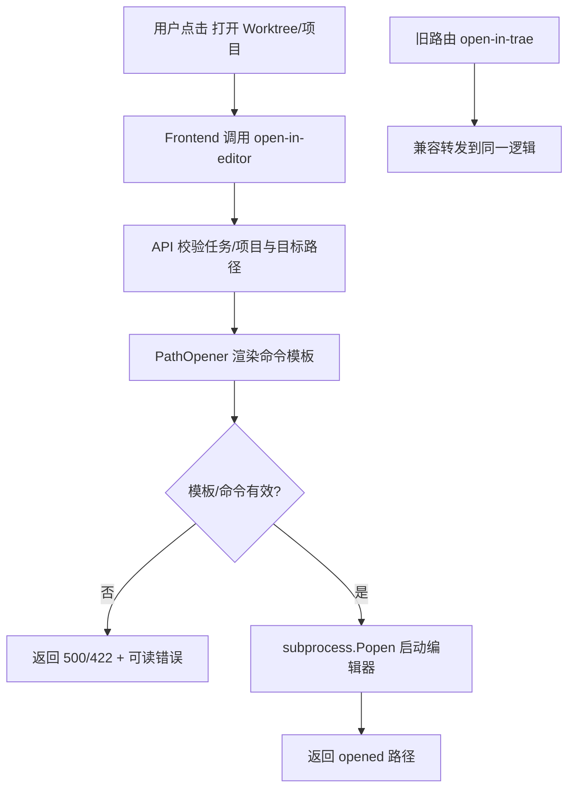

# PRD：Worktree 打开命令可配置化与编辑器自定义支持

**原始需求标题**：修改打开worktree的命令工具
**需求名称（AI 归纳）**：Worktree/项目目录打开命令去 Trae 写死并支持用户自定义编辑器命令模板
**文件路径**：`tasks/20260327-003508-prd-configurable-worktree-open-command-editor-support.md`
**创建时间**：2026-03-27 00:35:08 CST
**需求背景/上下文**：当前“打开 worktree/项目目录”能力写死为 `trae-cn`，但实际编辑器可能是 VS Code、Trae、Kiro、Cursor 或其他工具；不能依赖固定枚举，需允许用户自定义命令。
**参考上下文**：`dsl/api/tasks.py`, `dsl/api/projects.py`, `frontend/src/api/client.ts`, `frontend/src/App.tsx`, `utils/settings.py`, `docs/getting-started.md`, `docs/api/references.md`
**附件输入检查**：本次上下文未出现 `Attached local files:` 段落。

---

## 1. Introduction & Goals

### 背景

当前实现把“打开目录”的 IDE 命令写死为 `trae-cn`：

- `dsl/api/tasks.py` 使用 `POST /api/tasks/{task_id}/open-in-trae`，内部直接执行 `subprocess.Popen(["trae-cn", <worktree_path>])`。
- `dsl/api/projects.py` 使用 `POST /api/projects/{project_id}/open-in-trae`，内部直接执行 `subprocess.Popen(["trae-cn", <repo_path>])`。
- `frontend/src/api/client.ts` 与 `frontend/src/App.tsx` 也将该能力命名为 `openInTrae` / “已在 Trae 中打开”。
- 文档 `docs/getting-started.md` 和 API 参考仍把该能力定义为 Trae 专属。

这会导致：

- 非 Trae 用户无法直接使用“打开目录”按钮。
- 每新增一种 IDE 都需要改代码与发版，扩展性差。
- 前后端接口语义与真实需求不一致（需求是“打开目录”，不是“仅 Trae”）。

### 可衡量目标

- [x] 打开目录能力不再写死 `trae-cn`，改为可配置命令模板。
- [x] 用户可通过配置自定义任意 IDE 命令（不依赖内置 IDE 枚举）。
- [x] 任务 worktree 与项目根目录两条打开链路都统一走同一套命令解析与执行逻辑。
- [x] 前端文案与 API 命名去 Trae 品牌化，语义统一为“打开目录/打开编辑器”。
- [x] 保持向后兼容，旧接口在过渡期仍可调用。
- [x] 新增自动化测试覆盖配置解析、错误处理和兼容路由行为。

## 1.1 Clarifying Questions

以下问题无法仅靠现有代码唯一确定，本 PRD 默认按推荐项实施。

1. 用户自定义命令入口应放在哪？
A. 后端写死若干 IDE 选项（trae/code/cursor）并让用户下拉选择
B. 提供“命令模板”配置（环境变量），由用户自行填写任意命令
C. 每次点击“打开”时临时输入命令
> **Recommended: B**（与 `KODA_OPEN_TERMINAL_COMMAND` 现有模式一致，扩展性最高且无需穷举 IDE。）

2. 接口命名如何演进？
A. 继续保留 `open-in-trae` 不改
B. 新增 `open-in-editor`，并保留 `open-in-trae` 兼容别名
C. 直接删除 `open-in-trae` 并强制前端同步升级
> **Recommended: B**（兼容现有调用，降低升级风险，同时完成语义去 Trae 化。）

3. 默认命令模板策略应是什么？
A. 必须用户配置，否则接口返回 422
B. 默认沿用 `trae-cn {target_path_shell}`，允许用户覆盖
C. 默认用操作系统打开命令（`open`/`xdg-open`）
> **Recommended: B**（对现有用户最平滑；未改配置时行为不变。）

4. 模板占位符能力应到什么程度？
A. 仅支持 `{target_path}`
B. 支持 `{target_path}`、`{target_path_shell}`、`{target_kind}`
C. 不使用模板，改为 JSON 参数数组
> **Recommended: B**（兼顾可读性与跨 shell 安全性，且与终端命令模板模式一致。）

5. 本期是否包含 UI 设置页改造？
A. 包含：在 Settings 新增可视化“编辑器命令”配置并持久化
B. 不包含：先走环境变量，后续再做 UI 设置
C. 只改文案，不改可配置能力
> **Recommended: B**（当前需求核心是“从写死到可自定义”，优先后端配置落地；UI 配置可作为后续迭代。）

## 2. Implementation Guide

### 2.1 Core Logic

建议新增统一“目录打开器”服务，避免任务与项目接口重复实现。

1. 在 `utils/settings.py` 新增配置项 `KODA_OPEN_PATH_COMMAND_TEMPLATE`。
2. 默认值设为 `trae-cn {target_path_shell}`，保证兼容当前行为。
3. 新增服务模块（例如 `dsl/services/path_opener.py`）：
   - 负责模板渲染、`shlex.split`、错误包装。
   - 统一调用 `subprocess.Popen(..., stdout=DEVNULL, stderr=DEVNULL)`。
   - 提供明确错误：模板非法、命令不存在、目标路径不存在。
4. 任务与项目打开接口统一调用该服务，不再手写 `trae-cn`。
5. API 路由演进：
   - 新增：`POST /api/tasks/{task_id}/open-in-editor`
   - 新增：`POST /api/projects/{project_id}/open-in-editor`
   - 兼容：保留 `open-in-trae` 路由作为别名（返回相同结构，文档标记 deprecated）。
6. 前端 API 客户端从 `openInTrae` 迁移到 `openInEditor`，按钮成功/失败文案改为通用编辑器语义。
7. 文档同步更新，移除“必须 Trae”误导描述。

### 2.2 Change Matrix

| Change Target | Current State | Target State | How to Modify | Affected Files |
| --- | --- | --- | --- | --- |
| 打开目录命令配置 | 写死 `trae-cn` | 命令模板可配置 | 新增 `KODA_OPEN_PATH_COMMAND_TEMPLATE`，读取并校验模板 | `utils/settings.py`, `.env.example`, `docs/guides/configuration.md` |
| 目录打开服务 | 分散在路由中直接 `subprocess.Popen(["trae-cn", ...])` | 统一服务层执行 | 抽象 `path_opener` 服务，集中错误处理与模板渲染 | `dsl/services/path_opener.py`（新增）, `dsl/services/__init__.py` |
| Task 打开接口 | `open-in-trae`，函数 `open_task_in_trae` | 主接口 `open-in-editor` + 兼容别名 | 新增通用接口命名并保留旧路径 | `dsl/api/tasks.py` |
| Project 打开接口 | `open-in-trae`，函数 `open_project_in_trae` | 主接口 `open-in-editor` + 兼容别名 | 与 Task 同步演进 | `dsl/api/projects.py` |
| 前端 API 命名 | `taskApi.openInTrae` / `projectApi.openInTrae` | `openInEditor` | 替换接口调用与注释 | `frontend/src/api/client.ts` |
| 前端交互文案 | “已在 Trae 中打开” | “已在编辑器中打开” | 更新成功/错误提示和函数命名 | `frontend/src/App.tsx` |
| API 文档引用 | `open_*_in_trae` | `open_*_in_editor`（保留兼容说明） | 更新 mkdocstrings members 列表 | `docs/api/references.md` |
| 快速开始文档 | 可选工具写为 `trae-cn` | 可选工具写为“可执行的编辑器命令” | 文档示例同时给出 VS Code/Trae 样例 | `docs/getting-started.md` |
| 自动化测试 | 尚无此能力专门测试 | 覆盖模板解析、接口成功/失败、兼容路由 | 新增服务层与 API 路由测试 | `tests/test_terminal_launcher.py`（扩展或拆分）, `tests/test_tasks_api.py`, `tests/test_projects_api.py`（新增） |

### 2.3 Flow Diagram

### 2.4 Database / State Changes

本期默认**不改数据库 Schema**，配置入口采用环境变量。

- 无新增数据表或字段。
- 运行态配置来源：`utils/settings.py`。
- 若后续需要 UI 持久化配置，可在二期新增 `AppPreferences` 或 `RunAccount` 扩展字段。

## 3. Global Definition of Done

- [x] `POST /api/tasks/{task_id}/open-in-editor` 可用，并返回 `{"opened": "..."}`。
- [x] `POST /api/projects/{project_id}/open-in-editor` 可用，并返回 `{"opened": "..."}`。
- [x] `open-in-trae` 兼容路由仍可工作（至少一个版本周期）。
- [x] 在未配置环境变量时，默认行为与当前 `trae-cn` 兼容。
- [x] 用户配置任意命令模板后（如 `code {target_path_shell}`）可成功打开目录。
- [x] 模板非法或命令不存在时，接口返回可诊断错误信息。
- [x] 前端不再出现 Trae 写死文案（按钮/提示语）。
- [x] 新增/更新测试通过：`uv run pytest`。
- [x] 文档构建通过：`just docs-build`。

## 4. User Stories

### US-001：作为开发者，我希望自定义打开目录所用的编辑器命令

**Description:** As a developer, I want to configure my own editor launch command so that I can open worktree/project in any IDE.

**Acceptance Criteria:**
- [x] 支持通过配置定义命令模板。
- [x] 模板支持路径占位符。
- [x] 不依赖固定 IDE 枚举列表。

### US-002：作为任务执行者，我希望“打开 Worktree”按钮在不同 IDE 环境下都可用

**Description:** As a task executor, I want the open-worktree action to work regardless of which IDE I use.

**Acceptance Criteria:**
- [x] worktree 路径存在时可以成功触发编辑器。
- [x] worktree 路径不存在时返回明确 422 错误。
- [x] 前端错误提示可直接指导排查（路径未创建/命令不可用）。

### US-003：作为项目维护者，我希望接口去 Trae 品牌化并兼容旧调用

**Description:** As a maintainer, I want neutral API naming while keeping backward compatibility so that upgrades are safe.

**Acceptance Criteria:**
- [x] 新主路由为 `open-in-editor`。
- [x] 旧路由 `open-in-trae` 仍可调用。
- [x] 文档标注旧路由为兼容别名（deprecated）。

## 5. Functional Requirements

1. **FR-1**：系统必须提供可配置的目录打开命令模板，不得在路由层写死 `trae-cn`。
2. **FR-2**：配置项必须支持至少以下占位符：`{target_path}`、`{target_path_shell}`、`{target_kind}`。
3. **FR-3**：系统必须提供任务与项目两类“打开目录”能力的统一执行逻辑。
4. **FR-4**：系统必须新增 `open-in-editor` 路由，并返回统一结构 `{"opened": "<path>"}`。
5. **FR-5**：系统必须保留 `open-in-trae` 兼容路由，内部复用同一实现。
6. **FR-6**：当目标路径不存在时，接口必须返回 422，不得静默失败。
7. **FR-7**：当命令模板非法或可执行程序不存在时，接口必须返回可读错误信息。
8. **FR-8**：前端 API 客户端与交互文案必须去 Trae 专名，改为通用编辑器语义。
9. **FR-9**：文档中涉及该能力的描述必须从“Trae 专属”改为“可配置编辑器命令”。
10. **FR-10**：新增代码需遵循现有规范（类型注解、Google Style docstring、显式 UTF-8 I/O）。

## 6. Non-Goals

- 本期不做 IDE 自动探测与内置 IDE 市场列表。
- 本期不做 GUI 级别的“浏览器弹窗选择 IDE”。
- 本期不重构 `open-terminal` 能力（其已有独立命令模板）。
- 本期不引入新的权限系统或远程执行沙箱。

## 7. Risks & Mitigations

- 风险：用户配置了错误命令导致功能不可用。
  缓解：返回明确错误并在文档提供模板示例。

- 风险：模板字符串处理不当引发路径转义问题。
  缓解：提供 `{target_path_shell}` 占位符并集中在服务层处理。

- 风险：接口重命名导致前端或外部调用断裂。
  缓解：保留 `open-in-trae` 兼容别名，并在文档标注迁移窗口。

## 8. Rollout Plan

1. 新增 `path_opener` 服务与配置项，先在后端接入但保留旧接口。
2. 增加 `open-in-editor` 路由并完成前端调用切换。
3. 补齐测试后更新文档（配置说明、快速开始、API references）。
4. 发布后观察一轮使用反馈，再决定旧路由下线时间。

## 9. Implementation Outcome

### Delivered

- 新增 `dsl/services/path_opener.py`，集中处理目录打开命令模板渲染、`shlex.split`、`subprocess.Popen` 与错误包装。
- 在 `utils/settings.py` 与 `.env.example` 接入 `KODA_OPEN_PATH_COMMAND_TEMPLATE`，默认值保持 `trae-cn {target_path_shell}` 兼容行为。
- 在 `dsl/api/tasks.py`、`dsl/api/projects.py` 新增 `open-in-editor` 主路由，并将 `open-in-trae` 保留为 deprecated 兼容别名。
- 在 `frontend/src/api/client.ts`、`frontend/src/App.tsx` 完成 `openInEditor` 调用切换、mutation key 去 Trae 化，以及通用编辑器成功/失败提示。
- 在 `tests/test_path_opener.py`、`tests/test_tasks_api.py`、`tests/test_projects_api.py` 增加模板解析、错误映射与兼容别名回归测试。
- 更新 `docs/getting-started.md`、`docs/guides/configuration.md`、`docs/api/references.md`，并同步修正文档验证清单与系统设计中的 Trae 写死描述。

### Verification Evidence

- `uv run pytest tests/test_path_opener.py tests/test_tasks_api.py tests/test_projects_api.py tests/test_terminal_launcher.py -q` -> passed (`27 passed`)
- `npm run build` (in `frontend/`) -> passed
- `env -u ALL_PROXY -u all_proxy -u HTTP_PROXY -u http_proxy -u HTTPS_PROXY -u https_proxy -u NO_PROXY -u no_proxy uv run pytest -q` -> passed (`118 passed, 1 warning`)
- `just docs-build` -> passed
- `git diff --check` -> passed

### Variances / Notes

- 功能实现与 PRD 一致，无接口或配置层面的计划外偏离。
- 当前机器存在 SOCKS 代理环境变量，直接执行 `uv run pytest -q` 会让 `httpx` 在 `tests/test_public_tunnel_agent.py` 中尝试加载 SOCKS 代理；验证阶段通过清理代理环境变量完成全量回归，这属于本地环境噪音而非本需求回归。

### Lessons Learned

- 现有 `terminal_launcher` 已经提供了适合复用的命令模板模式，新目录打开能力沿用这套约定可以显著降低实现和文档复杂度。
- 将兼容别名保留在路由层、主语义迁移到前端与文档，可以在不破坏旧调用的前提下完成 API 去品牌化。

### Follow-up

- 后续如需降低环境变量配置门槛，可在 Settings UI 中新增 `KODA_OPEN_PATH_COMMAND_TEMPLATE` 的可视化设置入口。
