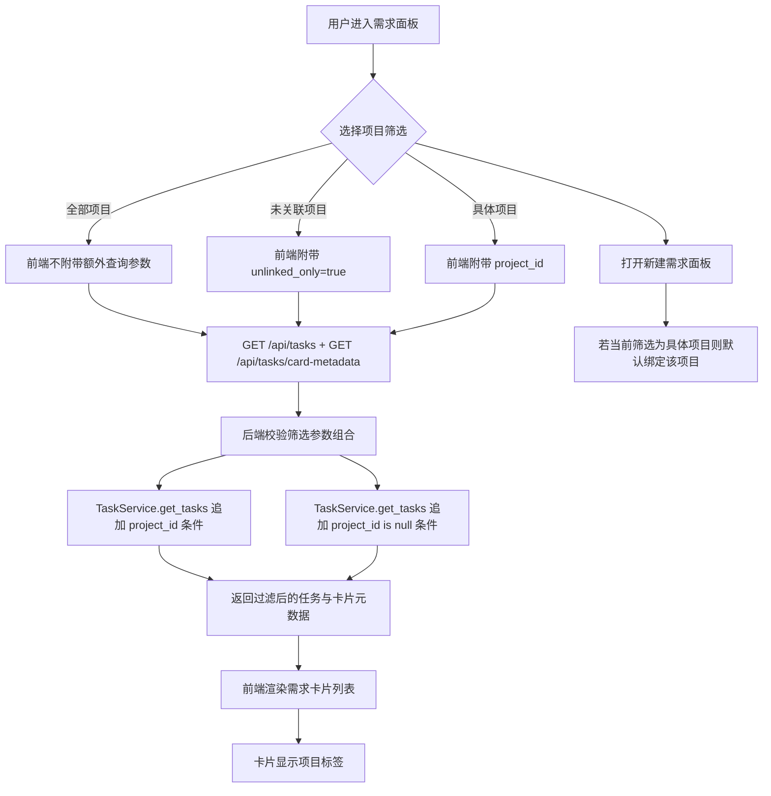

# PRD：需求卡片按项目区分

**文件路径**：`tasks/archive/20260330-143426-prd-task-list-project-filter.md`
**创建时间**：2026-03-30 14:34:26
**状态**：已实现并完成验证（含首屏筛选初始化、响应乱序、卡片日志隔离与 card-metadata fallback 保真回改）

---

## 1. 背景与目标

当前需求卡片列表把不同项目的任务混在同一列里，用户只能依靠标题和上下文猜测任务属于哪个仓库，跨项目切换成本高，未关联项目的任务也缺少独立聚焦入口。

### 目标

- [x] 在需求卡片列表提供按项目筛选能力，支持“全部项目”“未关联项目”和具体项目
- [x] 让列表、卡片元数据轮询、卡片分组/摘要和空态文案都遵循同一筛选条件，包括首屏初始化期间切换筛选时不会丢失真实切换，也不会被旧响应回写覆盖
- [x] 当 `/api/tasks/card-metadata` 失败时，卡片 fallback 仍能保住最近一次 requirement-change 类型与摘要，不会把变更任务误归回 active
- [x] 让卡片本身显示项目标签，即使不筛选也能快速分辨所属项目
- [x] 在当前筛选为某个具体项目时，新建需求默认继承该项目绑定

---

## 2. 实现指南（技术规格）

### 核心数据流

前端维护 `selectedTaskProjectFilterValue`，并把它转换成 API 查询参数后同时传给 `/api/tasks` 与 `/api/tasks/card-metadata`。后端统一校验 `project_id` / `unlinked_only` 组合，再由 `TaskService.get_tasks()` 负责实际查询过滤。返回结果会驱动需求列表、卡片轮询、空态提示，以及“新建需求”面板的默认项目选择。

### 2.1 变更矩阵（Change Matrix）

| Change Target | Current State | Target State | How to Modify | Affected Files |
|---|---|---|---|---|
| 任务列表 API 过滤参数 | `/api/tasks` 和 `/api/tasks/card-metadata` 只能返回当前账户全部任务 | 两个接口都支持 `project_id` 或 `unlinked_only=true` 过滤 | 在路由层新增可选查询参数、复用统一校验函数，并把过滤条件下传到 service | `dsl/api/tasks.py`, `dsl/services/task_service.py` |
| 需求卡片变更快照来源 | 卡片 `changes/active` 分组和摘要仍依赖前端全局 `/logs` 最近 100 条窗口 | `TaskCardMetadata` 直接返回最近一次需求变更类型与摘要，卡片不再受跨项目日志分页挤压影响 | 在后端卡片元数据构建时解析最新 requirement-change 日志，并让前端卡片视图只消费 metadata | `dsl/api/tasks.py`, `dsl/schemas/task_schema.py`, `frontend/src/App.tsx`, `frontend/src/types/index.ts`, `tests/test_tasks_api.py` |
| 后端任务查询 | `TaskService.get_tasks()` 仅支持按生命周期过滤 | 同时支持按项目 ID 或未关联项目过滤 | 扩展 service 签名并拼接 `Task.project_id` 条件 | `dsl/services/task_service.py` |
| 前端任务 API 客户端 | `taskApi.list()` / `listCardMetadata()` 无法传筛选条件 | 支持拼装 `project_id` / `unlinked_only` 查询串 | 新增 `TaskListOptions` 和查询串构造函数 | `frontend/src/api/client.ts` |
| 前端筛选状态与 UI | 需求列标题区没有项目维度控制 | 标题区新增项目筛选下拉、当前筛选副标题和对应空态文案 | 在 `App` 中维护筛选 state，派生选项、标签和请求参数，并在筛选切换时刷新数据 | `frontend/src/App.tsx`, `frontend/src/index.css`, `frontend/src/utils/task_project_filter.ts` |
| 卡片区分能力 | 卡片只显示标题、阶段和摘要，跨项目视觉区分弱 | 卡片展示项目标签；新建需求面板默认继承当前项目筛选 | 在 view model 中补充 `projectLabel`，并在打开新建面板时从筛选值推导默认 `project_id` | `frontend/src/App.tsx`, `frontend/src/index.css`, `frontend/src/utils/task_project_filter.ts` |
| card-metadata 错误路径保真 | metadata 请求失败时 fallback 会清空 requirement-change 字段，导致变更任务误回到 active | fallback 优先复用旧 metadata，其次从现有 dev-log 快照恢复 requirement-change 快照 | 新增纯函数工具恢复 `requirement_change_kind` / `requirement_summary`，并在 fallback map 里传入缓存 metadata 与 task-scoped logs | `frontend/src/App.tsx`, `frontend/src/utils/task_card_metadata_fallback.ts`, `frontend/tests/task_card_metadata_fallback.test.ts`, `frontend/package.json` |
| 回归验证与说明 | 无项目筛选专项回归覆盖 | 新增后端 API 测试、前端工具测试和文档说明 | 补充 pytest、Node 工具测试脚本和用户文档 | `tests/test_tasks_api.py`, `frontend/tests/task_project_filter.test.ts`, `frontend/package.json`, `docs/getting-started.md`, `docs/database/schema.md` |

### 2.2 流程图（Flow Diagram）



### 2.3 低保真原型（Low-Fidelity Prototype）

```text
┌──────────────────────────────────────────────────────────────┐
│ Requirements                                   [ + ]        │
│ 当前聚焦：Alpha                                             │
│ 项目筛选  [ 全部项目 v / 未关联项目 / Alpha / Beta ]        │
├──────────────────────────────────────────────────────────────┤
│ [阶段徽标]  5m ago                                           │
│ 任务标题                                                     │
│ [ Alpha ]                                                    │
│ 需求摘要……                                                   │
├──────────────────────────────────────────────────────────────┤
│ 空态示例：                                                   │
│ “Alpha 下暂无需求卡片。”                                     │
└──────────────────────────────────────────────────────────────┘
```

### 2.4 数据模型说明

本次实现未新增或修改持久化字段，只复用既有 `Task.project_id`，因此不需要新增 ER 图。

### 2.8 Interactive Prototype Change Log

No interactive prototype file changes in this PRD.

---

## 3. Global Definition of Done (DoD)

- [x] 后端任务列表和卡片元数据接口支持同一套项目筛选参数
- [x] 前端筛选切换后，需求列表、卡片元数据轮询和空态文案保持一致
- [x] 首屏加载尚未完成时切换项目筛选，不会再被初始化跳过逻辑吞掉
- [x] 快速切换项目筛选或等待轮询返回时，旧请求不会再覆盖更新后的项目视图
- [x] 需求卡片的 `active/changes` 分组与摘要不再依赖全局 `/logs` 窗口，而是跟随当前筛选任务集合的 card metadata
- [x] 当 `GET /api/tasks/card-metadata` 失败但任务列表和日志快照仍可用时，需求卡片仍能保住 requirement-change 快照，不会把变更任务错分到 active
- [x] 需求卡片显示项目标签，未关联任务也有稳定文案
- [x] 当前筛选为具体项目时，新建需求默认继承该项目绑定
- [x] 保持默认行为不变：选择“全部项目”时仍展示全部需求
- [x] 相关测试、前端构建和文档构建通过

---

## 4. 用户故事

### US-001：按项目聚焦需求列表

**Description:** 作为用户，我希望需求列表能按项目过滤，这样我只看当前仓库相关任务。

**Acceptance Criteria:**
- [x] 我可以选择“全部项目”“未关联项目”或任一具体项目
- [x] 切换后只展示匹配项目条件的任务卡片
- [x] 任务卡片元数据接口与主列表使用相同过滤条件

### US-002：在混合列表里快速看出所属项目

**Description:** 作为用户，我希望即使不过滤，也能直接在卡片上看见项目标签。

**Acceptance Criteria:**
- [x] 每张需求卡片都显示项目标签
- [x] 未绑定项目时显示“未关联项目”
- [x] 已绑定但项目信息缺失时显示可识别的兜底文案

### US-003：创建需求时继承当前项目上下文

**Description:** 作为用户，我希望在已聚焦某个项目时新建需求默认绑定该项目，减少重复选择。

**Acceptance Criteria:**
- [x] 当筛选值为具体项目时，打开新建需求面板会预填该项目
- [x] 当筛选值为“全部项目”或“未关联项目”时，不自动绑定项目

---

## 5. 功能需求

- FR-1：`GET /api/tasks` 支持 `project_id` 和 `unlinked_only` 可选查询参数。
- FR-2：`GET /api/tasks/card-metadata` 支持与任务列表一致的项目筛选参数。
- FR-3：当 `project_id` 与 `unlinked_only=true` 同时出现时，后端返回 422。
- FR-4：前端 `taskApi` 能根据当前筛选拼装正确的查询参数。
- FR-5：需求列表标题区展示项目筛选控件和当前聚焦副标题。
- FR-6：需求卡片展示项目标签，并根据筛选上下文更新空态文案。
- FR-7：新建需求面板在“具体项目”筛选下默认继承该项目绑定。
- FR-8：首屏初始化请求尚未完成时，如果用户切换项目筛选，前端必须在初始化结束后按最新筛选值补发任务列表刷新，不能用一次性跳过逻辑吞掉真实切换。
- FR-9：任务列表与任务卡片元数据的筛选相关响应必须采用 latest-only 提交策略，旧请求完成后不能覆盖当前筛选视图。
- FR-10：`GET /api/tasks/card-metadata` 必须返回最近一次 requirement-change 的类型与摘要，供前端卡片分组/摘要直接使用，避免再依赖全局 `/api/logs` 分页窗口。
- FR-11：当前端进入 `card-metadata` fallback 路径时，必须优先沿用缓存中的 requirement-change 快照；若缓存缺失，再从当前可用的任务日志快照恢复，避免把变更任务错误归入 active。

---

## 6. Non-Goals

- 不新增项目管理能力，也不修改项目绑定锁定规则
- 不提供多选项目、模糊搜索项目或跨项目聚合统计
- 不改动 `Task` 数据模型，只复用现有 `project_id`
- 不新增原型页或独立的筛选后端缓存机制

---

## 7. 交付同步

### 实际交付文件

- `dsl/api/tasks.py`
- `dsl/schemas/task_schema.py`
- `dsl/services/task_service.py`
- `frontend/src/App.tsx`
- `frontend/src/api/client.ts`
- `frontend/src/index.css`
- `frontend/src/types/index.ts`
- `frontend/src/utils/task_project_filter.ts`
- `frontend/src/utils/task_card_metadata_fallback.ts`
- `frontend/tests/task_card_metadata_fallback.test.ts`
- `frontend/tests/task_project_filter.test.ts`
- `frontend/package.json`
- `tests/test_tasks_api.py`
- `docs/architecture/system-design.md`
- `docs/getting-started.md`
- `docs/database/schema.md`

### 验证记录

- `uv run pytest tests/test_tasks_api.py -k 'filters_by_project_id or conflicting_project_filters or filters_unlinked_tasks'`
- `cd frontend && npm run test:task-project-filter`
- `cd frontend && npm run build`
- `just docs-build`
- `cd frontend && npm run test:task-project-filter`（blocker fix 复跑）
- `cd frontend && npm run build`（blocker fix 复跑）
- `just docs-build`（blocker fix 复跑）
- `cd frontend && npm run test:task-project-filter`（response-order fix 复跑）
- `cd frontend && npm run build`（response-order fix 复跑）
- `just docs-build`（response-order fix 复跑）
- `uv run pytest tests/test_tasks_api.py -k "list_tasks_filters_by_project_id or list_tasks_rejects_conflicting_project_filters or list_task_card_metadata_filters_unlinked_tasks or list_task_card_metadata_includes_latest_requirement_change_snapshot"`（card-metadata snapshot fix）
- `cd frontend && npm run test:task-project-filter`（card-metadata snapshot / committed subtitle fix 复跑）
- `cd frontend && npm run build`（card-metadata snapshot / committed subtitle fix 复跑）
- `just docs-build`（card-metadata snapshot / committed subtitle fix 复跑）
- `cd frontend && npm run test:task-card-metadata-fallback`（card-metadata fallback 保真 fix）
- `cd frontend && npm run test:task-project-filter`（card-metadata fallback 保真 fix 复跑）
- `cd frontend && npm run build`（card-metadata fallback 保真 fix 复跑）
- `just docs-build`（card-metadata fallback 保真 fix 复跑）
- `uv run pytest tests/test_tasks_api.py -k "list_tasks_filters_by_project_id or list_tasks_rejects_conflicting_project_filters or list_task_card_metadata_filters_unlinked_tasks or list_task_card_metadata_includes_latest_requirement_change_snapshot"`（本轮 Codex 复核）
- `cd frontend && npm run test:task-project-filter`（本轮 Codex 复核）
- `cd frontend && npm run test:task-card-metadata-fallback`（本轮 Codex 复核）
- `cd frontend && npm run build`（本轮 Codex 复核）
- `just docs-build`（本轮 Codex 复核）

### 偏差与说明

- 本次没有新增交互原型文件，因为需求目标是补齐现有控制台中的筛选与标识能力，不需要额外原型页承载评审。
- `code-review` 自检过程中发现新增 422 常量使用了已弃用名字，已改为 `HTTP_422_UNPROCESSABLE_CONTENT` 并保留现有行为。
- `self-review` 额外发现两类前端竞争条件：一类是首屏初始化尚未完成时的真实筛选切换，另一类是快速切换/轮询下的旧响应回写。最终实现同时保留“最近一次已发出请求的筛选值”判断，并为任务列表与任务卡片元数据增加按流独立的 latest-only 请求 token 与当前筛选校验。
- 最后一轮 blocker fix 没有再扩展 `/api/logs` 能力；改为让 `/api/tasks/card-metadata` 直接携带最近一次 requirement-change 快照，因为它已经基于当前筛选任务集合加载了完整日志历史，这样能更小范围地切断卡片对全局日志窗口的依赖。
- 最后一轮 error-path 回改没有改动后端接口；前端 fallback 直接优先复用已有 `TaskCardMetadata` 中的 requirement-change 快照，若缓存为空再回退到当前 dev-log 快照，以最小范围修正 `card-metadata` 请求失败时的错误分组。

### Lessons Learned

- 如果前端列表存在单独的卡片元数据轮询链路，筛选条件必须同时下沉到主列表和元数据接口，否则 UI 会出现“列表过滤了但轮询仍扫全量任务”的错位。
- 对于这种“列表上下文影响创建默认值”的需求，把筛选转换逻辑集中到独立工具模块里，比直接散落在 `App.tsx` 更容易测试和维护。
- 对于初始化后需要“跳过一次 effect”的场景，比起一次性布尔标记，记录最近一次真实请求对应的业务值更稳妥，因为它能区分冗余触发和用户在加载期内做出的真实操作。
- 对于有轮询和静默刷新并存的列表视图，仅在请求发起时快照筛选值还不够；真正安全的提交条件是“该响应属于这条数据流的最新请求”并且“它的筛选值仍然等于当前筛选值”。
- 如果卡片列表本身要显示“最近一次需求变更”并据此分组，就不应该继续依赖全局 `/api/logs` 的分页窗口；更稳妥的做法是把这个快照并入已经按任务集合聚合的 `card-metadata` 接口。
- 如果前端测试继续使用 Node strip-types 轻量 runner，就要避免在测试运行时直接依赖 TS `enum`；对这类工具函数覆盖，优先使用 type-only imports 和字面量 fixture 更稳。

### Follow-up

- 可补充浏览器层级的 UI 测试，验证筛选切换后选中卡片和空态文案的完整交互。
