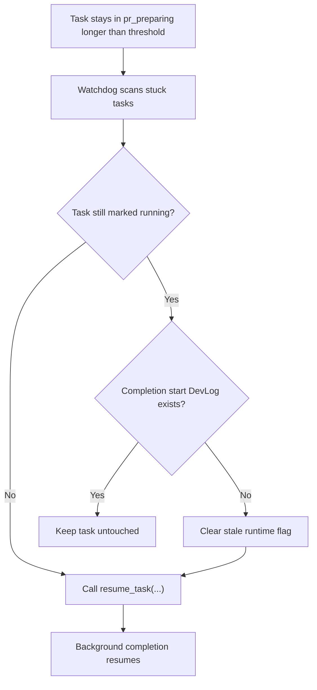

# PRD：PR Preparing 卡死恢复补丁

**原始需求标题**：点击过确认complete之后,它还是一直转圈,但是其实好像已经被删除了
**需求名称（AI 归纳）**：PR Preparing 卡死恢复补丁
**文件路径**：`tasks/20260330-160229-prd-pr-preparing-watchdog-recovery.md`
**创建时间**：2026-03-30 16:02:29 CST

## 1. Introduction & Goals

当前存在一类收尾阶段卡死问题：任务已进入 `pr_preparing`，前端展示为“交付收尾中”，但后台 completion worker 实际并没有真正启动，导致没有新的 completion 日志、UI 也因为 `is_codex_task_running=true` 而隐藏普通 `Complete` 按钮。

本次交付目标：

- 让 stuck-task watchdog 覆盖 `pr_preparing` 阶段
- 仅在“completion worker 从未写出 start signal”的情况下清理陈旧运行态
- 自动恢复正常 `resume` 链路，而不是扩展错误的 manual-complete 入口
- 修复 completion runner-agnostic wrapper 与当前 completion 参数合同的签名漂移
- 为该恢复逻辑补上自动化回归测试
- 同步更新文档，说明 `pr_preparing` 也存在自动补救机制

## 2. Implementation Guide (Technical Specs)

`Complete` 的正常链路仍然保持不变：`POST /api/tasks/{id}/complete` 把任务推进到 `pr_preparing`，再由后台 `run_codex_completion(...)` 执行 `git add . -> git commit -> git rebase main -> merge -> cleanup`。
实现阶段额外发现：watchdog 把 `pr_preparing` 纳入恢复之后，后台 `resume` 虽然能重新调度 completion，但统一入口 `automation_runner.run_task_completion(...)` 仍沿用旧的 `task_summary_str` 参数签名，导致一恢复就抛出 `TypeError: run_task_completion() got an unexpected keyword argument 'commit_information_text_str'`。
因此本次修复分成两层：先让 watchdog 能发现并恢复 stuck `pr_preparing`，再让 completion wrapper 正确转发新的 commit-information 合同。

### 2.1 Change Matrix

| Change Target | Current State | Target State | How to Modify | Affected Files |
|---|---|---|---|---|
| Watchdog stage coverage | `TaskRunnerWatchdogService` 只监控 `prd_generating` / `implementation_in_progress` / `self_review_in_progress` / `test_in_progress` | `pr_preparing` 也纳入卡死扫描 | 扩展 `_WATCHED_RUNNING_STAGES`，让 completion 阶段也能进入 stuck-task 补救 | `dsl/services/task_runner_watchdog_service.py` |
| Stale completion runtime detection | `pr_preparing` 若只剩陈旧 `is_task_automation_running` 标记，watchdog 会直接跳过 | 对“未写 completion start DevLog 的假运行态”先清标记再恢复 | 增加 completion-start-signal 检测 helper；缺失时清理陈旧进程内 running flag | `dsl/services/task_runner_watchdog_service.py` |
| Completion wrapper contract | `automation_runner.run_task_completion(...)` 仍使用旧的 `task_summary_str` 形参，并把旧字段继续传给 `run_codex_completion(...)` | 统一入口与 API/runner 现有 `commit_information_text_str` / `commit_information_source_str` 合同保持一致 | 更新 wrapper 签名、docstring 和转发字段，消除 watchdog / resume / `/complete` 的 `TypeError` | `dsl/services/automation_runner.py` |
| Regression coverage | 当前没有 watchdog 专测覆盖 `pr_preparing` 卡死恢复 | 新增正向/负向回归测试 | 增加“清掉 stale runtime 并 resume”与“已有 start log 不应误恢复”两条测试 | `tests/test_task_runner_watchdog_service.py` |
| Wrapper regression coverage | 当前没有 completion wrapper 参数转发回归 | 新增 wrapper 合同测试 | 增加 completion wrapper 参数转发测试，锁住 `commit_information_*` 合同 | `tests/test_automation_runner_registry.py` |
| Architecture/dev docs | 文档说明了 `pr_preparing` 的正常 Git 收尾，但没写 stuck recovery | 文档明确说明 `pr_preparing` 也有 watchdog 自动补救 | 在系统设计和 DSL 开发指南中补充 `pr_preparing` watchdog 行为 | `docs/architecture/system-design.md`, `docs/guides/dsl-development.md` |

### 2.2 Flow Diagram



### 2.3 Low-Fidelity Prototype

```text
+-----------------------------+
| Task: PR Prep               |
| Status: spinning forever    |
+-----------------------------+
            |
            v
+-----------------------------+
| Watchdog tick               |
| - stage older than 5m       |
| - no completion start log   |
+-----------------------------+
            |
            v
+-----------------------------+
| Clear stale running flag    |
| Resume completion flow      |
+-----------------------------+
```

### 2.4 ER Diagram

No persistent schema changes in this PRD.

### 2.8 Interactive Prototype Change Log

No interactive prototype file changes in this PRD.

## 3. Global Definition of Done (DoD)

- [x] Typecheck and Lint passes
- [x] Verify visually in browser (if UI related)
- [x] Follows existing project coding standards
- [x] No regressions in existing features

## 4. User Stories

### US-001：作为任务操作者，我希望卡住的 `PR Prep` 能自动恢复
**Description:** As an operator, I want a stranded `pr_preparing` task to regain a real recovery path so that the UI does not stay forever in a fake “still finalizing” state.

**Acceptance Criteria:**
- [x] `pr_preparing` 被纳入 stuck-task watchdog 的扫描范围
- [x] 没有 completion start signal 的假运行态会被清掉并自动恢复
- [x] 真实已启动的 completion 不会被误清理

### US-002：作为维护者，我希望这类恢复逻辑有回归保护
**Description:** As a maintainer, I want automated tests for the stale `pr_preparing` path so that future runner/watchdog refactors do not reintroduce the dead-end.

**Acceptance Criteria:**
- [x] 存在“stale runtime -> clear -> resume”的自动化测试
- [x] 存在“已有 completion start log -> 不误恢复”的自动化测试
- [x] 存在 completion wrapper 参数转发回归，防止 `commit_information_*` 再次漂移

## 5. Functional Requirements

1. **FR-1**：stuck-task watchdog 必须把 `WorkflowStage.PR_PREPARING` 视为可恢复阶段之一。
2. **FR-2**：对于超过阈值的 `pr_preparing` 任务，系统必须先判断当前 completion worker 是否已经写出 completion start `DevLog`。
3. **FR-3**：若 `pr_preparing` 任务还未写出 completion start `DevLog`，watchdog 必须允许清理进程内残留的运行标记并继续恢复。
4. **FR-4**：若 completion start `DevLog` 已存在，watchdog 不得主动清理该任务的运行标记。
5. **FR-5**：恢复动作必须继续复用既有 `resume_task(...)` 链路，而不是新增新的 completion API。
6. **FR-6**：本次修复不得改变 `Complete` 的既有 Git 顺序：`git add -> git commit -> git rebase -> merge -> cleanup`。
7. **FR-7**：本次修复不得放宽 `manual_completion_candidate` 的判定，不得把“分支仍存在”的任务误导进 manual-complete。
8. **FR-8**：`automation_runner.run_task_completion(...)` 必须与当前 completion runner 合同保持一致，接受并转发 `commit_information_text_str` 与 `commit_information_source_str`。
9. **FR-9**：实现必须包含自动化回归测试与对应文档同步。

## 6. Non-Goals

- 不重构普通 `Complete` 的 Git 执行细节
- 不新增数据库字段、表或新的工作流阶段
- 不把 manual-complete 扩展为普通 completion 的通用兜底入口
- 不修改前端 `Complete` / `确认 Complete` 的基本门禁规则

## 7. Implementation Outcome

### Delivered Files

- `dsl/services/task_runner_watchdog_service.py`
- `dsl/services/automation_runner.py`
- `tests/test_task_runner_watchdog_service.py`
- `tests/test_automation_runner_registry.py`
- `docs/architecture/system-design.md`
- `docs/guides/dsl-development.md`

### Verification

| Command | Purpose | Result |
|---|---|---|
| `UV_CACHE_DIR=/tmp/uv-cache uv run pytest tests/test_automation_runner_registry.py::test_run_task_completion_forwards_commit_information_contract -q` | Verify completion wrapper forwards the current commit-information contract | Passed (`1 passed`) |
| `UV_CACHE_DIR=/tmp/uv-cache uv run pytest tests/test_automation_runner_registry.py::test_run_task_prd_forwards_auto_confirm_flag -q` | Sanity-check adjacent wrapper regression coverage | Passed (`1 passed`) |
| `UV_CACHE_DIR=/tmp/uv-cache uv run pytest tests/test_task_runner_watchdog_service.py -q` | Verify new watchdog recovery behavior | Passed (`2 passed`) |
| `UV_CACHE_DIR=/tmp/uv-cache uv run pytest tests/test_tasks_api.py::test_resume_task_schedules_pr_preparing_completion_with_resolved_commit_information -q` | Sanity-check existing `pr_preparing` resume contract | Passed (`1 passed`) |
| `git diff --check -- dsl/services/task_runner_watchdog_service.py tests/test_task_runner_watchdog_service.py .claude/planning/current/task_plan.md .claude/planning/current/findings.md .claude/planning/current/progress.md` | Ensure touched diffs are whitespace-clean | Passed |

### Variances

- 原始用户感知是“按钮没了、像已经被删了”；实际根因并不是 manual-complete 刷新问题，而是 `pr_preparing` completion 从未真正启动、且 watchdog 没有兜底恢复这一阶段。
- watchdog 修复落地后又暴露出第二层根因：completion wrapper 仍停留在旧签名，导致恢复动作一调度就直接 `TypeError`；因此最终交付同时包含恢复策略和 wrapper 合同修复。
