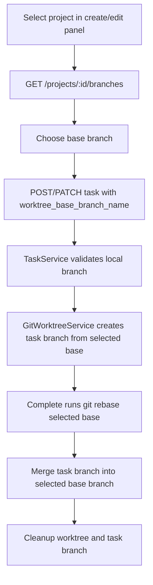
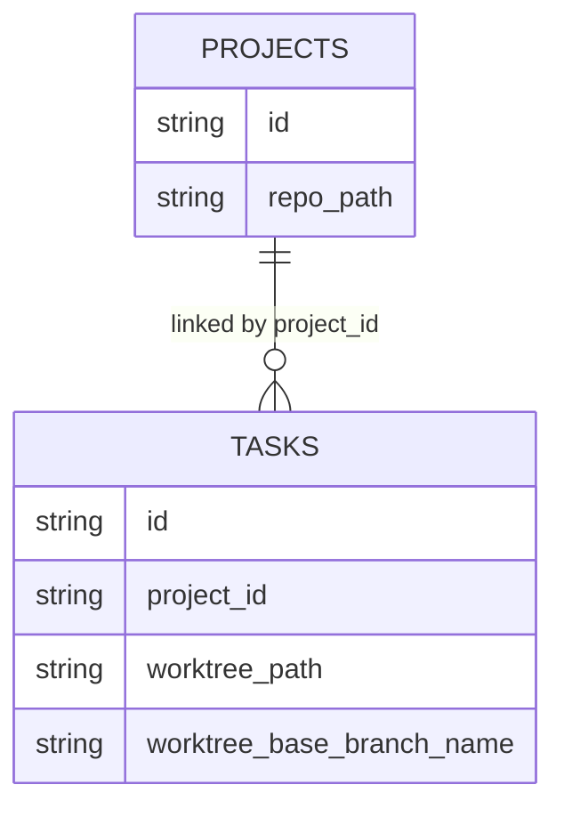

# PRD: Selectable Task Worktree Base Branch

## 1. Introduction & Goals

Koda previously assumed `main` when creating task worktrees and when completing task branches. Repositories that use another active branch could create worktrees from the wrong base and later fail branch-health or completion checks.

Goals:

- Let users choose a local base branch when creating or editing a not-yet-started task.
- Persist that branch on the task and use it consistently for worktree creation, completion rebase/merge, cleanup, and destroy cleanup.
- Keep `main` as the backwards-compatible default for existing tasks and databases.

## 2. Requirement Shape

- Actor: Dashboard user creating or editing a requirement linked to a Git project.
- Trigger: User selects a linked project, then selects a branch from that project's local branches.
- Expected behavior: Koda creates the task worktree from the selected branch and completes the task back into the same selected branch.
- Scope boundary: Only local branches are selectable. Remote branch discovery, branch creation, and rebasing old existing task worktrees are out of scope.

## 3. Repository Context And Architecture Fit

Existing path:

- Task persistence and workflow state live in `backend/dsl/models/task.py`, `backend/dsl/schemas/task_schema.py`, and `backend/dsl/services/task_service.py`.
- Project Git probing belongs in `backend/dsl/services/project_service.py` and route exposure belongs in `backend/dsl/api/projects.py`.
- Worktree Git commands belong in `backend/dsl/services/git_worktree_service.py` and repo-local scripts under `scripts/`.
- Completion orchestration belongs in `backend/dsl/services/codex_runner.py`, with runner-agnostic forwarding in `backend/dsl/services/automation_runner.py`.
- Dashboard state and submission payloads live in `frontend/src/App.tsx`, `frontend/src/api/client.ts`, and `frontend/src/types/index.ts`.

Architecture constraints:

- Route handlers should validate HTTP concerns and delegate business rules to service-layer functions.
- Git command execution should remain in service helpers, not in frontend or schema models.
- Database changes use the existing `utils/database.py` incremental schema patch pattern.

## 4. Recommendation

Recommended approach:

Extend the existing task model with `worktree_base_branch_name`, defaulting to `main`, expose a project-local branch listing endpoint, and thread the stored branch through existing worktree and completion services.

This is the minimal fit because it avoids a new worktree configuration table or separate project default-branch abstraction. The branch choice is task-specific and must remain stable even if the project checkout changes later.

Alternatives considered:

- Project-level default branch only: rejected because two tasks in the same project may intentionally target different base branches.
- Auto-detect current branch without storing it: rejected because completion must use the same base branch that created the task worktree.

## 5. Implementation Guide

Core logic:

1. Frontend loads `/projects/{project_id}/branches` when a project is selected.
2. Frontend defaults branch selection to current local branch, then `main`, then the first local branch.
3. Task create/update payloads include `worktree_base_branch_name`.
4. Backend validates branch syntax and linked-project local branch existence before persisting.
5. Worktree creation uses the stored branch instead of hardcoded `main`.
6. Completion rebase/merge, remote resolution, completion cleanup, and destroy cleanup use the stored branch.

Change Matrix:

| Area | Change |
| --- | --- |
| Data model | Added `tasks.worktree_base_branch_name` with `main` default |
| Project API | Added `GET /api/projects/{project_id}/branches` |
| Task API | Create/update/response schemas now carry `worktree_base_branch_name` |
| Git services | Worktree create/cleanup/destroy and completion flow accept base branch |
| Frontend | Create/edit panels show branch selector for linked projects |
| Scripts | `scripts/git_worktree.sh` accepts `--base <branch>` |
| Docs/tests | Updated completion docs and added non-main branch coverage |

Flow:

ER impact:

## 6. Definition Of Done

- Task creation and edit flows can select a linked project's local base branch.
- Backend rejects missing or invalid base branches for linked tasks.
- Worktree create and completion no longer assume `main` except as the compatibility default.
- Documentation and tests describe the selected-base behavior.
- Targeted backend tests, frontend build, and docs build pass.

## 7. Acceptance Checklist

Architecture Acceptance:

- [x] Git probing stays in `ProjectService` / `GitWorktreeService`.
- [x] Task service owns validation and persistence rules.
- [x] Frontend only consumes branch list API and does not run Git commands.

Behavior Acceptance:

- [x] New linked tasks can store `worktree_base_branch_name=develop`.
- [x] Starting a task creates the worktree from `develop` when selected.
- [x] Completion rebase, remote fast-forward, checkout, merge, and cleanup receive the selected base branch.
- [x] Started tasks cannot change their base branch.

Documentation Acceptance:

- [x] Completion docs use `<worktree_base_branch_name>` instead of hardcoded `main`.
- [x] API reference includes the new project branch list route.

Validation Acceptance:

- [x] `uv run pytest tests/test_git_worktree_service.py tests/test_task_service.py tests/test_projects_api.py tests/test_codex_runner.py tests/test_tasks_api.py tests/test_automation_runner_registry.py -q`
- [x] `cd frontend && npm run build`

## 8. User Stories

- As a user working in a repository whose active branch is not `main`, I can choose the correct base branch before creating a task worktree.
- As a user editing a backlog task, I can change the base branch before any worktree exists.
- As a user completing a task, I expect Koda to merge back into the same base branch the task was created from.

## 9. Functional Requirements

- FR-1: Store `worktree_base_branch_name` on every task, defaulting to `main`.
- FR-2: Expose a project branch list endpoint returning local branch names and current branch.
- FR-3: Include base branch in task create/update/response API contracts.
- FR-4: Validate base branch syntax and local existence for linked projects.
- FR-5: Lock base branch changes after the task starts or has a worktree.
- FR-6: Use the stored base branch for worktree create, completion rebase/merge, cleanup, and destroy cleanup.
- FR-7: Update dashboard create/edit forms with branch selection for linked projects.

## 10. Non-Goals

- Creating local branches from the UI.
- Listing remote-only branches.
- Automatically fixing existing task records whose worktrees were already created from the wrong branch.
- Renaming the legacy `merged_to_main` result field in one pass.

## 11. Risks And Follow-Ups

- Existing in-progress tasks receive `main` as the migration default; users with already-created wrong-base worktrees must recreate or manually repair those tasks.
- Repo-local custom worktree scripts that implement `new-worktree.sh` now receive a third positional base-branch argument; scripts that ignore extra args continue to behave as before.
- Future follow-up: allow project-level preferred base branch if repeated per-task selection becomes noisy.

## 12. Decision Log

- 2026-04-25: Chose task-level branch persistence to keep completion deterministic.
- 2026-04-25: Chose local branch selection only to avoid remote discovery and branch-creation scope expansion.
- 2026-04-25: Kept `main` as the default for compatibility with existing tasks and database rows.
