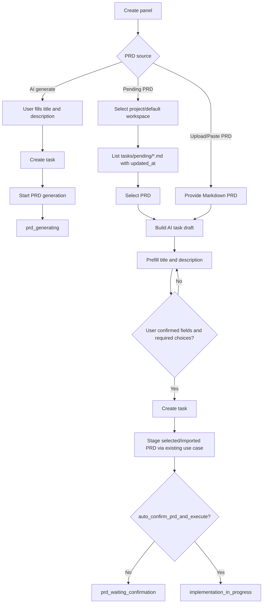

# PRD: PRD-First Task Draft Creation

**需求名称（AI 归纳）**：先选/上传 PRD，再由 AI 预填并确认创建 Task

**原始需求标题**：支持直接选择 pending PRD 或上传 PRD 后创建任务

**创建日期**：2026-04-27

**状态**：Implemented

## 1. Introduction & Goals

当前 Koda 已支持在任务创建后，从 `tasks/pending` 选择 PRD 或手动导入 PRD，并复用现有 PRD 确认与执行链路。但用户现在必须先创建一个 task，才能进入这两个入口。目标是允许用户在创建 task 之前先选择已有 PRD 或上传 PRD，由 AI 根据 PRD 预填 task title 与 description，用户确认并补齐必填项后再真正创建 task。

目标：

1. 用户可以从创建面板直接选择 `tasks/pending/*.md` PRD，且列表必须标注 PRD 文件时间戳。
2. 用户可以从创建面板直接上传或粘贴 PRD Markdown。
3. Pending 选择与上传 PRD 后，系统先生成 task draft，不创建 task。
4. AI 根据 PRD 内容预填 title 与 description，用户可以修改。
5. 用户必须确认 AI 预填信息并补齐必填选择项后，才能创建 task。
6. 最终创建成功后，行为与现有“创建 task 后选择 pending/import PRD”一致。
7. AI 创建 PRD 仍然必须先创建 task，现有 AI 生成 PRD 流程不变。

## 2. Requirement Shape

- **Actor**：在 Koda Dashboard 创建需求的用户。
- **Trigger**：用户在创建 task 前选择“从 `tasks/pending` 选择 PRD”或“上传/粘贴 PRD”。
- **Expected behavior**：系统读取 PRD，AI 预填 task title 与 description，展示可编辑 task draft；用户确认 title/description 并完成必填选择后，系统创建 task，并把该 PRD staging 到新 task 的 `tasks/` 根目录。
- **Explicit scope boundary**：本需求只改变 pending/import PRD 的创建入口；AI 生成 PRD 仍要求先创建 task，不做 taskless AI PRD generation。

## 3. Repository Context And Architecture Fit

### Current Relevant Modules / Files

| Area | Current file | Current responsibility |
| --- | --- | --- |
| Task API | `backend/dsl/api/tasks.py` | 创建 task、启动 PRD generation、执行、恢复、完成等任务主生命周期 |
| Task service | `backend/dsl/services/task_service.py` | `TaskService.create_task` 创建 backlog task，并维护 task 状态 |
| Task schema/model | `backend/dsl/schemas/task_schema.py`, `backend/dsl/models/task.py` | `task_title`, `requirement_brief`, `project_id`, `worktree_base_branch_name`, `auto_confirm_prd_and_execute` |
| PRD source domain | `backend/dsl/prd_sources/` | pending PRD 列表、选择 pending、manual import、PRD 文件 staging、阶段推进 |
| PRD source API | `backend/dsl/prd_sources/api.py` | 当前只有 task-scoped endpoints：`/api/tasks/{task_id}/prd-sources/*` |
| PRD source frontend | `frontend/src/App.tsx`, `frontend/src/api/client.ts`, `frontend/src/utils/prd_source_selection.ts` | 当前只在已有 task 详情页展示 PRD 来源选择 |
| Pending PRD DTO | `backend/dsl/prd_sources/schemas.py`, `frontend/src/types/index.ts` | `PendingPrdFile` 已包含 `updated_at`，但 UI 选择项目前只显示 title/file name 与 size |
| Docs | `docs/guides/dsl-development.md`, `docs/dev/evaluation.md`, `docs/core/ai-assets.md` | 已说明三种 PRD 来源与 task-scoped staging 行为 |

### Existing Path

最接近当前需求的路径是现有 `backend/dsl/prd_sources/`：

1. `ListPendingPrdFilesUseCase` 列出 task 作用域 pending PRD。
2. `SelectPendingPrdUseCase` 把 pending PRD staging 到 task worktree 的 `tasks/` 根目录。
3. `ImportPrdUseCase` 把上传/粘贴 Markdown staging 到 task worktree 的 `tasks/` 根目录。
4. `SqlAlchemyTaskWorkflowAdapter.mark_prd_ready()` 把 task 推进到 `prd_waiting_confirmation`，并支持 `auto_confirm_prd_and_execute`。

### Reuse Candidates

- 复用 `backend/dsl/prd_sources/domain/policies.py` 的 Markdown 校验、pending 路径校验、metadata 解析和语义文件名规则。
- 复用 `FilesystemPrdRepository` 的 pending 列表、UTF-8 读取、大小限制、staging 写入/移动规则。
- 复用 `TaskService.create_task` 的项目校验、base branch 校验和 Task 持久化。
- 复用 `SelectPendingPrdUseCase` 与 `ImportPrdUseCase` 完成最终创建后的 PRD staging。
- 复用前端 `PendingPrdFile.updated_at`，新增格式化展示，不改现有 schema 字段含义。

### Architecture Constraints

- 新能力必须继续落在 `backend/dsl/prd_sources/` 领域切片内，不新增 `backend/dsl/services/prd_source_service.py`。
- 新增 taskless API 不应塞进 `backend/dsl/api/tasks.py`，避免把 PRD source 业务规则散回旧 task route。
- Domain 层不得依赖 FastAPI、SQLAlchemy、真实文件系统或前端类型。
- Task 真正创建前，不能写入半成品 task 记录；用户只有提交确认后的 final create action 才创建 task。
- 所有文件读写必须显式 UTF-8。

### Potential Redundancy Risks

- 不应复制一套 PRD staging 逻辑；task 创建后仍调用既有 pending/import use case。
- 不应新增独立 PRD draft 数据表，除非后续需要跨会话恢复草稿。首版草稿可由前端内存持有，后端只返回建议值。
- 不应新增一个 parallel task creation service；最终 task 创建继续走 `TaskService.create_task`。

## 4. Recommendation

### Recommended Approach

在 `backend/dsl/prd_sources/` 中新增 **task draft** 能力：

1. 新增 taskless pending list API，用于在创建 task 前按项目或默认 workspace 列出 `tasks/pending/*.md`。
2. 新增 draft suggestion API，用于从 pending PRD 或上传/粘贴 PRD Markdown 生成 AI 预填的 title 和 description。
3. 前端创建面板增加 PRD 来源模式：
   - `AI 生成 PRD`：现有流程，必须先创建 task。
   - `从 tasks/pending 选择`：先选 PRD，显示文件时间戳，生成 task draft。
   - `上传/粘贴 PRD`：先导入 PRD 内容，生成 task draft。
4. 用户确认 draft 后，前端调用新的 create-from-PRD endpoints：
   - 创建 task。
   - 立即复用现有 `SelectPendingPrdUseCase` 或 `ImportPrdUseCase` staging PRD。
   - 成功后进入现有 `prd_waiting_confirmation` 或自动执行分流。

### Why This Fits The Current Architecture

该方案把新增入口放进已有 PRD source 领域切片，保持“PRD 来源处理”这个业务边界不变。最终阶段推进仍由当前 `SqlAlchemyTaskWorkflowAdapter` 执行，因此不会产生第二套 PRD ready 语义。

### Rationale For Rejecting Redundant Abstractions

- 不新增 `TaskDraft` 数据库表：首版没有跨设备恢复草稿要求，前端持有草稿即可。
- 不新增独立 PRD storage：上传 PRD 在 final create 时再次提交，pending PRD 在 final create 时按 relative path 重新读取。
- 不新增 taskless AI PRD generation：用户明确要求 AI 创建 PRD 仍必须先创建 task。

### Alternatives Considered

| Alternative | Rejected because |
| --- | --- |
| 先创建隐藏 task，再让用户确认 | 会产生半成品 task，与“确认并勾选必填项后才能开始创建”冲突。 |
| 新增 `task_drafts` 表保存所有 draft | 增加迁移、清理和同步复杂度；当前没有持久草稿恢复需求。 |
| 把新接口加到 `backend/dsl/api/tasks.py` | 会破坏现有 PRD source 领域切片边界，重复旧 services 平铺问题。 |

## 5. Implementation Guide

### Core Logic

1. **选择来源**
   - AI 生成 PRD：沿用现有创建 task 表单，创建 task 后再 `POST /api/tasks/{id}/start`。
   - Pending PRD：用户先选择项目或默认 workspace，再加载 pending PRD 列表。
   - 上传/粘贴 PRD：用户先提供 Markdown 内容。

2. **生成 draft**
   - 后端校验 PRD Markdown。
   - 后端通过新的 `PrdTaskDraftSuggestionUseCase` 生成：
     - `suggested_task_title`
     - `suggested_requirement_brief`
     - `source_type`
     - `source_relative_path`
     - `source_updated_at`（仅 pending）
   - AI 建议失败时，应回退到确定性解析：
     - title 优先 `需求名称（AI 归纳）`
     - 其次 `原始需求标题`
     - 其次第一个 Markdown H1
     - 最后使用文件名或 `Imported PRD`
     - description 使用 PRD 前几段清洗后的摘要

3. **用户确认**
   - title 必填。
   - description/requirement brief 必填。
   - pending 模式必须选择 pending 文件，且 UI 显示该文件 `updated_at`。
   - 项目选择与 base branch 规则沿用当前 create panel；如果选择了项目，base branch 必填。
   - 用户必须勾选“已确认 AI 预填的标题和描述”。
   - `auto_confirm_prd_and_execute` 仍为可选。

4. **最终创建**
   - 后端先重新校验 task create payload。
   - Pending 模式重新读取 pending PRD；如果 `updated_at` 与 draft 时不同，返回 409，提示用户刷新草稿。
   - 调用 `TaskService.create_task` 创建 backlog task。
   - 对新 task 调用既有 `SelectPendingPrdUseCase` 或 `ImportPrdUseCase`。
   - 返回 hydrated `TaskResponseSchema`。

5. **后续行为**
   - 普通模式：进入 `prd_waiting_confirmation`，显示现有 PRD panel。
   - 自动模式：与现有 pending/import 行为一致，进入实现链路。
   - PRD 中的结构化待确认问题继续在 task 创建后的 PRD panel 中处理，不提前搬到创建面板。

### Affected Files

| Path | Expected change |
| --- | --- |
| `backend/dsl/prd_sources/domain/models.py` | 新增 `PrdTaskDraftSourceType`, `PrdTaskDraftSuggestion`, `PendingPrdDraftSource` 等纯模型。 |
| `backend/dsl/prd_sources/domain/policies.py` | 新增 draft title/description fallback 解析策略，复用现有 metadata 提取。 |
| `backend/dsl/prd_sources/application/ports.py` | 新增 AI suggestion port 与 taskless pending source context port。 |
| `backend/dsl/prd_sources/application/use_cases.py` | 新增 `ListTasklessPendingPrdFilesUseCase`, `BuildPrdTaskDraftUseCase`, `CreateTaskFromPrdSourceUseCase`。 |
| `backend/dsl/prd_sources/infrastructure/filesystem_prd_repository.py` | 增加 taskless pending 列表/读取入口；保留路径逃逸防护。 |
| `backend/dsl/prd_sources/infrastructure/task_workflow_adapter.py` | 增加 project/default workspace 解析；最终创建后复用现有 task-scoped staging。 |
| `backend/dsl/prd_sources/infrastructure/ai_draft_suggestion_adapter.py` | 新增小型 adapter 调用当前 automation runner 生成 JSON 建议，失败时让 use case fallback。 |
| `backend/dsl/prd_sources/schemas.py` | 新增 taskless list、draft suggestion、create-from-pending、create-from-import DTO。 |
| `backend/dsl/prd_sources/api.py` | 保留现有 task-scoped router，新增 taskless PRD draft router 并在 app 注册。 |
| `backend/dsl/app.py` | 注册新增 taskless router。 |
| `frontend/src/api/client.ts` | 新增 taskless pending list、draft suggestion、create-from-PRD API。 |
| `frontend/src/types/index.ts` | 新增 PRD task draft 类型与 create-from-PRD payload 类型。 |
| `frontend/src/utils/prd_source_selection.ts` | 扩展 create panel 来源模式、可提交校验、时间戳展示 helper。 |
| `frontend/src/App.tsx` | 创建面板改成 PRD-first draft flow，并保留已有 task detail PRD source panel。 |
| `frontend/src/index.css` | 新增 draft source row、timestamp、confirmation checklist 样式。 |
| `tests/test_prd_sources_domain.py` | 覆盖 fallback title/description 提取。 |
| `tests/test_prd_sources_application.py` | 覆盖 taskless list、draft suggestion、create-from-PRD use case。 |
| `tests/test_prd_sources_api.py` | 覆盖新增 endpoints、stale pending timestamp、上传 UTF-8、错误状态码。 |
| `tests/test_prd_sources_architecture.py` | 继续约束新代码留在领域切片内。 |
| `frontend/tests/prd_source_selection.test.ts` | 覆盖 draft submit gate、timestamp label、source mode 状态。 |
| `docs/guides/dsl-development.md` | 同步说明 PRD-first draft flow。 |
| `docs/dev/evaluation.md` | 增加手工验证步骤。 |

### Change Matrix

| Capability | Current behavior | Target behavior | Reuse path |
| --- | --- | --- | --- |
| AI 生成 PRD | 先创建 task，再生成 PRD | 不变 | `TaskService.create_task`, `POST /api/tasks/{id}/start` |
| Pending PRD 选择 | 只能在已有 task 详情页选择 | 创建 task 前也可选择，并显示 PRD 时间戳 | `prd_sources` pending list + staging |
| Manual PRD import | 只能在已有 task 详情页上传/粘贴 | 创建 task 前也可上传/粘贴 | `ImportPrdUseCase` |
| Title/description | 用户创建 task 时手填 | PRD-first 模式由 AI 预填，用户确认/修改 | 新 draft suggestion use case |
| Task creation gate | title 必填，description 可选 | PRD-first 模式 title/description/必填选择/确认 checkbox 都完成后才能创建 | 前端 submit guard + backend validation |
| Pending timestamp | DTO 有 `updated_at`，详情页选择项未显式标注 | pending 列表和选中摘要必须显示更新时间；final create 校验 stale timestamp | `PendingPrdFile.updated_at` |
| Staging后续链路 | pending/import 成功后进入 PRD ready | 完全一致 | `SelectPendingPrdUseCase`, `ImportPrdUseCase` |

### Flow Diagram



### Low-Fidelity Prototype

```text
Create Task
------------------------------------------------------------
PRD source
( ) AI 生成 PRD
(*) 从 tasks/pending 选择
( ) 上传/粘贴 PRD

Project / workspace        [ my-app                         ]
Base branch                [ main                           ]

Pending PRD
[ 支持导入已有 PRD.md · 12 KB · Updated 2026-04-27 15:42:10 v]

[Generate draft from PRD]
------------------------------------------------------------
AI task draft
Title *
[ 支持直接从已有 PRD 创建任务                         ]

Description *
[ 允许用户在创建 task 前选择 pending PRD 或上传 PRD，   ]
[ 由 AI 预填 task 信息，用户确认后创建 task 并进入 PRD确认 ]

[ ] 我已确认标题和描述
[ ] 必填选择项已完成

Auto-confirm PRD and execute  [ ]

[Create Task From PRD]
```

### API Shape

Recommended endpoint names can be adjusted during implementation, but contracts should remain equivalent:

| Method | Path | Purpose |
| --- | --- | --- |
| `GET` | `/api/prd-sources/pending?project_id=...` | Taskless pending list for create panel. Uses selected project repo, or default workspace when omitted. |
| `POST` | `/api/prd-sources/draft-from-pending` | Reads selected pending PRD and returns AI-prefilled task draft. |
| `POST` | `/api/prd-sources/draft-from-import` | Accepts uploaded/pasted Markdown and returns AI-prefilled task draft. |
| `POST` | `/api/prd-sources/create-task-from-pending` | Creates task, verifies pending timestamp, stages pending PRD, returns `TaskResponseSchema`. |
| `POST` | `/api/prd-sources/create-task-from-import` | Creates task, stages uploaded/pasted PRD, returns `TaskResponseSchema`. |

### External Validation

No web research was used. The PRD is based on repository inspection and the user’s clarified requirements.

## 6. Definition Of Done

- PRD-first pending/import flow is available from the create panel.
- AI generate PRD path remains task-first and behaviorally unchanged.
- Pending PRD choices display file timestamp in the list and selected summary.
- Draft title and description are AI-prefilled with deterministic fallback.
- Task is not created until the user confirms title/description and completes required selections.
- Final create reuses existing PRD staging and PRD ready behavior.
- Backend code follows existing `backend/dsl/prd_sources/` architecture boundaries.
- Docs and evaluation steps are updated.
- Focused backend, frontend, and docs validation pass.

## 7. Acceptance Checklist

### Architecture Acceptance

- [ ] No new `backend/dsl/services/prd_source_service.py` is introduced.
- [ ] New taskless PRD endpoints live in `backend/dsl/prd_sources/api.py` or a sibling file under `backend/dsl/prd_sources/`.
- [ ] `backend/dsl/prd_sources/domain/` does not import FastAPI, SQLAlchemy ORM models, filesystem adapters, or frontend types.
- [ ] Final create-from-PRD use cases reuse `SelectPendingPrdUseCase` / `ImportPrdUseCase` instead of duplicating staging.

### Dependency Acceptance

- [ ] No new runtime dependency is added for draft extraction unless explicitly justified.
- [ ] AI draft generation uses the existing runner configuration through an adapter.
- [ ] AI failure falls back to deterministic metadata/H1/file-name extraction.

### Behavior Acceptance

- [ ] AI generate PRD still requires creating a task first.
- [ ] Pending PRD mode can list `tasks/pending/*.md` before task creation.
- [ ] Pending PRD list items show title/file name, size, and updated timestamp.
- [ ] Selecting a pending PRD returns AI-prefilled title and description.
- [ ] Uploading or pasting PRD Markdown returns AI-prefilled title and description.
- [ ] Create button is disabled until title, description, required selections, and explicit confirmation checkbox are complete.
- [ ] Final pending create verifies `source_updated_at`; if the file changed after draft generation, API returns 409 and no misleading success state is shown.
- [ ] Final create-from-pending creates a task and stages PRD to `tasks/YYYYMMDD-HHMMSS-prd-<slug>.md`.
- [ ] Final create-from-import creates a task and stages uploaded/pasted PRD to `tasks/YYYYMMDD-HHMMSS-prd-<slug>.md`.
- [ ] Normal mode enters `prd_waiting_confirmation`.
- [ ] `auto_confirm_prd_and_execute=true` continues into implementation exactly like existing task-scoped pending/import behavior.
- [ ] Existing task detail PRD source panel continues to work for already-created tasks.

### Documentation Acceptance

- [ ] `docs/guides/dsl-development.md` describes PRD-first draft creation and keeps the task-first AI generation caveat.
- [ ] `docs/dev/evaluation.md` includes manual checks for pending timestamp display, draft confirmation, stale pending detection, and final PRD staging.
- [ ] If API docs are expanded, `mkdocs.yml` nav remains valid.

### Validation Acceptance

- [ ] `uv run pytest tests/test_prd_sources_domain.py -q`
- [ ] `uv run pytest tests/test_prd_sources_application.py -q`
- [ ] `uv run pytest tests/test_prd_sources_api.py -q`
- [ ] `uv run pytest tests/test_prd_sources_architecture.py -q`
- [ ] Frontend PRD source utility tests pass through the repository’s existing frontend test command.
- [ ] `just docs-build`

## 8. User Stories

1. As a user, I can create a task by first choosing an existing pending PRD, so I do not need to create an empty task just to reach the PRD source selector.
2. As a user, I can see each pending PRD’s updated timestamp before choosing it, so I can distinguish similarly named drafts.
3. As a user, I can upload or paste a PRD before creating a task, so I can start from documentation I already have.
4. As a user, I receive AI-prefilled title and description from the selected/imported PRD, so task creation is faster but still under my control.
5. As a user, I must confirm the AI-prefilled fields and required choices before task creation, so accidental task creation is prevented.
6. As a user, I can still create a task first and let AI generate the PRD, because AI PRD creation needs task context.

## 9. Functional Requirements

- **FR-1**: The create panel must expose PRD source modes: AI generate, pending PRD, and manual import.
- **FR-2**: AI generate mode must keep the existing task-first behavior.
- **FR-3**: Pending mode must list Markdown files from `tasks/pending` before task creation.
- **FR-4**: Pending list items must display `updated_at` in a user-readable timestamp format.
- **FR-5**: Pending mode must require a selected pending PRD before draft generation.
- **FR-6**: Manual import mode must support `.md` file upload and pasted Markdown text before task creation.
- **FR-7**: Draft generation must validate Markdown as UTF-8 and enforce existing PRD size/content rules.
- **FR-8**: Draft generation must ask AI to propose `task_title` and `requirement_brief`.
- **FR-9**: Draft generation must provide deterministic fallback suggestions when AI fails or returns invalid JSON.
- **FR-10**: The user must be able to edit the AI-prefilled title and description.
- **FR-11**: The final create action must remain disabled until title and description are non-empty.
- **FR-12**: The final create action must remain disabled until the user explicitly confirms the AI-prefilled title and description.
- **FR-13**: Project and base branch controls must follow existing task creation validation rules.
- **FR-14**: Final create-from-pending must reject stale pending PRD submissions when the file timestamp changed after draft generation.
- **FR-15**: Final create-from-pending must create the task and stage the selected PRD through the existing pending staging use case.
- **FR-16**: Final create-from-import must create the task and stage the imported PRD through the existing import staging use case.
- **FR-17**: Successful PRD-first task creation must return the same hydrated task response shape as normal task mutations.
- **FR-18**: Successful staging must preserve existing `prd_waiting_confirmation` and auto-confirm behavior.
- **FR-19**: Failed staging must surface a clear error and must not show a task as successfully created from PRD.
- **FR-20**: Existing task detail pending/import behavior must not regress.

## 10. Non-Goals

- Do not support AI-generated PRD before task creation.
- Do not add `.docx`, `.pdf`, image, or rich text PRD import.
- Do not persist task drafts in a new database table.
- Do not add collaborative multi-user draft editing.
- Do not change PRD pending-question confirmation semantics; structured PRD questions remain in the existing PRD panel after task creation.
- Do not remove task detail PRD source selection for already-created backlog tasks.

## 11. Risks And Follow-Ups

| Risk | Mitigation |
| --- | --- |
| AI draft generation may be slow in create panel | Show draft generation busy state and deterministic fallback on AI failure. |
| Pending PRD can change between draft and final create | Carry `source_updated_at` from draft and reject stale final create with 409. |
| Upload draft content could be lost if user refreshes before final create | Accept for首版 because persistent task drafts are a non-goal; user can upload again. |
| Worktree creation can fail after task creation starts | Reuse current task/worktree error handling and surface the backend error; avoid claiming success until staging completes. |

## 12. Decision Log

| Date | Decision | Rationale |
| --- | --- | --- |
| 2026-04-27 | PRD-first applies only to pending/import PRD sources. | User explicitly stated AI-created PRD still requires task first. |
| 2026-04-27 | Use task draft state instead of hidden task creation. | Prevents half-created tasks before user confirms title, description, and required fields. |
| 2026-04-27 | Keep implementation inside `backend/dsl/prd_sources/`. | Existing repository already has the correct domain boundary for PRD source behavior. |
| 2026-04-27 | Show and validate pending PRD `updated_at`. | User explicitly requested timestamp marking for pending PRD selection; stale detection prevents creating from an outdated draft. |
| 2026-04-27 | Do not add a persistent draft table in the first implementation. | The requested behavior needs prefill and confirmation, not cross-session draft recovery. |
| 2026-04-27 | Use a safe read-only Codex draft adapter opportunistically and fall back deterministically. | The create panel must remain reliable even when the local runner CLI is unavailable or times out, and untrusted PRD content must not reuse the dangerous task automation runner flags. |

## Implementation Results

Implemented on 2026-04-27.

### Delivered

- Added taskless PRD source APIs under `backend/dsl/prd_sources/api.py`:
  - `GET /api/prd-sources/pending`
  - `POST /api/prd-sources/draft-from-pending`
  - `POST /api/prd-sources/draft-from-import`
  - `POST /api/prd-sources/draft-from-import-text`
  - `POST /api/prd-sources/create-task-from-pending`
  - `POST /api/prd-sources/create-task-from-import`
  - `POST /api/prd-sources/create-task-from-import-text`
- Added PRD task draft domain/application support, including deterministic title/description fallback and stale pending timestamp checks.
- Added an infrastructure adapter that attempts AI draft suggestions through read-only `codex exec` when Codex is the configured runner and falls back when unavailable, invalid, unsupported, or timed out.
- Extended the create panel so pending/import PRD can prefill title and description before task creation.
- Added user confirmation gating before `Create from PRD`.
- Cleared stale create-panel PRD drafts whenever the pending source list is refreshed or project context changes.
- Displayed pending PRD `updated_at` timestamps in the create-panel pending selector and draft summary.
- Preserved existing task-detail PRD source selection behavior.
- Added HTTP-level smoke coverage for the new taskless pending/draft API routes.
- Updated MkDocs development/evaluation documentation.

### Verification

- `uv run python -m py_compile backend/dsl/prd_sources/domain/models.py backend/dsl/prd_sources/domain/policies.py backend/dsl/prd_sources/application/use_cases.py backend/dsl/prd_sources/api.py backend/dsl/prd_sources/infrastructure/task_workflow_adapter.py backend/dsl/prd_sources/infrastructure/draft_suggestion_adapter.py tests/test_prd_sources_application.py tests/test_prd_sources_api.py tests/test_prd_sources_domain.py`
- `uv run pytest tests/test_prd_sources_domain.py tests/test_prd_sources_application.py tests/test_prd_sources_api.py tests/test_prd_sources_architecture.py tests/test_prd_sources_draft_suggestion_adapter.py -q`
- `uv run pytest tests/test_prd_sources_api.py tests/test_prd_sources_draft_suggestion_adapter.py -q`
- `uv run ruff check backend/dsl/prd_sources tests/test_prd_sources_domain.py tests/test_prd_sources_application.py tests/test_prd_sources_api.py tests/test_prd_sources_draft_suggestion_adapter.py`
- `npm run test:prd-source-selection`
- `npm run build`
- `just docs-build`
- `git diff --check`
