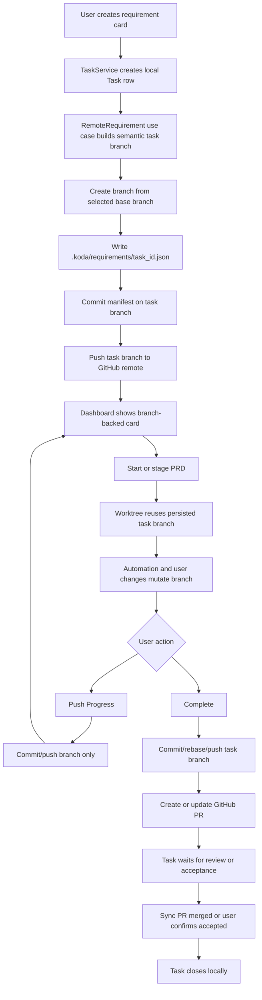
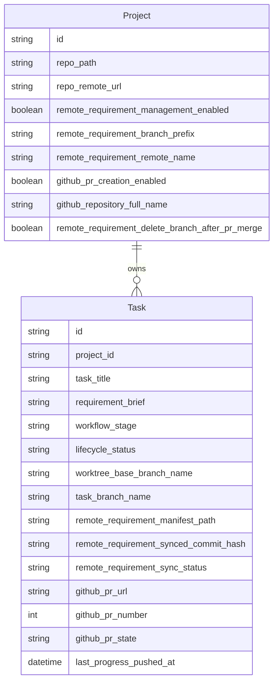

# PRD: Remote Branch And PR-Backed Requirement Collaboration

**Original Need:** 后续需求管理不能只靠本地 SQLite；本地仍然保留 SQLite/MySQL 这类数据库作为运行存储，但协作要能通过 GitHub 同步。创建需求卡片可以创建远程任务分支；下班前可以只提交并 push 分支，暂时不发 PR；点击 `Complete` 时应创建 PR。
**AI-Normalized Name:** Keep local database-backed execution state while using GitHub-synced remote task branches for collaboration and pull requests for completion handoff.
**Date:** 2026-04-27
**Status:** Implemented

## 1. Introduction & Goals

当前 Koda 的需求卡片主要保存在本地 SQLite 中；关联 Git 项目的任务只有在启动或 staging PRD 时才会创建本地 worktree 和任务分支。这个模型适合单机执行，但协作场景会遇到两个问题：远程仓库看不到正在进行的需求卡片，另一台机器也无法可靠恢复这些卡片。

本需求把远程 GitHub 仓库纳入协作闭环，但不取消本地数据库。推荐模型是：本地数据库继续保存任务、日志、媒体、runner 状态和 UI 查询缓存；远程任务分支作为跨机器协作和进度同步的 durable handle；GitHub PR 作为 `Complete` 后的评审和交付载体。

Goals:

- 本地数据库继续存在，当前 SQLite 可继续作为默认执行存储，后续切换 MySQL 也不影响远程协作模型。
- 对启用远程协作的关联项目，创建需求卡片时创建并 push 一个远程任务分支。
- 远程任务分支名称沿用现有 `task/<task_id[:8]>-<semantic-slug>` 语义命名，不引入第二套分支命名规则。
- 每个远程任务分支包含 `.koda/requirements/<task_id>.json` manifest，记录卡片身份、标题、状态、PRD 路径、远程分支和 PR 元数据。
- Koda 能从 GitHub remote 分支和 manifest 同步/恢复本地任务卡片。
- 增加 `Push Progress` 能力：提交并推送当前任务分支，但不创建 PR，任务仍保持进行中。
- 将 `Complete` 调整为创建或更新 GitHub PR，而不是默认直接 merge 到基底分支。
- PR 创建后，任务进入等待评审/验收状态；任务关闭由 PR merged/synced 或用户显式归档确认触发。
- 远程协作必须是项目级 opt-in，不影响无项目任务和本地-only 项目。

## 2. Requirement Shape

- **Actor:** 使用 Koda 管理 GitHub 项目的开发者。
- **Trigger:** 用户创建启用远程协作的需求卡片、点击 `Push Progress`，或点击 `Complete`。
- **Expected Behavior:** Koda 创建本地 Task 记录后创建远程任务分支并写入 manifest；用户可随时把当前 worktree 进度提交并 push 到该远程分支但不发 PR；点击 `Complete` 时 Koda 提交/推送最终任务分支并创建或更新 GitHub PR，随后把任务置为等待 PR 评审/验收。
- **Explicit Scope Boundary:** 本需求只覆盖 GitHub remote branch sync 和 GitHub PR handoff；不接入 GitHub Issues、GitHub Projects、GitLab、Forgejo 或其他工单系统；不把实时 DevLog transcript、媒体附件、runner 进程状态迁移到 Git；不要求无本地仓库的任务支持远程协作。

## 3. Repository Context And Architecture Fit

Current relevant modules/files:

- `backend/dsl/models/task.py`
  - `Task` 当前持久化 `project_id`、`worktree_path`、`worktree_base_branch_name`、`requirement_brief`、`workflow_stage`。
  - 没有持久化真实任务分支名、远程同步状态或 PR 元数据；分支健康目前通过 `task_id` 前缀探测。
- `backend/dsl/models/project.py`
  - `Project` 当前保存本地 repo path、remote URL 和一致性快照。
  - 适合承载项目级远程协作开关、GitHub remote 选择和 PR 创建策略。
- `backend/dsl/services/task_service.py`
  - `create_task(...)` 只创建本地 DB 记录。
  - `_ensure_task_worktree_if_needed(...)` 在任务启动后创建 worktree，并通过 `WorktreeBranchNamingService` 推导任务分支。
  - `build_task_branch_health(...)` 只探测本地分支和本地 worktree。
- `backend/dsl/services/git_worktree_service.py`
  - 已有 `build_task_branch_name(...)`、`create_task_worktree(...)`、`resolve_preferred_remote_name(...)`、cleanup 等 Git 能力。
  - 当前 completion flow 会 fetch/fast-forward 基底分支，但内置路径不 push 任务分支，也不创建 PR。
- `backend/dsl/services/worktree_branch_naming_service.py`
  - 已生成语义任务分支名，可复用于“建卡即建分支”。
- `backend/dsl/prd_sources/`
  - 已按领域切片处理 pending PRD、导入 PRD、路径校验、staging 和任务阶段推进。
  - `FilesystemPrdRepository` 已严格使用 UTF-8 读写 Markdown。
- `backend/dsl/api/tasks.py`
  - 创建、启动、完成、人工完成、PRD 文件读取都在同一任务路由聚合。
  - 完成入口已经围绕 `TaskService`、runner 和 Git 收尾编排。
- `backend/dsl/api/projects.py`
  - 已有项目分支列表和 remote 一致性检查语义，可承载项目级远程协作设置。
- `frontend/src/App.tsx`
  - 创建面板、项目绑定、PRD 来源选择和任务详情动作都集中在主工作台。
- `frontend/src/api/client.ts` 与 `frontend/src/types/index.ts`
  - 统一维护前端 API 合同和 Task/Project 类型。
- Existing docs/tests:
  - `docs/architecture/system-design.md`
  - `docs/guides/dsl-development.md`
  - `docs/dev/evaluation.md`
  - `tests/test_git_worktree_service.py`
  - `tests/test_task_service.py`
  - `tests/test_tasks_api.py`
  - `tests/test_projects_api.py`
  - `tests/test_prd_sources_*.py`

Existing path:

- `create task -> backlog -> start/PRD staging -> create worktree + local task branch -> execute -> complete -> local merge/cleanup`

Target path:

- `create task -> create local+remote task branch + manifest -> work locally -> optional Push Progress -> Complete -> push final branch -> create/update GitHub PR -> wait for PR review/merge -> sync PR merged -> done`

Reuse candidates:

- Reuse `WorktreeBranchNamingService` for semantic branch names.
- Extend `GitWorktreeService` with remote branch create/push/list/fetch helpers and persisted branch reuse.
- Add a GitHub PR adapter behind a small provider boundary instead of putting GitHub logic in route handlers.
- Reuse `TaskService.create_task(...)` as the DB creation path, but wrap remote branch orchestration in a new application service.
- Reuse `prd_sources` staging for PRD files; when remote collaboration is enabled, staging also updates branch manifest.
- Reuse project remote consistency checks before branch push or PR creation.

Architecture constraints:

- Git and GitHub operations are infrastructure side effects and must not live in Pydantic schema validators or React render logic.
- Route handlers should call service/use-case methods and map errors to HTTP; they should not assemble Git or GitHub command flows inline.
- Local DB remains necessary for runner state, logs, media paths, background activity and UI performance.
- All manifest and Markdown file I/O must use `encoding="utf-8"`.
- Remote collaboration must be opt-in for linked GitHub projects; unlinked tasks and local-only projects must continue to work.
- `Complete` must not silently merge to base when GitHub PR mode is enabled.

Potential redundancy risks:

- Do not create a parallel “RemoteTask” model that duplicates `Task`; store remote-specific projection fields on `Task` and project settings.
- Do not introduce a second task branch naming convention. The existing `task/<short-id>-<slug>` convention is already user-facing and tested.
- Do not use WebDAV business sync as a competing source for Git-backed project requirements. WebDAV can remain a backup/import/export mechanism, not the canonical collaboration layer for code-bound work.
- Do not rely on branch names alone for card data; branch refs cannot safely carry title, description, PRD path, stage, PR URL or stale-update metadata.
- Do not conflate `Push Progress` with `Complete`; pushing a branch is a sync action, while complete is a PR handoff action.

## 4. Recommendation

### Recommended Approach

Implement GitHub-backed collaboration as an opt-in project mode. In this mode, the remote task branch plus manifest is the canonical collaboration handle for in-progress work; GitHub PR is the canonical handoff artifact for completion; the local DB remains Koda's execution store and query cache.

The minimal target state is:

1. Add project-level remote collaboration settings:
   - enable/disable remote collaboration;
   - select remote name;
   - configure task branch prefix;
   - enable/disable GitHub PR creation on `Complete`;
   - configure remote branch deletion after PR merge, not after PR creation.
2. Persist remote task fields on `Task`:
   - actual `task_branch_name`;
   - remote sync commit hash/status;
   - manifest path;
   - PR URL/number/state when created.
3. When creating a linked project task in remote-collaboration mode:
   - create the `Task` row first to obtain a stable UUID;
   - generate the semantic task branch name using existing branch naming logic;
   - create a local branch from `worktree_base_branch_name`;
   - write `.koda/requirements/<task_id>.json`;
   - commit the manifest;
   - push the task branch to the resolved GitHub remote with upstream tracking;
   - store branch and sync metadata on the Task row.
4. When starting the task, create the worktree from the persisted task branch instead of generating a new branch.
5. When PRD staging/import/generation completes, update the manifest with the staged PRD path and stage.
6. Add `Push Progress`:
   - stages/commits current task changes when needed;
   - updates manifest with a progress-sync timestamp/status;
   - pushes the task branch;
   - does not create or update a PR;
   - leaves the workflow stage unchanged unless there is a sync error.
7. Add remote sync:
   - fetch remote task branches matching the configured prefix;
   - read manifest files with Git plumbing;
   - materialize missing local Task rows;
   - update existing rows when remote manifest or PR state changed and no local automation is running.
8. Change `Complete` in GitHub PR mode:
   - reuse the current deterministic commit/rebase preparation where appropriate;
   - push the final task branch;
   - create a GitHub PR if one does not exist, or update the existing PR metadata if it does;
   - move the task to an open waiting-for-review/acceptance state rather than immediately closing it;
   - close the task only after PR merge is synced or the user explicitly confirms the PR has been accepted.
9. Keep DevLog, media attachments, background runner state and local task log files out of the manifest.

Why this is the best fit for the current architecture:

- It preserves the current DB-backed execution model.
- It gives the user the desired branch-per-card remote workflow without forcing a PR before the developer is ready.
- It makes `Complete` map to the collaboration primitive users expect on GitHub: a PR.
- It creates a durable remote recovery path without storing noisy execution transcripts in Git.
- It keeps GitHub integration behind an adapter boundary so Git/GitHub behavior does not leak through routes or UI components.

Rationale for rejecting redundant abstractions:

- A standalone remote task table would duplicate `Task` and create unclear ownership. The remote fields are properties of a Koda task when it is linked to a GitHub project.
- A branch-only card model would be too weak because it loses title, PRD path, status, PR state and stale update detection.
- Replacing the local DB with live GitHub reads would make every dashboard load depend on network, credentials and remote availability, and would break current runner bookkeeping.

### Alternatives Considered

| Alternative | Why Not Recommended |
| --- | --- |
| Branch name only, no manifest | Simple, but cannot restore title, description, stage, PRD path or PR metadata on another machine. |
| `Complete` directly merges and pushes base | Too aggressive for collaboration. It bypasses code review and conflicts with the user's desired PR handoff. |
| Dedicated management branch plus separate code branch | Cleaner metadata history, but violates the “one card equals one branch” mental model and doubles branch lifecycle complexity. |
| GitHub Issues/Projects as source of truth | Better product-management UX, but outside this request; the desired primitive is branch sync plus PR. |
| WebDAV business sync as canonical management | Useful for backup/import/export, but it does not align requirement cards with code branches, CI, review and PR lifecycle. |

## 5. Implementation Guide

### Core Logic

1. Project configuration:
   - Add project fields such as `remote_requirement_management_enabled`, `remote_requirement_branch_prefix`, `remote_requirement_remote_name`, `github_pr_creation_enabled`, `github_repository_full_name`, and `remote_requirement_delete_branch_after_pr_merge`.
   - Default to disabled to avoid changing local-only workflows.
   - When enabled, require a valid linked Git repository and resolvable GitHub remote.
   - GitHub authentication can be resolved by a provider adapter, for example configured token or existing GitHub CLI session; route handlers must not know the credential mechanism.

2. Task create:
   - Validate project remote consistency before branch creation.
   - Create the Task row via `TaskService.create_task(...)`.
   - Build a semantic task branch name using current title/requirement context.
   - Persist `task_branch_name` and remote sync fields on the Task.
   - Create and push a remote branch with an initial manifest commit.
   - If branch push fails, roll back the Task row or mark it as remote sync failed before returning a clear 422/409 error.

3. Manifest format:
   - Store JSON at `.koda/requirements/<task_id>.json`.
   - Include stable cross-machine fields:
     - `schema_version`
     - `task_id`
     - `task_title`
     - `requirement_brief`
     - `workflow_stage`
     - `lifecycle_status`
     - `task_branch_name`
     - `worktree_base_branch_name`
     - `repo_remote_url`
     - `prd_relative_path`
     - `github_pr_url`
     - `github_pr_number`
     - `github_pr_state`
     - `last_progress_pushed_at`
     - `created_at`
     - `updated_at`
     - `closed_at`
   - Do not store `run_account_id`, local `project_id`, `worktree_path`, local media paths or pending runner markers as canonical remote data.

4. Worktree creation:
   - Extend `GitWorktreeService.create_task_worktree(...)` or add a sibling helper so it can reuse a pre-existing branch.
   - `TaskService._ensure_task_worktree_if_needed(...)` must prefer `task_obj.task_branch_name` when present.
   - Branch health should probe the persisted branch name before falling back to the historical `task/<task_id[:8]>*` pattern.

5. Push Progress:
   - Add `POST /api/tasks/{task_id}/push-progress` for remote-backed tasks.
   - Reject when automation is running or the task is closed/deleted.
   - Run deterministic `git status`, `git add .`, commit when there are changes, update manifest, and `git push`.
   - If there are no local changes, still push the branch and refresh remote sync status.
   - Do not create PR and do not move the task to done.
   - Write a concise internal DevLog audit entry with branch name and commit hash.

6. Remote sync:
   - Add a service/use case to run `git fetch <remote>`.
   - List remote task refs under the configured prefix.
   - For each ref, read `.koda/requirements/*.json` using Git plumbing rather than checking out every branch.
   - Validate schema and branch/task ID consistency.
   - Query GitHub PR state for branches with known PR metadata.
   - Create missing local Task rows as materialized cards; update existing rows when the remote manifest is newer and no local automation is running.
   - Record the remote commit hash used for the local projection.

7. State updates:
   - Key task mutations update the manifest and push a small commit:
     - task title/brief/base branch edits before start;
     - PRD staged/imported/generated;
     - execute started;
     - changes requested;
     - progress pushed;
     - PR created/updated;
     - PR merged/synced;
     - destroy/abandon/restore.
   - Use optimistic concurrency: if remote branch advanced since the last synced commit, fetch and return a conflict response rather than silently overwriting.

8. Complete as PR handoff:
   - Existing completion preparation can still own commit message generation, final `git add`, and rebase against `worktree_base_branch_name`.
   - Before PR creation, ensure the task branch is pushed.
   - Create a GitHub PR from `task_branch_name` into `worktree_base_branch_name`.
   - If a PR already exists for the branch/base pair, update local PR metadata instead of creating a duplicate.
   - Set `github_pr_url`, `github_pr_number`, `github_pr_state=open`, and a workflow state that indicates waiting for review/acceptance.
   - Do not merge base, push base, delete branch, or close the task at PR creation time.
   - A later PR sync or user action closes the task after merge/acceptance.

9. Frontend:
   - Project settings expose remote collaboration and GitHub PR controls.
   - Task create UI indicates that creating the card will create a remote branch.
   - Task details show branch sync status and PR status.
   - Add `Push Progress` button for remote-backed active tasks.
   - Treat `Complete` as `Create PR` or show text that makes the PR effect explicit.
   - Add a project-level `Sync remote requirements` action.
   - Errors distinguish branch name conflict, remote unavailable, stale manifest, GitHub auth failure and PR creation failure.

### Affected Files

| Area | Change | Files |
| --- | --- | --- |
| DB models | Add project remote collaboration settings and task remote/PR metadata | `backend/dsl/models/project.py`, `backend/dsl/models/task.py`, `utils/database.py` |
| Schemas | Expose Project/Task remote fields, push-progress response and PR metadata | `backend/dsl/schemas/project_schema.py`, `backend/dsl/schemas/task_schema.py` |
| Git infrastructure | Add helpers for remote branch create/push/list/fetch and manifest read/write | `backend/dsl/services/git_worktree_service.py` or new `backend/dsl/remote_requirements/infrastructure/git_remote_requirement_repository.py` |
| GitHub infrastructure | Add provider adapter for create/update/read PR state | new `backend/dsl/remote_requirements/infrastructure/github_pull_request_adapter.py` |
| Application layer | Add remote requirement create/sync/update/push-progress/complete-as-pr use cases | new `backend/dsl/remote_requirements/` domain slice |
| Task service | Persist branch name, reuse existing branch for worktree, sync manifest on key mutations | `backend/dsl/services/task_service.py` |
| Completion flow | Split local Git merge completion from GitHub PR handoff | `backend/dsl/api/tasks.py`, `backend/dsl/services/codex_runner.py`, new remote requirement use case |
| PRD sources | Update remote manifest after pending/import/AI PRD staging | `backend/dsl/prd_sources/application/use_cases.py`, `backend/dsl/prd_sources/infrastructure/task_workflow_adapter.py` |
| APIs | Add project sync and task push-progress endpoints; route Complete through PR handoff when enabled | `backend/dsl/api/projects.py`, `backend/dsl/api/tasks.py`, new `backend/dsl/remote_requirements/api.py` |
| Frontend API/types | Add remote fields, push-progress call and PR state types | `frontend/src/api/client.ts`, `frontend/src/types/index.ts` |
| Frontend UI | Project settings, create-form remote branch signal, Push Progress, PR status display | `frontend/src/App.tsx`, related components/styles |
| Tests | Unit and API coverage for branch create/sync/push-progress/stale updates/PR creation | `tests/test_git_worktree_service.py`, `tests/test_task_service.py`, `tests/test_tasks_api.py`, new `tests/test_remote_requirements_*.py` |
| Docs | Document remote branch and PR-backed workflow | `docs/architecture/system-design.md`, `docs/guides/dsl-development.md`, `docs/dev/evaluation.md`, `docs/api/references.md` |

### Change Matrix

| Current Behavior | Target Behavior | Implementation Notes | Validation |
| --- | --- | --- | --- |
| Creating a task only inserts a local DB row | Creating a remote-managed project task also creates and pushes a remote task branch | Add project opt-in and remote branch create use case | API test verifies remote ref exists after create |
| Task branch is generated later when worktree is created | Task branch name is generated and persisted at card creation | Store `task_branch_name` on Task | Unit test verifies start reuses persisted branch |
| Branch metadata is inferred from local refs | Branch metadata comes from `.koda/requirements/<task_id>.json` manifest | Add manifest read/write policy | Service test validates schema and UTF-8 JSON I/O |
| Dashboard cannot restore tasks from remote branches | Sync fetches remote branches and materializes local Task rows | Add sync endpoint and conflict handling | API test creates remote-only branch and imports local card |
| No way to push work-in-progress without completing | `Push Progress` commits/pushes task branch without PR creation | Add dedicated endpoint and UI action | Git test verifies branch is pushed and no PR adapter call occurs |
| PRD staging only writes task PRD file | PRD staging also updates manifest with PRD path/stage | Extend PRD source adapter after staging succeeds | PRD source tests assert manifest update call |
| `Complete` runs local merge/cleanup | In GitHub PR mode, `Complete` pushes branch and creates/updates PR | Add PR handoff path gated by project setting | API test asserts PR metadata and task remains open/waiting |
| Local branch health ignores remote refs | Remote-backed tasks show local, remote and PR health | Extend branch health projection or add remote sync projection | Frontend/API tests cover display states |
| Remote push failures are not modeled | Remote sync failures are visible and retryable | Add status fields and error messages | API tests verify 409/422 conflict details |

### Flow Diagram



### ER Diagram



### Low-Fidelity Prototype

```text
Create Requirement
Project: koda
Base branch: main

[x] GitHub-backed collaboration
    Remote branch will be created:
    task/3f71a9d2-remote-branch-management

Title
[ Remote branch and PR-backed requirement collaboration                ]

Description
[ Create requirement cards as remote branches, then complete via PR... ]

                         [Cancel] [Create card and branch]
```

```text
Task: Remote branch and PR-backed requirement collaboration
Branch: task/3f71a9d2-remote-branch-management
Sync: pushed 4 minutes ago
PR: not created

[Push Progress] [Complete / Create PR]
```

```text
After Complete

Branch: task/3f71a9d2-remote-branch-management
PR: #128 open
Status: Waiting for review

[Open PR] [Sync PR Status]
```

### Interactive Prototype Change Log

No interactive prototype file is required for this PRD. Static flow and low-fidelity sketches are enough to define the interaction and architecture.

### External Validation

No external web research was used. The recommendation is based on the current repository architecture, existing Git service boundaries and the clarified product requirement that GitHub collaboration should happen through remote branches and PRs.

## 6. Definition Of Done

- Remote collaboration can be enabled per linked GitHub project without changing behavior for existing local-only projects.
- Creating a remote-managed card creates exactly one local Task row and one pushed remote task branch with a valid UTF-8 JSON manifest.
- Starting or staging a remote-backed task reuses the persisted task branch.
- `Push Progress` pushes the task branch without creating a PR.
- Remote sync can materialize missing local cards from remote task branches.
- `Complete` creates or updates a GitHub PR and records PR metadata instead of directly merging base.
- PR status sync can close the task when the PR is merged or otherwise accepted.
- Remote conflicts, auth failures, stale manifests and PR creation errors return actionable API errors.
- Docs and tests cover create, sync, push-progress, complete-as-PR and PR status sync.

## 7. Acceptance Checklist

### Architecture Acceptance

- [x] New remote collaboration business logic lives in a service/use-case layer, not directly inside FastAPI route handlers.
- [x] Git command execution is isolated in infrastructure helpers or `GitWorktreeService`.
- [x] GitHub PR operations are isolated behind a provider adapter.
- [x] `Task` remains the local execution cache; no duplicate `RemoteTask` persistence model is introduced.
- [x] Existing local-only task creation, pending PRD selection and manual PRD import still work when remote collaboration is disabled.

### Dependency Acceptance

- [x] Remote resolution reuses `GitWorktreeService.resolve_preferred_remote_name(...)` where possible.
- [x] Manifest read/write uses explicit `encoding="utf-8"` for filesystem operations.
- [x] GitHub credentials are configured outside route handlers and never stored in task manifests.
- [x] The implementation does not require a GitHub Issues or Projects dependency.

### Behavior Acceptance

- [x] Creating a task in an enabled linked project creates a remote branch named `task/<task_id[:8]>-<semantic-slug>` or a configured prefix equivalent.
- [x] The created branch contains `.koda/requirements/<task_id>.json` with required manifest fields.
- [x] The local Task response includes `task_branch_name`, remote sync status and nullable PR metadata.
- [x] Starting a remote-backed task creates the worktree on the persisted branch rather than generating a new branch.
- [x] `Push Progress` pushes the remote task branch and does not create a PR.
- [x] Remote sync imports a branch-backed task into a fresh local DB when the linked project remote matches.
- [x] Stale remote manifest updates return conflict errors and do not overwrite remote changes silently.
- [x] `Complete` creates a GitHub PR from `task_branch_name` into `worktree_base_branch_name`.
- [x] If a matching PR already exists, `Complete` updates local metadata and does not create a duplicate PR.
- [x] After PR creation, the task remains open in a waiting-for-review/acceptance state.
- [x] PR status sync can mark the task done after the PR is merged or explicitly accepted.

### Documentation Acceptance

- [x] `docs/architecture/system-design.md` explains the local DB plus GitHub branch/PR collaboration model.
- [x] `docs/guides/dsl-development.md` documents the new service/domain boundary and mutation lifecycle.
- [x] `docs/dev/evaluation.md` includes manual validation steps for create, sync, push-progress, PR creation and PR status sync.
- [x] `docs/api/references.md` includes any new project/task remote sync and push-progress endpoints.

### Validation Acceptance

- [x] `uv run pytest tests/test_git_worktree_service.py tests/test_task_service.py tests/test_tasks_api.py tests/test_projects_api.py tests/test_remote_requirements_api.py -q` passes.
- [x] Frontend tests cover remote collaboration API calls; frontend build verifies the typed UI wiring for create-form messaging, `Push Progress`, `Complete / Create PR`, and PR status rendering.
- [x] `just docs-build` passes after docs updates.

## 8. User Stories

1. As a developer, I want creating a requirement card to create a remote task branch so the GitHub repository shows active work immediately.
2. As a developer using another machine, I want to sync remote task branches into Koda so I can resume management from the same repository state.
3. As a developer leaving work unfinished, I want to push my current branch progress without creating a PR so collaborators and my other machines can pick it up later.
4. As a maintainer, I want branch manifests to record title, requirement summary, stage, PRD path and PR metadata so branch names are not the only source of truth.
5. As a developer completing work, I want `Complete` to create or update a GitHub PR so review happens through the normal GitHub workflow.
6. As a reviewer, I want branch-backed cards and PRs to keep PRD and code changes together so review context is visible in Git history and GitHub.

## 9. Functional Requirements

- **FR-1:** Koda must support enabling/disabling GitHub-backed remote collaboration per linked project.
- **FR-2:** Koda must reject remote-backed card creation when the task is not linked to a valid Git repository with a resolvable GitHub remote.
- **FR-3:** Koda must create and persist a stable `task_branch_name` when creating a remote-backed card.
- **FR-4:** Koda must create a remote task branch from `worktree_base_branch_name` at card creation time.
- **FR-5:** Koda must write and commit `.koda/requirements/<task_id>.json` on the task branch before push succeeds.
- **FR-6:** Koda must push the task branch to the resolved remote and store the synced commit hash.
- **FR-7:** Koda must create task worktrees from the persisted task branch for remote-backed tasks.
- **FR-8:** Koda must provide `Push Progress` for committing and pushing task branch work without creating a PR.
- **FR-9:** Koda must update the manifest on key task lifecycle transitions, progress pushes, PRD staging events and PR events.
- **FR-10:** Koda must provide a remote sync endpoint that materializes Task rows from remote task branch manifests.
- **FR-11:** Koda must detect stale remote updates and return conflict errors instead of overwriting remote branch changes.
- **FR-12:** Koda must create or update a GitHub PR when `Complete` is triggered for a remote-backed task.
- **FR-13:** Koda must keep the task open in a waiting-for-review/acceptance state after PR creation.
- **FR-14:** Koda must sync PR state and close the task when the PR is merged or explicitly accepted.
- **FR-15:** Koda must surface remote sync status, branch name and PR metadata in the frontend for remote-backed tasks.

## 10. Non-Goals

- No GitHub Issues or GitHub Projects integration.
- No GitLab/Forgejo/Bitbucket provider support in the first implementation.
- No migration from SQLite to MySQL in this feature.
- No migration of full DevLog transcript, media attachments or local runner process state into Git.
- No branch-backed workflow for unlinked tasks.
- No automatic remote conflict resolution between two users editing the same card at the same time.
- No automatic PR merge on `Complete`.
- No real-time remote polling; sync is explicit or scheduled separately if later approved.

## 11. Risks And Follow-Ups

- Remote branch clutter can grow if progress branches are never completed. Sync should show stale branches clearly, and branch deletion should happen after PR merge according to project settings.
- Network/auth failures become part of card creation, progress push and completion. The UI must expose retryable errors rather than hiding the failure behind local DB success.
- Existing tasks without `task_branch_name` need backward-compatible branch-health fallback by task ID prefix.
- PR creation requires GitHub authentication. The provider adapter should make credential failures explicit and avoid partially closing tasks.
- A task may have pushed branch progress but no PR; the dashboard needs a clear state distinction between “synced branch” and “PR created”.
- If GitHub PR creation succeeds but local DB update fails, remote sync must be able to recover PR metadata from the branch/PR state.

## 12. Decision Log

- 2026-04-27: Recommend branch-per-card for project-linked requirements because it aligns task identity with the code branch and collaboration lifecycle.
- 2026-04-27: Keep local DB as the execution store instead of replacing dashboard reads with live GitHub queries.
- 2026-04-27: Require a manifest file on the task branch because branch names alone cannot carry enough requirement and PR metadata.
- 2026-04-27: Make the feature project-level opt-in to preserve existing local-only behavior.

## 13. Implementation Outcome

Implemented on 2026-04-28.

Delivered:

- Added project-level remote collaboration settings and task-level branch, manifest, sync, and GitHub PR metadata.
- Added a `backend.dsl.remote_requirements` domain slice with manifest models, Git branch/manifest infrastructure, GitHub REST PR adapter, and service-layer use cases.
- Creating a task in an enabled linked project now creates and pushes the initial remote task branch with `.koda/requirements/<task_id>.json`.
- Task start/worktree creation now reuses persisted `task_branch_name` for remote-backed tasks.
- Imported task start on a second machine now creates the worktree from the remote-tracking task branch when no local branch exists yet.
- Added `Push Progress`, project remote sync, complete-as-PR, and PR status sync API paths.
- PR-backed `Complete` now maps local completion validation errors to HTTP 422 instead of leaking server errors.
- Review-fix round 1 preserves `pr_merged` after PR status sync even when the follow-up manifest write needs retry, and makes Push Progress remote failures return API errors instead of success semantics.
- Review-fix round 2 preserves manifest `prd_relative_path` across later manifest rewrites and makes project remote sync skip locally failed or unsynced task projections instead of overwriting them.
- PRD staging and AI PRD generation update the remote manifest when the task is remote-backed.
- Frontend project settings and task details now expose remote branch mode, sync status, PR metadata, `Push Progress`, `Complete / Create PR`, `Sync PR Status`, and project remote sync.
- Updated MkDocs architecture, development guide, evaluation checklist, and API references.

Verification:

- Review-fix round 1: `PYTHONDONTWRITEBYTECODE=1 uv run pytest tests/test_remote_requirements_service.py tests/test_remote_requirements_api.py -q -p no:cacheprovider` passed: 17 tests.
- Review-fix round 1: `uv run ruff check backend/dsl/remote_requirements/service.py tests/test_remote_requirements_service.py tests/test_remote_requirements_api.py` passed.
- Review-fix round 1: `git diff --check` passed.
- Review-fix round 2: `PYTHONDONTWRITEBYTECODE=1 uv run pytest tests/test_remote_requirements_service.py::test_manifest_state_update_preserves_existing_prd_relative_path tests/test_remote_requirements_service.py::test_project_remote_sync_skips_failed_local_projection -q -p no:cacheprovider` passed: 2 tests.
- Review-fix round 2: `PYTHONDONTWRITEBYTECODE=1 uv run pytest tests/test_remote_requirements_service.py tests/test_remote_requirements_api.py -q -p no:cacheprovider` passed: 19 tests.
- Review-fix round 2: `uv run ruff check backend/dsl/remote_requirements/infrastructure/git_remote_requirement_repository.py backend/dsl/remote_requirements/service.py tests/test_remote_requirements_service.py` passed.
- Review-fix round 2: `git diff --check` passed.
- Review-fix round 2: `PYTHONDONTWRITEBYTECODE=1 uv run pytest -q -p no:cacheprovider` passed: 342 tests.
- Review-fix round 2: `just docs-build` passed. Material for MkDocs emitted its upstream MkDocs 2.0 warning.
- Review-fix round 2: `cd frontend && npm run build` passed. Vite emitted the existing large chunk warning.
- `uv run pytest tests/test_remote_requirements_service.py tests/test_remote_requirements_api.py -q` passed: 15 tests.
- `uv run pytest tests/test_git_worktree_service.py tests/test_task_service.py tests/test_tasks_api.py tests/test_projects_api.py tests/test_prd_sources_api.py tests/test_remote_requirements_service.py tests/test_remote_requirements_api.py -q` passed: 140 tests.
- `uv run ruff check .` passed.
- `uv run pytest -q` passed: 338 tests.
- `cd frontend && npm test` passed, including remote collaboration API client endpoint coverage.
- `cd frontend && npm run build` passed. Vite emitted the existing large chunk warning.
- `just docs-build` passed. Material for MkDocs emitted its upstream MkDocs 2.0 warning.
- Local dev smoke started with `just dsl-dev 8001 23457`; backend health returned 200 and frontend root returned 200 at `http://localhost:23457/`.
- 2026-04-28 verification resume: remote requirement API/service tests were adapted to the completion checklist confirmation payload and required worktree resource policy JSON, then `uv run pytest tests/test_remote_requirements_service.py tests/test_remote_requirements_api.py -q` passed: 20 tests.
- 2026-04-28 verification resume: `node --experimental-strip-types --experimental-specifier-resolution=node tests/api_client.test.ts`, `cd frontend && npm run build`, `just docs-build`, `uv run ruff check tests/test_remote_requirements_api.py tests/test_remote_requirements_service.py`, and `git diff --check` passed. Vite kept the existing large chunk warning and Material for MkDocs kept its upstream MkDocs 2.0 warning.

Known follow-ups:

- `remote_requirement_delete_branch_after_pr_merge` is stored and exposed, but automatic remote branch deletion after PR merge is not implemented in this slice.
- GitHub PR operations use the GitHub REST API with `KODA_GITHUB_TOKEN`, `GITHUB_TOKEN`, or `GH_TOKEN`; no GitHub Issues/Projects or non-GitHub providers were added.
- Remote sync is explicit/manual. Real-time polling and automatic conflict resolution remain non-goals unless approved later.
- Live GitHub smoke testing requires a secured token and test repository; automated coverage uses local Git remotes and fake PR adapters.
- 2026-04-27: Use the existing `task/<short-id>-<semantic-slug>` naming pattern to avoid a second branch convention.
- 2026-04-27: Split `Push Progress` from `Complete` so users can push unfinished work without creating a PR.
- 2026-04-27: Define `Complete` in GitHub collaboration mode as PR creation/update, not direct merge into the base branch.
