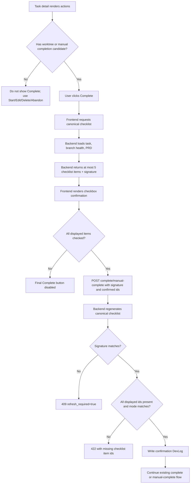

# PRD: Completion Result Checklist Gate

**Original Need:** complete 的时候列出结果 checklist，让用户点击选择；checklist 最多展示 5 条；没有 worktree 的需求不允许 Complete；确认所有展示项都已完成后，才可以 Complete。
**AI-Normalized Name:** Require worktree-backed completion plus a fully checked, at-most-five-item result checklist.
**Date:** 2026-04-27
**Status:** Implemented

## 1. Introduction & Goals

当前任务详情页存在三类完成相关路径。worktree-backed 任务的普通 `Complete` 会调用 `POST /api/tasks/{task_id}/complete`；缺失分支场景已有“查看完成检查单”门槛，但用户只要打开过检查单即可点击“确认 Complete”；没有 `worktree_path` 的任务仍会显示 `Complete`，并通过 `PUT /api/tasks/{task_id}/status` 直接切到 `CLOSED`。第三类路径语义最弱：没有 worktree 就没有可验收的代码结果，也不应被称为 Complete。

本需求要把 Complete 收敛为 worktree-backed 的显式验收动作：只有拥有 `worktree_path` 或曾进入 worktree-backed Git flow 且命中缺失分支人工确认条件的任务，才允许 Complete。点击 Complete 时先展示结果 checklist，用户必须逐项勾选所有展示项，系统才允许调用完成接口。为了避免完成动作变成负担，checklist 必须最多展示 5 条；如果 PRD 验收项更多，系统要按确定性优先级选择或合并摘要，而不是全部摊开。

Goals:

- worktree-backed 普通 `Complete` 和缺失分支 `manual-complete` 都必须经过同一类逐项 checklist 确认。
- 没有 `worktree_path` 且没有进入过 worktree-backed Git flow 的任务不能显示或执行 `Complete`；这类需求只能继续 `Start`、`Edit`、`Delete` 或 `Abandon`。
- checklist 最多展示 5 条，优先覆盖 PRD `Acceptance Checklist` 和必要系统收尾确认。
- 前端在所有展示项勾选前禁用最终 Complete 按钮。
- 后端拒绝没有携带完整确认载荷的 `/complete` 与 `/manual-complete` 请求，并拒绝通过 legacy `PUT /status` 把任务直接切到 `CLOSED`。
- 成功进入完成流程时写入审计 `DevLog`，保留用户确认过 checklist 的事实。

## 2. Requirement Shape

- **Actor:** 任务负责人。
- **Trigger:** 用户在任务详情页点击 worktree-backed 普通 `Complete`，或在缺失分支人工确认路径点击“确认 Complete”。
- **Expected Behavior:** 无 worktree 且未进入过 worktree-backed Git flow 的任务不显示 `Complete`；后端也拒绝这类任务通过 legacy status route 直接进入 `CLOSED`。符合条件的任务展示最多 5 条完成结果 checklist。用户逐项勾选全部展示项后，最终提交按钮才解锁；提交时后端校验同一任务的 checklist signature 和确认项完整，随后才进入现有完成收尾流程。
- **Explicit Scope Boundary:** 本需求只增加完成前的确认门槛并收紧 Complete 资格，不改变 Git complete 的 `git add / commit / rebase / merge / cleanup` 顺序，不新增持久化表，不自动判断实现是否真的通过验收，不新增“无代码完成”动作。

## 3. Repository Context And Architecture Fit

Current relevant modules/files:

- `frontend/src/App.tsx`
  - `handleCompleteRequirement(...)` 直接调用 `taskApi.complete(...)`。
  - `handleCompleteRequirement(...)` 在 `taskItem.worktree_path` 缺失时会改走 `taskApi.updateStatus(..., CLOSED)`，这是本需求要删除的无 worktree Complete 路径。
  - `handleManualCompleteRequirement(...)` 只要求 `viewedManualCompletionChecklistTaskIdSet` 已包含当前任务。
  - 详情页动作区已经根据 `canCompleteSelectedTask` 和 `isSelectedTaskManualCompletionCandidate` 渲染普通 `Complete` 与人工确认按钮。
- `frontend/src/utils/task_completion.ts`
  - 集中维护前端是否展示 Complete 的资格判断。
  - 当前 `canCompleteTask(...)` 对 `!taskItem.worktree_path` 返回 `true`，与“无 worktree 不允许 Complete”的目标语义冲突。
- `frontend/src/api/client.ts`
  - `taskApi.complete(id)` 与 `taskApi.manualComplete(id)` 当前都是无 body `POST`。
  - `taskApi.updateStatus(id, CLOSED)` 当前仍可作为无 worktree 完成入口。
- `frontend/src/hooks/useSelectedTaskPrdFile.ts`
  - 已能为当前选中任务读取 PRD Markdown，可作为前端展示 PRD 验收项的上下文，但后端仍需要自己的校验来源。
- `backend/dsl/api/tasks.py`
  - `complete_task(...)` 和 `manual_complete_task(...)` 是现有完成入口。
  - `update_task_status(...)` 当前允许 `TaskStatusUpdateSchema(lifecycle_status=CLOSED)` 直接把任务推进到 `done / CLOSED` 并写完成归档日志。
  - `get_task_prd_file(...)` 已展示如何通过 `find_task_prd_file_path(...)` / `find_task_readable_prd_file_path(...)` 读取任务 PRD。
- `backend/dsl/services/task_service.py`
  - `update_task_status(...)` 当前只阻止 started task 通过 legacy status route 删除，没有阻止通过 legacy status route 完成。
  - `prepare_task_completion(...)` 仍是普通 complete 阶段转换的服务层入口。
  - `validate_manual_completion_candidate(...)` 与 `close_task_after_manual_completion(...)` 是缺失分支人工确认路径的服务层入口。
- `backend/dsl/services/prd_file_service.py`
  - 已封装 PRD 文件定位逻辑。
- `backend/dsl/schemas/task_schema.py`
  - 适合新增 completion checklist response/request schema。
- Existing docs:
  - `docs/guides/dsl-development.md`
  - `docs/guides/codex-cli-automation.md`
  - `docs/architecture/system-design.md`
  - `docs/index.md`
  - `docs/dev/evaluation.md`

Existing path:

- 沿用当前 `Complete` CTA 判定入口、`/complete` Git 收尾、`/manual-complete` 缺失分支人工收口三条主路径，但收紧可完成规则。
- 删除 `!worktree_path -> updateStatus(CLOSED)` 的 Complete 分支；无 worktree 任务应继续使用 `Start`、`Edit`、`Delete` 或 `Abandon`。
- 在符合条件的完成动作和 API 请求之间插入 checklist confirmation。
- 收紧 legacy `PUT /status`，使它不能作为绕过 checklist 和 worktree 语义的完成入口。

Reuse candidates:

- 继续复用 `taskApi.complete(...)` / `taskApi.manualComplete(...)`，只扩展请求 body。
- 继续复用 `TaskService.prepare_task_completion(...)` 和 `TaskService.close_task_after_manual_completion(...)`，不要新建完成状态机。
- 继续复用 `TaskService.update_task_status(...)` 处理非完成状态变更，但对 `CLOSED` 增加拒绝规则。
- 复用 PRD 文件读取服务，只增加 checklist 提取逻辑。
- 复用现有 `DevLog` 审计机制，不新增数据库表。

Architecture constraints:

- 路由层可以编排请求、背景任务和日志写入，但 checklist 生成与确认校验不能散落在路由 handler 里。
- 前端按钮禁用不是可信边界；后端必须校验确认 payload。
- `Complete` 的业务含义必须是“有可验收的 worktree-backed 结果”，不能再表示“把一个未开始需求移到 completed archive”。
- PRD Markdown 读取必须使用 `encoding="utf-8"`。
- 不应让 schemas、ORM model 或 React render 逻辑承担 Git 或文件系统副作用。

Potential redundancy risks:

- 不要新增第二套 task completion flow；checklist 只是现有 flow 的 precondition。
- 不要新增“no-code Complete”或“无 worktree 完成”并行概念；无 worktree 需求不做时应 `Delete` 或 `Abandon`。
- 不要把 checklist 勾选状态持久化到数据库；这是每次完成请求前的一次性确认。
- 不要同时在前端和后端各自实现不一致的 PRD checklist 解析规则。推荐由后端提供 canonical checklist，前端只渲染并回传 item ids。

## 4. Recommendation

### Recommended Approach

新增一个轻量的 completion checklist 服务，用后端生成最多 5 条的 canonical checklist，并让完成接口要求用户确认该 checklist 的全部展示项。同时收紧 Complete 资格：无 `worktree_path` 且未进入 worktree-backed Git flow 的任务不再允许 Complete；legacy status route 也不能把任务直接切到 `CLOSED`。后端不得返回隐藏必选项；如果候选结果超过 5 条，服务层必须先按确定性规则合并或优先级裁剪，再生成签名与校验集合。

Recommended behavior:

1. 无 `worktree_path` 且不是缺失分支人工确认候选的任务不显示 `Complete`；用户可继续 `Start`、`Edit`、`Delete` 或 `Abandon`。
2. 用户点击符合条件的普通 `Complete` 或缺失分支“确认 Complete”。
3. 前端调用 `GET /api/tasks/{task_id}/completion-checklist?mode=complete|manual_complete`。
4. 后端根据任务状态、branch health、PRD `Acceptance Checklist` 和系统收尾规则生成最多 5 条 checklist。
5. 前端以 modal 或详情页内确认面板展示 checklist，并维护本次勾选状态。
6. 所有展示项勾选后，最终按钮解锁。
7. 前端调用 `POST /api/tasks/{task_id}/complete` 或 `POST /api/tasks/{task_id}/manual-complete`，body 携带 `checklist_signature`、`confirmed_checklist_item_ids` 和 `checklist_mode`。
8. 后端重新生成同一任务的 canonical checklist，确认 signature 精确匹配且所有展示 item id 都已提交，再继续现有完成逻辑。
9. 如果 POST 的 signature 已过期，后端返回 `409 Conflict`，body 包含 `refresh_required=true`，前端刷新 checklist 后让用户重新确认。
10. 后端写入一条 `DevLogStateTag.FIXED` 审计日志，记录本次用户已确认的 checklist item 数量和模式。
11. `PUT /api/tasks/{task_id}/status` 对 `lifecycle_status=CLOSED` 返回 `422`，提示使用 `/complete` 或 `/manual-complete`；它不再作为完成入口。

Why this fits the current architecture:

- Checklist 生成与校验是完成动作的业务规则，放在 backend service 中能同时服务 GET preview 与 POST enforcement。
- 前端只负责交互状态，不承担可信校验。
- 不需要新增数据库字段；确认事实通过现有 DevLog 留痕即可。
- 移除无 worktree Complete 后，`Complete` 的含义回到“有实际 worktree-backed 结果可验收”，不会再把未开始需求误归档为完成。
- 5 条上限让确认动作保持轻量，不会把 PRD 的长验收清单复制成另一个阅读负担。
- 现有 completion service 和 Git finalization runner 保持不变。

Rationale for rejecting redundant abstractions:

- 不新增 checklist table：本需求不需要跨会话保存半勾选状态，持久化会增加迁移、同步和过期语义。
- 不新增独立 workflow stage：用户仍然处于原有可 Complete 阶段，只是在提交动作前多一个确认门槛。
- 不新增第二个完成 endpoint：普通完成和人工完成已有清晰入口，只扩展请求合同。
- 不保留 legacy `PUT /status -> CLOSED` 完成入口：它没有 worktree 语义，也会绕过 checklist gate。

### Alternatives Considered

| Alternative | Why Not Recommended |
| --- | --- |
| 只在前端弹 checkbox modal，API 不变 | 用户或旧客户端仍可直接调用 `/complete`，不满足“全部勾选完成才可以 complete”的真实约束。 |
| 把勾选状态保存到 `Task` 字段 | 半完成确认状态容易在任务内容、PRD 或分支健康变化后过期；当前需求只需要提交前确认。 |
| 让前端直接解析 PRD `Acceptance Checklist` | 前后端解析规则容易分叉；后端无法验证前端是否漏传了某些 PRD 验收项。 |
| 继续允许无 worktree 任务 Complete，只给它也加 checklist | 没有 worktree 就没有代码结果、Git 收尾或缺失分支证据可验收；这会保留一个语义不清的“no-code Complete”。 |

## 5. Implementation Guide

### Core Logic

1. Completion eligibility:
   - Frontend `canCompleteTask(...)` must return `false` for tasks without `worktree_path`, unless `branch_health.manual_completion_candidate=true`.
   - `handleCompleteRequirement(...)` must remove the fallback branch that calls `taskApi.updateStatus(task_id, CLOSED)` for no-worktree tasks.
   - Backend `TaskService.update_task_status(...)` or `update_task_status(...)` route must reject `TaskLifecycleStatus.CLOSED` with `422`, instructing callers to use `/complete` or `/manual-complete`.
   - `TaskLifecycleStatus.ABANDONED` remains available for "will not do" decisions; unstarted drafts can still be deleted.

2. Backend checklist generation:
   - Input: `task_id`, `mode`.
   - Load `Task` via `TaskService.get_task_by_id(...)`.
   - Load branch health via `TaskService.build_task_branch_health(...)`.
   - If task has a readable PRD file, read Markdown with `encoding="utf-8"`.
   - Extract candidate checklist items from the `Acceptance Checklist` section.
   - Build a capped canonical checklist with at most 5 user-facing items:
     - Sort PRD candidates by heading priority: `Behavior Acceptance`, `API Acceptance`, `Validation Acceptance`, `Architecture Acceptance`, `Documentation Acceptance`, `Dependency Acceptance`, then remaining headings in document order.
     - Deduplicate PRD candidates by normalized heading + normalized label.
     - If there are 1-3 PRD candidates, include them directly.
     - If there are more than 3 PRD candidates, include the first two direct PRD checks, then add one summary PRD check such as `Review remaining PRD acceptance coverage (N items across X headings)`.
     - Fill the remaining slots with system safety checks in mode-specific order until the list reaches at most 5 items.
   - Add mode-specific system items within the same 5-item cap:
     - normal complete: timeline/result reviewed, worktree/code state ready, Git finalization understood.
     - manual complete: timeline/result reviewed, missing branch is intentional/manual, archive closure understood.
   - Return stable `item_id`, `label`, `group`, `required`, `source`, and optional summary metadata such as `covered_source_item_count`.
   - Compute `checklist_signature` from `task_id`, `mode`, and the ordered canonical item ids/labels/sources.
   - Guarantee `items.length <= 5`; there must be no hidden required item outside the returned list.

3. Frontend confirmation:
   - Replace direct click execution with `openCompletionChecklist(task, mode)`.
   - Render a modal/inline confirmation panel using checkboxes.
   - Track checked item ids in component state scoped by `task_id + mode + checklist_signature`.
   - Disable final submit until every displayed item id is checked.
   - Keep existing busy/error/success handling when the final POST starts.

4. Backend enforcement:
   - Extend `/complete` and `/manual-complete` request bodies with `TaskCompletionConfirmationSchema`.
   - Before mutating workflow state, regenerate canonical checklist for the requested mode.
   - Reject with `409 Conflict` and body field `refresh_required=true` when the submitted `checklist_signature` does not match the regenerated signature.
   - Reject with `422` if the regenerated checklist has more than 5 items; this is a server bug and should not be bypassed.
   - Reject with `422` if any displayed canonical item id is missing from `confirmed_checklist_item_ids`.
   - Reject if `checklist_mode` does not match the endpoint.
   - On success, write an audit DevLog, then continue existing flow.

### Affected Files

| Area | Change | Files |
| --- | --- | --- |
| Backend schemas | Add checklist item/response/confirmation DTOs | `backend/dsl/schemas/task_schema.py` |
| Backend service | Generate canonical checklist and validate confirmations | `backend/dsl/services/task_completion_checklist_service.py` |
| Backend status route | Reject legacy `CLOSED` lifecycle updates so `/status` cannot bypass worktree/checklist completion semantics | `backend/dsl/api/tasks.py`, `backend/dsl/services/task_service.py` |
| Backend API | Add checklist preview endpoint and enforce confirmation body in completion endpoints | `backend/dsl/api/tasks.py` |
| Frontend API client | Add `getCompletionChecklist(...)`; extend `complete(...)` and `manualComplete(...)` body | `frontend/src/api/client.ts` |
| Frontend types | Add checklist response/request types | `frontend/src/types/index.ts` |
| Frontend UI | Add checklist modal/panel state, route qualifying Complete buttons through it, and remove no-worktree `updateStatus(CLOSED)` completion fallback | `frontend/src/App.tsx` |
| Frontend utility | Keep CTA eligibility separate from confirmation readiness and stop exposing Complete for no-worktree tasks | `frontend/src/utils/task_completion.ts`, optional `frontend/src/utils/task_completion_checklist.ts` |
| Frontend tests | Cover checkbox gating and API payload | `frontend/tests/task_completion.test.ts`, `frontend/tests/app_task_mutation_refresh.test.ts`, new focused test if needed |
| Backend tests | Cover checklist generation and POST rejection/acceptance | `tests/test_tasks_api.py`, `tests/test_task_service.py` or new service test |
| Docs | Document completion confirmation flow and manual QA steps | `docs/guides/dsl-development.md`, `docs/guides/codex-cli-automation.md`, `docs/architecture/system-design.md`, `docs/index.md`, `docs/dev/evaluation.md` |

### Change Matrix

| Current Behavior | Target Behavior | Implementation Notes | Validation |
| --- | --- | --- | --- |
| No-worktree tasks can show `Complete` and close through `updateStatus(CLOSED)` | No-worktree tasks do not show `Complete`; they can be started, edited, deleted, or abandoned | Remove `!worktree_path` Complete eligibility and delete the frontend fallback to `updateStatus(CLOSED)` | Frontend test verifies no-worktree task has no Complete CTA |
| `PUT /tasks/{id}/status` can close tasks as `CLOSED` | Legacy status route rejects `CLOSED` so callers cannot bypass checklist/worktree completion semantics | Add `422` guard in service or route; keep `ABANDONED`/`DELETED` behavior as currently valid | Backend API test verifies `CLOSED` via status route fails |
| Clicking qualifying normal `Complete` immediately calls `/complete` | Clicking qualifying normal `Complete` opens an at-most-5-item checklist; final POST only happens after all displayed items are checked | Add modal/panel state and `GET /completion-checklist?mode=complete` | Frontend test verifies POST is not called until all displayed items are checked |
| `/complete` accepts empty body | `/complete` requires complete checklist confirmation body | Add `TaskCompletionConfirmationSchema`; validate mode and required ids | Backend API test expects 422 without payload and 200/202 path with full payload |
| Missing-branch manual completion only requires viewing checklist | Missing-branch manual completion requires checking every displayed item | Replace viewed-only gate with checkbox gate | Frontend test verifies button disabled until all displayed items are checked |
| `/manual-complete` accepts empty body | `/manual-complete` requires `mode=manual_complete` confirmation body | Same canonical checklist service, different mode | Backend API test covers missing item rejection |
| PRD Acceptance Checklist is visible only inside PRD document | Completion checklist surfaces a deterministic capped/summarized view of PRD acceptance items at the moment of completion | Backend parses PRD section, sorts by fixed heading priority, deduplicates, summarizes overflow, and enforces `items.length <= 5` | Service test with sample PRD Markdown containing more than 5 source checklist items |
| Stale checklist signatures are not defined | Stale signatures are rejected with refresh-specific error | POST compares submitted signature to regenerated signature and returns `409` with `refresh_required=true` | API test mutates PRD/checklist source between GET and POST |
| Completion audit logs do not record checklist confirmation | Timeline records that user confirmed all completion checklist items | Add `DevLog` before mutation/closure | API test asserts DevLog text includes mode and count |

### Flow Diagram



### Low-Fidelity Prototype

```text
+-----------------------------------------------------------+
| 完成确认                                                   |
| Task: Add dashboard auto refresh                           |
|                                                           |
| PRD Acceptance Checklist                                   |
| [ ] Architecture Acceptance: no new duplicated poller      |
| [ ] Behavior Acceptance: task list refreshes after mutate  |
| [ ] Validation Acceptance: required checks passed          |
|                                                           |
| Completion Safety                                          |
| [ ] 我已核对最新 Timeline 与实现结果                        |
| [ ] 我已确认代码状态可进入 Git 收尾并理解收尾动作              |
|                                                           |
|                       [Cancel] [Complete disabled]         |
+-----------------------------------------------------------+

After all 5 displayed items are checked:

+-----------------------------------------------------------+
|                       [Cancel] [Complete]                  |
+-----------------------------------------------------------+
```

### API Contract Sketch

```json
{
  "mode": "complete",
  "checklist_signature": "sha256:...",
  "confirmed_checklist_item_ids": [
    "prd:behavior-acceptance:7f2a9b3c",
    "prd:validation-acceptance:4ab8d211",
    "system:timeline-reviewed",
    "system:code-state-and-git-finalization-understood"
  ]
}
```

Response from `GET /api/tasks/{task_id}/completion-checklist?mode=complete`:

```json
{
  "task_id": "task-id",
  "mode": "complete",
  "checklist_signature": "sha256:...",
  "max_item_count": 5,
  "items": [
    {
      "id": "prd:behavior-acceptance:7f2a9b3c",
      "label": "Behavior Acceptance: task list refreshes after mutate",
      "group": "PRD Acceptance Checklist",
      "required": true,
      "source": "prd_acceptance_checklist",
      "covered_source_item_count": 1
    }
  ]
}
```

Stale signature response from completion POST:

```json
{
  "detail": "Completion checklist is stale. Refresh the checklist and confirm again.",
  "refresh_required": true
}
```

### External Validation

Not used. This is repository-local workflow behavior.

## 6. Definition Of Done

- No-worktree tasks no longer expose `Complete` in the UI.
- `PUT /api/tasks/{task_id}/status` can no longer move a task to `CLOSED`; completion must use `/complete` or `/manual-complete`.
- Normal Complete cannot be submitted from the UI until all displayed checklist items are checked.
- Missing-branch manual Complete cannot be submitted from the UI until all displayed checklist items are checked.
- Backend completion endpoints reject missing, stale, wrong-mode, or incomplete checklist confirmation payloads; stale signatures return `409` with `refresh_required=true`.
- Completion checklist responses never contain more than 5 items.
- PRD Acceptance Checklist items are included or summarized by deterministic priority when a readable PRD exists; fallback system items are still shown when PRD is absent or has no checklist.
- Completion confirmation writes an auditable timeline log.
- Existing Git finalization, branch-missing detection, and task lifecycle transitions remain unchanged after the gate passes.
- Documentation and manual evaluation steps are synchronized.

## 7. Acceptance Checklist

### Architecture Acceptance

- [x] `TaskService.prepare_task_completion(...)` remains responsible for normal completion stage transition.
- [x] `TaskService.close_task_after_manual_completion(...)` remains responsible for missing-branch manual closure.
- [x] `TaskService.update_task_status(...)` or its route wrapper rejects `TaskLifecycleStatus.CLOSED` so legacy status updates cannot bypass completion semantics.
- [x] Checklist generation and validation live in a service-layer module, not directly inside React render code or route handler branches.
- [x] No new database table, migration, or persisted task field is introduced for transient checkbox state.
- [x] PRD Markdown reads use `encoding="utf-8"`.

### Dependency Acceptance

- [x] No new frontend or backend third-party dependency is added for Markdown parsing unless existing repository tooling cannot handle checklist extraction.
- [x] The implementation reuses `find_task_prd_file_path(...)` / `find_task_readable_prd_file_path(...)` instead of adding another PRD file locator.

### Behavior Acceptance

- [x] No-worktree tasks do not show `Complete` in the task detail action area.
- [x] No-worktree tasks still support the existing `Start`, `Edit`, `Delete`, and `Abandon` paths where those actions are otherwise allowed.
- [x] Clicking ordinary `Complete` opens the completion checklist instead of immediately calling `POST /api/tasks/{task_id}/complete`.
- [x] The final ordinary Complete submit button is disabled until every displayed checklist item is checked.
- [x] Clicking missing-branch `确认 Complete` opens or focuses the same checklist flow for `mode=manual_complete`.
- [x] The final manual Complete submit button is disabled until every displayed checklist item is checked.
- [x] The checklist displays no more than 5 items for every task and mode.
- [x] The checklist includes or summarizes PRD `Acceptance Checklist` items using the fixed heading priority when a readable PRD contains that section.
- [x] The checklist includes system safety items even when the PRD is missing.
- [x] Changing selected task clears or re-scopes checkbox state so one task's confirmation cannot unlock another task.
- [x] A stale checklist signature triggers a refresh-specific error before POST retry.

### API Acceptance

- [x] `PUT /api/tasks/{task_id}/status` returns `422` when called with `{"lifecycle_status":"CLOSED"}`.
- [x] `PUT /api/tasks/{task_id}/status` still supports existing non-completion lifecycle transitions that remain valid, such as `ABANDONED`.
- [x] `GET /api/tasks/{task_id}/completion-checklist?mode=complete` returns canonical checklist items for a normal completion candidate.
- [x] `GET /api/tasks/{task_id}/completion-checklist?mode=manual_complete` returns canonical checklist items for a missing-branch manual completion candidate.
- [x] Both checklist preview endpoints return `items.length <= 5`.
- [x] `POST /api/tasks/{task_id}/complete` returns `422` when confirmation payload is absent.
- [x] `POST /api/tasks/{task_id}/complete` returns `422` when any displayed checklist item id is missing.
- [x] `POST /api/tasks/{task_id}/complete` returns `409` with `refresh_required=true` when `checklist_signature` is stale.
- [x] `POST /api/tasks/{task_id}/manual-complete` returns `422` when confirmation payload is absent.
- [x] `POST /api/tasks/{task_id}/manual-complete` returns `422` when `mode` is not `manual_complete`.
- [x] `POST /api/tasks/{task_id}/manual-complete` returns `409` with `refresh_required=true` when `checklist_signature` is stale.
- [x] Successful completion writes a `DevLog` mentioning checklist confirmation mode and confirmed item count.

### Documentation Acceptance

- [x] `docs/guides/dsl-development.md` describes that Complete is worktree-backed and requires all displayed checklist items, capped at 5, to be confirmed.
- [x] `docs/guides/codex-cli-automation.md` describes the confirmation gate before Git finalization.
- [x] `docs/architecture/system-design.md` reflects backend enforcement, not just frontend button gating.
- [x] `docs/index.md` updates the high-level task workflow summary.
- [x] `docs/dev/evaluation.md` includes manual QA steps for no-worktree tasks, normal Complete, stale checklist refresh, and missing-branch manual Complete.

### Validation Acceptance

- [x] `uv run pytest tests/test_tasks_api.py -q`
- [x] `uv run pytest tests/test_task_service.py -q` or equivalent new checklist service tests.
- [x] `cd frontend && npm test`
- [x] `cd frontend && npm run build`
- [x] `just docs-build`
- [x] `git diff --check`

## 8. User Stories

### US-001: Confirm Results Before Normal Complete

As a task owner, I want to review and check every completion result item before starting Git finalization so that I do not accidentally close a task whose acceptance criteria have not been verified.

### US-002: Confirm Missing-Branch Manual Completion

As a task owner, I want missing-branch manual completion to require explicit item-by-item confirmation so that a deleted branch is not mistaken for a completed task without review.

### US-003: Avoid No-Worktree Completion

As a task owner, I do not want an unstarted or no-worktree requirement to be marked Complete because it has no code result to verify; I should start it, edit it, delete it, or abandon it instead.

### US-004: Preserve Auditability

As a maintainer, I want the timeline to show that the completion checklist was confirmed so that later debugging can distinguish intentional completion from an accidental click.

## 9. Functional Requirements

1. **FR-1:** The frontend must open a completion checklist confirmation UI before calling ordinary `Complete`.
2. **FR-2:** The frontend must open a completion checklist confirmation UI before calling missing-branch `manual-complete`.
3. **FR-3:** The frontend must not expose `Complete` for tasks without `worktree_path`, unless `branch_health.manual_completion_candidate=true`.
4. **FR-4:** The frontend must remove the no-worktree `Complete -> updateStatus(CLOSED)` fallback.
5. **FR-5:** The backend must reject legacy `PUT /tasks/{task_id}/status` requests that attempt `lifecycle_status=CLOSED`.
6. **FR-6:** The checklist UI must render every displayed item as a clickable checkbox.
7. **FR-7:** The final submit button must remain disabled until every displayed checklist item is checked.
8. **FR-8:** The backend must expose a canonical checklist preview endpoint scoped by task id and completion mode.
9. **FR-9:** The canonical checklist must never return more than 5 items.
10. **FR-10:** The canonical checklist must sort PRD candidates by the fixed heading priority and summarize overflow deterministically.
11. **FR-11:** The canonical checklist must include or summarize PRD `Acceptance Checklist` items when available.
12. **FR-12:** The canonical checklist must include fallback/system safety items when PRD checklist items are unavailable.
13. **FR-13:** `/complete` must require a `complete` mode confirmation payload and reject incomplete confirmations with `422`.
14. **FR-14:** `/manual-complete` must require a `manual_complete` mode confirmation payload and reject incomplete confirmations with `422`.
15. **FR-15:** Backend validation must regenerate the canonical checklist at POST time instead of trusting the frontend item list.
16. **FR-16:** Backend validation must reject stale `checklist_signature` values with `409` and `refresh_required=true`.
17. **FR-17:** Completion confirmation success must write an auditable `DevLog`.
18. **FR-18:** Existing Git finalization behavior and missing-branch manual closure behavior must remain unchanged after confirmation succeeds.

## 10. Non-Goals

- Automatically proving that code satisfies each checklist item.
- Persisting partially checked checklist state across browser sessions.
- Adding a new workflow stage for "completion confirmation".
- Adding a separate no-code or no-worktree completion action.
- Changing runner prompts, Git finalization order, merge strategy, or cleanup behavior.
- Changing PRD generation requirements beyond reading existing `Acceptance Checklist` entries.

## 11. Risks And Follow-Ups

- Risk: PRD checklist parsing may miss unconventional Markdown formatting. Mitigation: keep a fallback system checklist, document the supported `Acceptance Checklist` Markdown shape, and cap the final displayed list at 5 items.
- Risk: Existing tests or scripts that call `/complete` without body or use `PUT /status` to close tasks will fail after enforcement. Mitigation: update internal callers and tests in the same change; the breaking contract is intentional because `Complete` now means worktree-backed completion only.
- Follow-up: If users later need team-level approvals, add a persisted approval model. That is outside this request because the current need is a single-user pre-completion gate.

## 12. Decision Log

| Decision | Rationale |
| --- | --- |
| Backend provides canonical checklist | Prevents frontend/backend parser drift and enables true API enforcement. |
| POST endpoints require confirmation payload | Button disabling alone does not satisfy "才可以 complete". |
| Remove no-worktree Complete | A task without `worktree_path` has no code result, Git branch, or completion artifact to verify; it should be started, deleted, or abandoned instead. |
| Reject `PUT /status -> CLOSED` | Keeping this legacy route as a completion path would bypass both the worktree-backed meaning and the checklist gate. |
| Do not persist checkbox state | The confirmation is only meaningful at the moment of completion and can become stale when PRD/task state changes. |
| Cap the checklist at 5 displayed items | Longer checklists add completion friction; the gate should focus attention instead of becoming a second PRD review. |
| Use a fixed PRD checklist priority | Deterministic sorting prevents two implementations from producing different signatures for the same PRD. |
| Include or summarize PRD Acceptance Checklist first | The user asked for result checklist; PRD acceptance items are the repository's existing structured definition of expected results, but long PRDs must be grouped. |
| Keep system safety items inside the same cap | Some tasks have missing or non-standard PRDs; Complete still needs a minimum explicit confirmation gate without exceeding 5 items. |
| Reject stale signatures with `409 refresh_required=true` | Signature mismatch is not just a missing checkbox; the frontend must refresh the canonical checklist before allowing another submit. |
| Use existing DevLog audit trail | Completion confirmation is timeline evidence, not a new domain entity. |

## 13. Implementation Sync

**Status:** Implemented on 2026-04-28.

### Delivered Files

- Backend schema/API/service changes:
  - `backend/dsl/schemas/task_schema.py`
  - `backend/dsl/services/task_completion_checklist_service.py`
  - `backend/dsl/services/task_service.py`
  - `backend/dsl/api/tasks.py`
- Frontend API/types/UI changes:
  - `frontend/src/types/index.ts`
  - `frontend/src/api/client.ts`
  - `frontend/src/utils/task_completion.ts`
  - `frontend/src/App.tsx`
  - `frontend/src/index.css`
- Regression tests:
  - `tests/test_task_completion_checklist_service.py`
  - `tests/test_tasks_api.py`
  - `frontend/tests/api_client.test.ts`
  - `frontend/tests/task_completion.test.ts`
  - `frontend/tests/app_task_mutation_refresh.test.ts`
- Documentation:
  - `docs/guides/dsl-development.md`
  - `docs/guides/codex-cli-automation.md`
  - `docs/architecture/system-design.md`
  - `docs/index.md`
  - `docs/dev/evaluation.md`
  - `docs/api/references.md`

### Delivered Behavior

- Added `GET /api/tasks/{task_id}/completion-checklist?mode=complete|manual_complete`.
- Added backend canonical checklist generation from readable PRD `Acceptance Checklist` plus mode-specific system safety items.
- Enforced a hard maximum of 5 displayed checklist items and deterministic PRD overflow summarization.
- Required `/complete` and `/manual-complete` to submit `checklist_mode`, `checklist_signature`, and all displayed `confirmed_checklist_item_ids`.
- Rejected missing payloads and incomplete confirmations with `422`.
- Rejected stale checklist signatures with `409` and `refresh_required=true` in the response detail.
- Refreshed the frontend checklist modal automatically after a stale-signature response and required the user to re-check all displayed items.
- Wrote checklist confirmation audit `DevLog` entries before normal and manual completion flow continuation.
- Removed frontend no-worktree Complete eligibility and removed the `updateStatus(CLOSED)` fallback.
- Rejected legacy `PUT /api/tasks/{task_id}/status` requests that try to set `lifecycle_status=CLOSED`.
- Rejected legacy `PUT /api/tasks/{task_id}/stage` requests that try to set `workflow_stage=done`.
- Routed the acceptance-stage "验收通过" button through the same checklist modal and `/complete` payload flow instead of `updateStage(done)`.
- Replaced the manual-complete viewed-only gate with the same checkbox-confirmation modal used by ordinary Complete.
- Kept abandoned-history tasks out of the missing-branch manual completion candidate path so archived "will not do" decisions cannot be reopened through `/manual-complete`.

### Verification Evidence

- `uv run python -m py_compile backend/dsl/schemas/task_schema.py backend/dsl/services/task_completion_checklist_service.py backend/dsl/services/task_service.py backend/dsl/api/tasks.py tests/test_task_completion_checklist_service.py tests/test_tasks_api.py` passed.
- `uv run pytest tests/test_task_service.py tests/test_task_completion_checklist_service.py tests/test_tasks_api.py -q` passed (`94 passed` after the abandoned manual-complete guard was added).
- Auto-review fix round 1: `uv run pytest tests/test_task_service.py::test_update_workflow_stage_rejects_done_archive_bypass tests/test_tasks_api.py::test_update_task_stage_rejects_done_archive_bypass tests/test_tasks_api.py::test_update_task_status_rejects_closed_archive_bypass -q` passed (`3 passed`).
- Auto-review fix round 1: `uv run pytest tests/test_task_service.py tests/test_task_completion_checklist_service.py tests/test_tasks_api.py -q` passed (`95 passed`).
- `uv run ruff check backend/dsl/services/task_service.py tests/test_task_service.py` passed.
- Auto-review fix round 1: `uv run ruff check backend/dsl/services/task_service.py backend/dsl/api/tasks.py tests/test_task_service.py tests/test_tasks_api.py` passed.
- Auto-review fix round 1: `cd frontend && node --experimental-strip-types --experimental-specifier-resolution=node tests/app_task_mutation_refresh.test.ts` passed.
- Auto-review fix round 1: `just lint` passed.
- `just lint` passed after the first run applied `ruff-format` changes and the command was rerun.
- `cd frontend && node --experimental-strip-types --experimental-specifier-resolution=node tests/task_completion.test.ts` passed.
- `cd frontend && node --experimental-strip-types --experimental-specifier-resolution=node tests/app_task_mutation_refresh.test.ts` passed.
- `cd frontend && npm test` passed.
- `cd frontend && npm run build` passed.
- `just docs-build` passed.
- `git diff --check` passed.

### Checklist Reconciliation

**Rechecked on 2026-04-28:** All 42 Acceptance Checklist items were verified against the current code, tests, and documentation, then marked complete.

- `uv run pytest tests/test_tasks_api.py -q` passed (`65 passed`).
- `uv run pytest tests/test_task_service.py tests/test_task_completion_checklist_service.py -q` passed (`30 passed`).
- `cd frontend && npm test` passed.
- `cd frontend && npm run build` passed.
- `just docs-build` passed.
- `git diff --check` passed.

### Deviations And Follow-Ups

- The stale-signature response is exposed in FastAPI's standard `detail` object as `{"message": "...", "refresh_required": true}` rather than a custom top-level response envelope.
- The Markdown parser intentionally supports the repository's conventional `## Acceptance Checklist`, `### <Heading> Acceptance`, `Heading Acceptance:`, and checkbox-list shapes without adding a Markdown parsing dependency.
