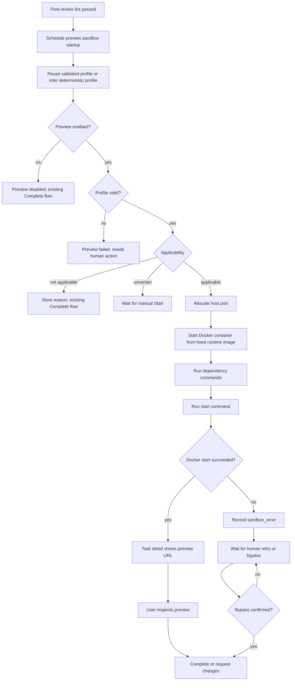
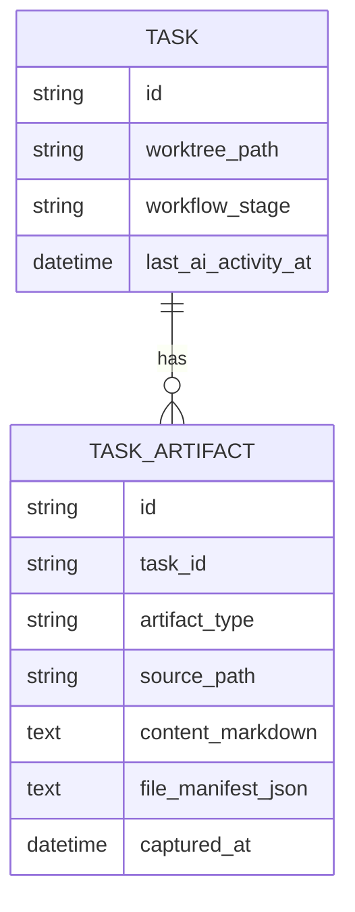

# PRD: Managed Docker Preview Sandbox

**Original Need:** 自动化验证通过后，不再要求人手动打开终端运行项目；Koda 应自动在任务 worktree 的沙盒中运行应用，提供可点击预览。预览命令由 AI 生成；沙盒内部可使用项目熟悉的端口，并自动映射到宿主机端口；启动失败时，代码错误应自动修复，非代码错误等待人工确认；目标态可以直接使用 Docker 隔离。
**AI-Normalized Name:** Generate an AI preview profile and run each task worktree in a managed Docker preview sandbox before human completion.
**Date:** 2026-04-28
**Status:** Partially Implemented

> Current shipped scope: deterministic preview profile inference, AI read-only fallback for deterministic `uncertain` cases, Docker runtime start/stop/restart, preview status APIs/UI, preview-related `Complete` gating, and docs/tests updates are implemented. Richer failure classification, dependency mutation detection, env allowlist injection, readiness polling, and preview code-fix loops remain follow-up work.

## 1. Introduction & Goals

当前 Koda 在 AI 实现、自检和 post-review lint 通过后，会停在“等待用户”状态，用户需要自己进入 worktree、理解项目启动方式、运行 dev server，然后再点击 `Complete`。这个环节仍然依赖人工终端操作，尤其对前端、全栈或多项目任务不够顺滑。

本需求要把“人工验收前的应用启动”变成 Koda 托管能力：当自动化验证通过并等待用户点击 `Complete` 时，Koda 先用 deterministic 规则推断 task worktree 的 preview profile；若结果仍为 `uncertain`，再通过 AI read-only 分析补充一个严格 JSON profile，并在 Docker sandbox 中启动应用，把容器内部端口映射到宿主机空闲端口。

Goals:

- 自动化验证通过后，Koda 自动尝试生成 preview profile 并启动 Docker preview sandbox。
- 当前首版 preview profile 由 deterministic inference 生成；后续如升级到 AI 生成，也必须保持结构化、可校验、可展示、可重试的执行合同，而不是直接盲跑一段自由文本命令。
- 容器内部端口允许沿用项目默认端口，例如 Vite 的 `3000` / `5173` 或 FastAPI 的 `8000`；Koda 自动映射到宿主机空闲端口。
- 任务详情页展示预览状态、preview URL 或失败摘要，以及启动/重启/停止/诊断等入口；专门的 `Open Preview` / `View Logs` 控件保留为后续增强。
- Preview profile 必须明确声明任务是否适合预览：`applicable`、`not_applicable` 或 `uncertain`。不适合预览的任务展示原因并允许继续 `Complete`，不进入 Docker 启动。
- 预览启动失败后，Koda 区分代码错误、依赖错误、环境错误、沙箱错误和不确定错误。
- 被判定为高置信代码错误时，Koda 默认进入最多 2 轮 AI 自动修复闭环，修复后重新执行验证并再次启动预览。
- 被判定为依赖、环境、沙箱或不确定错误时，任务等待人工确认；用户可以修复环境、重试预览，或显式确认跳过预览后再 Complete。
- `Complete` 只在“已经尝试预览且失败为非代码或不确定错误，并且用户尚未确认 bypass”时被拦截；preview disabled、not applicable、尚未尝试预览或预览健康时沿用当前 Complete 语义。
- Docker 隔离作为目标实现，不先落地本机裸进程预览版。

## 2. Change Inventory

This PRD does not delete existing task APIs, database tables, or database fields. The only deletion-style product change is removing the requirement that users must manually open a terminal and start the app before `Complete`; existing worktree/terminal actions remain available as fallback tools.

### 2.1 Feature And Module Changes

| 变更类型 | 对象 | 现状描述 | 目标状态 | 涉及文件 | 影响范围 |
| --- | --- | --- | --- | --- | --- |
| 删除/替代 | Manual-only preview startup step | 当前用户在自动化验证通过后仍必须自己进入 worktree、理解启动方式并运行 dev server。 | 由 Koda 自动生成 profile 并托管 Docker preview；用户仍可打开 worktree/terminal 排查，但不再作为默认验收前置步骤。 | `backend/dsl/services/codex_runner.py`、`frontend/src/App.tsx`、`frontend/src/api/client.ts` | 人工验收流程、任务详情页、Complete 前操作负担。 |
| 新增 | Preview sandbox domain slice | 当前没有独立的 preview sandbox 领域模块；任务完成前的应用启动依赖用户手动进入 worktree 并运行命令。 | 新增 `backend/dsl/preview_sandboxes/`，集中承载 preview profile、runtime status、failure classification 和 task-scoped preview APIs。 | `backend/dsl/preview_sandboxes/domain/models.py`、`backend/dsl/preview_sandboxes/domain/errors.py`、`backend/dsl/preview_sandboxes/application/use_cases.py`、`backend/dsl/preview_sandboxes/api.py` | 任务自动化验收链路、任务详情页、Complete 前人工验收体验。 |
| 修改 | Preview profile generation strategy | 当前没有结构化启动合同；启动方式需要用户理解项目后手动决定。 | 当前实现采用 “deterministic first, AI read-only fallback second” 的 profile inference：`frontend/package.json` 直接推断为前端 HTTP preview，`pyproject.toml` 先落为 deterministic `uncertain`，再尝试通过只读 AI 生成严格 JSON profile；其他情况推断为 `not_applicable`。 | `backend/dsl/preview_sandboxes/application/use_cases.py`、`backend/dsl/preview_sandboxes/infrastructure/ai_preview_profile_generator.py`、`backend/dsl/prompts/templates/preview_profile_prompt.txt`、`backend/dsl/services/codex_runner.py` | profile 校验、TaskArtifact 持久化、preview 自动启动。 |
| 新增 | Preview applicability decision | 当前没有区分“适合预览 / 不适合预览 / 不确定”的产品语义；backend-only、CLI-only 或环境依赖任务容易被统一套进 web preview。 | Profile 必须声明 `applicable`、`not_applicable` 或 `uncertain`。`not_applicable` 存储原因并允许 Complete；`uncertain` 不自动启动 Docker，但会在手动或自动 Start 时优先尝试 AI read-only fallback，只有仍无法确认时才保留 uncertain。 | `backend/dsl/preview_sandboxes/domain/models.py`、`backend/dsl/preview_sandboxes/application/use_cases.py`、`backend/dsl/preview_sandboxes/infrastructure/ai_preview_profile_generator.py`、`frontend/src/App.tsx`、`frontend/src/types/index.ts` | 任务自动触发条件、Complete gating、前端状态展示、用户验收路径。 |
| 新增 | Docker preview runtime adapter | 当前没有 Koda 托管的容器预览；如果用户运行多个 worktree，默认端口容易冲突。 | 新增 Docker runtime adapter，使用配置镜像、挂载 task worktree、映射 `127.0.0.1:<host_port>:<internal_port>`、采集 bounded sanitized logs、支持 start/restart/stop。 | `backend/dsl/preview_sandboxes/infrastructure/docker_preview_runtime.py` | 本机 Docker、端口分配、容器生命周期、preview URL、日志采集。 |
| 新增 | Runtime image strategy | 当前没有 preview 镜像策略；若放任 AI 生成 Dockerfile，会扩大执行边界。 | 当前实现使用固定基础镜像（`node:20-alpine` / `python:3.12-slim`），不允许 AI 生成任意 Dockerfile；版本感知或可配置镜像选择保留为 follow-up。 | `backend/dsl/preview_sandboxes/infrastructure/docker_preview_runtime.py` | Docker 执行安全边界、依赖安装兼容性、失败分类。 |
| 待补齐 | Dependency preparation commands | 当前没有自动依赖准备步骤；用户手动运行时可能执行 `npm install`、`uv sync` 等。 | 当前实现允许 profile 中声明受限 dependency commands，但尚未做 dependency manifest / lockfile mutation guard；后续需要补上 mutation 检查与 `dependency_error` 分类。 | `backend/dsl/preview_sandboxes/domain/models.py`、`backend/dsl/preview_sandboxes/infrastructure/docker_preview_runtime.py` | 依赖安装、worktree 文件变更、lint 有效性、人工介入路径。 |
| 待补齐 | Environment and secret handling | 当前没有 preview 容器 env 策略；如果自动挂载 `.env` 或继承环境，可能泄露 secrets。 | 当前实现没有自动挂载 host `.env`，也没有显式 env allowlist 注入；后续需要补 `KODA_PREVIEW_ALLOWED_ENV_KEYS` 这类配置与更严格的 secret 传递策略。 | `backend/dsl/preview_sandboxes/infrastructure/docker_preview_runtime.py`、`backend/dsl/preview_sandboxes/schemas.py` | 本机 secrets、安全边界、日志展示、Docker 运行环境。 |
| 修改 | Automatic trigger after post-review lint | 当前 `run_post_review_lint(...)` 通过后写入 DevLog，并保持 `test_in_progress` 等用户点击 Complete。 | lint pass 后后台调度 preview startup；preview 失败不能清除 lint pass marker；preview disabled 或 not applicable 不阻断现有流程。 | `backend/dsl/services/codex_runner.py`、`backend/dsl/services/automation_runner.py` | 自动化 runner、waiting_user 展示、DevLog 审计、Complete 前状态。 |
| 修改 | Preview failure classification | 当前应用启动失败由用户自己看终端判断；系统没有 code/dependency/environment/sandbox/unknown 分类。 | 当前实现先落地 `sandbox_error` / `unknown` 为主的保守分类与 bypass gate：Docker runtime 启动失败直接记为 `sandbox_error`，`diagnose` 在没有更多证据时记为 `unknown`；后续再补 deterministic classifier 与 AI classifier。 | `backend/dsl/preview_sandboxes/application/use_cases.py`、`backend/dsl/preview_sandboxes/domain/models.py`、`backend/dsl/preview_sandboxes/api.py` | human action、Complete gating、DevLog 审计。 |
| 待补齐 | Preview code-error auto-fix loop | 当前 post-review lint 有 bounded fix loop，但 preview 启动失败没有自动修复闭环。 | 当前实现尚未自动识别 `code_error`，也没有 preview-fix loop；后续如要落地，需要在 failure classification 稳定后再接入。 | `backend/dsl/services/codex_runner.py`、`backend/dsl/preview_sandboxes/application/use_cases.py` | AI 自动改代码、lint 重跑、任务阶段回退、用户介入。 |
| 修改 | Complete gating | 当前前端 `canCompleteTask(...)` 和后端 `complete_task(...)` 对 `test_in_progress`、`self_review_in_progress`、`changes_requested` 等较宽松。 | 当前实现仅在 latest preview state 为 `needs_human_action`、failure kind 属于 `dependency/environment/sandbox/unknown` 且未 bypass 时阻止 Complete；disabled、not applicable、not attempted、healthy、runtime_state_lost without unresolved failure、bypass confirmed 都沿用现有 Complete 语义。 | `backend/dsl/api/tasks.py`、`frontend/src/utils/task_completion.ts`、`frontend/src/App.tsx`、`backend/dsl/preview_sandboxes/application/use_cases.py` | Git finalization、PR completion、人工验收、UI 按钮可用性。 |
| 新增 | Preview UI panel | 当前任务详情页有 Complete、打开 worktree、打开项目目录、打开终端等入口，没有 preview 状态面板。 | 在任务详情动作区附近新增 Preview Sandbox panel，展示 disabled、not started、not applicable、uncertain、running、needs human action、stopped、runtime state lost 等状态，并提供 `Start Preview`、`Restart`、`Stop`、`Diagnose` 与按需显示的 `Confirm Bypass`。 | `frontend/src/App.tsx`、`frontend/src/index.css`、`frontend/src/types/index.ts`、`frontend/src/api/client.ts` | 前端任务详情页、用户验收操作、API polling、错误提示。 |
| 新增 | Preview runtime state recovery | 当前没有 preview runtime；PRD 不希望把 container id/host port 变成 WebDAV/Git 同步业务状态。 | runtime handle 保持 machine-local/in-memory；backend 重启后如果状态丢失，API 返回 stale/lost，UI 提供 Restart；不做完整 Docker reconciliation。 | `backend/dsl/preview_sandboxes/application/use_cases.py`、`backend/dsl/preview_sandboxes/infrastructure/docker_preview_runtime.py`、`frontend/src/App.tsx` | 后端重启、UI 状态一致性、容器清理、运维预期。 |
| 修改 | Preview lifecycle audit logs | 当前 DevLog 记录 self-review、lint、Complete 等事件，没有 preview lifecycle 事件。 | 当前实现通过 DevLog 记录 profile generated、preview start attempted、preview started/stopped、failure recorded、bypass confirmed，以及 lint-pass 后的 disabled / not applicable / uncertain 提示。 | `backend/dsl/preview_sandboxes/application/use_cases.py`、`backend/dsl/services/codex_runner.py` | 任务时间线、问题诊断、WebDAV/Chronicle 展示、用户审计。 |
| 修改 | Documentation and QA coverage | 当前 docs 只描述现有 Codex automation / DSL development / system design / evaluation，不包含 Docker preview sandbox。 | 更新文档说明 preview 触发点、配置、Docker 要求、applicability、env allowlist、dependency constraints、失败分类、bypass 和 QA cases。 | `docs/guides/codex-cli-automation.md`、`docs/guides/dsl-development.md`、`docs/architecture/system-design.md`、`docs/dev/evaluation.md` | 开发者配置、人工 QA、架构说明、交付验收。 |

### 2.2 API Changes

| 变更类型 | 对象 | 现状描述 | 目标状态 | 涉及文件 | 影响范围 |
| --- | --- | --- | --- | --- | --- |
| 新增 | `GET /api/tasks/{task_id}/preview-sandbox` | 当前没有任务级 preview status 查询接口；任务详情只能通过任务阶段和 DevLog 推断状态。 | 新增状态查询接口，返回 preview status、URL、profile summary、failure kind、bypass state、recent sanitized log tail；可返回 disabled、not_applicable、uncertain、stale/lost 等状态。 | `backend/dsl/preview_sandboxes/api.py`、`backend/dsl/preview_sandboxes/schemas.py`、`backend/dsl/app.py`、`frontend/src/api/client.ts`、`frontend/src/types/index.ts` | 前端 Preview panel、API polling、Complete gating、日志摘要展示。 |
| 新增 | `POST /api/tasks/{task_id}/preview-sandbox/start` | 当前没有手动或自动启动 preview 的 task API。 | 新增启动接口，生成或复用当前 task 的 validated profile；如果 preview 已 running，则幂等返回现有 URL；如果 profile 是 deterministic `uncertain`，则先尝试 AI read-only fallback 并重新校验；只有 fallback 仍无法确认时才返回 `uncertain`；disabled / `not_applicable` 仍不启动 Docker。 | `backend/dsl/preview_sandboxes/api.py`、`backend/dsl/preview_sandboxes/application/use_cases.py`、`backend/dsl/preview_sandboxes/infrastructure/ai_preview_profile_generator.py`、`frontend/src/api/client.ts` | 自动启动、用户手动 Start、Docker runtime、TaskArtifact profile reuse。 |
| 新增 | `POST /api/tasks/{task_id}/preview-sandbox/restart` | 当前没有 preview 容器重启接口。 | 新增重启接口，stop/remove 当前容器并为当前 task 创建新 preview；Restart 是显式替换动作，不复用 running container。 | `backend/dsl/preview_sandboxes/api.py`、`backend/dsl/preview_sandboxes/infrastructure/docker_preview_runtime.py`、`frontend/src/api/client.ts` | 容器生命周期、端口重新分配、日志重置、UI Restart 控件。 |
| 新增 | `POST /api/tasks/{task_id}/preview-sandbox/stop` | 当前没有 preview 容器停止接口。 | 新增停止接口，stop/remove 当前 preview container，更新 machine-local runtime status，并写入 DevLog。 | `backend/dsl/preview_sandboxes/api.py`、`backend/dsl/preview_sandboxes/infrastructure/docker_preview_runtime.py`、`frontend/src/api/client.ts` | 资源释放、任务完成/销毁清理、UI Stop 控件。 |
| 新增 | `POST /api/tasks/{task_id}/preview-sandbox/diagnose` | 当前启动失败后没有系统级重分类入口。 | 新增诊断接口，对最新 failure/log/profile 重新分类；当前首版在没有更强证据时保守记为 `unknown`。 | `backend/dsl/preview_sandboxes/api.py`、`backend/dsl/preview_sandboxes/application/use_cases.py`、`frontend/src/api/client.ts` | failure classification、human action、DevLog 诊断记录。 |
| 新增 | `POST /api/tasks/{task_id}/preview-sandbox/confirm-bypass` | 当前 Complete 没有 preview-specific bypass 记录；人工 Complete checklist 只覆盖既有完成确认。 | 新增 bypass 确认接口，记录用户确认跳过 latest non-code/unknown preview failure，并允许 Complete；写入 DevLog 审计。 | `backend/dsl/preview_sandboxes/api.py`、`backend/dsl/preview_sandboxes/application/use_cases.py`、`backend/dsl/api/tasks.py`、`frontend/src/api/client.ts` | Complete gating、审计留痕、任务详情操作、用户责任边界。 |
| 修改 | Existing `POST /api/tasks/{task_id}/complete` | 当前只校验任务运行态、completion checklist、阶段/worktree/branch health 等，不知道 preview failure/bypass。 | 修改 Complete 后端校验：当 latest preview state 属于 unresolved dependency/environment/sandbox/unknown failure 且未 bypass 时返回 409 并提示 preview panel 操作；其他场景保持现有 Git finalization 语义。 | `backend/dsl/api/tasks.py`、`backend/dsl/preview_sandboxes/application/use_cases.py` | Git commit/rebase/merge 收尾、PR completion、人工验收路径、错误提示。 |
| 修改 | Existing task response / card metadata hydration | 当前 `_build_task_card_metadata(...)` 只派生 waiting_user、branch_missing 等展示态，不包含 preview summary。 | 可在 task response/card metadata 中附加轻量 preview summary，或由前端单独调用 preview status；不得把 runtime state 写入 `tasks` 主表。 | `backend/dsl/api/tasks.py`、`backend/dsl/schemas/task_schema.py`、`frontend/src/App.tsx` | 任务列表/详情展示、API 响应体、前端 polling 策略。 |
| 新增 | Frontend task API client | 当前 `frontend/src/api/client.ts` 没有 preview sandbox API methods。 | 新增 `getPreviewSandbox`、`startPreviewSandbox`、`restartPreviewSandbox`、`stopPreviewSandbox`、`diagnosePreviewSandbox`、`confirmPreviewSandboxBypass` 等 client methods。 | `frontend/src/api/client.ts`、`frontend/src/types/index.ts` | 前端任务详情页、mutation/loading/error state、TypeScript API 合同。 |

### 2.3 Database Table Changes

| 变更类型 | 对象 | 现状描述 | 目标状态 | 涉及文件 | 影响范围 |
| --- | --- | --- | --- | --- | --- |
| 修改 | `task_artifacts` table - `artifact_type` field | 当前 `TaskArtifactType` 只有 `PRD`、`PLANNING_WITH_FILES`；`task_artifacts.artifact_type` 无法表达 preview profile snapshot。 | 扩展 enum，新增 `TaskArtifactType.PREVIEW_PROFILE`，用于保存每次 accepted preview profile 和诊断摘要；不新增专用 preview profile 表。 | `backend/dsl/models/enums.py`、`backend/dsl/models/task_artifact.py`、`utils/database.py` if enum migration/schema patch is required | TaskArtifact 查询、Chronicle/WebDAV 同步、profile reuse、历史审计。 |
| 复用 | `task_artifacts` table - `file_manifest_json` field | 当前用于保存工件关联文件清单 JSON；preview profile 尚无存储约定。 | 复用该字段保存 strict preview profile JSON，包括 `schema_version`、`applicability`、`applicability_reason`、`profile_fingerprint`、`runtime_kind`、`working_directory`、`dependency_commands`、`start_command`、`internal_port`、`healthcheck_path`、`preview_path`、`readiness_timeout_seconds`、`notes`。 | `backend/dsl/models/task_artifact.py`、`backend/dsl/preview_sandboxes/application/use_cases.py`、`backend/dsl/preview_sandboxes/schemas.py` | Profile 持久化、restart/profile reuse、diagnosis、API status summary。 |
| 复用 | `task_artifacts` table - `content_markdown` field | 当前保存 PRD 或 planning artifact 的 Markdown 正文；preview 没有人类可读摘要。 | 复用该字段保存 profile 的可读摘要，例如 applicability reason、runtime kind、working directory、start command summary、internal port、healthcheck path、latest diagnosis summary。 | `backend/dsl/models/task_artifact.py`、`backend/dsl/preview_sandboxes/application/use_cases.py` | 任务工件查看、调试、Chronicle/WebDAV 展示、人工审计。 |
| 复用 | `task_artifacts` table - `source_path` field | 当前可记录文件路径或逻辑来源；preview profile 无来源标识。 | 复用为逻辑来源，如 `preview-sandbox/profile` 或 `preview-sandbox/diagnosis`，便于区分 AI 生成 profile 与其他 task artifacts。 | `backend/dsl/models/task_artifact.py`、`backend/dsl/preview_sandboxes/application/use_cases.py` | Artifact 过滤、历史追踪、调试工具。 |
| 复用 | `task_artifacts` table - `captured_at` field | 当前记录工件采集时间；preview profile 没有时间线。 | 继续复用为 profile snapshot 创建时间；不需要新增 timestamp 字段。 | `backend/dsl/models/task_artifact.py` | Profile 版本排序、latest profile 查询、审计。 |
| 复用 | `dev_logs` table - `text_content` field | 当前记录 self-review、lint、Complete 等过程日志；没有 preview lifecycle 审计文本。 | 复用该字段写入 preview profile generated、sandbox started/stopped、failure classified、auto-fix attempted、bypass confirmed、not applicable、runtime state lost 等 Markdown 审计日志。 | `backend/dsl/models/dev_log.py`、`backend/dsl/services/log_service.py`、`backend/dsl/preview_sandboxes/application/use_cases.py` | 任务时间线、用户可见审计、WebDAV/Chronicle 同步、debug。 |
| 复用 | `dev_logs` table - `state_tag` field | 当前用 `NONE`、`BUG`、`OPTIMIZATION`、`FIXED`、`TRANSFERRED` 标识日志状态。 | 复用现有 enum：preview start/profile generated 用 `OPTIMIZATION`，running/healthy/bypass completed 用 `FIXED`，failure/needs human action 用 `BUG` 或现有最贴近状态；不新增 `DevLogStateTag`。 | `backend/dsl/models/enums.py`、`backend/dsl/models/dev_log.py`、`backend/dsl/preview_sandboxes/application/use_cases.py` | UI 日志颜色、任务状态提醒、Chronicle 汇总。 |
| 复用 | `tasks` table - `workflow_stage` field | 当前 `WorkflowStage.TEST_IN_PROGRESS` 承担 post-review lint 后等待 Complete 的阶段；preview 不是独立阶段。 | 不新增 preview workflow stage；preview 作为 `test_in_progress` / waiting_user 的验收辅助状态。代码错误 auto-fix 耗尽后可转 `changes_requested`，Complete 后沿用现有 `pr_preparing` / `done` 等流转。 | `backend/dsl/models/task.py`、`backend/dsl/models/enums.py`、`backend/dsl/api/tasks.py`、`backend/dsl/services/codex_runner.py` | 任务状态机、任务列表展示、resume/watchdog、Git finalization。 |
| 复用 | `tasks` table - `worktree_path` field | 当前保存 task worktree 绝对路径，用于 Codex runner 和 Complete。 | 继续作为 Docker mount 的唯一 task worktree 来源；不新增 preview worktree 字段。 | `backend/dsl/models/task.py`、`backend/dsl/preview_sandboxes/infrastructure/docker_preview_runtime.py` | Docker mount、安全路径校验、start eligibility。 |
| 不新增 | `tasks` table - new preview runtime fields | 当前 `tasks` 不存 container id、host port、preview status、bypass state 等字段。 | 不向 `tasks` 新增 preview runtime 字段；container id、host port、runtime status 保持 machine-local/in-memory，bypass/profile 通过 TaskArtifact/DevLog 审计和 service 状态判断。 | `backend/dsl/models/task.py`、`backend/dsl/preview_sandboxes/application/use_cases.py` | 数据库迁移规模、WebDAV/Git 同步边界、backend restart 后 stale/lost 行为。 |
| 不新增 | New preview-specific table | 当前没有 `preview_sandboxes`、`task_preview_profiles` 或 `preview_runs` 表。 | 第一目标态不新增表；若未来需要跨重启恢复或历史 run 分析，再评估专表。 | No new migration in first target unless SQLAlchemy enum storage requires patching | 数据模型复杂度、迁移风险、runtime/business state 边界。 |

## 3. Requirement Shape

- **Actor:** 使用 Koda 管理代码任务并进行人工验收的开发者。
- **Trigger:** 任务执行链路完成 AI 自检和 post-review lint，进入当前的“等待用户点击 Complete”状态。
- **Expected Behavior:** Koda 自动生成结构化 preview profile，先判断任务是否适合预览。适合预览时在 Docker sandbox 中启动 task worktree 的应用，把容器内部端口映射为宿主机可访问 URL，并在任务详情页提供“打开预览 / 重启 / 停止 / 查看日志”。若启动失败，Koda 自动分类；高置信代码错误进入最多 2 轮自动修复闭环，非代码或不确定错误等待人工确认。已尝试预览且失败为非代码/不确定错误时，`Complete` 必须等待预览成功或用户显式 bypass；其他场景沿用当前 `Complete` 收尾语义。
- **Explicit Scope Boundary:** 本需求覆盖单任务、单 worktree、单主预览入口的 Docker preview sandbox；不要求同时编排多容器依赖栈，不要求公网分享 URL，不替代正式 CI/CD，不把 Docker 当作强多租户安全边界，不改变当前 Git `Complete` 收尾的核心语义。

## 4. Repository Context And Architecture Fit

Current relevant modules/files:

- `backend/dsl/services/codex_runner.py`
  - `run_post_review_lint(...)` 在 post-review lint 通过后写入通过日志，并保持任务在 `test_in_progress`，等待用户点击 `Complete`。
  - 已有 runner 阶段执行、输出落库、取消、重试和自动修复闭环模式，可复用为 preview profile 生成、失败诊断和代码修复的编排参考。
- `backend/dsl/services/automation_runner.py`
  - API 层统一调用 runner 的入口，适合继续保持执行器无关边界。
- `backend/dsl/api/tasks.py`
  - `_build_task_card_metadata(...)` 当前把 self-review / lint 通过且自动化不运行的任务显示为 `waiting_user`。
  - `complete_task(...)` 仍负责进入 Git 收尾，不能被 preview sandbox 逻辑直接替代。
  - `open_task_terminal(...)` 已有“打开运行日志”的用户习惯，可作为 preview 日志入口的 UI 参考。
- `backend/dsl/models/task.py`
  - `Task` 已持久化 `worktree_path`、`workflow_stage`、`last_ai_activity_at` 等任务级状态。
  - Preview runtime 的容器进程状态是本机瞬时状态，不应直接塞入 `Task` 主表；生成的 profile 和最近结果需要可查询。
- `backend/dsl/models/task_artifact.py`
  - `TaskArtifact` 已用于任务级工件快照，适合扩展 `TaskArtifactType.PREVIEW_PROFILE` 来保存 AI 生成的结构化 profile 和最近诊断摘要，避免新增一张只保存 JSON 的表。
- `backend/dsl/models/enums.py`
  - `TaskArtifactType` 可扩展 preview profile 类型。
  - `WorkflowStage.TEST_IN_PROGRESS` 已承担自动化验证阶段；preview sandbox 可以作为该阶段通过后的验收辅助状态，不一定新增 workflow stage。
- `backend/dsl/schemas/task_schema.py`
  - 可增加 task preview status / profile / action response schema。
- `backend/dsl/app.py`
  - 可注册新的 preview sandbox API route。
- `utils/database.py`
  - 若扩展 enum 或 artifact 行为不改表结构，可避免增量 schema patch；如果后续增加专表，需同步补丁。
- `frontend/src/App.tsx`
  - 任务详情动作区已有 `Complete`、打开 worktree、打开项目目录、打开终端等入口。
  - 可以在等待用户状态附近展示 preview sandbox 面板。
- `frontend/src/api/client.ts` 与 `frontend/src/types/index.ts`
  - 统一维护前端 API 合同和类型。
- Existing docs/tests:
  - `docs/guides/codex-cli-automation.md`
  - `docs/guides/dsl-development.md`
  - `docs/architecture/system-design.md`
  - `docs/dev/evaluation.md`
  - `tests/test_codex_runner.py`
  - `tests/test_tasks_api.py`
  - `tests/test_task_service.py`
  - `tests/test_automation_runner_registry.py`

Existing path:

- `execute -> self-review -> post-review lint -> waiting_user -> user manually runs app -> user clicks Complete -> Git finalization`

Target path:

- `execute -> self-review -> post-review lint -> generate preview profile -> start Docker preview sandbox -> waiting_user with preview URL -> user inspects -> Complete or request changes`

Reuse candidates:

- Reuse current `waiting_user` display metadata as the trigger surface for preview readiness.
- Reuse runner orchestration patterns for AI-generated preview profile, diagnosis and bounded code-fix loops.
- Reuse `TaskArtifact` to persist generated preview profile snapshots.
- Reuse DevLog for preview lifecycle audit logs.
- Reuse frontend task detail action area instead of adding a new page.

Architecture constraints:

- Docker and subprocess operations are infrastructure side effects and must be called from service/application logic, not ORM models, schemas or React render logic.
- AI-generated profile must be schema-validated before execution.
- Docker preview must mount only the task worktree and explicit cache paths; it must not mount user home, SSH keys, Git credentials or arbitrary host directories.
- Docker preview must not automatically load host `.env` files or secrets. Environment variables can be passed only through an explicit allowlist such as `KODA_PREVIEW_ALLOWED_ENV_KEYS`.
- Docker preview uses configured base images for the first target state. AI must not generate arbitrary Dockerfiles in this PRD.
- Dependency preparation commands may run inside the container, but they must not silently change lockfiles or project dependency manifests. If dependency setup requires lockfile or manifest mutation, classify it as a dependency error and wait for human action.
- Preview sandbox runtime state is machine-local. It should not be treated as WebDAV/Git-synced business state.
- Runtime state can be lost across backend restarts. The first target state should surface stale/lost runtime state and offer Restart instead of attempting full Docker container reconciliation.
- A global feature switch such as `KODA_PREVIEW_ENABLED=false` must disable automatic preview attempts and must not block `Complete`.
- If AI preview repair modifies code after lint passed, Koda must rerun post-review lint before presenting the preview as accepted-ready.
- Preview failure must not silently complete the task. Non-code failures require visible human action or explicit preview bypass confirmation.

Potential redundancy risks:

- Do not create a separate task workflow just for preview; preview is an acceptance aid attached to the existing `test_in_progress` / waiting-user state.
- Do not duplicate project startup commands as permanent project config in the first target state; the user explicitly prefers AI-generated commands. Persist the generated profile per task and optionally allow later reuse after explicit user approval.
- Do not create a second log system; store audit in DevLog and runtime stdout/stderr in a bounded preview log file.
- Do not treat Docker as full hostile-code isolation. It reduces port/filesystem/process collisions, but stronger isolation such as gVisor/Firecracker is out of scope.

## 5. Recommendation

### Recommended Approach

Implement a `preview_sandboxes` domain slice that owns deterministic preview profile inference first, AI read-only fallback for deterministic `uncertain` cases, Docker container lifecycle, conservative failure classification, and task-level preview APIs. Preview auto-fix and richer classification remain follow-up work until this safer path is stable.

The current shipped path is:

1. When post-review lint passes, Koda best-effort schedules preview sandbox startup for the task worktree.
2. If no validated profile already exists, Koda deterministically infers one from the worktree:
   - `frontend/package.json` -> `applicable` Node preview profile;
   - `pyproject.toml` only -> `uncertain`;
   - otherwise -> `not_applicable`.
3. If the deterministic result is `uncertain`, Koda may invoke a read-only AI runner to inspect the worktree and emit one strict JSON profile candidate. The candidate is accepted only if it passes the same backend validation rules. The current safe adapter is available only when `KODA_AUTOMATION_RUNNER=codex`; other runners fall back to deterministic behavior.
4. Koda validates the profile before execution:
   - `applicability`;
   - `applicability_reason`;
   - fingerprint fields;
   - relative `working_directory`;
   - `start_command`;
   - `internal_port`;
   - `healthcheck_path`;
   - `preview_path`;
   - optional dependency preparation commands;
   - expected runtime kind such as `node`, `python`, `static`, or `unknown`.
5. If `applicability` is `not_applicable`, Koda stores the profile reason, shows Preview as not applicable, and allows `Complete` with a DevLog audit entry.
6. If `applicability` is still `uncertain` after deterministic inference and any eligible AI fallback, Koda does not auto-start Docker. The task detail page shows the uncertainty reason and still allows manual `Start Preview`, which repeats the same fallback attempt before giving up.
7. If `applicability` is `applicable`, Koda starts a Docker container from fixed runtime images, mounts the task worktree, runs allowed dependency commands and the profile start command inside the container, maps `internal_port` to a host free port, and records a machine-local runtime handle.
8. Accepted profiles include a deterministic placeholder fingerprint. Current inferred profiles use a stable hash rather than live Git HEAD capture; richer revision-aware fingerprinting remains follow-up.
9. The first shipped runtime does not yet poll readiness or perform health checks. Start success currently means Docker returned a running container handle and Koda can expose the derived preview URL and log tail.
10. The task detail page shows preview state, preview URL or failure summary, and `Start Preview` / `Restart` / `Stop` / `Diagnose`; `Confirm Bypass` appears when the latest state is `needs_human_action`. `Open Preview` is now shipped when a preview URL exists; `View Logs` remains follow-up.
11. If preview startup fails, Koda currently classifies Docker/runtime start failures conservatively as `sandbox_error`. `Diagnose` records `unknown` when no richer evidence exists. Full dependency/environment/code classification remains follow-up.
12. Non-code and unknown errors do not modify code automatically. The task remains waiting for user action until preview is retried successfully or the user confirms bypass.
13. `Complete` is blocked only when the latest preview state is an unresolved `dependency_error` / `environment_error` / `sandbox_error` / `unknown` failure and bypass has not been confirmed.

Follow-up work intentionally left after the first shipped path:

- richer deterministic and AI failure classification
- dependency manifest / lockfile mutation detection
- explicit environment allowlist injection
- readiness polling and health checks
- preview code-error auto-fix loop
- dedicated `View Logs` UI control

Why this is the best fit for the current architecture:

- It preserves the current task workflow and Git finalization flow.
- It uses the already-established “runner generates structured output, Koda validates and orchestrates” pattern.
- It keeps Docker lifecycle in a bounded infrastructure adapter.
- It avoids requiring users to preconfigure commands for every project while still producing reusable structured profile data.
- It solves port collision cleanly through Docker port mapping instead of requiring each project to accept a dynamic port argument.

Rationale for rejecting redundant abstractions:

- A project-level preview command field is useful later, but it is not the first recommendation because the user wants AI-generated startup behavior and per-task worktrees may differ after code changes.
- A local non-Docker process manager is simpler, but it cannot isolate internal ports; multiple task previews would collide when projects all bind `3000`, `5173` or `8000`.
- A full compose-orchestrated environment is heavier than needed for the first target state. The requested acceptance preview is a single primary app endpoint.

### Alternatives Considered

| Alternative | Why Not Recommended |
| --- | --- |
| User configures preview command per Project | Predictable and simple, but contradicts the desired AI-generated command flow and still has host port collision issues unless every command supports dynamic ports. |
| Run preview as host subprocess | Lower implementation cost, but cannot let every task bind the same internal port and has weaker process/filesystem isolation. |
| Docker Compose per project | Better for multi-service apps, but too broad for the first target. It requires service discovery, secret mapping and compose file generation. |
| Treat preview failure as ordinary `changes_requested` immediately | Too aggressive for environment or Docker errors. Code errors should be auto-fixable; non-code errors should wait for user confirmation. |
| Block all Complete actions unless preview runs successfully | Too strict for backend-only, CLI-only, or environment-dependent tasks. A visible preview bypass confirmation is safer and more practical. |

## 6. Implementation Guide

### Core Logic

1. Domain slice:
   - Add `backend/dsl/preview_sandboxes/`.
   - Current shipped modules:
     - `domain/models.py`: preview profile, runtime status, failure classification, health result.
     - `domain/errors.py`: invalid profile, Docker unavailable, preview startup failure, preview not applicable.
     - `application/use_cases.py`: infer/store profile, start preview, stop preview, restart preview, record failure, confirm bypass and status gating.
    - `infrastructure/docker_preview_runtime.py`: Docker command adapter.
    - `infrastructure/ai_preview_profile_generator.py`: Codex read-only AI fallback for deterministic `uncertain` profiles.
    - `api.py`: task-scoped preview endpoints.
    - `schemas.py`: API DTOs.
   - Future follow-up modules may add richer classification behind the same domain slice.

2. Preview profile generation:
   - Triggered automatically after post-review lint pass and manually from the task detail page.
   - Current shipped implementation uses deterministic inference first, then a Codex read-only AI fallback for deterministic `uncertain` cases:
     - `frontend/package.json` -> Node/Vite-style `applicable` profile
     - `pyproject.toml` only -> deterministic `uncertain`, then optional AI fallback
     - otherwise -> `not_applicable`
   - The AI fallback must still emit the same strict JSON contract, not prose.
   - Expected schema:

     ```json
     {
       "schema_version": 1,
       "applicability": "applicable",
       "applicability_reason": "Vite React app detected from package.json",
       "profile_fingerprint": {
         "git_head": "abc1234",
         "dirty_diff_hash": "sha256:..."
       },
       "runtime_kind": "node",
       "working_directory": "frontend",
       "dependency_commands": ["npm install"],
       "start_command": "npm run dev -- --host 0.0.0.0 --port 5173",
       "internal_port": 5173,
       "healthcheck_path": "/",
       "preview_path": "/",
       "readiness_timeout_seconds": 90,
       "notes": "Vite React app detected from package.json"
     }
     ```

   - Validation rules:
     - `applicability` must be one of `applicable`, `not_applicable`, or `uncertain`.
     - `not_applicable` profiles must include an `applicability_reason` and must not include executable commands.
     - `uncertain` profiles must include an `applicability_reason`; auto-start must not run once the final accepted profile is still `uncertain`.
     - `working_directory` must be relative and stay inside the task worktree.
     - `internal_port` must be between 1 and 65535.
     - `healthcheck_path` and `preview_path` must start with `/`.
     - command strings must not include host path escapes or attempts to mount privileged host resources.
     - dependency commands must be limited to package manager setup for the selected `runtime_kind`; they must not include shell redirection, host mounts, Docker socket access, credential reads, or destructive filesystem operations.
     - profile generation is read-only; it must not edit files.
   - Persist accepted profiles as `TaskArtifactType.PREVIEW_PROFILE` snapshots. Store the JSON in `file_manifest_json` and a human-readable summary in `content_markdown`.

3. Docker runtime:
   - Respect `KODA_PREVIEW_ENABLED`; when false, skip automatic preview startup and surface preview as disabled without changing `Complete` eligibility.
   - Allocate a host port from a configured range, for example `KODA_PREVIEW_HOST_PORT_START=31000` and `KODA_PREVIEW_HOST_PORT_END=31999`.
   - Run a container with:
     - task worktree mounted at `/workspace`;
     - working directory `/workspace/<profile.working_directory>`;
     - container internal port from the profile;
     - host mapping `127.0.0.1:<host_port>:<internal_port>`;
     - non-privileged mode;
     - no host networking;
     - no Docker socket mount;
     - no user home mount;
     - no extra host mount beyond the task worktree;
     - current shipped runtime does not inject extra environment variables; explicit allowlist support remains follow-up;
     - optional named package caches only after explicit configuration.
   - Suggested first runtime image strategy:
     - detect `node` and use `node:20-alpine`;
     - detect `python` and use `python:3.12-slim`;
     - do not generate arbitrary Dockerfiles.
   - Dependency manifest / lockfile mutation detection remains follow-up work.
   - Return only a sanitized bounded log tail through the API. Redact common token-like values and environment assignment patterns before sending logs to the UI.
   - Keep runtime process/container state in memory:
     - `task_id`
     - `container_id`
     - `host_port`
     - `internal_port`
     - `preview_url`
     - `started_at`
     - `status`
     - `latest_error_summary`
   - After backend restart, if in-memory runtime state is missing, expose status as stale/lost and offer Restart. Full container reconciliation is not required in this target state.

4. Automatic trigger:
   - Extend `run_post_review_lint(...)` after the lint pass log is written.
   - Schedule preview startup in the background; preview startup failure must not erase the lint pass marker.
   - DevLog examples:
     - `Preview profile generated for Docker sandbox.`
     - `Preview sandbox started: http://127.0.0.1:31042/`
     - `Preview sandbox failed: Docker preview start failed: daemon unavailable`

5. Failure classification:
   - Current shipped implementation is conservative:
     - Docker command not found / daemon unavailable / port allocation failure / `docker run` failure -> `sandbox_error`
     - user-triggered diagnose without richer evidence -> `unknown`
   - Richer dependency/environment/code classification and AI fallback remain follow-up work.
   - Classification response schema:

     ```json
     {
       "failure_kind": "code_error",
       "confidence": 0.86,
       "summary": "TypeScript import path fails after recent edit.",
       "recommended_action": "auto_fix_code"
     }
     ```

6. Code-error auto-fix loop:
   - Add bounded settings:
     - `KODA_PREVIEW_FIX_MAX_ROUNDS`, default `2`.
     - `KODA_PREVIEW_START_TIMEOUT_SECONDS`, default `90`.
   - For high-confidence `code_error`:
     - write DevLog with diagnosis;
     - run AI preview-fix prompt in the same worktree;
     - rerun post-review lint because code changed after previous validation;
     - restart preview;
     - if still failing after max rounds, move to `changes_requested` with a clear failure reason.
   - Low-confidence `code_error` must be treated as `unknown` and wait for human action.
   - For dependency/environment/sandbox/unknown:
     - do not modify code automatically;
     - keep the task waiting for user action;
     - show retry and preview-bypass controls.

7. API contracts:
   - `GET /api/tasks/{task_id}/preview-sandbox`
     - Returns current preview status and last generated profile summary.
   - `POST /api/tasks/{task_id}/preview-sandbox/start`
     - Generates or reuses profile and starts the Docker sandbox. If a preview is already running for the current task revision, return the existing status and URL instead of replacing it.
   - `POST /api/tasks/{task_id}/preview-sandbox/restart`
     - Stops/removes the current container and starts a new preview for the current task revision.
   - `POST /api/tasks/{task_id}/preview-sandbox/stop`
     - Stops and removes the current preview container.
   - `POST /api/tasks/{task_id}/preview-sandbox/diagnose`
     - Reclassifies the latest failure; used when logs change after user intervention.
   - `POST /api/tasks/{task_id}/preview-sandbox/confirm-bypass`
     - Records that the user explicitly acknowledges a non-code preview problem and wants to proceed with Complete.

8. Frontend behavior:
   - Add a preview sandbox panel in task detail when:
     - task has `worktree_path`; and
     - stage is `test_in_progress`, `self_review_in_progress`, `changes_requested`, or display metadata is `waiting_user`; and
     - task is not deleted/abandoned/done.
   - Panel states:
     - `Not started`: show `Start preview`.
     - `Generating profile`: show spinner and profile generation text.
     - `Not applicable`: show the AI reason and allow existing `Complete` flow.
     - `Uncertain`: show the inferred reason and `Start Preview`.
     - `Running`: show preview URL text and `Restart` / `Stop` / `Diagnose`.
     - `Failed - code error`: show auto-fix progress or exhausted status.
     - `Needs human action`: show failure summary, `Start Preview` / `Diagnose` / `Confirm preview bypass`.
     - `Disabled`: show preview disabled by configuration and allow existing `Complete` flow.
     - `Runtime state lost`: show restart guidance after backend restart.
   - `Complete` behavior:
     - If preview is running/healthy, proceed with existing completion flow.
     - If preview is disabled, not applicable, not attempted, or stale after backend restart without a recorded failure for the current task revision, proceed with existing completion flow.
     - If preview failed due to non-code or unknown issue for the current task revision and no bypass confirmation exists, block Complete and show the preview panel action.
     - If bypass confirmed, allow Complete but include bypass audit in DevLog.

### Affected Files

| Area | Change | Files |
| --- | --- | --- |
| Preview domain | Add preview profile, runtime status, error classification and use cases | `backend/dsl/preview_sandboxes/` |
| Docker adapter | Start/stop/restart Docker containers, allocate ports, collect sanitized logs, enforce env/image/dependency boundaries | `backend/dsl/preview_sandboxes/infrastructure/docker_preview_runtime.py` |
| Task artifacts | Add `TaskArtifactType.PREVIEW_PROFILE` | `backend/dsl/models/enums.py`, `backend/dsl/models/task_artifact.py` |
| API registration | Register preview sandbox routes | `backend/dsl/app.py` |
| Task workflow integration | Trigger preview after post-review lint pass and write result logs | `backend/dsl/services/codex_runner.py` |
| Task APIs | Optionally hydrate task response/card metadata with preview status summary | `backend/dsl/api/tasks.py`, `backend/dsl/schemas/task_schema.py` |
| Frontend client/types | Add preview sandbox API calls and TypeScript types | `frontend/src/api/client.ts`, `frontend/src/types/index.ts` |
| Frontend UI | Add preview sandbox panel and Complete blocking/bypass behavior | `frontend/src/App.tsx`, `frontend/src/index.css` |
| Tests | Unit/API tests for profile validation, Docker adapter boundaries, preview APIs and Complete gating | `tests/test_preview_sandboxes_*.py`, `tests/test_tasks_api.py`, frontend focused tests |
| Docs | Document preview sandbox workflow, config and QA steps | `docs/guides/dsl-development.md`, `docs/guides/codex-cli-automation.md`, `docs/architecture/system-design.md`, `docs/dev/evaluation.md` |

### Change Matrix

| Current Behavior | Target Behavior | Implementation Notes | Validation |
| --- | --- | --- | --- |
| User manually runs the app from worktree before Complete | Koda automatically starts a Docker preview sandbox after validation passes when preview is enabled and applicable | Trigger after post-review lint pass; skip when disabled or not applicable | Test lint-pass path schedules preview startup and skip cases |
| Startup command must be known by the user | Koda infers a strict deterministic preview profile from the worktree; AI generation remains follow-up | Schema validation runs before any command execution | Test invalid/missing fields are rejected |
| Preview applicability is implicit | AI profile declares applicable, not applicable, or uncertain | Store reason and avoid auto-start for not applicable or uncertain | Test not-applicable and uncertain profiles do not launch Docker |
| Apps bind host ports directly and can collide | Apps bind container internal port; Koda maps to host free port | Docker `127.0.0.1:<host_port>:<internal_port>` mapping | Test host port allocation and URL construction |
| Preview runtime has no UI state | Task detail shows status, URL or failure summary, and preview actions | Add preview panel and API polling | Frontend build verifies the panel compiles |
| Preview startup failure is manual diagnosis | Koda currently classifies startup failures conservatively as `sandbox_error` or `unknown` | Richer classifier remains follow-up | Unit tests cover failure recording and bypass gating |
| Code-related preview failure requires manual intervention | Code errors can trigger bounded AI fix, lint rerun and preview retry | Max rounds configured; failures move to `changes_requested` | Test code-error auto-fix scheduling and exhaustion |
| Non-code failure has no explicit gate | Non-code/unknown failure after an attempted preview blocks Complete until retry success or explicit bypass | Store bypass audit in DevLog | API/UI test blocks Complete only for current-revision non-code/unknown failures |
| Dependency setup behavior is undefined | Dependency commands can run but dependency manifest or lockfile mutation is treated as dependency failure | Snapshot dependency files before/after setup | Unit test lockfile mutation maps to `dependency_error` |
| Secret handling is implicit | Only explicitly allowlisted env vars reach the container; host `.env` is not mounted | Use `KODA_PREVIEW_ALLOWED_ENV_KEYS` and sanitized logs | Test env allowlist and log redaction |
| Preview logs require terminal digging | Preview panel shows log tail and view logs action | Bounded log file per task | Test status endpoint returns sanitized log summary |
| Docker availability is implicit | Docker unavailable is a sandbox error with human action | Adapter checks Docker before start | Test Docker unavailable maps to `needs_human_action` |
| Backend restart loses in-memory preview state | UI shows runtime state lost and offers Restart | Do not implement full Docker reconciliation in first target state | API test missing runtime handle returns stale/lost status |

### Architecture Diagram



### ER Diagram

No new table is required in the recommended target state. The generated preview profile is stored as a task artifact.



`TaskArtifact.artifact_type` gains `PREVIEW_PROFILE`. Machine-local runtime state such as container id and host port is intentionally in-memory. If that state is lost after backend restart, the UI surfaces a stale/lost status and offers Restart; full Docker inspection reconciliation is out of scope for this PRD.

### Low-Fidelity Prototype

```text
Task Detail / Waiting User
┌────────────────────────────────────────────────────────────┐
│ Preview Sandbox                                             │
│ Status: Running                                             │
│ URL: http://127.0.0.1:31042/                                │
│ Profile: frontend · npm run dev · internal :3000            │
│                                                            │
│ [Start Preview] [Restart] [Stop] [Diagnose]                 │
└────────────────────────────────────────────────────────────┘

When non-code failure:
┌────────────────────────────────────────────────────────────┐
│ Preview Sandbox                                             │
│ Status: Needs human action                                  │
│ Reason: Missing DATABASE_URL in container environment.      │
│                                                            │
│ [Start Preview] [Diagnose]                                  │
│ [Confirm preview bypass and allow Complete]                 │
└────────────────────────────────────────────────────────────┘

When not applicable:
┌────────────────────────────────────────────────────────────┐
│ Preview Sandbox                                             │
│ Status: Not applicable                                      │
│ Reason: No long-running HTTP preview target was detected.   │
│                                                            │
│ [Start Preview] [Complete]                                  │
└────────────────────────────────────────────────────────────┘

When runtime state is lost:
┌────────────────────────────────────────────────────────────┐
│ Preview Sandbox                                             │
│ Status: Runtime state lost                                  │
│ Reason: Backend restarted and no active preview handle is    │
│ available for this task.                                    │
│                                                            │
│ [Start Preview] [Restart] [Stop] [Diagnose]                 │
└────────────────────────────────────────────────────────────┘
```

### Interactive Prototype Change Log

No interactive prototype file is required for this PRD. The low-fidelity prototype above is sufficient to define the task detail behavior.

### External Validation

No web research was used. This PRD is based on repository inspection and the user's clarified product requirements.

## 7. Definition Of Done

- Koda automatically attempts Docker preview startup after post-review lint passes for worktree-backed tasks.
- Deterministic and accepted AI read-only preview profiles are validated before execution and stored as task artifacts.
- Preview profiles explicitly declare applicability; not-applicable tasks do not launch Docker and do not block `Complete`.
- Docker containers run with task worktree mount, internal port mapping to host free port, bounded sanitized logs, and fixed runtime images; explicit env allowlist remains follow-up work.
- Task detail UI exposes preview state, preview URL or failure summary, and start/restart/stop/diagnose controls; `Open Preview` is shipped when a preview URL exists, while `View Logs` remains follow-up.
- High-confidence code-related preview startup repair is not yet implemented.
- Non-code and unknown preview failures for the current task revision wait for human action and require explicit preview bypass before Complete.
- Docs explain Docker requirements, current deterministic preview profile generation, applicability, current failure categories and manual QA.
- Tests cover profile validation, preview status transitions, task API contracts, runner auto-trigger behavior and frontend build compatibility.
- Existing task execution, review, lint, cancel, force interrupt and Git completion flows continue to pass existing tests.

## 8. Acceptance Checklist

### Architecture Acceptance

- [x] Preview logic lives under `backend/dsl/preview_sandboxes/` or an equivalently explicit domain slice; it is not embedded directly in route handlers.
- [x] Docker operations are isolated behind an infrastructure adapter and can be unit-tested without real Docker.
- [x] Current profile generation path is deterministic and returns schema-validated JSON before any command runs.
- [x] Current profile generation supports `applicability: applicable | not_applicable | uncertain` with a required reason for `not_applicable` and `uncertain`.
- [x] Deterministic `uncertain` profiles can trigger a read-only AI fallback that is accepted only after the same backend validation rules pass.
- [x] Preview runtime state is machine-local and does not become WebDAV/Git-synced business state.
- [x] Lost in-memory runtime state after backend restart is surfaced as stale/lost with a Restart action; full Docker reconciliation is not required.
- [x] `TaskArtifactType.PREVIEW_PROFILE` or an equivalent artifact path persists generated profiles without adding redundant task tables.
- [x] Accepted profiles include a fingerprint field; current inferred profiles use a deterministic placeholder hash rather than live Git HEAD capture.

### Behavior Acceptance

- [x] After post-review lint pass, a worktree-backed task automatically schedules preview startup.
- [x] `KODA_PREVIEW_ENABLED=false` skips automatic preview startup and does not block the existing Complete flow.
- [x] `not_applicable` profiles store the reason, do not launch Docker and allow existing Complete behavior.
- [x] `uncertain` profiles do not auto-launch Docker and still keep a manual `Start Preview` path.
- [x] A Vite-style profile can run inside Docker on internal port `3000` or `5173` while Koda maps it to an available host port such as `31042`.
- [x] Task detail shows `Open Preview`, `Restart`, and `Stop` when the preview is running.
- [ ] Task detail shows `Open Preview`, `Restart`, `Stop` and `View Logs` when the preview is running.
- [ ] Preview startup failure classified as `code_error` triggers at most the configured number of AI preview-fix rounds.
- [ ] Low-confidence `code_error` classifications are treated as `unknown` and do not trigger code edits.
- [ ] If preview-fix modifies files, Koda reruns post-review lint before presenting the preview as ready.
- [x] Preview startup failure classified as dependency/environment/sandbox/unknown does not modify code automatically.
- [x] Complete is blocked only after an unresolved dependency/environment/sandbox/unknown preview failure until the user retries successfully or confirms preview bypass.
- [x] Complete remains available when preview is disabled, not applicable, not attempted, healthy, runtime-state-lost without an unresolved failure, or bypass confirmed.

### Dependency And Environment Acceptance

- [x] Dependency commands run only inside the preview container.
- [x] Dependency commands are limited to package-manager setup and reject shell redirection, host mounts, Docker socket access, credential reads and destructive filesystem operations.
- [ ] If dependency setup changes `package.json`, `package-lock.json`, `pnpm-lock.yaml`, `yarn.lock`, `pyproject.toml`, `uv.lock` or equivalent dependency files, preview stops and is classified as `dependency_error`.
- [ ] Node/Python runtime images are selected from configured images, optionally informed by `.nvmrc`, `package.json` `engines`, `.python-version`, or `pyproject.toml`.
- [x] AI does not generate arbitrary Dockerfiles in this PRD.
- [ ] Container environment variables are passed only through an explicit allowlist such as `KODA_PREVIEW_ALLOWED_ENV_KEYS`.
- [ ] Host `.env` files, SSH keys and Git credentials are not automatically mounted or copied into the container.

### Docker And Security Acceptance

- [x] Containers do not run with host networking.
- [x] Containers do not mount the Docker socket.
- [x] Containers do not mount the user's home directory, SSH keys or Git credentials.
- [x] Host port binding uses `127.0.0.1` by default.
- [x] Docker unavailable is surfaced as a sandbox failure with human-action guidance.
- [x] Preview logs are bounded and sanitized before being returned through task preview APIs.

### API Acceptance

- [x] `GET /api/tasks/{task_id}/preview-sandbox` returns status, URL when available, profile summary and recent error/log summary.
- [x] `GET /api/tasks/{task_id}/preview-sandbox` can return disabled, not-applicable, uncertain and stale/lost statuses.
- [x] `POST /api/tasks/{task_id}/preview-sandbox/start` starts or reuses a validated profile and is idempotent when a preview is already running.
- [x] `POST /api/tasks/{task_id}/preview-sandbox/restart` stops/removes the current container and creates a new preview for the current task.
- [x] `POST /api/tasks/{task_id}/preview-sandbox/stop` stops/removes the container and updates status.
- [x] `POST /api/tasks/{task_id}/preview-sandbox/confirm-bypass` records user bypass audit and allows Complete for non-code preview failures.

### Documentation Acceptance

- [x] `docs/guides/codex-cli-automation.md` explains where preview startup fits after post-review lint.
- [x] `docs/guides/dsl-development.md` documents preview sandbox APIs, applicability, current deterministic inference rules and UI QA flow.
- [x] `docs/architecture/system-design.md` describes preview sandbox as machine-local runtime state.
- [x] `docs/dev/evaluation.md` includes manual QA cases for success, non-code bypass and current deterministic preview states.

### Validation Acceptance

- [x] `uv run pytest tests/test_preview_sandboxes.py -q` passes.
- [x] Relevant task API tests pass, including preview status and Complete gating.
- [ ] Frontend focused tests for preview panel rendering and Complete blocking pass.
- [x] Tests cover disabled preview, not-applicable profile, unresolved uncertain profile, AI fallback success for uncertain Python projects, stale/lost runtime state and log sanitization.
- [x] `npm --prefix frontend run build` passes.
- [x] `just docs-build` passes before handoff.

## 9. User Stories

1. As a developer reviewing an AI-created frontend task, I want Koda to automatically run the app in a preview sandbox so that I can click a URL and inspect the result without opening a terminal.
2. As a developer working on multiple tasks, I want each preview to use its normal internal port while Koda maps it to a unique host port so that previews do not collide.
3. As a developer, I want startup failures caused by code regressions to be fixed automatically when possible so that preview startup participates in the same automation loop as lint and review.
4. As a developer, I want missing environment variables or Docker problems to stop for human action rather than causing AI to rewrite unrelated code.
5. As a developer, I want to explicitly bypass preview only when the failure is environmental or not applicable so that Complete remains intentional.
6. As a developer reviewing a backend-only or CLI-only task, I want Koda to mark preview as not applicable with a clear reason so that I can complete the task without fighting a web-preview workflow.
7. As a developer, I want preview containers to receive only explicitly allowed environment variables so that secrets are not leaked accidentally.

## 10. Functional Requirements

- **FR-1:** Koda must trigger preview sandbox startup after post-review lint passes for worktree-backed tasks.
- **FR-2:** Koda must generate a structured preview profile deterministically first, and may use a read-only AI fallback before starting Docker when the deterministic result is still uncertain and no valid profile already exists for the current task revision.
- **FR-3:** Koda must validate preview profile fields and reject unsafe paths, invalid ports, malformed URL paths and invalid applicability values.
- **FR-4:** Koda must run preview commands inside Docker, not as host subprocesses.
- **FR-5:** Koda must map the profile internal port to an available host port and expose a localhost preview URL.
- **FR-6:** Koda must expose task-scoped APIs for preview status, start, restart, stop, diagnose and bypass confirmation.
- **FR-7:** Koda must show preview controls in the task detail UI.
- **FR-8:** Koda must classify preview startup failures into code, dependency, environment, sandbox or unknown categories.
- **FR-9:** Koda must auto-fix high-confidence code-classified preview failures with a bounded loop.
- **FR-10:** Koda must rerun post-review lint after any preview auto-fix modifies files.
- **FR-11:** Koda must not auto-fix dependency/environment/sandbox/unknown preview failures.
- **FR-12:** Koda must block Complete only after a current-revision non-code or unknown preview failure until preview succeeds or the user confirms a preview bypass.
- **FR-13:** Koda must write DevLog audit entries for profile generation, preview start, preview stop, failure classification, auto-fix attempts and bypass confirmation.
- **FR-14:** Koda must stop/remove preview containers when the user stops preview, restarts preview, destroys the task, or completes cleanup where the worktree is removed.
- **FR-15:** Koda must keep preview sandbox runtime state machine-local and safe to lose across backend restarts; the UI must allow restart if runtime state is gone.
- **FR-16:** Koda must allow preview to be globally disabled through configuration without blocking Complete.
- **FR-17:** Koda must treat `not_applicable` profiles as audited preview skips that do not start Docker and do not block Complete.
- **FR-18:** Koda must not auto-start Docker for profiles that remain `uncertain` after deterministic inference and any eligible AI fallback; users can manually start or bypass preview.
- **FR-19:** Koda must pass container environment variables only through an explicit allowlist and must not automatically mount `.env` files.
- **FR-20:** Koda must use configured runtime images and must not let AI generate arbitrary Dockerfiles in this PRD.
- **FR-21:** Koda must detect dependency manifest or lockfile mutation during dependency setup and classify it as dependency failure.
- **FR-22:** Koda must sanitize bounded preview log tails before returning them through the API.
- **FR-23:** `POST /api/tasks/{task_id}/preview-sandbox/start` must be idempotent for a currently running preview on the same task revision.

## 11. Non-Goals

- No public internet preview URL in this PRD. Remote/browser tunnel sharing can build on the host URL later.
- No multi-container Docker Compose orchestration in this PRD.
- No production deployment or CI replacement.
- No guarantee of hostile multi-tenant isolation beyond Docker's standard container boundary and conservative mount/network defaults.
- No automatic injection of secrets, `.env` files, SSH keys or Git credentials.
- No arbitrary AI-generated Dockerfile execution in the first target state.
- No automatic acceptance of dependency manifest or lockfile changes made during preview dependency setup.
- No full Docker container reconciliation after backend restart; first target state may report stale/lost runtime state and offer Restart.
- No requirement to support desktop GUI apps, mobile emulators or hardware-dependent previews.
- No permanent project-level preview command configuration as the primary flow; generated profiles are task-scoped.

## 12. Risks And Follow-Ups

| Risk | Impact | Mitigation |
| --- | --- | --- |
| Docker is unavailable or not running | Preview cannot start | Surface sandbox error and allow human retry/bypass. |
| AI generates an unsafe or wrong profile | Startup fails or command is unsafe | Strict schema validation, relative path checks, no privileged mounts, bounded retries. |
| Project needs external services such as DB/Redis/API keys | Preview may fail despite correct code | Classify as environment/dependency error and wait for human action. |
| Preview dependency setup wants to rewrite lockfiles | Preview could hide a dependency change after validation | Detect dependency file mutations and classify as dependency error for human action. |
| Preview logs include secrets from app output | Sensitive values may appear in the UI | Return only bounded sanitized log tails and redact common token/env patterns. |
| Backend restart loses preview runtime handles | UI may not know whether an old container still exists | Report stale/lost runtime state and offer Restart instead of treating it as healthy. |
| Preview auto-fix changes code after validation | Previously passed lint may be stale | Always rerun post-review lint after preview-fix writes. |
| Single-container target is insufficient for some apps | Some previews need manual setup | Record as needs human action; future follow-up can add compose profile support. |
| Long-running preview containers consume resources | Machine slowdown | Provide Stop control, automatic cleanup on task completion/destroy, and optional idle timeout. |

Approved follow-ups after this target state:

- Add optional project-approved profile reuse so a successful AI-generated profile can seed future tasks for the same project.
- Add Docker Compose profile support for apps that require multiple local services.
- Add public tunnel integration for remote reviewers after local preview is stable.
- Add stronger sandbox runtime options such as gVisor or Firecracker if untrusted multi-tenant execution becomes a product requirement.

## 13. Decision Log

| ID | Decision | Chosen | Rejected | Rationale |
| --- | --- | --- | --- | --- |
| D-01 | Preview runtime | Use Docker for the first target implementation | Host subprocess preview | Docker lets apps keep familiar internal ports while Koda maps each task to a unique localhost port. |
| D-02 | Preview command source | Generate strict AI preview profiles per task | Permanent project-level preview command as the first flow | Task worktrees may differ after AI edits, and the user wants Koda to infer startup behavior automatically. |
| D-03 | Profile storage | Persist preview profile as a task artifact | Add a dedicated preview-profile table | `TaskArtifact` already stores task-scoped generated evidence without adding a redundant JSON table. |
| D-04 | Runtime state ownership | Keep container runtime state in memory and report stale/lost after restart | Persist container id and host port as business state with full reconciliation | Container handles are machine-local process state and should not become synced task data. |
| D-05 | Automatic trigger | Trigger automatic preview after post-review lint pass | Trigger during implementation or self-review before validation | Post-review lint pass is the existing point where Koda waits for human Complete. |
| D-06 | Complete gating | Block Complete only after a current-revision non-code/unknown preview failure without bypass | Block every Complete until preview is healthy | Some tasks are not previewable, and current Git finalization semantics should stay available unless a real preview failure needs acknowledgement. |
| D-07 | Applicability | Require profile applicability: applicable, not_applicable, or uncertain | Infer applicability only from startup success or failure | Explicit applicability avoids forcing backend-only or CLI-only tasks through a web preview flow. |
| D-08 | Code-error repair | Auto-fix only high-confidence code-classified preview failures | Auto-fix dependency, environment, sandbox or unknown failures | Non-code failures should not cause AI to rewrite unrelated application code. |
| D-09 | Lint after preview fix | Rerun post-review lint after any preview-fix writes | Trust the earlier lint pass | Any code change after validation invalidates the previous post-review lint result. |
| D-10 | Dependency commands | Allow package-manager setup inside Docker but reject dependency file mutation | Silently accept lockfile or manifest changes from preview setup | Dependency mutations are product code changes and require normal human or lint-reviewed handling. |
| D-11 | Secret handling | Pass only explicitly allowlisted env vars and never auto-mount `.env` | Automatically load host `.env` files into preview containers | Preview logs and containers should not receive secrets unless the operator explicitly allows them. |
| D-12 | Docker image strategy | Use configured runtime images informed by project version files | Let AI generate arbitrary Dockerfiles | A fixed image policy keeps the execution boundary auditable in the first target state. |
| D-13 | Start semantics | Make Start idempotent and Restart destructive/replacing | Make Start replace any running container | Idempotent Start prevents accidental preview churn while Restart remains the explicit reset action. |
| D-14 | Preview disable switch | Support `KODA_PREVIEW_ENABLED=false` without blocking Complete | Force every installation to attempt Docker preview | Operators without Docker need a clean way to keep the existing workflow. |
| D-15 | Log exposure | Return only bounded sanitized log tails through APIs | Return raw full preview logs in task responses | App logs may contain secrets or host details and should be minimized before UI exposure. |
| D-16 | First shipped profile source | Ship deterministic preview profile inference first | Block delivery until AI profile generation is fully implemented | The deterministic path cleanly fits the current codebase, closes the manual-preview gap, and preserves a later upgrade path to AI generation without delaying usable behavior. |
| D-17 | First shipped failure classification | Ship conservative `sandbox_error` / `unknown` handling first | Block delivery on a full classifier and preview auto-fix loop | Complete gating and operator visibility are the critical path; richer classification and preview auto-fix can follow once runtime evidence contracts are stable. |
