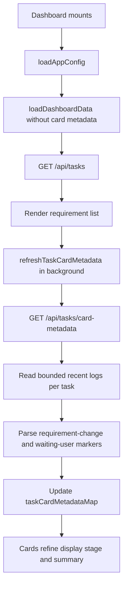
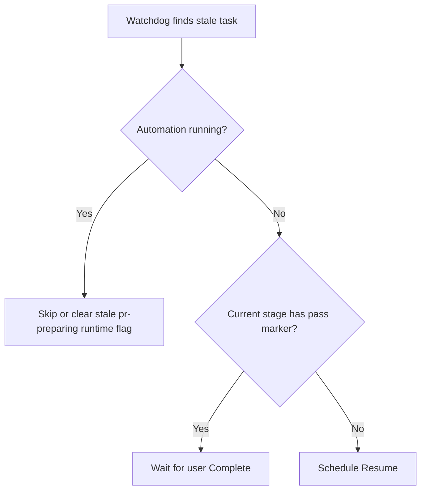

# PRD: Dashboard Loading And Card Metadata Performance Fix

**Original Need:** 补一个 PRD，说明本次为什么页面加载不出来，以及修改了什么。
**AI-Normalized Name:** Make the dashboard task list render without being blocked by slow task-card metadata queries on large log histories.
**Date:** 2026-04-28
**Status:** Implemented and verified

## 1. Introduction & Goals

Koda Dashboard 在启动后左侧需求列表一直停在 `Loading requirements...`。后端访问日志显示 `/api/tasks`、`/api/projects`、`/api/logs` 等接口返回 200，但页面仍不渲染任务卡片。

实际根因是首屏初始化同时等待 `/api/tasks/card-metadata`。该接口为了计算卡片摘要和 `waiting_user` 展示态，会在 `dev_logs.text_content` 上做 marker 查询，并在没有找到 requirement-change marker 时回退读取任务完整日志。当前本地数据库存在单任务十几万到二十多万条日志，导致卡片元数据接口被大日志历史拖慢，首屏也被一起卡住。

Goals:

- 首屏需求列表不再等待慢速 card metadata 才解除 loading。
- `/api/tasks/card-metadata` 不再扫描或加载完整任务日志历史。
- 保留已有卡片展示能力：需求变更摘要、`waiting_user` 展示态、分支健康状态。
- Watchdog 不再对已经通过 post-review lint、正在等待用户 Complete 的任务重复触发 Resume。
- 用测试覆盖大日志场景下的关键行为，避免回归。

## 2. Requirement Shape

- **Actor:** 使用 Koda Dashboard 查看需求卡片的用户，以及维护任务卡片元数据接口的开发者。
- **Trigger:** 用户启动 `just dsl-dev` 并打开 Dashboard；前端请求任务列表和卡片元数据。
- **Expected Behavior:** 任务列表应先渲染；卡片元数据可以后台补齐；大日志任务不应拖住首屏；已经通过 lint 的任务应等待用户点击 Complete，而不是被 watchdog 自动 Resume。
- **Explicit Scope Boundary:** 本次不做数据库 schema 变更，不新增 card metadata 缓存表，不改任务工作流阶段枚举，不改变 Complete 的业务门槛。

## 3. Repository Context And Architecture Fit

Current relevant modules/files:

- `frontend/src/App.tsx`
  - 首屏 `initializeDashboard()` 原本等待 `loadDashboardData(false)`，而默认会同时请求 `/api/tasks/card-metadata`。
  - 已改为首屏先请求任务列表，不包含 card metadata；随后异步调用 `refreshTaskCardMetadata()`。
- `backend/dsl/api/tasks.py`
  - `/api/tasks/card-metadata` 的 route 负责构建任务卡片展示元数据。
  - 原逻辑用 `DevLog.text_content.contains(...)` 查询 marker，并允许缺失快照时加载完整任务日志。
  - 已改为每个任务只读取最近有限条日志，在 Python 层解析 marker，并在批量接口中禁止完整日志回退。
- `backend/dsl/services/task_runner_watchdog_service.py`
  - Watchdog 负责扫描卡在运行阶段但没有活跃 runner 的任务并自动 Resume。
  - 已补充“等待用户 Complete”判断，避免 post-review lint 已通过后继续触发 Resume。
- `tests/test_tasks_api.py`
  - 覆盖 card metadata 的 waiting-user 判定、当前阶段 marker 过滤和不加载完整日志历史。
- `tests/test_task_runner_watchdog_service.py`
  - 覆盖 lint 已通过后 watchdog 不自动 Resume。

Existing path:

- 继续使用现有 `/api/tasks` 和 `/api/tasks/card-metadata` 两条接口。
- 继续让 `TaskService.build_task_branch_health_map()` 提供分支健康快照。
- 继续让前端 metadata fallback 在接口慢或失败时使用任务自身和缓存 metadata 构建卡片展示。

Architecture constraints:

- HTTP route 可以做展示层聚合，但不能把大量日志历史加载进内存。
- 任务阶段真实状态仍以 `Task.workflow_stage` 为准，`waiting_user` 只是 card metadata 的展示态。
- Watchdog 只能恢复真正中断的自动化任务，不能覆盖用户验收等待态。
- 无数据模型变更，因此不需要迁移或 ER 图。

Potential redundancy risks:

- 不新增并行 metadata service 或缓存表，因为当前问题可以通过 bounded query 和前端非阻塞首屏解决。
- 不把 `waiting_user` 写入任务表，避免把展示态误变成工作流状态。
- 不新建前端 loading 状态系统，只调整现有初始化顺序。

## 4. Recommendation

### Recommended Approach

采用最小变更修复：

1. 后端 card metadata 改成 bounded recent-log scan。
   - 新增 `_get_recent_task_log_text_list(...)`，每个任务只读取最近有限条日志。
   - requirement-change 摘要和 waiting-user marker 都基于最近日志窗口解析。
   - waiting-user marker 只看当前阶段进入时间之后的日志，避免旧轮次通过标记误判。

2. 批量 card metadata 禁止完整日志回退。
   - `_build_task_card_metadata(...)` 增加 `load_requirement_change_snapshot_if_missing`。
   - `/api/tasks/card-metadata` 调用时传 `False`，找不到最近 requirement-change marker 就返回 `None`，由前端使用 `Task.requirement_brief` 或缓存 metadata 兜底。

3. 前端首屏不等待 card metadata。
   - `initializeDashboard()` 调用 `loadDashboardData(false, { includeTaskCardMetadata: false })`。
   - 首屏任务列表加载完成后立即解除 `isDashboardLoading`。
   - card metadata 后台刷新，成功后补齐卡片展示态。

4. Watchdog 跳过用户验收等待态。
   - 对 `self_review_in_progress` 和 `test_in_progress` 的 stuck task，先检查当前阶段是否已有 self-review 或 post-review lint 通过标记。
   - 如果已经通过，说明任务正在等待用户 Complete，不再自动 Resume。

Why this is the best fit:

- 复用现有 route、service、frontend state 和 tests，避免引入额外存储或缓存层。
- 保持 `waiting_user` 作为展示态，不污染 workflow stage。
- 将性能风险从“随日志总量增长”改成“随任务数和固定窗口增长”。
- 前端首屏体验与后端 metadata 性能解耦，即使 metadata 短暂慢或失败，也不会空白卡死。

### Alternatives Considered

| Alternative | Why Not Recommended |
| --- | --- |
| 给 `dev_logs.text_content` 增加全文索引 | 需要数据库特定能力和迁移，且仍把展示态计算绑定到全文搜索。 |
| 新增 card metadata 缓存表 | 能解决性能，但引入一致性、失效和迁移复杂度；当前问题可用 bounded query 解决。 |
| 前端完全不再请求 card metadata | 会丢失 `waiting_user`、branch health 和 requirement-change 摘要等现有展示能力。 |
| 把 `waiting_user` 写成真实 workflow stage | 会破坏当前“展示态覆盖真实阶段”的模型，并影响 Resume/Complete 语义。 |

## 5. Implementation Guide

### Core Logic

### Affected Files

- `backend/dsl/api/tasks.py`
- `backend/dsl/services/task_runner_watchdog_service.py`
- `frontend/src/App.tsx`
- `tests/test_tasks_api.py`
- `tests/test_task_runner_watchdog_service.py`
- `tasks/20260428-145200-prd-dashboard-loading-card-metadata-performance-fix.md`

### Change Matrix

| Change Target | Current State | Target State | How to Modify | Why This Fits Existing Architecture | Affected Files |
| --- | --- | --- | --- | --- | --- |
| Dashboard initial loading | 首屏等待 task list、logs、run account 和 card metadata 全部完成 | 首屏只等待核心 task list 等数据；card metadata 后台补齐 | `initializeDashboard()` 初次调用时传 `includeTaskCardMetadata: false`，随后调用 `refreshTaskCardMetadata()` | 复用现有 loading state 和 metadata refresh path，不新增前端状态系统 | `frontend/src/App.tsx` |
| Requirement-change metadata lookup | 后端通过 `text_content contains` 在大日志表中找 marker | 每个任务只读取最近有限日志并在应用层解析 marker | 新增 bounded recent-log helper，替换全文 contains 查询 | 卡片元数据是展示层派生信息，有限窗口足够支撑近期展示，失败时已有 fallback | `backend/dsl/api/tasks.py` |
| Missing requirement-change fallback | 找不到快照时 `_build_task_card_metadata()` 可能加载完整任务日志 | 批量 card metadata 不允许完整日志回退 | 增加 `load_requirement_change_snapshot_if_missing` 参数，批量接口传 `False` | 保留单任务兼容能力，同时阻断批量接口的大日志性能风险 | `backend/dsl/api/tasks.py` |
| Waiting-user marker scope | marker 查询不区分当前阶段入口，可能受旧轮次日志影响 | 只读取当前阶段进入时间后的最近日志 | 给 waiting-user signal 查询传 `stage_updated_at` 下界 | 符合 workflow stage 语义，避免旧通过标记误判 | `backend/dsl/api/tasks.py`, `tests/test_tasks_api.py` |
| Watchdog auto-resume | `test_in_progress` 超过阈值会自动 Resume，即使 lint 已通过 | lint 已通过或 self-review 已通过时等待用户 Complete | Watchdog 调用 card metadata marker helper 判断等待用户状态 | 复用同一 marker 判定，避免 watchdog 和 UI 形成两套规则 | `backend/dsl/services/task_runner_watchdog_service.py` |
| Regression coverage | 缺少对当前阶段 marker 过滤和 watchdog skip 的专项测试 | 新增后端测试覆盖关键边界 | 添加 pytest 用例 | 回归点集中在后端逻辑，pytest 覆盖最直接 | `tests/test_tasks_api.py`, `tests/test_task_runner_watchdog_service.py` |

### Low-Fidelity Prototype

No low-fidelity prototype required; this PRD documents a loading/performance fix and does not introduce new UI layout.

### ER Diagram

No data model changes in this PRD.

### Interactive Prototype Change Log

No interactive prototype file changes in this PRD.

### External Validation

No external validation required; repository evidence and local runtime profiling were sufficient.

## 6. Definition Of Done

- Dashboard first render no longer waits for `/api/tasks/card-metadata`.
- `/api/tasks/card-metadata` no longer loads full task log history in the bulk endpoint.
- Card metadata still returns branch health, waiting-user display stage, and recent requirement-change summary when available.
- Watchdog does not auto-resume tasks already parked for user Complete.
- Targeted backend tests, frontend build, frontend metadata utility tests, lint, and docs build pass.
- Local function-level timing confirms card metadata returns quickly against the existing local database.

## 7. Acceptance Checklist

### Architecture Acceptance

- [x] `frontend/src/App.tsx` still uses the existing dashboard loading and metadata refresh paths.
- [x] `backend/dsl/api/tasks.py` keeps card metadata as a route-level display aggregation without adding a new persistence layer.
- [x] `waiting_user` remains a display-stage value, not a new `WorkflowStage`.
- [x] No new database table, migration, dependency, or cache service was introduced.

### Behavior Acceptance

- [x] Initial dashboard loading can complete after `/api/tasks` succeeds even if card metadata is slow.
- [x] `/api/tasks/card-metadata` uses bounded recent-log reads instead of full log history scans.
- [x] Missing recent requirement-change marker falls back to existing frontend/task summary behavior instead of loading all logs.
- [x] Waiting-user marker detection ignores old pass markers before the current `stage_updated_at`.
- [x] Watchdog skips `test_in_progress` tasks that already have a current-stage post-review lint pass marker.

### Validation Acceptance

- [x] `uv run pytest tests/test_tasks_api.py tests/test_task_runner_watchdog_service.py -q` passed with 66 tests.
- [x] `uv run ruff check backend/dsl/api/tasks.py backend/dsl/services/task_runner_watchdog_service.py tests/test_tasks_api.py tests/test_task_runner_watchdog_service.py` passed.
- [x] `npm run test:task-card-metadata-fallback` passed.
- [x] `npm run test:task-project-filter` passed.
- [x] `npm run build` passed.
- [x] `just docs-build` passed.
- [x] Local timing of `list_task_card_metadata()` against the existing database returned `card_metadata_count=19 elapsed=0.365s`.

### Documentation Acceptance

- [x] This PRD records the root cause, implementation, files changed, and verification evidence.
- [x] No MkDocs nav update is required because this PRD lives under `tasks/`, not `docs/`.

## 8. User Stories

### US-001: Dashboard renders task cards after startup

As a Koda user, I want the requirements list to appear after startup even when card metadata is expensive, so that I can inspect and act on tasks without refreshing repeatedly.

### US-002: Card metadata remains accurate enough for task triage

As a Koda user, I want card metadata to still show waiting-user state and requirement summaries when available, so that the performance fix does not remove useful task triage signals.

### US-003: Parked tasks stay parked for user completion

As a Koda user, I want a task that has passed post-review lint to wait for my Complete action, so that watchdog does not restart work that is already ready for review.

## 9. Functional Requirements

- **FR-1:** Initial dashboard loading must not include `GET /api/tasks/card-metadata` in the blocking request set.
- **FR-2:** Card metadata refresh must still run after initial dashboard data loads.
- **FR-3:** The bulk card metadata endpoint must not load full task log histories when recent requirement-change markers are missing.
- **FR-4:** Requirement-change snapshots must be derived from a bounded recent-log window.
- **FR-5:** Waiting-user pass/start marker detection must be scoped to the task's current `stage_updated_at`.
- **FR-6:** Watchdog must skip auto-resume for current-stage self-review or post-review lint pass states.
- **FR-7:** Existing API response schema for `TaskCardMetadataSchema` must remain compatible.

## 10. Non-Goals

- Do not add a persistent card metadata cache.
- Do not add or modify database indexes in this change.
- Do not change task workflow stages or lifecycle statuses.
- Do not remove branch health calculation from card metadata.
- Do not redesign the Dashboard layout.
- Do not archive or delete existing large dev logs.

## 11. Risks And Follow-Ups

- **Risk:** Requirement-change markers older than the bounded recent-log window may not be returned by card metadata. Current fallback uses task requirement summary/cache; this is acceptable for the loading fix.
- **Risk:** The running dev server must be restarted to load backend code changes; hot reload may not pick up all changed modules in the existing process.
- **Follow-up:** If historical requirement-change summaries must be exact regardless of age, add a dedicated derived metadata field or lightweight cache with explicit invalidation in a separate PRD.

## 12. Decision Log

| ID | Decision Question | Chosen | Rejected | Rationale |
| --- | --- | --- | --- | --- |
| D-01 | How should card metadata avoid large log scans? | Bounded recent-log reads per task | Full-text search over `dev_logs.text_content` | The dashboard only needs recent display markers, and bounded reads keep latency stable without migrations. |
| D-02 | How should first render handle card metadata? | Load task list first, then refresh metadata in background | Keep metadata in the blocking initial load | Rendering tasks quickly is more important than waiting for derived display refinements. |
| D-03 | How should missing requirement-change snapshots behave? | Return no snapshot and let existing frontend/task summary fallback apply | Load complete task logs to search older markers | Full-log fallback caused the loading failure on large histories. |
| D-04 | How should watchdog treat lint-passed `test_in_progress` tasks? | Skip auto-resume and wait for Complete | Resume automatically after stuck threshold | A lint pass means the workflow is intentionally parked for user acceptance. |
