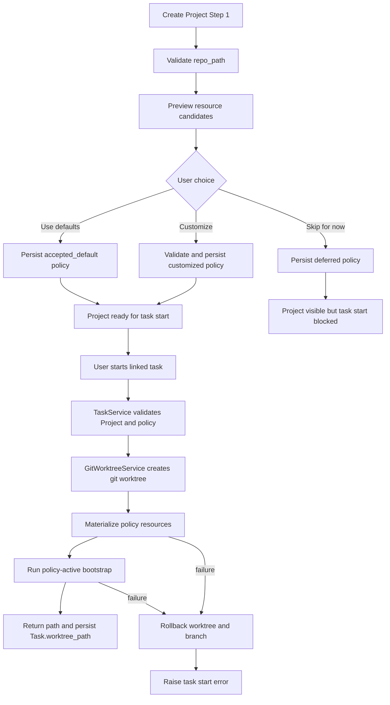
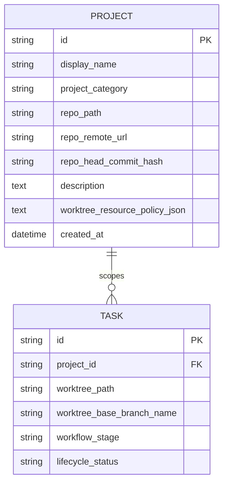

# PRD: Worktree Local Resource Policy

**Original Need:** 创建任务 worktree 时，Git 已跟踪文件默认由 worktree 检出，但本地数据库、上传数据、`.env`、依赖目录、缓存等未跟踪或忽略资源没有进入新 worktree，导致无法测试。Koda 需要在项目创建时让用户确认 worktree 本地资源管理规则，并在 task worktree 创建时按项目级策略复制、链接或跳过这些资源。
**AI-Normalized Name:** Add an explicit project-level local resource policy for materializing runtime resources into task worktrees.
**Date:** 2026-04-28
**Status:** Completed

## 1. Introduction & Goals

当前 Koda 创建任务 worktree 时，`TaskService._ensure_task_worktree_if_needed(...)` 调用 `GitWorktreeService.create_task_worktree(...)`，后者先执行 `git worktree add`，再运行 `scripts/bootstrap_worktree_env.sh` 做有限准备。Git 只能检出已跟踪文件；`.env*`、本地数据库、上传目录、`.venv`、`node_modules`、测试数据和缓存通常是未跟踪或被 `.gitignore` 忽略的资源。现有 shell bootstrap 只对 `.env*`、`.venv`、`node_modules` 做隐式硬编码处理，用户不可见，也不能覆盖项目运行所需的其他本地资源。

本需求要把“worktree 本地资源准备”升级为显式 Project 级策略：用户创建 Project 时必须确认初始资源策略，后续也可以在项目管理中重新扫描和编辑；任务 worktree 创建时，系统在 `git worktree add` 后根据已确认策略复制、链接或跳过资源，并在任何准备失败时回滚本次创建的 worktree/branch，避免留下不可恢复的半成品。

Goals:

- Project 创建流程在 `repo_path` 校验通过后必须让用户确认 worktree 资源策略，不能静默套用默认链接行为。
- Task worktree 创建成功后，运行所需的本地 runtime 资源可以按策略进入 worktree，减少手工复制。
- Git tracked files 继续由 `git worktree add` 管理，保持分支、diff、merge 和 cleanup 语义不变。
- 默认规则要安全：只对识别出的 runtime resource patterns 生成默认动作；未知 untracked 文件默认 `skip` 但展示给用户选择。
- `.env*` 默认 `copy`，数据库和上传目录默认 `link`，依赖目录可默认 `link`，缓存/日志/build 输出默认 `skip`。
- Project 策略必须持久化到 `Project.worktree_resource_policy_json`，并且只有 `confirmed` 状态的策略可用于 task start。
- 资源 materialization 或后续 bootstrap 失败时必须 fail fast，并清理本次创建的 worktree 和 task branch，不能把不可测试或不可追踪的 worktree 留在本地。
- 现有 `.env*`、`.venv`、`node_modules` 处理逻辑要收敛到同一套策略，避免 shell 脚本和 Python 服务各维护一套隐式规则。

## 2. Requirement Shape

- **Actor:** 使用 Koda 项目管理和 task worktree 执行需求的开发者。
- **Trigger:** 用户创建 Project、编辑 Project 的本地资源策略，或启动关联 Project 的 task。
- **Expected Behavior:** 用户创建 Project 时，系统先校验 `repo_path` 并扫描本地资源候选项，再要求用户选择 `Use defaults`、自定义规则并保存，或显式 `Skip for now`。`Use defaults` / 自定义会保存 confirmed 策略；`Skip for now` 会创建 deferred Project，但该 Project 在确认资源策略前不能启动 task worktree。启动 task 时，系统按 confirmed 策略 materialize runtime resources；失败则回滚本次 worktree/branch。
- **Explicit Scope Boundary:** 本需求覆盖 Project 级 worktree 本地资源策略、创建时确认流程、资源扫描、资源 materialization、失败回滚、项目管理 UI、WebDAV business sync 排除规则、文档和测试；不改变 task worktree 路径规则，不改变 Git tracked file 的分支管理语义，不实现跨机器同步本地资源内容，不把 symlink 当作隔离、备份或安全边界。

## 3. Repository Context And Architecture Fit

Current relevant modules/files:

- `backend/dsl/services/task_service.py`
  - `_ensure_task_worktree_if_needed(...)` 是 task 进入 worktree-backed Git 流程的入口。
  - 当前读取 `Project.repo_path`、校验仓库一致性、计算语义 branch，然后调用 `GitWorktreeService.create_task_worktree(...)`；只有调用成功后才写入 `Task.worktree_path`。
  - 这是确认 Project policy 是否可用于 task start 的最近业务边界。
- `backend/dsl/services/git_worktree_service.py`
  - `create_task_worktree(...)` 集中封装 worktree 创建、path-aware script 支持、raw Git fallback 和 post-create bootstrap。
  - `WorktreeCreateCommandSpec.requires_post_create_bootstrap` 已说明 worktree 创建后存在统一准备阶段。
  - 这是执行 materialization、dependency bootstrap 和失败回滚的生命周期边界。
- `scripts/bootstrap_worktree_env.sh`
  - 当前负责 `.env*`、frontend `node_modules`、Python `.venv` / `uv sync`。
  - 现有 `WORKTREE_ENV_FILE_STRATEGY`、`WORKTREE_FRONTEND_STRATEGY`、`WORKTREE_PYTHON_ENV_STRATEGY` 是隐式机器级默认，必须降级为历史无策略 Project 的 draft 生成输入，不能继续覆盖 confirmed Project policy。
- `backend/dsl/models/project.py`
  - `Project` 已拥有本地 repo 路径、remote/head 指纹、分类和描述。
  - 新增 `worktree_resource_policy_json` 应继续归属于 Project，因为策略是 project-local setting。
- `backend/dsl/schemas/project_schema.py`
  - `ProjectCreateSchema`、`ProjectUpdateSchema`、`ProjectResponseSchema` 是 Project UI 与后端合同。
  - 需要新增 policy DTO、confirmation enum、policy readiness 派生字段。
- `backend/dsl/api/projects.py`
  - Project CRUD 和 branch list 路由位于这里。
  - HTTP 层应只做 DTO、状态码和错误映射；策略校验、扫描和默认规则生成应放在服务或新 domain slice。
- `frontend/src/App.tsx`
  - Project 面板当前是单步创建和 inline 编辑表单。
  - 需要扩展为创建时两步确认、编辑时同一资源策略编辑器，以及 deferred Project 的 task start 阻断提示。
- `frontend/src/api/client.ts` 与 `frontend/src/types/index.ts`
  - 需要同步 Project DTO、policy DTO、preview scan API、create/update payload。
- `utils/database.py`
  - 现有轻量 schema patch 通过 `_INCREMENTAL_SCHEMA_PATCHES` 追加列。
  - 新增 Project JSON 字段应沿用该模式。
- `backend/dsl/services/webdav_business_sync_service.py`
  - business sync 当前导出 Project 的 display/category/remote/head/description，不导出 `repo_path`。
  - 本策略是机器本地 runtime 规则，business sync 应默认排除；原始数据库备份恢复仍会原样保留。
- Existing tests/docs:
  - `tests/test_git_worktree_service.py` 已覆盖 raw fallback、path-aware script、`.env*`、`node_modules`、`.venv` bootstrap。
  - `tests/test_task_service.py` 已把 `.env` 出现在新 worktree 当成 task start 合同。
  - `tests/test_project_service.py`、`tests/test_projects_api.py` 覆盖 Project 持久化和 API。
  - `tests/test_webdav_service.py` 覆盖 business sync Project 导出/恢复。
  - `docs/guides/dsl-development.md`、`docs/database/schema.md`、`docs/dev/evaluation.md`、`README.md` 描述 worktree、Project 和数据模型合同。

Existing path:

- Project create/update:
  - `frontend/src/App.tsx`
  - `projectApi.create(...)` / `projectApi.update(...)`
  - `backend/dsl/api/projects.py`
  - `ProjectService.create_project(...)` / `ProjectService.update_project(...)`
  - `Project`
- Task worktree start:
  - `TaskService._ensure_task_worktree_if_needed(...)`
  - `GitWorktreeService.create_task_worktree(...)`
  - `git worktree add ...`
  - post-create preparation
  - save `Task.worktree_path`
- Business sync:
  - `_build_business_sync_snapshot_payload(...)`
  - `_restore_business_sync_snapshot_payload(...)`

Reuse candidates:

- Reuse `Project` as the policy owner; do not add a normalized rule table.
- Reuse `GitWorktreeService.create_task_worktree(...)` as the single lifecycle owner for create, prepare and rollback.
- Reuse the Project panel instead of adding a separate settings page.
- Reuse `ProjectService._normalize_repo_path(...)` for repo path validation in preview/create flows.
- Reuse current incremental schema patch style in `utils/database.py`.
- Reuse existing task/worktree tests and migrate `.env*` expectations from shell-specific behavior to policy-driven behavior.

Architecture constraints:

- Business rules for scanning, default actions, rule precedence, confirmation state, path safety and materialization must not live in FastAPI route handlers or ORM model methods.
- File operations are infrastructure side effects and must be called through service/application logic.
- All Python text file I/O introduced by this change must use `encoding="utf-8"`.
- Git command subprocess calls must use `encoding="utf-8", errors="replace"` where output is consumed.
- Paths in policy rules must be repo-relative POSIX-style paths, normalized, and prevented from escaping the source repo or target worktree.
- Git tracked files must remain Git-owned. Replacing tracked files with symlinks is out of scope.
- Business sync must not sync local resource contents or machine-local resource policy decisions.
- Symlink creation may fail on Windows; link failure must surface actionable errors and rollback the new worktree/branch.

Potential redundancy risks:

- Do not add a second worktree creation service. Extend `GitWorktreeService` and keep rollback there.
- Do not keep `.env*`, `.venv`, and `node_modules` as hidden shell-owned rules after the Python policy materializer is active.
- Do not add a `project_worktree_resource_rules` table unless there is a future need to query rules independently across Projects.
- Do not introduce `rsync`, unison, Docker, or a background sync daemon.
- Do not duplicate scan/default-action logic between create preview and edit scan; both must call the same scanner/use case.

## 4. Recommendation

### Recommended Approach

Implement `Project.worktree_resource_policy_json` plus a new `backend/dsl/worktree_resources/` domain slice that owns policy models, scanning, default-action generation, validation and materialization. Extend Project create/update APIs so policy confirmation is explicit, and extend `GitWorktreeService.create_task_worktree(...)` so post-create preparation is policy-driven and rollback-safe.

Target state:

1. Add structured policy JSON on Project:
   - `schema_version`;
   - `confirmation_status`: `accepted_default` | `customized` | `deferred`;
   - `confirmed_at`: ISO timestamp or `None`;
   - `default_runtime_materialization`: default `link`;
   - `default_unknown_untracked_materialization`: fixed `skip`;
   - tracked files are omitted from resource rules because `git worktree add` already owns them;
   - ordered `rules` with `relative_path`, `include`, `materialization`, `resource_kind`, `git_state`, `required`, `is_directory`, `note`.
2. Add policy confirmation DTO:
   - `WorktreeResourcePolicyConfirmation = "accepted_default" | "customized" | "deferred"`.
   - `ProjectCreateSchema` and `ProjectUpdateSchema` must include `worktree_resource_policy_confirmation`.
   - `customized` requires `worktree_resource_policy`.
   - `accepted_default` may omit `worktree_resource_policy`; backend generates the default policy from the same scanner used by preview.
   - `deferred` creates or updates the Project with `confirmation_status="deferred"` and no active materialization rules; task start must fail before `git worktree add` until the policy is confirmed.
   - Missing confirmation is a 422 error; backend must not silently treat missing fields as consent.
3. Add scan APIs:
   - `POST /api/projects/worktree-resource-candidates/preview`
     - Input: `repo_path`, optional draft policy.
     - Use case: create-project flow before a Project ID exists.
   - `GET /api/projects/{project_id}/worktree-resource-candidates`
     - Use case: edit existing Project policy.
   - Both return repo-relative untracked/ignored candidates, Git state, file kind, default action, current saved rule, warning codes and warning text.
4. Resource scanner default-action policy:
   - tracked files are not listed or saved in policy JSON;
   - `.env*`, `*.pem`, `*.key`: default `copy`, warning `secret`;
   - SQLite/db files and upload/data runtime directories: default `link`, warning `shared-mutable`;
   - `.venv` and `node_modules`: default `link` when source exists, warning `large-shared-dependency`;
   - logs, caches, build outputs, `.uv-cache`, `dist`, `build`, `site`: hidden from chooser because they should not be copied or linked;
   - unknown untracked/ignored folders and files: default `skip`, warning `manual-review-required`.
5. Project creation UI becomes two-step:
   - Step 1: collect metadata and validate `repo_path`;
   - Step 2: preview resources and choose `Use defaults`, customize rules, or `Skip for now`.
   - `Use defaults` sends `worktree_resource_policy_confirmation="accepted_default"`.
   - Custom save sends `worktree_resource_policy_confirmation="customized"` plus policy.
   - `Skip for now` sends `worktree_resource_policy_confirmation="deferred"` and the Project remains visible but not selectable for task start until confirmed.
6. Project edit UI exposes the same scan/rule editor:
   - if `repo_path` changes, the existing policy is stale; update must either include a newly confirmed policy for the new path or explicitly set `deferred`.
7. Task start behavior:
   - `TaskService._ensure_task_worktree_if_needed(...)` loads and validates the Project policy before branch creation.
   - If policy is missing or `deferred`, raise a clear error telling the user to confirm Worktree Resources in Project settings.
   - Pass the resolved policy into `GitWorktreeService.create_task_worktree(...)`.
8. Worktree lifecycle:
   - `GitWorktreeService.create_task_worktree(...)` creates the Git worktree exactly as today.
   - After Git worktree creation, call `WorktreeResourceMaterializer.materialize_project_resources(...)`.
   - Then run dependency bootstrap in install-only / compatibility mode.
   - If materialization or bootstrap fails, call rollback to remove the created worktree registration/directory and delete the new task branch when it was created by this attempt; then raise `ValueError`.
   - Only after all preparation succeeds does the method return and allow `TaskService` to persist `Task.worktree_path`.
9. Bootstrap script convergence:
   - When Project policy is active, `GitWorktreeService` runs `scripts/bootstrap_worktree_env.sh` with `KODA_WORKTREE_RESOURCE_POLICY_ACTIVE=1`.
   - In that mode, shell bootstrap must not copy/link `.env*`, `.venv`, or `node_modules`; it may only run dependency installation tasks that do not conflict with materialized resources.
   - `WORKTREE_ENV_FILE_STRATEGY`, `WORKTREE_FRONTEND_STRATEGY`, and `WORKTREE_PYTHON_ENV_STRATEGY` are only used to generate a deferred draft for historical Projects with null policy, not to override confirmed policy.
10. WebDAV business sync:
   - Do not include `worktree_resource_policy_json` in business sync export.
   - Do not overwrite an existing local Project policy during business sync restore.
   - Newly imported Projects from business sync get empty `repo_path` and deferred policy state until the user relinks and confirms local resources.

Why this is the best fit for the current architecture:

- It keeps Project as the owner of local repo configuration and avoids a new settings entity.
- It extends the existing Project create/update APIs instead of adding a parallel project wizard backend.
- It keeps worktree preparation inside `GitWorktreeService`, the only place that can reliably roll back a partially created worktree/branch.
- It moves hidden shell behavior into typed Python policy logic that can be previewed by UI, validated by API and tested deterministically.
- It preserves WebDAV business sync's existing distinction between business facts and machine-local paths/runtime state.

Rationale for rejecting redundant abstractions:

- A normalized `ProjectWorktreeResourceRule` table is unnecessary because rules are only loaded, saved and edited as one Project setting.
- A separate worktree-preparation CLI would duplicate lifecycle ownership and make rollback harder.
- Keeping all local resource behavior in `scripts/bootstrap_worktree_env.sh` would prevent typed validation, preview APIs, path safety checks and frontend warnings from sharing the same rule engine.

### Alternatives Considered

| Alternative | Why Not Recommended |
| --- | --- |
| Silently apply default policy on Project create when the UI omits policy fields | This recreates the original unsafe behavior because non-UI clients can create Projects that link local secrets or databases without explicit consent. |
| Default-link every untracked/ignored file | Too broad; untracked files include scratch files, generated output, and accidental secrets. Unknown files should be visible but skipped until selected. |
| Keep using `WORKTREE_*_STRATEGY` as runtime override | Machine-level env vars would override Project-specific UI choices and make behavior hard to explain or reproduce. |
| Store one row per resource rule | Heavier than needed; the app does not query resource rules across Projects or need rule-level joins. |
| Persist failed worktree path on materialization failure | This would require a new failed-preparation task state. Rollback is simpler and matches the current "only persist path after success" flow. |
| Sync policy metadata through WebDAV business sync | Policy is machine-local and references local paths/resources. Syncing it would transfer runtime assumptions without transferring the actual resources. |

## 5. Implementation Guide

### Core Logic

1. Data contract:
   - Add `Project.worktree_resource_policy_json: Text | None`.
   - Add Pydantic models in `backend/dsl/worktree_resources/schemas.py`:
     - `WorktreeResourceMaterialization = "git-managed-copy" | "link" | "copy" | "skip"`;
     - `WorktreeResourceGitState = "tracked" | "untracked" | "ignored"`;
     - `WorktreeResourcePolicyConfirmation = "accepted_default" | "customized" | "deferred"`;
     - `ProjectWorktreeResourceRuleSchema`;
     - `ProjectWorktreeResourcePolicySchema`;
     - `WorktreeResourceCandidateSchema`;
     - `WorktreeResourcePreviewRequestSchema`;
     - `WorktreeResourceCandidateListSchema`.
   - `ProjectCreateSchema` and `ProjectUpdateSchema` include:
     - `worktree_resource_policy_confirmation: WorktreeResourcePolicyConfirmation`;
     - `worktree_resource_policy: ProjectWorktreeResourcePolicySchema | None`.
   - `ProjectResponseSchema` includes:
     - `worktree_resource_policy: ProjectWorktreeResourcePolicySchema | None`;
     - `worktree_resource_policy_confirmation: WorktreeResourcePolicyConfirmation`;
     - `is_worktree_resource_policy_ready: bool`;
     - `worktree_resource_policy_note: str | None`.

2. Domain/application slice:
   - Add `backend/dsl/worktree_resources/`.
   - Suggested modules:
     - `schemas.py`: API-facing Pydantic contracts.
     - `domain/models.py`: typed policy, rule, resource candidate, materialization result.
     - `domain/policies.py`: default policy, runtime pattern classification, rule precedence, built-in exclusions.
     - `domain/errors.py`: unsafe path, invalid policy, materialization conflict, symlink unsupported, policy deferred.
     - `application/use_cases.py`: preview candidates, validate policy, generate default policy, materialize resources.
     - `infrastructure/git_resource_scanner.py`: wraps `git ls-files` with UTF-8 subprocess handling.
     - `infrastructure/filesystem_materializer.py`: copy/link side effects.
   - Route functions may live in `backend/dsl/worktree_resources/api.py` and be included from `backend/dsl/app.py`, or in `backend/dsl/api/projects.py` if keeping Project endpoints together is cleaner.

3. Resource discovery:
   - Use Git as source of truth:
     - untracked: `git ls-files --others --exclude-standard`;
     - ignored: `git ls-files --others --ignored --exclude-standard`.
   - Collapse ignored file lists into directory candidates for common heavy roots: `node_modules`, `.venv`, `data`, `uploads`, `.uv-cache`, `dist`, `build`, `site`, `logs`, cache directories.
   - Built-in exclusions always skip:
     - `.git/**`;
     - the task worktree root under `<repo-parent>/task/**`;
     - nested Git metadata;
     - `.DS_Store` and OS temp files;
     - pure generated artifacts such as `__pycache__`, `.pytest_cache`, `.mypy_cache`, `.ruff_cache`, coverage/htmlcov, dist/build/site, logs, `.cache`, `.next`, `.vite`, `.turbo`, `.parcel-cache`, `*.pyc`, `*.log`, and `*.tmp`;
     - paths whose realpath escapes `Project.repo_path`.
   - Warnings:
     - `secret`: `.env*`, `*.pem`, `*.key`;
     - `large`: size above configured threshold;
     - `shared-mutable`: SQLite/db/upload/data directories when linked;
     - `manual-review-required`: unknown untracked/ignored file defaulted to skip;
     - `symlink-risk`: platform may not support symlinks or source is itself a symlink.

4. Policy normalization:
   - Normalize all rule paths to repo-relative POSIX strings.
   - Reject absolute paths, `..`, empty paths, Windows drive prefixes, null bytes and paths that resolve outside the source repo.
   - Do not generate UI/default rules for tracked files; `git-managed-copy` remains a legacy/manual no-op materialization value only.
   - Deduplicate rules by normalized `relative_path`; later duplicates are invalid rather than silently winning.
   - A policy is ready only when `confirmation_status in {"accepted_default", "customized"}`.
   - Missing Project policy for historical rows returns a deferred draft response and blocks task start until saved.

5. Project create/update:
   - `accepted_default`:
     - backend scans current `repo_path`;
     - generates default policy;
     - persists it with `confirmation_status="accepted_default"` and `confirmed_at`.
   - `customized`:
     - backend validates supplied policy against current `repo_path`;
     - persists normalized policy with `confirmation_status="customized"` and `confirmed_at`.
   - `deferred`:
     - persists a policy with `confirmation_status="deferred"`, no active materialization rules and `confirmed_at=None`;
     - response marks `is_worktree_resource_policy_ready=false`.
   - If `repo_path` changes on update, the request must include a confirmation for the new path; otherwise return 422.

6. Materialization sequence:
   - `TaskService._ensure_task_worktree_if_needed(...)`:
     - loads Project;
     - validates repo path and remote consistency as today;
     - loads policy through `WorktreeResourcePolicyService`;
     - fails before branch creation if policy is missing/deferred/invalid;
     - passes policy into `GitWorktreeService.create_task_worktree(...)`.
   - `GitWorktreeService.create_task_worktree(...)`:
     - creates worktree using existing command spec;
     - records rollback context: expected path, branch name, whether the branch existed before create;
     - runs materializer;
     - runs bootstrap with policy-active env;
     - on failure, attempts rollback and raises a `ValueError` whose message includes preparation failure and rollback result.
   - `TaskService` writes `Task.worktree_path` only after the method returns successfully.

7. Collision and copy/link behavior:
   - tracked target path exists: fail; policy must not overwrite Git-owned files.
   - target symlink already points to expected source: skip idempotently.
   - target file/dir exists and is not the expected symlink: fail and trigger rollback.
   - `copy` uses `shutil.copy2` for files and `shutil.copytree` for directories; copied symlinks should copy the resolved target content unless a future option says otherwise.
   - missing source for `required=true`: fail and rollback.
   - missing source for `required=false`: skip and record warning.

8. UI behavior:
   - Create Project Step 1:
     - user enters name, repo path, category and description;
     - preview button validates/scans repo path.
   - Create Project Step 2:
     - shows candidate list with include toggle, Link/Copy/Skip segmented control, state, kind and warning;
     - offers `Back`, `Skip for now`, `Use defaults`, `Create with custom rules`.
   - Project list:
     - shows summary such as `Worktree resources: ready · 3 link · 2 copy · 8 skip`;
     - deferred Projects show `Worktree resources: needs confirmation` and are disabled for task start selection.
   - Edit Project:
     - same scan/rule editor;
     - changing `repo_path` shows existing policy as stale and requires reconfirmation or deferred save.

9. Bootstrap compatibility:
   - `KODA_WORKTREE_RESOURCE_POLICY_ACTIVE=1` makes shell skip local resource materialization sections.
   - Keep install-only actions only when they do not overwrite/collide with policy-created resources.
   - Existing `WORKTREE_*_STRATEGY` values can seed a deferred draft for old Projects, but confirmed Project policy always wins.

10. Documentation:
   - Update `README.md` to replace “同步复制 `.env*`” with policy-driven materialization.
   - Update `docs/guides/dsl-development.md` task start flow.
   - Update `docs/database/schema.md` Project fields, WebDAV sync exclusion and ER diagram.
   - Update `docs/dev/evaluation.md` manual verification for create-time confirmation, deferred blocking, copy/link, rollback and WebDAV exclusion.

### Affected Files

- `backend/dsl/models/project.py`
- `backend/dsl/schemas/project_schema.py`
- `backend/dsl/services/project_service.py`
- `backend/dsl/services/task_service.py`
- `backend/dsl/services/git_worktree_service.py`
- `backend/dsl/worktree_resources/__init__.py`
- `backend/dsl/worktree_resources/api.py`
- `backend/dsl/worktree_resources/schemas.py`
- `backend/dsl/worktree_resources/domain/models.py`
- `backend/dsl/worktree_resources/domain/policies.py`
- `backend/dsl/worktree_resources/domain/errors.py`
- `backend/dsl/worktree_resources/application/use_cases.py`
- `backend/dsl/worktree_resources/infrastructure/git_resource_scanner.py`
- `backend/dsl/worktree_resources/infrastructure/filesystem_materializer.py`
- `backend/dsl/app.py`
- `backend/dsl/services/webdav_business_sync_service.py`
- `utils/database.py`
- `scripts/bootstrap_worktree_env.sh`
- `tests/test_git_worktree_service.py`
- `tests/test_task_service.py`
- `tests/test_project_service.py`
- `tests/test_projects_api.py`
- `tests/test_database.py`
- `tests/test_webdav_service.py`
- `frontend/src/types/index.ts`
- `frontend/src/api/client.ts`
- `frontend/src/App.tsx`
- `frontend/src/index.css`
- `frontend/tests/api_client.test.ts`
- `frontend/tests/task_project_filter.test.ts` or a new focused project resource policy UI test
- `docs/guides/dsl-development.md`
- `docs/database/schema.md`
- `docs/dev/evaluation.md`
- `README.md`

### Change Matrix

| Change Target | Current State | Target State | How to Modify | Why This Fits Existing Architecture | Affected Files |
|---|---|---|---|---|---|
| Project resource policy storage | `Project` stores repo path and Git fingerprints only | `Project` stores typed policy JSON with confirmation status | Add `worktree_resource_policy_json`, Pydantic normalization and response readiness fields | Project already owns local repo settings and UI editing | `backend/dsl/models/project.py`, `backend/dsl/schemas/project_schema.py`, `backend/dsl/services/project_service.py`, `utils/database.py` |
| Project create API | `POST /api/projects` silently creates a Project from metadata | Create requires explicit `worktree_resource_policy_confirmation` | Extend create schema and service; missing confirmation returns 422 | Prevents non-UI clients from bypassing resource consent | `backend/dsl/schemas/project_schema.py`, `backend/dsl/api/projects.py`, `backend/dsl/services/project_service.py` |
| Resource preview | No user-visible scan; shell finds only hard-coded resources | Create/edit flows can preview Git states, defaults and warnings | Add scanner use case and preview endpoints | Keeps Git as source of truth while sharing logic between create and edit | `backend/dsl/worktree_resources/**`, `backend/dsl/api/projects.py` |
| Default rules | Hidden defaults link/copy `.env*`, `.venv`, `node_modules` | Safe runtime defaults; unknown untracked defaults to skip | Classify candidates by runtime pattern and warnings | Avoids broad untracked symlink behavior while preserving runtime convenience | `backend/dsl/worktree_resources/domain/policies.py` |
| Task start gating | Task start creates worktree if Project path is valid | Task start also requires confirmed resource policy before branch creation | Load and validate policy in `TaskService` before calling worktree service | `TaskService` already owns Project preconditions | `backend/dsl/services/task_service.py` |
| Worktree preparation | Bootstrap runs after `git worktree add`; failures can leave untracked local state | Materialize policy resources, run install-only bootstrap, rollback on failure | Extend `GitWorktreeService.create_task_worktree(...)` with rollback context | Worktree service already owns the only create lifecycle boundary | `backend/dsl/services/git_worktree_service.py` |
| Bootstrap script | Shell owns `.env*`, `.venv`, `node_modules` materialization | Shell skips materialization when Project policy is active | Add `KODA_WORKTREE_RESOURCE_POLICY_ACTIVE=1` mode | Consolidates policy in Python while preserving install helpers | `scripts/bootstrap_worktree_env.sh` |
| WebDAV business sync | Sync excludes `repo_path` and `worktree_path`, includes Project metadata | Sync also excludes resource policy metadata | Leave export payload without policy and preserve local policy on restore | Matches existing machine-local vs business-fact boundary | `backend/dsl/services/webdav_business_sync_service.py`, `tests/test_webdav_service.py`, `docs/database/schema.md` |
| Project UI | Project create/edit is metadata-only | Create/edit includes resource confirmation and deferred state | Add two-step create and resource editor UI | Reuses existing Project panel rather than adding a new page | `frontend/src/App.tsx`, `frontend/src/api/client.ts`, `frontend/src/types/index.ts`, `frontend/src/index.css` |
| Tests/docs | Tests cover shell bootstrap and Project CRUD | Tests cover confirmation, default classification, materialization, rollback and WebDAV exclusion | Extend existing backend/frontend/docs validation | Follows current test ownership by service/API/frontend | `tests/**`, `frontend/tests/**`, `docs/**`, `README.md` |

### Flow Or Architecture Diagram



### Low-Fidelity Prototype

```text
Create Project · Step 1
┌──────────────────────────────────────────────────────────────┐
│ Name              [ Demo App                              ]  │
│ Repo Path          [ /Users/me/code/demo-app                ] │
│ Category           [ backend                              ]  │
│ Description        [ local test app                       ]  │
│                                             [Preview]        │
└──────────────────────────────────────────────────────────────┘

Create Project · Step 2
┌──────────────────────────────────────────────────────────────┐
│ Worktree Resources                         [Rescan]          │
│ Policy defaults: runtime resources only · unknown files skip │
│                                                              │
│ Include  Path                  State      Action   Warning   │
│ [x]      .env.local            ignored    Copy     secret    │
│ [x]      data/app.sqlite       ignored    Link     shared    │
│ [x]      uploads/              ignored    Link     mutable   │
│ [ ]      notes.tmp             untracked  Skip     review    │
│ [ ]      logs/                 ignored    Skip               │
│                                                              │
│        [Back] [Skip for now] [Use defaults] [Create custom]  │
└──────────────────────────────────────────────────────────────┘

Project List
┌──────────────────────────────────────────────────────────────┐
│ Demo App                                      Healthy  Edit   │
│ /Users/me/code/demo-app                                      │
│ Worktree resources: ready · 2 link · 1 copy · 8 skip         │
└──────────────────────────────────────────────────────────────┘
┌──────────────────────────────────────────────────────────────┐
│ Legacy App                                    Needs setup Edit│
│ /Users/me/code/legacy-app                                    │
│ Worktree resources: needs confirmation before task start      │
└──────────────────────────────────────────────────────────────┘
```

### ER Diagram



### Interactive Prototype Change Log

No interactive prototype file changes in this PRD.

### External Validation

No external validation required; repository evidence was sufficient.

## 6. Definition Of Done

- Project create/update APIs require explicit resource policy confirmation and return policy readiness state.
- Project create UI includes a resource confirmation step before the Project is ready for task worktree creation.
- Deferred Projects cannot start task worktrees and show a clear UI/API error until resources are confirmed.
- New task worktrees materialize included runtime resources according to confirmed Project policy before `Task.worktree_path` is persisted.
- Materialization/bootstrap failure rolls back the created worktree and branch or reports rollback failure explicitly.
- Shell bootstrap no longer independently decides `.env*`, `.venv`, or `node_modules` copy/link behavior when Project policy is active.
- WebDAV business sync excludes `worktree_resource_policy_json` and preserves local policy on restore.
- Documentation reflects policy-driven local resource handling, linked-state risks, deferred blocking and rollback behavior.
- Backend tests, frontend tests and docs build pass.

## 7. Acceptance Checklist

### Architecture Acceptance

- [ ] `Project.worktree_resource_policy_json` is added through ORM model and `_INCREMENTAL_SCHEMA_PATCHES`.
- [ ] Policy schema parsing/normalization is implemented with Pydantic before persistence.
- [ ] Resource scanning, default classification and rule resolution live outside FastAPI route handlers and ORM models.
- [ ] `backend/dsl/worktree_resources/domain/` does not import FastAPI, SQLAlchemy sessions or React/frontend types.
- [ ] `TaskService._ensure_task_worktree_if_needed(...)` validates policy readiness before calling `GitWorktreeService.create_task_worktree(...)`.
- [ ] `GitWorktreeService.create_task_worktree(...)` remains the only worktree creation lifecycle used by task start and owns rollback.
- [ ] `scripts/bootstrap_worktree_env.sh` does not materialize `.env*`, `.venv`, or `node_modules` when `KODA_WORKTREE_RESOURCE_POLICY_ACTIVE=1`.
- [ ] `backend/dsl/services/webdav_business_sync_service.py` does not export or import `worktree_resource_policy_json` in business sync snapshots.

### API Acceptance

- [ ] `POST /api/projects/worktree-resource-candidates/preview` accepts `repo_path` and returns candidates without creating a Project.
- [ ] `GET /api/projects/{project_id}/worktree-resource-candidates` returns candidates with saved-rule overlays for existing Projects.
- [ ] `POST /api/projects` without `worktree_resource_policy_confirmation` returns 422.
- [ ] `POST /api/projects` with `worktree_resource_policy_confirmation="accepted_default"` persists a confirmed default policy.
- [ ] `POST /api/projects` with `worktree_resource_policy_confirmation="customized"` and no `worktree_resource_policy` returns 422.
- [ ] `POST /api/projects` with `worktree_resource_policy_confirmation="deferred"` creates a Project with `is_worktree_resource_policy_ready=false`.
- [ ] `PUT /api/projects/{project_id}` changing `repo_path` without renewed policy confirmation returns 422.
- [ ] Project responses include `worktree_resource_policy`, `worktree_resource_policy_confirmation`, `is_worktree_resource_policy_ready` and `worktree_resource_policy_note`.

### Behavior Acceptance

- [ ] A repo with tracked `README.md` does not show it in resource candidates and never tries to symlink/copy over it.
- [ ] `.env.local` default action is `copy` with a `secret` warning.
- [ ] `data/app.sqlite` or `uploads/` default action is `link` with a `shared-mutable` warning.
- [ ] Unknown untracked files default to `skip` with `manual-review-required`.
- [ ] Saved `copy` rules create real files/directories, not symlinks.
- [ ] Saved `link` rules create symlinks pointing to the source repo path.
- [ ] Saved `skip` or `include=false` rules leave resources absent from the worktree.
- [ ] A rule path containing `..`, absolute paths, Windows drive prefixes, null bytes, or symlink escape outside the repo is rejected with 422.
- [ ] Built-in exclusions never copy or link `.git/**` or `<repo-parent>/task/**`.
- [ ] A deferred Project task start fails before `git worktree add`.
- [ ] A materialization collision after `git worktree add` removes the created worktree registration/directory and deletes the new task branch when safe.
- [ ] If rollback cannot fully clean up, the task start error includes the cleanup failure reason and `Task.worktree_path` remains unset.
- [ ] Existing shell env strategy variables do not override a confirmed Project policy.

### UI Acceptance

- [ ] Project create flow has a repo preview step before final creation.
- [ ] Create flow exposes `Back`, `Skip for now`, `Use defaults`, and custom create actions.
- [ ] Project edit flow exposes scan, include/exclude, Link/Copy/Skip, save and reset/default actions.
- [ ] Deferred Projects are visually marked as needing Worktree Resource confirmation.
- [ ] Deferred Projects are disabled or blocked in task start selection with a clear message.
- [ ] Resource warning labels for secrets, shared mutable data, large dependencies and manual review are visible in create/edit flows.

### Documentation Acceptance

- [ ] `README.md` no longer says worktree creation simply copies `.env*`; it describes policy-driven materialization.
- [ ] `docs/guides/dsl-development.md` describes policy confirmation, task start gating, materialization and rollback.
- [ ] `docs/database/schema.md` documents `Project.worktree_resource_policy_json`, response readiness fields and business sync exclusion.
- [ ] `docs/dev/evaluation.md` includes manual checks for create-time confirmation, deferred blocking, linked DB, copied `.env`, rollback and WebDAV business sync.

### Validation Acceptance

- [ ] `uv run pytest tests/test_git_worktree_service.py -v` passes.
- [ ] `uv run pytest tests/test_task_service.py tests/test_project_service.py tests/test_projects_api.py tests/test_database.py -v` passes.
- [ ] `uv run pytest tests/test_webdav_service.py -v` passes.
- [ ] Frontend tests covering Project API/client or Project resource controls pass through the existing frontend test command.
- [ ] `just docs-build` passes.

## 8. User Stories

### US-001: Project creator confirms local resource policy

As a developer creating a Project, I want to review local resource handling before task worktrees can use the Project, so links to secrets, databases and upload directories are deliberate.

Acceptance criteria:

- After entering a valid repo path, the create flow shows scanned resource candidates.
- The creator can accept defaults, customize rules or explicitly defer setup.
- Accepted/default/custom policy is saved with the Project and used by the first task worktree.
- Deferred setup creates the Project but blocks task start until confirmed.

### US-002: New task worktree can use local runtime data

As a developer, I want task worktrees to include my local database and uploaded files, so I can run and test the project without manually copying data after every task start.

Acceptance criteria:

- A configured local ignored database file is present in the new worktree as a symlink.
- The symlink points back to the source repo path.
- Task start fails visibly and rolls back local worktree creation if the resource cannot be materialized.

### US-003: Sensitive files can be copied instead of linked

As a developer, I want `.env` files copied by default, so worktree-local environment edits do not mutate my main checkout.

Acceptance criteria:

- `.env.local` default action is `copy`.
- The target worktree receives a real file, not a symlink.
- Editing the worktree copy does not edit the source file.

### US-004: Unknown or generated files are not linked by surprise

As a developer, I want unknown untracked files to be visible but skipped by default, so scratch files and accidental secrets do not appear in task worktrees unless I choose them.

Acceptance criteria:

- Unknown untracked files appear in scan results.
- Unknown untracked files default to `skip`.
- The user can explicitly switch them to `link` or `copy`.

### US-005: Existing Projects migrate safely

As a developer with existing Projects, I want Koda to avoid changing local resource behavior silently after upgrade, so I can review policy before new task worktrees depend on it.

Acceptance criteria:

- Existing Projects with null policy are shown as needing resource confirmation.
- Legacy `WORKTREE_*_STRATEGY` values can seed a draft, but do not create an active policy without user confirmation.
- Task start for an unconfirmed legacy Project fails before creating a worktree.

## 9. Functional Requirements

- FR-1: The system must keep Git tracked files managed by `git worktree add`.
- FR-2: The system must provide a Project-level `worktree_resource_policy_json` field.
- FR-3: The policy must carry an explicit confirmation status: `accepted_default`, `customized`, or `deferred`.
- FR-4: Project create/update APIs must reject missing policy confirmation with 422.
- FR-5: Deferred Projects must not be eligible for task worktree creation.
- FR-6: The scanner must distinguish untracked and ignored local resources using Git commands; tracked files remain Git-owned and are not shown in the chooser.
- FR-7: The scanner must default only recognized runtime resource patterns to `copy` or `link`; unknown untracked/ignored resources must default to `skip`.
- FR-8: `.env*`, `*.pem` and `*.key` must default to `copy` with a secret warning.
- FR-9: Database/upload/data runtime resources must default to `link` with a shared-mutable warning.
- FR-10: Each rule must support include/skip and materialization mode `link`, `copy`, or `skip` for untracked/ignored resources.
- FR-11: The system must reject unsafe policy paths that are absolute, contain traversal, contain null bytes, use drive prefixes, or resolve outside source repo/target worktree.
- FR-12: Worktree resource materialization must run after Git worktree creation and before dependency bootstrap.
- FR-13: If a materialization target already exists because `git worktree add` checked out Git-managed content for that path, the materializer must skip that rule and continue with uncovered child rules; non-Git target collisions must still fail.
- FR-14: `Task.worktree_path` must be persisted only after Git worktree creation, resource materialization and bootstrap all succeed.
- FR-15: Materialization/bootstrap failure must attempt to remove the created worktree and new task branch before returning an error.
- FR-16: The shell bootstrap must not independently materialize local resources when Project policy is active.
- FR-17: Existing worktree path naming under `<repo-parent>/task/<repo>-wt-<task_short_id>` must not change.
- FR-18: Existing branch naming and base branch behavior must not change.
- FR-19: WebDAV business sync must exclude `worktree_resource_policy_json` and local resource contents.
- FR-20: Resource policy behavior must be covered by backend tests for confirmation, default classification, link, copy, skip, collision, path safety, rollback, WebDAV exclusion and legacy null-policy behavior.
- FR-21: Documentation must warn that linked resources are shared mutable state across worktrees.

## 10. Non-Goals

- Do not implement cross-machine transfer of local resource contents.
- Do not sync actual database/upload/cache files through WebDAV.
- Do not sync `worktree_resource_policy_json` through WebDAV business sync.
- Do not replace Git tracked files with symlinks.
- Do not make `node_modules` or `.venv` copying mandatory.
- Do not introduce Docker, rsync, unison or a background file synchronization daemon.
- Do not add a new task workflow stage unless rollback proves impossible during implementation.
- Do not change task completion, merge, branch cleanup or PR preparation semantics.

## 11. Risks And Follow-Ups

- Symlinked databases and upload directories are shared mutable state. This is intentional when selected, but UI and docs must keep the warning visible and allow `copy`.
- Copying large directories can make task start slow and consume disk. Scanner warnings and default `skip` for generated outputs reduce the risk.
- Windows symlink creation may require privileges or developer mode. Link failures must rollback and instruct the user to choose `copy`.
- Rollback can fail if external processes hold files open. The error must report both the original preparation failure and cleanup failure so the user can remove the leftover worktree manually.
- Existing Projects will require resource policy confirmation after upgrade before creating new task worktrees. This is a deliberate safety break from hidden shell defaults.

## 12. Decision Log

| ID | Decision | Chosen | Rejected | Rationale |
|---|---|---|---|---|
| D-01 | Where should resource policy be stored? | Store structured policy JSON on `Project.worktree_resource_policy_json`. | Add a normalized `ProjectWorktreeResourceRule` table. | The policy is edited and loaded as one Project setting, so per-rule rows add joins without current query value. |
| D-02 | When should users first configure resource rules? | During Project creation after repo path validation, with explicit accept/customize/defer choices. | Only expose rules later in Project edit or silently apply defaults. | Creation-time confirmation prevents surprise links before the first task worktree. |
| D-03 | What should happen when setup is deferred? | Project is created but task worktree start is blocked until policy is confirmed. | Save active defaults while calling the action "skip". | Blocking preserves explicit consent and avoids hidden default materialization. |
| D-04 | What is the default for unknown untracked files? | Show them but default to `skip`. | Link every untracked/ignored file. | Unknown untracked files often include scratch files, generated output or accidental secrets. |
| D-05 | How should sensitive files default? | `.env*`, keys and cert-like files default to `copy`. | Link all runtime resources by default. | Copy avoids mutating source secrets when a task worktree edits environment values. |
| D-06 | Where should materialization run? | After `git worktree add` inside `GitWorktreeService.create_task_worktree(...)`. | Add a separate worktree preparation service path. | The existing service is the only boundary that can create, prepare and rollback before `Task.worktree_path` is persisted. |
| D-07 | What happens on materialization/bootstrap failure? | Roll back the created worktree and new task branch, then raise a clear error. | Persist a failed worktree path or leave local state behind. | Rollback matches the current successful-only `Task.worktree_path` persistence model. |
| D-08 | How should existing bootstrap behavior evolve? | Python policy owns local resource materialization; shell runs install-only when policy is active. | Continue honoring shell env vars as runtime overrides. | Runtime env vars would override Project UI choices and duplicate policy logic. |
| D-09 | How should legacy `WORKTREE_*_STRATEGY` values be used? | Seed deferred drafts for historical Projects with null policy. | Use them to silently activate policy. | Draft seeding helps migration without treating old machine-level defaults as user confirmation. |
| D-10 | Should business sync include policy metadata? | Exclude policy from WebDAV business sync and preserve local policy on restore. | Sync policy metadata with Project business facts. | Resource policy is machine-local and unsafe to replay on another machine without the corresponding local resources. |

## 13. Completion Summary

- **Status:** Complete
- **Verified:** `uv run pytest tests -q`, `uv run pytest tests/test_worktree_resources.py tests/test_project_service.py tests/test_task_service.py tests/test_projects_api.py tests/test_git_worktree_service.py tests/test_webdav_service.py -q`, `npm test`, `npm run build`, `just lint`, `just docs-build`, and `git diff --check`.
- **Deliverables:** `backend/dsl/worktree_resources/`, `backend/dsl/models/project.py`, `backend/dsl/schemas/project_schema.py`, `backend/dsl/services/project_service.py`, `backend/dsl/services/task_service.py`, `backend/dsl/services/git_worktree_service.py`, `backend/dsl/api/projects.py`, `scripts/bootstrap_worktree_env.sh`, `frontend/src/types/index.ts`, `frontend/src/api/client.ts`, `frontend/src/App.tsx`, `frontend/src/index.css`, `README.md`, `docs/database/schema.md`, `docs/dev/evaluation.md`, `docs/guides/codex-cli-automation.md`, `docs/guides/dsl-development.md`, `tests/test_worktree_resources.py`, `tests/test_database.py`, `tests/test_project_service.py`, `tests/test_projects_api.py`, `tests/test_task_service.py`, `tests/test_git_worktree_service.py`, `tests/test_webdav_service.py`
- **UI Outcome:** Project create/edit now expose a Worktree Resources chooser. Users can scan repo candidates, browse them as a lazily rendered path tree, configure an entire folder or an individual resource, choose `Copy` / `Link` / `Skip`, and apply the result without hand-writing JSON. Advanced JSON remains available as a troubleshooting escape hatch.
- **Notes:** Legacy projects without stored policy JSON now infer a deferred draft on detail/edit paths and block task worktree creation until Worktree Resources are confirmed. Project list responses use lightweight snapshots so existing Projects render quickly instead of waiting for every local repo Git check or legacy policy scan. Project creation still requires a successful repo resource scan before final submission. The scanner includes only untracked and ignored candidates; Git tracked files are omitted because `git worktree add` already materializes them. Pure generated artifacts such as `__pycache__`, test/type-check caches, coverage outputs, build outputs, logs, and bytecode/temp files are hidden instead of shown as selectable resources. Ordinary untracked/ignored folders are surfaced as first-class `manual-review-directory` candidates. Unsafe policy paths, source symlink escapes, copied-directory symlink escapes, missing required sources, and non-Git target collisions fail before materialization mutates the worktree. If a stale or customized folder rule targets a path already created by Git, such as `.claude`, materialization skips that Git-managed target and still allows uncovered child resources like `.claude/runtime` to be linked or copied. When a folder rule materializes via `Copy` or `Link`, descendant rules are covered by the folder to avoid duplicate target collisions, while required descendant rules are preflighted before folder materialization. Bootstrap/materialization failure errors include rollback status, and rollback avoids deleting branches that existed before the failed attempt. The final UI is an inline Project-panel control plus modal chooser rather than a separate two-step page.
