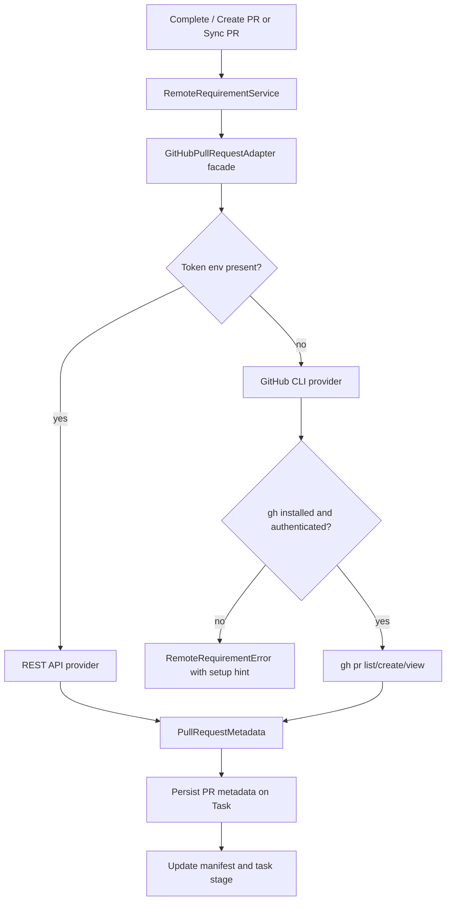

# PRD: GitHub CLI PR Fallback For Remote Requirements

**Original Need:** 远程需求分支已经可以用本地 Git 凭据 push，但自动创建/同步 GitHub PR 仍要求 `KODA_GITHUB_TOKEN`、`GITHUB_TOKEN` 或 `GH_TOKEN`。希望本地开发时直接复用已登录的 `gh` CLI。
**AI-Normalized Name:** Use GitHub CLI as the local fallback for remote requirement PR creation and status sync.
**Date:** 2026-04-28
**Status:** Ready To Implement

## 1. Introduction & Goals

当前远程需求协作已经把需求 manifest 写入 `.koda/requirements/<task_id>.json`，并通过本地 `git push` 推送到任务分支。这个部分可以直接复用用户本机的 SSH key、credential helper 或其他 Git 凭据。

缺口在 PR handoff：`backend/dsl/remote_requirements/infrastructure/github_pull_request_adapter.py` 当前只通过 GitHub REST API 创建、查询 PR，并且必须读取 `KODA_GITHUB_TOKEN`、`GITHUB_TOKEN` 或 `GH_TOKEN`。这对部署环境合理，但本地使用不够顺滑。很多开发者已经执行过 `gh auth login`，Koda 应该在没有 token 时复用这个登录态完成 `Complete / Create PR` 和 `Sync PR`。

Goals:

- 保持部署环境的 token-first 行为不变。
- 没有 token 时，自动 fallback 到本机 `gh` CLI。
- `Complete / Create PR` 在 `gh` 已登录时仍能创建或复用 PR。
- `Sync PR` 和项目 `Sync Remote` 查询 PR 状态时也能使用 `gh` fallback。
- 分支推送继续走现有 `git push`，不把 Git 分支同步改成 `gh`。
- 错误提示明确区分：未配置 token、未安装 `gh`、`gh` 未登录、GitHub API/CLI 调用失败。

## 2. Requirement Shape

- **Actor:** 本地使用 Koda 管理远程需求分支的开发者。
- **Trigger:** 项目启用 `GitHub-backed requirement branches` 和 `Create PR on Complete` 后，用户点击 `Complete / Create PR`、`Sync PR`，或项目同步读取带 PR metadata 的远程 manifest。
- **Expected Behavior:** 如果服务环境有 GitHub token，沿用 REST API；如果没有 token，则检查 `gh` 是否可执行且已登录，然后用 `gh pr list/create/view` 完成 PR 创建、复用和状态同步。两种 provider 都返回同一个 `PullRequestMetadata`，上层 `RemoteRequirementService` 的状态流不分叉。
- **Explicit Scope Boundary:** 本需求只增加 GitHub PR provider fallback，不改变远程需求分支创建、manifest 格式、worktree 创建、`Push Progress`、rebase、Git push、PR merge 策略或任务状态机。

## 3. Repository Context And Architecture Fit

Current relevant modules/files:

- `backend/dsl/remote_requirements/service.py`
  - `RemoteRequirementService.complete_as_pull_request(...)` 先写 manifest、commit、rebase、push task branch，再调用 `_github_adapter.create_or_get_pull_request(...)`。
  - `RemoteRequirementService.sync_pull_request_status(...)` 调用 `_github_adapter.get_pull_request(...)`，merge 后把任务推进到 `done / CLOSED`。
  - `RemoteRequirementService.sync_project_remote_requirements(...)` 在远程 manifest 带 `github_pr_number` 时查询 PR 状态。
- `backend/dsl/remote_requirements/infrastructure/github_pull_request_adapter.py`
  - 当前 `GitHubPullRequestAdapter` 直接读取 token，并用 `httpx` 调 GitHub REST API。
  - 缺 token 时 `_build_headers()` 抛出 `RemoteRequirementError`，导致 PR 创建/查询失败。
- `backend/dsl/remote_requirements/infrastructure/git_remote_requirement_repository.py`
  - 已经用 `subprocess.run([...], text=True, encoding="utf-8", errors="replace")` 封装低层 Git 命令，是 CLI adapter 可以遵循的本地命令模式。
- `backend/dsl/remote_requirements/domain.py`
  - `PullRequestMetadata` 是 REST 与 CLI 都应输出的统一领域对象。
- `backend/dsl/api/tasks.py`
  - `/tasks/{task_id}/complete`、`/tasks/{task_id}/sync-pr-status` 只关心 service 返回的 task，不应感知 REST 或 CLI provider。
- `backend/dsl/schemas/project_schema.py` and `backend/dsl/models/project.py`
  - 已有 `github_repository_full_name`、`github_pr_creation_enabled`；不需要新增 provider 配置字段。
- `frontend/src/App.tsx`
  - UI 已有 `Complete / Create PR`、`Sync PR` 和远程分支信息展示；本需求不需要新增控件。
- Tests:
  - `tests/test_remote_requirements_service.py`
  - `tests/test_remote_requirements_api.py`
  - `frontend/tests/api_client.test.ts`

Existing path:

- 保留 `RemoteRequirementService` 对 `_github_adapter` 的依赖。
- 保留 `GitHubPullRequestAdapter` 作为 service 层可注入的适配器入口。
- 在 infrastructure adapter 内部做 provider 选择：token 存在走 REST；token 缺失走 `gh` CLI。

Reuse candidates:

- 复用 `PullRequestMetadata`，避免为 CLI 新增响应模型。
- 复用 `RemoteRequirementError`，保持 API 错误处理路径不变。
- 复用现有 project 的 `github_repository_full_name` 作为 `gh --repo owner/repo` 参数。
- 复用现有 `complete_as_pull_request(...)` 的 create-or-get 语义。

Architecture constraints:

- route handler 不应直接执行 `gh`。
- service 层不应关心 PR provider 是 REST 还是 CLI。
- CLI 调用必须使用参数列表，不使用 `shell=True`。
- CLI 输出读取必须使用 UTF-8 语义，并能解析 JSON。
- 不新增 DB 字段；provider 选择是运行时能力，不是 task/project 状态。
- 不自动把 `gh pr create` 用作分支 push 工具；任务分支已经由 `GitRemoteRequirementRepository.push_branch(...)` 明确 push。

Potential redundancy risks:

- 不新增第二套 PR completion service；只替换 adapter 内部 provider 策略。
- 不新增前端选项让用户选择 REST 或 `gh`；默认 `auto` 能覆盖本地和部署两类场景。
- 不把 GitHub CLI 逻辑散落到 `service.py`；否则 REST/CLI 错误处理和 metadata 映射会重复。

## 4. Recommendation

### Recommended Approach

把 `GitHubPullRequestAdapter` 改造成一个 provider facade：

1. 初始化时仍读取 `KODA_GITHUB_TOKEN`、`GITHUB_TOKEN`、`GH_TOKEN`。
2. token 存在时使用现有 REST API 路径。
3. token 不存在时使用同文件内的 GitHub CLI provider。
4. CLI provider 在第一次调用前检查：
   - `shutil.which("gh")` 能找到可执行文件。
   - `gh auth status --active` 返回成功。
5. `find_pull_request(...)` 的 CLI 实现使用：
   - `gh pr list --repo <owner/repo> --head <branch> --base <base> --state all --limit 1 --json number,url,state,mergedAt`
6. `create_pull_request(...)` 的 CLI 实现使用：
   - `gh pr create --repo <owner/repo> --head <branch> --base <base> --title <title> --body <body>`
   - 解析 stdout 中返回的 PR URL，再调用 `gh pr view <url> --repo <owner/repo> --json number,url,state,mergedAt` 归一化 metadata。
7. `get_pull_request(...)` 的 CLI 实现使用：
   - `gh pr view <number> --repo <owner/repo> --json number,url,state,mergedAt`
8. REST 与 CLI 都映射成 `PullRequestMetadata(number, url, state, merged)`。

This is the best fit because `RemoteRequirementService` already owns PR lifecycle orchestration, while `GitHubPullRequestAdapter` already owns provider calls. Adding CLI fallback inside the adapter keeps the system layered: API/routes call service, service calls infrastructure adapter, infrastructure adapter handles external command/API details.

Rationale for rejecting redundant abstractions:

- No new project setting: local vs deployment provider can be inferred from available credentials.
- No new service: PR provider selection is infrastructure detail, not a use case.
- No new dependency: `gh` is an optional executable, not a Python package dependency.
- No frontend change: current labels and success/error messages are still valid.

### Alternatives Considered

| Alternative | Why Not Recommended |
| --- | --- |
| Replace REST API with `gh` entirely | Breaks server/Dokploy/CI deployments where token-based REST is the expected non-interactive path. |
| Add a frontend toggle: REST vs `gh` | Leaks infrastructure detail into UI and adds persistent config with little value. |
| Use `gh api` instead of `gh pr` commands | Recreates REST request details through another command layer; `gh pr` already exposes the required PR workflow commands. |
| Shell out from `RemoteRequirementService` directly | Violates the existing boundary where infrastructure adapters own external integrations. |

## 5. Implementation Guide

### Core Logic

Provider selection:

```text
GitHubPullRequestAdapter method called
  -> token available?
      -> yes: call existing REST implementation
      -> no: call GitHub CLI implementation
          -> gh binary missing: raise RemoteRequirementError with setup hint
          -> gh auth invalid: raise RemoteRequirementError with "run gh auth login"
          -> command fails: raise RemoteRequirementError with stderr/stdout summary
```

Metadata mapping:

- REST payload:
  - `number` -> `PullRequestMetadata.number`
  - `html_url` -> `PullRequestMetadata.url`
  - `state` -> lowercase state
  - `merged` true -> state `merged`, `merged=True`
- CLI JSON:
  - `number` -> `PullRequestMetadata.number`
  - `url` -> `PullRequestMetadata.url`
  - `state` -> lowercase state
  - `mergedAt` non-empty -> state `merged`, `merged=True`

CLI command rules:

- Always pass arguments as a list.
- Do not use shell interpolation.
- Use `capture_output=True`, `text=True`, `encoding="utf-8"`, `errors="replace"`.
- Keep command timeout finite, e.g. 30 seconds.
- For create, pass `--title` and `--body` to avoid interactive prompts.
- For create, pass `--head` because the task branch has already been pushed by Git.
- For list/view, request JSON and parse with `json.loads`.

Fallback rules:

- Token present means REST is authoritative. Do not silently fallback to `gh` on REST 401/403/404/5xx, because that would hide bad deployment configuration.
- Token absent means CLI is authoritative. If CLI is unavailable, return a clear `RemoteRequirementError`.
- This fallback supports same-repository task branches. Cross-fork PR creation is out of scope because Koda creates task branches in the configured project remote.

### Affected Files

| Area | Change | Files |
| --- | --- | --- |
| PR provider adapter | Add CLI provider and token-first facade behavior | `backend/dsl/remote_requirements/infrastructure/github_pull_request_adapter.py` |
| Domain tests | Verify CLI JSON maps into `PullRequestMetadata` | `tests/test_remote_requirements_service.py` or new `tests/test_github_pull_request_adapter.py` |
| API/service tests | Verify no-token path can complete PR handoff when fake CLI provider succeeds | `tests/test_remote_requirements_service.py`, `tests/test_remote_requirements_api.py` |
| Docs | Explain token-first plus `gh auth login` fallback | `docs/guides/dsl-development.md`, `docs/guides/codex-cli-automation.md`, `docs/architecture/system-design.md`, `docs/dev/evaluation.md` |
| Frontend | No functional UI change expected; optional copy update only if current error text is too token-specific | `frontend/src/App.tsx` |

### Change Matrix

| Current Behavior | Target Behavior | Implementation Notes | Validation |
| --- | --- | --- | --- |
| No GitHub token means PR adapter fails before PR create/view | No token triggers `gh` CLI fallback | Provider selection inside `GitHubPullRequestAdapter` | Unit test with env vars absent and mocked `gh` commands |
| REST API creates PR via `httpx.post` | REST remains first choice when token exists | Preserve current request payload and error handling | Existing tests still pass |
| There is no local auth check | CLI fallback checks `gh auth status --active` before PR commands | Use `shutil.which("gh")`; run `gh auth status --active` | Unit tests for missing binary and auth failure |
| Existing PR lookup uses REST list endpoint with head/base filters | CLI fallback uses `gh pr list --head --base --state all --json ...` | `--head` receives branch only, not `owner:branch` | Unit test parses empty list and one-item list |
| PR creation returns REST JSON directly | CLI creation returns URL, then `gh pr view` normalizes metadata | Avoid brittle URL-only metadata | Unit test covers stdout URL and follow-up view JSON |
| PR status sync uses REST `GET /pulls/{number}` | CLI fallback uses `gh pr view <number> --json ...` | `mergedAt` determines merged bool | Unit test maps merged PR to state `merged` |
| Error says only token is required | Error says token or authenticated `gh` is required | Raise actionable `RemoteRequirementError` | API test asserts useful detail |

### Flow Diagram



### External Validation

Checked official GitHub CLI manual pages on 2026-04-28:

- `gh pr create` supports non-interactive title/body/base/head/repo arguments and prints the PR URL on success: https://cli.github.com/manual/gh_pr_create
- `gh pr list` supports `--head`, `--base`, `--state`, `--repo`, and `--json`, which is enough to find an existing PR for a task branch: https://cli.github.com/manual/gh_pr_list
- `gh pr view` supports viewing by number, URL, or branch, plus `--json` fields including `number`, `url`, `state`, and `mergedAt`: https://cli.github.com/manual/gh_pr_view
- `gh auth status` checks the active account/authentication state and exits non-zero on auth issues in normal text mode: https://cli.github.com/manual/gh_auth_status

## 6. Definition Of Done

- Local remote-backed task completion can create/reuse a PR with no GitHub token when `gh auth status --active` succeeds.
- Token-based REST behavior remains unchanged when any supported token env var is present.
- `Sync PR` correctly marks merged PRs as `done / CLOSED` through both REST and CLI providers.
- Errors are actionable for missing token plus missing/unauthenticated `gh`.
- Tests cover REST preservation, CLI success, CLI auth failure, CLI missing executable, existing PR lookup, PR creation, and merged status mapping.
- Documentation explains the two supported local/deployed credential paths.
- `just docs-build` passes before handoff or commit.

### Implementation Results

Implemented on 2026-04-28:

- `GitHubPullRequestAdapter` now selects REST when a supported token env var exists, and otherwise falls back to authenticated local `gh`.
- CLI fallback covers PR lookup, non-interactive PR creation, created-PR metadata normalization, PR status lookup, missing executable errors, auth failures, invalid JSON, and merged-state mapping from `mergedAt`.
- `RemoteRequirementService`, task routes, project routes, manifest schema, frontend API, and frontend UI were intentionally left unchanged.
- Documentation was synchronized in `docs/guides/dsl-development.md`, `docs/guides/codex-cli-automation.md`, `docs/architecture/system-design.md`, and `docs/dev/evaluation.md`.

Validation evidence:

- `uv run pytest tests/test_github_pull_request_adapter.py -q` -> `7 passed`
- `uv run pytest tests/test_github_pull_request_adapter.py tests/test_remote_requirements_service.py tests/test_remote_requirements_api.py -q` -> `27 passed`
- `uv run ruff format backend/dsl/remote_requirements/infrastructure/github_pull_request_adapter.py tests/test_github_pull_request_adapter.py` -> unchanged
- `uv run ruff check backend/dsl/remote_requirements/infrastructure/github_pull_request_adapter.py tests/test_github_pull_request_adapter.py` -> passed
- `just docs-build` -> passed

## 7. Acceptance Checklist

### Architecture Acceptance

- [x] `RemoteRequirementService` still depends on a single `_github_adapter` interface and does not shell out directly.
- [x] `backend/dsl/remote_requirements/infrastructure/github_pull_request_adapter.py` owns both REST and CLI provider details.
- [x] No ORM model, Pydantic response schema, or frontend state is added solely to store provider choice.
- [x] `PullRequestMetadata` remains the single metadata object returned to service logic.

### Behavior Acceptance

- [x] With `KODA_GITHUB_TOKEN` set, `complete_as_pull_request(...)` uses REST and does not run `gh`.
- [x] With no token and authenticated `gh`, `complete_as_pull_request(...)` creates or reuses a PR and stores `github_pr_url`, `github_pr_number`, and `github_pr_state`.
- [x] With no token and authenticated `gh`, `sync_pull_request_status(...)` reads PR status and closes the task when `mergedAt` is present.
- [x] With no token and no `gh` executable, the API returns a clear setup message instead of saying only token is required.
- [x] With no token and failed `gh auth status --active`, the API tells the user to run `gh auth login`.
- [x] `Push Progress` remains unchanged and does not require token or `gh`.

### Dependency Acceptance

- [x] No new Python dependency is added to `pyproject.toml`.
- [x] CLI subprocess calls pass argument lists and never use `shell=True`.
- [x] CLI subprocess output is decoded as UTF-8 with replacement for invalid bytes.
- [x] CLI calls have a finite timeout.

### Documentation Acceptance

- [x] `docs/guides/dsl-development.md` documents token-first behavior and local `gh auth login` fallback.
- [x] `docs/guides/codex-cli-automation.md` explains that Git push uses local Git credentials while PR operations use token or `gh`.
- [x] `docs/architecture/system-design.md` mentions REST/CLI provider selection as an infrastructure adapter detail.
- [x] `docs/dev/evaluation.md` includes a manual test for no-token plus authenticated `gh`.

### Validation Acceptance

- [x] Backend tests cover REST path when token exists.
- [x] Backend tests cover CLI path when no token exists.
- [x] Backend tests cover missing `gh` and unauthenticated `gh`.
- [x] Backend tests cover `gh pr list` existing PR reuse.
- [x] Backend tests cover `gh pr create` followed by `gh pr view` metadata normalization.
- [x] Backend tests cover merged PR mapping from `mergedAt`.
- [x] `uv run pytest tests/test_remote_requirements_service.py tests/test_remote_requirements_api.py` passes, or the equivalent focused test set is updated and run.
- [x] `just docs-build` passes.

## 8. User Stories

1. As a local developer, I can enable remote requirement PR handoff without exporting a GitHub token, as long as my machine already has authenticated `gh`.
2. As a deployer, I can keep using `KODA_GITHUB_TOKEN` and get the same REST behavior as before.
3. As a reviewer, I can trust that `Complete / Create PR` still creates one PR per task branch and does not create duplicates.
4. As a user syncing PR status, I can click `Sync PR` and get the same task closure behavior regardless of whether Koda used REST or `gh`.

## 9. Functional Requirements

- **FR-1:** `GitHubPullRequestAdapter` must select REST when `KODA_GITHUB_TOKEN`, `GITHUB_TOKEN`, or `GH_TOKEN` is present.
- **FR-2:** `GitHubPullRequestAdapter` must select `gh` CLI when no supported token env var is present.
- **FR-3:** CLI fallback must validate that `gh` is installed before running PR commands.
- **FR-4:** CLI fallback must validate that `gh auth status --active` succeeds before running PR commands.
- **FR-5:** CLI fallback must implement existing PR lookup by repository, task branch, and base branch.
- **FR-6:** CLI fallback must implement non-interactive PR creation with explicit title, body, head branch, base branch, and repository.
- **FR-7:** CLI fallback must implement PR status lookup by PR number.
- **FR-8:** REST and CLI providers must both return `PullRequestMetadata`.
- **FR-9:** PR merge detection through CLI must treat non-empty `mergedAt` as merged.
- **FR-10:** REST failures must not silently fallback to CLI when token is configured.
- **FR-11:** `Push Progress` must remain token-independent and CLI-independent.
- **FR-12:** Error messages must name both supported authentication paths: token env vars or authenticated `gh`.

## 10. Non-Goals

- Do not replace Git push with `gh`.
- Do not support fork-based PR creation in this change.
- Do not add a frontend provider selector.
- Do not add a database field for PR provider choice.
- Do not add automatic remote branch deletion after PR merge.
- Do not change manifest schema version.
- Do not change GitHub Enterprise support beyond what the current `owner/repo` project configuration already supports.

## 11. Risks And Follow-Ups

- If a user has multiple GitHub accounts in `gh`, Koda will use the active account selected by `gh`; the error/help text should point to `gh auth status --active` and `gh auth switch`.
- `gh pr list --head` does not accept `owner:branch` syntax. This is acceptable because Koda-created task branches are same-repository branches in the configured remote.
- If later GitHub Enterprise support is needed, repository full name and hostname handling should be revisited as a separate requirement.

## 12. Decision Log

| Decision | Rationale |
| --- | --- |
| Token remains first priority | Keeps deployment and CI behavior stable. |
| CLI fallback only when no token exists | Avoids masking broken token configuration with an unexpected local account. |
| Provider choice stays inside `GitHubPullRequestAdapter` | Preserves service-layer orchestration and route simplicity. |
| No frontend setting | The user intent is capability fallback, not a business preference. |
| No new dependency | `gh` is optional local tooling; Python should keep using stdlib subprocess for this integration. |
| Keep Git push separate from `gh` | Existing remote branch sync already works with local Git credentials and has conflict checks. |
