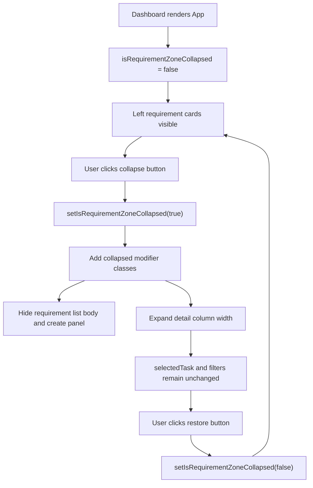

# PRD：左侧需求卡片区可折叠

**原始需求标题**：Make the left requirement card zone collapsible.
**需求名称（AI 归纳）**：左侧需求卡片区可折叠
**需求背景/上下文**：Make the left requirement card zone collapsible.
**创建时间**：2026-04-28 19:42:39 Asia/Shanghai
**状态**：Implemented，采用推荐交互决策
**输出文件**：`tasks/20260428-194239-prd-left-requirement-card-zone-collapsible.md`
**附件观察**：原始上下文未包含 `Attached local files:` 段落，因此没有本地图片、附件或视频需要解析。
**参考上下文**：`frontend/src/App.tsx`, `frontend/src/index.css`, `frontend/package.json`, `frontend/tests/`, `docs/dev/evaluation.md`

---

## 0. 待确认问题（结构化）

```json
{
  "pending_questions": [
    {
      "id": "collapsed_presentation",
      "title": "左侧需求卡片区折叠后应保留哪种可见入口？",
      "required": true,
      "recommended_option_key": "narrow_restore_rail",
      "recommendation_reason": "当前桌面布局由 `frontend/src/index.css` 的两列 grid 和 sticky 左列承载。折叠为窄栏可以让详情区获得主要宽度，同时保留恢复入口、需求数量和创建入口，不会让用户在折叠后失去导航上下文。",
      "options": [
        {
          "key": "narrow_restore_rail",
          "label": "折叠为窄栏，保留恢复按钮和数量"
        },
        {
          "key": "hide_completely",
          "label": "完全隐藏左侧区域，只在详情区顶部提供恢复按钮"
        },
        {
          "key": "compact_list",
          "label": "折叠为紧凑列表，只显示状态和标题"
        }
      ]
    },
    {
      "id": "collapse_state_persistence",
      "title": "折叠状态是否需要跨页面刷新持久保留？",
      "required": false,
      "recommended_option_key": "session_only",
      "recommendation_reason": "仓库当前没有面向此类布局偏好的本地设置层。推荐先使用组件内状态，避免引入 localStorage 键、迁移或设置同步语义；用户刷新后回到默认展开，最符合最小改动路径。",
      "options": [
        {
          "key": "session_only",
          "label": "仅当前页面会话生效，刷新后默认展开"
        },
        {
          "key": "local_storage",
          "label": "用浏览器 localStorage 记住折叠状态"
        },
        {
          "key": "project_scoped_storage",
          "label": "按项目筛选维度分别记住折叠状态"
        }
      ]
    }
  ]
}
```

## Implementation Result（2026-04-28）

本次实现采用第 0 节推荐选项：

- `collapsed_presentation`: `narrow_restore_rail`
- `collapse_state_persistence`: `session_only`
- 后端 API、数据库模型、任务生命周期和 card metadata 语义均未改变

实际交付：

- `frontend/src/App.tsx`
  - 新增 `isRequirementZoneCollapsed` 会话内 UI 状态。
  - 在左侧需求区标题 actions 中新增真实 `<button type="button">` 折叠/恢复控件，包含 `aria-controls`、`aria-expanded`、状态化 `aria-label` 和 `title`。
  - 通过 `devflow-layout--requirements-collapsed`、`devflow-column--requirements-collapsed` modifier class 切换布局。
  - 用 `hidden={isRequirementZoneCollapsed}` 包裹左侧筛选、创建面板和需求卡片主体，保留 React state，同时让隐藏交互不留在键盘焦点路径中。
  - 折叠状态显示窄栏恢复区域，包含 Requirements 标识、当前可见卡片数量和当前 workspace 名称；创建按钮在折叠窄栏中仍可见，点击会恢复左侧区域并打开创建面板。
- `frontend/src/index.css`
  - 新增桌面端窄栏 grid、sticky 左列窄栏样式、toggle icon 旋转、restore rail、隐藏主体和移动端单列兼容规则。
- `frontend/tests/requirement_zone_collapse.test.ts`
  - 新增 App-level JSDOM 回归测试，覆盖折叠/恢复 class、`aria-expanded`、`hidden` 主体、详情任务保持、创建面板草稿保持，以及折叠/恢复不触发额外 fetch。
- `docs/dev/evaluation.md`
  - 补充桌面与移动端手工验证步骤。

验证记录：

- `cd frontend && npm run test` -> passed
- `cd frontend && npm run build` -> passed（Vite 输出现有 chunk size warning）
- `just docs-build` -> passed（MkDocs Material 输出上游 MkDocs 2.0 提醒）

偏差与说明：

- 未新增 localStorage 或 project-scoped persistence；刷新后仍默认展开。
- 未新增后端接口、schema、数据库字段或服务层逻辑。
- 未新增独立 sidebar 组件，保持在现有 `App.tsx` 布局内做最小改动。
- 自动化测试覆盖 DOM/状态/API 请求边界；桌面与移动端视觉细节仍应按 `docs/dev/evaluation.md` 手工走查。

## 1. Introduction & Goals

当前 Koda Dashboard 的主工作区由左侧需求卡片列表和右侧需求详情组成。左侧区域在桌面端是 sticky 列，包含工作区标题、项目筛选、创建需求按钮、创建面板和需求卡片列表；右侧详情区占据更大空间。用户提出希望让左侧需求卡片区域可折叠，以便在查看 PRD、Timeline、日志、Q&A 或较长详情内容时释放横向空间。

本需求的目标是在不改变任务数据、任务筛选、卡片选择、创建需求、详情展示和后端 API 的前提下，为左侧需求卡片区增加明确的折叠/展开交互。推荐路径是最小前端改动：在 `frontend/src/App.tsx` 增加 UI 状态和 toggle 控件，在 `frontend/src/index.css` 调整 grid 与左列展示样式，并补充前端回归测试与手工验证文档。

Goals:

- 用户可以一键折叠左侧需求卡片区域，让右侧详情区获得更多横向空间。
- 用户可以一键恢复左侧需求卡片区域，恢复后筛选项、选中任务和创建面板草稿不丢失。
- 折叠动作只影响当前页面布局，不触发任务列表重新加载，不修改任务状态，不改变后端 API。
- 桌面端优先优化双栏布局；移动端保持单列可用，不出现文本重叠或不可恢复的隐藏状态。
- 折叠/展开控件可键盘操作，并通过 `aria-expanded` 等属性表达当前状态。

## 2. Requirement Shape

- **Actor:** 在 Koda Dashboard 中浏览和处理需求卡片的开发者。
- **Trigger:** 用户点击左侧需求卡片区标题栏附近的折叠/展开按钮。
- **Expected Behavior:** 页面切换左侧需求卡片区的展开状态。展开时保持当前卡片列表、筛选和创建入口；折叠时隐藏卡片列表主体并让右侧详情区扩展。再次点击恢复原布局，当前 `selectedTaskId`、项目筛选、工作区 tab、创建草稿和任务详情上下文保持不变。
- **Explicit Scope Boundary:** 本需求只覆盖 Dashboard 主视图的左侧需求卡片区，不新增后端接口，不改变 `/api/tasks` 或 `/api/tasks/card-metadata` 行为，不改变任务生命周期、筛选业务规则、PRD 生成流程、Timeline、sidecar Q&A 或项目面板。

可实现声明：

> 当用户在 Dashboard 中查看需求详情时，可以通过一个可访问的 toggle 控件折叠左侧需求卡片列；系统仅更新前端布局状态，使详情列占据更多空间，并在用户恢复时保留原有列表状态和选中任务。

## 3. Repository Context And Architecture Fit

Current relevant modules/files:

- `frontend/src/App.tsx`
  - 主应用组件集中维护 Dashboard 状态，包括 `taskList`、`selectedTaskId`、`selectedTaskProjectFilterValue`、`workspaceView`、`isCreatePanelOpen` 等。
  - 当前双栏布局在 JSX 中由 `<div className="devflow-layout">` 包裹两个 `<section>` 完成。
  - 左侧区域是 `section.devflow-column.devflow-column--requirements`，内部包含 `devflow-section-heading`、项目筛选、创建按钮、创建面板和 `devflow-requirement-list`。
  - 需求卡片由 `RequirementCardButton` 组件渲染，点击后通过 `setSelectedTaskId` 选择任务。
  - 已有 `ChevronRightIcon`、`PlusIcon`、`ActionButton`、`joinClassNames` 等本地 UI building blocks，可直接复用。
- `frontend/src/index.css`
  - `.devflow-layout` 使用 `grid-template-columns: minmax(220px, 0.6fr) minmax(0, 1.7fr)` 实现左窄右宽。
  - 桌面端 `@media (min-width: 1101px)` 中左列和右列都使用 sticky 与 viewport 高度约束。
  - `.devflow-requirement-list` 已有滚动容器样式，折叠时应避免保留可聚焦的隐藏卡片。
  - `@media (max-width: 1100px)` 已将布局降为单列，移动端折叠行为需要单独约束。
- `frontend/tests/`
  - 项目已有轻量 Node/JSDOM 前端测试，`frontend/scripts/run_all_tests.mjs` 会自动执行 `frontend/tests/*.test.ts`。
  - `frontend/tests/app_task_mutation_refresh.test.ts` 已具备编译并渲染 `App.tsx` 的测试模式，可复用或新增相邻测试文件验证折叠 DOM 状态。
- `docs/dev/evaluation.md`
  - 当前用于记录人工评测流程。UI 交互变更应补充手工验证步骤。
- `mkdocs.yml`
  - 本 PRD 写入 `tasks/`，不需要更新 MkDocs nav；若后续新增 docs 页面才需要更新。

Existing path:

```text
App state
  -> workspace/filter/task metadata derive requirementViewModelList
  -> devflow-layout two-column grid
  -> left requirements section renders cards
  -> selectedTask drives right detail section
```

Reuse candidates:

- 复用 `App.tsx` 的本地 `useState` 管理 `isRequirementZoneCollapsed`。
- 复用现有 `devflow-section-heading__actions` 放置折叠按钮，避免新增工具栏层级。
- 复用 `ChevronRightIcon` 表达展开/收起方向，补充 CSS rotation。
- 复用 `.devflow-layout` 的 grid，通过 modifier class 改变列宽，不新增 layout component。
- 复用 `frontend/tests/app_task_mutation_refresh.test.ts` 的 App 渲染 harness 或新增同模式测试。

Architecture constraints:

- 这是纯前端布局状态，不能写入 `Task`、`Project` 或后端数据库。
- 不应把折叠状态与 `workspaceView`、`selectedTaskId`、项目筛选或任务列表请求耦合。
- 折叠状态不应触发 `loadDashboardData(...)` 或 `refreshTaskCardMetadata(...)`。
- 隐藏区域内的交互元素不能在折叠后继续被键盘 tab 聚焦。
- 移动端已有单列布局，不能让折叠后用户失去恢复入口。
- Python 文件不涉及本需求；若后续写 Python I/O，仍须遵守 `encoding="utf-8"` 规则。

Potential redundancy risks:

- 不新增全局 layout preference service；当前只有单个布局偏好，组件内状态足够。
- 不新增后端 API 或数据库字段保存折叠状态；这会把 UI 偏好误提升为业务状态。
- 不拆出大型 `RequirementSidebar` 重构作为本需求前置条件；当前改动可在既有 JSX 结构内完成。
- 不为折叠行为新增卡片数据模型；折叠是展示层，不改变 `RequirementViewModel`。

## 4. Recommendation

### Recommended Approach

推荐采用“窄栏可恢复 + 会话内状态”的最小改动方案，待第 0 节确认后实现。

具体方案：

1. 在 `App.tsx` 添加 `isRequirementZoneCollapsed` 状态。
2. 在左侧 `devflow-section-heading__actions` 增加折叠/展开 icon button。
   - 使用 `aria-expanded={!isRequirementZoneCollapsed}`。
   - 使用 `aria-controls` 指向左侧内容容器。
   - 展开态 label 类似 `Collapse requirements list`，折叠态 label 类似 `Expand requirements list`。
3. 给主布局和左列添加 modifier class。
   - `devflow-layout--requirements-collapsed`
   - `devflow-column--requirements-collapsed`
4. 折叠时隐藏左侧主体内容，只保留窄栏恢复入口、当前工作区名称或图标、可选的需求数量和创建入口。
5. 右侧详情列在桌面端扩展为主要宽度，继续沿用现有 sticky 和滚动规则。
6. 移动端不使用窄 grid；折叠后只隐藏需求列表主体，并在顶部保留恢复按钮，避免单列页面无法恢复。
7. 不引入持久化，刷新页面后默认展开；如用户确认需要持久化，再用独立任务补 localStorage 语义和测试。

Why this is the best fit:

- 现有需求卡片区和详情区已经由单一 grid 控制，modifier class 能以最小 CSS 改动完成布局切换。
- `App.tsx` 已集中拥有筛选、创建面板和选中任务状态，折叠状态放在同一组件内最直接。
- 折叠不需要后端参与，也不需要新 API、schema、模型或服务层。
- 保留左侧窄栏比完全隐藏更安全：用户始终能看到恢复入口，不会在详情区中迷路。
- 会话内状态避免为一个未确认的 UI 偏好创建长期存储合同。

Rationale for rejecting redundant abstractions:

- 新建 layout preference service 会引入设置读取、写入、默认值和迁移语义，本需求没有证明需要。
- 新建 `RequirementSidebar` 大组件能改善长期可维护性，但会扩大回归面；当前需求只需在现有左列周围增加一层状态和 CSS class。
- 完全隐藏左侧区域虽然空间最大，但需要在右侧详情区新增恢复入口，且更容易造成恢复入口不一致。

### Alternatives Considered

| Alternative | Why Not Recommended |
| --- | --- |
| 完全隐藏左侧区域 | 释放空间最多，但恢复入口必须移动到详情区，容易破坏当前左/右职责边界；折叠后用户也看不到当前列表上下文。 |
| 折叠为紧凑卡片列表 | 信息密度较好，但仍占用明显宽度，并且需要重新设计 `RequirementCardButton` 的紧凑形态，范围超过“可折叠”。 |
| 使用 localStorage 持久记住状态 | 用户体验可能更贴心，但会新增存储 key、默认值、跨版本兼容和测试；建议在确认需要后再做。 |
| 拆分独立 `RequirementSidebar` 组件 | 长期可维护性更好，但当前 `App.tsx` 状态耦合较多，立即拆分会让简单布局需求变成重构任务。 |

## 5. Implementation Guide

### Core Logic



Recommended DOM shape:

```tsx
<div
  className={joinClassNames(
    "devflow-layout",
    isRequirementZoneCollapsed && "devflow-layout--requirements-collapsed",
  )}
>
  <section
    className={joinClassNames(
      "devflow-column devflow-column--requirements",
      isRequirementZoneCollapsed && "devflow-column--requirements-collapsed",
    )}
  >
    <div className="devflow-section-heading">
      ...
      <button
        type="button"
        className="devflow-requirements-collapse-toggle"
        aria-controls={requirementZoneBodyId}
        aria-expanded={!isRequirementZoneCollapsed}
        aria-label={
          isRequirementZoneCollapsed
            ? "Expand requirements list"
            : "Collapse requirements list"
        }
      >
        <ChevronRightIcon ... />
      </button>
    </div>

    <div
      id={requirementZoneBodyId}
      className="devflow-requirements-zone__body"
      hidden={isRequirementZoneCollapsed}
    >
      {isCreatePanelOpen && canCreateRequirements ? ... : null}
      <div className="devflow-requirement-list">...</div>
    </div>
  </section>

  <section className="devflow-column devflow-column--detail">...</section>
</div>
```

### Affected Files

| Path | Expected Change |
| --- | --- |
| `frontend/src/App.tsx` | Add collapse state, accessible toggle button, layout modifier classes, and a hidden left-zone body wrapper. |
| `frontend/src/index.css` | Add collapsed desktop grid columns, narrow rail styles, toggle icon rotation, mobile behavior, and reduced-motion-safe transitions. |
| `frontend/tests/app_task_mutation_refresh.test.ts` or `frontend/tests/app_requirement_zone_collapse.test.ts` | Verify rendering, toggle behavior, detail persistence, and no API reload on collapse. |
| `docs/dev/evaluation.md` | Add manual QA steps for desktop and mobile collapse/restore behavior. |
| `tasks/20260428-194239-prd-left-requirement-card-zone-collapsible.md` | Store this PRD. |

### Change Matrix

| Change Target | Current State | Target State | How to Modify | Why This Fits Existing Architecture | Affected Files |
| --- | --- | --- | --- | --- | --- |
| Requirement zone state | No collapse state; left card zone always rendered in the two-column layout | A boolean UI state controls whether the requirement zone is expanded or collapsed | Add `isRequirementZoneCollapsed` with `useState(false)` inside `App` | State is local to the Dashboard layout and does not need backend persistence | `frontend/src/App.tsx` |
| Collapse/expand control | Left heading actions only include project filter and create button | Heading includes a keyboard-accessible icon button for collapse/restore | Add a button in `devflow-section-heading__actions` using `ChevronRightIcon`, `aria-expanded`, and `aria-controls` | Reuses existing heading action area and icon patterns | `frontend/src/App.tsx`, `frontend/src/index.css` |
| Desktop layout | Grid uses `minmax(220px, 0.6fr) minmax(0, 1.7fr)` | Collapsed layout uses a narrow left rail and lets detail consume remaining width | Add `.devflow-layout--requirements-collapsed` grid rule inside desktop media query | The current layout is already grid-based; modifier class is the smallest change | `frontend/src/index.css` |
| Hidden left content | Requirement list, create panel and filter controls remain visible | Collapsed state hides interactive list body while preserving React state | Wrap left body in a controlled container and apply `hidden` or equivalent non-focusable hiding | Prevents hidden cards and inputs from staying in tab order | `frontend/src/App.tsx`, `frontend/src/index.css` |
| Detail continuity | Right detail depends on `selectedTask` and selected logs | Collapse does not reset selected task, logs, PRD panel, Timeline or Q&A | Do not call task selection, filter, refresh or reset handlers from the toggle | Keeps layout behavior isolated from business state | `frontend/src/App.tsx` |
| Mobile behavior | At <=1100px layout becomes single column | Collapse hides list body but keeps a visible restore control; no narrow side rail | Add mobile-specific CSS that avoids fixed narrow grid and text overlap | Aligns with existing responsive breakpoint | `frontend/src/index.css` |
| Regression coverage | No test covers the left-zone collapse behavior | Frontend test asserts toggle class/state and selected detail persistence | Add or extend a JSDOM App test with mocked API responses and click interaction | Uses existing frontend test runner without introducing a new framework | `frontend/tests/` |
| Manual documentation | Evaluation checklist does not mention this interaction | Manual QA includes desktop/mobile collapse and restore checks | Update `docs/dev/evaluation.md` with focused steps | Docs remain synchronized with user-visible UI behavior | `docs/dev/evaluation.md` |

### Low-Fidelity Prototype

Recommended expanded state:

```text
+--------------------------------------------------------------------------------+
| Header / workspace tabs / global actions                                       |
+-------------------------------+------------------------------------------------+
| Requirements      [filter] [+] [<] | Selected requirement detail                |
| 当前聚焦：全部项目             | Title, status, PRD, timeline, Q&A, actions     |
|                               |                                                |
| [card: task A]                |                                                |
| [card: task B selected]       |                                                |
| [card: task C]                |                                                |
+-------------------------------+------------------------------------------------+
```

Recommended collapsed state:

```text
+--------------------------------------------------------------------------------+
| Header / workspace tabs / global actions                                       |
+------+-------------------------------------------------------------------------+
| [>]  | Selected requirement detail                                             |
| 24   | Title, status, PRD, timeline, Q&A, actions                              |
| [+]  | More horizontal room for document/log content                           |
+------+-------------------------------------------------------------------------+
```

Mobile collapsed state:

```text
+--------------------------------------+
| Requirements  [>]  24                |
+--------------------------------------+
| Selected requirement detail          |
| PRD / timeline / Q&A                 |
+--------------------------------------+
```

### ER Diagram

No ER diagram is required. This requirement introduces no data model, database table, migration, or persistent backend state.

### Interactive Prototype Change Log

No interactive prototype file is required for the first implementation. The low-fidelity prototype above is sufficient to resolve the recommended UI shape. If the collapsed visual treatment remains disputed after confirmation, create a targeted static or interactive prototype under `docs/prototypes/` in a separate task.

### External Validation

No external web research was used. The recommendation is based on repository structure, existing React/CSS patterns, and local frontend test conventions.

## 6. Definition Of Done

- Left requirement card zone can be collapsed and restored from the Dashboard UI.
- Collapsing the zone does not reload tasks, change selected task, reset project filter, clear create/edit drafts, or alter task workflow state.
- Desktop layout gives the detail area more horizontal space when collapsed.
- Mobile layout remains usable and always provides a visible restore control.
- Hidden requirement cards and inputs are not keyboard-focusable while collapsed.
- Frontend tests cover the toggle behavior and selected-detail continuity.
- `docs/dev/evaluation.md` includes manual verification steps.
- `cd frontend && npm run test`, `cd frontend && npm run build`, and `just docs-build` pass before implementation handoff.

## 7. Acceptance Checklist

### Architecture Acceptance

- [ ] `frontend/src/App.tsx` implements collapse as local UI state, not as task/project data.
- [ ] No backend API, SQLAlchemy model, Pydantic schema, migration, or service-layer change is introduced for this layout preference.
- [ ] The toggle handler does not call `loadDashboardData(...)`, `refreshTaskCardMetadata(...)`, task mutation APIs, or selection reset helpers.
- [ ] Existing `RequirementCardButton` behavior is unchanged when the zone is expanded.

### Dependency Acceptance

- [ ] No new frontend dependency is added for the collapse interaction.
- [ ] Existing local icon/button patterns are reused; if a new icon is necessary, it follows the current `SVGProps<SVGSVGElement>` pattern in `App.tsx`.
- [ ] No persistent storage dependency or localStorage helper is added unless Section 0 is explicitly answered with a persistence option.

### Behavior Acceptance

- [ ] On desktop, the requirements zone starts expanded by default.
- [ ] Clicking the collapse button hides the requirement list body and expands the detail area.
- [ ] Clicking the restore button makes the project filter, create button, create panel state and requirement cards visible again.
- [ ] The selected task detail remains the same before and after collapse.
- [ ] Project filter selection and workspace view remain unchanged across collapse/restore.
- [ ] If the create requirement panel is open before collapse, its draft values are still present after restore.
- [ ] Empty, loading and populated list states all remain visually coherent when expanded.
- [ ] Mobile viewport keeps a visible restore affordance and does not produce overlapping heading/actions text.

### Accessibility Acceptance

- [ ] The toggle is a real `<button type="button">` and is reachable by keyboard.
- [ ] The toggle exposes `aria-expanded` and an accessible label that changes with state.
- [ ] The collapsed content is hidden from keyboard focus and assistive navigation.
- [ ] Visual focus states remain visible for the toggle.

### Documentation Acceptance

- [ ] `docs/dev/evaluation.md` includes manual QA steps for desktop collapse, restore, selected-task continuity, and mobile behavior.
- [ ] No `mkdocs.yml` nav update is required unless a new documentation page is added.
- [ ] This PRD remains in `tasks/20260428-194239-prd-left-requirement-card-zone-collapsible.md` with both `原始需求标题` and `需求名称（AI 归纳）`.

### Validation Acceptance

- [ ] `cd frontend && npm run test` passes.
- [ ] `cd frontend && npm run build` passes.
- [ ] `just docs-build` passes.
- [ ] Manual browser verification covers a desktop viewport wider than 1100px and a mobile viewport no wider than 720px.

## 8. User Stories

### US-001: Collapse the requirement list while reading details

As a developer reviewing a selected requirement, I want to collapse the left requirement card zone so that the PRD, timeline and logs have more horizontal space.

### US-002: Restore the requirement list without losing context

As a developer who collapsed the left zone, I want to restore it and continue from the same selected task and project filter so that I do not lose my browsing context.

### US-003: Keep creation and filtering state intact

As a developer drafting or filtering requirements, I want collapse/restore to preserve my current draft and filter choices so that layout control does not behave like navigation or reset.

### US-004: Use the collapse control accessibly

As a keyboard or assistive technology user, I want the collapse control to expose its state and remain operable without a mouse.

## 9. Functional Requirements

1. **FR-1:** The Dashboard must expose a visible toggle control for the left requirement card zone.
2. **FR-2:** The toggle control must switch between expanded and collapsed states without triggering backend requests.
3. **FR-3:** Expanded state must preserve the current left-zone contents: workspace heading, project filter, create action, create panel when open, empty/loading states and requirement cards.
4. **FR-4:** Collapsed desktop state must make the right detail column wider than it is in expanded state.
5. **FR-5:** Collapsed state must preserve `selectedTaskId`, `workspaceView`, `selectedTaskProjectFilterValue`, `committedTaskProjectFilterValue`, `isCreatePanelOpen` and current form drafts.
6. **FR-6:** The hidden left-zone body must not leave hidden card buttons, inputs or selects in keyboard tab order.
7. **FR-7:** The toggle must include stateful accessibility attributes, including `aria-expanded`.
8. **FR-8:** The mobile layout must keep the restore control visible and prevent heading/action overlap.
9. **FR-9:** The implementation must not add or modify backend routes, database models, schemas, task lifecycle rules or card metadata API semantics.
10. **FR-10:** The implementation must include automated frontend regression coverage or extend an existing App-level test to cover collapse/restore behavior.
11. **FR-11:** The documentation evaluation checklist must include manual verification of the new interaction.

## 10. Non-Goals

- Persisting the collapse state across refreshes unless explicitly confirmed in Section 0.
- Creating a full sidebar refactor or extracting all requirement-list logic into a new component.
- Adding drag-to-resize behavior between the list and detail panels.
- Adding a compact card rendering mode beyond the narrow restore rail.
- Changing task filtering, task sorting, task metadata fallback, card status labels or selected-task semantics.
- Changing backend task APIs, database schema, worktree behavior, PRD source selection or automation runner behavior.
- Adding a new interactive prototype file unless visual ambiguity remains after confirmation.

## 11. Risks And Follow-Ups

- `frontend/src/App.tsx` is large and stateful; even a small JSX layout change can accidentally disturb create-panel or selection behavior. Keep edits narrowly scoped and cover them with App-level tests.
- Hiding the left body incorrectly can leave controls focusable but invisible. Use `hidden`, `display: none`, or an equivalent accessibility-safe pattern rather than opacity-only hiding.
- The desktop sticky height rules are tuned for two visible columns. Collapsed CSS must preserve viewport-height behavior for the detail column.
- If users strongly prefer persistent layout memory, add localStorage in a follow-up after confirming key scope and default behavior.

## 12. Decision Log

| ID | Decision Question | Chosen | Rejected | Rationale |
| --- | --- | --- | --- | --- |
| D-01 | Where should collapse state live? | Local `App.tsx` UI state | Backend task/project state or new preference service | The behavior is a transient layout preference and does not affect business data. |
| D-02 | What implementation path should be recommended first? | Modifier classes on the existing `devflow-layout` and left column | New layout system or sidebar component extraction | The current grid already defines the two-column boundary, so class modifiers solve the request with the least churn. |
| D-03 | What collapsed presentation is recommended? | Narrow restore rail with count and restore affordance | Complete hiding or compact card list | A narrow rail preserves orientation and recovery while still giving detail content substantially more room. |
| D-04 | Should the first implementation persist collapse state? | No, session-only by default | localStorage or project-scoped persistence | The repository has no existing layout preference layer, and persistence would add contract surface not required by the original request. |
| D-05 | Should backend APIs change? | No backend changes | New endpoint or schema field | Collapse is a frontend layout concern and should not be coupled to task lifecycle or persistence. |
