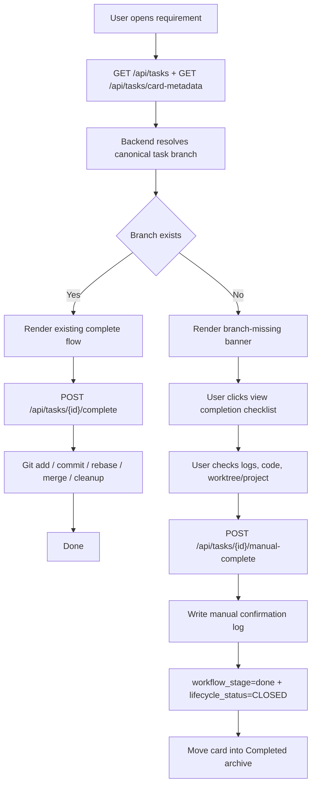

# PRD：手动合并后缺失分支的完成确认流程

**原始需求标题**：如果需求被我手动合并并删除了,它还是显示
**需求名称（AI 归纳）**：手动合并后缺失分支的完成确认流程
**文件路径**：`tasks/prd-0fd7ed62.md`
**创建时间**：2026-03-26 19:33:44 CST
**参考上下文**：`frontend/src/App.tsx`, `frontend/src/api/client.ts`, `frontend/src/types/index.ts`, `dsl/api/tasks.py`, `dsl/services/task_service.py`, `dsl/services/git_worktree_service.py`, `dsl/services/project_service.py`, `docs/prototypes/missing-branch-complete-demo.html`

---

## Implementation Update (2026-03-27)

- **Status:** Implemented
- **Delivered Files:** `dsl/api/tasks.py`, `dsl/services/task_service.py`, `dsl/services/git_worktree_service.py`, `dsl/schemas/task_schema.py`, `frontend/src/App.tsx`, `frontend/src/api/client.ts`, `frontend/src/types/index.ts`, `frontend/src/index.css`, `tests/test_tasks_api.py`, `docs/guides/dsl-development.md`, `docs/architecture/system-design.md`, `docs/index.md`
- **Backend Outcome:** Added derived `branch_health` projection, `branch_missing` card/detail display state, and dedicated `POST /api/tasks/{id}/manual-complete` closure flow with audit log creation and `done / CLOSED` convergence.
- **Frontend Outcome:** Added missing-branch warning banner, completion checklist gating, and separate manual confirmation CTA while preserving the existing `Complete` path when the branch still exists.
- **Verification:** `uv run pytest tests/test_tasks_api.py tests/test_task_service.py tests/test_git_worktree_service.py -q` passed (`31 passed`); `npm run build` passed.
- **Notes:** Normal `/api/tasks/{id}/complete` Git finalization was intentionally left unchanged; manual completion is only unlocked when `branch_health.manual_completion_candidate=true`.

## Review Fix Update (2026-03-27)

- **Status:** Implemented
- **Delivered Files:** `dsl/services/task_service.py`, `tests/test_tasks_api.py`, `docs/guides/dsl-development.md`, `docs/architecture/system-design.md`, `docs/index.md`
- **Outcome:** Tightened `manual_completion_candidate` so it now requires a persisted `worktree_path`, which prevents linked backlog / never-started tasks from surfacing `branch_missing` or reaching `/manual-complete`.
- **Verification:** `uv run pytest tests/test_tasks_api.py tests/test_task_service.py -q` passed (`27 passed`); `just docs-build` passed; `git diff --check -- dsl/services/task_service.py tests/test_tasks_api.py docs/architecture/system-design.md docs/guides/dsl-development.md docs/index.md tasks/prd-0fd7ed62.md` passed.

## Closure Follow-up Update (2026-03-30)

- **Status:** Implemented
- **Delivered Files:** `frontend/src/App.tsx`, `dsl/api/tasks.py`, `dsl/services/task_service.py`, `tests/test_tasks_api.py`
- **Outcome:** Selected-task detail state and completion CTA now resolve branch health from the polled `card-metadata` payload, so an idle page can surface `branch_missing` without a hard refresh after the user manually merges and deletes the task branch.
- **Backend Guard:** Standard `POST /api/tasks/{id}/complete` now rejects missing-branch manual-completion candidates and instructs callers to use `POST /api/tasks/{id}/manual-complete`, preventing the normal Git finalization chain from rerunning on already-merged work.
- **Verification:** `uv run pytest tests/test_tasks_api.py -q` passed (`19 passed`); `cd frontend && npm run build` passed; `just docs-build` passed; `git diff --check -- frontend/src/App.tsx dsl/api/tasks.py dsl/services/task_service.py tests/test_tasks_api.py tasks/prd-0fd7ed62.md` passed.

## Merge Conflict Resolution Update (2026-03-30)

- **Status:** Implemented
- **Delivered Files:** `dsl/api/tasks.py`, `dsl/services/git_worktree_service.py`, `frontend/src/App.tsx`, `frontend/src/index.css`, `mkdocs.yml`, `tests/test_tasks_api.py`
- **Outcome:** Resolved the active merge so the missing-branch manual-completion flow now coexists with the previously added destroy/archive-audit logic, semantic worktree branch creation, and the existing prototype navigation entries.
- **Verification:** `UV_CACHE_DIR=/tmp/uv-cache uv run pytest tests/test_tasks_api.py tests/test_git_worktree_service.py -q` passed (`46 passed`); `cd frontend && npm run build` passed; `UV_CACHE_DIR=/tmp/uv-cache just docs-build` passed; `git diff --check -- dsl/api/tasks.py dsl/services/git_worktree_service.py frontend/src/App.tsx frontend/src/index.css mkdocs.yml tests/test_tasks_api.py` passed.

---

## 1. Introduction & Goals

### 背景

当前任务流把“需求是否仍显示在 Active/Completed/Changes 视图中”主要绑定在数据库里的 `lifecycle_status`、`workflow_stage`、`worktree_path` 和需求变更日志上，而不是 Git 里的真实任务分支状态：

- `frontend/src/App.tsx` 通过 `lifecycle_status` 与 requirement-change 日志决定任务落在哪个 workspace 视图。
- `dsl/services/task_service.py` 与 `dsl/api/tasks.py` 的完成逻辑默认假设 worktree-backed task 仍能走标准 Git 完成流。
- `dsl/services/git_worktree_service.py` 已有明确的 canonical branch 命名规则 `task/{task_id[:8]}`，但当前没有用它去做“分支还在不在”的巡检。
- `dsl/services/project_service.py` 只会在项目重绑时顺带清除不存在的 `worktree_path`，日常轮询里并不会识别“分支已被人工 merge 并删除”的情况。

因此，当用户手动完成了以下动作后：

1. 在仓库里手动 merge 任务分支。
2. 手动删除该任务分支。
3. 甚至顺手清理了 worktree。

Koda 仍可能把该需求继续留在 active workspace 中，而且 UI 没有一个明确的“系统发现分支不见了，请你确认是否应转为 complete”路径。

本需求的目标不是“检测到缺失分支就自动关单”，而是新增一条受控的人工确认分支：

1. 系统发现 canonical task branch 已不存在。
2. 任务详情出现明确提示与“查看完成状态”动作。
3. 用户先检查时间线/代码，再决定是否手动确认完成。
4. 确认后，任务安全收敛到 `workflow_stage=done` 与 completed archive。

### 可衡量目标

- [ ] 对于已进入 worktree-backed Git 流程的任务，系统能识别 `task/{task_id[:8]}` 是否仍存在，并在任务轮询或详情刷新中反映到 UI。
- [ ] 当分支缺失但任务尚未关闭时，详情页必须显示显式提示，而不是继续假装可以直接走标准 Git `complete` 流程。
- [ ] 用户必须先点击“查看完成状态/检查单”之类的显式动作，之后才允许手动确认 Complete。
- [ ] 手动确认后，任务应写入一条人工确认日志，并切换到 `workflow_stage=done`、`lifecycle_status=CLOSED`，从 Active 视图收敛到 Completed 视图。
- [ ] 分支仍存在的任务不受影响，继续沿用现有 `/api/tasks/{id}/complete` 自动化 Git 收尾流程。

### 1.1 Clarifying Questions

以下问题无法仅靠现有代码直接确定。本 PRD 默认按推荐选项落地。

1. 当系统检测到任务分支不存在时，应该如何处理？
A. 自动把任务标记为完成
B. 保留任务可见，并要求用户先查看状态再手动确认是否完成
C. 直接把任务移到 changes_requested
> **Recommended: B**（最符合原始需求表述“让我点击查看一下，是不是完成了”。同时也比自动关单更安全，避免把误删分支当作已完成。）

2. 缺失分支提示应该放在哪一层？
A. 只在任务详情页显示
B. 卡片元数据和任务详情都能反映，但确认动作放在详情页
C. 只在后端日志里记录
> **Recommended: B**（当前已有 `card-metadata` 派生层，适合放轻量状态；真正的检查与确认动作仍应放在详情页，避免卡片区交互过载。）

3. 手动确认完成应该复用什么接口形态？
A. 直接沿用通用 `updateStage(DONE)`
B. 新增一个专用 manual-complete 接口，内部统一做校验、日志写入与状态收敛
C. 让前端同时调用 `updateStage(DONE)` 和 `create_log(...)`
> **Recommended: B**（后端集中校验最稳妥，避免前端顺序错误或漏写日志，也更容易约束“只有 branch_missing 场景才允许走人工完成接口”。）

4. 如果分支缺失但 worktree 目录还在，本次需求应如何处理？
A. 自动删除 worktree
B. 保留现状，只把它视为一个可选检查入口
C. 直接认为数据损坏
> **Recommended: B**（用户可能还需要打开 worktree 核对最终代码，分支缺失不等于必须立即清掉目录。）

## 2. Implementation Guide

### 核心逻辑

建议把本需求实现为“Git 分支健康探针 + 人工确认完成入口”的组合，而不是去改写现有自动化完成流。

推荐技术路径如下：

1. 后端为 worktree-backed task 增加一个派生的 Git 分支健康检查。
   - 通过 `GitWorktreeService.build_task_branch_name(task_id)` 获取 canonical branch，例如 `task/0fd7ed62`。
   - 优先从 `task.worktree_path` 反推主仓库根目录；若 worktree 已不存在，则回退到关联 `Project.repo_path`。
   - 使用 `git show-ref --verify refs/heads/<branch>` 或等价方式检查本地分支是否仍存在。

2. 后端把检查结果序列化为独立的展示/操作状态，而不是直接改数据库持久化字段。
   - 例如 `branch_exists`, `worktree_exists`, `expected_branch_name`, `manual_completion_candidate`, `status_message`。
   - 仅当任务尚未 `CLOSED/DELETED`、已经创建过 `worktree_path`，且 canonical branch 缺失时，才返回 `manual_completion_candidate=true`。

3. 任务卡片元数据新增一类“缺失分支待确认”的展示态。
   - 当前 `card-metadata` 已支持 `waiting_user` 这种 UI 派生状态，本需求可延续这一思路，新增 `branch_missing` 或语义等价的 display key。
   - 这样卡片上能提示“需要用户确认”，但不会擅自改变真实 `workflow_stage`。

4. 任务详情页新增“查看完成状态/完成检查单”与“确认 Complete”动作。
   - 先看检查单，再解锁确认按钮。
   - 如果分支仍存在，则继续显示现有 Complete 按钮和自动 Git 收尾文案。
   - 如果分支缺失，则切到人工确认模式，避免再调用现有 `/complete` Git 收尾接口。

5. 后端新增专用 manual-complete 接口。
   - 校验任务当前不是 `CLOSED/DELETED`。
   - 校验任务确实处于 `manual_completion_candidate=true`。
   - 写入一条结构化 DevLog，说明“系统检测到分支缺失，用户已人工确认该需求完成”。
   - 最后统一把任务切到 `workflow_stage=done`、`lifecycle_status=CLOSED`，并按实际情况决定是否清理不存在的 `worktree_path`。

6. 正常完成流保持不变。
   - `branch_exists=true` 的任务继续走 `/api/tasks/{id}/complete` 和现有 Git 收尾。
   - 本需求只为“分支已被人工处理掉”的异常/旁路场景补一条可控收敛路径。

### 2.1 Change Matrix

| Change Target | Current State | Target State | How to Modify | Affected Files |
|---|---|---|---|---|
| Git 分支健康检查 | 系统知道 canonical branch 命名规则，但不会在任务轮询中检查分支是否还存在 | 后端能按任务返回 branch exists / missing / unknown 的派生状态 | 在 worktree 服务或相邻服务中增加 repo-root 解析与 branch probe 辅助方法，供任务接口复用 | `dsl/services/git_worktree_service.py`, `dsl/services/task_service.py` |
| 任务响应/展示元数据 | `TaskResponseSchema` 与 `TaskCardMetadataSchema` 没有分支健康信息；`waiting_user` 是唯一派生展示态 | 增加缺失分支相关的只读状态投影，用于卡片提示与详情页渲染 | 新增 `TaskBranchHealthSchema` 或等价字段，并扩展 `card-metadata` 派生逻辑 | `dsl/schemas/task_schema.py`, `dsl/api/tasks.py`, `frontend/src/types/index.ts` |
| 手动完成接口 | worktree-backed task 只有现有 `/complete` Git 收尾入口；手动完成只能绕过业务契约硬改 stage | 为“分支缺失后人工确认完成”提供单独接口 | 新增 `POST /api/tasks/{id}/manual-complete` 或语义等价接口，内部做校验、日志写入、DONE/CLOSED 收敛 | `dsl/api/tasks.py`, `dsl/services/task_service.py` |
| 详情页交互 | 详情页只区分现有 Complete、Accept、Request Changes 等动作，没有“缺失分支待确认”模式 | 详情页在 branch missing 时展示提示条、完成检查单和人工确认 CTA | 在选中任务的详情头部/动作区引入 branch-missing banner、检查单折叠区和 manual-complete 调用 | `frontend/src/App.tsx`, `frontend/src/api/client.ts`, `frontend/src/types/index.ts` |
| 卡片展示反馈 | Active/Completed/Changes 视图不会告诉用户“这张卡仍显示是因为分支没了但尚未确认完成” | 卡片/标题区能显示“缺失分支待确认”语义 | 在 `task card metadata` 的 display stage 体系里加入新标签及兼容逻辑 | `dsl/api/tasks.py`, `frontend/src/App.tsx`, `frontend/src/types/index.ts` |
| 验证与文档 | 当前没有覆盖“手动 merge + 删分支后如何收敛”的测试/原型说明 | 新增回归测试和交互原型，明确预期行为 | 增加 tasks API / service regression，补原型页和相关架构说明 | `tests/test_tasks_api.py`, `tests/test_task_service.py`, `docs/prototypes/missing-branch-complete-demo.html`, `mkdocs.yml`, `docs/architecture/system-design.md` |

### 2.2 Flow Diagram



### 2.3 Low-Fidelity Prototype

```text
Active Workspace                                Requirement Detail
┌──────────────────────────────┐               ┌──────────────────────────────────────────┐
│ 手动 merge 后缺失分支的完成确认 │  ← selected  │ [Branch Missing] 检测到 canonical branch 不存在 │
│ Branch Missing / 待确认        │               │                                          │
│                              │               │ 说明：任务仍显示，但不再走普通 Git Complete   │
│ PRD 反馈回写整理              │               │                                          │
│ PRD Ready                    │               │ [查看完成检查单] [确认 Complete]           │
└──────────────────────────────┘               │                                          │
                                               │ 完成检查单                                │
Completed Archive                              │ 1. 看时间线                               │
┌──────────────────────────────┐               │ 2. 看项目/Worktree                         │
│ Git Worktree 路径收口         │               │ 3. 确认是人工 merge/cleanup                 │
│ Done                         │               │ 4. 再标记 Complete                         │
└──────────────────────────────┘               └──────────────────────────────────────────┘
```

### 2.4 ER Diagram

本需求默认不修改持久化数据库表结构。推荐实现把“分支是否存在”“是否允许人工完成”作为派生读模型/响应字段，而不是新增 `Task` 表列或新表，因此本 PRD 不要求新增持久化 ER 图。

### 2.8 Interactive Prototype Change Log

| File Path | Change Type | Before | After | Why |
|---|---|---|---|---|
| `docs/prototypes/missing-branch-complete-demo.html` | Add | 不存在该原型页 | 新增可交互原型，支持“分支仍存在 / 检测到分支缺失 / 查看检查单 / 确认 Complete / 归档完成”状态演示 | 让需求中的状态切换和按钮行为在 PRD 阶段即可被直观看到 |
| `mkdocs.yml` | Modify | 原型页无文档导航入口 | 新增“原型 / 缺失分支完成确认”导航项 | 让评审者可直接从文档站访问原型页 |

### 2.9 Interactive Prototype Link

- `docs/prototypes/missing-branch-complete-demo.html`

## 3. Global Definition of Done

- [ ] 对于关联项目且存在 canonical branch 规则的任务，后端能稳定返回 branch-health 派生信息。
- [ ] 当分支仍存在时，前端保持现有 Complete 流程，不出现误提示。
- [ ] 当分支缺失时，详情页出现明确 banner 和“查看完成状态/检查单”入口。
- [ ] 用户必须先查看检查单，再能点击手动确认 Complete。
- [ ] 手动确认成功后，系统写入人工确认日志，并把任务切到 `workflow_stage=done` 与 `lifecycle_status=CLOSED`。
- [ ] 任务在下一轮刷新中从 Active 视图收敛到 Completed 视图。
- [ ] 缺失分支但仍保留的 worktree 目录不会被误删；用户仍可根据需要打开项目或 worktree 检查。
- [ ] `just docs-build` 通过，原型页可从 MkDocs 导航访问。
- [ ] 新增后端回归测试覆盖 branch missing 判定与 manual-complete 收敛路径。
- [ ] linked backlog / 未启动任务不会被错误标记为“缺失分支待确认”。

## 4. User Stories

### US-001：作为操作者，我希望系统能识别任务分支已经不存在

**Description:** As an operator, I want Koda to detect that the canonical task branch has already been manually merged and deleted so that the UI no longer assumes the normal Git completion flow still applies.

**Acceptance Criteria:**
- [ ] 系统能根据任务 ID 推导出期望 branch name
- [ ] 系统能在详情刷新或卡片轮询时识别该分支已不存在
- [ ] 识别结果会反映到 UI，而不是只留在后端日志里

### US-002：作为操作者，我希望先查看状态再确认是否完成

**Description:** As an operator, I want a dedicated inspection step before marking the task complete so that I can verify the missing branch really means “already done,” not an accidental deletion.

**Acceptance Criteria:**
- [ ] 缺失分支时显示明确提示和检查单入口
- [ ] 检查单会提醒我查看时间线、项目和 worktree 现状
- [ ] 未查看检查单前，不允许直接点手动完成

### US-003：作为操作者，我希望在确认后把任务收敛到已完成归档

**Description:** As an operator, I want to manually confirm completion after inspection so that the task moves cleanly into the completed archive without trying to rerun Git finalization steps that no longer make sense.

**Acceptance Criteria:**
- [ ] 点击人工完成后，系统写入一条人工确认日志
- [ ] 任务被切到 `done / CLOSED`
- [ ] 任务从 Active 视图移动到 Completed 视图

### US-004：作为操作者，我希望正常任务不受这次改动影响

**Description:** As an operator, I want tasks whose branches still exist to keep using the current completion automation so that this feature only handles the manual-merge edge case.

**Acceptance Criteria:**
- [ ] 分支存在的任务仍显示现有 Complete 行为
- [ ] `/api/tasks/{id}/complete` 原有流程不变
- [ ] 这次改动不会把正常任务错误地显示为“缺失分支待确认”

## 5. Functional Requirements

1. **FR-1**：系统必须能够基于任务 ID 推导 canonical branch name，格式与现有 `task/{task_id[:8]}` 规则一致。
2. **FR-2**：对于关联 Git 项目的未关闭任务，后端必须提供一个只读的 branch-health 派生结果，至少包含 `expected_branch_name` 与 `branch_exists`。
3. **FR-3**：只有当任务已经进入 worktree-backed Git 流程、且任务分支缺失并且任务尚未 `CLOSED/DELETED` 时，系统才可把该任务标记为“可人工确认完成”的候选态。
4. **FR-4**：前端必须在任务详情页显示缺失分支提示，并提供“查看完成状态/检查单”之类的显式动作。
5. **FR-5**：前端在用户查看检查单之前，不得解锁 manual-complete CTA。
6. **FR-6**：系统必须提供独立的 manual-complete 接口，而不是要求前端拼装多个通用接口才能完成一次人工确认。
7. **FR-7**：manual-complete 接口必须写入一条可审计的 DevLog，说明是“检测到分支缺失后由用户人工确认完成”。
8. **FR-8**：manual-complete 成功后，任务必须切换到 `workflow_stage=done` 与 `lifecycle_status=CLOSED`。
9. **FR-9**：若任务分支仍存在，则系统必须继续沿用现有 `/api/tasks/{id}/complete` 自动化 Git 完成流程，不得误导用户走 manual-complete。
10. **FR-10**：任务卡片或详情头部必须能表达“缺失分支待确认”的语义，避免用户只看到“它还是显示”却不知道原因。
11. **FR-11**：当 worktree 目录仍存在但分支缺失时，系统不得自动删除该目录；它只应作为用户检查代码的辅助入口。
12. **FR-12**：新增实现必须包含回归测试，覆盖 branch exists、branch missing、manual-complete 校验失败、manual-complete 成功收敛，以及 linked backlog/未启动任务不会被误判为 `branch_missing` 等路径。
13. **FR-13**：相关文档必须同步更新，至少说明缺失分支场景下的 UI 行为与人工确认收敛路径。

## 6. Non-Goals

- 不在本需求内自动判断“分支缺失就必然已经 merge 到 main”
- 不在本需求内实现远端仓库级别的 merge commit 追踪或完整 Git 图谱分析
- 不在本需求内自动删除残留 worktree、残留目录或本地未提交文件
- 不在本需求内改写现有正常 `/complete` 的 Git 自动化链路
- 不在本需求内新增数据库持久化表结构，仅允许新增派生读模型/响应字段
