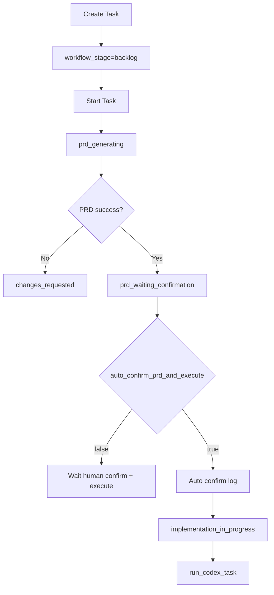

# PRD：创建卡片时支持 PRD 自动确认并直接执行

**原始需求标题**：增加允许直接按照推荐prd执行的功能
**需求名称（AI 归纳）**：创建卡片时支持 PRD 自动确认并直接执行
**文件路径**：`tasks/prd-3abebe7f.md`
**创建时间**：2026-03-26 23:55:34 CST
**参考上下文**：`frontend/src/App.tsx`, `frontend/src/api/client.ts`, `dsl/api/tasks.py`, `dsl/services/task_service.py`, `dsl/services/codex_runner.py`, `dsl/schemas/task_schema.py`, `dsl/models/task.py`, `utils/database.py`, `docs/guides/codex-cli-automation.md`
**附件上下文检查**：本次输入未出现 `Attached local files:` 段落，未提供可检查的本地图片/附件/视频文件。

---

## 1. Introduction & Goals

### 背景

当前流程是：创建卡片后，用户点击“开始任务”触发 PRD 生成，系统在 `prd_waiting_confirmation` 停住，必须人工确认后再点击“开始执行”。

这与“部分低风险任务可直接按推荐 PRD 执行”的诉求不一致，导致额外的人机切换成本。现有代码和文档也明确了默认行为是“PRD 生成后等待人工确认”，不会自动继续执行。

### 目标

- [ ] 在“创建卡片”面板新增可选开关：`PRD 生成后自动确认并开始执行`
- [ ] 开关默认关闭，不影响现有人工确认流程
- [ ] 开关开启时，任务在 PRD 生成成功后自动从 `prd_waiting_confirmation` 进入 `implementation_in_progress`
- [ ] 自动流转全过程要有可审计日志（含自动确认、自动启动执行）
- [ ] 手动流程（确认 PRD / 开始执行按钮）保持可用，且无回归

### 1.1 Clarifying Questions（默认采用推荐选项）

1. 自动化入口应该放在哪？
A. 全局系统配置（对所有任务生效）
B. 创建卡片时按任务单独选择
C. 两者都做
> **Recommended: B**（需求原文强调“创建卡片的时候选择”；且现有创建流程集中在 `frontend/src/App.tsx` 与 `taskApi.create`，接入成本最低。）

2. “直接按照推荐 PRD 执行”应覆盖到哪一步？
A. 仅自动确认 PRD，仍需手动点“开始执行”
B. PRD 生成后自动确认并立即开始执行
C. 跳过 PRD 文件生成，直接编码
> **Recommended: B**（与需求标题语义一致；A 不能消除二次点击；C 违背当前 PRD 先行的流程约束和文档合同。）

3. 自动模式下是否还保留 `prd_waiting_confirmation` 阶段痕迹？
A. 完全跳过该阶段
B. 先进入该阶段再自动推进到执行阶段，并写日志说明
C. 新增专用阶段
> **Recommended: B**（兼容现有阶段语义与通知/看板实现，避免引入新枚举和大范围前后端改造。）

4. 自动模式是否默认作用于“PRD 重新生成”？
A. 仅首次 PRD 生成自动执行
B. 该任务后续每次 PRD 生成都自动执行
C. 重新生成时弹窗二次确认
> **Recommended: A**（最小范围满足原诉求，降低误触发风险；后续可再扩展为 B/C。）

5. PRD Ready 通知在自动模式下如何处理？
A. 保持发送“等待确认”通知
B. 不发送“等待确认”通知，改为“已自动启动执行”日志/通知
C. 关闭全部通知
> **Recommended: B**（自动模式不存在“等待确认”状态，继续发送会产生误导。）

## 2. Implementation Guide（Technical Specs）

### 核心逻辑

1. 用户在创建卡片时选择 `auto_confirm_prd_and_execute=true`。
2. 后端创建任务时保存该任务级策略（默认 `false`）。
3. `run_codex_prd` 成功后读取任务策略：
   - 若 `false`：保持现状，停在 `prd_waiting_confirmation`。
   - 若 `true`：写入“自动确认 PRD”日志，随后自动推进并触发 `run_codex_task`。
4. 自动流转失败时沿用现有失败语义：回退 `changes_requested` 并记录失败原因。
5. 前端任务详情继续显示实时阶段与日志，用户可追踪自动流程。

### 2.1 Change Matrix

| Change Target | Current State | Target State | How to Modify | Affected Files |
|---|---|---|---|---|
| 创建卡片 UI | 无“自动确认并执行”选项 | 新增任务级开关，默认关闭 | 在创建面板增加开关状态并随创建请求提交 | `frontend/src/App.tsx` |
| 前端 API 类型 | `taskApi.create` 无该字段 | 创建请求支持 `auto_confirm_prd_and_execute` | 扩展 create 请求 payload 类型 | `frontend/src/api/client.ts` |
| Task 创建 Schema | 无该布尔字段 | `TaskCreateSchema` 支持该字段，默认 `False` | 扩展 Pydantic schema + 描述文案 | `dsl/schemas/task_schema.py` |
| Task 响应 Schema | 无策略字段回传 | 前端可读取任务级自动执行策略 | 在 `TaskResponseSchema` 增加布尔字段 | `dsl/schemas/task_schema.py` |
| Task ORM 模型 | tasks 表无该字段 | 新增任务级自动策略字段 | 在 ORM 增加列并设置默认值 | `dsl/models/task.py` |
| 数据库增量补丁 | 仅已有历史补丁 | 自动为旧库补齐新列 | 在 `_INCREMENTAL_SCHEMA_PATCHES` 增加 `ALTER TABLE` 语句 | `utils/database.py` |
| Task 创建服务 | 仅保存标题/摘要/项目 | 同时保存自动策略 | `TaskService.create_task` 写入模型字段 | `dsl/services/task_service.py` |
| PRD 生成后阶段推进 | 一律停在 `prd_waiting_confirmation` 并发 PRD Ready 通知 | 根据任务策略分流：手动确认或自动执行 | 在 `run_codex_prd` 中增加分支，自动模式调用执行链路并改通知语义 | `dsl/services/codex_runner.py` |
| 自动化通知语义 | PRD Ready 默认发送 | 自动模式不发送“等待确认”通知 | 调整 `send_prd_ready_notification` 触发条件 | `dsl/services/codex_runner.py` |
| 接口文档与开发文档 | 仅描述手动确认流程 | 增加“创建时选择自动模式”的说明与限制 | 更新流程文档/API 文档 | `docs/guides/codex-cli-automation.md`, `docs/guides/dsl-development.md`, `docs/api/references.md` |
| 自动化测试 | 尚无该策略覆盖 | 覆盖默认路径和自动路径 | 增加 task create、PRD 成功分流、通知语义、失败回退测试 | `tests/test_task_service.py`, `tests/test_tasks_api.py`, `tests/test_codex_runner.py` |

### 2.2 关键状态机变更

## 3. Global Definition of Done

- [ ] 创建卡片面板出现“PRD 生成后自动确认并开始执行”开关，默认关闭
- [ ] 创建 API 请求体和后端 Schema 能正确传递并落库 `auto_confirm_prd_and_execute`
- [ ] 关闭开关时，流程与当前一致：PRD 生成后停在 `prd_waiting_confirmation`
- [ ] 开启开关时，PRD 生成成功后系统自动写确认日志并进入 `implementation_in_progress`
- [ ] 自动模式下不再发送“PRD 等待确认”误导性通知
- [ ] 自动模式失败时能回退到 `changes_requested`，并有可定位日志
- [ ] 现有手动“确认 PRD / 开始执行”按钮逻辑不回归
- [ ] `uv run pytest` 新增与相关回归测试通过
- [ ] `just docs-build` 通过，文档与实现一致

## 4. User Stories

### US-001：创建卡片时可选择自动执行策略
**Description:** As a user, I want to choose auto-confirm-and-execute when creating a task so that simple tasks can run without extra clicks.

**Acceptance Criteria:**
- [ ] 创建面板提供该开关
- [ ] 开关状态与任务绑定并持久化
- [ ] 默认值为关闭

### US-002：PRD 生成后系统自动确认并启动执行
**Description:** As a user, I want the system to proceed automatically after PRD generation when auto mode is enabled.

**Acceptance Criteria:**
- [ ] PRD 文件仍按合同生成
- [ ] 生成成功后自动进入执行阶段
- [ ] 时间线明确记录“自动确认 PRD”和“自动启动执行”

### US-003：自动模式失败时保持可控回退
**Description:** As an operator, I want deterministic fallback behavior so that automation failures do not leave tasks in ambiguous states.

**Acceptance Criteria:**
- [ ] PRD 生成失败或后续执行失败时进入 `changes_requested`
- [ ] 日志包含失败阶段与原因
- [ ] 用户可继续使用现有重试/恢复入口

### US-004：人工模式完全保持原体验
**Description:** As a user, I want manual PRD confirmation flow to stay unchanged when auto mode is off.

**Acceptance Criteria:**
- [ ] 仍可手动确认 PRD
- [ ] 仍可手动点击“开始执行”
- [ ] 现有通知和阶段文案不变

## 5. Functional Requirements

1. **FR-1**：系统必须支持在任务创建请求中接收 `auto_confirm_prd_and_execute` 布尔字段。
2. **FR-2**：该字段默认值必须为 `false`，以保证兼容现有流程。
3. **FR-3**：任务实体（ORM + 响应 Schema）必须持久化并返回该字段。
4. **FR-4**：创建卡片 UI 必须提供对应开关，且默认未勾选。
5. **FR-5**：PRD 自动化成功后，若字段为 `false`，任务必须停在 `prd_waiting_confirmation`。
6. **FR-6**：PRD 自动化成功后，若字段为 `true`，系统必须自动推进执行链路。
7. **FR-7**：自动推进时必须写入结构化日志，至少包含“自动确认 PRD”和“自动开始执行”两类信息。
8. **FR-8**：自动模式下不得发送“PRD 等待人工确认”通知。
9. **FR-9**：自动模式失败时必须按现有语义回退 `changes_requested`，且不得停留在未知中间态。
10. **FR-10**：手动按钮入口（确认 PRD、开始执行）必须继续可用并兼容旧任务数据。
11. **FR-11**：数据库旧实例升级时，必须通过增量补丁安全补齐该列。
12. **FR-12**：新增逻辑必须覆盖单元测试与接口测试，包含默认路径和自动路径。
13. **FR-13**：文档必须同步更新，明确自动模式触发条件、默认值、失败语义与通知变化。

## 6. Non-Goals

- 不引入“跳过 PRD 直接编码”的模式
- 不把自动执行改为全局强制默认开启
- 不重构现有完整工作流阶段枚举
- 不改动 `Complete`、`resume`、`cancel` 等后续阶段的核心语义
- 不在本需求中实现复杂审批规则（如按项目/风险等级自动判定）
