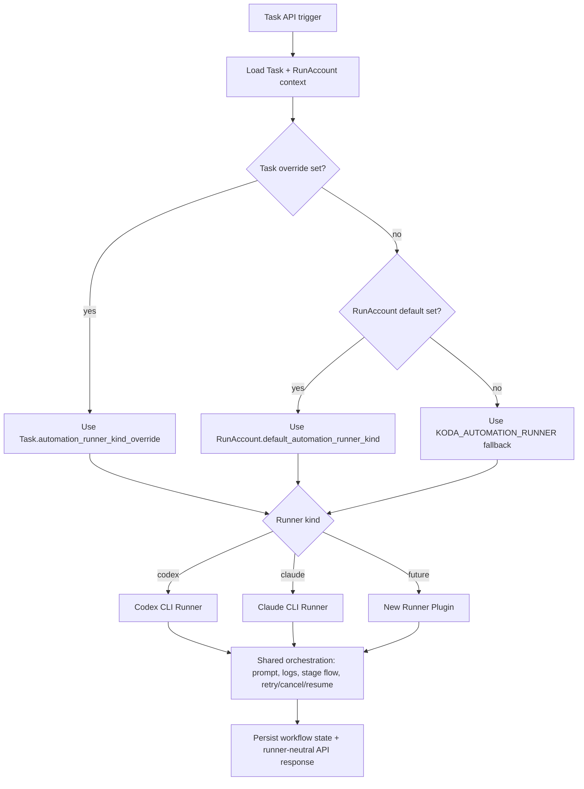

# PRD：任务自动化多执行器扩展（新增 Claude Code 支持）

**原始需求标题**：增加claude code的支持
**需求名称（AI 归纳）**：任务自动化多执行器扩展：新增 Claude Code 并对齐 Codex 行为
**文件路径**：`tasks/prd-3f0bc724.md`
**创建时间**：2026-03-26 23:45:24 CST
**需求背景/上下文**：除了 codex 之外，还需要支持 claude code；行为保持和 codex 一致；同时预留未来接入其他工具的扩展能力。
**附件信息**：未检测到 `Attached local files:` 段落，无需附件解析。
**参考上下文**：`dsl/services/codex_runner.py`, `dsl/services/automation_runner.py`, `dsl/services/runners/registry.py`, `dsl/models/run_account.py`, `dsl/models/task.py`, `dsl/schemas/run_account_schema.py`, `dsl/schemas/task_schema.py`, `dsl/api/run_accounts.py`, `dsl/api/tasks.py`, `frontend/src/App.tsx`, `frontend/src/api/client.ts`, `frontend/src/types/index.ts`, `docs/guides/codex-cli-automation.md`, `docs/guides/configuration.md`, `docs/api/references.md`

---

## 1. Introduction & Goals

### 背景

当前仓库已经有一层多执行器骨架，但还没有真正完成“产品级可切换”：

- 全局配置 `KODA_AUTOMATION_RUNNER` 已支持 `codex` / `claude`，且 `dsl/services/runners/` 中已有 Runner Protocol、registry 和两个 CLI adapter。
- 真实工作流主编排仍主要集中在 `dsl/services/codex_runner.py`，大量入口与术语仍保留 Codex 专名。
- `TaskResponseSchema`、前端类型与界面状态仍直接依赖 `is_codex_task_running` 等 Codex 专名字段。
- 任务和运行账户当前都没有持久化的 runner 选择字段，无法做到“运行账号默认 + 任务级覆盖”。

这会导致四个问题：

- 只能通过全局环境变量切换执行器，无法针对账号或任务精细控制。
- Claude 虽然已有 CLI adapter，但仍未形成完整、清晰且可验证的产品合同。
- 对外 API 和前端展示仍残留 Codex 专名，影响后续继续接入新 runner。
- 若不明确兼容策略，接口改名会破坏现有前端与测试。

### 可衡量目标

- [ ] 系统支持按 `Task.automation_runner_kind_override -> RunAccount.default_automation_runner_kind -> KODA_AUTOMATION_RUNNER` 的优先级解析有效执行器。
- [ ] PRD 生成、实现、自检、lint-fix、完成收尾、恢复执行、手动取消在 Claude 下与 Codex 保持同等工作流语义。
- [ ] 对外 API 提供 runner-neutral 字段命名；旧的 Codex 专名字段以 deprecated alias 形式短期兼容。
- [ ] 前端可设置运行账号默认 runner、任务级 override，并可展示任务当前 effective runner。
- [ ] 运行日志中可识别 effective runner 与解析来源，便于排障与审计。
- [ ] 执行器接入改造后，新增一个新工具时不需要复制整套工作流，只需实现标准 Runner 接口并注册。
- [ ] 现有 Codex 用户、历史任务和已有 worktree 无感迁移，不依赖破坏性回填。

### 1.1 Clarifying Questions

1. 执行器选择粒度是什么？
A. 全局单一配置
B. 任务级可选（任务创建时指定）
C. 运行账号级默认 + 任务级可覆盖
> **Selected: C**（兼顾默认简化与灵活覆盖，便于灰度验证 Claude）

2. “行为与 Codex 一致”的范围是什么？
A. 仅实现阶段一致
B. PRD + 实现一致
C. PRD、实现、自检、lint、完成、恢复、手动取消全链路一致
> **Recommended: C**（避免出现“能写代码但工作流不完整”的割裂体验）

3. Claude CLI 不可用时如何处理？
A. 自动回退 Codex
B. 当前任务报错并回退 `changes_requested`，提示明确原因
C. 静默失败
> **Recommended: B**（与当前 Codex 不可用时的显式失败策略一致，行为可预测）

4. 扩展层的抽象边界应放在哪？
A. 只抽象 CLI 命令拼接
B. 抽象“执行器能力接口 + 注册中心”，工作流编排保持统一
C. 每个执行器复制一份完整 runner
> **Recommended: B**（满足扩展性目标，同时避免代码分叉）

5. 首个版本发布策略是什么？
A. 直接全量切换到 Claude
B. 保持 Codex 为默认，Claude 通过运行账号默认值与任务 override 灰度启用
C. 仅文档声明，暂不接入
> **Recommended: B**（最小风险上线）

6. 现有 `is_codex_task_running` 等 Codex 专名字段如何处理？
A. 永久保留，不再新增通用字段
B. 新增通用字段并保留旧字段为 deprecated alias
C. 直接改名替换
> **Selected: B**（先完成 API 去 Codex 化，再给前端稳定迁移窗口）

## 2. Implementation Guide

### 核心逻辑

采用“统一工作流编排 + 可插拔执行器适配层 + 持久化 runner 选择链”：

1. 保留现有任务工作流状态机与阶段推进语义，不重做状态机。
2. 将执行器相关能力收敛到统一 Runner Protocol，至少覆盖：
   - 可执行文件可用性检查
   - 非交互命令构建与启动
   - 中断标志识别
   - 执行器标识输出
   - 缺失 CLI 时的可行动提示
3. 将 effective runner 的解析改为固定优先级：任务 override 优先，其次运行账号默认值，最后回退到全局环境变量 `KODA_AUTOMATION_RUNNER`。
4. 保留 `dsl/services/codex_runner.py` 中共享的 prompt、日志、阶段推进、自检/lint/retry/cancel/recovery 编排能力，但逐步去除其对 Codex 专名命名的外露依赖。
5. 对外 API 路径保持不变；对外字段新增 runner-neutral 名称，并在当前版本内保留 `is_codex_task_running` 等别名为 deprecated compatibility layer。
6. 手动取消必须走 runner-agnostic 语义：中断当前 runner 进程、阻止自动重试、回退到 `changes_requested`、保留现有通知行为。
7. 为兼容历史数据，新引入的 runner 持久化字段采用可空设计；空值表示继续沿回退链解析，不强制一次性回填。

### 2.1 Change Matrix

| Change Target | Current State | Target State | How to Modify | Affected Files |
|---|---|---|---|---|
| 有效执行器解析链 | 仅有全局 `KODA_AUTOMATION_RUNNER`，无持久化账号默认或任务 override | 支持 `task override -> run account default -> global env fallback` | 新增统一 resolver，封装优先级与合法值校验；空值按回退链继承 | `utils/settings.py`, `dsl/services/automation_runner.py`, `dsl/services/codex_runner.py`, `dsl/services/runners/registry.py` |
| RunAccount 数据模型 | `RunAccount` 仅有显示名、OS、分支、激活态 | 增加 `default_automation_runner_kind` 作为账号默认 runner | 为 `RunAccount` 增加可空字段；`null` 表示继续继承全局 env 默认，避免破坏性回填 | `dsl/models/run_account.py`, `dsl/schemas/run_account_schema.py`, `dsl/api/run_accounts.py`, `docs/database/schema.md`, `docs/database/migrations.md` |
| Task 数据模型 | `Task` 无 runner 选择字段 | 增加 `automation_runner_kind_override` 作为任务级覆盖 | 为 `Task` 增加可空 override 字段；`null` 表示继承 RunAccount 默认值 | `dsl/models/task.py`, `dsl/schemas/task_schema.py`, `dsl/api/tasks.py`, `docs/database/schema.md`, `docs/database/migrations.md` |
| RunAccount API 合同 | 当前仅支持 list/create/activate/current，无法编辑 runner 默认值 | 请求/响应可读写账号默认 runner | 在 `RunAccountCreateSchema` / `RunAccountUpdateSchema` / `RunAccountResponseSchema` 增加字段，并补充更新入口 | `dsl/schemas/run_account_schema.py`, `dsl/api/run_accounts.py`, `docs/api/references.md`, `tests/test_run_accounts_api.py`（新） |
| Task API 合同 | 任务创建/更新不含 runner override；响应仍暴露 `is_codex_task_running` | 任务可配置 override；响应新增 `is_task_automation_running` 与 `effective_runner_kind`，同时保留 `is_codex_task_running` deprecated alias | 扩展 `TaskCreateSchema` / `TaskUpdateSchema` / `TaskResponseSchema`；旧字段与新字段返回同一布尔值 | `dsl/schemas/task_schema.py`, `dsl/api/tasks.py`, `docs/api/references.md`, `tests/test_tasks_api.py` |
| Runner 抽象层 | 已有 Protocol、registry、`codex`/`claude` adapter 骨架，但 `automation_runner.py` 仍主要转发 `run_codex_*` | API 层与编排层都以 runner-neutral 命名为主，保留必要 alias 过渡 | 完成 `automation_runner.py` 的选择与路由；共享编排调用 Runner Protocol，而不是假定 Codex | `dsl/services/automation_runner.py`, `dsl/services/codex_runner.py`, `dsl/services/runners/base.py`, `dsl/services/runners/registry.py`, `dsl/services/runners/codex_cli_runner.py`, `dsl/services/runners/claude_cli_runner.py` |
| Prompt 与术语 | Prompt 构造和大量文档仍使用 `build_codex_*`、`run_codex_*` 等专名 | 用户可见文案与对外文档改为 runner-neutral；内部旧函数名可暂时保留 alias | 抽取/复用 prompt builder；在 docs 和 schema 描述中去 Codex 专名，但不改变 PRD 与附件合同 | `dsl/services/codex_runner.py`, `docs/core/prompt-management.md`, `docs/core/ai-assets.md`, `docs/guides/codex-cli-automation.md`, `docs/guides/dsl-development.md` |
| 可观测性与取消语义 | 当前日志已有部分 `runner_kind`，但未统一记录解析来源；取消入口仍以 Codex 命名 | 日志明确记录 effective runner、resolution source、关键命令预览；取消语义对所有 runner 一致 | 扩展日志头、失败日志和取消日志；明确区分用户取消与异常中断，禁止用户取消触发自动重试 | `dsl/services/codex_runner.py`, `dsl/services/automation_runner.py`, `dsl/api/tasks.py`, `docs/guides/codex-cli-automation.md` |
| 前端选择与兼容 | 前端类型与状态流仍依赖 `is_codex_task_running`，任务/账号 UI 无 runner 选择能力 | 前端可设置账号默认 runner、任务 override，优先消费通用字段并展示 effective runner | 扩展 TS 类型、API client 和页面状态流；旧字段只作为兼容 fallback 使用 | `frontend/src/App.tsx`, `frontend/src/api/client.ts`, `frontend/src/types/index.ts` |
| 测试覆盖 | 已有 registry 与少量 Claude 流程测试，但未覆盖持久化优先级、API 弃用兼容、前端契约 | 覆盖 resolver 优先级、阶段一致性、取消/恢复、deprecated alias 与失败路径 | 通过 fake runner / mock subprocess / API schema 测试验证不同 runner 下一致行为 | `tests/test_automation_runner_registry.py`, `tests/test_tasks_api.py`, `tests/test_codex_runner.py`, `tests/test_run_accounts_api.py`（新）, `tests/test_task_workflow_multi_runner.py`（新） |
| 文档与导航 | 文档已部分提到多 runner，但仍混有 Codex 专名与旧字段说明 | 文档升级为“多执行器 + 兼容层”说明，清楚描述选择优先级、弃用字段与排障路径 | 同步更新指南、配置、API 参考与首页定位；保持导航可发现性 | `docs/index.md`, `docs/guides/configuration.md`, `docs/guides/codex-cli-automation.md`, `docs/guides/dsl-development.md`, `docs/api/references.md`, `mkdocs.yml` |

### 2.2 Flow Diagram



### 2.3 Low-Fidelity Prototype

```text
RunAccount
  id
  account_display_name
  default_automation_runner_kind: "codex" | "claude" | null
    null => inherit global env fallback

Task
  id
  run_account_id
  automation_runner_kind_override: "codex" | "claude" | null
    null => inherit RunAccount default

effective_runner_resolver()
  -> task override?
  -> run account default?
  -> global env default?

TaskResponse
  effective_runner_kind: "codex" | "claude"
  is_task_automation_running: bool
  is_codex_task_running: bool   # deprecated alias, same value
```

### 2.4 ER Diagram

```mermaid
erDiagram
    RUN_ACCOUNT ||--o{ TASK : owns

    RUN_ACCOUNT {
        string id PK
        string account_display_name
        string user_name
        string environment_os
        string git_branch_name nullable
        string default_automation_runner_kind nullable
        bool is_active
    }

    TASK {
        string id PK
        string run_account_id FK
        string project_id nullable
        string task_title
        string automation_runner_kind_override nullable
        string workflow_stage
        string worktree_path nullable
    }
```

说明：

- `effective_runner_kind` 是运行时派生值，不单独持久化。
- 历史数据中的 `default_automation_runner_kind` / `automation_runner_kind_override` 允许为空；空值继续沿继承链解析。

### 2.8 Interactive Prototype Change Log

No interactive prototype file changes in this PRD.

## 3. Global Definition of Done

- [ ] 在不改现有 HTTP 路径的前提下，系统按 `Task override -> RunAccount default -> global env fallback` 解析有效执行器。
- [ ] `start_task`、`execute_task`、`resume_task`、`complete_task`、`cancel_task` 在 Claude 下具备与 Codex 一致的阶段推进与回退语义。
- [ ] `TaskResponse` 新增 `is_task_automation_running` 与 `effective_runner_kind`；`is_codex_task_running` 在本需求范围内保留为 deprecated alias，且布尔值与新字段一致。
- [ ] RunAccount 与 Task API 均能持久化各自的 runner 选择字段，且历史空值数据不需要一次性回填。
- [ ] 前端可设置运行账号默认 runner、任务 override，并已切换到通用字段作为主读取路径。
- [ ] Claude 执行失败或 CLI 缺失时，错误可观测、可定位，并遵循既有回退策略（如回退到 `changes_requested`）。
- [ ] 用户主动取消不会触发自动重试；通知与阶段回退语义保持一致。
- [ ] 日志（DevLog + `/tmp/koda-*.log`）能看到 effective runner、resolution source 与关键命令上下文。
- [ ] Codex 作为默认执行器时，现有回归测试全部通过，无行为变化。
- [ ] 新增执行器抽象层后，新增第三个执行器仅需实现标准接口并注册，不需要复制编排逻辑。
- [ ] 文档完成同步更新并通过 `uv run mkdocs build --strict`（或 `just docs-build`）。
- [ ] 新增/修改测试通过，至少覆盖 resolver 优先级、流程一致性、取消/恢复、弃用兼容与失败路径。

## 4. User Stories

### US-001：作为操作者，我可以在账号级设置默认执行器，并在任务级覆盖

**Description:** As an operator, I want to set a default runner for my run account and override it per task so that I can choose the right tool without changing global environment settings.

**Acceptance Criteria:**
- [ ] RunAccount 可设置 `default_automation_runner_kind`
- [ ] Task 可设置 `automation_runner_kind_override`
- [ ] effective runner 按 `task override -> run account default -> global env fallback` 生效

### US-002：作为开发者，我希望 Claude 行为和 Codex 一致

**Description:** As a developer, I want Claude to follow the same workflow semantics as Codex so that team operations remain predictable.

**Acceptance Criteria:**
- [ ] PRD、实现、自检、lint、完成、恢复阶段都有对应 Claude 路径
- [ ] 阶段状态流转与日志写入规则与 Codex 对齐
- [ ] 手动取消同样可用，且不会触发自动重试

### US-003：作为前端调用方，我希望接口字段去 Codex 专名化但保持兼容

**Description:** As an API consumer, I want runner-neutral response fields with a deprecation alias so that the frontend can migrate without breaking current behavior.

**Acceptance Criteria:**
- [ ] `TaskResponse` 新增 `is_task_automation_running`
- [ ] `TaskResponse` 新增 `effective_runner_kind`
- [ ] `is_codex_task_running` 仍返回且标记为 deprecated alias

### US-004：作为维护者，我希望后续接入新工具成本低

**Description:** As a maintainer, I want a pluggable runner contract so that adding another AI CLI does not require rewriting workflow orchestration.

**Acceptance Criteria:**
- [ ] 统一 Runner 协议文档化
- [ ] 注册中心支持扩展新 runner
- [ ] 新 runner 不改任务状态机与 API 路由层核心流程

### US-005：作为排障人员，我需要清晰识别当前执行器与解析来源

**Description:** As an on-call engineer, I want logs and diagnostics to include runner identity and resolution source so that troubleshooting is faster.

**Acceptance Criteria:**
- [ ] 任务日志包含 `effective_runner_kind`
- [ ] 日志可识别 runner 来源是 task override、run account default 还是 global fallback
- [ ] 命令启动失败时包含执行器上下文与 CLI 安装提示

## 5. Functional Requirements

1. **FR-1**：系统必须提供统一执行器接口（Runner Protocol），至少包含可执行性检查、命令构建/执行、中断识别和缺失 CLI 提示能力。
2. **FR-2**：系统必须提供 `codex` Runner 实现，并保持现有 Codex 行为兼容。
3. **FR-3**：系统必须提供 `claude` Runner 实现，支持非交互式执行。
4. **FR-4**：effective runner 解析必须遵循固定优先级：`Task.automation_runner_kind_override -> RunAccount.default_automation_runner_kind -> KODA_AUTOMATION_RUNNER`。
5. **FR-5**：`RunAccount` 必须新增可空字段 `default_automation_runner_kind`；字段为空时表示继续继承全局环境变量默认值。
6. **FR-6**：`Task` 必须新增可空字段 `automation_runner_kind_override`；字段为空时表示继续继承 RunAccount 默认值。
7. **FR-7**：任务生命周期核心入口（PRD、实现、Review、Lint、Completion、Resume、Cancel）必须改为执行器无关的统一编排函数。
8. **FR-8**：PRD 输出合同必须保持不变，继续强制包含 `原始需求标题` 与 `需求名称（AI 归纳）` 元数据字段。
9. **FR-9**：如果上下文包含 `Attached local files:`，执行器无关链路必须继续保留附件检查要求，不因 runner 切换丢失。
10. **FR-10**：任务日志必须记录 `effective_runner_kind`，并额外记录 runner 解析来源与关键命令上下文。
11. **FR-11**：当目标执行器 CLI 缺失时，系统必须显式失败并输出可行动错误信息，不得静默回退到其他 runner。
12. **FR-12**：执行器异常退出后的自动重试与回退策略，必须与现有策略保持一致或显式可配置。
13. **FR-13**：用户主动取消必须是 runner-agnostic 行为：中断当前执行器、阻止自动重试、回退到 `changes_requested`，并保留既有通知行为。
14. **FR-14**：`dsl/api/tasks.py` 与 `dsl/api/run_accounts.py` 的现有 HTTP 路径不得因本需求破坏兼容性。
15. **FR-15**：`TaskResponseSchema` 必须新增 `is_task_automation_running` 字段作为新的通用运行态字段。
16. **FR-16**：`TaskResponseSchema` 必须新增 `effective_runner_kind` 字段，供前端展示和调试。
17. **FR-17**：`TaskResponseSchema.is_codex_task_running` 在本需求范围内必须保留为 deprecated alias，且语义与 `is_task_automation_running` 完全一致。
18. **FR-18**：`RunAccountCreateSchema`、`RunAccountUpdateSchema`、`RunAccountResponseSchema` 必须暴露 `default_automation_runner_kind`；`TaskCreateSchema`、`TaskUpdateSchema`、`TaskResponseSchema` 必须暴露 `automation_runner_kind_override`。
19. **FR-19**：前端必须优先消费 runner-neutral 字段，并允许操作者在最小可用界面内设置账号默认 runner 与任务 override。
20. **FR-20**：新增执行器框架必须具备测试覆盖：resolver 优先级、阶段一致性、取消/恢复、弃用兼容、失败路径。
21. **FR-21**：文档必须同步从“Codex 单执行器”升级为“多执行器 + 兼容层”说明，并覆盖配置、字段迁移与排障方法。
22. **FR-22**：代码实现需遵循仓库规范（类型注解、Google Style Docstring、显式 UTF-8 I/O 约定）。
23. **FR-23**：新增执行器扩展时，不得要求修改任务状态机或 API 路由层核心逻辑。
24. **FR-24**：保持历史任务和已有 worktree 兼容；新引入的 runner 字段不得要求破坏性迁移或一次性数据回填。

## 6. Non-Goals

- 不在本需求中重做整套任务工作流状态机。
- 不在本需求中引入多模型路由策略或智能选型策略（如按任务类型自动挑选执行器）。
- 不在本需求中保证不同厂商模型输出“文本完全一致”；目标是流程语义一致。
- 不在本需求中实现复杂的执行器管理中心；仅要求最小可用的账号默认值与任务 override 配置面。
- 不在本需求中删除 `is_codex_task_running` 这个兼容 alias；移除动作需要后续单独的 API 清理 PRD。
- 不在本需求中接入第三方托管网关或远程沙箱体系。

## 7. Appendix A: Historical Notes (Non-normative)

以下内容仅记录本任务上下文中的历史交付信息，不构成本 PRD 的范围、验收标准或完成判定。

### 本轮 lint 定向修复

- 已将 `.pre-commit-config.yaml` 中依赖 GitHub clone 的 `pre-commit-hooks` / `ruff-pre-commit` 改为 `repo: local`，避免 post-review lint 在 hook 初始化阶段受 GitHub TLS 握手失败阻断。
- 已在 `pyproject.toml` 的 `dev` 依赖组中声明 `ruff` 与 `pre-commit-hooks`，并同步刷新 `uv.lock`，使本地 hook 来源可复现。

### 验证结果

- `uv run pre-commit run --all-files` 首次执行：通过远程 hook 初始化阶段，`ruff-format` 自动改写文件后按预期返回非零。
- `uv run pre-commit run --all-files` 第二次执行：全部 hooks 通过。

### 剩余风险

- 当前 shell 仍会注入 `VIRTUAL_ENV=/home/tao/codes/koda/.venv`，所以 `uv run ...` 会打印环境不匹配警告；该警告不影响本仓库 `.venv` 的实际执行结果，但若要彻底消除，需要从外层任务运行环境处理。
