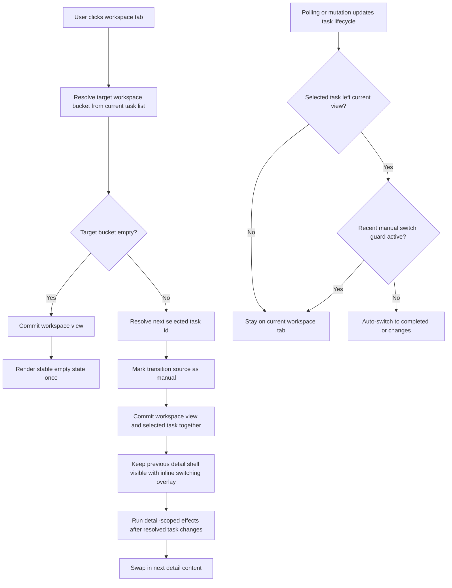

# PRD：顶部工作区 Tab 切换稳定性修复

**原始需求标题**：`点击几个tab的时候,总是出现问题`
**需求名称（AI 归纳）**：`顶部工作区 Tab 切换闪动修复`
**需求背景/上下文**：`点击这几个tab的时候,总是会出现闪动,修复一下`
**附件观察**：已直接检查 `/home/atahang/codes/koda/data/media/original/35f8a643-75db-413a-99b4-be16f88539b9.png`。截图红框明确标出顶部右侧工作区切换条，当前可见文案为 `ACTIVE 0 / COMPLETED 7 / CHANGES 20`，因此本 PRD 默认把问题范围优先收敛到这组 header workspace tabs。
**文件路径**：`tasks/prd-44caa990.md`
**创建时间**：`2026-03-30 CST`
**参考上下文**：`frontend/src/App.tsx`, `frontend/src/index.css`, `frontend/src/types/index.ts`, `frontend/package.json`, `pyproject.toml`, `docs/prototypes/workspace-view-tab-stability-demo.html`

---

## 0. 待确认问题（结构化）

```json
{
  "pending_questions": [
    {
      "id": "scope_tabs",
      "title": "本次修复范围是否仅限顶部 Workspace View tabs（ACTIVE / COMPLETED / CHANGES）？",
      "required": true,
      "recommended_option_key": "header_workspace_only",
      "recommendation_reason": "截图红框与 `frontend/src/App.tsx` 中的 `devflow-view-switch` 一致指向 header 工作区切换条；先收敛到这一处可以降低回归面，并更快验证闪动是否已消失。",
      "options": [
        {
          "key": "header_workspace_only",
          "label": "只修复顶部 Workspace View tabs"
        },
        {
          "key": "all_tab_controls",
          "label": "顺带排查页面内所有 tab 控件"
        },
        {
          "key": "header_and_settings",
          "label": "修复顶部 tabs，并顺带覆盖 SettingsModal tabs"
        }
      ]
    },
    {
      "id": "detail_transition_strategy",
      "title": "点击 tab 时，详情区应采用哪种切换策略？",
      "required": true,
      "recommended_option_key": "preserve_previous_until_next_ready",
      "recommendation_reason": "`frontend/src/App.tsx` 当前通过 `useDeferredValue(selectedTaskId)` 和 `isTaskSelectionPending` 渲染整块“正在切换需求详情...”空态，这正是最容易被感知为闪动的实现。推荐保留上一条详情，直到目标任务 ready 后再替换。",
      "options": [
        {
          "key": "preserve_previous_until_next_ready",
          "label": "保留旧详情，待新详情 ready 后再平滑替换"
        },
        {
          "key": "keep_full_blank_placeholder",
          "label": "继续使用整块空白或占位态过渡"
        },
        {
          "key": "always_select_first_without_transition",
          "label": "直接硬切到目标首条任务，不做过渡"
        }
      ]
    },
    {
      "id": "auto_switch_policy",
      "title": "后台任务状态变更导致任务跨视图移动时，是否继续保留自动切换到 completed/changes 的行为？",
      "required": true,
      "recommended_option_key": "keep_with_manual_guard",
      "recommendation_reason": "`frontend/src/App.tsx` 已有自动跳转 effect，用来处理任务从 active 迁移到 completed/changes 的场景。完全移除会损失现有便利性，推荐保留，但要对用户刚刚手动点击 tab 的窗口加保护，避免竞态闪回。",
      "options": [
        {
          "key": "keep_with_manual_guard",
          "label": "保留自动切换，但对手动点击增加保护窗口"
        },
        {
          "key": "remove_auto_switch",
          "label": "完全取消自动切换，始终尊重当前 tab"
        },
        {
          "key": "show_banner_only",
          "label": "不自动切换，只提示任务已移动到其他视图"
        }
      ]
    },
    {
      "id": "count_refresh_policy",
      "title": "顶部 tab 上的数量是否继续实时刷新？",
      "required": false,
      "recommended_option_key": "live_counts_fixed_width",
      "recommendation_reason": "`frontend/src/index.css` 当前按钮宽度主要由文本长度驱动。推荐继续保留实时数量，但把布局改成固定三列与稳定数字对齐，这样既不牺牲信息密度，也能消除计数变化带来的按钮抖动。",
      "options": [
        {
          "key": "live_counts_fixed_width",
          "label": "继续实时刷新数量，但按钮布局固定宽度"
        },
        {
          "key": "freeze_counts_during_switch",
          "label": "切换过程中冻结数量，切换完成后再更新"
        },
        {
          "key": "hide_counts",
          "label": "去掉 tab 数量，只保留文案标签"
        }
      ]
    }
  ]
}
```

以下 PRD 按推荐选项起草：`header_workspace_only`、`preserve_previous_until_next_ready`、`keep_with_manual_guard`、`live_counts_fixed_width`。

## 1. Introduction & Goals

### 背景

当前项目的前端栈是 `React 18 + TypeScript + Vite`，顶部工作区切换条直接定义在 `frontend/src/App.tsx` 的 header 中，按钮文案来自三组前端派生数据：

- `activeTaskList`
- `completedTaskList`
- `changedTaskList`

代码阅读与截图交叉验证后，可以确认这次问题不是“所有 tab 通用组件都异常”，而是顶部 `ACTIVE / COMPLETED / CHANGES` 工作区切换链路存在明显的闪动风险：

1. 点击 tab 时只设置 `workspaceView`，随后再由 `visibleTaskList`、`selectedTaskId`、`detailTaskId` 级联重算。
2. `selectedTaskId` 经过 `useDeferredValue` 延迟后，`isTaskSelectionPending` 会让详情列整体切成“正在切换需求详情...”空态。
3. 依赖 `[workspaceView, detailTaskId]` 的副作用会在切换时同步清空时间线、调度面板、展开状态与输入草稿，进一步强化“先清空后回填”的观感。
4. 现有 auto-switch effect 会在选中任务因生命周期变化离开当前视图时强制切到 `completed` 或 `changes`；如果与用户刚刚的手动点击竞态发生，就可能造成闪回。
5. 顶部 tab 目前是 `inline-flex` 自适应宽度，数量变化时可能引发 pill 宽度抖动，加重“闪动”感。

本需求的核心不是重做数据模型，而是重构前端切换时机与视觉承载方式：让 workspace view 的切换对用户来说始终是稳定、连续、可预期的。

### 目标

- [ ] 用户手动点击顶部 `ACTIVE / COMPLETED / CHANGES` 时，详情区不再出现整块空白闪现。
- [ ] 当目标视图存在任务时，系统在新任务 ready 前保留旧详情，并以轻量覆盖态而不是整页空态过渡。
- [ ] 当目标视图为空时，只渲染一次稳定空态，不出现“空态 → 内容 → 空态”或“内容 → 空态 → 内容”的抖动。
- [ ] 后台任务跨视图迁移时，继续支持自动跟随到 `completed`/`changes`，但不能抢掉用户刚刚的手动 tab 选择。
- [ ] 顶部 tab 的数量可以继续实时刷新，但按钮宽度和数字对齐必须稳定，避免视觉跳动。
- [ ] 本期不改后端 API、数据库 schema 和任务工作流枚举。

## 2. Implementation Guide

### 核心逻辑

推荐的最小实现路径如下：

1. 把 workspace 切换的“目标视图”和“目标选中任务”视为同一笔前端事务，而不是先切 `workspaceView` 再靠后续 effect 兜底选中任务。
2. 在 `frontend/src/App.tsx` 之外抽出纯函数工具，例如 `frontend/src/utils/workspace_view.ts`，集中表达：
   - 各视图 bucket 的筛选规则；
   - 手动切换后的首个选中任务解析规则；
   - auto-switch 是否应该生效的判定规则。
3. 删除或收窄 `isTaskSelectionPending` 对整块 detail 空态的控制范围，改为在已有 detail surface 内显示轻量覆盖提示；若目标视图为空，再展示真正的 empty state。
4. 让“清空日志列表、调度面板、展开状态、composer 草稿”等副作用只在“解析出的 selected task 真正变更”或“新视图确认为空”时执行，而不是每次原始 `workspaceView` 变化都立即执行。
5. 为手动 tab 点击增加来源标记或短暂保护窗口，例如 `lastManualWorkspaceSwitchAt` / `workspaceViewChangeSource`，避免 auto-switch effect 与手动点击抢写 `workspaceView`。
6. 把顶部 tab 的布局从内容驱动宽度改成固定三列，并给数量单独的对齐容器，消除计数位数变化带来的横向抖动。
7. 为上述状态机补纯函数回归测试，保证后续继续扩展 dashboard 时不会重新引入闪动。

### 2.1 Change Matrix

| Change Target | Current State | Target State | How to Modify | Affected Files |
|---|---|---|---|---|
| Workspace view 切换事务 | 点击 header tab 时仅 `setWorkspaceView(viewName)`，后续再靠 effect 推导 `selectedTaskId` | 手动切换时同步解析目标 bucket 与目标 `selectedTaskId`，避免“先切视图再清空详情” | 抽出纯函数解析器，统一处理 `active/completed/changes` bucket 与默认选中任务；header click 与程序化切换共用这套逻辑 | `frontend/src/App.tsx`, `frontend/src/utils/workspace_view.ts` |
| Detail 列过渡策略 | `isTaskSelectionPending` 会让 detail 列切成整块“正在切换需求详情...”空态 | 目标视图有任务时保留旧详情，显示轻量 overlay；仅在目标视图为空时显示真正的 empty state | 收窄 pending 分支的渲染范围，保留旧的 detail shell，待目标任务 ready 后再替换内容 | `frontend/src/App.tsx`, `frontend/src/index.css` |
| Workspace 相关副作用重置 | 依赖 `[workspaceView, detailTaskId]` 的 effect 会在切换时一次性清空多块 detail-scoped UI 状态 | 只有“resolved selected task 真变了”或“目标视图确认为空”时才重置相关面板 | 使用 `useRef` 记录上一个 resolved task id / view signature，避免在 manual switch 第一拍就全量 reset | `frontend/src/App.tsx` |
| Auto-switch 竞态控制 | 选中任务离开当前视图后，会立刻自动跳到 `completed` 或 `changes`，可能与手动 tab 点击冲突 | 保留 auto-switch，但只在无近期手动切换、且确认为真实生命周期迁移时生效 | 引入 `workspaceViewChangeSource` 或短暂保护窗口；把是否 auto-switch 的判定下沉到纯函数工具 | `frontend/src/App.tsx`, `frontend/src/utils/workspace_view.ts` |
| Header tab 视觉稳定性 | `inline-flex` + 文案长度驱动宽度，数量变化时容易引发 pill 抖动 | 三个 tab 固定布局、数字独立对齐，选中态不造成整体宽度变化 | 调整 `.devflow-view-switch` 与 `.devflow-view-switch__button` 样式；必要时拆出 label/count span | `frontend/src/App.tsx`, `frontend/src/index.css` |
| 回归测试 | 当前没有专门覆盖 workspace tab 状态机与 auto-switch guard 的测试 | 增加纯函数测试，验证 manual switch、empty view、auto-switch guard 与 count layout 输入输出 | 采用现有 `frontend/tests/*.test.ts` 轻量 Node 测试模式，为 workspace view helper 建回归 | `frontend/tests/workspace_view.test.ts`, `frontend/src/utils/workspace_view.ts` |
| 原型与文档 | 当前没有专门演示 tab 闪动与稳定切换差异的原型 | 新增稳定性 demo，并挂到 MkDocs 导航 | 新建交互原型页面；更新 `mkdocs.yml`；保留 PRD 中的 change log 与链接 | `docs/prototypes/workspace-view-tab-stability-demo.html`, `mkdocs.yml`, `tasks/prd-44caa990.md` |

### 2.2 Flow Diagram



### 2.3 Low-Fidelity Prototype

```text
┌──────────────────────────────────────────────────────────────────────────────┐
│ Header                                                                       │
│  [ ACTIVE 3 ] [ COMPLETED 7 ] [ CHANGES 20 ]                                 │
├──────────────────────────────────────────────────────────────────────────────┤
│ Workspace Grid                                                               │
│                                                                              │
│  Requirement List                    Detail                                  │
│  ┌──────────────────────┐            ┌────────────────────────────────────┐  │
│  │ Task A               │            │ Workspace Tab Stability            │  │
│  │ Task B               │            │ 当前详情内容保持可见               │  │
│  │ Task C               │            │ ────────────────────────────────   │  │
│  └──────────────────────┘            │ [Switching…] 轻量 overlay          │  │
│                                      │ 新视图 ready 后再替换内容          │  │
│                                      └────────────────────────────────────┘  │
│                                                                              │
│  若目标 tab 为空：显示一次稳定 empty state，不先闪旧内容或骨架屏             │
└──────────────────────────────────────────────────────────────────────────────┘
```

### 2.4 ER Diagram

本需求不涉及数据库或持久化结构变更，因此不新增 ER 图。现有 `Task.lifecycle_status`、`Task.workflow_stage`、`DevLog` 继续作为前端派生 workspace buckets 的输入源。

### 2.8 Interactive Prototype Change Log

| File Path | Change Type | Before | After | Why |
|---|---|---|---|---|
| `docs/prototypes/workspace-view-tab-stability-demo.html` | Add | 不存在 workspace tab 稳定性演示页 | 新增并排对照原型，同时演示“当前空白闪动”与“目标稳定切换” | 让 PRD 对“闪动”问题有可评审的行为基线 |
| `mkdocs.yml` | Modify | 原型导航中没有对应入口 | 增加 `工作区 Tab 稳定性 Demo` 导航项 | 让新原型可通过文档导航直接访问 |

### 2.9 Interactive Prototype Link

- `docs/prototypes/workspace-view-tab-stability-demo.html`

## 3. Global Definition of Done (DoD)

- [ ] Typecheck and Lint passes
- [ ] Verify visually in browser (if UI related)
- [ ] Follows existing project coding standards
- [ ] No regressions in existing features
- [ ] 手动点击 `ACTIVE / COMPLETED / CHANGES` 时，若目标视图有任务，detail 区不再出现整块空白闪现
- [ ] 目标视图为空时，只展示一次稳定 empty state，不出现反复抖动
- [ ] 后台真实生命周期迁移仍可把任务导向 `completed`/`changes`，但不会抢掉用户刚刚的手动点击
- [ ] 顶部 tab 数量实时更新时，不出现明显的 pill 宽度跳变
- [ ] `npm --prefix frontend run build` 通过
- [ ] `frontend/tests/workspace_view.test.ts` 通过
- [ ] `just docs-build` 通过

## 4. User Stories

### US-001：手动切换 Workspace Tab 时详情稳定

**Description:** 作为正在浏览需求卡片的用户，我希望点击顶部 `ACTIVE / COMPLETED / CHANGES` 时，右侧详情区域保持稳定，这样我能持续感知上下文，而不会被闪白或整块空态打断。

**Acceptance Criteria:**
- [ ] 当目标 tab 含有至少一条任务时，点击后 detail 区保留上一条内容，直到新的选中任务 ready
- [ ] 过渡期间只允许出现轻量 overlay 或局部 loading，不允许整块 detail 列被空态替换
- [ ] 新视图落定后，列表与详情同时指向同一条目标任务

### US-002：后台状态迁移不与手动点击互相抢视图

**Description:** 作为用户，我希望系统仍然能在任务真正完成或进入变更视图时自动跟随，但这类自动切换不能和我刚刚的 tab 点击冲突，导致界面闪回。

**Acceptance Criteria:**
- [ ] 真实生命周期迁移仍可触发 auto-switch 到 `completed` 或 `changes`
- [ ] 若用户刚刚手动点击过其他 tab，auto-switch 必须在保护窗口内让位，避免抢写 `workspaceView`
- [ ] 若 auto-switch 被保护窗口拦截，当前视图保持稳定，不发生闪回

### US-003：实时计数不再放大“闪动”感

**Description:** 作为用户，我希望顶部 tab 上的任务数量继续可见，但数字变化不应该造成按钮抖动或 header 布局跳动。

**Acceptance Criteria:**
- [ ] 三个 tab 使用稳定布局，不因数字位数变化而改变整体宽度
- [ ] 数量与标签分开对齐，选中态高亮不会影响相邻按钮位置
- [ ] 视觉回归检查覆盖 `0`、`7`、`20` 等不同位数的组合

## 5. Functional Requirements

1. FR-1：顶部 header 的 workspace view 切换必须仅针对 `ACTIVE / COMPLETED / CHANGES` 这组三态视图实现稳定切换。
2. FR-2：手动点击 workspace tab 时，前端必须在同一笔状态变更中解析目标视图 bucket 与目标 `selectedTaskId`。
3. FR-3：当目标视图包含任务时，detail 区必须保留旧内容直到新任务 ready，不能先渲染整块空态。
4. FR-4：当目标视图为空时，系统必须直接渲染稳定 empty state，并只在该视图确认为空后清空 detail-scoped 本地状态。
5. FR-5：`workspaceView` 相关的 auto-switch 逻辑必须区分“用户手动点击”与“后台生命周期迁移”，并为手动点击提供保护窗口或等价 guard。
6. FR-6：detail 侧的日志、调度、展开态和输入草稿重置逻辑必须以“resolved selected task 变化”为主触发条件，而不是每次原始 `workspaceView` 改变都触发。
7. FR-7：顶部 tab 必须使用稳定布局；数量继续实时刷新时，不得造成明显的按钮宽度抖动或相邻按钮位置漂移。
8. FR-8：本期不新增后端 API，不修改数据库 schema，不调整 `Task`/`DevLog` 数据合同。
9. FR-9：必须新增前端回归测试，覆盖 manual switch、empty view、auto-switch guard 和 bucket 解析逻辑。
10. FR-10：必须保留并提交可交互原型页面，用于评审“当前闪动”和“目标稳定切换”的差异。

## 6. Non-Goals

- 不在本期顺带重构页面内所有其他 tab 控件。
- 不重做 dashboard header 的整体视觉风格或导航结构。
- 不引入新的全局状态管理库、前端路由分屏或后端推送机制。
- 不修改任务生命周期枚举、工作流枚举或数据库查询接口。
- 不以“增加更长 loading 动画”掩盖问题；本期目标是消除整块闪动，而不是包装现有空白过渡。

## 7. Delivery Notes

### 7.1 Delivered Implementation

- `frontend/src/utils/workspace_view.ts`
  - 新增纯函数工具，集中处理 workspace bucket 归类、手动 tab 切换后的默认选中项解析、带手动保护窗口的 auto-switch 判定，以及 empty tab 直出稳定空态所需的 detail 选择逻辑。
- `frontend/src/App.tsx`
  - header tabs 改为一次性提交 `workspaceView + selectedTaskId`，不再只切 view 再靠后续 effect 兜底。
  - 保留 `useDeferredValue(selectedTaskId)`，但把整块 detail 空态改成 detail surface 内的轻量 overlay，旧详情会保留到新详情 ready。
  - 非空 tab 的 deferred 过渡期间，detail overlay 现在会锁住旧详情交互，避免在列表已经切到新任务时仍对旧任务执行按钮操作；旧详情 body 进入 `inert` 状态，并会主动移出仍停留在内部的键盘焦点。
  - 当目标 tab 解析为空 bucket 时，detail 区不再沿用 `deferredSelectedTaskId` 回退旧任务，而是直接渲染稳定空态，消除“左侧已空、右侧旧详情残留一拍”的错位。
  - 将原本依赖 `[workspaceView, detailTaskId]` 的 detail-scoped reset 收窄为仅依赖 `detailTaskId`，避免 tab 切换第一拍就清空详情侧状态。
  - auto-switch 改为复用纯函数判定，并增加 `lastManualWorkspaceSwitchAt` 保护窗口，避免后台状态迁移抢掉刚刚的手动 tab 点击；同时收窄为只跟随到 `completed` / `changes`，不会把 reopened 任务自动拉回 `active`。
- `frontend/src/hooks/useInertSubtree.ts`
  - 新增可复用的 inert-subtree hook，用 `useLayoutEffect` 在 pending 过渡期间同步设置 subtree 的 `inert` 状态，并在焦点仍留在旧详情内时立即 `blur()`。
- `frontend/src/index.css`
  - 将 header tab 拆为独立 `label/count` 结构，桌面端使用稳定宽度和 tabular numbers，减少实时计数带来的 pill 宽度跳动。
  - 为 detail 区增加轻量 transition overlay 样式，而不是整块空态替换。
- `frontend/tests/workspace_view.test.ts`
  - 新增回归覆盖：bucket 解析、manual switch 默认选中项、auto-switch guard、changed/completed 目标视图解析、reopened task 不应自动跳回 `active`、empty tab 立即空态的 detail-selection 路径，以及 pending 过渡期间 `inert + blur` 的 DOM 焦点锁定。
- `frontend/package.json`
  - 新增 `test:workspace-view` 脚本，复用项目现有轻量 Node test 运行方式。
  - 为 DOM 回归测试补充 `jsdom` 开发依赖，并同步更新 `frontend/package-lock.json`。

### 7.2 Verification Evidence

- [x] `npm --prefix frontend run test:workspace-view`
- [x] `npm --prefix frontend run test:prd-pending-questions`
- [x] `npm --prefix frontend run test:selected-task-prd-file`
- [x] `npm --prefix frontend run build`
- [x] `just docs-build`
- [x] `git diff --check -- frontend/package.json frontend/package-lock.json frontend/src/App.tsx frontend/src/hooks/useInertSubtree.ts frontend/src/index.css frontend/src/utils/workspace_view.ts frontend/tests/workspace_view.test.ts`
- [x] self-review blocker 路径复核：empty tab 不再短暂保留旧详情
- [x] self-review blocker 路径复核：pending 过渡期间旧详情 subtree 会进入 `inert` 且旧焦点被移出，reopened task 不会自动跳回 `active`
- [ ] 浏览器内人工视觉验证

### 7.3 Deviations / Notes

- PRD 中提到“固定三列”布局；实际实现采用的是桌面端稳定固定宽度 tab pills 与独立数字对齐，而不是重做整个 header 容器布局。这样改动更小，也足以消除计数位数变化导致的明显抖动。
- 没有顺带重构页面内其他 tab 控件，也没有统一所有程序化 `setWorkspaceView(...)` 入口；本次只收敛到 header workspace tabs、其 auto-switch 链路，以及与之直接耦合的 detail 过渡逻辑。
- 当前会话未启动浏览器做人工视觉验收，因此“消除闪动”的最终 UX 结果仍建议由产品/前端在实际页面中再点测一次。
