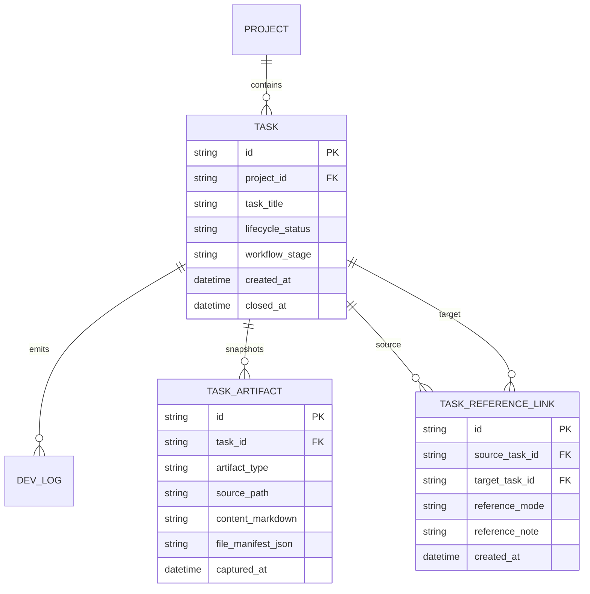

# PRD：项目维度时间线管理与需求卡片联动

**原始需求标题**：能不能加一个时间线管理的内容，按照项目类别来记录所有日志
**需求名称（AI 归纳）**：项目维度时间线管理与需求卡片联动（含状态追踪、PRD/Planning 回溯与 AI 总结）
**文件路径**：`tasks/prd-627540a9.md`
**创建时间**：2026-03-26 23:55:17 CST
**需求背景/上下文**：项目下可记录需求与日志，需在独立页面按项目维度查看时间线；可将历史需求加入当前需求卡片；可识别已完成、已删除、已废弃状态；需展示 PRD 与完整的 planing/planning with files 信息；支持 AI 总结。

---

## 0. 澄清问题（含推荐）

1. “按项目类别”应基于哪套维度？
A. 直接复用现有 `Task.project_id -> Project` 关系
B. 新增“项目类别”自由标签体系
C. 项目 + 标签混合分组
> **Recommended: A**（当前数据模型已具备 `Project` 维度，先以稳定主键聚合，避免新增分类体系导致维护复杂度上升）

2. “已废弃”状态如何表达？
A. 复用 `PENDING`
B. 在 `TaskLifecycleStatus` 新增 `ABANDONED`
C. 复用 `DELETED`
> **Recommended: B**（“暂停/等待”和“明确废弃”语义不同；新增状态后可与“已删除”并存且可过滤）

3. PRD 与 planning with files 信息应如何存储？
A. 每次打开时间线时实时读取 worktree 文件
B. 关键阶段对 PRD 与 planning 文件做快照入库，并保留路径回溯
C. 仅在 DevLog 文本中保留摘要
> **Recommended: B**（任务完成后 worktree 可能被清理；仅实时读文件会导致历史不可追溯）

4. “加入到当前需求卡片”的行为应是什么？
A. 写入一条“引用历史需求”的结构化 DevLog，并可选追加到 `requirement_brief`
B. 直接覆盖当前需求标题和描述
C. 自动克隆为新任务
> **Recommended: A**（风险最小、可追踪、可回滚，且不破坏当前卡片原始内容）

5. AI 总结触发方式应如何设计？
A. 用户在项目时间线页手动触发（支持时间范围/状态过滤）
B. 每次页面加载自动触发
C. 夜间定时批处理
> **Recommended: A**（成本可控，避免频繁调用模型造成延迟与费用放大）

以下 PRD 按推荐选项 A / B / B / A / A 起草。

---

## 1. Introduction & Goals

### 背景

当前系统已具备日志时间线与任务编年史能力（`/api/chronicle/timeline`、`/api/chronicle/task/{id}`），但仍存在缺口：

- 时间线主要是 run account 级别或单任务级别，缺少“项目维度”的独立入口。
- 任务状态可看到 `OPEN/CLOSED/PENDING/DELETED`，但“废弃”语义没有单独状态。
- PRD 可单任务读取，但缺少面向项目时间线的统一回看与对比。
- “planning with files（含 planing 文案兼容）”没有统一结构化展示与持久化快照。
- 不能一键把历史需求上下文注入当前需求卡片。
- 缺少“按项目聚合后”的 AI 摘要能力。

### 可衡量目标

- [ ] 新增独立页面，以项目为主视角浏览时间线，不依赖当前需求详情页。
- [ ] 支持按状态筛选：进行中、已完成、已删除、已废弃。
- [ ] 每条需求在时间线中可查看 PRD 摘要与完整 planning with files 信息。
- [ ] 支持把历史需求引用到当前需求卡片，形成可追踪操作日志。
- [ ] 支持项目级 AI 总结，覆盖指定时间范围和状态过滤条件。
- [ ] 新增能力不破坏现有任务工作流与 PRD 生成链路。

---

## 2. Implementation Guide

### 2.0 技术路径概述

1. 前端新增独立路由页面（建议 `/project-timeline`），提供项目选择、状态筛选、时间范围筛选和时间线列表。
2. 后端扩展 `chronicle` 服务，新增“项目维度聚合”接口，返回任务+日志+工件摘要。
3. 引入任务工件快照（PRD、planning with files）以保证历史可回溯，不依赖 worktree 持久存在。
4. 引入任务引用关系（source task -> target task），用于“加入当前需求卡片”的审计与去重。
5. 增加 AI 总结接口，输入筛选条件，输出结构化摘要（里程碑、风险、建议下一步）。

### 2.1 Change Matrix

| Change Target | Current State | Target State | How to Modify | Affected Files |
|---|---|---|---|---|
| 项目维度时间线 API | 仅有全局 timeline / 单任务 chronicle | 新增项目维度 timeline 查询与详情聚合 | 在 `chronicle` API 与 service 增加按 `project_id` 聚合查询、状态过滤、分页 | `dsl/api/chronicle.py`, `dsl/services/chronicle_service.py` |
| 任务生命周期“废弃”语义 | 仅 `OPEN/CLOSED/PENDING/DELETED` | 新增 `ABANDONED` 并进入前后端过滤逻辑 | 扩展枚举、schema、前端类型与状态展示映射；补兼容迁移 | `dsl/models/enums.py`, `dsl/schemas/task_schema.py`, `frontend/src/types/index.ts`, `utils/database.py` |
| PRD/Planning 工件可追溯 | PRD 可按任务读取；planning with files 无统一快照 | 任务工件入库快照，时间线可稳定回看 | 新增 `task_artifacts` 模型与服务，在关键阶段捕获 PRD/Planning 内容与文件列表 | `dsl/models/task_artifact.py`, `dsl/services/prd_file_service.py`, `dsl/services/chronicle_service.py`, `utils/database.py` |
| 历史需求注入当前卡片 | 无结构化“引用历史需求”动作 | 支持引用并落审计 | 新增引用接口，写入结构化 DevLog，必要时追加 `requirement_brief`；记录关联关系 | `dsl/api/tasks.py`, `dsl/services/task_service.py`, `dsl/models/task_reference_link.py`, `frontend/src/api/client.ts` |
| 独立时间线页面 | 当前主界面以内嵌时间线为主 | 新增项目时间线独立页面 | 引入路由或独立页面组件，支持筛选、详情抽屉、引用动作、AI 总结面板 | `frontend/src/main.tsx`, `frontend/src/App.tsx`, `frontend/src/pages/ProjectTimelinePage.tsx`, `frontend/src/index.css` |
| AI 总结能力 | 无项目级时间线总结入口 | 支持按筛选条件生成总结 | 新增 summary endpoint，返回结构化摘要与关键条目引用 | `dsl/api/chronicle.py`, `dsl/services/chronicle_service.py`, `frontend/src/api/client.ts`, `frontend/src/types/index.ts` |
| 文档与测试 | 无该能力说明 | 完整文档+回归覆盖 | 增加 API、页面、状态与快照机制文档；补后端与前端测试 | `docs/api/references.md`, `docs/guides/dsl-development.md`, `docs/database/schema.md`, `tests/test_chronicle_api.py`, `tests/test_task_service.py` |

### 2.2 Flow Diagram

```mermaid
flowchart TD
    A[User opens /project-timeline] --> B[Select project + filters]
    B --> C[GET project timeline]
    C --> D[Render timeline cards with status badges]

    D --> E[Open task detail drawer]
    E --> F[Read PRD snapshot + planning with files snapshot]

    E --> G[Click "加入当前需求卡片"]
    G --> H[POST task reference]
    H --> I[Create structured DevLog + optional brief append]

    D --> J[Click "AI 总结"]
    J --> K[POST project timeline summary]
    K --> L[Return milestones risks next actions]
```

### 2.3 Low-Fidelity Prototype

```text
/project-timeline
┌─────────────────────────────────────────────────────────────────────┐
│ Header: 项目时间线管理                                              │
│ [Project Select] [Status: 全部/进行中/已完成/已删除/已废弃] [日期]  │
│ [AI 总结]                                                           │
├─────────────────────────────────────────────────────────────────────┤
│ Timeline List (按时间倒序)                                          │
│ - 2026-03-26  Task A  [已完成]  [查看详情] [加入当前需求]           │
│ - 2026-03-25  Task B  [已废弃]  [查看详情] [加入当前需求]           │
│ - 2026-03-24  Task C  [已删除]  [查看详情] [加入当前需求]           │
├─────────────────────────────────────────────────────────────────────┤
│ Detail Drawer                                                       │
│ 1) Requirement Snapshot                                             │
│ 2) PRD Snapshot / Path                                              │
│ 3) Planning with files Snapshot (files list +摘要)                 │
│ 4) Chronicle Logs Preview                                           │
└─────────────────────────────────────────────────────────────────────┘
```

### 2.4 ER Diagram



### 2.5 API Contract（草案）

- `GET /api/chronicle/project-timeline`
参数：`project_id`、`lifecycle_status[]`、`start_date`、`end_date`、`limit`、`offset`
返回：任务级时间线条目，含状态、关键日志统计、PRD/planning 摘要存在性。

- `GET /api/chronicle/project-timeline/{task_id}`
返回：任务详情，含 requirement 快照、PRD 快照、planning with files 快照、日志预览。

- `POST /api/chronicle/project-timeline/summary`
入参：`project_id`、筛选条件、`summary_focus`（progress/risk/decision）
返回：`summary_text`、`milestones[]`、`risks[]`、`next_actions[]`、`source_task_ids[]`。

- `POST /api/tasks/{target_task_id}/references`
入参：`source_task_id`、`append_to_requirement_brief`、`reference_note`
行为：创建 `task_reference_link`，写入结构化 DevLog，可选更新目标任务 `requirement_brief`。

### 2.6 AI 总结输出合同

- 输出必须包含：
1. 项目阶段概览（近况）
2. 已完成事项
3. 风险与阻塞
4. 建议下一步（最多 5 条）
5. 证据任务 ID 列表

- 输出不得包含：
1. 与筛选范围无关的任务
2. 无来源支撑的结论

### 2.8 Interactive Prototype Change Log

No interactive prototype file changes in this PRD.

---

## 3. Global Definition of Done

- [ ] 前端可通过独立页面按项目查看时间线，不依赖当前任务详情页。
- [ ] 支持状态筛选：`OPEN`、`CLOSED`、`DELETED`、`ABANDONED`（含向后兼容）。
- [ ] 项目时间线详情可展示 PRD 与 planning with files（兼容 planing 关键词）完整信息。
- [ ] 点击“加入当前需求卡片”后，目标任务出现结构化引用日志，且可追踪来源任务。
- [ ] AI 总结接口在限定筛选条件下返回结构化摘要，并含来源任务证据。
- [ ] 任务原有流程（PRD 生成、执行、自检、完成）不回归。
- [ ] 新增数据库字段/表完成迁移兼容，旧数据可读。
- [ ] 后端/前端回归测试通过。
- [ ] 文档同步更新并通过 `just docs-build`。

---

## 4. User Stories

### US-001：按项目回看完整时间线

**Description:** 作为项目负责人，我希望在独立页面按项目查看所有需求与日志时间线，这样我能快速理解该项目的历史演进。

**Acceptance Criteria:**
- [ ] 可按项目切换时间线
- [ ] 可按时间和状态过滤
- [ ] 时间线条目包含需求标题、状态、关键时间和日志统计

### US-002：识别已完成/已删除/已废弃需求

**Description:** 作为管理者，我希望明确看到需求处于完成、删除还是废弃，以便做准确的决策复盘。

**Acceptance Criteria:**
- [ ] 状态标签可读且可筛选
- [ ] “废弃”与“删除”语义分离
- [ ] 历史任务在状态变化后仍可检索

### US-003：在时间线中查看 PRD 与 Planning with files

**Description:** 作为执行者，我希望在项目时间线中直接看到每个需求对应的 PRD 和 planning with files 信息，而不是切回任务详情逐个查。

**Acceptance Criteria:**
- [ ] 详情面板显示 PRD 快照或可回溯路径
- [ ] 详情面板显示 planning with files 快照与文件清单
- [ ] worktree 被清理后仍可查看历史快照

### US-004：将历史需求加入当前需求卡片

**Description:** 作为研发人员，我希望把历史需求一键加入当前需求卡片，复用上下文并减少重复录入。

**Acceptance Criteria:**
- [ ] 可从时间线条目触发“加入当前需求卡片”
- [ ] 系统写入结构化引用日志并记录来源任务
- [ ] 可选将摘要追加到当前需求描述

### US-005：项目级 AI 总结

**Description:** 作为团队成员，我希望对项目时间线进行 AI 总结，快速获取里程碑、风险和下一步建议。

**Acceptance Criteria:**
- [ ] 可在筛选后触发 AI 总结
- [ ] 总结结果包含里程碑、风险、下一步建议
- [ ] 总结结果附带来源任务 ID

---

## 5. Functional Requirements

1. **FR-1**：系统必须提供独立于当前任务详情页的项目时间线页面。
2. **FR-2**：系统必须支持按 `project_id` 查询时间线，并支持时间范围与分页。
3. **FR-3**：系统必须支持按任务生命周期状态过滤，至少覆盖 `OPEN`、`CLOSED`、`DELETED`、`ABANDONED`。
4. **FR-4**：系统必须在后端新增 `ABANDONED` 生命周期状态并确保前后端枚举一致。
5. **FR-5**：时间线列表必须展示任务基础信息（标题、状态、创建/更新时间、日志数量）。
6. **FR-6**：系统必须为任务提供 PRD 快照读取能力，优先读快照，缺失时回退文件路径读取。
7. **FR-7**：系统必须为任务提供 planning with files 快照读取能力，并返回文件清单。
8. **FR-8**：系统必须持久化 PRD 与 planning 快照，避免依赖 worktree 持久存在。
9. **FR-9**：系统必须提供任务时间线详情接口，包含 requirement、PRD、planning、日志预览。
10. **FR-10**：系统必须提供“引用历史需求到当前需求”的写接口。
11. **FR-11**：引用动作必须记录来源任务 ID、目标任务 ID、操作时间与操作人上下文。
12. **FR-12**：引用动作必须写入结构化 DevLog，确保时间线可审计。
13. **FR-13**：系统必须支持可选“追加到当前 `requirement_brief`”且不得默认覆盖原文。
14. **FR-14**：系统必须提供项目时间线 AI 总结接口，并支持筛选条件输入。
15. **FR-15**：AI 总结输出必须包含里程碑、风险、下一步建议与来源任务 ID。
16. **FR-16**：前端页面必须提供项目选择、状态筛选、时间范围筛选、详情抽屉、引用按钮、AI 总结入口。
17. **FR-17**：系统必须为新增能力补齐后端接口测试与前端关键交互测试。
18. **FR-18**：文档必须同步更新（API、数据模型、开发指南），并在交付前通过 `just docs-build`。

---

## 6. Non-Goals

- 不在本期重构现有任务主页面的信息架构。
- 不在本期实现跨项目的自动依赖图谱分析。
- 不在本期实现“自动克隆历史需求为新任务”的批量能力。
- 不在本期引入复杂权限系统（如多角色 ACL）。
- 不在本期替换现有 PRD 生成机制，仅补充时间线消费与快照能力。

---

## 7. Delivery Update（2026-03-27）

### 7.1 Delivered Scope

- 已新增项目维度时间线接口：列表、任务详情、结构化总结。
- 已新增独立前端页面 `/project-timeline`，支持项目选择、状态筛选、日期筛选、详情查看、历史需求引用和总结展示。
- 已新增持久化 `Project.project_category` 字段，项目面板可维护类别，时间线页可按类别跨项目浏览。
- 已扩展项目时间线条目与详情返回值，携带项目名称与项目类别元数据，便于跨项目类别视角下识别来源。
- 已为任务生命周期新增 `ABANDONED`，并打通前后端枚举、筛选展示与主界面操作入口。
- 已新增 `TaskArtifact` 快照模型，支持 `PRD` 与 `PLANNING_WITH_FILES` 两类工件。
- 已支持把历史任务引用到当前需求卡片，并通过持久化 `TaskReferenceLink` + 结构化 `DevLog` 实现审计与去重，可选追加到目标任务 `requirement_brief`。

### 7.2 Artifact Snapshot Behavior

- `PRD` 快照会优先从任务 worktree 的 `tasks/prd-{task_id[:8]}.md` 读取，并在 PRD 生成后及任务完成前固化入库。
- `PLANNING_WITH_FILES` 快照会优先从任务 worktree 的 `.claude/planning/current/task_plan.md`、`findings.md`、`progress.md` 读取，兼容旧根目录 planning 文件。
- 若 worktree 中不存在 planning 文件，则回退到历史 `DevLog` 中包含 `planning with files` / `planing with files` 的摘要文本。
- 任务详情读取会优先刷新当前 worktree 快照；任务完成前也会主动固化一次，避免后续清理 worktree 后历史不可追溯。

### 7.3 Verification Evidence

- `UV_CACHE_DIR=/tmp/uv-cache uv run pytest tests/test_project_timeline_api.py tests/test_task_service.py -q` -> `13 passed`
- `UV_CACHE_DIR=/tmp/uv-cache uv run pytest tests/test_tasks_api.py tests/test_timezone_contract.py tests/test_database.py -q` -> `18 passed`
- `UV_CACHE_DIR=/tmp/uv-cache uv run pytest tests/test_project_timeline_api.py tests/test_tasks_api.py -q` -> `17 passed`
- `python -m py_compile dsl/api/chronicle.py dsl/api/tasks.py dsl/models/task_artifact.py dsl/schemas/chronicle_schema.py dsl/schemas/task_schema.py dsl/services/chronicle_service.py dsl/services/task_service.py utils/database.py` -> pass
- `python -m py_compile dsl/services/chronicle_service.py dsl/services/codex_runner.py tests/test_project_timeline_api.py` -> pass
- `npm run build`（`frontend/`） -> pass
- `UV_CACHE_DIR=/tmp/uv-cache uv run mkdocs build --strict` -> pass

### 7.4 Deviations And Notes

- 项目级“AI 总结”当前为规则驱动的结构化总结实现，先满足页面与接口合同，尚未接入真实 LLM 调用。
- 本次 follow-up 根据最新需求把“按项目类别”从概念约定提升为真实持久字段：新增 `project_category` 并把时间线查询扩展为“单项目 + 按类别跨项目”双视角。

### 7.5 Follow-up Verification Update（2026-03-27）

- `uv run pytest tests/test_project_service.py tests/test_project_timeline_api.py tests/test_database.py -q` -> `13 passed`
- `cd frontend && npm run build` -> pass
- `just docs-build` -> pass

### 7.6 Review-Fix Update（2026-03-27）

- 修复了项目时间线日期筛选口径：任务是否保留改为基于筛选窗口内的实际活动（创建、阶段更新时间、关闭时间、日志时间），同时 `total_logs`、`bug_count`、`fix_count` 只统计窗口内日志。
- 修复了时间线页默认状态筛选漏掉 `PENDING` 的问题，并把默认状态集收敛为前端共享常量，避免页面和摘要请求再次分叉。
- 补充回归覆盖：
  - `tests/test_project_timeline_api.py` 新增日期窗口统计语义测试，验证“窗口内有日志、窗口外关闭”的任务不会被错误过滤，且日志统计按窗口收敛。
  - `tests/test_project_timeline_api.py` 新增摘要日期窗口测试，验证风险总结使用窗口内日志统计而不是全历史统计。
  - `tests/test_project_timeline_api.py` 新增前端默认状态集静态契约测试，验证 `PROJECT_TIMELINE_DEFAULT_STATUS_FILTER_LIST` 包含 `PENDING` 且页面复用该常量。
- 验证结果：
  - `uv run pytest tests/test_project_timeline_api.py tests/test_project_service.py tests/test_database.py -q` -> `16 passed`
  - `cd frontend && npm run build` -> pass
  - `just docs-build` -> pass

### 7.7 Blocker Remediation Update（2026-03-27）

- 修复了“加入当前需求卡片”的审计与去重缺口：新增持久化 `TaskReferenceLink` 模型，`POST /api/tasks/{target_task_id}/references` 现在会先查重，再仅在首次 `source -> target` 关系建立时写入结构化 `TRANSFERRED` 日志，并保证 `requirement_brief` 附录只追加一次。
- 修复了 `ABANDONED` 仅存在于枚举/筛选层的问题：主界面详情操作区新增 `Abandon` 入口，用户现在可以显式把需求卡片转入“已废弃”历史，而不再只能走“完成/删除”。
- 补充回归覆盖：
  - `tests/test_project_timeline_api.py` 新增任务引用幂等测试，验证重复引用不会再生成重复 `DevLog`、重复 `TaskReferenceLink` 或重复需求附录。
  - `tests/test_project_timeline_api.py` 新增主界面静态契约测试，验证 `ABANDONED` 在 `frontend/src/App.tsx` 中有实际 handler、状态写入和按钮入口。
  - `tests/test_database.py` 扩展数据库自举断言，验证新表 `task_reference_links` 会随 schema 一起创建。
- 验证结果：
  - `UV_CACHE_DIR=/tmp/uv-cache uv run pytest tests/test_project_timeline_api.py tests/test_project_service.py tests/test_database.py -q` -> `20 passed`
  - `cd frontend && npm run build` -> pass
  - `just docs-build` -> pass

### 7.8 Blocker Follow-up Update（2026-03-27）

- 修复了 `POST /api/tasks/{target_task_id}/references` 的超长错误路径：在追加 `requirement_brief` 之前先做长度预检，优先写入完整引用附录，放不下时退化为紧凑版引用附录，若连紧凑版也无法容纳则直接返回 `422`，避免把数据库列上限问题暴露成 `500`。
- 该预检发生在创建 `TaskReferenceLink` / `TRANSFERRED` 审计日志之前，因此“没有空间可追加”的失败场景不会留下半成功的引用关系或重复日志。
- 补充回归覆盖：
  - `tests/test_project_timeline_api.py` 新增超长来源摘要测试，验证接口会退化为紧凑版 requirement appendix 且总长度仍受 `5000` 字符上限保护。
  - `tests/test_project_timeline_api.py` 新增无剩余空间测试，验证接口返回 `422` 且不会留下 `TaskReferenceLink`、`TRANSFERRED` 日志或脏写的 `requirement_brief`。
