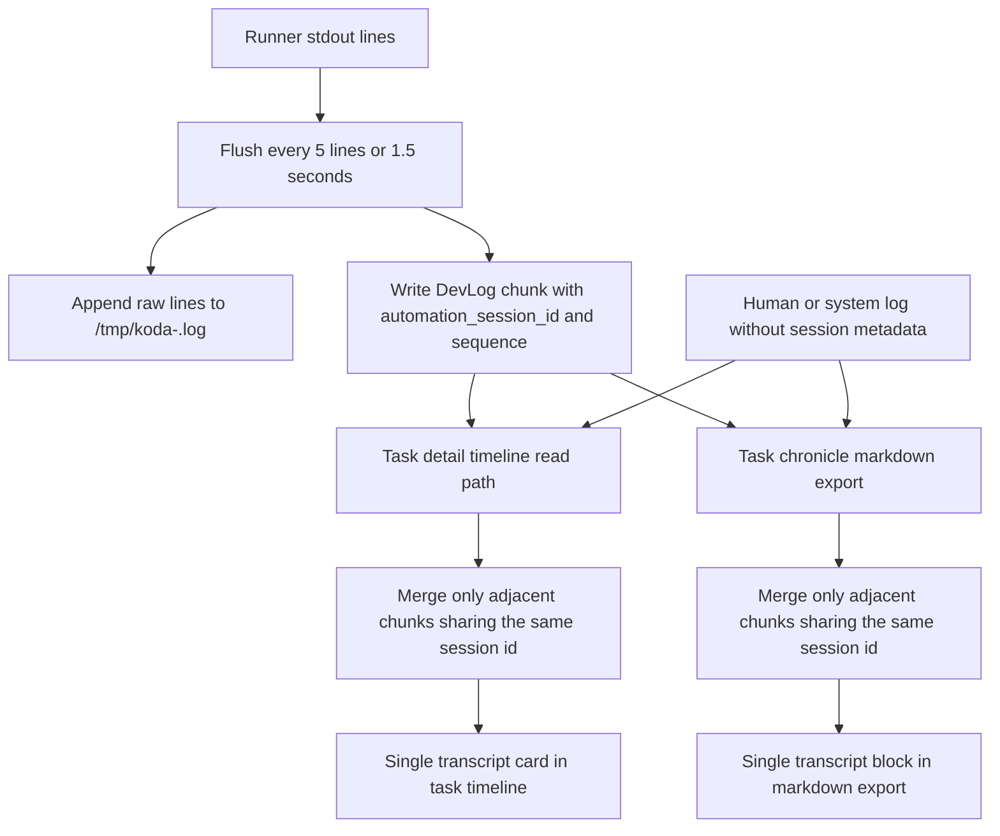
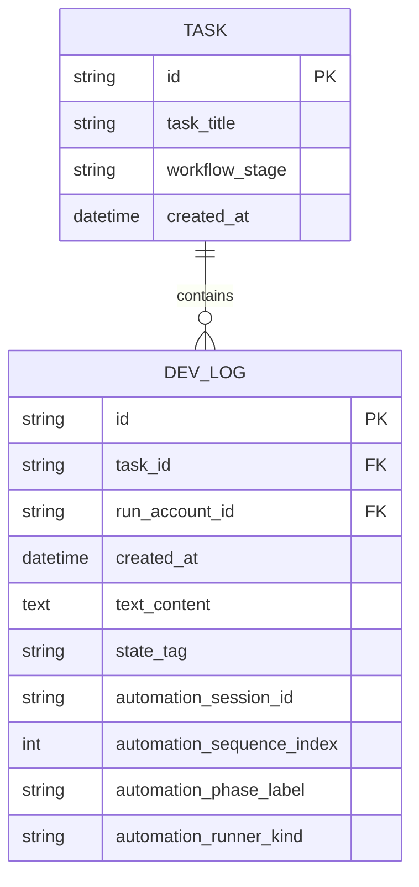

# PRD：修复自动化日志连续性与导出保真

**原始需求标题**：修复日志内容不连贯的问题
**需求名称（AI 归纳）**：自动化日志连续转录修复：恢复任务时间线与编年史导出的连续性、保真度与可读性
**文件路径**：`tasks/prd-770ea9aa.md`
**创建时间**：2026-03-30 16:44:20 CST
**附件信息**：无。本次输入未包含 `Attached local files:` 段落。
**已确认决策**：
- 历史回填策略：仅修复新日志，不处理旧数据。
- 连续转录分组展示面：任务时间线与编年史导出。
**需求背景/上下文**：
- 不替换 `DevLog` 作为统一时间线事实源。
- 不移除 `/tmp/koda-<task短ID>.log` 作为本地实时日志文件。
- 不改写 Codex/Claude runner 的 prompt 合同或执行命令。
- 不引入 token 级别流式存储或完整终端录屏。
- 不要求首版必须完成历史所有碎片日志的全量回填迁移。
- 不在本需求中重做整套时间线视觉风格，只修复连续性、保真度与可读性。
**参考上下文**：`dsl/services/codex_runner.py`, `dsl/models/dev_log.py`, `dsl/schemas/dev_log_schema.py`, `dsl/api/logs.py`, `dsl/services/chronicle_service.py`, `utils/database.py`, `frontend/src/App.tsx`, `frontend/src/types/index.ts`, `tests/test_codex_runner.py`, `tests/test_logs_api.py`, `tests/test_timezone_contract.py`, `docs/architecture/system-design.md`, `docs/guides/codex-cli-automation.md`

---

## 1. Introduction & Goals

### 1.1 背景

当前自动化链路会把 runner 标准输出按“每 5 行或 1.5 秒”批量 flush 成多条 `DevLog`。这保证了数据库写入频率可控，也保留了 `/tmp/koda-<task短ID>.log` 的实时 tail 体验，但会带来两个直接问题：

- 同一轮连续输出在任务时间线中被切成多条碎片，阅读时缺少明确的连续边界。
- `ChronicleService.export_markdown(task_id=...)` 逐条导出 `DevLog`，导致本应是一段连续执行转录的内容被拆成多个小节，保真度和可读性下降。

当前前端 `frontend/src/App.tsx` 里的 compact group 主要靠文本关键词和相邻项启发式聚合，无法恢复“这些碎片原本属于同一轮自动化输出”的事实；而 `DevLog` 本身又必须继续作为统一时间线事实源，所以首版修复应采用“保留原子事实，补充连续转录元数据，在读取侧按显式元数据重组”的方案。

### 1.2 可衡量目标

- 新产生的自动化输出在任务时间线中应按单次连续转录展示，而不是按 flush 批次展示。
- 任务级 Markdown 编年史导出应把同一连续转录合并为单个导出块，并保留原始行序与换行。
- `DevLog` 原子记录、现有 `created_after` 增量拉取语义、`/tmp/koda-<task短ID>.log` 行级实时日志语义保持不变。
- 首版不回填历史碎片日志；旧数据允许继续以原始碎片形式呈现。
- 本次改动不改变 Codex/Claude runner prompt、命令行调用合同和执行目录选择逻辑。

## 2. Implementation Guide

### 2.1 Change Matrix

| Change Target | Current State | Target State | How to Modify | Affected Files |
|---|---|---|---|---|
| `DevLog` 数据模型 | 只有 `created_at`、`text_content`、`state_tag` 等基础字段，无法表达“同一连续转录” | 为新自动化输出增加连续转录元数据 | 在 `DevLog` 新增可空字段：`automation_session_id`、`automation_sequence_index`、`automation_phase_label`、`automation_runner_kind` | `dsl/models/dev_log.py`, `dsl/schemas/dev_log_schema.py` |
| SQLite 轻量迁移 | 通过 `utils/database.py` 的增量 patch 补列与索引 | 新字段可在现有数据库上前向上线，无历史回填 | 在 `_INCREMENTAL_SCHEMA_PATCHES` 增加 `ALTER TABLE dev_logs ADD COLUMN ...` 和组合索引；不执行旧数据回填 | `utils/database.py` |
| Runner 输出落库 | `_run_codex_phase(...)` 只把 flush 后的文本写为普通 `DevLog` | 同一 phase attempt 的每个 flush chunk 共享同一个 session id，并带有顺序号 | 在 `_run_codex_phase(...)` 每次 attempt 创建一个 `automation_session_id`，每次 flush 自增 `automation_sequence_index`，调用 `_write_log_to_db(...)` 时一起写入 | `dsl/services/codex_runner.py` |
| DevLog API 合同 | `/api/logs` 只返回现有日志字段 | 任务时间线可拿到连续转录元数据 | 扩展 `DevLogResponseSchema` 与 API 序列化；保持字段可选、兼容旧客户端 | `dsl/api/logs.py`, `dsl/schemas/dev_log_schema.py` |
| 任务时间线渲染 | `App.tsx` 依赖关键词与相邻项启发式 compact group，无法准确恢复连续 transcript | 对带 session 元数据的自动化日志做显式连续转录聚合；其他日志继续沿用现有行为 | 在任务详情时间线构建链路中先按 `automation_session_id` + 邻接性合并连续 chunk，再进入现有卡片/分组渲染 | `frontend/src/App.tsx`, `frontend/src/types/index.ts` |
| 编年史导出 | `ChronicleService._export_task_markdown(...)` 逐条输出 `DevLog` | 任务级导出把同一连续 transcript 合并为单个 Markdown 块 | 在导出前构造 task-level transcript block 列表；同组 chunk 合并正文、时间范围和 phase 标识 | `dsl/services/chronicle_service.py` |
| 向后兼容策略 | 所有历史日志都只有碎片记录 | 新日志修复，旧日志保持原样 | 所有分组逻辑仅在存在 `automation_session_id` 时生效；无元数据日志不做历史 read-time 回补 | `dsl/services/chronicle_service.py`, `frontend/src/App.tsx` |
| 测试与文档 | 现有测试未覆盖连续转录元数据与 grouped export | 为新合同增加后端、前端、导出回归 | 新增/更新 runner、logs API、chronicle export、前端时间线聚合测试；同步系统设计与自动化文档 | `tests/test_codex_runner.py`, `tests/test_logs_api.py`, `tests/test_timezone_contract.py`, `frontend/tests/task_timeline_continuity.test.ts`, `docs/architecture/system-design.md`, `docs/guides/codex-cli-automation.md`, `docs/api/references.md` |

### 2.2 Flow Diagram



### 2.3 Low-Fidelity Prototype

```text
+----------------------------------------------------------------------------------+
| 16:32-16:34  Codex Implementation Transcript                                     |
| runner=codex  phase=codex-exec  3 chunks merged  42 lines                        |
|----------------------------------------------------------------------------------|
| > inspect dsl/services/codex_runner.py                                           |
| > update dsl/models/dev_log.py                                                   |
| > update frontend/src/App.tsx                                                    |
| > run uv run pytest tests/test_codex_runner.py -q                                |
| ...preserve original line breaks and output ordering...                          |
|                                                                  [复制] [展开]   |
+----------------------------------------------------------------------------------+
| 16:35  用户反馈：请确认 chronicle 导出是否也连续                                  |
+----------------------------------------------------------------------------------+
| 16:36-16:37  Codex Self Review Transcript                                        |
| runner=codex  phase=codex-review  2 chunks merged  18 lines                      |
+----------------------------------------------------------------------------------+
```

说明：

- 连续 transcript 卡片是“读模型聚合结果”，不是替代 `DevLog` 原子记录。
- 一旦中间插入用户反馈或系统事件，前后 transcript 在时间线上必须断开显示，保持真实时序。

### 2.4 ER Diagram



说明：

- 新增字段全部为 nullable，保证旧数据与人工日志不受影响。
- `automation_session_id` 只用于“同一连续 transcript”的前向写入标记，不引入新的事实表。

### 2.5 Core Logic

#### 2.5.1 写入侧

1. `_run_codex_phase(...)` 在每次 phase attempt 启动时生成一个新的 `automation_session_id`。
2. 该 attempt 内每次 flush 时写入一条 `DevLog`，并携带：
   - `automation_session_id`
   - `automation_sequence_index`，从 `1` 开始递增
   - `automation_phase_label`，直接复用当前 phase 标签，如 `codex-exec`、`codex-review`
   - `automation_runner_kind`，记录 `codex` 或 `claude`
3. `runner_context_log_text`、取消日志、失败日志、命令级摘要日志等继续按普通 `DevLog` 写入，相关元数据保持 `NULL`。
4. `/tmp/koda-<task短ID>.log` 继续逐行写入，保持 tail 语义不变。

#### 2.5.2 读取侧

任务时间线的连续转录聚合遵循以下规则：

- 仅对存在 `automation_session_id` 的日志生效。
- 仅合并“相邻且 session id 相同”的日志；如果中间插入其他 `DevLog`，必须断开为两个 transcript block。
- 合并时正文使用 `automation_sequence_index` 排序，再按 `created_at` / `id` 兜底，确保稳定顺序。
- 合并后保留：
  - 起止时间
  - `automation_phase_label`
  - `automation_runner_kind`
  - chunk 数量
  - 合并后的完整正文
- 无元数据日志继续进入现有渲染链路，不做历史启发式回补。

#### 2.5.3 导出侧

`ChronicleService._export_task_markdown(...)` 的任务级导出应改为：

- 先读取任务所有 `DevLog`
- 构建“导出块”列表
- 对连续 transcript 输出单个二级标题和一个正文块，而不是一个 chunk 一个标题
- 标题中展示时间范围和 phase 信息，例如：
  - `## 🤖 [2026-03-30 16:32:10 - 16:34:02 UTC+08:00] codex-exec`
- 正文保留 chunk 原始换行，不做摘要式压缩

首版仅覆盖：

- 任务详情页时间线
- `task_id` 维度的编年史 Markdown 导出

首版不覆盖：

- 全局 `/api/chronicle/timeline`
- `frontend/src/components/ChronicleView.tsx` 的原始逐条日志 UI

### 2.6 API, Schema, and Migration Notes

#### 2.6.1 DevLog 响应新增可选字段

| Field | Type | Meaning |
|---|---|---|
| `automation_session_id` | `str | null` | 单次连续 transcript 的稳定分组键 |
| `automation_sequence_index` | `int | null` | transcript 内 chunk 顺序 |
| `automation_phase_label` | `str | null` | phase 标签，如 `codex-exec` |
| `automation_runner_kind` | `str | null` | 输出来源 runner，如 `codex` / `claude` |

这些字段必须保持可选，避免破坏已有 API 消费者。

#### 2.6.2 数据库迁移策略

- 使用 `utils/database.py` 现有增量 patch 机制追加列和索引。
- 不新增独立迁移框架。
- 不对历史 `dev_logs` 执行脚本回填。
- 仅保证补丁上线后产生的新自动化日志具备连续转录元数据。

建议新增索引：

- `idx_dev_logs_task_automation_session` on `(task_id, automation_session_id, automation_sequence_index)`

### 2.7 Validation, Testing, and Docs Sync

#### 2.7.1 测试

- `tests/test_codex_runner.py`
  - 断言同一 phase attempt 生成稳定的 `automation_session_id`
  - 断言 flush chunk 的 `automation_sequence_index` 单调递增
- `tests/test_logs_api.py`
  - 断言 `/api/logs` 返回新增可选字段
  - 断言 `created_after` 增量拉取与新增元数据并存时行为不变
- `tests/test_timezone_contract.py`
  - 断言 task chronicle markdown export 在 grouped transcript 下仍保持时区格式正确
- `frontend/tests/task_timeline_continuity.test.ts`
  - 断言同 session 且相邻的自动化日志被聚合
  - 断言被人工日志打断时分裂为两个 transcript block
  - 断言无元数据旧日志保持原样

#### 2.7.2 文档

需要同步更新：

- `docs/architecture/system-design.md`
  - 明确“DevLog 仍是事实源，连续 transcript 是读取侧聚合结果”
- `docs/guides/codex-cli-automation.md`
  - 明确 runner 输出仍按 flush 落 `DevLog`，但新日志会带连续转录元数据
- `docs/api/references.md`
  - 补充 `DevLog` 新字段和导出语义变化

### 2.8 Interactive Prototype Change Log

No interactive prototype file changes in this PRD.

## 3. Global Definition of Done (DoD)

- [x] Typecheck and Lint passes
- [ ] Verify visually in browser for task detail timeline grouping behavior
- [x] Follows existing project coding standards
- [x] No regressions in existing features
- [x] New自动化 `DevLog` chunk 落库时附带完整连续转录元数据
- [x] 任务时间线将同一连续 transcript 展示为单个聚合块
- [x] 任务级编年史 Markdown 导出将同一连续 transcript 导出为单个正文块
- [x] 历史无元数据日志仍可正常显示与导出
- [x] `/tmp/koda-<task短ID>.log`、runner prompt 合同、runner 执行命令保持不变
- [x] 相关测试与文档同步完成

## 4. User Stories

### US-001：任务执行者阅读连续自动化转录

**Description:** As a developer, I want the task timeline to show one continuous automation transcript per phase attempt so that I can read what the runner actually did without mentally stitching fragmented chunks.

**Acceptance Criteria:**

- [x] 同一 phase attempt 产生的相邻自动化 flush chunk 在任务时间线中合并展示。
- [x] 合并块必须展示 phase、runner、时间范围和完整正文。
- [x] 若中间插入人工日志或系统事件，连续 transcript 必须断开，保持真实时序。

### US-002：任务审阅者导出可读的编年史

**Description:** As a reviewer, I want task chronicle markdown exports to preserve continuous automation output so that the exported artifact can be read as a faithful execution record.

**Acceptance Criteria:**

- [x] `task_id` 维度的 Markdown 导出将同一连续 transcript 合并为单个导出块。
- [x] 导出正文保留原始行序与换行，不被重新摘要或重写。
- [x] 导出时间戳仍遵循应用时区格式化合同。

### US-003：系统维护者保留既有事实源与本地排障链路

**Description:** As an operator, I want the continuity fix to keep DevLog as the fact source and keep the local task log file untouched so that existing debugging and audit flows remain valid.

**Acceptance Criteria:**

- [x] `DevLog` 仍然逐 chunk 落库，不被新的 transcript 表替代。
- [x] `/tmp/koda-<task短ID>.log` 仍然逐行追加，可继续 `tail -f`。
- [x] prompt 构造、runner 执行命令和 worktree 选择逻辑不因本需求改变。

## 5. Functional Requirements

1. FR-1：系统必须为每次 `_run_codex_phase(...)` 的单次 attempt 生成一个新的 `automation_session_id`。
2. FR-2：同一 `automation_session_id` 内的每次 flush 写库必须带上单调递增的 `automation_sequence_index`，从 `1` 开始。
3. FR-3：`automation_phase_label` 必须记录当前 phase 标签，`automation_runner_kind` 必须记录当前执行器类型。
4. FR-4：非连续转录日志，包括人工反馈、系统事件、取消/失败摘要、命令摘要等，允许上述字段为空。
5. FR-5：数据库启动补丁必须为 `dev_logs` 增加新列和索引，且不得要求历史数据回填。
6. FR-6：`/api/logs` 返回的 `DevLogResponseSchema` 必须包含新增可选字段，且不破坏现有 `created_after` 增量拉取语义。
7. FR-7：任务时间线只允许合并“相邻且 `automation_session_id` 相同”的日志，不得跨越人工或系统插入日志强行拼接。
8. FR-8：任务时间线中的 transcript 聚合正文必须保留原始输出顺序与换行，不得重新生成摘要替代正文。
9. FR-9：任务级编年史 Markdown 导出必须复用同样的 transcript 聚合边界规则。
10. FR-10：没有连续转录元数据的历史日志必须继续按原始单条日志渲染与导出，不做首版历史兼容回补。
11. FR-11：`/tmp/koda-<task短ID>.log` 的文件路径、写入方式和打开终端 tail 的排障能力必须保持不变。
12. FR-12：本次实现不得改写 Codex/Claude runner 的 prompt 合同、CLI 命令拼接形式或 worktree 执行目录选择逻辑。
13. FR-13：测试必须覆盖 runner 写入、API 序列化、任务时间线聚合与 chronicle 导出四个层面。
14. FR-14：系统设计、自动化指南和 API 文档必须同步更新，说明“连续 transcript 是读取侧聚合结果，不是新的事实源”。

## 6. Non-Goals

- 不替换 `DevLog` 为新的 transcript 主表或审计表。
- 不移除或弱化 `/tmp/koda-<task短ID>.log` 的本地实时日志职责。
- 不引入 token 级别流式存储、逐 token 入库或完整终端录屏。
- 不修改 Codex/Claude runner 的 prompt 内容合同、CLI 命令形态或执行命令参数。
- 不对历史碎片日志执行全量迁移、回填或基于正文启发式的兼容性重组。
- 不在首版中改造全局 `/api/chronicle/timeline` 或 `ChronicleView` 的原始逐条日志视图。
- 不在本需求中重做整套时间线视觉风格，只在现有视觉框架内提升连续性、保真度与可读性。

## 7. Delivery Notes

### 7.1 Delivered

- 后端写入侧继续保持 append-only `DevLog`，并为自动化 transcript chunk 持久化 `automation_session_id`、`automation_sequence_index`、`automation_phase_label`、`automation_runner_kind`
- `ChronicleService.get_task_chronicle(...)` 继续返回原始 `logs`，同时新增 `transcript_blocks` 供 task 维度 continuity 消费；`export_markdown(..., task_id=...)` 已按相邻同 session 聚合 transcript block
- 前端任务详情时间线已在渲染前按相邻同 session 合并自动化 chunk，并在时间标签 / metadata tag 中保留 phase、runner、chunk 数
- 已补齐定向回归：`tests/test_codex_runner.py`、`tests/test_logs_api.py`、`tests/test_timezone_contract.py`、`frontend/tests/task_timeline_continuity.test.ts`
- 已同步文档：`docs/architecture/system-design.md`、`docs/guides/codex-cli-automation.md`、`docs/api/references.md`

### 7.2 Verification Evidence

- `uv run pytest tests/test_codex_runner.py tests/test_logs_api.py tests/test_timezone_contract.py -q` -> `43 passed`
- `cd frontend && npm run test:timeline-continuity` -> `PASS`
- `cd frontend && npm run build` -> `PASS`
- `just docs-build` -> `PASS`

### 7.3 Remaining Risk

- 尚未在真实浏览器中做任务详情时间线的手工视觉确认；本轮仅完成了纯函数测试、前端构建和后端回归验证
