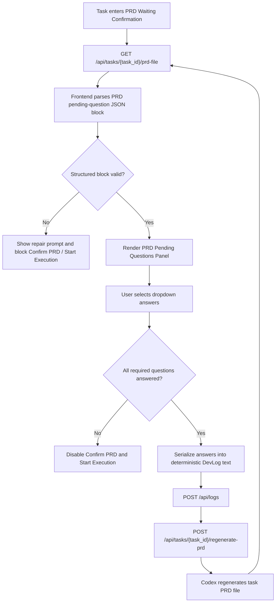
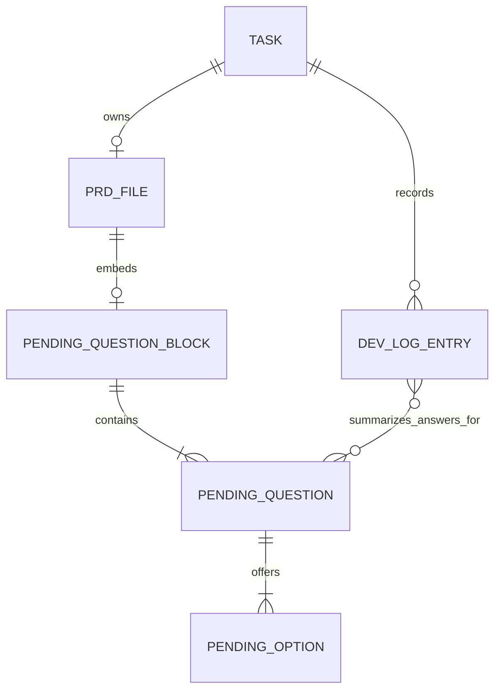

# PRD：PRD 待确认问题下拉选取确认

**原始需求标题**：`prd的待确认问题能不能改成下拉选取`
**需求名称（AI 归纳）**：`PRD 待确认问题下拉选取确认`
**需求背景/上下文**：`需求目标是把 PRD 待确认问题从纯文本提示改成结构化下拉选取，同时保持 PRD Markdown 作为归档事实源；首期不把 PRD 编辑体验改造成富文本表单编辑器，不要求历史 PRD 自动补齐结构化问题块，不新增实时协作/多人同时确认/WebSocket 同步能力，也不修改 PRD 以外的验收、Lint、Review 工作流。`
**文件路径**：`tasks/prd-7e438625.md`
**创建时间**：`2026-03-26 15:45:13 CST`
**适用链路**：`dsl/services/codex_runner.py::build_codex_prd_prompt`、`frontend/src/App.tsx::handleFeedbackSubmit`、`dsl/api/tasks.py::regenerate_task_prd`

---

## 0. 澄清问题（按现有仓库模式给出推荐默认值）

以下问题是 `/prd` workflow 要求先明确、但当前需求文本没有完全写死的实现细节。本文先按推荐选项起草；如果后续决定不同，应先修订 PRD 再开始实现。

### 0.1 待确认问题的数据源首期应放在哪里？

A. 继续从自由文本 Markdown 列表里用正则或字符串规则猜测
B. 在新生成的 PRD 中增加机器可解析的结构化问题块，同时保留人类可读正文
C. 新增数据库表或 `Task` JSON 字段存储问题清单

> **Recommended: B**
> 当前 `dsl/api/tasks.py::get_task_prd_file(...)` 稳定返回的是任务专属 PRD Markdown 文件，`frontend/src/App.tsx` 也是围绕这份文件做展示。把结构化问题块直接嵌入 PRD 文件，最符合“PRD 仍是事实源”的现有仓库模式，同时避免引入新的持久化模型。

### 0.2 用户完成下拉选择后，首期如何留痕并触发 PRD 重生成？

A. 仅保存在前端本地状态，刷新页面或切换任务后丢失
B. 把选择结果序列化为结构化反馈文本，复用现有 `DevLog + regenerate-prd` 链路
C. 新增专用后端接口与数据库字段记录答案

> **Recommended: B**
> `frontend/src/App.tsx::handleFeedbackSubmit(...)` 已经能把反馈写入日志并在 `prd_waiting_confirmation` 阶段调用 `taskApi.regeneratePrd(...)`；`dsl/api/logs.py` 和 `dsl/api/tasks.py::regenerate_task_prd(...)` 也已稳定承接该闭环。首期复用现有接口，范围最小。

### 0.3 下拉选项应渲染在什么位置？

A. 在 `prd_waiting_confirmation` 详情页的 PRD 文档上方增加独立确认卡片，问题标题右侧显示下拉框
B. 直接把 Markdown 文档做成可编辑富文本，交互嵌进正文
C. 只在 PRD 全屏弹窗里提供

> **Recommended: A**
> `frontend/src/App.tsx` 当前已经把时间线、PRD 文档和反馈输入集中在同一任务详情页；而全屏 PRD 弹窗更偏向阅读，不适合承载首期确认动作。独立卡片既满足“题旁下拉”的需求，也不把整个 PRD 体验改成表单编辑器。

### 0.4 当存在未答问题时，首期是否允许用户直接确认 PRD 或开始执行？

A. 不允许；用户需要先完成全部必答题，或一键采用推荐值
B. 允许跳过，只做提示
C. 自动把推荐值当成已确认，不要求用户显式操作

> **Recommended: A**
> 待确认问题本质上代表 PRD 中仍有未决前提。如果 `frontend/src/App.tsx` 里的“确认 PRD”或“开始执行”按钮仍可绕过这些问题，结构化确认层就失去意义。首期应显式阻断，避免带着未定案输入进入实现阶段。

### 0.5 “问题旁下拉”的首期交互形态应该是什么？

A. 在问题标题右侧直接显示可点击选项按钮，推荐项默认高亮，可额外提供“一键采用全部推荐”
B. 在问题标题右侧直接显示原生 `select` 下拉，并额外提供“一键采用全部推荐”
C. 点击问题后弹出单独弹层再选择

> **Recommended: B**
> 当前需求标题已经明确要求“改成下拉选取”。首期使用原生 `select` 最贴近用户表述，也能复用现有样式并在窄屏下稳定排版。

以下 PRD 按推荐选项 **B / B / A / A / B** 起草。

---

## 1. Introduction & Goals

### 背景

当前 Koda 的 PRD 确认阶段已经具备以下真实能力：

1. 后端通过 `dsl/api/tasks.py::get_task_prd_file(...)` 读取任务专属 PRD Markdown 文件。
2. 前端在 `frontend/src/App.tsx` 中展示 PRD 文档、时间线以及通用反馈输入框。
3. 用户可以输入自由文本或上传附件；`handleFeedbackSubmit(...)` 会把内容写入 `DevLog`，并在 `prd_waiting_confirmation` 阶段调用 `POST /api/tasks/{task_id}/regenerate-prd` 重新生成 PRD。

但现状也有明显缺口：PRD 中的“待确认问题”仍然只是让人阅读的文本，而不是可操作的确认界面。当前需求希望把这类确认改造成“问题旁的下拉选取”，同时又不能把整个 PRD 改造成富文本表单编辑器。

因此，本需求的核心不是重做 PRD 编辑器，而是增加一层轻量的结构化确认界面：

- PRD 文件继续作为归档事实源。
- 新生成的 PRD 在 Markdown 内携带一段机器可解析的问题块。
- 前端在 PRD 等待确认阶段把这段结构化内容渲染成“问题旁下拉选项”。
- 用户确认后，系统继续复用现有 `DevLog + regenerate-prd` 闭环。

### 可衡量目标

- [ ] 新生成的 PRD 可以在保留人类可读正文的同时，附带可解析的待确认问题结构化块。
- [ ] `prd_waiting_confirmation` 阶段的任务详情页可以在 PRD 文档上方显示“问题旁下拉选项”确认卡片。
- [ ] 用户完成下拉选择后能形成确定性的结构化反馈文本，并复用现有 PRD 重生成链路。
- [ ] 当存在未答的必答题时，用户不能绕过确认层直接“确认 PRD”或“开始执行”。
- [ ] 历史 PRD 或未包含结构化问题块的 PRD 保持当前体验，不要求自动补齐。
- [ ] 不新增数据库表、实时协作或 WebSocket 同步能力。

## 2. Implementation Guide

### 核心逻辑

推荐实现路径如下：

1. 在 `dsl/services/codex_runner.py::build_codex_prd_prompt(...)` 中增强 PRD 输出合同，要求当 PRD 含有待确认问题时，除了自然语言正文，还要额外输出一个固定 section，例如 `## 0. 待确认问题（结构化）`。
2. 该结构化 section 使用 fenced `json` code block，避免前端引入 YAML 解析依赖。建议结构如下：

   ```json
   {
     "pending_questions": [
       {
         "id": "data-source",
         "title": "待确认问题的数据源应该放在哪里？",
         "required": true,
         "recommended_option_key": "B",
         "recommendation_reason": "保持 PRD 文件为事实源，同时避免自由文本解析。",
         "options": [
           { "key": "A", "label": "继续解析现有自然语言 Markdown 段落" },
           { "key": "B", "label": "PRD 内结构化问题块 + UI 渲染" },
           { "key": "C", "label": "新增数据库表" }
         ]
       }
     ]
   }
   ```

3. 前端在获取 `prd-file` 后，不改变后端返回格式；而是在客户端解析 Markdown 中的结构化问题块，抽出为类型化对象。若没有该块，则回退到当前 PRD 阅读 + 自由反馈体验；若固定结构化章节存在但 JSON / schema 解析失败，则必须显式提示修复并阻断确认/执行，不能静默放行。
4. 在 `WorkflowStage.PRD_WAITING_CONFIRMATION` 下，于 PRD Markdown 卡片上方增加一个独立的 `PrdPendingQuestionsPanel`：
   - 左侧展示问题标题与推荐理由；
   - 右侧展示原生 `select` 下拉；
   - 推荐项通过文案和“一键采用全部推荐”显式提示；
   - 顶部提供“一键采用全部推荐”。
5. 用户调整下拉选项时只更新前端本地选择状态，不立即写库；当全部必答题完成后，才允许点击“提交并重新生成 PRD”。
6. 提交时，前端把已选答案序列化为确定性的结构化反馈文本，再复用现有 `logApi.create(...)` 与 `taskApi.regeneratePrd(...)`。首期不新增 API，也不改数据库。
7. 若当前 PRD 存在未答结构化问题，任务详情中的“确认 PRD”和“开始执行”按钮都应被禁用或拦截，并显示原因提示，防止绕过确认。
8. 历史 PRD 不要求自动补齐结构化问题块；它们继续保持当前 Markdown + 自由反馈模式。
9. 自由文本反馈输入框和附件上传能力继续保留，用于处理结构化问题之外的补充意见。

### 2.1 Change Matrix

| Change Target | Current State | Target State | How to Modify | Affected Files |
|---|---|---|---|---|
| PRD 输出合同与结构化问题源 | PRD 中的待确认问题主要是自然语言文本，前端无法稳定提取 | 新生成 PRD 在 Markdown 中附带固定 section 的 fenced `json` 问题块，同时保留人类可读正文 | 扩展 `build_codex_prd_prompt(...)` 合同，要求输出固定 JSON 结构；同步更新 prompt 相关文档与合同测试 | `dsl/services/codex_runner.py`, `tests/test_codex_runner.py`, `docs/core/prompt-management.md`, `docs/guides/codex-cli-automation.md` |
| 前端 PRD 解析层 | `frontend/src/App.tsx` 只把整份 PRD Markdown 直接渲染出来 | 前端先解析并提取结构化问题块，再决定是否显示确认卡片 | 抽出纯函数解析器，返回 `pendingQuestions` 与 `renderableMarkdown`；缺少结构化块时保持现状，结构化块 malformed 时 fail-closed 并提示修复 | `frontend/src/utils/prd_pending_questions.ts`, `frontend/src/types/index.ts`, `frontend/src/App.tsx` |
| PRD 确认交互 UI | 当前只有 Markdown 文档区和通用反馈输入框 | 在 `prd_waiting_confirmation` 阶段新增“问题旁下拉选项”确认卡片 | 新增独立组件，避免继续膨胀 `App.tsx`；问题标题右侧显示 `select` 下拉、推荐提示和完成态 | `frontend/src/components/PrdPendingQuestionsPanel.tsx`, `frontend/src/App.tsx`, `frontend/src/index.css` |
| 提交与重生成闭环 | 用户手工输入反馈后，由 `handleFeedbackSubmit(...)` 写入 `DevLog` 并视阶段决定是否重生成 | 结构化下拉选择被序列化为确定性反馈文本，并复用相同的 `DevLog + regenerate-prd` 链路 | 保持 `frontend/src/api/client.ts` 与后端接口不新增；在前端提交前构建标准答案摘要文本 | `frontend/src/App.tsx`, `frontend/src/utils/prd_pending_questions.ts` |
| 阶段动作阻断 | `prd_waiting_confirmation` 阶段下，“确认 PRD”和“开始执行”可以直接点击 | 只要当前 PRD 含有未回答的必答题，或结构化区块 malformed，就阻断确认和执行 | 基于解析结果与选择状态计算 gate；按钮禁用态要提供明确提示文案 | `frontend/src/App.tsx`, `frontend/src/index.css` |
| 兼容旧 PRD | 历史 PRD 只有普通 Markdown 文本 | 未含结构化块的 PRD 继续沿用当前展示和反馈方式 | 首期不做历史回填，不做自由文本反向解析；以“有块则增强、无块则保持现状”为准则 | `frontend/src/utils/prd_pending_questions.ts`, `frontend/src/App.tsx` |
| 原型与文档同步 | 当前原型文件演示的是旧方案 | 原型更新为题旁下拉交互，文档导航命名同步更新 | 修改现有原型文件，不新开页面；保持同一路径，降低导航和链接变化 | `docs/prototypes/prd-pending-question-dropdown-demo.html`, `mkdocs.yml` |

### 2.2 Flow Diagram



### 2.3 Low-Fidelity Prototype

```text
┌──────────────────────────────────────────────────────────────────────────────┐
│ PRD Pending Questions                                                       │
│ 还有 2 个问题待处理                                  [Apply All Recommended] │
├──────────────────────────────────────────────────────────────────────────────┤
│ 待确认问题的数据源应该放在哪里？                            [待选择]        │
│ 推荐：保持 PRD 文件作为事实源，同时避免自由文本解析。                      │
│                                                     [请选择一个选项 ▾]      │
├──────────────────────────────────────────────────────────────────────────────┤
│ 用户完成下拉选择后，首期应该如何留痕？                       [已选择 B]      │
│ 推荐：复用 DevLog + regenerate-prd，避免新增后端接口。                     │
│                                                     [请选择一个选项 ▾]      │
├──────────────────────────────────────────────────────────────────────────────┤
│ [生成反馈预览]                                          [提交并重新生成 PRD] │
└──────────────────────────────────────────────────────────────────────────────┘

下方仍保留完整 PRD Markdown 文档与通用反馈输入框，不改成富文本表单编辑器。
```

### 2.4 ER Diagram

本需求不改数据库表结构，但会为 PRD 文件引入新的结构化存储块。以下是逻辑实体关系图，用于约束 PRD 文件中的问题块与后续 DevLog 留痕关系：



说明：

- `PRD_FILE`、`PENDING_QUESTION_BLOCK`、`PENDING_QUESTION`、`PENDING_OPTION` 是 Markdown 文件内的逻辑结构，不代表新增数据库表。
- `DEV_LOG_ENTRY` 继续复用现有日志体系，只承载“本次结构化选择的答案摘要”。

### 2.8 Interactive Prototype Change Log

| File Path | Change Type | Before | After | Why |
|---|---|---|---|---|
| `docs/prototypes/prd-pending-question-dropdown-demo.html` | Modify | 原型内容与文案存在交互漂移 | 每个问题标题右侧使用 `select` 下拉，并保留推荐、一键采用推荐、反馈预览和重新生成提示 | 保证原型与已实现交互一致 |
| `mkdocs.yml` | Modify | 原型导航名称与页面内容不一致 | 导航名称更新为“下拉 Demo” | 保证文档导航与原型内容一致 |

### 2.9 Interactive Prototype Link

- `docs/prototypes/prd-pending-question-dropdown-demo.html`

## 3. Global Definition of Done (DoD)

- [ ] 新生成且包含待确认问题的 PRD，能够输出合法的 fenced `json` 结构化问题块与人类可读正文。
- [ ] `WorkflowStage.PRD_WAITING_CONFIRMATION` 下，前端能在 PRD 文档上方渲染题旁下拉确认卡片。
- [ ] 历史 PRD 或无结构化问题块的 PRD 不回归，仍保持当前 Markdown 阅读与自由反馈体验。
- [ ] 用户未完成所有必答题时，不能直接点击“确认 PRD”或“开始执行”绕过确认层。
- [ ] 固定结构化问题章节一旦 malformed，界面会显式提示修复，并继续阻断“确认 PRD”和“开始执行”。
- [ ] 用户完成选择后，系统能生成确定性的结构化反馈文本，并复用现有 `DevLog + regenerate-prd` 闭环。
- [ ] 通用反馈输入框、附件上传和手工补充说明能力仍可正常使用。
- [ ] 不新增数据库表、不新增 WebSocket 同步能力、不把 PRD 编辑体验改造成富文本表单编辑器。
- [ ] `npm --prefix frontend run build`、`uv run pytest tests/test_codex_runner.py`、`just docs-build` 通过。
- [ ] 在浏览器中完成桌面端与移动端回归，确认下拉框布局、禁用态和反馈提交文案可用。
- [ ] 文档、原型和导航名称与最终交互保持一致。

## 4. User Stories

### US-001：作为 PRD 生成链路的使用者，我希望新 PRD 自带结构化待确认问题块

**Description:** As a user, I want AI-generated PRDs to include a machine-readable pending-question block so that the frontend can render a reliable confirmation UI without guessing from free text.

**Acceptance Criteria:**
- [ ] 当 PRD 存在待确认问题时，输出中包含固定 section 的 fenced `json` 问题块。
- [ ] 每个问题至少包含 `id`、`title`、`required`、`recommended_option_key`、`recommendation_reason`、`options`。
- [ ] 结构化块之外仍保留人类可读的问题与推荐理由，方便归档和审阅。

### US-002：作为确认 PRD 的用户，我希望直接在问题旁通过下拉完成选择

**Description:** As a user, I want a dropdown next to each pending question so that I can confirm the PRD without manually editing Markdown.

**Acceptance Criteria:**
- [ ] 问题标题右侧直接渲染 `select` 下拉框。
- [ ] 推荐选项有清晰提示，且支持“一键采用全部推荐”。
- [ ] 在窄屏下下拉框不遮挡题目、状态和推荐理由。

### US-003：作为工作流操作者，我希望下拉选择能复用现有反馈和重生成闭环

**Description:** As an operator, I want the new dropdown-based answers to reuse the existing DevLog and PRD regeneration flow so that the feature lands without broad backend changes.

**Acceptance Criteria:**
- [ ] 用户提交下拉选择后，前端会生成确定性的结构化反馈文本。
- [ ] 系统继续调用现有日志写入与 `regenerate-prd` 接口，不新增专用后端接口。
- [ ] PRD 重生成完成后，前端重新拉取任务专属 PRD 文件并更新界面。

### US-004：作为维护者，我希望旧 PRD 与自由反馈能力继续兼容

**Description:** As a maintainer, I want historical PRDs and non-structured feedback to keep working so that the new feature remains incremental and low-risk.

**Acceptance Criteria:**
- [ ] 历史 PRD 没有结构化问题块时，不会强制显示新确认卡片。
- [ ] 用户仍可通过自由文本和附件补充结构化问题以外的反馈。
- [ ] 首期不要求历史 PRD 自动补齐结构化问题块。

## 5. Functional Requirements

1. **FR-1:** 当 AI 生成的 PRD 含有待确认问题时，PRD Markdown 必须包含固定 section 的 fenced `json` 结构化问题块。
2. **FR-2:** 结构化问题块中的每个问题对象必须至少包含稳定 `id`、问题标题、`required`、推荐选项 key、推荐理由以及选项列表。
3. **FR-3:** 前端必须在不新增后端读取接口的前提下，从现有 `GET /api/tasks/{task_id}/prd-file` 返回的 Markdown 中完成结构化问题解析。
4. **FR-4:** 如果 PRD 中不存在结构化问题块，系统必须回退到当前的 Markdown 文档展示与自由反馈流程；如果固定结构化问题章节存在但解析失败，系统必须显式提示修复并阻断确认/执行，不能静默放行。
5. **FR-5:** 仅在 `WorkflowStage.PRD_WAITING_CONFIRMATION` 阶段渲染新的结构化确认卡片；其他阶段不展示题旁下拉交互。
6. **FR-6:** 每个待确认问题都必须在问题标题右侧直接显示下拉框 `select`。
7. **FR-7:** 推荐选项必须有清晰提示，并支持“一键采用全部推荐”。
8. **FR-8:** 用户完成所有必答题前，系统必须禁用或拦截“确认 PRD”和“开始执行”动作。
9. **FR-9:** 用户点击“提交并重新生成 PRD”时，前端必须把答案序列化为确定性的结构化反馈文本。
10. **FR-10:** 结构化答案提交必须复用现有 `DevLog` 写入与 `POST /api/tasks/{task_id}/regenerate-prd` 链路，不新增数据库表或专用答案接口。
11. **FR-11:** 通用反馈输入框和附件上传能力必须继续保留，用于结构化问题之外的补充说明。
12. **FR-12:** 历史 PRD 不要求自动补齐结构化问题块；没有该块的 PRD 继续沿用现有体验。
13. **FR-13:** 首期实现不得把 PRD 阅读区改造成富文本表单编辑器，也不得要求多人协作同步。
14. **FR-14:** 原型页与 MkDocs 导航必须同步更新，并能演示下拉选择、反馈预览和重新生成状态变化。
15. **FR-15:** 与 PRD 以外的验收、Lint、Review 工作流相关的链路和文案，不应在本需求内发生行为改变。

## 6. Non-Goals

- 不把整个 PRD 编辑体验改造成富文本表单编辑器
- 不要求历史 PRD 自动补齐结构化问题块
- 不在本期新增实时协作、多人同时确认或 WebSocket 同步能力
- 不修改 PRD 以外的验收、Lint、Review 工作流
- 不新增数据库表、`Task` 持久化字段或独立答案存储模型
- 不在本期处理结构化问题之外的复杂条件逻辑、嵌套问题或动态联动规则

## 7. Delivery Notes (2026-03-27 10:05:08 CST)

### 本轮补充交付

- `frontend/src/App.tsx` 新增了显式的“选中任务 PRD 首次加载完成”状态。在 `prd_waiting_confirmation` 阶段，只要任务已有 `worktree_path` 且首次 `GET /api/tasks/{task_id}/prd-file` 还没成功返回，就继续阻断“确认 PRD”和“开始执行”，避免异步加载窗口把结构化待确认问题绕过去。
- 结构化待确认问题的答案草稿从单个全局 map 改成了按 `taskId` 分桶存储。这样即使两个任务复用同一组语义化 `pending_questions[].id`，切换任务时也不会串用旧草稿。
- `frontend/src/utils/prd_pending_questions.ts` 补充了纯函数 helper，用来集中表达上述阻断规则和 task-scoped 选择状态，便于继续沿用当前轻量级 Node 脚本做回归。

### 本轮验证

- `npm --prefix frontend run test:prd-pending-questions`
- `npm --prefix frontend run build`
- `uv run pytest tests/test_tasks_api.py tests/test_codex_runner.py`
- `just docs-build`

### 剩余风险 / 后续建议

- 当前自动化仍然没有浏览器级 UI 测试去直接覆盖“切换任务后保留各自草稿”和“PRD 重新生成后首次加载期间按钮保持禁用”的真实交互，只由纯函数和生产构建做回归保护。后续如果该面板继续演进，建议补一层组件或端到端场景测试。

## 8. Delivery Notes (2026-03-30 11:32:00 CST)

### 本轮补充交付

- `dsl/schemas/task_schema.py` 与 `frontend/src/types/index.ts` 为 `Task` 响应补充了 `stage_updated_at`，让前端能区分“这是新一轮 `prd_waiting_confirmation`，还是旧 PRD 的缓存结果”。
- `frontend/src/hooks/useSelectedTaskPrdFile.ts` 新增了选中任务 PRD 轮询 hook：它会按 `(taskId, stage_updated_at)` 生成 waiting-confirmation 轮次 key，并且只有当前轮次真正拉到持久化 PRD 文件时，才认为这轮加载完成。
- `frontend/src/App.tsx` 现在只会在“当前任务 + 当前 waiting-confirmation 轮次”都匹配且 PRD 文件已就绪时渲染持久化 PRD；否则回退到合成 Markdown，并继续阻断“确认 PRD”和“开始执行”。
- 同一 hook 还额外带上了 `resolvedTaskId`，避免切换到另一张任务卡时短暂复用上一张任务卡的 PRD 快照。
- `frontend/tests/use_selected_task_prd_file.test.ts` 增加了真正跑 React state/effect 的回归，覆盖 `prd_waiting_confirmation -> prd_generating -> prd_waiting_confirmation` 往返时门禁必须重新挂起的场景。

### 本轮验证

- `npm --prefix frontend run test:prd-pending-questions`
- `npm --prefix frontend run test:selected-task-prd-file`
- `npm --prefix frontend run build`
- `uv run pytest tests/test_tasks_api.py tests/test_timezone_contract.py`
- `just docs-build`

### 剩余风险 / 后续建议

- 本轮已经补上 stateful React 回归，但还不是浏览器级交互测试；如果后续 PRD 面板继续演进到更复杂的联动逻辑，仍建议补一层组件测试或 E2E 来覆盖真实 DOM 交互与按钮禁用态文案。

## 9. Delivery Notes (2026-03-30 Merge Conflict Resolution)

### 本轮补充交付

- `frontend/src/App.tsx` 的最后一个 merge conflict 已清理完毕：保留了销毁任务弹窗的 `Escape` 键关闭逻辑，同时删除了旧版 `setPrdFileContent(null)` 切任务重置 effect。
- 本次删除的 PRD reset 逻辑已经被 `frontend/src/hooks/useSelectedTaskPrdFile.ts` 接管；继续保留旧 effect 会让合并结果停留在过期的状态模型上。

### 本轮验证

- `npm --prefix frontend run test:prd-pending-questions`
- `npm --prefix frontend run test:selected-task-prd-file`
- `npm --prefix frontend run build`
- `git diff --check -- frontend/src/App.tsx`
