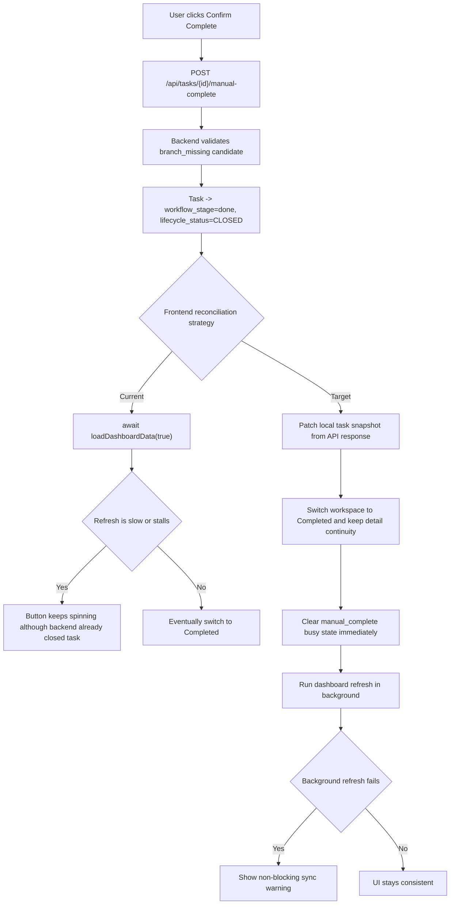

# PRD：缺失分支人工完成后的前端刷新与忙碌态收口修复

**原始需求标题**：点击过确认complete之后,它还是一直转圈,但是其实好像已经被删除了
**需求名称（AI 归纳）**：缺失分支人工完成后的前端刷新与忙碌态收口修复
**文件路径**：`tasks/prd-abfaeb3a.md`
**创建时间**：2026-03-30 14:29:10 CST
**参考上下文**：`frontend/src/App.tsx`, `frontend/src/api/client.ts`, `frontend/src/types/index.ts`, `dsl/api/tasks.py`, `dsl/services/task_service.py`, `tests/test_tasks_api.py`, `docs/guides/dsl-development.md`, `docs/architecture/system-design.md`, `docs/index.md`, `tasks/archive/prd-0fd7ed62.md`
**附件检查**：
- `/home/atahang/codes/koda/data/media/original/9766ce03-7555-44ef-929f-6b45d543e155.png` 已实际检查，文件存在，格式为 PNG，分辨率 `1912 x 937`
- 截图可确认当前页面处于“检测到任务分支缺失，等待人工确认”场景，详情头部存在 `确认 Complete` 按钮与完成检查单区域，任务分支展示为 `task/516e04ff`
- 截图无法单独证明按钮点击后的真实接口结果；代码检查显示当前 `POST /api/tasks/{id}/manual-complete` 的设计契约是在接口成功时立即把任务收敛到 `workflow_stage=done`、`lifecycle_status=CLOSED`，且不会启动后台 Git 收尾任务
**原型目标**：`docs/prototypes/manual-complete-refresh-demo.html`

---

## 1. Introduction & Goals

### 背景

当前代码库里，“缺失分支待确认”并不是一个长任务，而是一条同步收口路径：

- `dsl/api/tasks.py` 中的 `POST /api/tasks/{id}/manual-complete` 会在请求线程内校验 `manual_completion_candidate`
- `dsl/services/task_service.py` 中的 `close_task_after_manual_completion(...)` 会直接把任务切到 `done / CLOSED`
- `frontend/src/api/client.ts` 中的 `taskApi.manualComplete(...)` 已返回 `Task`
- `frontend/src/App.tsx` 中的 `handleManualCompleteRequirement(...)` 在接口成功后会先 `setWorkspaceView("completed")`，但同时仍然 `await loadDashboardData(true)`，且只在 `finally` 里清理 `activeMutationName`

这意味着本次需求首先不是“重新设计 missing-branch 业务流”，而是要验证下面哪一类问题真实发生：

1. `POST /manual-complete` 其实已经成功，任务已被后端收敛到 `done / CLOSED`，但前端仍因全量刷新、选中态或本地缓存未同步而继续显示转圈。
2. `POST /manual-complete` 根本没有成功，转圈只是后端请求仍卡住或失败。

基于现有后端契约，本 PRD 默认把排查重点放在第 1 类：先确认任务是否已经被后端收口；如果是，则修复前端“成功边界过晚、忙碌态依赖全量刷新”的问题。

### 可衡量目标

- [ ] 在复现场景中，能够明确判断 `POST /manual-complete` 是否已成功返回，以及任务是否已进入 `done / CLOSED`
- [ ] 若后端已成功收口，前端必须在不依赖手动刷新页面的前提下，立即反映“任务已归档”而不是持续转圈
- [ ] `manual_complete` 的 CTA busy 状态必须在 API 成功后及时释放，不能继续被与成功提示无关的全量刷新长期占用
- [ ] 页面应收敛到 `Completed` 视图，或至少以等价方式展示最新关闭态，而不是继续停留在 `branch_missing` 细节页
- [ ] 普通 `/api/tasks/{id}/complete` Git 收尾流程不受影响

### 1.1 Clarifying Questions

以下问题无法仅靠原始一句话需求直接确定；本 PRD 默认按推荐选项落地。

1. 当 `manual-complete` 接口已经返回 200，但随后全量 dashboard 刷新缓慢或失败时，前端应该以什么作为“成功边界”？
A. 继续等全量刷新完成后再结束按钮转圈
B. 以 `manual-complete` 的 200 响应为成功边界，立即用返回的 `Task` 收口本地状态
C. 不做自动处理，要求用户手动刷新
> **Recommended: B**（现有后端契约已经在 `manual-complete` 成功时同步完成 `done / CLOSED` 收口；继续把 busy 态绑在 `loadDashboardData(true)` 上，会把“刷新慢”误表现成“提交没成功”。）

2. 当手动完成成功后，详情页应该停留在哪个工作区？
A. 继续留在 Active，只清空按钮 loading
B. 自动切到 Completed，并尽量保留该任务的详情选中态
C. 直接跳到 Changes
> **Recommended: B**（`frontend/src/App.tsx` 已经在多个关闭路径上使用 `setWorkspaceView("completed")`，并且存在“选中任务移出当前视图时自动切 workspace”的兼容逻辑。）

3. 如果“接口成功”与“后续刷新失败”同时发生，用户应该看到什么？
A. 一个统一失败提示
B. 成功提示 + 非阻塞刷新告警
C. 无提示，静默重试直到成功
> **Recommended: B**（这样能区分“业务动作已完成”和“后续同步稍后补齐”，避免用户误以为需要再次点击 `确认 Complete`。）

4. 本次修复应该如何补回归保障？
A. 只补手工验证，不加自动化
B. 抽出一段可测试的前端状态收口逻辑，按现有 `frontend/tests/*.test.ts` 模式补单测，并保留后端 contract test
C. 只补后端 API 测试
> **Recommended: B**（当前问题核心在前端状态收口；仓库已有轻量 Node 测试模式，适合为纯函数/状态变换补回归。）

### 1.2 缺陷归因优先级

本需求的实施必须先完成一次有结论的归因，而不是直接猜改：

- 若网络面板或日志可证明 `POST /manual-complete` 返回 200，且下一次 `GET /api/tasks` 中对应任务已是 `CLOSED`，则缺陷归为前端收口/刷新问题
- 若 `POST /manual-complete` 本身卡住、超时或返回非 2xx，则缺陷归为接口层或后端实现问题，本 PRD 中的前端收口优化只作为次级措施
- 若接口成功但 `GET /api/tasks` 仍旧返回旧状态，则需要追加检查后端响应刷新或数据库提交可见性

## 2. Implementation Guide

### 核心逻辑

本需求建议按“先证实、再前移成功边界、最后补回归”的路径实施，而不是直接在界面上堆更多 loading 判断。

推荐技术路径如下：

1. 先对现有链路做一次明确归因。
   - 在 `manual-complete` 场景复现一次操作，记录 `POST /api/tasks/{id}/manual-complete`、后续 `GET /api/tasks`、`GET /api/tasks/card-metadata`、`GET /api/logs` 的返回顺序与状态。
   - 结论要能回答：接口是否成功、任务是否已关闭、到底是哪一个后续请求把用户留在转圈状态。

2. 把前端“成功边界”前移到 `manual-complete` 接口成功返回。
   - 既然 `taskApi.manualComplete(...)` 已返回 `Task`，前端不应继续把成功可见性完全依赖 `loadDashboardData(true)`。
   - 一旦拿到 200 响应，应立刻把对应任务的本地快照更新为后端返回值，并以此驱动 `taskList`、`selectedTask`、`workspaceView` 和提示文案。

3. 将“按钮 busy 态”和“全量 dashboard 刷新”解耦。
   - 当前 `handleManualCompleteRequirement(...)` 在 `try` 内 `await loadDashboardData(true)`，然后才走 `finally -> setActiveMutationName(null)`。
   - 目标实现应改为：接口成功后立即释放 `manual_complete` 按钮 busy；后续全量刷新改为后台同步或局部刷新。
   - 即使刷新失败，也只能影响“全局数据补齐”，不能回滚已经确认的成功态。

4. 保证 workspace 与选中态收敛一致。
   - 成功后任务应从 Active 中移出，并落入 Completed。
   - 详情页要么继续显示这条已关闭任务的最新快照，要么在切换视图后选中新的 completed 项；不能留下一个仍显示 `branch_missing` 的旧详情面板。

5. 为刷新失败提供非阻塞反馈。
   - 如果接口成功后背景刷新失败，UI 应显示“任务已完成，但列表同步失败，请稍后刷新”的警告，而不是继续让按钮转圈。
   - 该提示必须与真正的接口失败文案区分开。

6. 补齐自动化验证与文档。
   - 为“manual-complete 成功后立即收口本地状态”的前端逻辑补回归测试。
   - 保留或增强后端 `manual-complete` contract test，确保接口仍然同步返回关闭态任务。
   - 文档更新应强调：`manual-complete` 不是长任务，不应表现为持续执行中的 spinner。

### 2.1 Change Matrix

| Change Target | Current State | Target State | How to Modify | Affected Files |
|---|---|---|---|---|
| 手动完成成功边界 | `manual-complete` 成功后，前端仍等待 `loadDashboardData(true)` 完成才结束 mutation | 以 `POST /manual-complete` 的 200 响应作为用户可见成功边界 | 在 `handleManualCompleteRequirement(...)` 中使用返回的 `Task` 快照立即更新本地状态，并把 `setActiveMutationName(null)` 从“全量刷新完成后”前移到“接口成功后” | `frontend/src/App.tsx` |
| 本地任务列表与 workspace 收口 | 成功后是否马上从 Active 收敛到 Completed 取决于后续全量刷新 | API 成功后立即把任务从 Active 视图移出，并切换到 Completed / 保持详情连续性 | 引入局部状态 patch 或小型 reducer，统一处理 task list、selected task、workspace view 的成功收口 | `frontend/src/App.tsx`, `frontend/src/types/index.ts` |
| 刷新失败降级策略 | 刷新慢/失败时，用户只能看到持续 loading 或模糊失败 | 接口成功与后续同步失败可被明确区分 | 将后置 `loadDashboardData(...)` 改为后台同步或显式二段式处理；对刷新失败展示非阻塞 warning | `frontend/src/App.tsx` |
| 可测试的前端状态逻辑 | 关键状态收口逻辑大多内联在 `App.tsx`，自动回归难度高 | 至少有一段可单测的纯状态变换逻辑 | 视实现规模提取 helper / reducer，并沿用 `frontend/tests/*.test.ts` 模式补测试 | `frontend/src/App.tsx`, `frontend/tests/manual_complete_refresh.test.ts` |
| `manual-complete` 响应契约验证 | 后端已有同步关闭逻辑，但本次缺陷缺少针对“立即可见性”的显式保护 | API contract 被测试固定下来，确认成功即返回关闭态任务 | 为 `manual-complete` 的返回值与状态收口保留/增强 API regression，必要时补充注释说明 | `dsl/api/tasks.py`, `dsl/services/task_service.py`, `tests/test_tasks_api.py` |
| 文档与原型 | 文档说明“会收敛到 completed archive”，但没有单独演示“成功后前端仍转圈”的缺陷与修复目标 | 文档站可直接演示当前问题态与目标修复态 | 新增原型页并补导航；同步更新 DSL 开发指南或系统设计中的成功态表述 | `docs/prototypes/manual-complete-refresh-demo.html`, `mkdocs.yml`, `docs/guides/dsl-development.md`, `docs/architecture/system-design.md` |

### 2.2 Flow Diagram



### 2.3 Low-Fidelity Prototype

```text
Before click
┌────────────────────────── Active ──────────────────────────┐
│ Card: 缺失分支待确认                                       │
│ Detail: [查看完成检查单] [确认 Complete]                  │
│ Status: branch_missing / CTA busy = false                │
└───────────────────────────────────────────────────────────┘

Current bug hypothesis
┌────────────────────────── Active ──────────────────────────┐
│ Backend: manual-complete 已返回成功，任务已 CLOSED         │
│ Frontend: 仍在等待 dashboard refresh                       │
│ Detail: [确认 Complete ...spinner...]                     │
│ Result: 用户误以为还没完成，甚至怀疑“是不是已经删掉了”      │
└───────────────────────────────────────────────────────────┘

Target behavior
┌──────────────────────── Completed ─────────────────────────┐
│ Card: 已归档到 Completed                                  │
│ Detail: 展示最新 done / CLOSED 快照                       │
│ Toast: 任务已完成；若背景刷新失败，仅显示非阻塞 warning     │
└───────────────────────────────────────────────────────────┘
```

### 2.4 ER Diagram

本需求默认不修改持久化数据库结构，也不新增 `Task` 表字段。问题中心在于前端如何消费已有的 `manual-complete` 同步返回结果，因此本 PRD 不要求新增 Mermaid `erDiagram`。

### 2.8 Interactive Prototype Change Log

| File Path | Change Type | Before | After | Why |
|---|---|---|---|---|
| `docs/prototypes/manual-complete-refresh-demo.html` | Add | 不存在专门解释“manual-complete 成功但 UI 仍转圈”的原型页 | 新增可交互原型，可在“当前问题态 / 目标修复态”之间切换，演示按钮 busy、workspace 切换、后台刷新与非阻塞提示 | 让评审者在写代码前就能对“成功边界前移”形成一致理解 |
| `mkdocs.yml` | Modify | 文档导航里没有本次缺陷修复原型入口 | 新增“确认 Complete 刷新修复”原型导航项 | 方便从文档站直接打开原型页进行评审 |

### 2.9 Interactive Prototype Link

- `docs/prototypes/manual-complete-refresh-demo.html`

## 3. Global Definition of Done

- [ ] 已完成一次明确复现，并能证明问题到底发生在接口层还是前端刷新层
- [ ] 若 `manual-complete` 返回 200，前端会立即结束该 CTA 的 busy 态
- [ ] 成功后任务无需整页刷新即可从 Active 收敛到 Completed，或以等价方式展示最新关闭态
- [ ] 若后续 dashboard 刷新失败，用户看到的是非阻塞 warning，而不是无限 spinner
- [ ] `branch_missing` 的检查单门禁仍保留，不会因为本次修复而绕过人工确认
- [ ] 普通 `/api/tasks/{id}/complete` Git 收尾流程保持原有行为
- [ ] 新增自动化验证能覆盖 manual-complete 的成功收口路径
- [ ] 文档与原型已同步说明目标行为，`uv run mkdocs build --strict` 可通过

## 4. User Stories

### US-001：人工确认完成后立即得到确定性反馈
**Description:** As an operator, I want the UI to immediately show that the task has been archived after I confirm Complete so that I do not mistake a slow refresh for a failed action.

**Acceptance Criteria:**
- [ ] 在缺失分支待确认场景中，点击 `确认 Complete` 且接口成功后，按钮 busy 会立即结束
- [ ] 任务会立刻出现在 `Completed` 视图或等价的已关闭详情态中
- [ ] 用户不需要手动刷新页面来确认动作是否成功

### US-002：接口成功与刷新失败被明确区分
**Description:** As an operator, I want “task already completed” and “background sync failed” to be shown as two different outcomes so that I know whether I should retry the business action.

**Acceptance Criteria:**
- [ ] 接口成功但后续刷新失败时，系统显示成功态 + 非阻塞 warning
- [ ] 用户不会因为一个持续 spinner 而再次点击 `确认 Complete`
- [ ] 失败提示文案能够区分“接口失败”与“同步失败”

### US-003：研发可以稳定复现并防止回归
**Description:** As a maintainer, I want a testable state-reconciliation path for manual-complete so that this bug does not reappear after later UI refactors.

**Acceptance Criteria:**
- [ ] 复现场景中记录了 `manual-complete`、`tasks`、`card-metadata` 的关键返回顺序
- [ ] 前端状态收口逻辑至少有一条自动化回归
- [ ] 后端 `manual-complete` contract test 继续证明成功响应即返回关闭态任务

## 5. Functional Requirements

1. **FR-1**：实现前必须先完成一次缺陷归因，明确 `POST /api/tasks/{id}/manual-complete` 是否已成功以及对应任务是否已进入 `done / CLOSED`。
2. **FR-2**：若 `manual-complete` 返回 200，前端必须把该响应视为用户可见成功边界，不得继续把 CTA busy 态完全绑定到后续全量刷新。
3. **FR-3**：前端必须在 API 成功后立刻使用返回的 `Task` 快照更新本地任务列表或等价状态源，使该任务从 Active 退出并进入 Completed。
4. **FR-4**：成功后界面必须切换到 `Completed` 工作区，或以不弱于该行为的方式展示最新关闭态任务详情。
5. **FR-5**：如果后续 `loadDashboardData(...)`、`GET /api/tasks/card-metadata` 或其他同步请求失败，系统必须显示非阻塞 warning，而不是继续保持 `manual_complete` loading。
6. **FR-6**：如果 `manual-complete` 返回非 2xx，前端不得伪造完成态，仍应保留现有错误处理并允许用户重试。
7. **FR-7**：本次修复不得绕过现有“先查看完成检查单，再允许点击 `确认 Complete`”的前置门禁。
8. **FR-8**：本次修复不得改变普通 `/api/tasks/{id}/complete` 的 Git 收尾业务契约。
9. **FR-9**：实现应为“manual-complete 成功后本地状态收口”补自动化回归；如需，可通过提取纯函数/helper 的方式降低测试成本。
10. **FR-10**：保留或增强现有后端测试，确保 `manual-complete` 成功仍然同步返回关闭态任务对象。
11. **FR-11**：文档必须明确说明 `manual-complete` 是同步收口动作，不应表现为长时后台执行中的 spinner。
12. **FR-12**：若调查发现问题并非前端，而是 `manual-complete` 成功后后端列表接口仍返回旧态，则实施方案必须转而补后端一致性修复，并同步更新本 PRD 的 affected files 与验收口径。

## 6. Non-Goals

- 不在本需求内重做“缺失分支待确认”的业务规则或检查单内容
- 不在本需求内把 `manual-complete` 改造成新的长任务/后台任务
- 不在本需求内重构普通 `Complete` 的 Git commit、rebase、merge、cleanup 链路
- 不在本需求内新增数据库表、持久化字段或新的任务工作流阶段
- 不在本需求内自动关闭所有缺失分支任务；人工确认门禁仍然保留

## 7. Delivery Notes

### 实际实现

- `frontend/src/App.tsx`
  - `handleManualCompleteRequirement(...)` 现在会先消费 `taskApi.manualComplete(...)` 返回的关闭态 `Task` 快照。
  - 成功后立即把任务本地写回 `taskList`、保持当前详情选中、切到 `Completed`，并关闭完成检查单。
  - `loadDashboardData(true)` 改为后台补齐，不再阻塞 `manual_complete` 的 busy 态释放。
- `frontend/src/utils/task_list.ts`
  - 新增 `reconcileTaskListWithReturnedTaskSnapshot(...)`，用于用后端返回的最新任务快照替换/插入本地列表，并保持按 `created_at` 倒序。
- `frontend/tests/task_list.test.ts`
  - 新增轻量回归测试，覆盖“替换已存在任务快照”和“插入缺失任务快照”两条路径，锁住 manual-complete 本地收口的前提行为。

### 实际范围结论

- 本次缺陷按源码归因落在前端成功边界过晚，而不是后端 `manual-complete` 业务契约缺失。
- 未修改 `dsl/api/tasks.py`、`dsl/services/task_service.py` 或普通 `/complete` 流程。
- 未引入新工作流阶段、后台任务或数据库字段。

## 8. Verification Evidence

- `cd frontend && node --experimental-strip-types --experimental-specifier-resolution=node tests/task_list.test.ts` -> PASS
- `cd frontend && npm run build` -> PASS
- `uv run mkdocs build --strict` -> PASS
- `git diff --check` -> PASS

## 9. Deviations & Follow-Up Notes

- 本次没有额外新增专门的“背景刷新失败”文案通道；当前实现依旧复用现有 `loadDashboardData(...)` 错误展示机制，但因为刷新已不再被 `await`，所以它不会继续把 `manual_complete` 按钮卡在 loading。
- 后端已有的 `manual-complete` contract test 未改动；本次回归重点放在前端本地状态收口逻辑。
