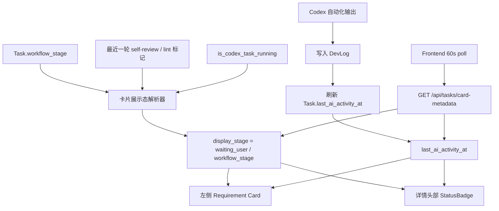
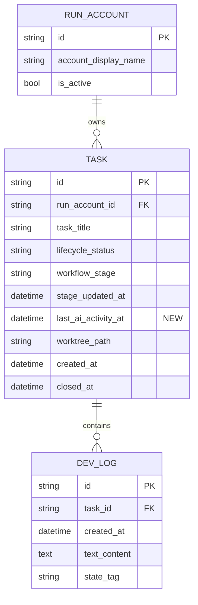

# PRD：需求卡片等待用户展示一致化与最近 AI 活动时间

**原始需求标题**：都已经显示等待用户了,左侧卡片还是显示testing ,这是一个issue
**需求名称（AI 归纳）**：需求卡片等待用户展示一致化与最近 AI 活动时间
**文件路径**：`tasks/prd-ac901b14.md`
**创建时间**：2026-03-26 15:31:08 CST
**附件检查**：`/home/atahang/codes/koda/data/media/original/f51e2d04-64af-4d51-8ff0-01d51816ea85.png`（文件存在，PNG，1912 x 948；截图可确认右侧 System Detail 已提示“等待用户点击 Complete”，但左侧同任务卡片仍显示 `TESTING`）
**参考上下文**：`frontend/src/App.tsx`, `frontend/src/types/index.ts`, `frontend/src/api/client.ts`, `dsl/api/tasks.py`, `dsl/services/task_service.py`, `dsl/services/codex_runner.py`, `utils/database.py`, `docs/database/schema.md`, `docs/prototypes/requirement-workflow-demo.html`

---

## 1. Introduction & Goals

### 背景

当前问题不是任务真实状态错了，而是“展示态”推导不一致：

- `Task.workflow_stage` 仍然是业务真相源，`test_in_progress` 表示任务停留在自动化验证阶段。
- 前端详情区和反馈逻辑已经能识别“post-review lint 已通过，等待用户点击 Complete”这一人工接管窗口。
- 但左侧卡片仍直接把 `test_in_progress` 映射成 `Testing`，没有把“等待用户”视为一个显示层覆盖态，因此造成截图中的状态冲突。

同时，用户希望卡片能额外展示“上次 AI 生成代码的时间”。结合现有实现，项目并没有现成的“代码生成时间”字段；当前最接近、最稳定、最容易工程化的信号，是 Codex 自动化最近一次输出写入系统日志的时间。这个时间更准确地说是“最近一次 AI 活动时间”，但可以作为卡片上的“上次 AI 生成”时间近似值。

另外，当前前端在任务活跃执行时会以 3 秒频率轮询 `/api/tasks`。用户已经明确说明这个新时间戳不需要高频刷新，1 分钟一次足够，因此本需求不应把额外计算负担绑定到现有高频热路径上。

### 可衡量目标

- [ ] 当任务处于“等待用户点击 Complete”的人工接管窗口时，左侧卡片与详情头部展示一致，不能再显示 `Testing`
- [ ] “等待用户”作为显示态覆盖层实现，不新增新的持久化 `workflow_stage`
- [ ] 左侧卡片展示“上次 AI 活动时间”，用于观察 AI 最近一次产生日志/输出的时间点
- [ ] 该时间戳的前端刷新频率独立于现有 3 秒任务轮询，默认 60 秒刷新一次
- [ ] 现有 `Complete`、`Resume`、`Changes Requested` 等工作流按钮行为不回归
- [ ] 数据模型、API、文档和原型说明同步更新

### 1.1 Clarifying Questions

以下问题无法只靠现有代码唯一确定；本 PRD 默认按推荐选项落地。

1. “等待用户”到底是新的工作流阶段，还是展示层覆盖态？
A. 新增 `waiting_user` 到 `WorkflowStage`
B. 保持现有 `workflow_stage` 不变，只增加展示层派生状态
C. 继续让各个组件各自推断
> **Recommended: B**（现有后端流程、恢复逻辑、`Complete` 判断都围绕真实 `workflow_stage` 展开；把“等待用户”做成展示态覆盖层最小、最稳，也最符合截图中“真实阶段仍是 test_in_progress，但用户感知上在等点击”的语义。）

2. “上次 AI 生成代码时间”默认采用哪个技术语义？
A. 最近一次 Codex 自动化输出写入系统日志/任务日志的时间
B. 最近一次 worktree 文件修改时间
C. 最近一次进入 `implementation_in_progress` 的时间
> **Recommended: A**（`dsl/services/codex_runner.py` 已稳定写入任务日志和 DevLog；B 需要扫描文件系统且会被格式化/测试副作用污染，C 又过于粗糙，无法体现 AI 是否近期仍有活动。）

3. 这个卡片元数据应该如何刷新？
A. 直接并入现有 `/api/tasks` 高频轮询
B. 新增独立卡片元数据接口，按 60 秒轮询
C. 只在页面刷新时更新
> **Recommended: B**（用户明确要求“1 分钟查一次就够了”；现有 `frontend/src/App.tsx` 的活跃任务轮询是 3 秒热路径，不应把额外显示态和时间戳计算压力塞进同一通道。）

## 2. Implementation Guide

### 核心逻辑

建议把这次需求拆成“展示态统一”和“最近 AI 活动时间”两条并行能力，并通过同一个卡片元数据接口汇总：

1. 保留 `Task.workflow_stage` 作为唯一业务事实来源，不新增 `waiting_user` 持久化阶段。
2. 后端新增一层 `TaskCardMetadata` 派生结果，负责把真实阶段转换为卡片/详情头部真正显示的标签：
   - `self_review_in_progress` + 最近一轮 self-review 已通过 + 当前没有运行中的 Codex 任务 => 展示为 `waiting_user`
   - `test_in_progress` + 最近一轮 post-review lint 已通过 + 当前没有运行中的 Codex 任务 => 展示为 `waiting_user`
   - 其它情况保持真实 `workflow_stage` 的默认展示
3. 在 `Task` 上新增持久化字段 `last_ai_activity_at`，用于记录最近一次 Codex 自动化输出写入时间。
4. `dsl/services/codex_runner.py` 每次写入自动化 DevLog 时，同时刷新该任务的 `last_ai_activity_at`。
5. 新增独立接口 `GET /api/tasks/card-metadata`，返回每个任务的：
   - `task_id`
   - `display_stage_key`
   - `display_stage_label`
   - `is_waiting_for_user`
   - `last_ai_activity_at`
6. 前端新增 60 秒级别的卡片元数据轮询，把这份元数据同时喂给左侧需求卡片和详情头部状态徽章，彻底消除“左边 Testing、右边 Waiting”的分叉。

### 2.1 Change Matrix

| Change Target | Current State | Target State | How to Modify | Affected Files |
|---|---|---|---|---|
| 需求卡片展示态推导 | `frontend/src/App.tsx` 里只有 `self_review` 已通过场景会显示等待完成；`test_in_progress` 默认始终显示 `Testing` | 左侧卡片与详情头部共用同一套展示态派生规则，支持 `waiting_user` 覆盖态 | 把现有 `formatDisplayStageLabel`、`selectedTaskHasSettledPostReviewLint` 的分散逻辑收敛为同一份卡片元数据消费层 | `frontend/src/App.tsx`, `frontend/src/types/index.ts` |
| “等待用户”阶段表达 | 真实工作流与展示文案混杂，容易让人误以为需要新增 workflow enum | 明确“等待用户”只是显示态，不改 `WorkflowStage` 枚举 | 在 PRD、代码和文档中显式约束：真实阶段仍为 `self_review_in_progress` / `test_in_progress`，只覆盖 badge 文案和颜色 | `frontend/src/App.tsx`, `dsl/api/tasks.py`, `docs/architecture/system-design.md` |
| 最近 AI 活动时间 | 没有现成字段；任务卡片无法展示 AI 最近产生活动的时间 | 在 `Task` 上新增 `last_ai_activity_at` 持久化字段 | 新增 ORM 字段、Schema Patch、Pydantic 响应字段/专用 schema，并在 Codex 自动化写日志时回写该字段 | `dsl/models/task.py`, `dsl/schemas/task_schema.py`, `utils/database.py`, `docs/database/schema.md` |
| Codex 自动化时间戳回写 | `_write_log_to_db` 只写 `DevLog`，不会更新任务级 AI 最近活动时间 | 每次 Codex 自动化输出落日志时同步刷新 `Task.last_ai_activity_at` | 在 `dsl/services/codex_runner.py` 中更新任务记录；失败时不影响原有日志写入主流程 | `dsl/services/codex_runner.py`, `tests/test_codex_runner.py` |
| 卡片元数据接口 | 前端只能拿到 `Task` 基础数据；展示态和卡片时间戳需要靠前端自行猜 | 新增 `GET /api/tasks/card-metadata`，按当前账户返回卡片展示元数据 | 在 tasks API 增加新路由和响应 schema；复用现有 lint/self-review 通过标记判断逻辑 | `dsl/api/tasks.py`, `dsl/services/task_service.py`, `tests/test_tasks_api.py`, `docs/api/references.md` |
| 前端轮询策略 | 活跃任务时 `/api/tasks` 每 3 秒轮询；没有独立卡片元数据刷新节奏 | 新增 `TASK_CARD_METADATA_POLL_INTERVAL_MS = 60_000`，独立刷新卡片展示态和最近 AI 时间 | 在前端维护 `taskCardMetadataMap`，卡片和详情统一读这一层；不得把该计算绑到高频 dashboard 热路径 | `frontend/src/App.tsx`, `frontend/src/api/client.ts`, `frontend/src/types/index.ts` |
| 交互原型 | 原型页只展示真实阶段 badge，无法演示“等待用户 + 上次 AI 时间” | 原型页可直接看到等待用户覆盖态与卡片时间戳 | 修改现有 workflow prototype，加入等待用户 badge、卡片时间戳和 Complete 演示按钮 | `docs/prototypes/requirement-workflow-demo.html` |

### 2.2 Flow Diagram



### 2.3 Low-Fidelity Prototype

```text
左侧需求卡片
┌───────────────────────────────────────────────┐
│ 左侧卡片等待用户状态同步                      │
│                                               │
│ [等待用户]                        AI 18:36    │
│ post-review lint 已通过，等待用户点击 Complete │
└───────────────────────────────────────────────┘

详情头部
┌───────────────────────────────────────────────┐
│ 标题：左侧卡片等待用户状态同步                │
│ Badge: [等待用户]                             │
│ Workflow Stage: 测试中                        │
│ 上次 AI 活动: 2026-03-25 18:36               │
│ 注：真实阶段仍是 test_in_progress             │
└───────────────────────────────────────────────┘

状态语义
真实 workflow_stage 不变
        │
        ├─ test_in_progress + lint 已通过 + 非运行中
        │      → 展示态 = waiting_user
        │
        └─ 其它情况
               → 展示态 = workflow_stage 原值
```

### 2.4 ER Diagram

本需求会扩展 `Task` 持久化字段，因此需要同步更新数据模型说明。



### 2.8 Interactive Prototype Change Log

| File Path | Change Type | Before | After | Why |
|---|---|---|---|---|
| `docs/prototypes/requirement-workflow-demo.html` | Modify | 卡片只显示真实阶段 badge，无法演示“等待用户”覆盖态，也没有 AI 最近活动时间 | 卡片新增等待用户 badge、AI 时间戳、等待用户演示按钮与 Complete 演示闭环 | 让状态冲突和目标交互在 PRD 评审阶段就可以直接可视化 |

### 2.9 Interactive Prototype Link

`docs/prototypes/requirement-workflow-demo.html`

## 3. Global Definition of Done

- [ ] 当 `workflow_stage = test_in_progress` 且最近一轮 post-review lint 已通过、并且任务当前未运行时，左侧卡片显示 `等待用户`，不再显示 `Testing`
- [ ] 当 `workflow_stage = self_review_in_progress` 且最近一轮 self-review 已通过、并且任务当前未运行时，也统一显示 `等待用户`
- [ ] “等待用户”只影响 UI 展示，不新增 `WorkflowStage.waiting_user`，不改变现有后端状态机
- [ ] `Task.last_ai_activity_at` 在 Codex 自动化输出产生时被刷新，且不会因写入失败破坏原有 DevLog 主流程
- [ ] 左侧卡片可以展示最近 AI 活动时间；若没有值，前端有确定性的空态文案或占位
- [ ] 卡片元数据轮询频率固定为 60 秒，且与 `ACTIVE_DASHBOARD_POLL_INTERVAL_MS` 解耦
- [ ] 左侧卡片与详情头部使用同一份展示元数据，不再出现状态文案分叉
- [ ] `uv run pytest` 相关测试通过，至少覆盖展示态推导、`last_ai_activity_at` 刷新和新接口返回
- [ ] `uv run mkdocs build` 通过，原型页和文档引用可正常构建
- [ ] `docs/database/schema.md`、`docs/api/references.md` 等文档已同步更新

## 4. User Stories

### US-001：作为用户，我希望等待用户状态在所有入口一致

**Description:** As a user, I want the left card and detail header to show the same waiting-for-user state so that I can trust the workflow status without cross-checking different panels.

**Acceptance Criteria:**
- [ ] 当任务已通过 post-review lint 且等待点击 `Complete` 时，左侧卡片显示 `等待用户`
- [ ] 详情头部 badge 与左侧卡片使用同一文案和样式
- [ ] 真实 `workflow_stage` 仍保持 `test_in_progress`

### US-002：作为用户，我希望在卡片看到上次 AI 活动时间

**Description:** As a user, I want to see the latest AI activity timestamp on the requirement card so that I know whether the automation has produced recent output.

**Acceptance Criteria:**
- [ ] 每张需求卡片可展示 `last_ai_activity_at`
- [ ] 该时间由 Codex 自动化输出驱动，而不是扫描 worktree 文件修改时间
- [ ] 没有 AI 活动记录的任务有明确占位展示

### US-003：作为系统操作者，我希望时间戳低频刷新以降低压力

**Description:** As an operator, I want card metadata to refresh once per minute so that the dashboard avoids adding unnecessary pressure to the existing hot polling path.

**Acceptance Criteria:**
- [ ] 卡片元数据通过独立接口刷新
- [ ] 默认刷新间隔为 60 秒
- [ ] 现有 3 秒任务轮询与 2 秒 PRD/日志轮询保持原状，不为该需求增加额外高频计算

### US-004：作为研发负责人，我希望现有工作流动作不被错误覆盖

**Description:** As a workflow owner, I want display-state changes to stay separate from real workflow transitions so that Resume、Complete、Accept 等动作逻辑 remains stable.

**Acceptance Criteria:**
- [ ] `Complete`、`Resume`、`Start Execution` 的判断仍基于真实 workflow 规则
- [ ] 新增展示态不会导致任务误进入新的持久化阶段
- [ ] 旧任务在升级后不需要人工修复即可正常显示

## 5. Functional Requirements

1. **FR-1**：系统不得新增新的持久化 `WorkflowStage.waiting_user` 枚举值。
2. **FR-2**：系统必须支持一个派生展示态 `waiting_user`，用于覆盖 `self_review_in_progress` 和 `test_in_progress` 的已通过待确认场景。
3. **FR-3**：当任务处于 `self_review_in_progress`、最近一轮 self-review 已通过且当前没有运行中的 Codex 任务时，卡片元数据必须返回 `is_waiting_for_user = true`。
4. **FR-4**：当任务处于 `test_in_progress`、最近一轮 post-review lint 已通过且当前没有运行中的 Codex 任务时，卡片元数据必须返回 `is_waiting_for_user = true`。
5. **FR-5**：系统必须在 `Task` 上持久化 `last_ai_activity_at`，类型为可空 datetime。
6. **FR-6**：`dsl/services/codex_runner.py` 在每次自动化输出写入 DevLog 时，必须同步刷新对应任务的 `last_ai_activity_at`。
7. **FR-7**：系统必须新增 `GET /api/tasks/card-metadata` 接口，按当前活跃账户返回任务卡片展示元数据。
8. **FR-8**：`/api/tasks/card-metadata` 响应至少包含 `task_id`、`display_stage_key`、`display_stage_label`、`is_waiting_for_user`、`last_ai_activity_at`。
9. **FR-9**：前端必须把左侧卡片和详情头部 badge 同时切换到新的卡片元数据消费模式。
10. **FR-10**：前端必须将卡片元数据轮询间隔设置为 60 秒，并与现有 dashboard 高频轮询分离。
11. **FR-11**：当 `last_ai_activity_at` 为空时，前端必须展示确定性的空态占位，不得显示错误时间。
12. **FR-12**：数据库初始化补丁必须覆盖已有 SQLite 开发库，为 `tasks` 表补齐 `last_ai_activity_at` 列。
13. **FR-13**：文档必须同步更新 `docs/database/schema.md` 和 `docs/api/references.md`，并说明“等待用户”为展示态而非真实 workflow 阶段。
14. **FR-14**：原型页必须可演示“测试中 -> 等待用户 -> Complete”这条最小闭环。

## 6. Non-Goals

- 不新增新的真实业务阶段 `waiting_user`
- 不修改 `Complete` 之后进入 `pr_preparing` / `acceptance_in_progress` / `done` 的既有后端链路
- 不通过扫描 worktree 文件修改时间、Git diff 或 shell 命令来估算“AI 生成代码时间”
- 不调整现有 3 秒任务轮询、2 秒日志轮询和 PRD 轮询的既有节奏
- 不在本需求内引入完整前端测试框架或重写整套 dashboard 状态管理

## 7. Delivery Notes

### 7.1 Implemented

- 后端新增 `Task.last_ai_activity_at` 持久化字段，并通过 SQLite 增量补丁兼容已有开发库。
- `dsl/services/codex_runner.py` 现在会在每次自动化输出写入 `DevLog` 后，同步刷新 `Task.last_ai_activity_at`；时间戳回写单独走第二个事务，不会把已成功落库的日志一起回滚。
- 新增 `GET /api/tasks/card-metadata`，返回 `task_id`、`display_stage_key`、`display_stage_label`、`is_waiting_for_user`、`last_ai_activity_at`。
- 左侧需求卡片与详情头部 badge 已统一改为消费同一份 card metadata；`waiting_user` 只作为展示态覆盖 `self_review_in_progress` / `test_in_progress` 的已通过待确认窗口。
- 前端新增 60 秒 card metadata 轮询，并把“刚进入等待用户窗口时的单次 refresh”挂到全量 `taskList` 转场上；任意任务在运行态结束后，只要落入 waiting-user 候选阶段，就会立刻触发一次 metadata 对账，而不是只照顾当前选中的任务。
- metadata 请求失败时，前端现在会基于最新可用的 `taskList` 快照逐项重建卡片元数据，但会保留与当前任务快照仍兼容的缓存项；同时 `resolveTaskCardMetadata(...)` 会拒绝与当前任务快照冲突的缓存元数据，避免有效 `waiting_user` 展示态被瞬时错误回退成 `Testing` / `Self Review`，也避免旧 AI 活动时间继续压过新状态。
- 卡片新增 `AI --` / `AI HH:MM` 元数据展示；详情头部新增“真实阶段 / 最近 AI”辅助信息。
- 文档已同步更新 `docs/database/schema.md`、`docs/api/references.md`、`docs/architecture/system-design.md`。

### 7.2 Verification

- [x] `uv run pytest tests/test_tasks_api.py tests/test_codex_runner.py -q` -> `32 passed`
- [x] `uv run pytest -q` -> `103 passed, 1 warning`
- [x] `cd frontend && npm run build` -> passed (re-run after blocker fix)
- [x] `uv run mkdocs build` -> passed

### 7.3 DoD Status

- [x] 当 `workflow_stage = test_in_progress` 且最近一轮 post-review lint 已通过、并且任务当前未运行时，左侧卡片显示 `等待用户`
- [x] 当 `workflow_stage = self_review_in_progress` 且最近一轮 self-review 已通过、并且任务当前未运行时，也统一显示 `等待用户`
- [x] “等待用户”只影响 UI 展示，不新增 `WorkflowStage.waiting_user`，不改变现有后端状态机
- [x] `Task.last_ai_activity_at` 在 Codex 自动化输出产生时被刷新，且不会因写入失败破坏原有 DevLog 主流程
- [x] 左侧卡片可以展示最近 AI 活动时间；若没有值，前端有确定性的空态占位
- [x] 卡片元数据轮询频率固定为 60 秒，且与 `ACTIVE_DASHBOARD_POLL_INTERVAL_MS` 解耦
- [x] 左侧卡片与详情头部使用同一份展示元数据，不再出现状态文案分叉
- [x] `uv run pytest` 相关测试通过，至少覆盖展示态推导、`last_ai_activity_at` 刷新和新接口返回
- [x] `uv run mkdocs build` 通过，原型页和文档引用可正常构建
- [x] `docs/database/schema.md`、`docs/api/references.md` 等文档已同步更新

### 7.4 Deviations / Notes

- `docs/prototypes/requirement-workflow-demo.html` 已在本次实现前由上一轮 PRD/原型工作补齐，这次代码实现没有再改原型页。
- 全量 `pytest` 仍保留 1 条既有 warning：`ai_agent/examples/test_utils_model_loader.py::test_resolve_model_credentials` 返回值不是 `None`；它与本需求无关。
- 本轮自动回改只触及 `frontend/src/App.tsx` 的 metadata 刷新与缓存自愈逻辑，没有扩展后端契约或新增前端测试框架。
