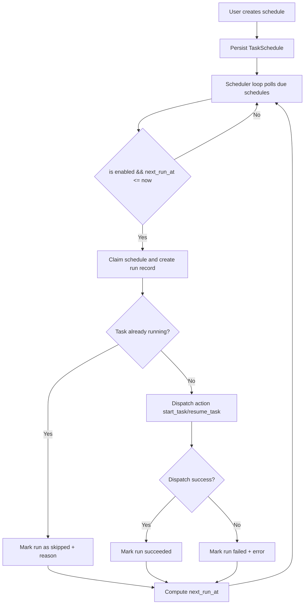
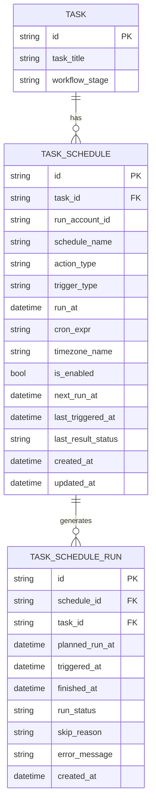

# PRD：任务定时与周期自动化调度

**原始需求标题**：增加定时任务
**需求名称（AI 归纳）**：任务定时触发与周期性自动化执行
**文件路径**：`tasks/prd-c3e023d8.md`
**创建时间**：2026-03-26 23:30:43 CST
**需求背景/上下文**：用户希望把需求先放置在待办状态，配置到特定时间自动启动；同时支持可重复执行的自动化任务（例如夜间自动代码审查）。
**参考上下文**：`dsl/models/task.py`, `dsl/services/task_service.py`, `dsl/api/tasks.py`, `dsl/services/codex_runner.py`, `dsl/app.py`, `frontend/src/types/index.ts`, `frontend/src/api/client.ts`, `utils/database.py`, `utils/settings.py`

---

## 0. 关键澄清（按推荐方案默认生效）

1. 定时能力的作用对象是什么？
A. 仅支持“到点启动任务”
B. 支持“到点启动 + 周期触发自动化动作”
C. 独立于任务系统，做全局 cron 平台
> **Recommended: B**。原始诉求同时包含“一次性启动”和“多次执行（夜间审查）”。

2. 周期规则如何表达？
A. 仅固定“每天某个时刻”
B. 使用 Cron 表达式 + 时区
C. 手写脚本，不提供结构化配置
> **Recommended: B**。可覆盖每天/每周/工作日等常见规则，且可扩展。

3. 定时触发的动作边界是什么？
A. 任意 shell 命令
B. 仅允许白名单任务动作（如 `start`/`resume`/`review`）
C. 直接调用内部私有函数，不做约束
> **Recommended: B**。安全性和可审计性更高，符合现有 `tasks` 工作流。

4. 同一任务同一时间有重复触发时如何处理？
A. 并行执行多个自动化流程
B. 若任务已有运行中自动化则跳过本次，并写入记录
C. 强制中断旧流程再启动新流程
> **Recommended: B**。当前系统已存在 `is_codex_task_running` 运行态语义，优先保持稳定。

5. 首期是否支持多实例分布式调度抢占？
A. 支持多实例强一致调度
B. 单实例优先，预留租约字段以便后续扩展
C. 不考虑并发与幂等
> **Recommended: B**。当前 DSL 运行形态以单实例为主，但应提前保留可演进设计。

## 1. Introduction & Goals

### 背景

当前任务流支持手动触发（开始任务、开始执行、恢复执行等），但缺少“未来时刻触发”和“周期触发”能力。对于以下场景存在明显缺口：

- 需求先进入 backlog，约定在夜间自动启动。
- 对同一任务设置每日/每周自动审查窗口。
- 需要可追踪的定时执行历史与失败原因，而不是手工记忆。

### 目标

- [ ] 支持一次性定时触发（例如“明天 02:00 启动任务”）。
- [ ] 支持周期触发（Cron + 时区），可用于夜间自动代码审查。
- [ ] 支持任务级别的调度配置增删改查与启停。
- [ ] 支持调度执行审计（成功/失败/跳过、时间、原因）。
- [ ] 与现有工作流兼容，不破坏当前手动触发链路。
- [ ] 前端提供可视化配置入口和下一次执行时间展示。

## 2. Implementation Guide

### 2.0 核心方案

引入“任务调度层（Task Scheduler）”，由后端周期轮询到期计划并分发到既有任务自动化入口。首期定义两个动作类型：

- `start_task`：把 backlog 任务按计划启动。
- `resume_task`：在可恢复阶段按计划恢复自动化（覆盖夜间审查/续跑场景）。

后续可扩展 `execute_task`、`complete_task` 等动作，但不纳入本期强制范围。

### 2.1 Change Matrix

| Change Target | Current State | Target State | How to Modify | Affected Files |
| --- | --- | --- | --- | --- |
| 调度数据模型 | 无任务级调度实体 | 新增 `TaskSchedule` 与 `TaskScheduleRun` | 新增 ORM 模型与索引，支持一次性/周期触发与执行记录 | `dsl/models/task_schedule.py`(new), `dsl/models/task_schedule_run.py`(new), `dsl/models/__init__.py`, `utils/database.py` |
| 调度配置 Schema | 无 | 新增调度 CRUD 的请求/响应模型 | 使用 Pydantic 明确定义触发类型、动作类型、时间字段、校验规则 | `dsl/schemas/task_schedule_schema.py`(new), `dsl/schemas/__init__.py` |
| 调度业务服务 | 无 | 新增调度服务与执行器 | 提供计算 `next_run_at`、到期计划领取、动作分发、结果落库 | `dsl/services/task_schedule_service.py`(new), `dsl/services/task_scheduler_dispatcher.py`(new) |
| API 层 | 无调度接口 | 提供任务调度 API | 新增 `/api/tasks/{task_id}/schedules` 相关接口，接入权限和参数校验 | `dsl/api/task_schedules.py`(new), `dsl/api/__init__.py` |
| 应用生命周期 | 仅停滞提醒循环 | 启动调度轮询循环 | 在 `lifespan` 中新增调度 loop，支持可配置轮询间隔和批量上限 | `dsl/app.py`, `utils/settings.py` |
| 前端类型与请求 | 无调度类型 | 新增调度类型与 API 客户端 | 补充 TS 类型与调用封装 | `frontend/src/types/index.ts`, `frontend/src/api/client.ts` |
| 前端交互 | 无调度 UI | 增加任务详情“定时任务”面板 | 支持创建一次性/周期规则、启停、删除、查看下次执行和最近结果 | `frontend/src/App.tsx`, `frontend/src/components/SettingsModal.tsx`(如复用) |
| 文档 | 无调度使用说明 | 增加调度配置与运维说明 | 更新 MkDocs 导航、API 参考、配置说明 | `docs/guides/dsl-development.md`, `docs/guides/configuration.md`, `docs/api/references.md`, `mkdocs.yml` |
| 测试 | 无调度测试 | 覆盖模型、API、执行器、边界条件 | 补齐 cron 计算、重入跳过、失败重试、时区边界测试 | `tests/test_task_schedule_api.py`(new), `tests/test_task_scheduler_dispatcher.py`(new), `tests/test_database.py` |

### 2.2 Flow Diagram



### 2.3 Low-Fidelity Prototype

```text
任务详情页
┌──────────────────────────────────────────────┐
│ 定时任务                                     │
├──────────────────────────────────────────────┤
│ [动作] start_task / resume_task              │
│ [触发] once / cron                           │
│ [时间] 2026-03-27 02:00 (Asia/Shanghai)      │
│ [Cron] 0 2 * * *                             │
│ [启用] ON                                    │
│ [保存规则]                                   │
├──────────────────────────────────────────────┤
│ 已配置规则                                   │
│ - 每晚 02:00 自动审查（resume_task）         │
│   Next: 2026-03-28 02:00                     │
│   Last: skipped (task already running)       │
│   [停用] [立即执行] [删除]                   │
└──────────────────────────────────────────────┘
```

### 2.4 ER Diagram



### 2.5 API 合同（Draft）

| Method | Path | Purpose |
| --- | --- | --- |
| `GET` | `/api/tasks/{task_id}/schedules` | 查询任务的调度规则列表 |
| `POST` | `/api/tasks/{task_id}/schedules` | 创建调度规则（once/cron） |
| `PATCH` | `/api/tasks/{task_id}/schedules/{schedule_id}` | 更新规则（启停、cron、动作、时间） |
| `DELETE` | `/api/tasks/{task_id}/schedules/{schedule_id}` | 删除规则 |
| `POST` | `/api/tasks/{task_id}/schedules/{schedule_id}/run-now` | 手动立即触发一次（调试入口） |
| `GET` | `/api/tasks/{task_id}/schedules/runs` | 查看执行历史 |

### 2.6 执行语义与约束

- 时间语义：统一使用 `APP_TIMEZONE`（默认 `Asia/Shanghai`）解释 UI 输入时间。
- 触发类型：
  - `once`：执行后自动禁用该规则。
  - `cron`：执行后计算并更新下一次 `next_run_at`。
- 幂等与重入：单条规则每个计划时间窗只允许一个执行记录。
- 冲突策略（本期固定）：任务已有后台自动化运行时，当前调度执行记为 `skipped`。
- 失败策略：失败记录入 `TaskScheduleRun`，不自动重试到无限；默认下次按周期继续。

### 2.7 配置项（新增）

- `SCHEDULER_POLL_INTERVAL_SECONDS`：调度轮询间隔，默认 `30`。
- `SCHEDULER_MAX_DISPATCH_PER_TICK`：每轮最多派发条数，默认 `20`。
- `SCHEDULER_ENABLE`：是否启用调度器，默认 `true`。

### 2.8 Interactive Prototype Change Log

No interactive prototype file changes in this PRD.

## 3. Global Definition of Done

- [ ] 能创建一次性规则，并在到点后自动触发 `start_task`。
- [ ] 能创建 cron 规则，并连续至少 2 个周期正确触发。
- [ ] 夜间自动审查场景可通过 `resume_task` 周期规则落地。
- [ ] 任务正在运行时重复触发不会并发执行，执行记录标记为 `skipped`。
- [ ] 规则具备启用/停用/删除能力，且状态持久化正确。
- [ ] 能查看每次执行的结果、时间和错误原因。
- [ ] `uv run pytest` 新增调度相关测试全部通过。
- [ ] `uv run mkdocs build` 通过并完成文档导航更新。

## 4. User Stories

### US-001：作为用户，我希望任务可以在指定时间自动启动

**Description:** As a user, I want backlog tasks to start automatically at a specified time so I can queue work without waiting online.

**Acceptance Criteria:**
- [ ] 可以为任务设置一次性启动时间。
- [ ] 到点后任务自动进入既有启动流程。
- [ ] 执行结果可追踪。

### US-002：作为用户，我希望设置周期性自动执行

**Description:** As a user, I want recurring schedules (e.g., nightly) so recurring review work runs without manual clicks.

**Acceptance Criteria:**
- [ ] 支持 cron 规则创建与修改。
- [ ] 每次执行后自动计算下一次执行时间。
- [ ] 可用于夜间自动代码审查场景。

### US-003：作为维护者，我希望调度行为可审计且可排障

**Description:** As a maintainer, I want execution history and explicit failure reasons so I can debug scheduler behavior quickly.

**Acceptance Criteria:**
- [ ] 每次执行有独立 run 记录。
- [ ] 成功/失败/跳过状态明确。
- [ ] 失败信息可在 UI/API 中查看。

## 5. Functional Requirements

1. `FR-1` 系统必须支持任务级一次性调度（指定未来时间执行）。
2. `FR-2` 系统必须支持任务级周期调度（Cron 表达式）。
3. `FR-3` 调度规则必须包含动作类型、触发类型、时区、启用状态和下一次执行时间。
4. `FR-4` 首期动作类型至少支持 `start_task` 与 `resume_task`。
5. `FR-5` 调度器必须按固定轮询周期扫描到期规则。
6. `FR-6` 到期规则执行前必须做领取/锁定，避免同一规则重复派发。
7. `FR-7` 当任务已有后台自动化运行时，调度执行必须跳过并记录原因。
8. `FR-8` 每次调度执行必须写入 run 审计记录。
9. `FR-9` `once` 规则执行后必须自动停用。
10. `FR-10` `cron` 规则执行后必须更新下一次执行时间。
11. `FR-11` API 必须提供规则的增删改查与立即执行接口。
12. `FR-12` 前端必须提供规则配置表单与执行历史查看能力。
13. `FR-13` 前端必须展示“下一次执行时间”和“最近一次执行结果”。
14. `FR-14` 调度时间解析必须遵循 `APP_TIMEZONE` 语义。
15. `FR-15` 新增数据库字段与表必须通过 `ensure_database_schema_ready()` 兼容初始化。
16. `FR-16` 调度功能必须在日志中输出结构化执行信息，便于排障。
17. `FR-17` 测试必须覆盖 cron 计算、一次性禁用、运行冲突跳过和失败路径。
18. `FR-18` 文档必须更新 API、配置、使用说明和运维注意事项。

## 6. Non-Goals

- 不实现通用任意脚本执行平台。
- 不在本期支持跨任务依赖编排（DAG）与复杂工作流引擎。
- 不在本期实现多实例分布式强一致抢占调度。
- 不在本期提供秒级高精度触发（分钟级满足场景）。
- 不改变现有手动触发流程的业务语义。
