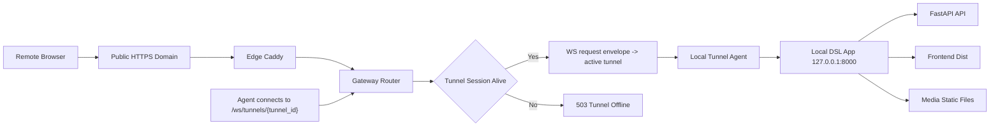

# PRD：服务器反向隧道转发与本地 DSL 公网访问方案

**原始需求标题**：Can a forwarding service be deployed on the server to expose this local application to the public internet, including the service code, Docker Compose, and any additional code and settings required?
**需求名称（AI 归纳）**：服务器反向隧道转发与本地 DSL 公网访问方案
**文件路径**：`tasks/prd-cfd7faaa.md`
**创建时间**：2026-03-19 02:04:35 CST
**参考上下文**：`docs/guides/deployment.md`, `docs/guides/configuration.md`, `dsl/app.py`, `dsl/services/codex_runner.py`, `dsl/services/project_service.py`, `dsl/services/terminal_launcher.py`, `frontend/vite.config.ts`

---

## 1. Introduction & Goals

### 背景

当前仓库的真实运行形态是本机开发工作台，而不是已经服务器化的生产应用：

- `docs/guides/deployment.md` 明确说明仓库尚无现成的 Docker、Compose 或反向代理方案。
- `dsl/services/codex_runner.py` 直接依赖本机 `codex` CLI 和本地工作树。
- `dsl/services/project_service.py` 依赖本机 Git 仓库路径与仓库指纹。
- `dsl/services/terminal_launcher.py` 直接调用本机终端能力。
- `frontend/vite.config.ts` 与 `dsl/app.py` 目前只覆盖本地开发端口 `5173/8000` 的协作模式。

因此，这个需求的最佳解不是“把现有 DSL 直接搬到公网服务器上运行”，而是新增一条受控的公网入口链路：

1. 本机继续运行 DSL 与本地依赖。
2. 公网服务器部署一个可 Docker Compose 编排的转发服务。
3. 本机 agent 主动连出到服务器，形成反向隧道。
4. 远程浏览器通过统一公网域名访问该本机应用。

本 PRD 默认目标是“单操作者、受鉴权保护的公网访问”，不是匿名公开站点。

### 可衡量目标

- [ ] 通过 `docker compose` 在服务器上启动公网入口服务，提供稳定 HTTPS 域名访问。
- [ ] 本机 DSL 无需迁移到服务器，继续使用现有本地数据库、媒体目录、Git worktree 与 Codex CLI。
- [ ] 远程浏览器可以通过单一公网地址访问前端页面、`/api`、`/media` 与 `/health`。
- [ ] 公网入口默认启用访问鉴权，未认证流量不得进入本机 DSL。
- [ ] 本地开发模式 `just dsl-dev` 保持不变，不破坏现有工作流。
- [ ] 新方案包含服务代码、服务器 Compose、应用配套设置、测试与文档说明。

### 1.1 Clarifying Questions

以下问题无法仅靠代码直接确定。本 PRD 默认按推荐选项落地。

1. 公网暴露模式应该是什么？
A. 将整个 DSL 迁移到服务器运行
B. 服务器仅作为公网入口，本机继续运行 DSL，使用反向隧道转发
C. 直接开放本机路由器端口
> **Recommended: B**（最符合当前代码结构。`dsl/services/codex_runner.py`、`dsl/services/project_service.py`、`dsl/services/terminal_launcher.py` 都强依赖本机环境；`docs/guides/deployment.md` 也把仓库定位为单机工作台。）

2. 公网访问的安全模型应该是什么？
A. 完全匿名开放
B. 入口层 Basic Auth + 隧道注册 Token
C. 先补齐应用内完整多用户鉴权再开放
> **Recommended: B**（当前应用本身没有认证体系，直接匿名开放不可接受；而一次性引入完整用户体系超出本需求边界。入口层鉴权是最小可行且与现状兼容的方案。）

3. 前端应该如何通过隧道暴露？
A. 直接把 Vite 开发服务器 `5173` 暴露到公网
B. 构建 `frontend/dist`，由 FastAPI 在公网模式下同源托管
C. 前端单独部署到静态托管/CDN
> **Recommended: B**（`frontend/src/api/client.ts` 当前固定使用相对路径 `/api`，`frontend/vite.config.ts` 的代理仅适用于开发态；同源托管能把公网模式收敛为单端口 `8000`，显著降低隧道复杂度。）

4. 转发协议的范围应该是什么？
A. 仅支持 HTTP/HTTPS
B. 任意 TCP 端口透传
C. 远程桌面/SSH 级别通道
> **Recommended: A**（本应用的真实流量是 HTML、JSON、媒体文件和少量 API 请求；做 HTTP 隧道即可覆盖现有需求，复杂度和安全面都更可控。）

5. 这次实现应采用哪种交付方式？
A. 仅接入外部现成产品（如 frp / cloudflared）
B. 在仓库内实现最小可控的转发服务与 agent 代码
C. 只写 Caddy/Nginx 配置，不实现隧道
> **Recommended: B**（原始需求明确要求“service code、Docker Compose、additional code and settings”；仓库已有 Python/FastAPI/uv 工程基础，做最小自有 HTTP 隧道实现最契合交付合同。）

## 2. Implementation Guide

### 核心逻辑

建议架构如下：

1. 本机 DSL 新增“打包运行模式”：
   - `frontend` 先构建为 `frontend/dist`
   - `dsl/app.py` 在 `SERVE_FRONTEND_DIST=true` 时托管静态资源和 SPA fallback
   - 本机公网转发统一只指向 `http://127.0.0.1:8000`
2. 本机 agent 通过 `wss://<public-host>/ws/tunnels/{tunnel_id}` 主动连出到服务器 gateway：
   - 注册时校验 `KODA_TUNNEL_SHARED_TOKEN`
   - 维持心跳、断线重连和单会话占用
3. 服务器侧 `gateway` 维护活动隧道表，并将公网 HTTP 请求封装后经 WebSocket 发给 agent。
4. agent 在本机把请求转发到 `KODA_TUNNEL_UPSTREAM_URL`，默认 `http://127.0.0.1:8000`。
5. agent 将本机响应回传给 gateway，gateway 再返回给公网浏览器。
6. Caddy 位于 gateway 前方，负责 TLS、域名绑定与 Basic Auth；gateway 只暴露给 Caddy 的内部网络。
7. 若隧道离线，gateway 必须返回明确的 `503 Tunnel Offline` 页面或 JSON，而不是尝试暴露本机地址。

### 2.1 Change Matrix

| Change Target | Current State | Target State | How to Modify | Affected Files |
|---|---|---|---|---|
| 服务器转发服务 | 仓库内不存在公网入口服务 | 新增可独立部署的 gateway，负责 agent 注册、会话管理、HTTP 请求转发与离线兜底 | 使用 FastAPI/Starlette 实现最小 HTTP-over-WebSocket gateway，提供 `/health` 与受保护的状态接口 | `forwarding_service/server/app.py`, `forwarding_service/server/session_registry.py`, `forwarding_service/server/schemas.py` |
| 本机隧道 agent | 不存在 | 新增本机 agent，主动连出服务器并把请求转发到本机 DSL | 使用异步 Python agent，实现 token 鉴权、心跳、重连、HTTP 请求桥接与优雅退出 | `forwarding_service/agent/main.py`, `forwarding_service/agent/http_bridge.py`, `forwarding_service/agent/config.py` |
| Python 依赖 | 目前只有 FastAPI、Uvicorn、SQLAlchemy 等基础依赖 | 增加隧道必需依赖 | 在主依赖中加入 `httpx` 与 `websockets`（或等价库），并更新锁文件 | `pyproject.toml`, `uv.lock` |
| DSL 公网打包运行模式 | 当前前端依赖 Vite，后端只提供 API 与媒体目录 | FastAPI 可在公网模式下同源托管 `frontend/dist`，对外统一单端口 | 在 `dsl/app.py` 增加静态资源挂载与 SPA fallback；默认不影响本地开发模式 | `dsl/app.py`, `main.py`, `utils/settings.py` |
| 公网运行配置 | 仅有数据库、日志、时区、终端命令等配置 | 增加公网与隧道相关环境变量 | 扩展 `Config`，新增 `SERVE_FRONTEND_DIST`、`FRONTEND_DIST_PATH`、`KODA_PUBLIC_BASE_URL`、`KODA_TUNNEL_SERVER_URL`、`KODA_TUNNEL_ID`、`KODA_TUNNEL_SHARED_TOKEN`、`KODA_TUNNEL_UPSTREAM_URL` 等 | `utils/settings.py`, `docs/guides/configuration.md` |
| 服务器部署编排 | `docs/guides/deployment.md` 明确当前没有 Dockerfile / Compose / 反向代理配置 | 新增服务器部署包，可直接 `docker compose up -d` | 提供 gateway Dockerfile、Compose、Caddyfile、环境变量示例与卷映射 | `deploy/public-forward/Dockerfile.gateway`, `deploy/public-forward/docker-compose.yml`, `deploy/public-forward/Caddyfile`, `deploy/public-forward/.env.example` |
| 本地操作命令 | 当前只有 `just run`、`just dsl-dev`、`build-frontend` 等 | 增加公网模式的一键命令 | 添加 `public-build`、`public-agent` 等 recipe，约束前端构建和 agent 启动方式 | `justfile` |
| 文档导航与部署说明 | 仅描述本地开发和最小部署建议 | 增加独立的公网暴露指南 | 新增文档页解释部署拓扑、环境变量、安全边界和常见故障，并更新 `mkdocs.yml` 导航 | `docs/guides/public-exposure.md`, `docs/guides/deployment.md`, `docs/guides/configuration.md`, `mkdocs.yml` |
| 测试覆盖 | 当前没有隧道或公网模式测试 | 增加 gateway、agent、打包运行模式的回归测试 | 为隧道认证、离线处理、请求转发和 SPA fallback 增加单元/集成测试 | `tests/test_public_gateway_server.py`, `tests/test_public_tunnel_agent.py`, `tests/test_packaged_runtime.py` |

### 2.2 Flow Diagram



### 2.3 Low-Fidelity Prototype

```text
公网服务器
┌──────────────────────────────────────────────────────────────┐
│ docker compose                                              │
│                                                              │
│  [caddy:443]  ->  [gateway:9000]                             │
│      │                  │                                    │
│      │ HTTPS + Auth     │ active tunnel registry             │
└──────┼──────────────────┼────────────────────────────────────┘
       │                  │ WebSocket
       │                  ▼
本机开发机
┌──────────────────────────────────────────────────────────────┐
│ [public-agent]  ->  [DSL App :8000]                          │
│                       ├─ /            -> frontend/dist       │
│                       ├─ /api/*       -> FastAPI routes      │
│                       ├─ /media/*     -> StaticFiles         │
│                       └─ /health      -> health JSON         │
└──────────────────────────────────────────────────────────────┘

远程用户访问链路：
Browser -> https://koda.example.com -> Caddy -> Gateway -> Agent -> Local DSL
```

### 2.4 ER Diagram

本需求默认不改动现有数据库表结构。隧道状态、认证信息和公网入口配置均以进程内状态与环境变量/部署文件管理，不新增 `Task`、`Project`、`DevLog` 等持久化模型，因此本 PRD 不要求新增 ER 图。

### 2.8 Interactive Prototype Change Log

No interactive prototype file changes in this PRD.

## 3. Global Definition of Done

- [ ] `npm --prefix frontend run build` 能稳定产出 `frontend/dist`
- [ ] `SERVE_FRONTEND_DIST=true` 时，本机 `uv run python main.py` 可以在 `http://127.0.0.1:8000/` 返回前端页面，并保持 `/api`、`/media`、`/health` 可用
- [ ] 服务器执行 `docker compose -f deploy/public-forward/docker-compose.yml up -d` 后，`caddy` 与 `gateway` 健康启动
- [ ] 本机 agent 使用正确配置可在 10 秒内完成注册，并持续维持心跳连接
- [ ] 已认证的远程浏览器能通过单一公网域名访问页面、API 和媒体文件
- [ ] 未通过 Basic Auth 的公网请求返回 `401`；未通过 tunnel token 的 agent 注册被拒绝
- [ ] agent 离线时，gateway 返回确定性的 `503` 响应，不泄露本机地址、端口或文件路径
- [ ] 现有本地开发流 `just dsl-dev` 不回归，Vite 本地开发体验保持不变
- [ ] `uv run pytest` 中新增的隧道与打包运行模式测试通过
- [ ] `uv run mkdocs build` 通过，文档导航和部署说明已同步更新
- [ ] 代码遵循仓库约定：Google Style docstring、显式 UTF-8 文件 I/O、类型注解与清晰命名

## 4. User Stories

### US-001：作为操作者，我要在公网服务器部署入口服务

**Description:** As an operator, I want to deploy a public gateway on a server so that I can expose my local DSL through a controlled public URL.

**Acceptance Criteria:**
- [ ] 服务器上只需 `docker compose` 即可拉起 `caddy` 与 `gateway`
- [ ] 域名、Basic Auth 凭据与 tunnel token 通过环境变量配置
- [ ] `gateway` 提供健康检查，便于监控与排障

### US-002：作为本机开发者，我要保留现有本地 DSL 运行方式

**Description:** As a developer, I want the DSL to keep running on my workstation so that local Git、Codex CLI、终端和媒体目录能力都不需要迁移到服务器。

**Acceptance Criteria:**
- [ ] 本机仍可使用现有 SQLite、工作树、Codex CLI 与终端能力
- [ ] agent 仅把公网请求转发到本地 `127.0.0.1:8000`
- [ ] 本地开发模式与公网模式可以独立启停

### US-003：作为远程访问者，我要通过一个公网地址访问完整应用

**Description:** As an authorized remote user, I want one public URL that loads the UI, API, and media together so that the app behaves the same as the local experience.

**Acceptance Criteria:**
- [ ] 访问根路径 `/` 能看到前端页面
- [ ] 页面内的 `/api/*` 请求无需改代码即可成功返回
- [ ] 媒体资源 `/media/*` 可以通过同一域名正常显示

### US-004：作为操作者，我要在隧道断开时得到可观测反馈

**Description:** As an operator, I want clear offline and reconnect behavior so that I can quickly recover public sharing when the workstation or network is unstable.

**Acceptance Criteria:**
- [ ] agent 支持心跳、断线重连和结构化日志
- [ ] gateway 在没有活动隧道时返回 `503 Tunnel Offline`
- [ ] 文档明确列出常见故障与恢复步骤

## 5. Functional Requirements

1. **FR-1**：仓库中必须新增服务器侧转发服务代码，路径位于 `forwarding_service/server/`。
2. **FR-2**：服务器侧转发服务必须支持基于 WebSocket 的 agent 注册端点，形如 `/ws/tunnels/{tunnel_id}`。
3. **FR-3**：agent 注册必须校验共享密钥，错误 token 不得建立活动隧道。
4. **FR-4**：每个 `tunnel_id` 在任意时刻只允许一个活动 agent 会话；重复连接时必须有确定性的替换或拒绝策略。
5. **FR-5**：gateway 必须将公网 HTTP 请求转发给活动 agent，并保持方法、路径、查询参数、请求头、请求体和响应状态码的一致性。
6. **FR-6**：gateway 必须处理 `/`、`/api/*`、`/media/*` 与 `/health` 等现有 DSL 路径，不要求修改现有前端 `API_BASE="/api"` 约定。
7. **FR-7**：本机 agent 必须将收到的请求转发到 `KODA_TUNNEL_UPSTREAM_URL`，默认值为 `http://127.0.0.1:8000`。
8. **FR-8**：本机 agent 必须具备心跳、断线重连、超时控制和结构化日志输出能力。
9. **FR-9**：DSL 应用必须新增公网打包运行模式，在 `SERVE_FRONTEND_DIST=true` 时由 FastAPI 同源托管 `frontend/dist` 与 SPA fallback。
10. **FR-10**：公网打包运行模式不能破坏当前开发模式；`just dsl-dev` 仍然继续使用 Vite 开发服务器和本地代理。
11. **FR-11**：服务器部署必须提供 Docker Compose、gateway Dockerfile、Caddyfile 和环境变量示例文件。
12. **FR-12**：公网入口必须默认启用 HTTPS 和 Basic Auth，未认证浏览器请求不能进入 gateway。
13. **FR-13**：gateway 在 agent 离线时必须返回稳定的 `503` 响应，并提供明确错误文案，不得暴露本机真实网络信息。
14. **FR-14**：新增配置项必须至少覆盖 `SERVE_FRONTEND_DIST`、`FRONTEND_DIST_PATH`、`KODA_PUBLIC_BASE_URL`、`KODA_TUNNEL_SERVER_URL`、`KODA_TUNNEL_ID`、`KODA_TUNNEL_SHARED_TOKEN`、`KODA_TUNNEL_UPSTREAM_URL`。
15. **FR-15**：新增实现必须补齐自动化测试，覆盖 agent 鉴权、离线处理、请求转发和 SPA fallback。
16. **FR-16**：文档必须同步更新，包括部署说明、配置说明和新的公网暴露操作手册，并确保 `mkdocs.yml` 导航可达。

## 6. Non-Goals

- 不把 SQLite、媒体目录、Git 仓库或 Codex CLI 迁移到公网服务器
- 不在本需求内实现完整的应用内多用户鉴权、RBAC 或审计系统
- 不支持任意 TCP/UDP 透传，只覆盖当前 DSL 所需的 HTTP/HTTPS 流量
- 不把 Vite 开发服务器直接作为公网长期运行方案
- 不在本需求内扩展为多租户 SaaS 隧道平台
- 不处理企业级单点登录、OIDC、WAF 或高可用多节点容灾
