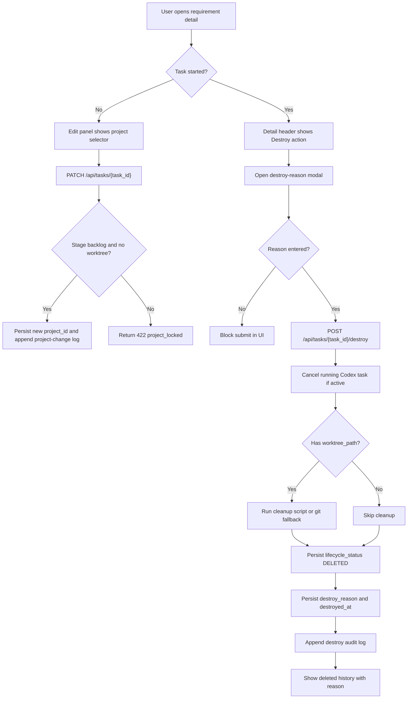
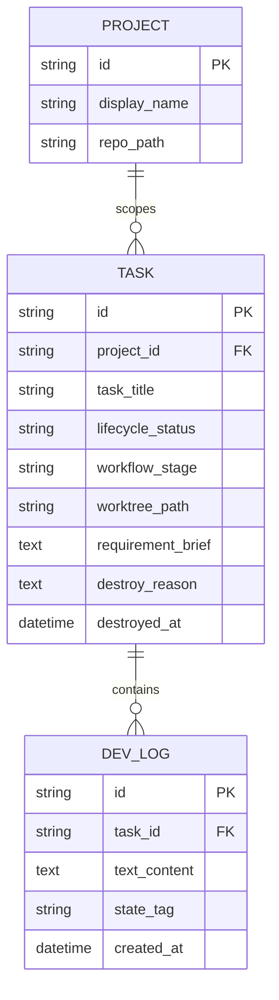

# PRD：任务关联项目可改绑与已启动任务销毁原因记录

**原始需求标题**：现在有个问题,我选错项目就不能改了
**需求名称（AI 归纳）**：任务关联项目可改绑与已启动任务销毁原因记录
**文件路径**：`tasks/prd-df3b22d8.md`
**创建时间**：2026-03-26 18:52:14 CST
**参考上下文**：`frontend/src/App.tsx`, `frontend/src/api/client.ts`, `frontend/src/types/index.ts`, `frontend/src/index.css`, `dsl/api/tasks.py`, `dsl/services/task_service.py`, `dsl/models/task.py`, `dsl/schemas/task_schema.py`, `dsl/services/git_worktree_service.py`, `utils/database.py`, `docs/database/schema.md`, `/home/atahang/codes/koda/data/media/original/816b5b30-9d6e-457c-9d1f-9aff9df0f959.png`

---

## 1. Introduction & Goals

### 背景

当前任务卡片的“关联项目”只在创建时可选，后续编辑流程无法修改：

- `frontend/src/App.tsx` 的创建面板已有项目下拉框，但 `Requirement Revision` 编辑面板只有标题、描述和附件输入，没有项目选择控件。
- `frontend/src/api/client.ts` 中 `taskApi.update(...)` 仅提交 `task_title` 与 `requirement_brief`。
- `dsl/schemas/task_schema.py` 中 `TaskUpdateSchema` 也没有 `project_id`，`dsl/services/task_service.py` 的 `update_task_title(...)` 只会更新标题和需求描述。
- `dsl/services/task_service.py:start_task(...)` 会在任务开始时基于当前 `project_id` 创建或复用 worktree，因此一旦开始任务，项目绑定就会变成运行上下文的一部分。

当前删除流程也缺少“已启动任务销毁”的专门语义：

- `frontend/src/App.tsx:handleDeleteRequirement(...)` 目前只用 `window.confirm(...)` 做轻确认。
- 前端随后调用 `taskApi.updateStatus(..., DELETED)`，后端 `dsl/services/task_service.py:update_task_status(...)` 仅更新 `lifecycle_status`，没有要求填写删除/销毁原因。
- 当前流程会追加一条通用 `Requirement Deleted` 日志，但不会把原因结构化写回 `Task`。

### 附件佐证

已直接检查附件 `/home/atahang/codes/koda/data/media/original/816b5b30-9d6e-457c-9d1f-9aff9df0f959.png`。可确认的信息如下：

- 文件存在且可读取，是一张需求详情页截图。
- 截图顶部操作区可见 `开始任务`、`打开项目`、`Edit Requirement`、`Complete`、`Delete` 等动作，说明“Delete”当前是详情页主操作之一。
- 截图中的 `Requirement Revision` 编辑区域包含标题、需求说明和附件，但未见“关联项目”下拉框或项目锁定提示。
- 截图中未出现“销毁原因”弹层、输入框或回显区，支持“已启动任务销毁缺少原因采集”的判断。

### 可衡量目标

- [ ] 任务处于 `backlog` 且尚未创建 worktree 时，用户可在编辑面板中修改 `project_id`。
- [ ] 一旦任务开始，前端必须把关联项目切换为只读展示，并给出锁定原因提示。
- [ ] 已启动任务支持“销毁任务”动作，提交前必须填写销毁原因。
- [ ] 销毁已启动任务时，系统会停止后台自动化、尽可能清理 worktree/分支，并把任务移动到 deleted history。
- [ ] 销毁原因可在任务详情、归档视图或时间线中被明确查看，不依赖人工翻日志全文。
- [ ] 文档、原型页和手工验证说明同步更新，便于产品和开发确认边界。

### 1.1 Clarifying Questions

以下问题无法只靠当前代码直接确定。本 PRD 默认按推荐选项落地。

1. “销毁任务”对已启动任务的真实含义应该是什么？
A. 只把 `lifecycle_status` 改成 `DELETED`，不处理后台运行和 worktree
B. 停止自动化、清理 worktree/分支（若存在）、记录原因，再进入 deleted history
C. 彻底物理删除任务、日志和附件
> **Recommended: B**（当前任务运行依赖 `worktree_path` 与后台 Codex 状态；只改状态会留下残余上下文，彻底物理删除又会破坏审计。现有代码里 `dsl/api/tasks.py:/cancel` 和 `dsl/services/git_worktree_service.py` 已分别提供“中断运行”和“定位 cleanup 脚本”的落点。）

2. 哪些阶段允许改绑关联项目？
A. 仅 `workflow_stage=backlog` 且 `worktree_path` 为空时允许
B. `backlog` 和 `prd_waiting_confirmation` 都允许
C. 一直到 `implementation_in_progress` 前都允许
> **Recommended: A**（`dsl/services/task_service.py:start_task(...)` 在开始阶段就会根据 `project_id` 创建 worktree；此后再改项目会让 `Task.project_id` 与 `Task.worktree_path` 脱钩。）

3. 销毁原因的输入约束应该是什么？
A. 必填自由文本，最少 5 字，最大 200 字，销毁后只读
B. 可空自由文本
C. 预设枚举原因 + 备注补充
> **Recommended: A**（当前 UI 和 API 以轻量文本输入为主，没有现成的枚举配置中心；先做必填自由文本最契合现有实现复杂度。）

4. `backlog` 任务的现有 Delete 行为是否要一起改成“必须填写原因”？
A. 全部统一成强制填写原因
B. 保持 `backlog` 轻量删除；仅“已启动任务销毁”强制填写原因
C. 取消 Delete，只保留 Destroy
> **Recommended: B**（这是最小改动路径，也最贴近原始诉求“如果任务开始了，应该允许我销毁任务，并输入销毁原因”。）

## 2. Implementation Guide

### 核心逻辑

建议把这次需求拆成两条明确的业务规则：

1. **任务开始前允许改绑项目**
   - 扩展 `TaskUpdateSchema`、`taskApi.update(...)` 与前端编辑面板，使 `project_id` 可被提交。
   - 后端只在任务仍处于 `backlog`、未运行、且未创建 `worktree_path` 时接受项目改绑。
   - 改绑后保留当前“追加需求变更日志”的行为，但项目改绑本身需要单独追加一条系统日志，明确 old/new project。

2. **任务开始后允许销毁并要求原因**
   - 为已启动任务新增专门的 `destroy` 动作，不复用当前“轻量 Delete”交互。
   - 新增 `TaskDestroySchema`，要求前端提交 `destroy_reason`。
   - 后端先停止当前后台任务，再尝试清理 worktree 与任务分支；清理成功后才将任务标记为 `DELETED` 并写入结构化原因。
   - 销毁结果要同时体现在 `Task` 结构化字段和 `DevLog` 时间线中，方便前端列表和详情页同时读取。

### 2.1 Change Matrix

| Change Target | Current State | Target State | How to Modify | Affected Files |
|---|---|---|---|---|
| 任务编辑 API 合同 | `PATCH /tasks/{task_id}` 只能更新标题和 `requirement_brief` | 支持在合法条件下更新 `project_id` | 扩展 `TaskUpdateSchema`、前端 `taskApi.update(...)`、服务层校验逻辑；非法阶段返回 422 | `dsl/schemas/task_schema.py`, `dsl/api/tasks.py`, `dsl/services/task_service.py`, `frontend/src/api/client.ts` |
| 任务编辑服务命名与语义 | `update_task_title(...)` 名称与真实职责不匹配 | 统一改为“更新任务内容”，覆盖标题、描述、项目改绑 | 重构服务方法命名与实现，避免后续继续在标题方法里堆业务 | `dsl/services/task_service.py` |
| Backlog 编辑面板 | 只能改标题/描述/附件 | 新增项目下拉；仅在 backlog 可编辑 | 复用创建面板的项目可选逻辑与 `isProjectSelectable(...)`，增加锁定态提示文案 | `frontend/src/App.tsx`, `frontend/src/index.css` |
| Started 任务详情操作 | 只有 `Delete` 轻确认，没有专门“销毁任务”语义 | 已启动任务显示 `Destroy` / `销毁任务`，并弹出原因输入框 | 新增 modal / drawer 状态、原因必填校验、成功回写 deleted history | `frontend/src/App.tsx`, `frontend/src/index.css` |
| 销毁请求接口 | 只有通用 `updateStatus(...DELETED)` | 新增 `POST /tasks/{task_id}/destroy` | 增加独立 schema 与 endpoint，避免普通状态更新接口承载销毁特有副作用 | `dsl/schemas/task_schema.py`, `dsl/api/tasks.py`, `frontend/src/api/client.ts` |
| 已启动任务销毁副作用 | 现有删除不会停止自动化，也不会处理 worktree | 销毁前停止后台自动化；若存在 worktree 则执行 cleanup；成功后再归档 | 复用 `cancel_codex_task(...)` / `clear_task_background_activity(...)`，并调用 worktree cleanup 脚本或 Git fallback | `dsl/api/tasks.py`, `dsl/services/task_service.py`, `dsl/services/git_worktree_service.py`, `scripts/git_worktree_merge.sh` |
| 任务持久化结构 | `Task` 无销毁原因和销毁时间字段 | 新增 `destroy_reason`、`destroyed_at` 等结构化字段 | 更新 ORM、响应 schema、SQLite 增量补丁和文档 | `dsl/models/task.py`, `dsl/schemas/task_schema.py`, `utils/database.py`, `docs/database/schema.md` |
| 删除时间线语义 | 只有通用 `Requirement Deleted` 日志 | 已启动任务销毁写入标准化 `Requirement Destroyed` 日志，并包含原因/阶段/项目信息 | 新增统一日志模板，便于前端详情和归档视图解析展示 | `frontend/src/App.tsx`, `dsl/api/tasks.py` |
| 前端 Task 类型 | `Task` 不包含销毁原因相关字段 | 可直接渲染 `destroy_reason` / `destroyed_at` | 更新类型定义，减少前端对原始日志正文的依赖 | `frontend/src/types/index.ts` |
| 文档与交互演示 | 无对应原型页；数据库/验证文档也未覆盖此规则 | PRD、原型页、数据模型与验证说明同步 | 新增 prototype，更新 `mkdocs.yml`、`docs/database/schema.md`、`docs/dev/evaluation.md` 等 | `docs/prototypes/task-project-rebinding-and-destroy-demo.html`, `mkdocs.yml`, `docs/database/schema.md`, `docs/dev/evaluation.md` |
| 回归测试 | 当前没有项目改绑和 started destroy 的专门测试 | 覆盖阶段限制、原因必填、自动化中断、worktree cleanup 和前端交互边界 | 新增/扩展后端服务与 API 测试；前端至少保留编译级验证 | `tests/test_task_service.py`, `tests/test_tasks_api.py`, `frontend/package.json` |

### 2.2 Flow Diagram



### 2.3 Low-Fidelity Prototype

```text
Backlog Detail
┌─────────────────────────────────────────────────────────────┐
│ Title: 我选错项目就不能改了                 [Backlog]       │
│ Summary...                                                  │
│                                                             │
│ 关联项目                                                    │
│ [ Koda 主仓库 ▼ ]   <- 可编辑                              │
│ 提示：开始任务后锁定，避免 project_id 与 worktree 脱钩      │
│                                                             │
│ [保存项目绑定] [开始任务] [Edit Requirement] [Delete]        │
└─────────────────────────────────────────────────────────────┘

Started Detail
┌─────────────────────────────────────────────────────────────┐
│ Title: 我选错项目就不能改了                 [PRD 生成中]    │
│ 关联项目：Koda 主仓库（只读）                              │
│ Worktree: /repo/task/koda-wt-12345678                      │
│                                                             │
│ [打开项目] [打开 Worktree] [销毁任务]                       │
└─────────────────────────────────────────────────────────────┘

Destroy Modal
┌─────────────────────────────────────────────────────────────┐
│ 销毁任务                                                    │
│ 请输入销毁原因（必填）                                      │
│ [ PRD 已过时，且误绑到错误仓库，需要回收后重建…… ]         │
│ [取消]                                     [确认销毁]      │
└─────────────────────────────────────────────────────────────┘
```

### 2.4 ER Diagram



### 2.8 Interactive Prototype Change Log

| File Path | Change Type | Before | After | Why |
|---|---|---|---|---|
| `docs/prototypes/task-project-rebinding-and-destroy-demo.html` | Add | 仓库内没有专门覆盖“项目改绑 + started destroy”的演示页 | 新增交互原型，支持 backlog/started/destroyed 状态切换、项目可编辑/锁定对比、销毁原因输入和归档时间线 | 让产品、前端和后端在编码前对交互边界达成一致 |
| `mkdocs.yml` | Modify | Prototype 页面未暴露到文档导航 | 新增 `原型 -> 任务项目改绑与销毁` 导航项 | 确保评审时可直接访问 |

### 2.9 Interactive Prototype Link

- `docs/prototypes/task-project-rebinding-and-destroy-demo.html`

## 3. Global Definition of Done (DoD)

- [ ] Typecheck and Lint passes
- [ ] Verify visually in browser (if UI related)
- [ ] Follows existing project coding standards
- [ ] No regressions in existing features
- [ ] `backlog` 任务可在编辑面板中修改 `project_id`，并在详情中立即回显
- [ ] 非 `backlog` 或已创建 worktree 的任务，项目下拉不可编辑，且错误提示明确
- [ ] 已启动任务点击“销毁任务”时必须输入原因；空原因不能提交
- [ ] 销毁成功后，任务进入 deleted history，且详情页或时间线能看到销毁原因
- [ ] 若任务正在运行，销毁会先停止后台自动化，再做归档
- [ ] 若任务存在 `worktree_path`，销毁流程会执行 worktree cleanup；失败时给出明确错误，不静默吞掉
- [ ] `uv run pytest tests/test_task_service.py tests/test_tasks_api.py` 通过
- [ ] `just docs-build` 通过，原型页和文档导航可访问

## 4. User Stories

### US-001：作为需求发起人，我想在开始任务前改绑关联项目

**Description:** As a user, I want to change the linked project before the task starts so that I can correct an accidental project selection without recreating the task.

**Acceptance Criteria:**
- [ ] 仅 `backlog` 且未生成 worktree 的任务显示可编辑项目下拉
- [ ] 保存后 `Task.project_id` 被更新，并追加一条项目改绑日志
- [ ] 若项目状态无效（路径失效、wrong repo 等），仍按现有 `isProjectSelectable(...)` 规则禁选

### US-002：作为执行中的任务操作者，我希望任务开始后项目绑定被锁定

**Description:** As a user, I want the linked project to become read-only after task start so that the stored project context stays consistent with the worktree/runtime context.

**Acceptance Criteria:**
- [ ] 任务开始后详情页明确显示“项目已锁定”的提示
- [ ] 后端拒绝 started 任务的 `project_id` 改动请求，返回明确错误
- [ ] 前端不会向用户暗示 started 任务仍可换项目

### US-003：作为操作者，我希望已启动任务可以销毁并记录原因

**Description:** As a user, I want to destroy a started task with a mandatory reason so that abandoned or wrongly bound tasks can be archived with auditable context.

**Acceptance Criteria:**
- [ ] 已启动任务显示 `销毁任务` 操作
- [ ] 点击后弹出原因输入层，原因为空时不能提交
- [ ] 销毁成功后，任务移动到 deleted history，并保留 `destroy_reason`

### US-004：作为系统维护者，我希望销毁流程能清理运行残留

**Description:** As an operator, I want destroy to stop running automation and clean up worktree state so that abandoned tasks do not leave broken background processes or stale Git worktrees.

**Acceptance Criteria:**
- [ ] 正在运行的 Codex 任务会先被取消
- [ ] 存在 worktree 时，系统尝试清理 worktree 与任务分支
- [ ] cleanup 失败时，任务不会被假装销毁成功

## 5. Functional Requirements

1. **FR-1**：前端 `Requirement Revision` 面板必须在 `backlog` 阶段显示关联项目下拉框，并复用创建任务时的项目可选规则。
2. **FR-2**：`PATCH /api/tasks/{task_id}` 必须支持 `project_id` 字段，且允许传 `null` 表示取消关联项目。
3. **FR-3**：后端只允许在 `workflow_stage=backlog`、`worktree_path is null`、`is_codex_task_running=false` 时更新 `project_id`。
4. **FR-4**：非法阶段尝试改绑项目时，后端必须返回 422，并包含明确错误语义，例如 `project_locked_after_start`。
5. **FR-5**：任务开始后，前端必须将关联项目改为只读展示，并显示锁定原因提示。
6. **FR-6**：系统必须新增 `POST /api/tasks/{task_id}/destroy` 接口，专门承载 started 任务销毁流程。
7. **FR-7**：销毁接口必须要求 `destroy_reason` 非空；默认约束为去首尾空白后长度不少于 5 个字符。
8. **FR-8**：销毁 started 任务时，系统必须先停止当前任务对应的后台 Codex 执行与轮询占用。
9. **FR-9**：若任务存在 `worktree_path`，销毁流程必须尝试执行 worktree cleanup；cleanup 失败时必须中断销毁并返回错误。
10. **FR-10**：销毁成功后，`Task` 必须持久化 `destroy_reason` 和 `destroyed_at`，并将 `lifecycle_status` 置为 `DELETED`。
11. **FR-11**：已启动任务销毁时，系统必须追加标准化日志，至少包含任务标题、销毁原因、销毁前阶段和最终需求摘要。
12. **FR-12**：前端 `Task` 类型和详情页必须能直接展示 `destroy_reason` 与 `destroyed_at`，不要求用户手动展开日志全文查找。
13. **FR-13**：当前 `backlog` 轻量 Delete 行为可保留，但不得绕过 started task 的销毁原因要求。
14. **FR-14**：如果任务没有关联项目但已经开始，仍允许销毁；此时跳过 worktree cleanup，仅记录原因并归档。
15. **FR-15**：数据库必须通过现有 `utils/database.py` 的增量补丁机制为 `tasks` 表补齐新增字段，兼容已有 SQLite 数据库。
16. **FR-16**：相关文档必须同步更新，包括原型页、数据模型、手工验证说明，以及 `mkdocs.yml` 导航。

## 6. Non-Goals

- 不支持已启动任务在保留既有 worktree 的前提下“热切换”到另一个项目
- 不实现销毁后恢复、撤销销毁或二次启动已销毁任务
- 不在本次需求内引入“销毁原因模板库”或统计报表
- 不物理删除 `Task`、`DevLog`、附件文件等历史记录
- 不重构现有所有 Delete/Complete 文案，只聚焦“项目改绑”和“已启动任务销毁”两个流程

## 7. Delivery Sync (2026-03-30)

### 7.1 Implemented Scope

- 已扩展 `Task` 持久化结构与响应合同，新增 `destroy_reason` / `destroyed_at`，并通过 `utils/database.py` 增量补丁兼容既有 SQLite 数据库。
- 已把任务更新服务从只改标题扩展为统一内容更新，支持 backlog-only `project_id` 改绑；started task 会返回明确的 422 锁定错误。
- 已新增 `POST /api/tasks/{task_id}/destroy`，会先停止后台运行态，再清理 worktree / 分支（脚本优先，失败时回退到 `git worktree remove --force` + `git branch -D`），最后写入销毁原因与时间。
- 已收紧旧 `PUT /api/tasks/{task_id}/status` 的 `DELETED` 路径：started task 现在必须走专用 destroy 流程，不能再绕过 `destroy_reason` 和 cleanup 约束直接删成 `DELETED`。
- 已收紧 destroy cleanup 完成判定：不仅要求 cleanup 流程执行成功，还要求 worktree 目录和任务分支都已真正消失；repo-local cleanup script 即使 `0` 退出但残留目录/分支，也会继续回退到强制清理，最终仍残留时会明确报错并拒绝归档。
- 前端 `Requirement Revision` 面板已支持 backlog 项目改绑；started task 改为锁定展示和提示文案。
- 详情页已为 started task 提供 `Destroy` 弹层，原因不足 5 个字符时禁止提交；销毁后详情区会直接显示 `destroy_reason` 与 `destroyed_at`。
- 系统会为项目改绑与 started-task destroy 追加标准化审计日志；destroy 日志包含任务标题、销毁前阶段、关联项目、销毁原因、cleanup 摘要和最终需求摘要。
- 文档已同步到数据库模型说明、手工验证清单、API 参考，以及已有原型页 / `mkdocs.yml` 导航。

### 7.2 Verification Evidence

- `uv run pytest tests/test_task_service.py tests/test_tasks_api.py tests/test_git_worktree_service.py -q` -> PASS (`38 passed, 4 warnings`)
- `cd frontend && npm run build` -> PASS
- `just docs-build` -> PASS
- `git diff --check -- dsl/models/task.py dsl/schemas/task_schema.py dsl/services/task_service.py dsl/services/git_worktree_service.py dsl/api/tasks.py frontend/src/App.tsx frontend/src/api/client.ts frontend/src/types/index.ts frontend/src/index.css docs/database/schema.md docs/dev/evaluation.md docs/api/references.md tests/test_task_service.py tests/test_tasks_api.py tests/test_git_worktree_service.py mkdocs.yml docs/prototypes/task-project-rebinding-and-destroy-demo.html tasks/prd-df3b22d8.md` -> PASS

### 7.3 Notes / Deviations

- FR-4 中举例的 `project_locked_after_start` 没有实现为机器可枚举错误码，而是返回明确的人类可读 422 文案；当前前端直接展示后端错误文本，因此足以支撑交互。
- 保留了原有 backlog `Delete` 轻量删除路径；该路径会写入 `destroyed_at`，但通常不会写 `destroy_reason`。
- 2026-03-30 review fix 已补齐两个阻塞缺口：旧 `/status` 删除旁路已封死，destroy 路由也不会再把“脚本退出 0 但目录/分支残留”误判为成功。

### 7.4 Merge Conflict Resolution Sync (2026-03-30)

- 已解决当前工作树中该需求分支与 auto-confirm PRD 分支之间的冲突，保留了两边的有效变更：`Task` / API / frontend 类型现在同时保留 `auto_confirm_prd_and_execute` 与 `destroy_reason` / `destroyed_at`。
- `mkdocs.yml` 与 `docs/dev/evaluation.md` 已做 keep-both 合并：`多执行器自动化` 导航未丢失，任务项目改绑 / 销毁原型页与手工验证步骤也已保留。
- 冲突清理后暴露出一个真实集成问题：`destroy_task(...)` 在任务归档后通过 `LogService.create_log(...)` 写 destroy 审计日志，而共享日志服务会阻止已归档任务接收正式反馈。最终合并已改为 `LogService.create_internal_log(...)`，保持归档写保护不被放宽，同时允许系统 destroy 审计日志落库。

**Conflict-Resolution Verification**

- `rg -n '^(<<<<<<<|=======|>>>>>>>)' -S .` -> PASS（无剩余冲突标记）
- `git diff --check -- docs/dev/evaluation.md dsl/api/tasks.py dsl/models/task.py dsl/schemas/task_schema.py frontend/src/App.tsx frontend/src/types/index.ts mkdocs.yml tests/test_tasks_api.py utils/database.py` -> PASS
- `UV_CACHE_DIR=/tmp/uv-cache uv run pytest tests/test_task_service.py tests/test_git_worktree_service.py tests/test_tasks_api.py -q` -> PASS (`48 passed, 4 warnings`)
- `cd frontend && npm run build` -> PASS
- `UV_CACHE_DIR=/tmp/uv-cache just docs-build` -> PASS
