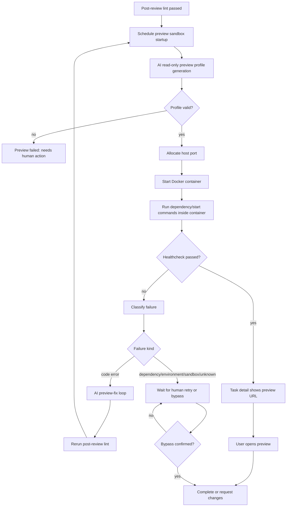
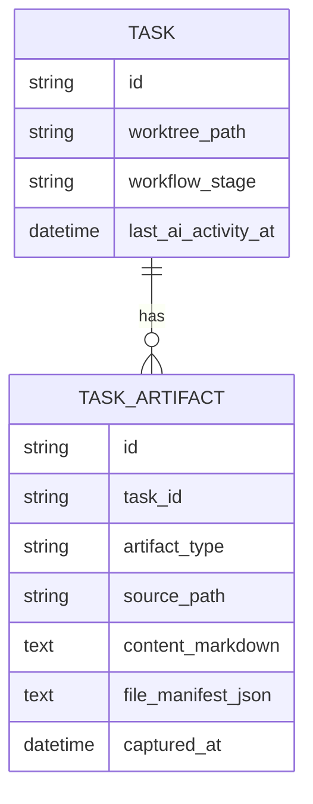

# PRD: Managed Docker Preview Sandbox

**Original Need:** 自动化验证通过后，不再要求人手动打开终端运行项目；Koda 应自动在任务 worktree 的沙盒中运行应用，提供可点击预览。预览命令由 AI 生成；沙盒内部可使用项目熟悉的端口，并自动映射到宿主机端口；启动失败时，代码错误应自动修复，非代码错误等待人工确认；目标态可以直接使用 Docker 隔离。
**AI-Normalized Name:** Generate an AI preview profile and run each task worktree in a managed Docker preview sandbox before human completion.
**Date:** 2026-04-28
**Status:** Pending

## 1. Introduction & Goals

当前 Koda 在 AI 实现、自检和 post-review lint 通过后，会停在“等待用户”状态，用户需要自己进入 worktree、理解项目启动方式、运行 dev server，然后再点击 `Complete`。这个环节仍然依赖人工终端操作，尤其对前端、全栈或多项目任务不够顺滑。

本需求要把“人工验收前的应用启动”变成 Koda 托管能力：当自动化验证通过并等待用户点击 `Complete` 时，Koda 由 AI 分析 task worktree，生成结构化 preview profile，然后在 Docker sandbox 中启动应用，把容器内部端口映射到宿主机空闲端口，并在任务详情页提供一键打开、重启、停止和查看日志入口。

Goals:

- 自动化验证通过后，Koda 自动尝试生成 preview profile 并启动 Docker preview sandbox。
- Preview profile 由 AI 生成，但必须是结构化、可校验、可展示、可重试的执行合同，而不是直接盲跑一段自由文本命令。
- 容器内部端口允许沿用项目默认端口，例如 Vite 的 `3000` / `5173` 或 FastAPI 的 `8000`；Koda 自动映射到宿主机空闲端口。
- 任务详情页展示预览状态、可点击 URL、启动/重启/停止按钮和最近日志摘要。
- 预览启动失败后，Koda 区分代码错误、依赖错误、环境错误、沙箱错误和不确定错误。
- 被判定为代码错误时，Koda 可进入有上限的 AI 自动修复闭环，修复后重新执行验证并再次启动预览。
- 被判定为非代码错误或不确定错误时，任务等待人工确认；用户可以修复环境、重试预览，或显式确认跳过预览后再 Complete。
- Docker 隔离作为目标实现，不先落地本机裸进程预览版。

## 2. Requirement Shape

- **Actor:** 使用 Koda 管理代码任务并进行人工验收的开发者。
- **Trigger:** 任务执行链路完成 AI 自检和 post-review lint，进入当前的“等待用户点击 Complete”状态。
- **Expected Behavior:** Koda 自动生成结构化 preview profile，在 Docker sandbox 中启动 task worktree 的应用，把容器内部端口映射为宿主机可访问 URL，并在任务详情页提供“打开预览 / 重启 / 停止 / 查看日志”。若启动失败，Koda 自动分类；代码错误进入自动修复闭环，非代码错误等待人工确认。
- **Explicit Scope Boundary:** 本需求覆盖单任务、单 worktree、单主预览入口的 Docker preview sandbox；不要求同时编排多容器依赖栈，不要求公网分享 URL，不替代正式 CI/CD，不把 Docker 当作强多租户安全边界，不改变当前 Git `Complete` 收尾的核心语义。

## 3. Repository Context And Architecture Fit

Current relevant modules/files:

- `backend/dsl/services/codex_runner.py`
  - `run_post_review_lint(...)` 在 post-review lint 通过后写入通过日志，并保持任务在 `test_in_progress`，等待用户点击 `Complete`。
  - 已有 runner 阶段执行、输出落库、取消、重试和自动修复闭环模式，可复用为 preview profile 生成、失败诊断和代码修复的编排参考。
- `backend/dsl/services/automation_runner.py`
  - API 层统一调用 runner 的入口，适合继续保持执行器无关边界。
- `backend/dsl/api/tasks.py`
  - `_build_task_card_metadata(...)` 当前把 self-review / lint 通过且自动化不运行的任务显示为 `waiting_user`。
  - `complete_task(...)` 仍负责进入 Git 收尾，不能被 preview sandbox 逻辑直接替代。
  - `open_task_terminal(...)` 已有“打开运行日志”的用户习惯，可作为 preview 日志入口的 UI 参考。
- `backend/dsl/models/task.py`
  - `Task` 已持久化 `worktree_path`、`workflow_stage`、`last_ai_activity_at` 等任务级状态。
  - Preview runtime 的容器进程状态是本机瞬时状态，不应直接塞入 `Task` 主表；生成的 profile 和最近结果需要可查询。
- `backend/dsl/models/task_artifact.py`
  - `TaskArtifact` 已用于任务级工件快照，适合扩展 `TaskArtifactType.PREVIEW_PROFILE` 来保存 AI 生成的结构化 profile 和最近诊断摘要，避免新增一张只保存 JSON 的表。
- `backend/dsl/models/enums.py`
  - `TaskArtifactType` 可扩展 preview profile 类型。
  - `WorkflowStage.TEST_IN_PROGRESS` 已承担自动化验证阶段；preview sandbox 可以作为该阶段通过后的验收辅助状态，不一定新增 workflow stage。
- `backend/dsl/schemas/task_schema.py`
  - 可增加 task preview status / profile / action response schema。
- `backend/dsl/app.py`
  - 可注册新的 preview sandbox API route。
- `utils/database.py`
  - 若扩展 enum 或 artifact 行为不改表结构，可避免增量 schema patch；如果后续增加专表，需同步补丁。
- `frontend/src/App.tsx`
  - 任务详情动作区已有 `Complete`、打开 worktree、打开项目目录、打开终端等入口。
  - 可以在等待用户状态附近展示 preview sandbox 面板。
- `frontend/src/api/client.ts` 与 `frontend/src/types/index.ts`
  - 统一维护前端 API 合同和类型。
- Existing docs/tests:
  - `docs/guides/codex-cli-automation.md`
  - `docs/guides/dsl-development.md`
  - `docs/architecture/system-design.md`
  - `docs/dev/evaluation.md`
  - `tests/test_codex_runner.py`
  - `tests/test_tasks_api.py`
  - `tests/test_task_service.py`
  - `tests/test_automation_runner_registry.py`

Existing path:

- `execute -> self-review -> post-review lint -> waiting_user -> user manually runs app -> user clicks Complete -> Git finalization`

Target path:

- `execute -> self-review -> post-review lint -> generate preview profile -> start Docker preview sandbox -> waiting_user with preview URL -> user inspects -> Complete or request changes`

Reuse candidates:

- Reuse current `waiting_user` display metadata as the trigger surface for preview readiness.
- Reuse runner orchestration patterns for AI-generated preview profile, diagnosis and bounded code-fix loops.
- Reuse `TaskArtifact` to persist generated preview profile snapshots.
- Reuse DevLog for preview lifecycle audit logs.
- Reuse frontend task detail action area instead of adding a new page.

Architecture constraints:

- Docker and subprocess operations are infrastructure side effects and must be called from service/application logic, not ORM models, schemas or React render logic.
- AI-generated profile must be schema-validated before execution.
- Docker preview must mount only the task worktree and explicit cache paths; it must not mount user home, SSH keys, Git credentials or arbitrary host directories.
- Preview sandbox runtime state is machine-local. It should not be treated as WebDAV/Git-synced business state.
- If AI preview repair modifies code after lint passed, Koda must rerun post-review lint before presenting the preview as accepted-ready.
- Preview failure must not silently complete the task. Non-code failures require visible human action or explicit preview bypass confirmation.

Potential redundancy risks:

- Do not create a separate task workflow just for preview; preview is an acceptance aid attached to the existing `test_in_progress` / waiting-user state.
- Do not duplicate project startup commands as permanent project config in the first target state; the user explicitly prefers AI-generated commands. Persist the generated profile per task and optionally allow later reuse after explicit user approval.
- Do not create a second log system; store audit in DevLog and runtime stdout/stderr in a bounded preview log file.
- Do not treat Docker as full hostile-code isolation. It reduces port/filesystem/process collisions, but stronger isolation such as gVisor/Firecracker is out of scope.

## 4. Recommendation

### Recommended Approach

Implement a new `preview_sandboxes` domain slice that owns AI preview profile generation, Docker container lifecycle, health checks, failure classification, bounded preview repair, and task-level preview APIs.

The recommended target state is:

1. When post-review lint passes, Koda schedules preview sandbox startup for the task worktree.
2. Koda asks the active AI runner, in a read-only profile-generation mode, to inspect the worktree and produce a strict JSON preview profile.
3. Koda validates the profile before execution:
   - relative `working_directory`;
   - `start_command`;
   - `internal_port`;
   - `healthcheck_path`;
   - `preview_path`;
   - optional dependency preparation commands;
   - expected runtime kind such as `node`, `python`, `static`, or `unknown`.
4. Koda starts a Docker container from a supported base image or generated lightweight Dockerfile, mounts the task worktree read-write, runs the profile command inside the container, maps `internal_port` to a host free port, and records a machine-local runtime handle.
5. Koda polls health check until ready, timeout or process exit.
6. The task detail page shows preview state:
   - not configured / generating profile / starting / running / failed / needs human action / stopped;
   - preview URL;
   - container id short hash when available;
   - recent log tail;
   - Start, Restart, Stop, Open Preview and View Logs controls.
7. If preview startup fails, Koda classifies the failure:
   - code error: TypeScript compile failure, Python import error, server exception caused by changed code, route/runtime crash;
   - dependency error: missing install, lockfile mismatch, package manager failure;
   - environment error: missing `.env`, missing API key, database/service dependency unavailable;
   - sandbox error: Docker unavailable, image build failure, port mapping failure, mount failure;
   - unknown: insufficient evidence.
8. Code errors enter a bounded AI preview-fix loop:
   - write diagnosis DevLog;
   - run AI fix in the same worktree;
   - rerun post-review lint;
   - regenerate or reuse preview profile;
   - restart preview;
   - fail to `changes_requested` after the configured maximum.
9. Non-code and unknown errors do not automatically modify code. The task remains waiting for user action with clear controls:
   - retry preview;
   - open worktree;
   - view logs;
   - confirm preview bypass before Complete.
10. `Complete` should remain available only when:
    - preview is running and healthy; or
    - preview is not applicable; or
    - the user explicitly confirms a non-code preview bypass.

Why this is the best fit for the current architecture:

- It preserves the current task workflow and Git finalization flow.
- It uses the already-established “runner generates structured output, Koda validates and orchestrates” pattern.
- It keeps Docker lifecycle in a bounded infrastructure adapter.
- It avoids requiring users to preconfigure commands for every project while still producing reusable structured profile data.
- It solves port collision cleanly through Docker port mapping instead of requiring each project to accept a dynamic port argument.

Rationale for rejecting redundant abstractions:

- A project-level preview command field is useful later, but it is not the first recommendation because the user wants AI-generated startup behavior and per-task worktrees may differ after code changes.
- A local non-Docker process manager is simpler, but it cannot isolate internal ports; multiple task previews would collide when projects all bind `3000`, `5173` or `8000`.
- A full compose-orchestrated environment is heavier than needed for the first target state. The requested acceptance preview is a single primary app endpoint.

### Alternatives Considered

| Alternative | Why Not Recommended |
| --- | --- |
| User configures preview command per Project | Predictable and simple, but contradicts the desired AI-generated command flow and still has host port collision issues unless every command supports dynamic ports. |
| Run preview as host subprocess | Lower implementation cost, but cannot let every task bind the same internal port and has weaker process/filesystem isolation. |
| Docker Compose per project | Better for multi-service apps, but too broad for the first target. It requires service discovery, secret mapping and compose file generation. |
| Treat preview failure as ordinary `changes_requested` immediately | Too aggressive for environment or Docker errors. Code errors should be auto-fixable; non-code errors should wait for user confirmation. |
| Block all Complete actions unless preview runs successfully | Too strict for backend-only, CLI-only, or environment-dependent tasks. A visible preview bypass confirmation is safer and more practical. |

## 5. Implementation Guide

### Core Logic

1. Domain slice:
   - Add `backend/dsl/preview_sandboxes/`.
   - Suggested modules:
     - `domain/models.py`: preview profile, runtime status, failure classification, health result.
     - `domain/errors.py`: invalid profile, Docker unavailable, preview startup failure, preview not applicable.
     - `application/use_cases.py`: generate profile, start preview, stop preview, restart preview, classify failure, auto-fix code preview failure.
     - `application/ports.py`: AI profile generator, Docker runtime adapter, task/log adapter.
     - `infrastructure/docker_preview_runtime.py`: Docker command adapter.
     - `infrastructure/ai_preview_profile_generator.py`: read-only runner profile generation.
     - `api.py`: task-scoped preview endpoints.
     - `schemas.py`: API DTOs.

2. Preview profile generation:
   - Triggered automatically after post-review lint pass and manually from the task detail page.
   - AI prompt must request a strict JSON object, not prose.
   - Expected schema:

     ```json
     {
       "schema_version": 1,
       "runtime_kind": "node",
       "working_directory": "frontend",
       "dependency_commands": ["npm install"],
       "start_command": "npm run dev -- --host 0.0.0.0 --port 3000",
       "internal_port": 3000,
       "healthcheck_path": "/",
       "preview_path": "/",
       "readiness_timeout_seconds": 90,
       "notes": "Vite React app detected from package.json"
     }
     ```

   - Validation rules:
     - `working_directory` must be relative and stay inside the task worktree.
     - `internal_port` must be between 1 and 65535.
     - `healthcheck_path` and `preview_path` must start with `/`.
     - command strings must not include host path escapes or attempts to mount privileged host resources.
     - profile generation is read-only; it must not edit files.
   - Persist accepted profiles as `TaskArtifactType.PREVIEW_PROFILE` snapshots. Store the JSON in `file_manifest_json` and a human-readable summary in `content_markdown`.

3. Docker runtime:
   - Allocate a host port from a configured range, for example `KODA_PREVIEW_HOST_PORT_START=31000` and `KODA_PREVIEW_HOST_PORT_END=31999`.
   - Run a container with:
     - task worktree mounted at `/workspace`;
     - working directory `/workspace/<profile.working_directory>`;
     - container internal port from the profile;
     - host mapping `127.0.0.1:<host_port>:<internal_port>`;
     - non-privileged mode;
     - no host networking;
     - no Docker socket mount;
     - no user home mount;
     - optional named package caches only after explicit configuration.
   - Suggested first runtime image strategy:
     - detect `node` and use a configured Node image;
     - detect `python` and use a configured Python image;
     - allow fallback image configuration through environment variables;
     - do not generate arbitrary Dockerfiles until the image strategy is explicit.
   - Capture logs to a bounded local file such as `/tmp/koda-preview-<task_id[:8]>.log`.
   - Keep runtime process/container state in memory:
     - `task_id`
     - `container_id`
     - `host_port`
     - `internal_port`
     - `preview_url`
     - `started_at`
     - `status`
     - `latest_error_summary`

4. Automatic trigger:
   - Extend `run_post_review_lint(...)` after the lint pass log is written.
   - Schedule preview startup in the background; preview startup failure must not erase the lint pass marker.
   - DevLog examples:
     - `Preview profile generated for Docker sandbox.`
     - `Preview sandbox started: http://127.0.0.1:31042/`
     - `Preview sandbox failed: environment variable DATABASE_URL is missing; waiting for human action.`

5. Failure classification:
   - Collect:
     - container exit code;
     - log tail;
     - healthcheck result;
     - profile fields;
     - package manager output when dependency command failed.
   - Use deterministic rules first:
     - Docker command not found -> sandbox error.
     - host port allocation failed -> sandbox error.
     - `.env`/API key/database URL missing -> environment error.
     - TypeScript/Python syntax/import errors from app startup -> code error.
   - Use AI classification only after deterministic rules are inconclusive.
   - Classification response schema:

     ```json
     {
       "failure_kind": "code_error",
       "confidence": 0.86,
       "summary": "TypeScript import path fails after recent edit.",
       "recommended_action": "auto_fix_code"
     }
     ```

6. Code-error auto-fix loop:
   - Add bounded settings:
     - `KODA_PREVIEW_FIX_MAX_ROUNDS`, default `2`.
     - `KODA_PREVIEW_START_TIMEOUT_SECONDS`, default `90`.
   - For `code_error`:
     - write DevLog with diagnosis;
     - run AI preview-fix prompt in the same worktree;
     - rerun post-review lint because code changed after previous validation;
     - restart preview;
     - if still failing after max rounds, move to `changes_requested` with a clear failure reason.
   - For dependency/environment/sandbox/unknown:
     - do not modify code automatically;
     - keep the task waiting for user action;
     - show retry and preview-bypass controls.

7. API contracts:
   - `GET /api/tasks/{task_id}/preview-sandbox`
     - Returns current preview status and last generated profile summary.
   - `POST /api/tasks/{task_id}/preview-sandbox/start`
     - Generates or reuses profile and starts the Docker sandbox.
   - `POST /api/tasks/{task_id}/preview-sandbox/restart`
     - Stops current container and starts again.
   - `POST /api/tasks/{task_id}/preview-sandbox/stop`
     - Stops and removes the current preview container.
   - `POST /api/tasks/{task_id}/preview-sandbox/diagnose`
     - Reclassifies the latest failure; used when logs change after user intervention.
   - `POST /api/tasks/{task_id}/preview-sandbox/confirm-bypass`
     - Records that the user explicitly acknowledges a non-code preview problem and wants to proceed with Complete.

8. Frontend behavior:
   - Add a preview sandbox panel in task detail when:
     - task has `worktree_path`; and
     - stage is `test_in_progress`, `self_review_in_progress`, `changes_requested`, or display metadata is `waiting_user`; and
     - task is not deleted/abandoned/done.
   - Panel states:
     - `Not started`: show `Start preview`.
     - `Generating profile`: show spinner and profile generation text.
     - `Starting`: show container startup status.
     - `Running`: show `Open Preview`, `Restart`, `Stop`, `View Logs`.
     - `Failed - code error`: show auto-fix progress or exhausted status.
     - `Needs human action`: show failure summary, `Retry`, `Confirm preview bypass`.
   - `Complete` behavior:
     - If preview is running/healthy, proceed with existing completion flow.
     - If preview failed due to non-code issue and no bypass confirmation exists, block Complete and show the preview panel action.
     - If bypass confirmed, allow Complete but include bypass audit in DevLog.

### Affected Files

| Area | Change | Files |
| --- | --- | --- |
| Preview domain | Add preview profile, runtime status, error classification and use cases | `backend/dsl/preview_sandboxes/` |
| Docker adapter | Start/stop/restart Docker containers, allocate ports, collect logs | `backend/dsl/preview_sandboxes/infrastructure/docker_preview_runtime.py` |
| AI profile generator | Read-only runner call that emits strict preview profile JSON | `backend/dsl/preview_sandboxes/infrastructure/ai_preview_profile_generator.py` |
| Task artifacts | Add `TaskArtifactType.PREVIEW_PROFILE` | `backend/dsl/models/enums.py`, `backend/dsl/models/task_artifact.py` |
| API registration | Register preview sandbox routes | `backend/dsl/app.py` |
| Task workflow integration | Trigger preview after post-review lint pass and integrate preview-fix loop | `backend/dsl/services/codex_runner.py`, `backend/dsl/services/automation_runner.py` |
| Task APIs | Optionally hydrate task response/card metadata with preview status summary | `backend/dsl/api/tasks.py`, `backend/dsl/schemas/task_schema.py` |
| Frontend client/types | Add preview sandbox API calls and TypeScript types | `frontend/src/api/client.ts`, `frontend/src/types/index.ts` |
| Frontend UI | Add preview sandbox panel and Complete blocking/bypass behavior | `frontend/src/App.tsx`, `frontend/src/index.css` |
| Tests | Unit/API tests for profile validation, Docker adapter boundaries, preview APIs and Complete gating | `tests/test_preview_sandboxes_*.py`, `tests/test_tasks_api.py`, frontend focused tests |
| Docs | Document preview sandbox workflow, config and QA steps | `docs/guides/dsl-development.md`, `docs/guides/codex-cli-automation.md`, `docs/architecture/system-design.md`, `docs/dev/evaluation.md` |

### Change Matrix

| Current Behavior | Target Behavior | Implementation Notes | Validation |
| --- | --- | --- | --- |
| User manually runs the app from worktree before Complete | Koda automatically starts a Docker preview sandbox after validation passes | Trigger after post-review lint pass | Test lint-pass path schedules preview startup |
| Startup command must be known by the user | AI generates a strict preview profile from the worktree | Read-only profile generation with schema validation | Test invalid/missing fields are rejected |
| Apps bind host ports directly and can collide | Apps bind container internal port; Koda maps to host free port | Docker `127.0.0.1:<host_port>:<internal_port>` mapping | Test host port allocation and URL construction |
| Preview runtime has no UI state | Task detail shows status, URL, logs and controls | Add preview panel and API polling | Frontend test covers running/failed states |
| Preview startup failure is manual diagnosis | Koda classifies failure into code/dependency/environment/sandbox/unknown | Deterministic rules first, AI classifier as fallback | Unit tests for each failure kind |
| Code-related preview failure requires manual intervention | Code errors can trigger bounded AI fix, lint rerun and preview retry | Max rounds configured; failures move to `changes_requested` | Test code-error auto-fix scheduling and exhaustion |
| Non-code failure has no explicit gate | Non-code failure waits for human retry or preview bypass confirmation | Store bypass audit in DevLog | API/UI test blocks Complete until bypass |
| Preview logs require terminal digging | Preview panel shows log tail and view logs action | Bounded log file per task | Test status endpoint returns sanitized log summary |
| Docker availability is implicit | Docker unavailable is a sandbox error with human action | Adapter checks Docker before start | Test Docker unavailable maps to `needs_human_action` |

### Architecture Diagram



### ER Diagram

No new table is required in the recommended target state. The generated preview profile is stored as a task artifact.



`TaskArtifact.artifact_type` gains `PREVIEW_PROFILE`. Machine-local runtime state such as container id and host port is intentionally in-memory and rebuilt from active Docker inspection/status APIs when possible.

### Low-Fidelity Prototype

```text
Task Detail / Waiting User
┌────────────────────────────────────────────────────────────┐
│ Preview Sandbox                                             │
│ Status: Running                                             │
│ URL: http://127.0.0.1:31042/                                │
│ Profile: frontend · npm run dev · internal :3000            │
│                                                            │
│ [Open Preview] [Restart] [Stop] [View Logs]                 │
└────────────────────────────────────────────────────────────┘

When non-code failure:
┌────────────────────────────────────────────────────────────┐
│ Preview Sandbox                                             │
│ Status: Needs human action                                  │
│ Reason: Missing DATABASE_URL in container environment.      │
│                                                            │
│ [Retry Preview] [Open Worktree] [View Logs]                 │
│ [Confirm preview bypass and allow Complete]                 │
└────────────────────────────────────────────────────────────┘
```

### Interactive Prototype Change Log

No interactive prototype file is required for this PRD. The low-fidelity prototype above is sufficient to define the task detail behavior.

### External Validation

No web research was used. This PRD is based on repository inspection and the user's clarified product requirements.

## 6. Definition Of Done

- Koda automatically attempts Docker preview startup after post-review lint passes for worktree-backed tasks.
- AI-generated preview profiles are strict JSON, validated before execution and stored as task artifacts.
- Docker containers run with task worktree mount, internal port mapping to host free port, bounded logs and non-privileged defaults.
- Task detail UI exposes preview state, URL, logs and start/restart/stop/open controls.
- Code-related preview startup failures can trigger bounded AI repair, rerun validation and retry preview.
- Non-code preview failures wait for human action and require explicit preview bypass before Complete.
- Docs explain Docker requirements, preview profile generation, failure categories and manual QA.
- Tests cover profile validation, Docker adapter command construction, failure classification, task API contracts and frontend Complete gating.
- Existing task execution, review, lint, cancel, force interrupt and Git completion flows continue to pass existing tests.

## 7. Acceptance Checklist

### Architecture Acceptance

- [ ] Preview logic lives under `backend/dsl/preview_sandboxes/` or an equivalently explicit domain slice; it is not embedded directly in route handlers.
- [ ] Docker operations are isolated behind an infrastructure adapter and can be unit-tested without real Docker.
- [ ] AI profile generation is read-only and returns schema-validated JSON before any command runs.
- [ ] Preview runtime state is machine-local and does not become WebDAV/Git-synced business state.
- [ ] `TaskArtifactType.PREVIEW_PROFILE` or an equivalent artifact path persists generated profiles without adding redundant task tables.

### Behavior Acceptance

- [ ] After post-review lint pass, a worktree-backed task automatically schedules preview startup.
- [ ] A Vite-style profile can run inside Docker on internal port `3000` or `5173` while Koda maps it to an available host port such as `31042`.
- [ ] Task detail shows `Open Preview`, `Restart`, `Stop` and `View Logs` when the preview is running.
- [ ] Preview startup failure classified as `code_error` triggers at most the configured number of AI preview-fix rounds.
- [ ] If preview-fix modifies files, Koda reruns post-review lint before presenting the preview as ready.
- [ ] Preview startup failure classified as dependency/environment/sandbox/unknown does not modify code automatically.
- [ ] Complete is blocked after non-code preview failure until the user retries successfully or confirms preview bypass.

### Docker And Security Acceptance

- [ ] Containers do not run with host networking.
- [ ] Containers do not mount the Docker socket.
- [ ] Containers do not mount the user's home directory, SSH keys or Git credentials.
- [ ] Host port binding uses `127.0.0.1` by default.
- [ ] Docker unavailable is surfaced as a sandbox failure with human-action guidance.
- [ ] Preview logs are bounded and do not expose arbitrary host files.

### API Acceptance

- [ ] `GET /api/tasks/{task_id}/preview-sandbox` returns status, URL when available, profile summary and recent error/log summary.
- [ ] `POST /api/tasks/{task_id}/preview-sandbox/start` starts or reuses a validated profile.
- [ ] `POST /api/tasks/{task_id}/preview-sandbox/restart` replaces the current preview container.
- [ ] `POST /api/tasks/{task_id}/preview-sandbox/stop` stops/removes the container and updates status.
- [ ] `POST /api/tasks/{task_id}/preview-sandbox/confirm-bypass` records user bypass audit and allows Complete for non-code preview failures.

### Documentation Acceptance

- [ ] `docs/guides/codex-cli-automation.md` explains where preview startup fits after post-review lint.
- [ ] `docs/guides/dsl-development.md` documents preview sandbox APIs and UI QA flow.
- [ ] `docs/architecture/system-design.md` describes preview sandbox as machine-local runtime state.
- [ ] `docs/dev/evaluation.md` includes manual QA cases for success, code-error auto-fix and non-code bypass.

### Validation Acceptance

- [ ] `uv run pytest tests/test_preview_sandboxes_*.py -q` passes.
- [ ] Relevant task API tests pass, including preview status and Complete gating.
- [ ] Frontend focused tests for preview panel rendering and Complete blocking pass.
- [ ] `npm --prefix frontend run build` passes.
- [ ] `just docs-build` passes before handoff.

## 8. User Stories

1. As a developer reviewing an AI-created frontend task, I want Koda to automatically run the app in a preview sandbox so that I can click a URL and inspect the result without opening a terminal.
2. As a developer working on multiple tasks, I want each preview to use its normal internal port while Koda maps it to a unique host port so that previews do not collide.
3. As a developer, I want startup failures caused by code regressions to be fixed automatically when possible so that preview startup participates in the same automation loop as lint and review.
4. As a developer, I want missing environment variables or Docker problems to stop for human action rather than causing AI to rewrite unrelated code.
5. As a developer, I want to explicitly bypass preview only when the failure is environmental or not applicable so that Complete remains intentional.

## 9. Functional Requirements

- **FR-1:** Koda must trigger preview sandbox startup after post-review lint passes for worktree-backed tasks.
- **FR-2:** Koda must generate a structured preview profile through AI before starting Docker unless a valid profile already exists for the current task revision.
- **FR-3:** Koda must validate preview profile fields and reject unsafe paths, invalid ports and malformed URL paths.
- **FR-4:** Koda must run preview commands inside Docker, not as host subprocesses.
- **FR-5:** Koda must map the profile internal port to an available host port and expose a localhost preview URL.
- **FR-6:** Koda must expose task-scoped APIs for preview status, start, restart, stop, diagnose and bypass confirmation.
- **FR-7:** Koda must show preview controls in the task detail UI.
- **FR-8:** Koda must classify preview startup failures into code, dependency, environment, sandbox or unknown categories.
- **FR-9:** Koda must auto-fix code-classified preview failures with a bounded loop.
- **FR-10:** Koda must rerun post-review lint after any preview auto-fix modifies files.
- **FR-11:** Koda must not auto-fix dependency/environment/sandbox/unknown preview failures.
- **FR-12:** Koda must block Complete after a non-code preview failure until preview succeeds or the user confirms a preview bypass.
- **FR-13:** Koda must write DevLog audit entries for profile generation, preview start, preview stop, failure classification, auto-fix attempts and bypass confirmation.
- **FR-14:** Koda must stop/remove preview containers when the user stops preview, restarts preview, destroys the task, or completes cleanup where the worktree is removed.
- **FR-15:** Koda must keep preview sandbox runtime state machine-local and safe to lose across backend restarts; the UI must allow restart if runtime state is gone.

## 10. Non-Goals

- No public internet preview URL in this PRD. Remote/browser tunnel sharing can build on the host URL later.
- No multi-container Docker Compose orchestration in this PRD.
- No production deployment or CI replacement.
- No guarantee of hostile multi-tenant isolation beyond Docker's standard container boundary and conservative mount/network defaults.
- No automatic injection of secrets, `.env` files, SSH keys or Git credentials.
- No requirement to support desktop GUI apps, mobile emulators or hardware-dependent previews.
- No permanent project-level preview command configuration as the primary flow; generated profiles are task-scoped.

## 11. Risks And Follow-Ups

| Risk | Impact | Mitigation |
| --- | --- | --- |
| Docker is unavailable or not running | Preview cannot start | Surface sandbox error and allow human retry/bypass. |
| AI generates an unsafe or wrong profile | Startup fails or command is unsafe | Strict schema validation, relative path checks, no privileged mounts, bounded retries. |
| Project needs external services such as DB/Redis/API keys | Preview may fail despite correct code | Classify as environment/dependency error and wait for human action. |
| Preview auto-fix changes code after validation | Previously passed lint may be stale | Always rerun post-review lint after preview-fix writes. |
| Single-container target is insufficient for some apps | Some previews need manual setup | Record as needs human action; future follow-up can add compose profile support. |
| Long-running preview containers consume resources | Machine slowdown | Provide Stop control, automatic cleanup on task completion/destroy, and optional idle timeout. |

Approved follow-ups after this target state:

- Add optional project-approved profile reuse so a successful AI-generated profile can seed future tasks for the same project.
- Add Docker Compose profile support for apps that require multiple local services.
- Add public tunnel integration for remote reviewers after local preview is stable.
- Add stronger sandbox runtime options such as gVisor or Firecracker if untrusted multi-tenant execution becomes a product requirement.

## 12. Decision Log

| Decision | Rationale |
| --- | --- |
| Use Docker for the first target implementation | Required to let apps keep familiar internal ports while Koda maps to unique host ports and provides process/filesystem isolation. |
| Generate preview command through AI | The user prefers Koda to infer startup behavior from the worktree instead of requiring manual project configuration. |
| Persist preview profile as a task artifact | Generated profile is task-specific evidence and can be reused for restart/debug without adding a redundant table. |
| Keep runtime state in memory | Container id, host port and process status are local machine runtime details like current runner process state. |
| Trigger after post-review lint pass | This is the current point where Koda waits for human Complete, so preview startup improves the exact manual gap. |
| Auto-fix only code-classified preview failures | Environment, dependency and Docker failures should not cause AI to rewrite application code. |
| Rerun lint after preview-fix | Any code change after validation invalidates the previous post-review lint pass. |
| Allow explicit preview bypass for non-code failures | Some tasks cannot be previewed locally due to external dependencies, but completion should remain an intentional audited action. |
