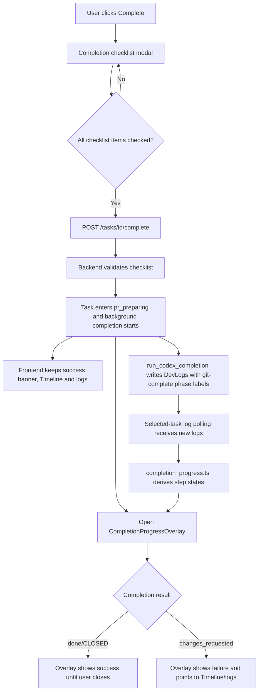

# PRD: Completion Progress Showcase Overlay

**Original Need:** 点击 commit 之后，希望弹出一个独立弹窗，把每一步用更酷炫的方式展示在前台；原本地方的内容展示不能删除，这只是额外展示。PRD 放到 `tasks/pending`。
**AI-Normalized Name:** Add an independent foreground progress overlay for the Git completion flow after a user confirms Complete.
**Date:** 2026-04-28
**Status:** Pending

## 1. Introduction & Goals

当前 Koda 的 `Complete` 流程已经有完成检查单弹窗。用户勾选并提交后，后端进入 Git 收尾阶段：记录检查单确认、执行 `git add .`、按需生成 Conventional Commit message 并提交、`rebase` 基底分支、必要时修复冲突、合并回基底分支并清理 worktree。前端现在主要通过成功提示、任务状态、Timeline 和日志流表达进度。

本需求要在不删除、不替换现有展示的前提下，增加一个独立的前台展示层：当用户完成检查单并触发普通 `Complete` 后，弹出一个 Git 收尾进度弹窗，用步骤轨道、状态动效和最近日志摘要把后台每一步展示出来。它只负责可视化，不成为完成流程的可信边界，也不直接执行 Git 命令。

Goals:

- 在普通 `Complete` 提交成功后自动打开一个独立的前台进度弹窗。
- 用稳定的步骤模型展示 Git 收尾阶段，而不是让用户只看长日志。
- 保留现有成功提示、Timeline、任务详情页日志和任务卡片状态，不删除任何原有内容。
- 复用现有 `Task`、`DevLog`、`automation_phase_label`、日志轮询和 dashboard 刷新机制。
- 后端仅补充结构化可观测信号，不改变 Git 收尾顺序和完成语义。
- 动效要可控，支持 reduced motion，失败状态必须清晰可读。

## 2. Requirement Shape

- **Actor:** 使用 Koda 点击 `Complete` 完成任务的开发者。
- **Trigger:** 用户在完成检查单弹窗中勾选全部项并提交普通 `Complete`，后端返回任务进入 `pr_preparing` 且 `is_codex_task_running=true`。
- **Expected Behavior:** 前端在当前页面上方打开一个独立进度弹窗，按顺序展示 Git 收尾步骤。随着任务日志增量轮询更新，弹窗步骤从 pending/running/succeeded/skipped/failed 逐步变化。原有 success banner、Timeline、任务详情日志和卡片内容继续显示。
- **Explicit Scope Boundary:** 本需求只覆盖普通 worktree-backed `Complete` 的 Git 收尾前台展示。不覆盖 `manual_complete` 的缺失分支人工归档，不新增第二套完成 API，不新增 Git 命令执行入口，不把动画弹窗作为安全校验。

## 3. Repository Context And Architecture Fit

Current relevant modules/files:

- `frontend/src/App.tsx`
  - 已维护 `completionChecklistModalState`、`openCompletionChecklist(...)`、`handleSubmitCompletionChecklist()`。
  - 提交普通 `Complete` 成功后会调用 `taskApi.complete(...)`、本地 reconcile 返回任务、关闭完成检查单、设置 success message，并触发 `loadDashboardData(true)`。
  - 已通过 `selectedTaskDevLogs` 和增量 log polling 保持任务详情 Timeline 更新。
- `frontend/src/api/client.ts`
  - `taskApi.getCompletionChecklist(...)`、`taskApi.complete(...)`、`taskApi.manualComplete(...)` 已存在。
  - `logApi.list(...)` 已支持任务日志增量拉取。
- `frontend/src/types/index.ts`
  - `Task` 已包含 `is_codex_task_running`、`workflow_stage`、`worktree_path`、`worktree_base_branch_name`。
  - `DevLog` 已包含 `automation_phase_label`、`automation_sequence_index`、`automation_session_id`、`automation_runner_kind`。
- `frontend/src/utils/task_timeline_continuity.ts`
  - 已处理 automation transcript 分组，说明前端已有基于 automation metadata 渲染日志的模式。
- `frontend/src/index.css`
  - 已有 modal、inline message、任务详情动作区、branch health banner 等样式体系。
- `backend/dsl/api/tasks.py`
  - `complete_task(...)` 负责 checklist validation、准备完成、登记后台任务。
  - Route 层已经保持为请求编排和错误映射，不应放入展示逻辑。
- `backend/dsl/services/task_completion_checklist_service.py`
  - 已提供完成检查单生成、确认校验和确认审计日志。
- `backend/dsl/services/codex_runner.py`
  - `run_codex_completion(...)` 写入完成请求日志，并调用 `_execute_git_completion_flow(...)`。
  - `_execute_git_completion_flow(...)` 固定执行 Git 收尾顺序。
  - `_run_logged_command(...)` 已把每条命令结果写入 task log 和 DevLog，但当前 DevLog 未带 Git completion 专用 `automation_phase_label`。
- `backend/dsl/models/dev_log.py` 与 `backend/dsl/schemas/dev_log_schema.py`
  - 已有 `automation_phase_label` 字段，不需要为本需求新增表或迁移。
- Existing tests:
  - `frontend/tests/app_task_mutation_refresh.test.ts`
  - `frontend/tests/task_completion.test.ts`
  - `frontend/tests/task_timeline_continuity.test.ts`
  - `tests/test_codex_runner.py`
  - `tests/test_tasks_api.py`

Existing path:

```text
Complete button
  -> completion checklist modal
  -> POST /tasks/{id}/complete
  -> success message + dashboard refresh + Timeline/log polling
  -> backend Git completion flow
```

Target path:

```text
Complete button
  -> completion checklist modal
  -> POST /tasks/{id}/complete
  -> success message + dashboard refresh + Timeline/log polling stay unchanged
  -> independent completion progress overlay opens
  -> overlay consumes Task + DevLog structured phase labels
```

Reuse candidates:

- Reuse `completionChecklistModalState` submission success point as the overlay launch trigger.
- Reuse `selectedTaskDevLogs` instead of adding a separate progress polling API.
- Reuse `DevLog.automation_phase_label` to avoid brittle frontend parsing of command text.
- Reuse existing modal shell patterns and `ActionButton`.
- Reuse `shouldPollDashboardForTaskRefresh(...)` and selected-task log polling.

Architecture constraints:

- Git completion remains backend-owned. React must not infer that a command succeeded unless a task snapshot or structured DevLog supports it.
- Route handlers should not contain UI-specific progress logic.
- The overlay is a read-only projection. It must not be required for completion to finish.
- Existing Timeline and log cards remain the source of detailed historical evidence.
- New code reading or writing files must use `encoding="utf-8"` where Python I/O is involved.
- Documentation must be updated with the new completion progress surface and `just docs-build` must pass before commit.

Potential redundancy risks:

- Do not create a new progress table for first target state. Existing DevLog fields are sufficient.
- Do not add a second completion endpoint just for animation.
- Do not parse arbitrary log prose as the primary contract. If phase labels are missing, display an "awaiting structured signal" fallback instead of pretending every step is known.
- Do not replace the current success banner or Timeline with the overlay.

## 4. Recommendation

### Recommended Approach

Implement an independent `CompletionProgressOverlay` that opens after normal `Complete` submission succeeds and derives display state from the selected task plus structured Git completion DevLogs.

Backend change should be minimal: enrich completion-flow DevLogs with existing `automation_phase_label` values. The deterministic Git flow already has stable internal labels such as `git-add`, `post-add-status`, `git-commit`, `git-rebase-base`, `merge-feature`, `remove-worktree`, and `delete-branch`. Add a small mapping from those command labels to completion progress phases, and pass the phase label into `_write_log_to_db(...)` through `_run_logged_command(...)`.

Recommended phase labels:

| Phase Label | User-Facing Step | Notes |
| --- | --- | --- |
| `git-complete:accepted` | 已接收完成请求 | Written when `run_codex_completion(...)` starts. |
| `git-complete:stage` | 暂存变更 | Covers `git add .` and post-add status. |
| `git-complete:commit-message` | 生成提交信息 | Only running when staged changes exist. |
| `git-complete:commit` | 提交变更 | Succeeded or failed when commit command runs; skipped when already clean. |
| `git-complete:rebase` | 同步基底分支 | Covers fetch/fast-forward/rebase as one user-facing step. |
| `git-complete:conflict-fix` | 自动修复冲突 | Conditional step, only visible when a conflict-fix log appears. |
| `git-complete:merge` | 合并任务分支 | Covers merge into base worktree. |
| `git-complete:cleanup` | 清理 worktree 和分支 | Covers cleanup command/result logs. |
| `git-complete:done` | 完成归档 | Written on successful finalization. |
| `git-complete:failed` | 需要人工介入 | Written when flow moves to `changes_requested`. |

Frontend change should be similarly scoped:

1. Add `frontend/src/utils/completion_progress.ts` to convert `Task` and `DevLog[]` into a stable ordered `CompletionProgressStep[]`.
2. Add `frontend/src/components/CompletionProgressOverlay.tsx` for the modal UI.
3. Add overlay state to `App.tsx`, set it after successful normal `taskApi.complete(...)`, and keep it open while the user watches progress.
4. Feed it `selectedTask`, `selectedTaskDevLogs`, and close/minimize callbacks.
5. Add CSS under `frontend/src/index.css` using the existing design language, with a polished but restrained animation layer.

Why this fits the current architecture:

- The backend remains the source of truth for command progress.
- The frontend only projects existing state and logs into a clearer view.
- No new persistence model is needed.
- Existing detailed log history remains intact and visible.
- The implementation can be tested in focused utility tests plus the existing jsdom dashboard flow.

Rationale for rejecting redundant abstractions:

- A dedicated `/completion-progress` endpoint would duplicate `Task` and `DevLog` state unless the current log contract proves insufficient.
- A new database table would add migration and cleanup work for information already represented by DevLog.
- A purely frontend text parser would be fragile because command output and localized messages can change.

### Alternatives Considered

| Alternative | Why Not Recommended |
| --- | --- |
| Only style the existing Timeline to look cooler | Does not meet the request for an independent foreground popup. |
| Add a new backend progress table | More durable, but unnecessary until DevLog phase labels prove insufficient. |
| Parse command text in React | Fast to implement, but brittle and hard to test when command output changes. |
| Replace the completion checklist modal with the progress UI | Violates the explicit requirement that original displays and behavior stay intact. |
| Auto-close the overlay immediately on success | Looks clean but can hide the result before the user reads it. Keep it user-dismissable. |

## 5. Implementation Guide

### Core Logic

1. Completion submit trigger:
   - User clicks `Complete`.
   - Existing `CompletionChecklistModal` opens.
   - User checks all items and confirms.
   - `handleSubmitCompletionChecklist()` posts `TaskCompletionConfirmation` to `taskApi.complete(...)`.
   - If the returned task is normal completion mode, has `worktree_path`, and enters a running completion state, `App.tsx` opens `CompletionProgressOverlay`.
   - Existing success message and dashboard refresh stay unchanged.

2. Backend progress signal:
   - Extend `_run_logged_command(...)` with optional `automation_phase_label_str: str | None = None`.
   - When `_run_logged_command(...)` calls `_write_log_to_db(...)`, forward the phase label.
   - Add a small mapping in `codex_runner.py` for Git completion command labels to `git-complete:*` phase labels.
   - Write explicit start, skip, success and failure phase logs where command execution alone does not create a clear phase signal.
   - Do not change command order or failure handling.

3. Frontend progress derivation:
   - `buildCompletionProgressState(taskItem, taskDevLogList)` returns:
     - ordered step list;
     - current step id;
     - overall status: `idle | running | succeeded | failed | attention`;
     - latest message text;
     - counts for completed/total visible steps.
   - Prefer `automation_phase_label` values.
   - Use task state as final authority:
     - `workflow_stage=done` and `lifecycle_status=CLOSED` means succeeded.
     - `workflow_stage=changes_requested` after completion attempt means failed/attention.
     - `is_codex_task_running=true` means keep current or latest known step running.
   - Conditional steps such as conflict fix appear only when logs include the phase.
   - If no structured phase logs exist yet, show accepted/running placeholder and recent logs.

4. Overlay interaction:
   - Open automatically after successful normal `Complete` submission.
   - Close button hides only the overlay.
   - Optional compact/minimized state can reduce the overlay to a small status strip.
   - The overlay should not block background polling.
   - Manual `manual_complete` should not open the Git progress overlay.

5. Visual behavior:
   - Step rail with icons for pending, running, succeeded, skipped and failed.
   - Current step has subtle pulse/progress shimmer.
   - Recent log excerpt appears in a terminal-like panel inside the overlay.
   - `prefers-reduced-motion: reduce` disables pulse/shimmer and uses static status changes.
   - Mobile layout uses vertical steps and keeps actions visible without text overlap.

### Affected Files

| Path | Expected Change |
| --- | --- |
| `backend/dsl/services/codex_runner.py` | Add completion phase labels to Git completion logs using existing DevLog metadata fields. |
| `tests/test_codex_runner.py` | Verify completion command logs include expected `automation_phase_label` values and skip/success/failure signals. |
| `frontend/src/App.tsx` | Add overlay open/close state and launch it after successful normal completion submission. |
| `frontend/src/components/CompletionProgressOverlay.tsx` | New read-only overlay component. |
| `frontend/src/utils/completion_progress.ts` | New derivation utility for steps and overall status. |
| `frontend/src/index.css` | Add overlay, step rail, status, responsive and reduced-motion styles. |
| `frontend/tests/completion_progress.test.ts` | New utility test for phase-log-to-step-state mapping. |
| `frontend/tests/app_task_mutation_refresh.test.ts` | Extend existing Complete flow test to assert overlay opens while original content remains. |
| `docs/architecture/system-design.md` | Document completion progress as a DevLog-backed UI projection. |
| `docs/guides/dsl-development.md` | Document Git completion phase label conventions. |
| `docs/dev/evaluation.md` | Add manual/browser verification steps for the overlay. |

### Change Matrix

| Change Target | Current State | Target State | Change Type | Risk |
| --- | --- | --- | --- | --- |
| Completion submit UX | Checklist closes and success banner/logs show progress indirectly | Checklist closes, original success/logs remain, progress overlay opens | Frontend enhancement | Medium, modal layering and focus management |
| Progress source | DevLog text shows commands, but no Git-specific phase metadata | DevLogs carry `git-complete:*` phase labels | Backend observability | Low, uses existing nullable field |
| Step model | No dedicated frontend step derivation | `completion_progress.ts` derives ordered step statuses | Frontend utility | Low |
| Visual presentation | Timeline/log stream only | Independent overlay with step rail and recent log excerpt | Frontend component/style | Medium, responsive and motion polish |
| Completion semantics | Backend owns Git flow | Unchanged | No behavior change | Low |
| Manual completion | Missing-branch path closes task directly | Unchanged, no Git overlay | No behavior change | Low |
| Documentation | Completion flow docs do not mention overlay phase labels | Docs explain phase labels and UI projection | Docs update | Low |

### Flow Diagram



### Low-Fidelity Prototype

```text
┌────────────────────────────────────────────────────────────────────┐
│ Git 收尾进行中                                      [最小化] [关闭] │
│ Task: Payment checkout cleanup                                     │
│ 已记录完成检查单确认，正在把任务分支收敛到 main                    │
├────────────────────────────────────────────────────────────────────┤
│  ✓ 已接收完成请求        15:00:12                                  │
│  ✓ 暂存变更              git add .                                 │
│  ✓ 生成提交信息          fix(complete): refine checkout flow       │
│  ● 提交变更              running                                   │
│  ○ 同步基底分支          pending                                   │
│  ○ 合并任务分支          pending                                   │
│  ○ 清理 worktree 和分支  pending                                   │
├────────────────────────────────────────────────────────────────────┤
│ Recent signal                                                       │
│ `git commit -m "fix(complete): refine checkout flow"` -> running    │
│ Timeline 和详细日志仍在下方任务详情中持续更新。                     │
├────────────────────────────────────────────────────────────────────┤
│ [查看 Timeline] [保持在前台]                                       │
└────────────────────────────────────────────────────────────────────┘
```

### External Validation

No web research was used. The design is based on the current repository state and existing Koda completion architecture.

## 6. Definition Of Done

- 普通 `Complete` 提交成功后会打开独立进度 overlay。
- Overlay 的步骤状态来自 `Task` 和带 `git-complete:*` phase label 的 DevLog。
- 现有完成检查单、success banner、Timeline、日志流、任务详情内容没有被删除或替换。
- 后端 Git 完成顺序和错误处理保持兼容。
- `manual_complete` 不显示普通 Git 收尾 overlay。
- Overlay 在成功、失败、仍在运行、缺少结构化信号时都有清晰状态。
- 桌面和移动视口无文本重叠；reduced motion 下无强制动画。
- 相关单元测试、前端测试和后端测试通过。
- 文档同步更新，`just docs-build` 通过。

## 7. Acceptance Checklist

### Architecture Acceptance

- [ ] `frontend/src/App.tsx` 只负责打开/关闭 overlay 和传入 task/log props，不在 JSX 中硬编码 Git 步骤判断。
- [ ] `frontend/src/utils/completion_progress.ts` 是唯一的前端 completion step derivation 入口。
- [ ] `backend/dsl/services/codex_runner.py` 复用 `DevLog.automation_phase_label`，不新增 completion progress 表。
- [ ] Route handler `backend/dsl/api/tasks.py` 不包含 overlay 或动画相关逻辑。
- [ ] 普通 completion 的 Git 命令顺序仍为 add、按需 commit、rebase、冲突修复、merge、cleanup。

### Behavior Acceptance

- [ ] 在 `frontend/tests/app_task_mutation_refresh.test.ts` 中，普通 `Complete` 提交成功后出现 progress overlay。
- [ ] 同一测试断言原有 success message 仍存在，且任务详情 Timeline/日志区域未被移除。
- [ ] `manual_complete` 提交成功后不打开 Git progress overlay。
- [ ] 当任务仍 `is_codex_task_running=true` 时，overlay 保持 running 状态并随新增 DevLogs 更新步骤。
- [ ] 当任务变为 `workflow_stage=done` 且 `lifecycle_status=CLOSED` 时，overlay 显示成功状态。
- [ ] 当任务变为 `workflow_stage=changes_requested` 时，overlay 显示失败/需要人工介入状态。
- [ ] 用户关闭 overlay 后，后台任务、日志轮询和 dashboard 刷新不受影响。
- [ ] 用户切换任务时，不把上一任务的 overlay 进度错误展示到新任务。

### Dependency Acceptance

- [ ] 不新增前端运行时依赖，除非现有 CSS/React 无法满足可访问动画需求。
- [ ] 不新增数据库迁移。
- [ ] 不新增独立 progress polling endpoint。

### Backend Acceptance

- [ ] `_run_logged_command(...)` 支持可选 `automation_phase_label_str` 并将其传给 `_write_log_to_db(...)`。
- [ ] `run_codex_completion(...)` 起始日志带 `git-complete:accepted`。
- [ ] Git staging、commit message、commit、rebase、merge、cleanup、done、failed 相关 DevLogs 使用稳定 `git-complete:*` labels。
- [ ] 已提交分支无 staged 变更时，commit step 被标记为 skipped 或以明确日志表达跳过。
- [ ] `tests/test_codex_runner.py` 覆盖至少成功、commit skipped、失败回退三类 phase label 行为。

### Frontend Acceptance

- [ ] `CompletionProgressOverlay` 使用 `role="dialog"`、`aria-modal`、可关闭按钮和清晰标题。
- [ ] Overlay 支持 desktop 和 mobile 布局，按钮文字不溢出容器。
- [ ] CSS 包含 `@media (prefers-reduced-motion: reduce)`，禁用非必要动画。
- [ ] `completion_progress.ts` 对乱序日志、缺失 phase label、条件 conflict-fix step 有单元测试。
- [ ] Overlay 最近日志摘要不隐藏或截断关键失败信息到不可读。

### Documentation Acceptance

- [ ] `docs/architecture/system-design.md` 描述 completion progress overlay 是 DevLog-backed projection。
- [ ] `docs/guides/dsl-development.md` 记录 `git-complete:*` phase label 命名规则。
- [ ] `docs/dev/evaluation.md` 加入浏览器验收步骤：Complete 后 overlay 打开、步骤更新、关闭后原 Timeline 仍可用。

### Validation Acceptance

- [ ] `uv run pytest tests/test_codex_runner.py tests/test_tasks_api.py` 通过。
- [ ] `cd frontend && npm test` 通过。
- [ ] `cd frontend && npm run build` 通过。
- [ ] `just docs-build` 通过。
- [ ] 至少用一个本地任务在浏览器中手动验证普通 `Complete` overlay 的打开、更新、成功/失败展示和关闭行为。

## 8. User Stories

1. As a developer completing a task, I want a foreground progress overlay after I confirm Complete so I can see Koda's Git finalization steps without searching through raw logs.
2. As a developer, I want the original Timeline and details to remain visible so I can still inspect full evidence after closing the overlay.
3. As a developer, I want each Git step to show whether it is pending, running, succeeded, skipped or failed so I know whether I should wait or intervene.
4. As a developer sensitive to motion, I want the overlay to respect reduced-motion settings so progress remains readable without distracting animation.
5. As a maintainer, I want progress state to come from structured DevLog metadata so UI changes do not depend on fragile string matching.

## 9. Functional Requirements

- **FR-1:** After successful normal `taskApi.complete(...)`, the frontend must open `CompletionProgressOverlay` for the returned task.
- **FR-2:** The overlay must not open for `manual_complete`.
- **FR-3:** The overlay must display ordered Git completion steps with statuses `pending`, `running`, `succeeded`, `skipped`, `failed` or `attention`.
- **FR-4:** The overlay must update from selected task log polling without introducing a new polling endpoint.
- **FR-5:** The overlay must use `DevLog.automation_phase_label` as the primary phase contract.
- **FR-6:** The overlay must use task state as final authority for overall success or failure.
- **FR-7:** Closing the overlay must not cancel or mutate the background completion flow.
- **FR-8:** The original success message, Timeline, log cards and detail content must remain rendered.
- **FR-9:** Backend completion logs must include stable `git-complete:*` phase labels for major Git finalization milestones.
- **FR-10:** Missing phase labels must produce a conservative fallback state, not fake per-step success.
- **FR-11:** The overlay must be keyboard-accessible and provide a visible close action.
- **FR-12:** The overlay must avoid text overlap on mobile and desktop.
- **FR-13:** The overlay must respect `prefers-reduced-motion`.

## 10. Non-Goals

- 不改变 `Complete` 的 checklist gate。
- 不改变 Git finalization 顺序。
- 不新增真正执行 `git commit` 的前端按钮。
- 不删除或替换现有 success banner、Timeline、任务详情日志或任务卡片展示。
- 不为 `manual_complete` 缺失分支归档设计 Git 步骤动画。
- 不新增 WebSocket/SSE 实时通道。现有轮询足够支撑第一目标态。
- 不新增数据库表或迁移。
- 不自动 push 代码或创建远程 PR。

## 11. Risks And Follow-Ups

- **Risk:** 如果后端 phase label 覆盖不完整，overlay 可能长时间停在泛化 running 状态。Mitigation: 初版必须覆盖成功、跳过 commit、失败回退三条关键路径。
- **Risk:** Modal 层级过多可能影响完成检查单、销毁弹窗等现有弹窗。Mitigation: overlay 只在 checklist 关闭后打开，并复用现有 modal z-index 体系。
- **Risk:** 动效过强会影响可读性。Mitigation: 默认动效克制，reduced-motion 下完全静态。
- **Follow-Up:** 如果后续需要跨页面、跨设备恢复进度，可以在确认 DevLog projection 不够用后再设计专用 completion progress API。

## 12. Decision Log

| Decision | Rationale |
| --- | --- |
| Treat user's "commit" as current Koda normal `Complete` Git finalization flow | 当前 UI 入口是 `Complete`，实际 commit 发生在后端完成阶段。 |
| Add overlay after checklist submit, not before checklist | 现有 checklist 是安全确认步骤；新需求是确认后的前台进度展示。 |
| Keep overlay independent and non-authoritative | 明确满足“不删原本内容，只是额外展示”。 |
| Reuse DevLog `automation_phase_label` | 已有字段和 API schema，避免新增表和 endpoint。 |
| Avoid frontend command-text parsing as primary source | 更稳、更符合当前结构化日志方向。 |
| Exclude `manual_complete` from Git overlay | 人工缺失分支归档没有后台 Git commit/rebase/merge 步骤。 |
| Require docs and tests | Completion flow 是核心工作流，UI 增强也需要可回归验证。 |
