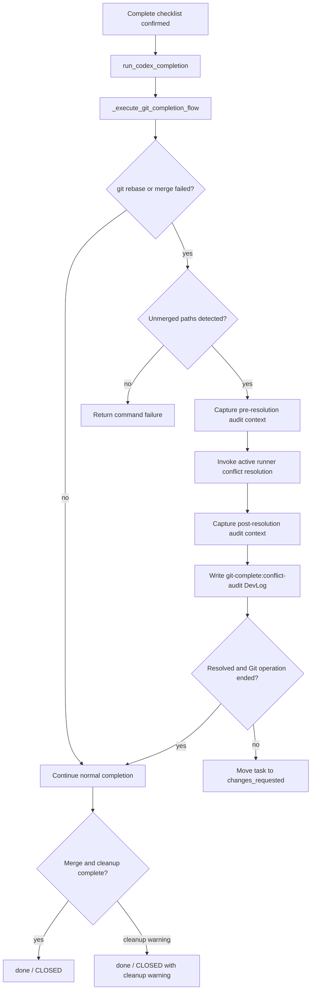

# PRD: Auditable Auto Conflict Resolution

**Original Need:** Complete 自动处理 Git conflict 并合并成功后，用户不知道具体有哪些冲突、runner 修改了什么，需要一个更完整的审计与查看能力。
**AI-Normalized Name:** Make Koda's automatic rebase/merge conflict resolution auditable after Complete.
**Date:** 2026-04-28
**Status:** Pending

## 1. Introduction & Goals

Koda 的普通 `Complete` 流程已经会在 Git 收尾阶段自动处理 `rebase` / `merge` 冲突：当 `git rebase <base>` 或 `git merge <task branch>` 进入真实 conflict 状态时，后端会调用当前 runner 修复冲突、`git add .`、继续 Git 操作，并在成功后合并与清理 worktree。

这个能力是有价值的，但当前可观测性不够。用户在任务进入 `done` 后，只能从较长的 Timeline / raw task log 中推断曾经发生过 conflict，不能稳定知道：

- 哪个 Git 操作发生了冲突：`rebase` 还是 `merge`。
- 冲突涉及哪些文件。
- runner 为解决冲突实际改了哪些文件。
- 自动修复后的结果是否还需要人工复核。
- 在 Completed 归档里如何快速回看这次自动修复。

本需求目标是把自动 conflict resolution 从“后台完成了”升级为“后台完成且可审计”：保留自动修复与自动合并能力，同时在后端生成结构化审计日志，前端把它渲染成清晰的冲突修复记录。

Goals:

- 每次自动冲突修复都必须生成一条结构化、可读、可测试的审计记录。
- 审计记录至少包含 operation、失败命令、冲突文件列表、runner 退出状态、Git 操作最终状态、修复前后变更摘要。
- 用户在任务详情和 Completed 归档里可以快速看到“发生过自动冲突修复”，并展开查看文件和 diff/stat。
- 自动修复成功后仍可继续完成 `Complete`；本需求不把 conflict 变成默认人工阻塞点。
- 自动修复失败时，`changes_requested` 日志要保留同一套审计信息，帮助用户继续人工处理。
- 不新增并行的 Git 执行链路，不绕过现有 checklist gate，不引入不可控的大型日志写入。

## 2. Requirement Shape

- **Actor:** 使用 Koda 点击普通 `Complete` 完成 worktree-backed 任务的开发者。
- **Trigger:** `run_codex_completion(...)` 执行 `git rebase <worktree_base_branch_name>` 或 `git merge <task branch>` 返回非零，且后端通过 unmerged path 检测确认进入 conflict 状态。
- **Expected Behavior:** Koda 在调用 runner 自动修复前采集冲突上下文；runner 完成后采集修复结果；无论最终成功还是失败，都写入结构化 DevLog 审计记录。前端在任务 Timeline、详情头部提示和 Completed 归档中展示该审计记录，并允许用户展开查看文件列表、状态摘要和有限 diff/stat。
- **Explicit Scope Boundary:** 本需求只覆盖普通 `Complete` Git 收尾中的 `rebase` / `merge` conflict audit。不覆盖 self-review / lint 自动修复，不覆盖 `manual_complete`，不要求用户在 conflict 后重新确认，也不新增 push / PR / remote conflict 处理。

## 3. Repository Context And Architecture Fit

Current relevant modules/files:

- `backend/dsl/api/tasks.py`
  - `complete_task(...)` 校验 completion checklist，调用 `TaskService.prepare_task_completion(...)`，再把 `run_codex_completion(...)` 放入后台任务。
  - Route 层不应承载 Git conflict 审计逻辑。
- `backend/dsl/services/task_service.py`
  - 管理任务 stage/lifecycle 转换。
  - `changes_requested` 仍代表自动化无法自行完成，需要人工介入。
- `backend/dsl/services/codex_runner.py`
  - `run_codex_completion(...)` 是 Complete 后台入口。
  - `_execute_git_completion_flow(...)` 固定执行 `git add .`、按需 commit、`git rebase <base>`、`git merge <task branch>`、cleanup。
  - `_has_unmerged_conflicts(...)` 通过 `git diff --name-only --diff-filter=U` 判断真实 conflict。
  - `_run_logged_runner_conflict_resolution(...)` 负责调用 active runner 自动修复 conflict。
  - `_write_log_to_db(...)` 已支持 `automation_phase_label`、`automation_runner_kind`、`automation_session_id`、`automation_sequence_index`。
- `backend/dsl/models/dev_log.py` and `backend/dsl/schemas/dev_log_schema.py`
  - `DevLog` 已有 automation metadata，适合作为审计记录的主要载体。
- `backend/dsl/models/task_artifact.py`
  - 当前用于 PRD 和 Planning with files 快照；不应为了本需求直接复用为 conflict audit，除非未来需要长期大体积 artifact 存储。
- `frontend/src/App.tsx`
  - 已维护 selected task、selected task logs、Timeline、Complete mutation 和 dashboard refresh。
- `frontend/src/types/index.ts`
  - `DevLog` 已暴露 automation metadata。
- `frontend/src/utils/task_timeline_continuity.ts`
  - 已有基于 automation metadata 合并 transcript 的前端模式。
- Related pending PRD:
  - `tasks/pending/20260428-150038-prd-completion-progress-showcase-overlay.md` 关注 Complete 进度弹窗。
  - 本 PRD 关注自动 conflict 修复的后端审计记录和前端查看入口。两个需求可以互补，但不互相依赖。
- Existing tests:
  - `tests/test_codex_runner.py`
  - `tests/test_tasks_api.py`
  - `frontend/tests/app_task_mutation_refresh.test.ts`
  - `frontend/tests/task_timeline_continuity.test.ts`

Existing path:

```text
POST /api/tasks/{id}/complete
  -> run_codex_completion(...)
  -> _execute_git_completion_flow(...)
  -> git rebase / git merge fails with unmerged paths
  -> _run_logged_runner_conflict_resolution(...)
  -> if runner succeeds and Git operation ended, continue completion
  -> done / CLOSED
```

Target path:

```text
POST /api/tasks/{id}/complete
  -> run_codex_completion(...)
  -> _execute_git_completion_flow(...)
  -> git rebase / git merge fails with unmerged paths
  -> capture pre-resolution conflict audit context
  -> _run_logged_runner_conflict_resolution(...)
  -> capture post-resolution audit context
  -> write structured DevLog: git-complete:conflict-audit
  -> continue to done or move to changes_requested
  -> frontend renders Auto Conflict Resolution audit block
```

Architecture constraints:

- Backend owns Git truth. Frontend must not infer conflict state from localized prose alone.
- Existing `Complete` command order must remain unchanged.
- `DevLog` is the canonical visible history. The audit should be represented there before considering a new table.
- Raw diff content can be large or sensitive. The implementation must cap stored diff output and clearly indicate truncation.
- Python file reads for conflict snapshots must use `encoding="utf-8"` with safe error handling.
- Docs must stay synchronized with Git completion behavior.

Potential redundancy risks:

- Do not add a new `/completion-conflicts` endpoint for the first target state. The selected task log polling already fetches `DevLog`.
- Do not add a new DB table unless capped DevLog audit records are demonstrably insufficient.
- Do not make the existing task log file the only source of audit truth; it is less discoverable than Timeline DevLog.
- Do not duplicate the pending progress overlay. This PRD should provide structured audit data that the overlay may consume later.

## 4. Recommendation

### Recommended Approach

Add an auditable conflict resolution record to the existing Complete flow by extending `codex_runner.py` with a small conflict audit data model and helper functions. Persist the audit as structured Markdown in `DevLog` with a stable `automation_phase_label`.

Recommended backend contract:

- Add a dataclass such as `GitConflictResolutionAudit` inside `backend/dsl/services/codex_runner.py` or a small adjacent helper module only if the helper code becomes too large.
- When a `git-rebase-base` or `merge-feature` command fails with unmerged paths:
  - Capture pre-resolution metadata before invoking the runner.
  - Invoke the existing runner conflict resolution path.
  - Capture post-resolution metadata after the runner exits.
  - Write one audit DevLog with:
    - `automation_phase_label="git-complete:conflict-audit"`
    - `automation_runner_kind=get_active_runner_kind()`
    - `state_tag=OPTIMIZATION` when the conflict was resolved and Git operation ended
    - `state_tag=BUG` when runner failed, unmerged paths remain, or Git operation is still active
- Keep the existing raw runner output DevLog, but make the new audit DevLog the user-facing summary.

Recommended audit content:

````markdown
<!-- koda:auto-conflict-audit/v1
{"operation":"rebase","command":"git rebase main","resolved":true,"conflicted_files":["backend/dsl/services/codex_runner.py"]}
-->

### Auto Conflict Resolution

- Operation: `rebase`
- Failed command: `git rebase main`
- Runner: `codex`
- Result: resolved and continued
- Conflicted files: 1

#### Files

| File | Before | After | Notes |
| --- | --- | --- | --- |
| `backend/dsl/services/codex_runner.py` | unmerged | modified | conflict markers removed |

#### Change Summary

```text
 backend/dsl/services/codex_runner.py | 42 +++++++++++++++++++++-------------
 1 file changed, 25 insertions(+), 17 deletions(-)
```

#### Resolution Diff Preview

```diff
... capped unified diff between conflict-marker snapshot and final file ...
```
````

Recommended frontend behavior:

- Add a parser utility, for example `frontend/src/utils/auto_conflict_audit.ts`, that recognizes the `koda:auto-conflict-audit/v1` marker and extracts a typed summary.
- Render audit logs as a dedicated Timeline block:
  - Title: `Auto Conflict Resolution`
  - Badge: `Resolved` or `Needs attention`
  - Operation: `rebase` / `merge`
  - File count and file list
  - Collapsible diff/stat preview
- Add a compact detail banner when the selected task has one or more conflict audit logs:
  - `Koda auto-resolved conflicts in 2 files during Complete.`
  - Button: `Review`
  - The button scrolls/focuses the latest audit block.
- In Completed view, keep the same audit block visible; archived tasks remain reviewable.
- If the pending completion progress overlay PRD is later implemented, it can consume the same audit logs to make the conflict step expandable.

Why this is the best fit:

- It preserves the current automatic merge behavior.
- It uses `DevLog` and automation metadata already present in the system.
- It creates a stable audit contract without adding a new persistence surface.
- It improves both success and failure paths.
- It keeps the frontend as a read-only projection of backend-authored facts.

Rationale for rejecting redundant abstractions:

- A new table would add migrations and API work for data that is naturally part of the task timeline.
- A raw task-log-only approach would not solve discoverability.
- A frontend-only parser over existing runner output would be brittle and would not guarantee file-level evidence.

### Alternatives Considered

| Alternative | Why Not Recommended |
| --- | --- |
| Stop on every conflict and require manual review | Safer by default, but removes the current automation value and was not requested. This can be a future policy toggle if needed. |
| Add a new `TaskArtifactType.GIT_CONFLICT_AUDIT` | Useful if audits need large permanent artifacts, but current `TaskArtifact` is scoped to PRD/planning snapshots. Start with capped DevLog audit records. |
| Store full conflicted file snapshots in the database | Gives maximum detail, but risks very large logs and exposes more source content than needed. Store capped diff/stat instead. |
| Only add a success banner after conflict resolution | Improves visibility but still does not answer which files and what changed. |
| Parse raw runner stdout for file names | Not reliable. The backend should capture file lists directly from Git and filesystem state. |

## 5. Implementation Guide

### Core Logic

1. Detect conflict using existing flow:
   - `_execute_git_completion_flow(...)` already identifies failed `git-rebase-base` and `merge-feature`.
   - Keep the existing `_has_unmerged_conflicts(command_cwd_path)` gate.

2. Capture pre-resolution context:
   - Run `git diff --name-only --diff-filter=U` in the conflict repo.
   - Run `git status --short`.
   - For each conflicted file:
     - Save a bounded in-memory snapshot of the conflicted file content.
     - Count conflict markers (`<<<<<<<`, `=======`, `>>>>>>>`) when the file can be read as text.
     - Record file size and whether snapshot was skipped/truncated.
   - Do not write temporary files unless needed for size control.

3. Invoke the existing runner:
   - Keep `_run_logged_runner_conflict_resolution(...)` as the only runner invocation path.
   - Do not change the prompt requirement to continue `rebase` / `merge`.

4. Capture post-resolution context:
   - Re-run `git diff --name-only --diff-filter=U`.
   - Check `_is_git_operation_still_in_progress(...)`.
   - Run `git status --short`.
   - For previously conflicted files, compare pre snapshot to current content and build:
     - file-level result: removed, unchanged, modified, binary/skipped, still-unmerged
     - capped unified diff preview for text files
   - Run `git diff --stat` when useful, but do not rely on it as the only evidence because the runner may already have continued rebase/merge.

5. Write the audit DevLog:
   - Use `_write_log_to_db(...)`.
   - Set `automation_phase_label_str="git-complete:conflict-audit"`.
   - Set `automation_runner_kind_str=get_active_runner_kind()`.
   - Use `DevLogStateTag.OPTIMIZATION` for resolved audits and `BUG` for unresolved audits.
   - Include a machine-readable HTML comment marker and readable Markdown body.

6. Continue existing control flow:
   - If runner resolved the conflict and the Git operation ended, continue completion exactly as today.
   - If unresolved, return `GitCompletionExecutionResult(... merged_to_main=False ...)` and let `run_codex_completion(...)` move the task to `changes_requested`.
   - If merge succeeded but cleanup failed, preserve current behavior and still keep the audit visible.

7. Render frontend audit:
   - Parse audit logs by `automation_phase_label`.
   - Prefer JSON marker fields for summary.
   - Fall back to rendering Markdown text if parsing fails.
   - Add tests for parsing, banner visibility, and Timeline rendering.

### Affected Files

| Path | Change Type | Purpose |
| --- | --- | --- |
| `backend/dsl/services/codex_runner.py` | Modify | Capture conflict audit context, write structured audit DevLog, preserve existing completion control flow. |
| `tests/test_codex_runner.py` | Modify | Cover resolved and unresolved conflict audit records, capped diff behavior, and state tags. |
| `backend/dsl/schemas/dev_log_schema.py` | Likely unchanged | Existing automation fields should be sufficient. Update only if response typing needs a new optional summary field, which is not recommended initially. |
| `frontend/src/utils/auto_conflict_audit.ts` | Add | Parse `koda:auto-conflict-audit/v1` DevLog markers into typed summaries. |
| `frontend/src/components/AutoConflictAuditBlock.tsx` | Add | Render conflict audit Timeline block. If the repo keeps components inside `App.tsx`, add locally first and extract only if size warrants it. |
| `frontend/src/App.tsx` | Modify | Show detail banner and render audit block in the selected task Timeline. |
| `frontend/src/index.css` | Modify | Add restrained styles for audit block, badges, file table, and collapsible diff. |
| `frontend/tests/auto_conflict_audit.test.ts` | Add | Unit test parser behavior. |
| `frontend/tests/app_task_mutation_refresh.test.ts` or focused App test | Modify | Verify completed tasks show conflict audit visibility after logs arrive. |
| `docs/guides/codex-cli-automation.md` | Modify | Document conflict audit records in Complete. |
| `docs/architecture/system-design.md` | Modify | Update Complete section to mention auditable auto conflict resolution. |
| `docs/dev/evaluation.md` | Modify | Add manual evaluation steps for conflict audit visibility. |

### Change Matrix

| Current Behavior | Target Behavior | Backend Change | Frontend Change | Validation |
| --- | --- | --- | --- | --- |
| Conflict may be auto-resolved, but summary is buried in raw logs. | Every auto conflict attempt writes a structured audit DevLog. | Add conflict audit capture and writer around runner call. | Render audit block from DevLog. | `tests/test_codex_runner.py` resolved conflict case. |
| User cannot quickly see conflict file list after completion. | Detail banner and Timeline show conflicted files. | Include `conflicted_files` in marker JSON and Markdown table. | Add parser and banner. | Frontend parser and App rendering tests. |
| Success path hides whether runner modified files. | Audit includes file-level before/after status and capped diff/stat. | Snapshot conflicted files before runner and compare after. | Collapsible diff/stat preview. | Backend diff cap test and UI snapshot/assertion. |
| Failure path only says completion failed. | Failure path includes same conflict audit with unresolved status. | Write `BUG` audit before returning failure result. | Show `Needs attention` badge. | `tests/test_codex_runner.py` unresolved conflict case. |
| Completed archive has no special conflict indicator. | Completed task details still show conflict audit banner and block. | No lifecycle change needed. | Use selected task logs regardless of view. | App test with `lifecycle_status=CLOSED`. |
| Existing progress overlay PRD has conflict step but no evidence source. | Overlay can later consume `git-complete:conflict-audit`. | Stable phase label. | No dependency required in this PRD. | Documentation cross-reference. |

### Flow Diagram



### Audit Record Shape

```ts
interface AutoConflictAuditSummary {
  version: "v1";
  operation: "rebase" | "merge";
  failedCommand: string;
  runnerKind: string;
  resolved: boolean;
  gitOperationStillInProgress: boolean;
  conflictedFiles: string[];
  remainingUnmergedFiles: string[];
  fileResults: Array<{
    path: string;
    before: "unmerged" | "snapshot-truncated" | "binary-or-unreadable";
    after: "modified" | "unchanged" | "removed" | "still-unmerged" | "unknown";
    markerCountBefore?: number;
    markerCountAfter?: number;
    diffPreviewTruncated: boolean;
  }>;
}
```

The marker JSON should contain enough data for the UI summary. The Markdown body should remain readable if a client does not parse the marker.

### Low-Fidelity Prototype

No standalone prototype file is required for this PRD. The UI is a Timeline/detail enhancement with clear data requirements, and the existing app shell already defines modal, banner, Timeline, and card patterns.

```text
Task Detail
┌─────────────────────────────────────────────────────────────┐
│ Auto-resolved conflicts during Complete                     │
│ 2 files · rebase · Resolved                                 │
│ [Review latest conflict audit]                              │
└─────────────────────────────────────────────────────────────┘

Timeline
┌─────────────────────────────────────────────────────────────┐
│ Auto Conflict Resolution                         Resolved   │
│ Operation: rebase                                           │
│ Failed command: git rebase main                             │
│ Runner: codex                                               │
│ Files: 2                                                    │
│                                                             │
│ backend/dsl/services/codex_runner.py        modified       │
│ docs/guides/codex-cli-automation.md         modified       │
│                                                             │
│ [Show diff/stat]                                            │
└─────────────────────────────────────────────────────────────┘
```

### ER Diagram

No ER diagram is required. The recommended target state does not add tables, columns, or relationships. It uses existing `DevLog.automation_phase_label` and `DevLog.text_content`.

### Interactive Prototype Change Log

No prototype files are changed by this PRD.

### External Validation

No external web research was used. The requirement and recommendation are derived from current repository behavior and user feedback.

## 6. Definition Of Done

- The Complete flow still auto-resolves eligible `rebase` / `merge` conflicts and continues when successful.
- Every conflict resolution attempt writes exactly one structured audit DevLog for that attempt.
- Completed tasks and `changes_requested` tasks both expose the audit record in the UI.
- Conflict audit output is size-capped and marks truncation explicitly.
- Existing raw runner output remains available.
- Documentation describes the audit behavior and how users review it.
- Backend and frontend tests cover success, failure, parsing, rendering, and truncation.
- `uv run pytest tests/test_codex_runner.py tests/test_tasks_api.py -q` passes for backend coverage touched by this feature.
- Frontend test command used by the repo passes for touched frontend utilities/components.
- `just docs-build` passes before commit.

## 7. Acceptance Checklist

### Architecture Acceptance

- [ ] `POST /api/tasks/{task_id}/complete` remains the only normal Complete entrypoint and still requires completion checklist confirmation.
- [ ] Git conflict audit logic lives in the backend completion runner layer, not in FastAPI route handlers.
- [ ] Frontend conflict UI reads backend-authored DevLogs and does not infer conflict files from localized raw output.
- [ ] No new database table or column is added for the initial implementation.
- [ ] Existing `DevLog.automation_phase_label` is used with `git-complete:conflict-audit`.

### Behavior Acceptance

- [ ] When `git rebase <base>` fails with unmerged paths, Koda records conflicted file paths before invoking the runner.
- [ ] When `git merge <task branch>` fails with unmerged paths, Koda records conflicted file paths before invoking the runner.
- [ ] A successful runner conflict repair writes an `OPTIMIZATION` DevLog containing `koda:auto-conflict-audit/v1`.
- [ ] An unresolved runner conflict repair writes a `BUG` DevLog containing `koda:auto-conflict-audit/v1`.
- [ ] The audit DevLog includes operation, failed command, runner kind, conflicted files, remaining unmerged files, and file-level result rows.
- [ ] The audit DevLog includes a capped diff/stat preview or explicitly states why a preview was skipped.
- [ ] If multiple conflict rounds occur in one rebase/merge, each attempt is visible as a distinct audit record or one audit record clearly lists all captured rounds.
- [ ] If auto resolution succeeds, the task may still proceed to `done / CLOSED`.
- [ ] If auto resolution fails before merge, the task moves to `changes_requested` and the audit remains visible.

### UI Acceptance

- [ ] Task detail shows a compact banner when selected task logs contain at least one auto conflict audit.
- [ ] The banner includes operation, resolved/needs-attention status, file count, and a Review action.
- [ ] Timeline renders `git-complete:conflict-audit` as a dedicated `Auto Conflict Resolution` block.
- [ ] The audit block displays conflicted files without requiring users to read raw runner stdout.
- [ ] The audit block provides a collapsible diff/stat preview.
- [ ] Completed archived tasks keep the audit banner and block visible.
- [ ] If the JSON marker cannot be parsed, the UI falls back to readable DevLog Markdown instead of hiding the audit.

### Documentation Acceptance

- [ ] `docs/guides/codex-cli-automation.md` documents that auto conflict resolution now writes a structured audit log.
- [ ] `docs/architecture/system-design.md` updates the Complete section to mention conflict audit records.
- [ ] `docs/dev/evaluation.md` includes a manual scenario for auto-resolved conflict visibility after Complete.
- [ ] Documentation states that auto conflict resolution does not push and does not require a second confirmation by default.

### Validation Acceptance

- [ ] `tests/test_codex_runner.py` covers a resolved rebase conflict audit.
- [ ] `tests/test_codex_runner.py` covers a resolved merge conflict audit.
- [ ] `tests/test_codex_runner.py` covers unresolved conflict audit and `changes_requested` transition.
- [ ] `tests/test_codex_runner.py` covers diff preview truncation.
- [ ] Frontend parser tests cover valid marker, invalid marker fallback, and multiple file results.
- [ ] Frontend App/Timeline tests cover banner and audit block rendering for `OPEN` and `CLOSED` tasks.
- [ ] `rg -n "git-complete:conflict-audit|koda:auto-conflict-audit/v1" backend frontend docs tests` finds implementation, tests, and docs references.

## 8. User Stories

### Story 1: Review Auto-Resolved Conflict After Completion

As a developer, after Koda completes a task that encountered a Git conflict, I want to see a clear audit block showing which files conflicted and what Koda changed so that I can trust the automatic merge result.

### Story 2: Diagnose Failed Auto Conflict Repair

As a developer, when Koda cannot finish conflict repair and moves the task to `changes_requested`, I want the same audit record to show unresolved files and runner status so that I can continue manually without reconstructing the failure from raw logs.

### Story 3: Inspect Completed History

As a developer reviewing a completed requirement later, I want the Completed task detail to preserve conflict audit evidence so that I can understand why the final merged code differs from either side of the original conflict.

## 9. Functional Requirements

- **FR-1:** Backend must detect auto conflict audit opportunities only after a `git-rebase-base` or `merge-feature` command fails and `_has_unmerged_conflicts(...)` returns true.
- **FR-2:** Backend must capture pre-resolution conflicted file paths using `git diff --name-only --diff-filter=U`.
- **FR-3:** Backend must capture pre-resolution `git status --short` for audit context.
- **FR-4:** Backend must snapshot conflicted text files before runner execution with per-file and total byte caps.
- **FR-5:** Backend must invoke the existing runner conflict resolution function without creating a new runner execution path.
- **FR-6:** Backend must capture post-resolution remaining unmerged files and Git operation status.
- **FR-7:** Backend must compare pre-resolution snapshots to post-resolution file contents for conflicted files when text snapshots are available.
- **FR-8:** Backend must generate a capped unified diff preview for changed text files and mark truncation.
- **FR-9:** Backend must write a DevLog with `automation_phase_label="git-complete:conflict-audit"` for every captured conflict attempt.
- **FR-10:** Backend must include a `koda:auto-conflict-audit/v1` marker with parseable JSON summary in the DevLog text.
- **FR-11:** Backend must use `OPTIMIZATION` for resolved audit logs and `BUG` for unresolved audit logs.
- **FR-12:** Backend must preserve the current success/failure transitions of `run_codex_completion(...)`.
- **FR-13:** Frontend must parse conflict audit marker JSON into a typed summary.
- **FR-14:** Frontend must render conflict audit DevLogs as a dedicated Timeline block.
- **FR-15:** Frontend must show a selected-task banner when one or more conflict audits exist.
- **FR-16:** Frontend must keep the raw DevLog Markdown accessible when parser fallback is needed.
- **FR-17:** Documentation must describe how users review conflict audits after Complete.

## 10. Non-Goals

- Requiring manual approval before continuing an auto-resolved conflict.
- Changing the default Complete command order.
- Adding push, PR creation, or remote conflict resolution.
- Auditing self-review, review-fix, or lint-fix changes under the same conflict audit UI.
- Storing full unbounded file snapshots or complete repository diffs in the database.
- Replacing the existing Timeline or raw task log.
- Implementing the separate completion progress overlay described in `20260428-150038-prd-completion-progress-showcase-overlay.md`.

## 11. Risks And Follow-Ups

- **Large diff risk:** Conflict files can be large. The implementation must cap per-file snapshots and diff previews, and clearly mark truncated output.
- **Sensitive content risk:** DevLogs may be exported or synced. The audit should store only conflicted files and capped previews, not full repository snapshots.
- **Runner behavior risk:** The runner is currently instructed to continue rebase/merge itself. If it completes the operation before post-capture, the audit must rely on before/after file snapshots rather than active Git diff alone.
- **Multiple conflict rounds:** A rebase can surface conflicts across multiple commits. The implementation must either write one audit per runner invocation or aggregate rounds with clear numbering.
- **Future follow-up:** If users later want mandatory human approval after auto conflict repair, add a policy setting on top of this audit trail rather than changing this PRD's default completion behavior.

## 12. Decision Log

| Decision | Rationale |
| --- | --- |
| Keep automatic conflict repair enabled by default. | The current behavior is useful and the user did not ask to disable it. The problem is lack of visibility. |
| Use DevLog as the primary audit surface. | DevLog is already the visible task history and has automation metadata. |
| Do not add a new conflict audit table initially. | Structured, capped audit records fit current DevLog architecture and avoid migration overhead. |
| Include a machine-readable marker plus readable Markdown. | Frontend needs stable parsing, while older clients and raw Timeline still need readable content. |
| Capture before and after around the runner call. | This directly answers which files conflicted and what changed during automatic repair. |
| Cap snapshots and diff previews. | Prevents large logs and reduces accidental overexposure of source content. |
| Keep the progress overlay PRD separate. | Progress display and conflict audit evidence are related but separate product surfaces. |
