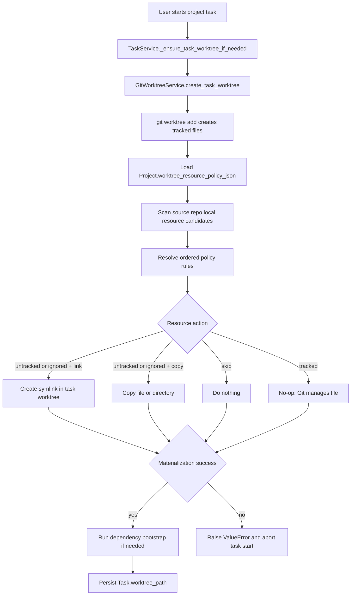
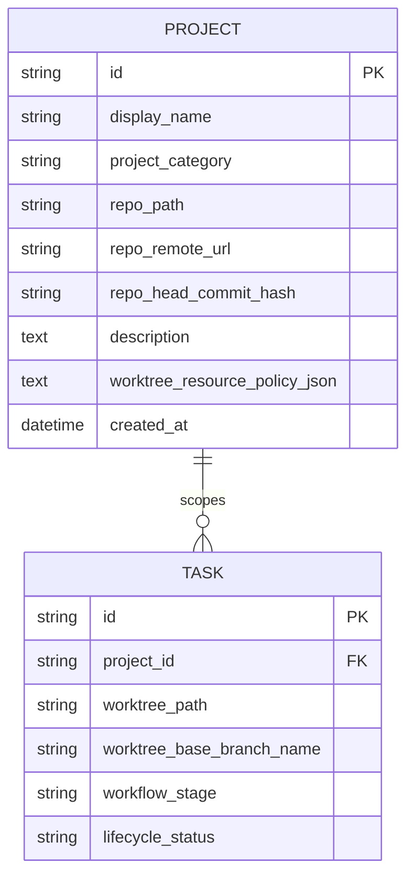

# PRD: Worktree Local Resource Policy

**Original Need:** 创建任务 worktree 时，Git 已跟踪文件默认由 worktree 检出，但本地数据库、上传数据、`.env`、缓存等未跟踪或忽略文件没有进入新 worktree，导致无法测试。需要支持复制或链接项目运行所需资源：已跟踪文件默认复制，未跟踪文件默认链接；用户可在项目管理中配置每个资源是否处理，以及使用复制还是链接。
**AI-Normalized Name:** Add a project-level local resource policy that materializes untracked runtime files into task worktrees.
**Date:** 2026-04-28
**Status:** Pending

## 1. Introduction & Goals

当前 Koda 创建任务 worktree 时，`GitWorktreeService.create_task_worktree(...)` 先执行 `git worktree add`，再运行 `scripts/bootstrap_worktree_env.sh` 做有限的环境准备。Git 能自动带过去的只有已跟踪文件；本地数据库、上传目录、`.env*`、`.venv`、`node_modules`、测试数据等通常是未跟踪或被 `.gitignore` 忽略的资源，当前只对 `.env*`、`.venv` 和前端依赖目录做了硬编码处理，无法覆盖项目运行所需的其他本地资源。

本需求要把“worktree 本地资源准备”从硬编码脚本策略升级为项目级可配置能力：创建 worktree 后，系统根据项目的资源策略，把 Git 未管理但运行必需的文件或目录复制或链接到新 worktree。默认行为是 Git 跟踪文件由 Git checkout 管理，未跟踪或忽略资源以链接方式进入 worktree；用户可以在项目管理中修改资源规则。

Goals:

- 任务 worktree 创建成功后，本地运行所需的未跟踪/忽略资源不再默认丢失。
- Git 跟踪文件继续由 `git worktree add` 检出，保持当前分支、diff、merge 和 cleanup 语义不变。
- 未跟踪/忽略资源默认以 symlink 方式 materialize，减少磁盘占用并保持数据库/上传数据等本地状态可用。
- 用户可在项目管理中查看扫描到的本地资源，并为每个资源设置 `link`、`copy` 或 `skip`。
- 资源策略必须持久化到 `Project`，后续该项目的新任务 worktree 自动复用。
- 资源 materialization 失败时 fail fast，不把不可测试的 worktree 继续写入任务流程。
- 现有 `.env*`、`.venv`、`node_modules` 准备逻辑要收敛到同一套资源策略，避免 shell 脚本和 Python 服务各维护一套隐式规则。

## 2. Requirement Shape

- **Actor:** 使用 Koda 项目管理和任务 worktree 执行需求的开发者。
- **Trigger:** 用户启动关联 Project 的任务，系统创建或复用该任务 worktree。
- **Expected Behavior:** 系统先创建 Git worktree，再按 Project 的本地资源策略把未跟踪/忽略资源复制或链接到新 worktree；项目管理 UI 提供资源扫描、规则编辑、保存和重置默认能力。
- **Explicit Scope Boundary:** 本需求覆盖 Project 级 worktree 本地资源策略、资源扫描、资源 materialization、项目管理 UI 和相关文档测试；不改变任务 worktree 路径规则，不改变 Git tracked file 的分支管理语义，不实现跨机器同步本地资源内容，不把资源链接当作隔离或备份能力。

## 3. Repository Context And Architecture Fit

Current relevant modules/files:

- `backend/dsl/services/task_service.py`
  - `_ensure_task_worktree_if_needed(...)` 是任务进入 worktree-backed Git 流程的入口。
  - 它读取 `Project.repo_path`，校验仓库一致性，计算语义分支名，然后调用 `GitWorktreeService.create_task_worktree(...)`。
- `backend/dsl/services/git_worktree_service.py`
  - `create_task_worktree(...)` 已集中封装 worktree 创建、path-aware script 支持、raw Git fallback 和 post-create bootstrap。
  - `WorktreeCreateCommandSpec.requires_post_create_bootstrap` 已说明 worktree 创建后存在统一准备阶段，是本需求的最近扩展点。
- `scripts/bootstrap_worktree_env.sh`
  - 当前负责 `.env*`、frontend `node_modules`、Python `.venv` / `uv sync`。
  - 该脚本已经隐含了“未跟踪本地资源需要进入 worktree”的问题，但规则硬编码，用户不可见，也不能覆盖数据库或上传目录。
- `backend/dsl/models/project.py`
  - `Project` 是项目级配置和本地仓库路径的持久化锚点。
  - 当前字段包含 `repo_path`、`repo_remote_url`、`repo_head_commit_hash`、`project_category` 等，不包含 worktree 资源策略。
- `backend/dsl/schemas/project_schema.py`
  - `ProjectCreateSchema`、`ProjectUpdateSchema`、`ProjectResponseSchema` 是项目管理 UI 与后端之间的合同。
- `backend/dsl/api/projects.py`
  - 项目 CRUD 和分支列表路由位于这里。HTTP 层应继续只做参数、状态码和 DTO 转换，策略规则校验应放到服务或新领域切片中。
- `frontend/src/App.tsx`
  - 项目管理面板已展示 Project 列表和编辑表单，是新增资源策略 UI 的最小落点。
- `frontend/src/api/client.ts` 与 `frontend/src/types/index.ts`
  - 需要同步 Project DTO 和资源策略 API 类型。
- `utils/database.py`
  - 现有轻量 schema patch 通过 `_INCREMENTAL_SCHEMA_PATCHES` 追加字段。若给 `projects` 增加策略 JSON 字段，应同步这里。
- Existing tests/docs:
  - `tests/test_git_worktree_service.py` 已覆盖 raw fallback、path-aware script、`.env*`、`node_modules`、`.venv` bootstrap。
  - `tests/test_project_service.py`、`tests/test_projects_api.py` 覆盖 Project 持久化和 API。
  - `docs/guides/dsl-development.md`、`docs/database/schema.md`、`docs/dev/evaluation.md` 描述 worktree、项目和数据模型契约。

Existing path:

- `TaskService._ensure_task_worktree_if_needed(...)`
- `GitWorktreeService.create_task_worktree(...)`
- `git worktree add ...`
- `scripts/bootstrap_worktree_env.sh <source_repo_path> <target_worktree_path>`
- save `Task.worktree_path`

Reuse candidates:

- Reuse `GitWorktreeService.create_task_worktree(...)` as the lifecycle boundary for resource materialization.
- Reuse `Project` as the owner of project-specific resource policy.
- Reuse the project management panel instead of adding a separate settings page.
- Reuse existing incremental schema patch style in `utils/database.py`.
- Reuse current tests around `tests/test_git_worktree_service.py` and expand them from `.env*`-specific behavior to policy-driven behavior.

Architecture constraints:

- Business rules for scanning, rule precedence, path safety and materialization must not live in FastAPI route handlers or ORM models.
- File operations are infrastructure side effects and must be called through service/application logic.
- All file reads/writes in Python must use `encoding="utf-8"` when touching text files.
- Paths in policy rules must be repo-relative, normalized, and prevented from escaping the source repo or target worktree.
- Git tracked files must remain Git-owned by default. Replacing tracked files with symlinks would make ordinary Git diff/merge behavior ambiguous and is not recommended for this target state.
- Resource policies are machine-local project settings. WebDAV business snapshot semantics should not sync local resource contents; policy metadata may sync only if existing project business facts include it intentionally.
- Symlinks may be unavailable or behave differently on Windows. The implementation must detect symlink failures and surface actionable errors or require `copy`.

Potential redundancy risks:

- Do not add a second worktree creation service. Extend the existing post-create preparation boundary.
- Do not keep `.env*`, `.venv`, and `node_modules` as separate hidden shell-only rules after introducing project resource policy.
- Do not add a new table for per-rule storage unless querying individual rules becomes necessary. Project-level JSON is enough for create/update/list flows.
- Do not introduce an external file sync tool. Git plus explicit copy/link operations is sufficient for the requested behavior.

## 4. Recommendation

### Recommended Approach

Implement a project-level `worktree_resource_policy_json` field plus a new `backend/dsl/worktree_resources/` domain slice that scans, validates and materializes local resources after `git worktree add` and before the task records `worktree_path`.

The recommended target state is:

1. Add a structured Project resource policy:
   - `schema_version`;
   - `default_untracked_materialization`: default `link`;
   - `tracked_file_materialization`: fixed `git-managed-copy`;
   - ordered `rules` with `relative_path`, `include`, `materialization`, `resource_kind`, and optional `note`.
2. During project create, initialize an empty policy that means:
   - Git tracked files are managed by Git;
   - untracked and ignored resources are linked by default;
   - built-in unsafe paths are skipped.
3. Add project resource scan API:
   - `GET /api/projects/{project_id}/worktree-resource-candidates`
   - returns repo-relative candidates, Git state (`tracked`, `untracked`, `ignored`), default action, current saved rule, type (`file`, `directory`, `symlink`) and warning text.
4. Extend project update API to accept and validate `worktree_resource_policy`.
5. Add a `WorktreeResourceMaterializer` use case called by `GitWorktreeService.create_task_worktree(...)` after the Git worktree exists.
6. Materializer behavior:
   - tracked files: no operation; Git already created them;
   - untracked/ignored include + `link`: create symlink at the same relative path;
   - untracked/ignored include + `copy`: copy file, directory, or symlink target using `shutil.copy2` / `shutil.copytree` with explicit collision rules;
   - include false or `skip`: do nothing;
   - target path exists: if it matches the expected symlink target, skip; otherwise fail with a clear conflict error.
7. Project management UI adds a resource section inside each project edit state:
   - scan button;
   - table/list of resource candidates;
   - include toggle;
   - materialization segmented control: `Link`, `Copy`, `Skip`;
   - warning labels for large directories, secrets, and symlink unsupported cases;
   - save action reuses Project update.
8. Existing `bootstrap_worktree_env.sh` should stop owning `.env*` materialization once the Python policy materializer is active. It may remain for dependency installation only, or be reduced to a compatibility wrapper that delegates local resource handling to the Python service.
9. Resource preparation failure fails task start before `Task.worktree_path` is persisted.

Why this is the best fit for the current architecture:

- It uses the existing post-create worktree lifecycle boundary instead of adding another task startup path.
- It stores project-specific settings on `Project`, which already owns local repo path and project management editing.
- It moves policy decisions out of shell into typed Python domain/application code, while leaving CLI dependency setup where it already exists.
- It supports the user's default behavior without forcing every project to manually list every local resource.
- It makes previously hidden behavior (`.env*`, `.venv`, `node_modules`) visible and configurable.

Rationale for rejecting redundant abstractions:

- A dedicated `project_worktree_resource_rules` table is not needed because the app does not need to query rules across projects or join individual rules.
- A separate worktree-preparation CLI would duplicate `GitWorktreeService` and complicate task start error handling.
- Keeping all logic in `scripts/bootstrap_worktree_env.sh` would make validation, API preview, tests and UI behavior harder to keep consistent.

### Alternatives Considered

| Alternative | Why Not Recommended |
| --- | --- |
| Keep extending `scripts/bootstrap_worktree_env.sh` only | Fast for `.env*`, but not a good fit for user-visible rule validation, project API responses, Windows-safe path handling or tests around rule precedence. |
| Store resource rules in a normalized `ProjectWorktreeResourceRule` table | More relationally pure, but heavier than needed because rules are only loaded and saved as a whole Project setting. |
| Copy every untracked/ignored file by default | Safer isolation than links, but expensive for databases, uploads and dependency directories; it also hides shared-state expectations that users often rely on during local testing. |
| Link tracked files too | This breaks ordinary Git expectations because replacing tracked files with symlinks changes the worktree diff and can interfere with merges. Tracked files should remain Git-managed in this target state. |
| Ask users to maintain repo-local scripts per project | Pushes the problem back to users and recreates the current inconsistency between projects. |

## 5. Implementation Guide

### Core Logic

1. Data contract:
   - Add `Project.worktree_resource_policy_json: Text | None`.
   - Add Pydantic models in `backend/dsl/worktree_resources/schemas.py` or `backend/dsl/schemas/project_schema.py`:
     - `WorktreeResourceMaterialization = "git-managed-copy" | "link" | "copy" | "skip"`;
     - `WorktreeResourceGitState = "tracked" | "untracked" | "ignored"`;
     - `ProjectWorktreeResourceRuleSchema`;
     - `ProjectWorktreeResourcePolicySchema`;
     - `WorktreeResourceCandidateSchema`.
   - `ProjectResponseSchema` includes `worktree_resource_policy`.
   - `ProjectCreateSchema` and `ProjectUpdateSchema` accept optional `worktree_resource_policy`.

2. Domain/application slice:
   - Add `backend/dsl/worktree_resources/`.
   - Suggested modules:
     - `domain/models.py`: typed policy, rule, resource candidate, materialization result.
     - `domain/policies.py`: default policy, rule precedence, built-in exclusions.
     - `domain/errors.py`: unsafe path, materialization conflict, symlink unsupported, invalid policy.
     - `application/use_cases.py`: scan project resources, validate policy, materialize resources.
     - `application/ports.py`: repository and filesystem ports if needed.
     - `infrastructure/git_resource_scanner.py`: wraps `git ls-files` / `git status` with UTF-8 subprocess handling.
     - `infrastructure/filesystem_materializer.py`: copy/link side effects.
     - `api.py` only if scan/save endpoints are split from `backend/dsl/api/projects.py`.

3. Resource discovery:
   - Use Git as the source of truth for states:
     - tracked: `git ls-files`;
     - untracked: `git ls-files --others --exclude-standard`;
     - ignored: `git ls-files --others --ignored --exclude-standard`.
   - Collapse ignored file lists into directory candidates for common heavy directories such as `node_modules`, `.venv`, `data`, `uploads`, `.uv-cache`, `dist`, `build`, and generated cache roots.
   - Built-in exclusions always skip:
     - `.git/**`;
     - the task worktree root under `<repo-parent>/task/**`;
     - nested Git metadata;
     - OS temp files such as `.DS_Store`;
     - paths that resolve outside `Project.repo_path`.
   - Candidate warnings:
     - likely secret: `.env*`, `*.pem`, `*.key`;
     - large directory: size above configured threshold;
     - shared mutable data: SQLite/db/upload directories when linked;
     - symlink unsupported or link creation failed on the current platform.

4. Materialization sequence:
   - `GitWorktreeService.create_task_worktree(...)` creates the worktree exactly as today.
   - New call:

     ```python
     WorktreeResourceMaterializer.materialize_project_resources(
         project_repo_root_path=repo_root_path,
         task_worktree_path=created_worktree_path,
         project_resource_policy=resolved_policy_obj,
     )
     ```

   - Then dependency bootstrap may run for install-only tasks.
   - Only after both steps succeed does `create_task_worktree(...)` return and allow `TaskService` to persist `Task.worktree_path`.

5. Collision and overwrite policy:
   - Existing Git-tracked target path: fail; resource rules must not overwrite Git-owned files.
   - Existing symlink to the same source: skip as idempotent.
   - Existing copied file/dir from previous failed attempt: fail with a cleanup instruction, unless a future explicit `replace_existing` option is added.
   - Missing source path for saved rule: warn during scan; skip during materialization if the rule is optional, fail if the rule is marked required.

6. UI behavior:
   - Project item edit form gains a compact “Worktree 资源” section.
   - Default collapsed view shows a summary such as `未跟踪资源：5 link / 2 copy / 3 skip`.
   - Expanded view scans on demand to avoid slowing normal project list rendering.
   - Each candidate row shows path, state, kind, action control and warning.
   - Save writes the full Project update payload with `worktree_resource_policy`.
   - Reset default removes custom rules and returns to untracked default link.

7. Documentation:
   - Update `docs/guides/dsl-development.md` with the task start resource materialization step.
   - Update `docs/database/schema.md` for `Project.worktree_resource_policy_json`.
   - Update `docs/dev/evaluation.md` with manual verification for linked/copy local resources.
   - Update `README.md` if it documents worktree setup behavior.

### Affected Files

- `backend/dsl/models/project.py`
- `backend/dsl/schemas/project_schema.py`
- `backend/dsl/services/project_service.py`
- `backend/dsl/services/git_worktree_service.py`
- `backend/dsl/worktree_resources/__init__.py`
- `backend/dsl/worktree_resources/api.py`
- `backend/dsl/worktree_resources/schemas.py`
- `backend/dsl/worktree_resources/domain/models.py`
- `backend/dsl/worktree_resources/domain/policies.py`
- `backend/dsl/worktree_resources/domain/errors.py`
- `backend/dsl/worktree_resources/application/use_cases.py`
- `backend/dsl/worktree_resources/infrastructure/git_resource_scanner.py`
- `backend/dsl/worktree_resources/infrastructure/filesystem_materializer.py`
- `backend/dsl/app.py`
- `utils/database.py`
- `scripts/bootstrap_worktree_env.sh`
- `tests/test_git_worktree_service.py`
- `tests/test_project_service.py`
- `tests/test_projects_api.py`
- `tests/test_database.py`
- `frontend/src/types/index.ts`
- `frontend/src/api/client.ts`
- `frontend/src/App.tsx`
- `frontend/src/index.css`
- `frontend/tests/api_client.test.ts`
- `frontend/tests/task_list.test.ts` or a new focused project resource policy test
- `docs/guides/dsl-development.md`
- `docs/database/schema.md`
- `docs/dev/evaluation.md`
- `README.md`

### Change Matrix

| Change Target | Current State | Target State | How to Modify | Why This Fits Existing Architecture | Affected Files |
|---|---|---|---|---|---|
| Project resource policy storage | `Project` stores repo path and fingerprints only | `Project` also stores typed resource policy JSON | Add `worktree_resource_policy_json` column, schema DTOs and service normalization | Project already owns local repo settings and project management editing | `backend/dsl/models/project.py`, `backend/dsl/schemas/project_schema.py`, `backend/dsl/services/project_service.py`, `utils/database.py` |
| Resource scanning | No user-visible scan; shell only finds hard-coded `.env*` and dependency directories | API returns tracked/untracked/ignored candidates with default action and warnings | Add Git scanner use case using `git ls-files` and safe path normalization | Keeps Git as source of truth and avoids ad hoc filesystem guesses | `backend/dsl/worktree_resources/**`, `backend/dsl/api/projects.py` or `backend/dsl/worktree_resources/api.py` |
| Worktree post-create preparation | `GitWorktreeService` runs shell bootstrap after create | `GitWorktreeService` materializes policy resources, then runs remaining dependency bootstrap | Insert materializer after worktree creation and before return | Reuses existing lifecycle boundary where failures already abort task start | `backend/dsl/services/git_worktree_service.py`, `scripts/bootstrap_worktree_env.sh` |
| `.env*`, `.venv`, `node_modules` handling | Hidden shell defaults controlled by env vars | Visible project rules with link/copy/skip controls | Migrate implicit behavior into generated default policy and reduce shell overlap | Avoids duplicate local resource rules and makes behavior explainable in UI | `scripts/bootstrap_worktree_env.sh`, `backend/dsl/worktree_resources/domain/policies.py` |
| Project management UI | Project edit supports name, path, category and description | Project edit also supports worktree resource rule scanning and editing | Add resource policy state, API calls, controls and CSS | Reuses existing Project management surface instead of adding a new page | `frontend/src/App.tsx`, `frontend/src/api/client.ts`, `frontend/src/types/index.ts`, `frontend/src/index.css` |
| Validation and docs | Tests cover limited bootstrap behavior | Tests verify policy parsing, scan, copy/link, collision and API/UI contracts | Extend backend/frontend tests and docs | Matches existing validation split across service/API/frontend docs | `tests/**`, `frontend/tests/**`, `docs/**`, `README.md` |

### Flow Or Architecture Diagram



### Low-Fidelity Prototype

```text
Project Management
┌──────────────────────────────────────────────────────────────┐
│ Demo App                                      Healthy  Edit   │
│ /Users/me/code/demo-app                                      │
│ Worktree resources: 4 link · 1 copy · 6 skip                 │
└──────────────────────────────────────────────────────────────┘

Edit Project
┌──────────────────────────────────────────────────────────────┐
│ Name              [ Demo App                              ]  │
│ Repo Path          [ /Users/me/code/demo-app                ] │
│ Category           [ backend                              ]  │
│ Description        [ local test app                       ]  │
├──────────────────────────────────────────────────────────────┤
│ Worktree Resources                         [Scan] [Reset]   │
│ Default for untracked resources:  Link                      │
│                                                              │
│ Include  Path                  State      Action   Warning   │
│ [x]      data/app.sqlite       ignored    Link     shared DB │
│ [x]      uploads/              ignored    Link     mutable   │
│ [x]      .env.local            ignored    Copy     secret    │
│ [ ]      logs/                 ignored    Skip               │
│ [ ]      node_modules/         ignored    Skip     large     │
│ git      src/main.py           tracked    Git      managed   │
│                                                              │
│                                      [Cancel] [Save]         │
└──────────────────────────────────────────────────────────────┘
```

### ER Diagram



### Interactive Prototype Change Log

No interactive prototype file changes in this PRD.

### External Validation

No external validation required; repository evidence was sufficient.

## 6. Definition Of Done

- Worktree creation still uses the current `TaskService` and `GitWorktreeService` lifecycle.
- Project resource policy is persisted, returned by the API, editable in the project management UI, and validated server-side.
- New worktrees materialize included untracked/ignored resources according to saved policy before `Task.worktree_path` is persisted.
- Hidden `.env*`, `.venv`, and `node_modules` bootstrap behavior is either migrated into the policy materializer or clearly reduced to dependency installation so rules do not diverge.
- Documentation reflects the new project resource policy and local-resource sharing risks.
- Backend tests, frontend tests and docs build pass.

## 7. Acceptance Checklist

### Architecture Acceptance

- [ ] `GitWorktreeService.create_task_worktree(...)` remains the only worktree creation lifecycle entry used by task start.
- [ ] Local resource rule resolution lives outside FastAPI route handlers and ORM model methods.
- [ ] `backend/dsl/worktree_resources/domain/` does not import FastAPI, SQLAlchemy sessions or React/frontend types.
- [ ] `Project.worktree_resource_policy_json` is normalized through Pydantic models before persistence.
- [ ] `scripts/bootstrap_worktree_env.sh` no longer independently decides `.env*` copy/link behavior when the policy materializer is active.

### Dependency Acceptance

- [ ] No new third-party runtime dependency is added for file syncing.
- [ ] Git scanning is performed through `subprocess.run(..., encoding="utf-8", errors="replace")`.
- [ ] Python file text I/O introduced by this change uses explicit `encoding="utf-8"`.

### Behavior Acceptance

- [ ] A repo with tracked `README.md` and untracked `data/app.sqlite` creates a task worktree where `README.md` is Git-managed and `data/app.sqlite` is linked by default.
- [ ] A saved rule with `materialization="copy"` copies the source file or directory into the worktree and does not create a symlink.
- [ ] A saved rule with `include=false` or `materialization="skip"` leaves the resource absent from the worktree.
- [ ] A target collision with an existing non-matching file or directory fails task start before `Task.worktree_path` is persisted.
- [ ] A rule path containing `..`, absolute paths, or symlink escape outside the repo is rejected with a 422 API error.
- [ ] Built-in exclusions never copy or link `.git/**` or `<repo-parent>/task/**`.
- [ ] Project scan API reports `tracked`, `untracked`, and `ignored` states and marks tracked paths as `git-managed-copy`.
- [ ] The UI lets users scan, include/exclude, switch between Link/Copy/Skip, save, and reset project resource rules.

### Documentation Acceptance

- [ ] `docs/guides/dsl-development.md` describes the new worktree resource materialization step.
- [ ] `docs/database/schema.md` includes `Project.worktree_resource_policy_json` and updates the ER diagram.
- [ ] `docs/dev/evaluation.md` includes manual checks for linked database files and copied `.env` files.
- [ ] `README.md` or the relevant guide explains that linked resources are shared mutable local state.

### Validation Acceptance

- [ ] `uv run pytest tests/test_git_worktree_service.py -v` passes.
- [ ] `uv run pytest tests/test_project_service.py tests/test_projects_api.py tests/test_database.py -v` passes.
- [ ] Frontend tests covering Project API/client or App project resource controls pass through the existing frontend test command.
- [ ] `just docs-build` passes.

## 8. User Stories

### US-001: New task worktree can use local runtime data

As a developer, I want task worktrees to include my local database and uploaded files, so I can run and test the project without manually copying data after every task start.

Acceptance criteria:

- A local ignored database file is present in the new worktree by default as a symlink.
- A linked resource points back to the project repo source path.
- The task start fails visibly if the configured resource cannot be materialized.

### US-002: Project owner can choose copy, link or skip

As a project owner, I want to configure which local resources are linked, copied or skipped, so each project can balance speed, disk usage and isolation.

Acceptance criteria:

- Project management shows scanned resource candidates.
- The selected rule persists after closing and reopening the project panel.
- New worktrees use the saved rule without requiring another manual scan.

### US-003: Sensitive files can be copied instead of linked

As a developer, I want to copy `.env` files while linking mutable data directories, so one task worktree can safely edit environment values without changing the main project checkout.

Acceptance criteria:

- `.env.local` can be saved with `copy`.
- The target worktree receives a real file, not a symlink.
- Editing the worktree copy does not edit the source file.

### US-004: Heavy generated directories can be excluded

As a developer, I want to skip large or disposable generated directories, so worktree setup does not become slow or noisy.

Acceptance criteria:

- `logs/`, cache directories or `node_modules/` can be saved as `skip`.
- Skipped paths are absent from new worktrees.
- The scan result still shows skipped resources for later reconfiguration.

## 9. Functional Requirements

- FR-1: The system must keep Git tracked files managed by `git worktree add` by default.
- FR-2: The system must treat untracked and ignored resources as eligible for default `link` materialization.
- FR-3: The system must provide a Project-level resource policy with ordered rules.
- FR-4: Each rule must support include/skip and materialization mode `link` or `copy` for untracked/ignored resources.
- FR-5: The system must reject policy paths that are absolute, contain unsafe traversal, or resolve outside the source repo or target worktree.
- FR-6: The resource scanner must distinguish tracked, untracked and ignored resources using Git commands.
- FR-7: The project management UI must expose scan, rule editing, save and reset default behavior.
- FR-8: Worktree resource materialization must run after Git worktree creation and before `Task.worktree_path` is persisted.
- FR-9: Materialization failure must abort task start with a clear error message.
- FR-10: Existing worktree path naming under `<repo-parent>/task/<repo>-wt-<task_short_id>` must not change.
- FR-11: Existing branch naming and base branch behavior must not change.
- FR-12: Resource policy behavior must be covered by backend tests for link, copy, skip, collision, path safety and default behavior.
- FR-13: Documentation must warn that linked resources are shared mutable state across worktrees.

## 10. Non-Goals

- Do not implement cross-machine transfer of local resource contents.
- Do not sync actual database/upload/cache files through WebDAV.
- Do not replace Git tracked files with symlinks in the target state.
- Do not make `node_modules` or `.venv` copying mandatory.
- Do not introduce Docker, rsync, unison or a new background file synchronization daemon.
- Do not change task completion, merge, branch cleanup or PR preparation semantics.

## 11. Risks And Follow-Ups

- Symlinked databases and upload directories are shared mutable state. This is intentional by default, but the UI and docs must make it visible and allow `copy` when isolation matters.
- Copying large directories can make task start slow and consume significant disk. The scanner should warn for large resources before users save `copy`.
- Windows symlink creation may require privileges or developer mode. The materializer must report link failures clearly and allow users to choose `copy`.
- Existing users may rely on `WORKTREE_ENV_FILE_STRATEGY`, `WORKTREE_FRONTEND_STRATEGY`, or `WORKTREE_PYTHON_ENV_STRATEGY`. Implementation should either map those environment defaults into generated policy defaults or document the compatibility behavior during migration.

## 12. Decision Log

| ID | Decision | Chosen | Rejected | Rationale |
|---|---|---|---|---|
| D-01 | Where should resource policy be stored? | Store structured policy JSON on `Project.worktree_resource_policy_json`. | Add a normalized `ProjectWorktreeResourceRule` table. | The policy is loaded and saved as one Project setting, so a table adds query and migration complexity without current product value. |
| D-02 | Where should materialization run? | Run after `git worktree add` inside `GitWorktreeService.create_task_worktree(...)`. | Add a separate worktree preparation command path. | The existing service already owns fail-fast worktree creation and is the only path before `Task.worktree_path` is persisted. |
| D-03 | What is the default for untracked resources? | Link untracked/ignored resources by default, with built-in unsafe exclusions. | Copy every untracked/ignored resource by default. | Linking matches the user's requested default and avoids duplicating large mutable local runtime data. |
| D-04 | How should tracked files be handled? | Keep tracked files Git-managed as `git-managed-copy`. | Replace tracked files with configurable symlinks. | Symlinking tracked files would interfere with Git diff and merge semantics in task worktrees. |
| D-05 | How should existing bootstrap behavior evolve? | Move local resource copy/link decisions into the new policy materializer and leave the shell script for dependency setup compatibility. | Continue adding hidden resource rules to `bootstrap_worktree_env.sh`. | Typed policy logic is needed for API validation, UI preview, path safety and testable rule precedence. |
