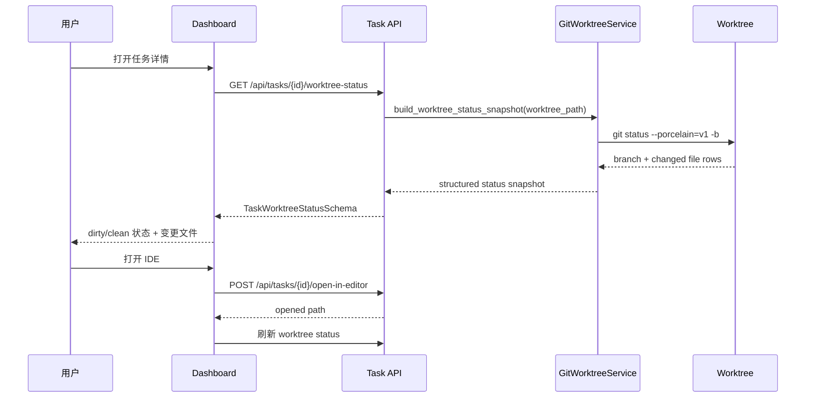

# PRD：Worktree 外部改动刷新

**原始需求：** Koda 创建 task worktree 后，用户通过 Koda 打开 IDE 并在 IDE 中继续修改代码，但 Koda 前端无法看到这些外部手动改动。
**AI 归纳名称：** 在 Koda dashboard 中检测并展示 task worktree 的外部 IDE 改动。
**日期：** 2026-05-05
**状态：** Pending

## 1. 背景与目标

Koda 已经负责创建 task worktree，并在任务上保存 `Task.worktree_path`。Dashboard 也可以用配置好的编辑器命令打开这个路径。但当前前端可见的任务状态主要来自数据库快照、DevLog 历史、task card metadata 和 branch-health 检查。用户从 Koda 打开 IDE 后，如果直接在 IDE 中修改这个 worktree，文件系统和 Git 工作区已经发生变化，但 dashboard 没有明确的 worktree 状态刷新入口。

这会形成一个状态不同步的问题：Koda 后续仍然可以 Complete 或 Resume 这个任务，但用户无法在前端看到 IDE 到底又改了哪些文件，也无法确认当前 worktree 是 clean 还是 dirty。

目标：

- 展示选中任务的 worktree 在外部 IDE 修改后是否存在未提交改动。
- 在任务详情 UI 中展示简洁的变更文件列表和最后扫描时间。
- 提供手动刷新 worktree 状态的按钮。
- 在打开 IDE 后、浏览器窗口重新获得焦点时，轻量刷新 worktree 状态。
- 复用现有 task route/service 结构和 Git worktree helper。
- 不为可从 `git status` 推导的数据新增持久化状态。

## 2. 需求形态

- **使用者：** 使用 Koda 管理 task worktree，同时在外部 IDE 中编辑该 worktree 的开发者。
- **触发条件：** 用户从 Koda 打开任务 worktree，在 IDE 中修改文件，然后回到 Koda dashboard 或点击刷新。
- **期望行为：** 选中任务详情展示基于当前 `worktree_path` 重新扫描得到的 worktree 状态快照，包括 dirty/clean 状态、变更文件、分支名、HEAD commit，以及 Git 状态不可读取时的错误说明。
- **明确范围边界：** 本功能只观察本地 worktree 状态。不提交代码、不 stage 文件、不运行测试、不解析完整 diff、不创建文件监听 daemon，也不把代码改动同步进数据库作为事实来源。

## 3. 仓库上下文与架构适配

当前相关模块和文件：

- `backend/dsl/api/tasks.py`
  - 负责任务详情、任务变更、PRD 文件读取和 `open-in-editor`。
  - 已经在任务 worktree 操作中解析 `Task.worktree_path` 并校验文件系统路径是否存在。
- `backend/dsl/services/task_service.py`
  - 从本地 Git/worktree 状态派生 `branch_health`。
  - 已体现“路由编排，服务层做 Git 探测”的边界。
- `backend/dsl/services/git_worktree_service.py`
  - 集中管理任务分支和 worktree 生命周期 helper。
  - 已包含基于 subprocess 的 Git helper 模式。
- `backend/dsl/schemas/task_schema.py`
  - 已有 `TaskBranchHealthSchema`，这是最接近本需求的“派生 Git 状态响应”模式。
- `frontend/src/api/client.ts`
  - 已包含 `taskApi.get(...)`、`taskApi.getPrdFile(...)`、`taskApi.openInEditor(...)` 和任务变更方法。
- `frontend/src/App.tsx`
  - 负责选中任务状态、任务详情渲染、dashboard 刷新和 IDE 打开操作。
- `frontend/src/utils/task_completion.ts`
  - 已有基于 task snapshot 推导前端动作可用性的工具函数模式。
- 现有测试：
  - `tests/test_tasks_api.py`
  - `frontend/tests/app_task_mutation_refresh.test.ts`
  - `frontend/tests/` 下的现有前端工具测试

现有路径：

```text
任务详情
  -> 用户点击 Open in Editor
  -> POST /api/tasks/{task_id}/open-in-editor
  -> 后端打开 Task.worktree_path
  -> 前端继续展示数据库和 task log 派生状态
```

目标路径：

```text
任务详情
  -> GET /api/tasks/{task_id}/worktree-status
  -> 后端在 Task.worktree_path 中执行只读 Git 探测
  -> 前端展示 dirty/clean 状态和变更文件
  -> 手动刷新、Open in Editor 后、窗口 focus 时刷新状态
```

可复用点：

- 复用 `Task.worktree_path` 作为唯一 worktree 路径来源。
- 复用 `tasks.py` 对 task-scoped 本地操作的路由归属。
- 复用 `GitWorktreeService` 做只读 Git 探测。
- 复用任务详情 action/button 样式和已有 dashboard refresh 模式。
- 复用前端 utility test 风格覆盖状态推导和排序。

架构约束：

- Route handler 只做校验、编排和响应映射；Git 命令细节放在 service 层。
- Worktree 状态是本机派生状态，不应作为持久化 task truth 存入数据库。
- Git 探测必须只读，并且命令参数要有边界。
- 如果本功能新增 Python 文件 I/O，必须显式使用 `encoding="utf-8"`；本功能预计不需要新增文件写入。
- 如果更新 dashboard/worktree 工作流文档，提交前必须运行并通过 `just docs-build`。

潜在重复风险：

- 不为 `git status` 输出新增数据库表。
- 不复制 branch-health 的分支存在性逻辑；分支和 HEAD 信息只作为 status snapshot 的上下文字段展示。
- 不在 React 中解析完整 `git diff`。
- 不为所有任务增加全局轮询；刷新范围限定为当前选中任务。

## 4. 推荐方案

### 推荐实现

新增一个 task-scoped、只读的 worktree status endpoint，并在选中任务详情面板中渲染该结果。

后端：

- 在 `backend/dsl/schemas/task_schema.py` 中新增 `TaskWorktreeStatusSchema` 和 `TaskWorktreeChangedFileSchema`。
- 在 `backend/dsl/services/git_worktree_service.py` 中新增 `GitWorktreeService.build_worktree_status_snapshot(worktree_path: Path)`。
- 在 `backend/dsl/api/tasks.py` 中新增 `GET /api/tasks/{task_id}/worktree-status`。
- 使用 `git -C <worktree> status --porcelain=v1 -b`、`git rev-parse --abbrev-ref HEAD` 和 `git rev-parse --short HEAD`。
- 对缺失 worktree path、目录不存在、非 Git 目录等常见本地状态问题返回结构化错误，而不是抛 500。

前端：

- 在 `frontend/src/api/client.ts` 中新增 `taskApi.getWorktreeStatus(id)`。
- 在 `frontend/src/types/index.ts` 中新增 TypeScript 类型。
- 在 `frontend/src/utils/worktree_status.ts` 中新增状态标签、dirty 文件计数和稳定展示排序 helper。
- 在 `frontend/src/App.tsx` 的选中任务详情中新增 worktree status panel。
- 以下时机刷新：
  - 选中任务变化；
  - 用户点击 `Refresh`；
  - `openInEditor` 成功；
  - document/window 重新获得焦点且选中任务存在 `worktree_path`。

为什么适合当前架构：

- 它扩展现有 task-scoped API，而不是创建平行的 worktree 子系统。
- 它把 Git status 保持为派生状态，与现有 `branch_health` 模型一致。
- 它解决前端 stale view，但不改变 Complete、Resume 或自动化执行语义。
- 它让用户明确看到 IDE 改动，同时保持 Git finalization 仍由后端负责。

### 已考虑的替代方案

| 替代方案 | 不推荐原因 |
| --- | --- |
| 把 worktree dirty 状态存入数据库 | 外部 IDE 改动后会立刻过期，除非再引入 watcher；同时会重复 Git 的事实来源。 |
| 新增文件系统 watcher daemon | 更实时，但会增加生命周期、跨平台和资源管理复杂度；当前问题不需要这么重。 |
| 持续轮询每个 active task | 更容易发现改动，但成本和噪音更高；选中任务刷新已覆盖主要用户工作流。 |
| 只展示 branch health | Branch health 检查分支/worktree 是否存在，不回答文件是否变更。 |
| 解析 `git diff` 并展示完整 patch | UI 面和风险都更大；首个目标状态展示 changed-file status 已足够。 |

## 5. 实施指南

### 核心逻辑

1. 后端路由：
   - 按 ID 加载 task。
   - task 不存在时返回 404。
   - `worktree_path` 为空时返回合法 status payload，`status="unavailable"`，并带说明文案。
   - 路径不存在时返回 `status="missing"`。
   - 其他情况调用 `GitWorktreeService.build_worktree_status_snapshot(...)`。

2. Git status 解析：
   - 执行 `git -C <path> status --porcelain=v1 -b`。
   - 单独解析第一行 `##` branch 信息。
   - 用两字符 XY 状态列和后续 path payload 解析文件行。
   - rename payload 保留为展示路径，不在首版中过度建模所有 Git 边缘格式。
   - 返回 `has_uncommitted_changes`、`changed_file_count`、`changed_files`、`branch_name`、`head_commit_hash`、`is_clean` 和 `scanned_at`。

3. 前端数据流：
   - 在 React 本地 state 中保存选中任务的 worktree status，并用 task ID 作为 key。
   - 选中任务变化时清理旧 status；如果任务有 `worktree_path`，则拉取新 status。
   - `openInEditor` 成功后立即刷新一次，并安排一次短延迟刷新。
   - window focus 时只刷新当前选中任务的 status。
   - Dashboard/task-list refresh 与这个派生本地状态刷新保持分离。

4. UI 行为：
   - Clean 状态：展示 branch/head 和“未检测到本地 worktree 改动”。
   - Dirty 状态：展示数量和带 Git status badge 的变更文件行。
   - Missing/unavailable/error：展示紧凑 warning 和后端返回的说明文案。
   - Loading：展示稳定的 skeleton 或 inline loading，不造成布局跳动。

### 影响文件

| 路径 | 预期变更 |
| --- | --- |
| `backend/dsl/schemas/task_schema.py` | 新增 worktree status 响应 schema。 |
| `backend/dsl/services/git_worktree_service.py` | 新增只读 status snapshot builder 和 porcelain parser。 |
| `backend/dsl/api/tasks.py` | 新增 `GET /{task_id}/worktree-status` route。 |
| `tests/test_git_worktree_service.py` 或现有 service 测试 | 覆盖 porcelain 解析、缺失路径和非 Git 路径。 |
| `tests/test_tasks_api.py` | 覆盖无 worktree、worktree 缺失、clean worktree、dirty worktree 的 API 响应。 |
| `frontend/src/types/index.ts` | 新增 worktree status interface。 |
| `frontend/src/api/client.ts` | 新增 `taskApi.getWorktreeStatus`。 |
| `frontend/src/utils/worktree_status.ts` | 新增 label/count/display helper。 |
| `frontend/tests/worktree_status.test.ts` | 覆盖工具函数行为。 |
| `frontend/src/App.tsx` | 新增选中任务 status state、刷新触发和 panel 渲染。 |
| `frontend/src/index.css` | 新增 status panel 样式。 |
| `docs/guides/dsl-development.md` | 记录 dashboard worktree status refresh 行为。 |
| `docs/architecture/system-design.md` | 记录本地 Git 派生状态的所有权。 |

### 变更矩阵

| 区域 | 当前行为 | 新行为 | 事实来源 |
| --- | --- | --- | --- |
| 外部 IDE 文件改动 | Koda 不可见，直到另一个 workflow 动作触碰 worktree | 通过选中任务 worktree status refresh 可见 | 本地 Git worktree |
| Task card 状态 | 由数据库、log、card metadata 驱动 | 不变 | 数据库 + DevLog |
| Branch health | 只检查 branch/worktree 是否存在 | 不变，可在 worktree status 附近展示 | 派生 Git 探测 |
| Worktree status | 无 task-scoped API | 新增只读 endpoint | `git status --porcelain` |
| 持久化 | 不存 dirty-state | 仍不存 dirty-state | 不适用 |

### 流程图



### 低保真原型

```text
+------------------------------------------------------+
| Worktree 状态                           刷新          |
| /Users/zata/.../koda-wt-1234                          |
| Branch task/1234-ui-sync        HEAD a1b2c3d          |
|                                                      |
| 检测到本地改动：3 个文件                              |
|  M  frontend/src/App.tsx                              |
|  A  frontend/src/utils/worktree_status.ts             |
|  ?? frontend/tests/worktree_status.test.ts            |
|                                                      |
| 最后扫描：2026-05-05 16:27:07                         |
+------------------------------------------------------+
```

### ER 图

不需要 ER 图。本功能不新增持久化数据模型。

### 交互原型变更记录

不需要新增交互原型文件。

### 外部验证

未使用 Web research。本 PRD 基于现有仓库代码和稳定的 Git CLI 行为。

## 6. 完成定义

- 选中任务详情能展示 clean、dirty、missing、unavailable 和 error worktree 状态。
- 外部 IDE 改动能在手动刷新、打开 IDE 后刷新、窗口 focus 刷新后可见。
- 后端 endpoint 是只读的，不修改 Git index、working tree、数据库 task 字段或 DevLog。
- Branch health 和 task workflow 语义保持不变。
- 文档说明 worktree status 是本机派生状态，不能通过数据库 snapshot restore 恢复。
- 回归测试覆盖后端解析/API 行为和前端展示推导。
- 提交前相关后端测试、前端定向测试、`npm run build` 和 `just docs-build` 通过。

## 7. 验收清单

### 架构验收

- [ ] `backend/dsl/api/tasks.py` 对 `GET /api/tasks/{task_id}/worktree-status` 只做路由编排。
- [ ] Git 命令执行和 porcelain 解析位于 `backend/dsl/services/git_worktree_service.py` 或同等 service-layer helper。
- [ ] 不新增数据库表、migration 或持久化 dirty-state 字段。
- [ ] 前端 status panel 消费新 API 响应，不直接执行 Git 命令。

### 依赖验收

- [ ] 本功能不新增 Python 或前端依赖。
- [ ] Git 探测使用现有 `subprocess.run` 模式，并使用有边界的命令参数。
- [ ] 如果新增 Python 文件 I/O，文本解码显式使用 `encoding="utf-8"`。

### 行为验收

- [ ] 没有 `worktree_path` 的任务返回 unavailable status payload，而不是 500。
- [ ] worktree 目录缺失时返回 missing status payload，并带用户可读说明。
- [ ] clean worktree 展示 branch/head 元信息，且不展示变更文件。
- [ ] dirty worktree 展示变更文件数量，并至少展示变更路径和两字符 Git status。
- [ ] 点击 `Open in Editor` 仍然打开配置的编辑器，并随后刷新可见 worktree status。
- [ ] 浏览器重新获得焦点时，只刷新选中任务的 worktree status。
- [ ] 手动点击 `Refresh` 会重新调用后端 status endpoint 并更新 panel。

### 文档验收

- [ ] `docs/guides/dsl-development.md` 说明 Koda 如何检测 task worktree 的外部 IDE 改动。
- [ ] `docs/architecture/system-design.md` 说明 worktree dirty state 是本地 Git 派生状态。
- [ ] 文档说明 WebDAV/database snapshot restore 不会恢复本地 worktree 内容或 status。

### 验证验收

- [ ] 后端测试覆盖 clean、dirty、missing、unavailable 和非 Git worktree 场景。
- [ ] 前端测试覆盖 dirty/clean label 推导和稳定的变更文件排序。
- [ ] 受影响后端测试通过。
- [ ] 相关前端测试通过。
- [ ] `npm run build` 通过。
- [ ] `just docs-build` 通过。

## 8. 用户故事

- 作为开发者，我希望在 IDE 中修改文件后，Koda 能显示选中任务 worktree 已经发生变化，这样我在 Complete 前可以信任 dashboard。
- 作为开发者，我希望看到 worktree 中哪些文件发生了变化，这样我可以决定继续编辑、运行测试还是完成任务。
- 作为开发者，我希望有一个手动刷新按钮，这样我在 IDE 保存文件后可以强制 Koda 重新检查 worktree。
- 作为开发者，我希望回到浏览器时 Koda 自动刷新，这样我不需要每次都手动刷新整个 dashboard。

## 9. 功能需求

- **FR-1：** 后端必须暴露 `GET /api/tasks/{task_id}/worktree-status`。
- **FR-2：** 任务 ID 不存在时，endpoint 必须返回 404。
- **FR-3：** 任务没有 `worktree_path` 时，endpoint 必须返回结构化 unavailable status。
- **FR-4：** `worktree_path` 不存在时，endpoint 必须返回结构化 missing status。
- **FR-5：** worktree 是有效 Git worktree 时，endpoint 必须返回从 `git status --porcelain=v1 -b` 解析出的变更文件。
- **FR-6：** 响应必须包含 `has_uncommitted_changes`、`changed_file_count`、`changed_files`、`branch_name`、`head_commit_hash`、`worktree_path`、`scanned_at`、`status` 和 `message`。
- **FR-7：** 前端必须新增 `taskApi.getWorktreeStatus(taskId)`。
- **FR-8：** 当任务存在或曾经进入 worktree-backed flow 时，选中任务详情必须渲染 worktree status panel。
- **FR-9：** Panel 必须支持手动刷新。
- **FR-10：** `openInEditor` 成功后，panel 必须刷新。
- **FR-11：** document/window 重新获得焦点且选中任务有 `worktree_path` 时，panel 必须刷新。
- **FR-12：** 实现不得改变 Complete、Manual Complete、Resume、Cancel 或 Force Interrupt 的后端语义。

## 10. 非目标

- 不自动 commit、stage、rebase 或运行测试。
- 不做完整 patch/diff viewer。
- 不新增文件系统 watcher daemon。
- 不为 worktree status 新增 WebSocket/SSE stream。
- 不全局轮询每个 task worktree。
- 不尝试从数据库 snapshot 重建 IDE 改动。
- 不做 worktree 备份/恢复功能。

## 11. 风险与后续

- 超大 dirty worktree 可能返回大量变更文件。Endpoint 应限制返回文件行数，并暴露 `changed_file_count`，保证 UI 稳定。
- Git porcelain 的 rename/copy 格式较复杂。首版应保留 display path payload，避免过度建模 rename 内部结构。
- 如果后续用户需要近实时、多任务状态刷新，可以再评估 watcher 或 SSE 设计；这不属于当前目标状态。

## 12. 决策记录

- 2026-05-05：选择只读 task-scoped endpoint，而不是数据库持久化，因为 worktree dirty state 是本地派生 Git 状态。
- 2026-05-05：选择选中任务刷新触发，而不是全局轮询，以匹配用户工作流并控制开销。
- 2026-05-05：选择 changed-file status，而不是完整 diff 展示，以解决可见性问题且不扩大 review UI 范围。
- 2026-05-05：选择保持 branch-health 独立，因为 branch 是否存在和文件是否 dirty 回答的是不同问题。
