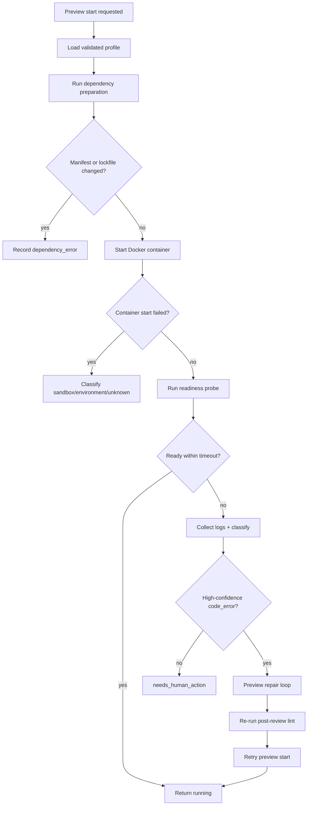

# PRD: Preview Sandbox Hardening And Auto-Repair

**Original Need:** 已有 managed Docker preview sandbox 已经能做 deterministic profile、AI read-only fallback、基础 start/stop/restart 和 Complete gating，但剩余的 failure classification、dependency mutation 防护、env allowlist、readiness check、View Logs 和 code-error auto-repair 还未落地，需要先沉淀为后续需求。
**AI-Normalized Name:** Harden preview sandbox execution, classification, and bounded auto-repair for task worktrees.
**Date:** 2026-05-06
**Status:** Pending

## 1. Introduction & Goals

当前 Koda 的 preview sandbox 已经能在多数前端任务上自动拉起，并对 deterministic `uncertain` 场景补一层 Codex read-only fallback。但它仍然缺少几块关键能力：

- 启动失败只保守归类为 `sandbox_error` 或 `unknown`
- 依赖安装是否修改 manifest / lockfile 还不可见
- 容器环境变量还没有显式 allowlist
- Docker `run` 成功并不等于应用真的 ready
- 任务详情还没有专门的 `View Logs`
- 代码型 preview 启动错误还没有 bounded auto-repair loop

这会带来两个实际问题。第一，当前 preview 能否运行更多依赖 Python / full-stack 项目，主要取决于 luck，而不是稳定的执行与判定。第二，系统虽然已经能阻止 unresolved preview failure 下的 `Complete`，但阻止后给用户的诊断和自愈能力还不够强。

目标：

- 把 preview startup failure 从“保守失败”提升为可解释、可复现、可分流的结构化分类。
- 增加 dependency mutation guard，防止 preview 安装步骤偷偷改写项目依赖事实。
- 增加显式 environment allowlist，只允许受控 env 注入容器。
- 在返回 `running` 前完成 bounded readiness / health verification。
- 在详情页提供 `View Logs`，并与当前 preview panel 连通。
- 对高置信 `code_error` 启动失败增加 bounded auto-repair loop，修复后必须重跑 lint 再重新尝试 preview。

## 2. Requirement Shape

- **Actor:** 使用 Koda 审阅 task worktree，并依赖 preview sandbox 做人工验收的开发者。
- **Trigger:** preview sandbox 已生成可执行 profile，但在 dependency install、container startup、readiness probe 或应用日志阶段失败；或者用户需要查看更具体日志。
- **Expected Behavior:** Koda 能把 preview failure 分成 dependency / environment / sandbox / code / unknown，向用户展示明确状态与日志；当 failure 被判定为高置信 `code_error` 时，系统执行有上限的自动修复闭环并在成功后重新 lint 与重启 preview；其他 failure 则等待人工重试、修环境或 bypass。
- **Explicit Scope Boundary:** 本 PRD 只增强现有 `backend/dsl/preview_sandboxes/` 路径，不重做 preview 架构，不新增独立任务阶段，不引入多容器 compose 编排，也不改变 current Complete / Git finalization 主链路。

## 3. Repository Context And Architecture Fit

当前最接近的 existing path：

- `backend/dsl/preview_sandboxes/application/use_cases.py`
  - 已负责 preview profile 校验、TaskArtifact 持久化、start/stop/restart/status、failure record 和 bypass gate。
  - 是本需求唯一正确的 orchestration 入口。
- `backend/dsl/preview_sandboxes/infrastructure/docker_preview_runtime.py`
  - 当前只做 `docker run`、端口映射、log tail 读取。
  - 这里最适合补 dependency mutation 检查、health probing、日志读取与运行时细节。
- `backend/dsl/services/codex_runner.py`
  - 已有 review / lint 阶段的 bounded AI repair loop。
  - 这是 preview `code_error` auto-repair 唯一值得复用的编排模型。
- `backend/dsl/services/runners/*`
  - 已有 codex / claude runner 抽象与 active runner 解析。
  - 若 preview repair 需要 runner 执行，应走这里，不应重写一套 CLI 封装。
- `frontend/src/App.tsx`
  - 已有 preview panel、Open Preview、Start/Restart/Stop/Diagnose/Confirm Bypass。
  - `View Logs`、更细状态文案、repair 中 loading 都应在此扩展。
- `frontend/src/api/client.ts` 与 `frontend/src/types/index.ts`
  - 已有 preview sandbox API contract，需要继续扩展 logs / richer status fields。
- `tests/test_preview_sandboxes.py`
  - 当前已覆盖 deterministic inference、AI fallback、runtime_lost、bypass 和 log sanitization。
  - 是本需求新增后端测试的主落点。
- `tests/test_codex_runner.py`
  - 适合补 preview code-error repair loop 的 orchestration 断言。
- `frontend/tests/app_task_mutation_refresh.test.ts`
  - 已覆盖 preview panel 基础行为，适合补 `View Logs` 和新状态。

可直接复用的架构模式：

- “runner 生成结构化结果 -> backend 验证 -> 再执行副作用”
- “lint/review failure 通过 DevLog 审计并由 use case 决定是否进入 human-action”
- “详情页 panel + task-scoped API + 局部轮询/刷新”

必须保持的边界：

- route handler 不能承载 preview failure classification 业务逻辑
- preview runtime 的 machine-local state 仍不能写进 `tasks` 主表
- 依赖安装与 health probing 只能发生在容器内部或 machine-local runtime helper 中
- preview auto-repair 不能绕过现有 post-review lint gate
- 非代码错误不能触发 AI 改代码

潜在冗余风险：

- 不要单独创建第二套 “preview repair runner service”
- 不要新建 preview-specific workflow stage
- 不要为日志再建单独数据库表，除非 bounded tail + DevLog 组合确实不够
- 不要为 env 注入单独做 project-level secret system，本 PRD 只做 allowlist config

## 4. Recommendation

### Recommended Approach

在现有 `preview_sandboxes` domain slice 内继续增强，而不是引入新子系统。建议把剩余能力分成 6 个同一路径内的增强点：

1. **Failure evidence collection**
   - 记录 dependency step、container start、readiness probe、health probe、log tail 的分阶段结果。
2. **Deterministic failure classification**
   - 基于 exit code、stderr、health timeout 和日志关键词先做 deterministic classify。
3. **Dependency mutation guard**
   - 在 dependency step 前后比较 manifest / lockfile 摘要，发现变更立即记为 `dependency_error`。
4. **Environment allowlist**
   - 新增 `KODA_PREVIEW_ALLOWED_ENV_KEYS`，只透传允许的环境变量。
5. **Readiness + View Logs**
   - 将 `docker run` 成功和 app truly ready 分开；详情页暴露专门日志查看入口。
6. **Bounded code-error auto-repair**
   - 只有当 deterministic / AI-assisted classify 明确为高置信 `code_error` 时，才进入有限轮数的 preview repair loop，并在 repair 后强制重跑 lint。

为什么这是当前架构的最佳路径：

- 当前 preview sandbox 已经形成稳定边界，继续往里填能力最小成本。
- `codex_runner.py` 已经有 review/lint repair 闭环，不需要再造第三套 AI orchestration。
- `TaskArtifact + DevLog + machine-local runtime` 的状态所有权已经明确，不必加表。
- 前端 preview panel 已存在，补 `View Logs` 和更细状态不会撕裂 UX。

### Alternatives Considered

| Alternative | Why Not Recommended |
| --- | --- |
| 新建 `preview_repair_service.py` 独立编排修复 | 会复制现有 `codex_runner.py` 的 runner/retry/logging 责任。 |
| 直接用 AI 读日志做端到端自由诊断 | 风险太高，先做 deterministic classify 更稳，也更可测试。 |
| 任何 preview 失败都触发 AI 改代码 | 会把环境、Docker、依赖问题误判为代码问题，风险不可接受。 |
| 把 dependency mutation 直接允许通过 | 会让 preview 改写项目依赖事实，破坏 lint 和 Git 收尾的可信性。 |
| 新建 preview_runs 表保存每次尝试 | 当前 machine-local + TaskArtifact + DevLog 足够；新增表只增加复杂度。 |

## 5. Implementation Guide

### Core Logic

1. **Runtime evidence expansion**
   - 在 `DockerPreviewRuntime.start(...)` 中把执行分解为：
     - dependency preparation
     - container startup
     - readiness polling
     - initial log capture
   - 返回更丰富的 runtime outcome，而不是只返回 container handle。

2. **Dependency mutation guard**
   - 对以下文件在 dependency step 前后做 hash snapshot：
     - `package.json`
     - `package-lock.json`
     - `pnpm-lock.yaml`
     - `yarn.lock`
     - `pyproject.toml`
     - `uv.lock`
     - `requirements.txt`
     - `poetry.lock`
   - 若 hash 变化，立即 stop/remove container 并标记 `dependency_error`。

3. **Readiness probe**
   - 在 profile 的 `healthcheck_path` / `preview_path` 基础上做 bounded HTTP probe。
   - 只有 probe 成功，状态才进入 `running`。
   - probe 超时按 evidence 分类到：
     - `code_error`
     - `environment_error`
     - `unknown`

4. **Failure classification**
   - 第一层 deterministic rules：
     - docker unavailable / permission denied / port conflict -> `sandbox_error`
     - manifest / lockfile changed -> `dependency_error`
     - missing env / connection refused to known upstream / auth bootstrap missing -> `environment_error`
     - app traceback / module import error / syntax error / missing route asset caused by code -> `code_error`
     - otherwise -> `unknown`
   - 第二层 optional AI classifier：
     - 只在 deterministic evidence 不足时触发
     - 只返回结构化分类 JSON，不允许自由文本结论直接改变代码

5. **Preview code-error auto-repair loop**
   - 仅在 high-confidence `code_error` 下触发
   - 最多 2 轮：
     - write DevLog preview failure evidence
     - 调用当前 active runner 执行 preview-fix prompt
     - 重跑 post-review lint
     - 再次尝试 preview start
   - 任一步失败则回到 `needs_human_action`

6. **View Logs**
   - 在现有 preview status API 中增加更明确的 `log_tail`
   - 或新增 `GET /api/tasks/{task_id}/preview-sandbox/logs`
   - 前端 panel 增加 `View Logs`，在 modal / expandable panel 中展示 bounded sanitized logs

### Affected Files

| 路径 | 预期改动 |
| --- | --- |
| `backend/dsl/preview_sandboxes/application/use_cases.py` | 增加 readiness / classification / repair orchestration。 |
| `backend/dsl/preview_sandboxes/infrastructure/docker_preview_runtime.py` | 增加 dependency mutation guard、env allowlist、health probe、richer outcome。 |
| `backend/dsl/preview_sandboxes/infrastructure/ai_preview_profile_generator.py` | 可能复用 JSON 提取方式做 failure classifier。 |
| `backend/dsl/prompts/templates/` | 新增 preview failure classification prompt、preview fix prompt。 |
| `backend/dsl/services/codex_runner.py` | 复用或扩展 runner phase execution，接入 preview repair loop。 |
| `backend/dsl/preview_sandboxes/api.py` | 可能新增 logs endpoint，扩展 diagnose / status response。 |
| `backend/dsl/preview_sandboxes/schemas.py` | 扩展 failure evidence、logs、repair state DTO。 |
| `utils/settings.py` | 增加 env allowlist、repair round limit、readiness timeout config。 |
| `frontend/src/App.tsx` | 新增 View Logs、repairing/loading 状态、细化 failure UI。 |
| `frontend/src/api/client.ts` | 新增 logs API 或扩展 preview status client。 |
| `frontend/src/types/index.ts` | 扩展 preview sandbox status type。 |
| `frontend/src/index.css` | logs UI 和 repair 状态样式。 |
| `tests/test_preview_sandboxes.py` | 补 dependency mutation、readiness timeout、classification、logs、auto-repair 断言。 |
| `tests/test_codex_runner.py` | 补 preview repair runner orchestration 断言。 |
| `frontend/tests/app_task_mutation_refresh.test.ts` | 补 View Logs 和 richer preview state。 |
| `docs/guides/dsl-development.md` | 更新 preview sandbox 剩余增强后的工作流。 |
| `docs/guides/codex-cli-automation.md` | 记录 preview repair 和 env allowlist。 |
| `docs/architecture/system-design.md` | 记录 classification / repair / runtime evidence 边界。 |
| `docs/dev/evaluation.md` | 增加新的 QA cases。 |

### Change Matrix

| Area | Current Behavior | Target Behavior | Source Of Truth |
| --- | --- | --- | --- |
| Dependency step | 仅执行受限 commands | 执行前后对依赖文件做 mutation guard | Runtime helper |
| Startup success | `docker run` 成功即近似成功 | 需通过 readiness/health probe 才算 `running` | Runtime helper + HTTP probe |
| Failure category | 主要是 `sandbox_error` / `unknown` | dependency / environment / sandbox / code / unknown | Use case classifier |
| Logs | 只有状态响应中的简短 `log_tail` | 可在 UI 中显式 `View Logs` | Runtime helper + API |
| Code repair | 未实现 | 高置信 `code_error` 才进入 bounded repair | `codex_runner.py` + preview use case |
| Complete gate | 只基于粗粒度 failure kind | 继续基于 refined non-code failure kind | Preview use case |

### Flow Diagram

### External Validation

No web research used. This PRD is based on repository state and the already-shipped preview sandbox behavior.

## 6. Definition Of Done

- Preview startup is not considered healthy until readiness verification succeeds.
- Preview dependency preparation cannot silently modify dependency manifests or lockfiles.
- Only explicitly allowlisted environment variables enter the preview container.
- Failure categories exposed to UI and Complete gate are materially more precise than current `sandbox_error` / `unknown` fallback.
- High-confidence `code_error` preview failures can enter a bounded repair loop that always reruns lint before a retry is accepted.
- Docs and QA steps are synchronized with the final shipped behavior.
- Existing preview sandbox, task completion, and runner flows continue to pass regression checks.

## 7. Acceptance Checklist

### Architecture Acceptance

- [ ] Preview hardening remains inside `backend/dsl/preview_sandboxes/` and `backend/dsl/services/codex_runner.py`; no parallel preview orchestration module is introduced without removing existing responsibility.
- [ ] Route handlers stay thin; failure classification and repair orchestration live in service/use-case code.
- [ ] Preview runtime state remains machine-local and is not persisted into the `tasks` main table.

### Behavior Acceptance

- [ ] Preview startup returns `running` only after readiness/health verification passes.
- [ ] `View Logs` is available from the preview panel when logs exist.
- [ ] Deterministic dependency/environment/sandbox/code/unknown classification is visible in preview status and DevLog audit.
- [ ] High-confidence `code_error` failures trigger at most the configured number of repair rounds.
- [ ] Any repair-modified code path reruns post-review lint before preview is treated as ready again.
- [ ] Non-code failures do not trigger AI code edits.

### Dependency And Environment Acceptance

- [ ] If dependency setup changes `package.json`, `package-lock.json`, `pnpm-lock.yaml`, `yarn.lock`, `pyproject.toml`, `uv.lock`, `requirements.txt`, or `poetry.lock`, preview stops and is classified as `dependency_error`.
- [ ] Preview containers receive environment variables only through an explicit allowlist such as `KODA_PREVIEW_ALLOWED_ENV_KEYS`.
- [ ] Host `.env` files, SSH keys, Git credentials, and user home directories are not automatically mounted or copied.

### API Acceptance

- [ ] Preview API exposes enough structured evidence for UI messaging and logs without leaking unsafe raw output.
- [ ] `GET /api/tasks/{task_id}/preview-sandbox` or a dedicated logs endpoint returns bounded sanitized logs for `View Logs`.
- [ ] `POST /api/tasks/{task_id}/preview-sandbox/diagnose` can refine failure classification from collected runtime evidence.

### Documentation Acceptance

- [ ] `docs/guides/dsl-development.md` documents readiness verification, dependency mutation guard, and repair behavior.
- [ ] `docs/guides/codex-cli-automation.md` documents preview repair trigger conditions and allowlist env policy.
- [ ] `docs/architecture/system-design.md` documents preview evidence ownership and repair boundaries.
- [ ] `docs/dev/evaluation.md` contains QA cases for dependency mutation, readiness timeout, code-error repair, and View Logs.

### Validation Acceptance

- [ ] `uv run pytest tests/test_preview_sandboxes.py tests/test_tasks_api.py tests/test_codex_runner.py -q` passes.
- [ ] `node --experimental-strip-types --experimental-specifier-resolution=node tests/app_task_mutation_refresh.test.ts` passes.
- [ ] `node --experimental-strip-types --experimental-specifier-resolution=node tests/task_completion.test.ts` passes.
- [ ] `npm --prefix frontend run build` passes.
- [ ] `just docs-build` passes.
- [ ] `git diff --check` is clean.

## 8. User Stories

1. As a developer, I want preview startup failures to say whether the problem is code, dependency, environment, or sandbox so I know whether to wait for AI, fix my machine, or bypass.
2. As a developer, I want Koda to reject preview dependency setup that rewrites manifest or lockfile state so preview does not secretly change my task deliverable.
3. As a developer, I want `running` to mean the app is actually reachable, not just that Docker launched.
4. As a developer, I want to open recent preview logs directly in the task detail panel when startup fails.
5. As a developer, I want obvious code-level preview failures to retry through a bounded AI repair loop so I do not have to manually restart after every small startup bug.

## 9. Functional Requirements

- **FR-1:** Koda must compare dependency manifest / lockfile fingerprints before and after preview dependency setup.
- **FR-2:** Koda must classify dependency-file mutation during preview setup as `dependency_error` and stop further preview startup.
- **FR-3:** Koda must pass container environment variables only through an explicit allowlist.
- **FR-4:** Koda must verify preview readiness before returning `running`.
- **FR-5:** Koda must expose bounded sanitized preview logs to the task detail UI.
- **FR-6:** Koda must classify preview failures into `code_error`, `dependency_error`, `environment_error`, `sandbox_error`, or `unknown`.
- **FR-7:** Koda must trigger preview auto-repair only for high-confidence `code_error`.
- **FR-8:** Koda must rerun post-review lint after any preview auto-repair that changes files.
- **FR-9:** Koda must never auto-repair dependency, environment, sandbox, or unknown failures.
- **FR-10:** Koda must keep existing Complete gating semantics while using the refined preview failure classification.

## 10. Non-Goals

- No new preview workflow stage.
- No multi-container Docker Compose support.
- No remote/public preview URL.
- No arbitrary env pass-through.
- No full Docker reconciliation persistence across backend restarts.
- No broad AI free-form diagnosis that can directly mutate code without structured classification.

## 11. Risks And Follow-Ups

- Keyword-based classification may still misclassify some app-specific failures; AI-assisted classification should remain a fallback, not the first classifier.
- Readiness probing may need per-framework tuning for long cold-start projects.
- Code-error repair can increase runtime and log volume; round limits and timeouts must stay conservative.

## 12. Decision Log

- Continue extending the existing `preview_sandboxes` domain slice instead of creating a second preview orchestration subsystem.
- Treat dependency mutation during preview setup as a failure, not as an acceptable side effect.
- Keep readiness verification in runtime/application code rather than front-end polling heuristics.
- Reuse existing runner repair patterns from `codex_runner.py` for preview code-error repair.
- Keep preview runtime state machine-local; do not expand database persistence for this follow-up scope.
