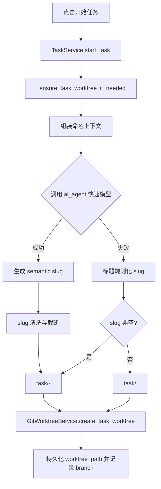

# PRD：开始任务时生成语义化 Worktree 分支命名

**原始需求标题**：修改worktree的命名
**需求名称（AI 归纳）**：开始任务时基于 AI 快速模型生成可辨识的 Worktree 分支名
**文件路径**：`tasks/prd-dd8796cb.md`
**创建时间**：2026-03-26 23:47:47 CST
**需求背景/上下文**：当前任务 worktree 分支名主要由随机短 ID 构成（如 `task/1234abcd`），辨识度低；期望在点击“开始任务”时调用 `ai_agent` 能力，使用快速模型生成更可读的命名。
**附件输入检查**：本次上下文未出现 `Attached local files:` 段落。

---

## 1. Introduction & Goals

### 背景

当前分支命名逻辑在 `GitWorktreeService.build_task_branch_name(task_id)` 中固定为 `task/{task_id[:8]}`，可保证唯一性，但缺少语义信息，导致：

- 任务并行时，仅靠分支名难以快速识别需求主题。
- `git branch`、`git worktree list`、日志排查时的人类可读性较差。
- 与“点击开始任务后自动生成 PRD/执行链路”的智能化体验不一致。

同时，仓库已具备 `ai_agent/utils/model_loader.py` 与 `ai_agent/utils/models.json`，可作为“快速模型命名”的能力基础。

### 可衡量目标

- [ ] 点击“开始任务”（`start_task`）后，新建 task 分支名包含语义 slug，而不再仅为随机短 ID。
- [ ] 分支命名仍保留 task short id，保证唯一性与可追溯性。
- [ ] 当模型不可用（无 key、超时、返回非法文本）时，系统自动回退到确定性命名，不阻塞任务启动。
- [ ] 现有 worktree 创建、完成合并与清理流程保持兼容，不引入 Git 收尾回归。
- [ ] 新行为有自动化测试覆盖，并补齐文档说明。

## 1.1 Clarifying Questions

以下问题无法仅靠现有代码唯一确定。本 PRD 默认按推荐选项落地。

1. 语义命名应用范围应是什么？
A. 仅修改 task 分支名
B. 同时修改 task 分支名与 worktree 目录名
C. 只改前端展示文案，不改真实分支名
> **Recommended: A**（用户痛点是“worktree 分支名辨识度低”；优先改分支可最小风险落地，且不触碰目录路径契约。）

2. 分支最终命名格式应是什么？
A. `task/<short_id>`
B. `task/<short_id>-<semantic-slug>`
C. `<semantic-slug>-<short_id>`
> **Recommended: B**（兼容现有 `task/` 前缀语义，同时增加可读信息，并保留 short id 便于定位任务。）

3. “快速模型”调用失败时策略应是什么？
A. 任务启动失败并提示用户重试
B. 自动回退到规则化 slug（由标题归一化）
C. 自动回退到旧格式 `task/<short_id>`
> **Recommended: B + C**（先用标题归一化；若仍为空再回退旧格式，保证稳定且不中断启动。）

4. 命名语言规范应是什么？
A. 保留多语言原文（可能含空格、中文、符号）
B. 统一转英文/ASCII slug（小写+连字符）
C. 允许任意字符，由 Git 自行兜底
> **Recommended: B**（最稳妥，减少 shell 与脚本兼容问题，便于跨平台与后续自动化处理。）

5. 语义 slug 主要输入源是什么？
A. 只用 task title
B. title + requirement_brief + 最近关键上下文
C. 人工手填
> **Recommended: B**（命名质量更好，同时不改变用户交互路径。）

## 2. Implementation Guide

### 2.1 Core Logic

建议新增“分支命名生成”阶段，并在 `start_task -> _ensure_task_worktree_if_needed` 中接入：

1. 收集命名上下文：`task_title`、`requirement_brief`（可选）、最近摘要文本（可选）。
2. 调用 `ai_agent` 快速模型生成 `semantic_slug`（仅短词组，不含前缀）。
3. 对模型输出做强约束归一化：
   - 转小写
   - 非 `[a-z0-9-]` 字符替换为 `-`
   - 连续 `-` 合并
   - 去首尾 `-`
   - 截断到长度上限（如 40）
4. 组装最终分支名：`task/{task_short_id}-{semantic_slug}`。
5. 回退链路：
   - 模型失败 -> 标题规则化 slug
   - 标题规则化为空 -> 旧格式 `task/{task_short_id}`
6. `GitWorktreeService.create_task_worktree(...)` 使用最终分支名创建 worktree。
7. 启动日志明确记录：最终分支名、命名来源（AI/规则回退/旧格式回退）。

### 2.2 Change Matrix

| Change Target | Current State | Target State | How to Modify | Affected Files |
|---|---|---|---|---|
| 分支命名策略 | 固定 `task/{task_id[:8]}`，无语义 | `task/{short_id}-{semantic_slug}`，失败可回退 | 在服务层新增命名生成器与标准化规则 | `dsl/services/git_worktree_service.py`, `dsl/services/task_service.py` |
| AI 命名能力接入 | worktree 创建前无 AI 命名步骤 | start_task 时可调用 `ai_agent` 快速模型生成 slug | 新增命名调用封装，隔离模型调用失败 | `dsl/services/worktree_branch_naming_service.py`（新增）, `ai_agent/utils/model_loader.py`（按需复用） |
| create_task_worktree 参数合同 | 仅接收 `task_id`，内部自行拼 branch | 支持显式传入 branch name（或命名结果对象） | 扩展命令规格与调用入口，避免重复生成 | `dsl/services/git_worktree_service.py` |
| 自动化测试 | 仅覆盖旧命名 `task/12345678` | 覆盖 AI 命名成功/失败/回退/字符清洗 | 新增单测并更新旧断言 | `tests/test_git_worktree_service.py`, `tests/test_task_service.py` |
| 文档合同 | 未说明语义命名与回退策略 | 明确“开始任务时分支命名规则”和降级行为 | 更新自动化与架构文档 | `docs/guides/codex-cli-automation.md`, `docs/architecture/system-design.md` |

### 2.3 Flow Diagram

### 2.4 数据与状态变更

本需求不引入数据库 schema 变更。

- `Task` 表保持不变。
- `Task.worktree_path` 语义保持不变。
- 变更集中在“分支名生成逻辑”和“日志可观测字段”。

### 2.5 兼容性约束

- 保持 `task/` 前缀不变，避免影响现有脚本和人工习惯。
- 不改变 `../task/<repo>-wt-<task_short_id>` 默认目录命名（本期非目标）。
- `complete` 阶段以当前检出的分支名做 merge/cleanup，不依赖旧的纯 short id 命名。

## 3. Global Definition of Done (DoD)

- [ ] 点击“开始任务”后，新建分支名默认为 `task/<short_id>-<semantic-slug>`。
- [ ] 模型失败时可自动回退，不阻塞 `start_task`。
- [ ] 回退链路可通过日志区分（AI 命名 vs 规则回退 vs 旧格式回退）。
- [ ] `uv run pytest tests/test_git_worktree_service.py -v` 通过。
- [ ] `uv run pytest tests/test_task_service.py -v` 通过。
- [ ] 若更新文档导航或内容，`just docs-build` 通过。
- [ ] 完成阶段 merge + cleanup 在语义分支名下无回归。

## 4. User Stories

### US-001：作为任务执行者，我希望分支名一眼可识别

**Description:** As a developer, I want each task branch to include semantic context so that I can quickly identify what the branch is for.

**Acceptance Criteria:**
- [ ] 分支名包含任务 short id 与语义 slug
- [ ] 同时创建多个任务时，`git branch` 可快速区分主题

### US-002：作为系统维护者，我希望命名失败时不中断任务

**Description:** As an operator, I want a deterministic fallback when model naming fails so that task start remains reliable.

**Acceptance Criteria:**
- [ ] AI 命名失败不抛出致命错误
- [ ] 仍可创建 worktree 并进入 PRD 生成阶段

### US-003：作为代码维护者，我希望命名规则可测试

**Description:** As a maintainer, I want naming behavior encoded in tests so future refactors do not break branch conventions.

**Acceptance Criteria:**
- [ ] 有 slug 规范化单测（字符、长度、空值）
- [ ] 有 start_task 集成路径测试（成功与回退）

## 5. Functional Requirements

1. **FR-1**：系统必须在任务启动创建 worktree 前生成语义分支名。
2. **FR-2**：默认分支格式必须为 `task/<task_id[:8]>-<semantic_slug>`。
3. **FR-3**：`semantic_slug` 必须经过可重复的规范化规则（小写 ASCII、连字符、长度限制）。
4. **FR-4**：当快速模型不可用或输出非法时，必须自动回退到标题规则化 slug。
5. **FR-5**：当标题规则化仍失败时，必须回退到 `task/<task_id[:8]>`，保证创建流程可继续。
6. **FR-6**：`GitWorktreeService.create_task_worktree` 必须支持接收外部传入 branch name，避免内部重复推导。
7. **FR-7**：分支命名来源（AI/回退）必须可观测并写入日志。
8. **FR-8**：该变更不得破坏现有完成阶段的 merge 与 cleanup 流程。
9. **FR-9**：新增/变更代码必须符合现有 Python 代码规范（类型注解、Google 风格 docstring、UTF-8 I/O 显式声明）。

## 6. Non-Goals

- 不在本期新增 UI 让用户手工编辑分支名。
- 不改变 worktree 目录路径命名规则。
- 不引入数据库字段持久化保存“AI 命名原始结果”。
- 不改动 PRD 文件命名规则（`tasks/prd-<task_short_id>*`）。

## 7. Risks & Mitigations

- 风险：模型返回含非法字符或超长文本。
  缓解：统一 slug 清洗+截断，保证输出分支名始终可用。

- 风险：外部模型服务波动导致启动链路不稳定。
  缓解：超时快速失败 + 本地规则回退，确保任务可启动。

- 风险：分支名变化影响历史脚本或断言。
  缓解：保留 `task/` 前缀与 short id；同步更新测试与文档契约。

## 8. Rollout Plan

1. 先在服务层引入命名生成器并保持默认开关可控（建议 `WORKTREE_BRANCH_AI_NAMING_ENABLED=true`）。
2. 在测试环境验证 3 类路径：AI 成功、AI 失败回退、标题为空回退。
3. 更新文档并灰度启用；观察一周任务启动成功率与分支可读性反馈。
4. 如稳定，再将该策略作为默认行为。
