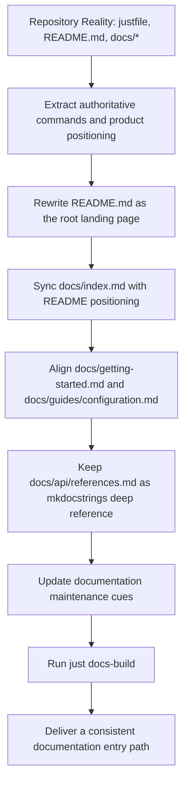

# PRD：更新 README 与项目文档

**文件路径**：`tasks/prd-e2a926f5.md`  
**创建时间**：`2026-03-19 01:24:19 +0800`  
**需求标题**：`update docs and readme`  
**需求上下文**：`update docs and readme`  
**参考文件**：`README.md`, `docs/index.md`, `docs/getting-started.md`, `docs/guides/configuration.md`, `docs/api/references.md`, `docs/architecture/system-design.md`, `justfile`, `mkdocs.yml`

---

## 0. 澄清问题（按现有仓库模式给出推荐默认值）

以下问题是 `/prd` workflow 要求的关键澄清项。由于当前任务要求直接生成 PRD，本文先按推荐默认值起草，后续若产品或维护者希望扩大范围，可在此基础上修订。

### 0.1 `README.md` 在本仓库中的角色应是什么？

A. 仓库入口页，只负责说明项目定位、快速启动、目录地图和文档导航  
B. 完整操作手册，把 MkDocs 站点里的内容大段复制进来  
C. 保留“通用 Python 模板”定位，只在下方追加 DSL/Koda 补丁说明

> **Recommended: A**  
> `docs/index.md`、`docs/getting-started.md` 和 `docs/guides/configuration.md` 已经承担站内深度说明；`README.md` 当前仍保留模板时期叙事，最合理的做法是把它收敛为仓库入口，而不是继续承担双重身份。

### 0.2 安装与启动命令的单一事实来源应是什么？

A. 以 `justfile` 和 `docs/getting-started.md` 为准，README 只做摘要同步  
B. 以当前 `README.md` 的命令块为准  
C. 允许不同页面各写一套命令，只要大致可运行即可

> **Recommended: A**  
> `justfile` 已明确定义 `just dsl-dev`、`just docs-build`、`just dev` 等真实入口，`docs/getting-started.md` 已按这些命令组织 onboarding。README 应引用同一套事实，避免再出现 `uv pip install` 与 `uv sync` 并存的漂移。

### 0.3 本次“update docs and readme”的默认范围应是什么？

A. 修正 README 与核心 MkDocs 页面中的定位、启动方式、文档导航和维护约定，不做整站重写  
B. 重写 `docs/` 下所有页面  
C. 只改 `README.md`，不处理站内文档漂移

> **Recommended: A**  
> 当前最明显的问题是入口叙事和命令说明失真，而不是所有技术文档都失效。优先修复 `README.md`、`docs/index.md`、`docs/getting-started.md`、`docs/guides/configuration.md` 这一条主链路，收益最高、风险最低。

### 0.4 API 与对象级参考文档应如何处理？

A. 保持 `docs/api/references.md` 作为 `mkdocstrings` 驱动的深度参考，README 只给导航链接  
B. 在 README 中重复罗列所有路由与对象成员  
C. 移除 API 参考页，只保留口头说明

> **Recommended: A**  
> `docs/api/references.md` 已明确采用 `mkdocstrings`，这与仓库的文档规范一致。README 应做发现入口，而不是复制对象级说明，否则后续最容易再次失同步。

### 0.5 文档类需求的默认验证标准应是什么？

A. 至少执行 `just docs-build`，并手工检查 README 中的关键命令与链接  
B. 只看 Markdown 是否能渲染  
C. 不做验证，合并后再补

> **Recommended: A**  
> `justfile` 已把 `uv run mkdocs build --strict` 封装为 `just docs-build`，且仓库约定要求文档与代码同级对待。文档更新如果不经过严格构建，很容易在导航、链接或 Mermaid 配置上留下回归。

以下 PRD 按推荐选项 A / A / A / A / A 起草。

---

## 1. 背景与目标

当前仓库存在明显的文档入口漂移：

- `README.md` 仍以 “Zata Codes Template” 和通用 Python 骨架为主叙事，保留了模板时期的 hooks / utils 填充说明
- `docs/index.md` 与 `docs/architecture/system-design.md` 已把仓库定义为 Koda / DevStream Log 开发工作台
- `docs/getting-started.md` 与 `justfile` 已形成相对真实的启动路径，但 README 里的安装命令和信息架构尚未同步
- `docs/api/references.md` 已经是结构化 API 参考入口，但根目录入口没有把它明确暴露给首次接手项目的开发者

这会导致两个直接问题：

1. 新接手项目的人从仓库根目录进入时，先看到的是过时定位，而不是当前真实产品边界。  
2. 文档主链路没有被设计成“README 负责入口，MkDocs 负责深度”，所以维护者很容易在多个页面上各写一套命令和说明。

### 目标

- [ ] 将 `README.md` 改造成面向 Koda / DevStream Log 的真实仓库入口页，而不是模板残留说明
- [ ] 统一 README 与 MkDocs 核心页面中的安装、启动、常用命令和本地地址描述
- [ ] 明确“README 负责入口导航，`docs/` 负责深度说明，`docs/api/references.md` 负责对象级参考”的分层
- [ ] 把文档同步与 `just docs-build` 验证规则暴露到维护者可见的位置，降低后续再次漂移的概率

---

## 2. 实现指南（技术规格）

### 核心逻辑

本需求不是单纯“润色几段文案”，而是要为仓库建立稳定的文档分层：

1. **命令事实来源** 以 `justfile` 和现有 `docs/getting-started.md` 为准。README 不能再维护另一套启动流程。  
2. **产品定位来源** 以 `docs/index.md` 与 `docs/architecture/system-design.md` 为准。README 需要与其对齐，而不是继续保留模板叙事。  
3. **对象级参考来源** 继续由 `docs/api/references.md` 承担，避免在 README 或概览页复制 `mkdocstrings` 内容。  
4. **维护约定** 应同时出现在根目录入口和站内概览页，让贡献者一眼知道“改代码时要同步改文档，并跑 `just docs-build`”。  

推荐实施路径：

1. 先重写 `README.md` 的标题、摘要、快速开始、项目结构和“继续阅读”部分  
2. 再同步 `docs/index.md`、`docs/getting-started.md`、`docs/guides/configuration.md` 中与 README 直接重叠的命令与入口表述  
3. 保持 `docs/api/references.md` 的技术角色不变，只增强从 README / docs 首页到它的可发现性  
4. 若更新涉及页面标题或新增页面，再同步修改 `mkdocs.yml`；若仅调整正文，则避免不必要的导航重构  
5. 最后通过 `just docs-build` 验证整个站点在严格模式下仍可通过

### 2.1 Change Matrix

| Change Target | Current State | Target State | How to Modify | Affected Files |
|---|---|---|---|---|
| Repository positioning at root entry | `README.md` 仍以通用模板和工具骨架为主，Koda/DSL 只像附加说明 | `README.md` 成为面向 Koda / DevStream Log 的统一入口页 | 重写标题、项目简介、核心能力与仓库定位；删除或改写模板时期的失真段落 | `README.md` |
| Quick start and daily commands | README 与站内文档并存多套命令表述；真实命令集中在 `justfile` 与 `docs/getting-started.md` | 所有 onboarding 命令统一指向 `uv sync`、前端依赖安装、`just dsl-dev`、`just docs-build` | 以 `justfile` 为单一事实源，调整 README 与 `docs/getting-started.md`、`docs/guides/configuration.md` 的命令块与说明文本 | `README.md`, `docs/getting-started.md`, `docs/guides/configuration.md` |
| Documentation map and cross-links | README 对站内文档的导流弱，当前更像孤立文本；`docs/index.md` 也没有把 README 视为根入口的一部分 | 用户可以从 README 明确跳转到概览、快速开始、配置、Codex 自动化和 API 参考 | 在 README 增加“文档地图 / 下一步阅读”，必要时在 `docs/index.md` 强化根入口与站内入口的职责边界 | `README.md`, `docs/index.md` |
| Documentation maintenance expectations | 文档同步和构建要求主要出现在 `docs/index.md` 与工程约定中，根目录入口不够显眼 | README 与站内概览都明确要求变更命令、工作流、配置时同步更新文档，并执行严格构建 | 在 README 和相关指南中增加简明维护规则，避免贡献者忽略文档变更义务 | `README.md`, `docs/index.md`, `docs/guides/dsl-development.md` |
| API reference discoverability | `docs/api/references.md` 已存在，但没有成为根目录文档路径中的显式一环 | README 和文档概览把 API 参考作为标准深链，且不在别处重复对象级说明 | 增强入口链接；保留 `mkdocstrings` 作为唯一对象级参考实现 | `README.md`, `docs/index.md`, `docs/api/references.md` |

### 2.2 Flow Diagram



### 2.3 Low-Fidelity Prototype

```text
README.md
┌─────────────────────────────────────────────────────────────┐
│ Koda / DevStream Log                                       │
│ 一句话说明：这是什么、适合谁、解决什么问题                  │
├─────────────────────────────────────────────────────────────┤
│ Quick Start                                                │
│ 1. uv sync                                                 │
│ 2. cd frontend && npm install                              │
│ 3. just dsl-dev                                            │
│ 4. just docs-build                                         │
├─────────────────────────────────────────────────────────────┤
│ Project Map                                                │
│ dsl/ | frontend/ | docs/ | ai_agent/ | tasks/              │
├─────────────────────────────────────────────────────────────┤
│ Docs Map                                                   │
│ - 概览                                                     │
│ - 快速开始                                                 │
│ - 配置说明                                                 │
│ - Codex 自动化                                             │
│ - API 参考                                                 │
├─────────────────────────────────────────────────────────────┤
│ Contribution / Docs Maintenance                            │
│ 改命令、配置、工作流时同步更新 docs，并执行 just docs-build │
└─────────────────────────────────────────────────────────────┘

MkDocs Landing (`docs/index.md`)
┌─────────────────────────────────────────────────────────────┐
│ 项目真实边界与模块说明                                      │
│ 深链到 Getting Started / Configuration / Automation / API  │
└─────────────────────────────────────────────────────────────┘
```

### 2.4 ER Diagram

本需求**不涉及数据库表结构、字段、实体关系或持久化状态结构变化**，因此不需要新增 Mermaid `erDiagram`。

需要明确的是：

- 变更对象是 `README.md`、`docs/` 内容和必要时的 `mkdocs.yml` 导航
- 业务代码、数据库 schema、Pydantic/ORM 模型不应因本需求发生结构性变更

### 2.8 Interactive Prototype Change Log

No interactive prototype file changes in this PRD.

### 2.9 Interactive Prototype Link

Not applicable. This requirement does not introduce or modify an interactive prototype page.

---

## 3. Global Definition of Done（DoD）

- [ ] `README.md` 不再把仓库描述为通用模板，而是准确说明 Koda / DevStream Log 的定位与主要能力
- [ ] README 中的安装、启动、文档构建命令与 `justfile`、`docs/getting-started.md` 保持一致
- [ ] `docs/index.md`、`docs/getting-started.md`、`docs/guides/configuration.md` 中与 README 重叠的入口信息已同步
- [ ] README 提供清晰的“下一步阅读”导航，至少覆盖概览、快速开始、配置说明、Codex 自动化、API 参考
- [ ] 对象级 API 说明仍由 `docs/api/references.md` 统一承载，没有在 README 中手工复制
- [ ] 文档维护约定明确要求：工作流、命令、配置、路径规则变化时同步更新文档
- [ ] 若本次修改引入页面新增、重命名或路径变化，则 `mkdocs.yml` 已同步更新；若未引入，则导航保持稳定
- [ ] `just docs-build` 通过，且未引入新的失效链接或严格模式警告
- [ ] 手工按照 README 的 Quick Start 执行时，能明确知道前端、后端和健康检查地址

---

## 4. User Stories

### US-001：首次接手项目的人能从 README 正确认知仓库

**Description:** 作为首次接手仓库的开发者，我希望在打开根目录时就能看到当前项目的真实定位和主能力，而不是模板历史残留，这样我能快速判断这个仓库是做什么的。

**Acceptance Criteria:**
- [ ] README 标题、简介和能力概述反映 Koda / DevStream Log，而不是“通用 Python 模板”
- [ ] README 不再把模板期 hooks / utils 填充建议作为核心内容
- [ ] README 中至少列出任务工作台、Codex 自动化、文档站点这三类核心能力

### US-002：新开发者能按同一套命令完成安装与启动

**Description:** 作为新开发者，我希望 README 与站内文档使用同一套命令和端口说明，这样我不用在多个页面之间猜哪一份才是最新的。

**Acceptance Criteria:**
- [ ] README 使用与 `justfile` 一致的命令名
- [ ] README、`docs/getting-started.md`、`docs/guides/configuration.md` 对 `uv sync`、前端依赖安装、`just dsl-dev`、`just docs-build` 的描述一致
- [ ] README 明确列出 `http://localhost:5173`、`http://localhost:8000`、`http://localhost:8000/health`
- [ ] 旧的、容易误导的命令或表述被删除，或被明确改写为当前项目上下文

### US-003：维护者能从根目录快速跳转到正确的深度文档

**Description:** 作为维护者，我希望 README 能告诉我“接下来该去哪一页看细节”，这样我不会把 README 写成一份重复又过时的大杂烩。

**Acceptance Criteria:**
- [ ] README 提供到 `docs/index.md`、`docs/getting-started.md`、`docs/guides/configuration.md`、`docs/guides/codex-cli-automation.md`、`docs/api/references.md` 的清晰导航
- [ ] 站内概览页继续承担详细上下文说明，不把所有内容挤进 README
- [ ] API 对象级说明仍集中在 `mkdocstrings` 页面，而不是分散复制到多个 Markdown 文件

### US-004：文档维护规则可见且可验证

**Description:** 作为贡献者，我希望仓库入口就能告诉我文档同步和构建要求，这样我在改命令、配置或工作流时不会忘记同步更新文档。

**Acceptance Criteria:**
- [ ] README 或站内概览页明确写出“业务逻辑、命令、配置变化时同步更新 docs”
- [ ] README 或相关指南明确写出 `just docs-build` 是提交前验证项
- [ ] 若后续新增文档页面，本次 PRD 定义了同时更新 `mkdocs.yml` 的要求

---

## 5. Functional Requirements

1. **FR-1:** `README.md` 必须用当前产品定位替换过时的模板叙事，并明确说明仓库是 Koda / DevStream Log 开发工作台。  
2. **FR-2:** README 必须包含最小可执行的本地启动路径，至少覆盖 `uv sync`、`cd frontend && npm install`、`just dsl-dev`。  
3. **FR-3:** README 必须列出本地运行后可访问的前端、后端和健康检查地址。  
4. **FR-4:** README 必须提供项目结构摘要，至少覆盖 `dsl/`、`frontend/`、`docs/`、`ai_agent/`、`tasks/` 等关键目录。  
5. **FR-5:** README 必须提供文档地图，至少链接到概览、快速开始、配置说明、Codex 自动化、API 参考。  
6. **FR-6:** `docs/index.md` 必须与 README 对齐项目定位，并承担站内总览角色，而不是与 README 讲述冲突的项目故事。  
7. **FR-7:** `docs/getting-started.md` 与 `docs/guides/configuration.md` 必须与 README 使用同一套命令名称和描述，不得继续保留相互冲突的 onboarding 说明。  
8. **FR-8:** `docs/api/references.md` 继续作为对象级与 API 级参考的唯一权威页面；README 和概览页只能链接，不应复制成员级说明。  
9. **FR-9:** 文档维护规则必须明确规定：当工作流、函数签名、环境变量、命令或路径规范变化时，需要同步更新相关文档。  
10. **FR-10:** 文档改动完成后必须通过 `just docs-build`，确保 MkDocs 严格模式构建成功。  
11. **FR-11:** 若本次实现新增页面、修改页面标题或调整文档路径，必须同步更新 `mkdocs.yml` 的 `nav`；若未新增或重命名页面，则不做无意义的导航改动。  
12. **FR-12:** 本次文档修订必须删除、压缩或重写那些已不符合当前仓库现实的模板残留段落，避免“旧模板 + 新项目说明”继续并存。  

---

## 6. Non-Goals

- 不在本期重写 `docs/` 下全部页面，只处理与 README 主链路强相关且存在漂移的核心页面
- 不在本期修改 FastAPI、React、数据库或 Codex 自动化的业务实现
- 不在本期手工重写 `docs/api/references.md` 为静态 API 手册
- 不在本期新增交互式原型页面或 `docs/prototypes/*` 文件
- 不在本期引入自动化 README 生成器、文档门户重构或全站信息架构大迁移
